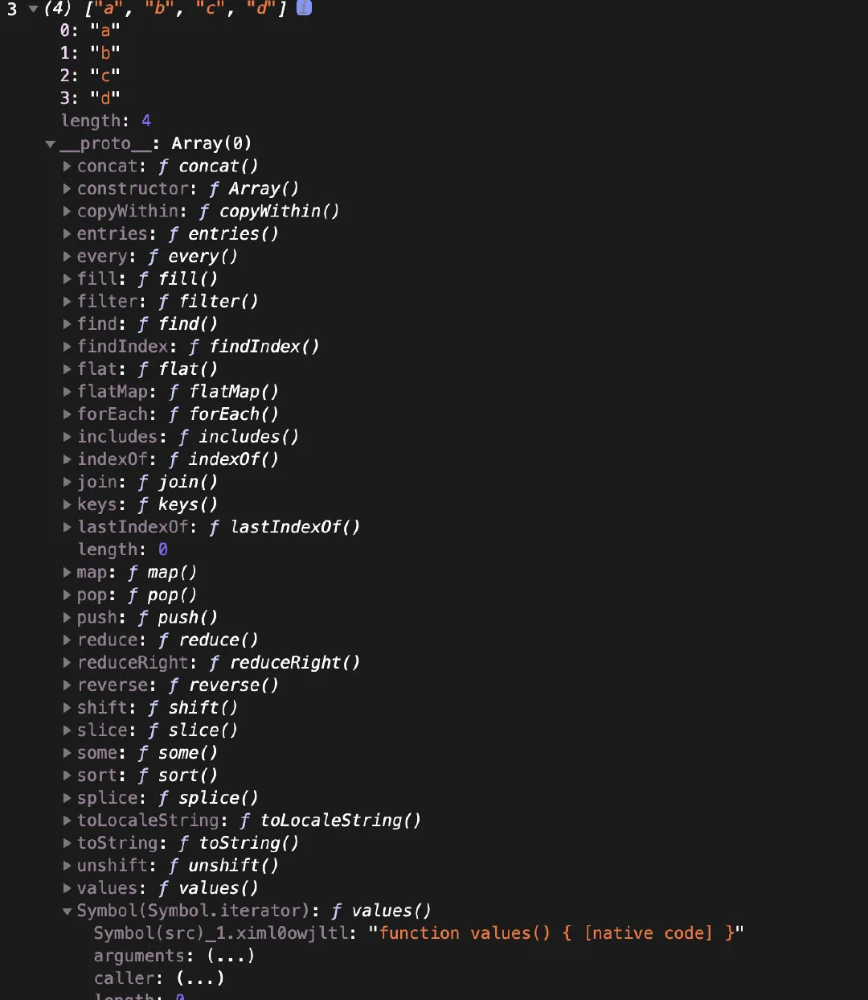

# 迭代器

## 一、什么是 Symbol？

Symbol 是 ES6 引入的一种基本数据类型，表示一个唯一且不可变的值。它的主要特点是：

* 唯一性：每次调用 Symbol() 或 Symbol('description') 都会生成一个新的、独一无二的值，即使描述相同也不相等。
```javascript
const sym1 = Symbol('id');
const sym2 = Symbol('id');
console.log(sym1 === sym2); // false
```
* 不可枚举：在对象的 for...in 或 Object.keys() 中，Symbol 属性不会被遍历到。

* 不可变：Symbol 值无法被修改。

这些特性为迭代器协议选择 Symbol.iterator 提供了关键优势。


标准的内置迭代器，也可以构造自己的迭代器
消费者工具(for..of 循环以及...运算)

迭代有着一套属于自己的迭代协议，这规定了迭代与实现的逻辑，它之所以能够工作是因为依靠着迭代器(具体的迭代实现逻辑)、迭代对象(实现了[Symbol.iterator]方法的可被迭代对象)和迭代语句(例如 for...in 和 for..of)

```js
var obj = {
  a: 1,
  b: 2,
};

for (var i of obj) {
  //obj is not iterable
  console.log(i, obj[i]);
}

// 执行的顺序为
// Uncaught TypeError: obj is not iterable
```

因为引擎不知道怎么遍历这个对象，是要遍历所有 key 为数字的属性呢，还是一视同仁遍历这个对象的全部属性呢？

毋庸置疑，Array，Map，Set，String 等等类可以在被 for...of 中执行，因为它们都实现了 Symbol.iterator 接口。

```js
[][Symbol.iterator]
// ƒ values() { [native code] }

('')[Symbol.iterator]
// ƒ values() { [native code] }

(new Map())[Symbol.iterator]
// ƒ values() { [native code] }

(new Set())[Symbol.iterator]
// ƒ values() { [native code] }
```

而 Number，Object 就没有实现 [Symbol.iterator]。

```js
({})[Symbol.iterator]
// undefined

(0)[Symbol.iterator]
// undefined
```



来查看一下对象是否有实现[Symbol.iterator],结果是对象上默认是不支持迭代的，没有[Symbol.iterator],这也就解释了为什么通过 for...of 默认迭代不了对象的原因。

```js
let obj = {
  a: 1,
  b: 2,
  c: 3,
};

obj[Symbol.iterator] = function () {
  // 迭代协议--希望根据什么规则来循环
  // values=[1,2,3]
  let values = Object.values(obj);

  // console.log(values) //[1,2,3]
  // 用来遍历values的值  values[0]、 values[1]、 values[2]
  let index = 0;

  return {
    next() {
      if (index >= values.length) {
        return {
          //是否循环是否遍历迭代完成
          //循环结束时不会在走到for-of里面
          //循环执行完成就算这里写了value也是没有用的不会再影响循环结果了
          done: true,
          value: "无用",
        };
      } else {
        return {
          //一直没有执行完成
          done: false,
          //value是我们在循环过程中的值
          value: values[index++],
        };
      }
    },
  };
};
```

遍历器（Iterator）就是这样一种机制。它是一种接口，为各种不同的数据结构提供统一的访问机制。任何数据结构只要部署 Iterator 接口，就可以完成遍历操作（即依次处理该数据结构的所有成员）。

Iterator 的作用有三个：一是为各种数据结构，提供一个统一的、简便的访问接口；二是使得数据结构的成员能够按某种次序排列；三是 ES6 创造了一种新的遍历命令 for...of 循环，Iterator 接口主要供 for...of 消费

Iterator 的遍历过程是这样的。

（1）创建一个指针对象，指向当前数据结构的起始位置。也就是说，遍历器对象本质上，就是一个指针对象。

（2）第一次调用指针对象的 next 方法，可以将指针指向数据结构的第一个成员。

（3）第二次调用指针对象的 next 方法，指针就指向数据结构的第二个成员。

（4）不断调用指针对象的 next 方法，直到它指向数据结构的结束位置。

每一次调用 next 方法，都会返回数据结构的当前成员的信息。具体来说，就是返回一个包含 value 和 done 两个属性的对象。其中，value 属性是当前成员的值，done 属性是一个布尔值，表示遍历是否结束。

```js
function makeIterator(array) {
  var nextIndex = 0;
  return {
    next: function () {
      return nextIndex < array.length
        ? { value: array[nextIndex++] }
        : { done: true };
    },
  };
}
```

```js
interface Iterable {
  [Symbol.iterator]() : Iterator,
}

interface Iterator {
  next(value?: any) : IterationResult,
}

interface IterationResult {
  value: any,
  done: boolean,
}
```

```js
const arr = ['0', '1', '2']

const iterator = arr[Symbol.iterator]()

iterator.next()
// {value: '0', done: false}

iterator.next()
// {value: '1', done: false}

iterator.next()
// {value: '2', done: false}

iterator.next()
// {value: undefined, done: true}
```