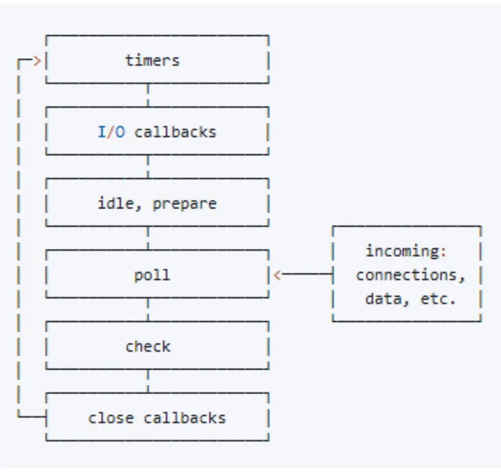

# 浏览器与 node 的事件循环(event loop)有何区别

1. timer  
   执行 setTimeout（）和 setInterval 设定的回调
2. I/O callbacks
3. idel, prepare 仅内部使用
4. poll 获取新的 i/o 事件， 在适当条件下， node。js 会在这里堵塞
5. check setimmediate（）设定的回调会在这一阶段执行
6. close callbacks socket.on（"close"， callback）的回调在这一阶段执行

##

- 一个进程由一个或多个线程组成，线程是一个进程中代码的不同执行路线；
- 一个进程的内存空间是共享的，每个线程都可用这些共享内存

## 多线程 与 多进程

JS 是单线程执行的，指的是一个进程里只有一个主线程，

以 Chrome 浏览器中为例，当你打开一个 Tab 页时，其实就是创建了一个进程，一个进程中可以有多个线程（下文会详细介绍），比如渲染线程、JS 引擎线程、HTTP 请求线程等等。当你发起一个请求时，其实就是创建了一个线程，当请求结束后，该线程可能就会被销毁。

一个浏览器通常由下面组成

GUI 渲染线程
JavaScript 引擎线程
定时触发器线程
事件触发线程
异步 http 请求线程

macro（宏任务）队列和 micro（微任务）队列。宏任务队列可以有多个，微任务队列只有一个。

常见的 macro-task 比如：setTimeout(整体)、setInterval、 setImmediate(Node 独有)、script（整体代码）、 I/O 操作、UI 渲染等。
常见的 micro-task 比如: process.nextTick(node 独有)、new Promise().then(回调)、MutationObserver(html5 新特性) 等。

在同一个上下文中，总的执行顺序为同步代码—>microTask—>macroTask。

一开始执行栈空, macro 队列有且只有一个 script 脚本

全局上下文(script 标签) 被推入执行栈, 同步代码执行.在执行的过程中，会判断是同步任务还是异步任务，通过对一些接口的调用，可以产生新的 macro-task 与 micro-task，它们会分别被推入各自的任务队列里。同步代码执行完了，script 脚本会被移出 macro 队列，这个过程本质上是队列的 macro-task 的执行和出队的过程。

上一步我们出队的是一个 macro-task, 这一步我们处理的是 micro-task. 当 macro-task 出队时, 任务是一个个执行的, 而 micro-task 出队时, 任务时一队一队执行的.因此 处理 micro 队列这一步, 会逐个执行队列中的任务并把它出队, 知道队列被清空.

执行渲染操作,更新界面
检查是否存在 web worker 任务, 如果有, 则对其进行处理
上述过程循环往复, 直到两队列清空

## Node 中的 Event Loop

1. Node 采用 V8 作为 js 的解析引擎, 而 I/O 处理方面使用了自己设计的 libuv, 而 libuv 是一个基于时间驱动的跨平台抽象层, 封装了不同操作系统一些底层特性, 对外提供统一的 API, 事件循环机制也是它里面实现的.

Node 的运行机制如下:

1. v8 引擎解析 JavaScript 脚本
2. 解析后的代码,调用 Node API
3. libuv 库负责 Node API 的执行,. 它将不同的任务分配给不同的线程, 形成一个 Event Loop(事件循环), 以异步的方式将任务的执行结果返回给 V8 引擎
4. V8 引擎再将结果返回给用户

5. 六个阶段

其中 libuv 引擎中的事件循环分为 6 个 阶段, 他们会按照顺序反复运行. 每当进入某一个阶段的时候, 都会从对应的回调队列中取出函数去执行. 当队列为空或者执行的回调函数数量到达系统设定的阙值.就会进入下一个阶段.

外部输入数据 –> 轮询阶段(poll)–> 检查阶段(check)–> 关闭事件回调阶段(close callback)–> 定时器检测阶段(timer)–> I/O 事件回调阶段(I/O callbacks)–> 闲置阶段(idle, prepare)–> 轮询阶段（按照该顺序反复运行）

- timers 阶段：这个阶段执行 timer（setTimeout、setInterval）的回调
- I/O callbacks 阶段：处理一些上一轮循环中的少数未执行的 I/O 回调
- idle, prepare 阶段：仅 node 内部使用
- poll 阶段：获取新的 I/O 事件, 适当的条件下 node 将阻塞在这里
- check 阶段：执行 setImmediate() 的回调
- close callbacks 阶段：执行 socket 的 close 事件回调

浏览器和 Node 环境下，microtask 任务队列的执行时机不同

- Node 端，microtask 在事件循环的各个阶段之间执行
- 浏览器端，microtask 在事件循环的 macrotask 执行完之后执行

## 坑

了解浏览器的 eventloop 可能就知道，浏览器的宏任务队列执行了一个，就会执行微任务。

简单的说，可以把浏览器的宏任务和 node10 的 timers 比较，就是 node10 只有全部执行了 timers 阶段队列的全部任务才执行微任务队列，而浏览器只要执行了一个宏任务就会执行微任务队列。

现在 node11 在 timer 阶段的 setTimeout,setInterval…和在 check 阶段的 immediate 都在 node11 里面都修改为一旦执行一个阶段里的一个任务就立刻执行微任务队列。

## 总结

1. 同一个上下文下，MicroTask 会比 MacroTask 先运行
2. 然后浏览器按照一个 MacroTask 任务，所有 MicroTask 的顺序运行，Node 按照六个阶段的顺序运行，并在每个阶段后面都会运行 MicroTask 队列
3. 同个 MicroTask 队列下 process.tick()会优于 Promise

## 参考文献

[浏览器与 Node 的事件循环(Event Loop)有何区别?](https://blog.fundebug.com/2019/01/15/diffrences-of-browser-and-node-in-event-loop/)
