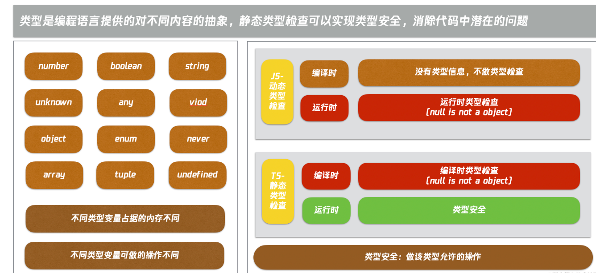

# 类型体操

不同类型变量占据的内存大小不同
boolean 类型的变量会分配 4 个字节的内存，而 number 类型的变量则会分配 8 个字节的内存，给变量声明了不同的类型就代表了会占据不同的内存空间。

不同类型变量可做的操作不同
number 类型可以做加减乘除等运算，boolean 就不可以，复合类型中不同类型的对象可用的方法不同，比如 Date 和 RegExp，变量的类型不同代表可以对该变量做的操作就不同。

综上，可以得到一个简单的结论就是，类型就是编程语言提供对不同内容的抽象定义。

## 类型安全

一个简单的定义就是，类型安全就是只做该类型允许的操作。比如对于 boolean 类型，不允许加减乘除运算，只允许赋值 true、false。

## 实现类型安全



## 3 种类型系统

1. 简单类型系统

简单类型系统，它只基于声明的类型做检查，比如一个加法函数，可以加整数也可以加小数，但在简单类型系统中，需要声明 2 个函数来做这件事情。

```ts
int add(int a, int b) {
    return a + b
}

double add(double a, double b) {
    return a + b
}
```

[简单类型系统](https://p3-juejin.byteimg.com/tos-cn-i-k3u1fbpfcp/1de477f89198406793a5b263495202e9~tplv-k3u1fbpfcp-watermark.image)

2. 泛型类型系统

泛型类型系统，它支持类型参数，通过给参数传参，可以动态定义类型，让类型更加灵活。

```·ts

T add<T>(T a, T b) {
    return a + b
}

add(1, 2)
add(1.1, 2.2)
```

但是在一些需要类型参数逻辑运算的场景就不适用了，比如一个返回对象某个属性值的函数类型。

```ts
function getPropValue<T>(obj: T, key) {
  return obj[key];
}
```

[](https://p3-juejin.byteimg.com/tos-cn-i-k3u1fbpfcp/5d2dcc91b09b45f8aaf83bd709ca90a3~tplv-k3u1fbpfcp-watermark.image)

3. 类型编程系统

类型编程系统，它不仅支持类型参数，还能给类型参数做各种逻辑运算，比如上面提到的返回对象某个属性值的函数类型，可以通过 keyof、T[K] 来逻辑运算得到函数类型。

[](https://p1-juejin.byteimg.com/tos-cn-i-k3u1fbpfcp/1d5df41e4c594395ae48a1e549cca4c8~tplv-k3u1fbpfcp-watermark.image)

**类型体操就是类型编程，对类型参数做各种逻辑运算，以产生新的类型。**

之所以称之为体操，是因为它的复杂度，右侧是一个解析参数的函数类型，里面用到了很多复杂的逻辑运算，等先介绍了类型编程的运算方法后，再来解析这个类型的实现。
[](https://p6-juejin.byteimg.com/tos-cn-i-k3u1fbpfcp/67d0e24ef2c24eb59776f6cd69e5708b~tplv-k3u1fbpfcp-watermark.image)

## 了解类型体操

1. 有哪些类型

类型体操的主要类型列举在图中。Typescript 复用了 JS 的基础类型和复合类型，并新增元组（Tuple）、接口（Interface）、枚举（Enum）等类型，这些类型在日常开发过程中类型声明应该都很常用。

[类型](https://p9-juejin.byteimg.com/tos-cn-i-k3u1fbpfcp/51221a5aa57b47e9a4637a9a086846a7~tplv-k3u1fbpfcp-watermark.image)

2. 运算逻辑

TypeScript 支持条件、推导、联合、交叉、对联合类型做映射等 9 种运算逻辑。

[运算逻辑](https://p9-juejin.byteimg.com/tos-cn-i-k3u1fbpfcp/3bb62c81a55b45e8b8c12cb89559e3db~tplv-k3u1fbpfcp-watermark.image)

- 条件：T extends U ? X : Y

条件判断和 js 逻辑相同，都是如果满足条件就返回 a 否则返回 b。

```ts
// 条件：extends ? :
// 如果 T 是 2 的子类型，那么类型是 true，否则类型是 false。
type isTwo<T> = T extends 2 ? true : false;
// false
type res = isTwo<1>;
```

- 约束：extends

通过约束语法 extends 限制类型。

```ts
// 通过 T extends Length 约束了 T 的类型，必须是包含 length 属性，且 length 的类型必须是 number。
interface Length {
  length: number;
}

function fn1<T extends Length>(arg: T): number {
  return arg.length;
}
```

- 推导：infer

推导则是类似 js 的正则匹配，都满足公式条件时，可以提取公式中的变量，直接返回或者再次加工都可以。

```ts
// 推导：infer
// 提取元组类型的第一个元素：
// extends 约束类型参数只能是数组类型，因为不知道数组元素的具体类型，所以用 unknown。
// extends 判断类型参数 T 是不是 [infer F, ...infer R] 的子类型，如果是就返回 F 变量，如果不是就不返回
type First<T extends unknown[]> = T extends [infer F, ...infer R] ? F : never;
// 1
type res2 = First<[1, 2, 3]>;
```

- 联合：|
  联合代表可以是几个类型之一。

```ts
type Union = 1 | 2 | 3;
```

- 交叉：&
  交叉代表对类型做合并。

```ts
type ObjType = { a: number } & { c: boolean };
```

- 索引查询：keyof T
  keyof 用于获取某种类型的所有键，其返回值是联合类型。

```ts
// const a: 'name' | 'age' = 'name'
const a: keyof {
  name: string;
  age: number;
} = "name";
```

- 索引访问：T[K]
  T[K] 用于访问索引，得到索引对应的值的联合类型。

```ts
interface I3 {
  name: string;
  age: number;
}

type T6 = I3[keyof I3]; // string | number
```

- 索引遍历： in
  in 用于遍历联合类型。

```ts
const obj = {
  name: "tj",
  age: 11,
};

type T5 = {
  [P in keyof typeof obj]: any;
};

/*
{
  name: any,
  age: any
}
*/
```

- 索引重映射： as
  as 用于修改映射类型的 key。

```ts
// 通过索引查询 keyof，索引访问 t[k]，索引遍历 in，索引重映射 as，返回全新的 key、value 构成的新的映射类型
type MapType<T> = {
  [Key in keyof T as `${Key & string}${Key & string}${Key & string}`]: [
    T[Key],
    T[Key],
    T[Key]
  ];
};
// {
//     aaa: [1, 1, 1];
//     bbb: [2, 2, 2];
// }
type res3 = MapType<{ a: 1; b: 2 }>;
```

3. 运算套路

   1. 模式匹配做提取；
   2. 重新构造做变换；
   3. 递归复用做循环；
   4. 数组长度做计数。

```ts

```

```ts

```

##
