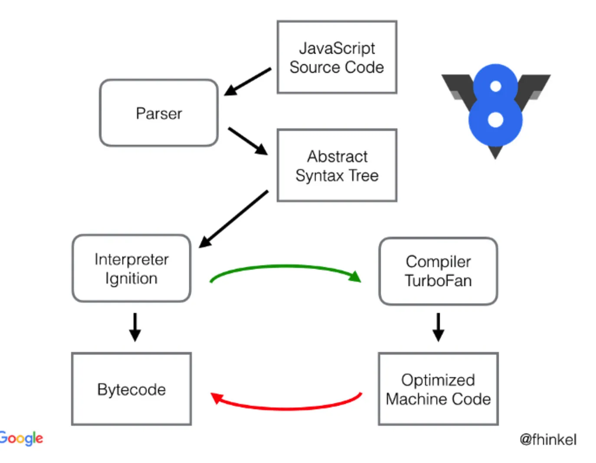

# v8 引擎

## 内部解析

V8 由许多子模块构成，其中这 4 个模块是最重要的：

- Parser：负责将 JavaScript 源码转换为 Abstract Syntax Tree (AST)
- Ignition：interpreter，即解释器，负责将 AST 转换为 Bytecode，解释执行 Bytecode；同时收集 TurboFan 优化编译所需的信息，比如函数参数的类型；
- TurboFan：compiler，即编译器，利用 Ignitio 所收集的类型信息，将 Bytecode 转换为优化的汇编代码；
- Orinoco：garbage collector，垃圾回收模块，负责将程序不再需要的内存空间回收；

Parser 将 JS 源码转换为 AST，然后 Ignition 将 AST 转换为 Bytecode，最后 TurboFan 将 Bytecode 转换为经过优化的 Machine Code(实际上是汇编代码)。

- 如果函数没有被调用，则 V8 不会去编译它。
- 如果函数只被调用 1 次，则 Ignition 将其编译 Bytecode 就直接解释执行了。TurboFan 不会进行优化编译，因为它需要 Ignition 收集函数执行时的类型信息。这就要求函数至少需要执行 1 次，TurboFan 才有可能进行优化编译。
- 如果函数被调用多次，则它有可能会被识别为热点函数，且 Ignition 收集的类型信息证明可以进行优化编译的话，这时 TurboFan 则会将 Bytecode 编译为 Optimized Machine Code，以提高代码的执行性能。

图片中的红线是逆向的，这的确有点奇怪，Optimized Machine Code 会被还原为 Bytecode，这个过程叫做 Deoptimization。这是因为 Ignition 收集的信息可能是错误的，比如 add 函数的参数之前是整数，后来又变成了字符串。生成的 Optimized Machine Code 已经假定 add 函数的参数是整数，那当然是错误的，于是需要进行 Deoptimization。
