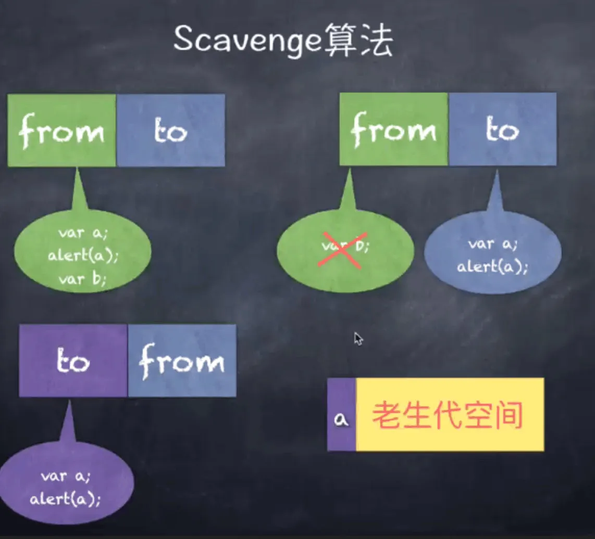
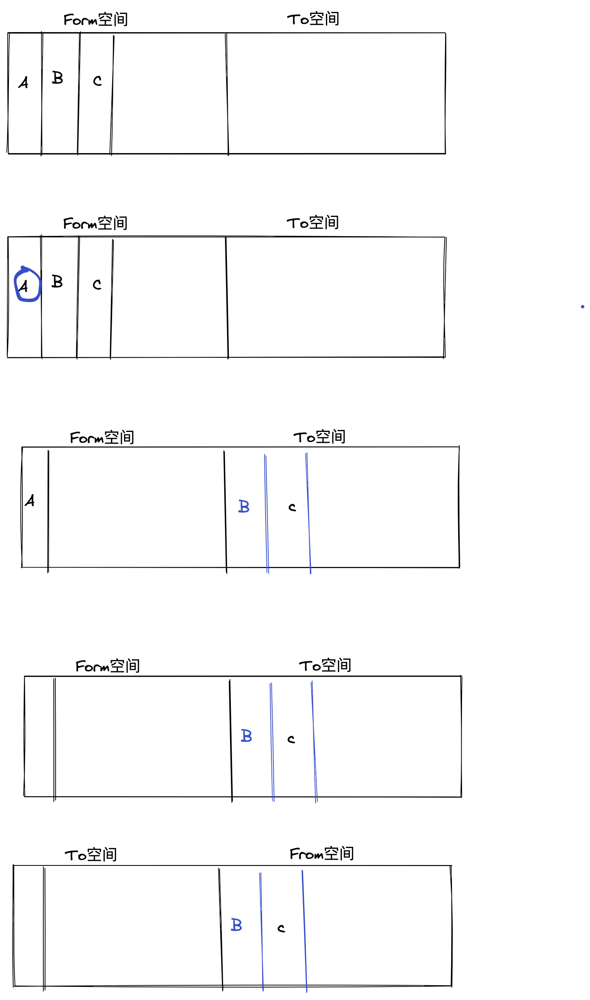
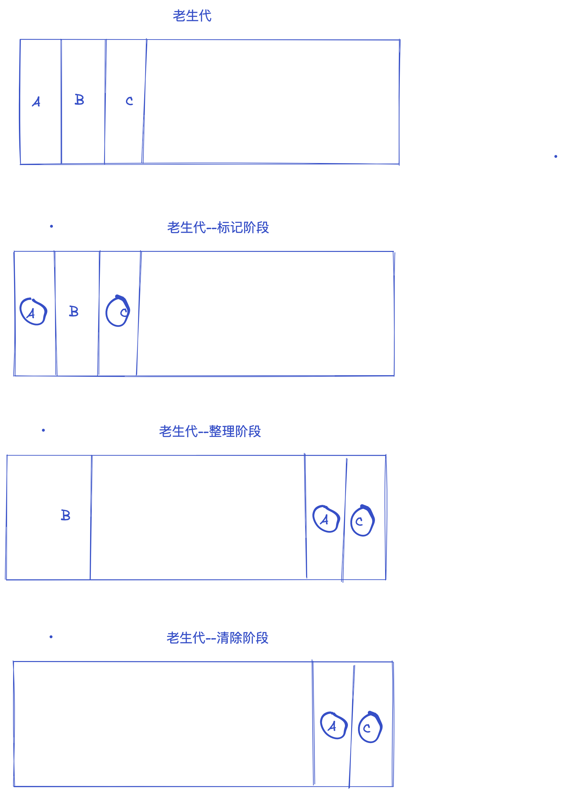
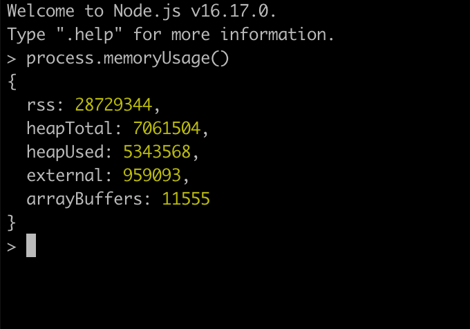

# v8 垃圾回收机制

垃圾回收(garbage collection),这里的垃圾,指的是程序中不再需要的内存空间.

常见内存泄露场景

1. 缓存
2. 作用域未释放(闭包)

```js
var leakArray = [];
exports.leak = function () {
  leakArray.push("leak" + Math.random());
};
```

模块在编译执行后形成的作用域因为模块缓存的原因,不被释放,每次调用 leak 方法,都会导致局部变量 leakArray 不停增加且不被释放.

3. 没有必要的全局变量

4. 无效的 DOM 引用

```js
//dom still exist
function click() {
  // 但是 button 变量的引用仍然在内存当中。
  const button = document.getElementById("button");
  button.click();
}

// 移除 button 元素
function removeBtn() {
  document.body.removeChild(document.getElementById("button"));
}
```

5. 定时器未清除

常见内存泄露问题

1. 无限制增长的数组
2. 无限制设置属性和值
3. 任何模块内的私有变量和方法均是永驻内存的 a= null
4. 大循环,无 gc 机会

## 垃圾回收算法

垃圾回收算法: 最困难的问题是如何确定哪些内存空间是可以回收的，即哪些内存空间是程序不再需要的，这是一个不可判定问题(undecidable problem)。所谓不可判定，就是没有哪个垃圾回收算法可以确定程序中所有可以回收的内存空间。

垃圾回收算法都是基于 mark-and-sweep：

- root 对象包括全局对象以及程序当前的执行堆栈；
- 从 root 对象出发，遍历其所有子对象，能够通过遍历访问到的对象是可以访问的
- 其他不能遍历对象是不可访问的，其内存空间可以回收；

## 策略:分代式垃圾回收机制

### 如何判断回收内容

如何确定哪些内存需要回收，哪些内存不需要回收，这是垃圾回收期需要解决的最基本问题。我们可以这样假定，一个对象为活对象当且仅当它被一个根对象 或另一个活对象指向。根对象永远是活对象，它是被浏览器或 V8 所引用的对象。被局部变量所指向的对象也属于根对象，因为它们所在的作用域对象被视为根对 象。全局对象（Node 中为 global，浏览器中为 window）自然是根对象。浏览器中的 DOM 元素也属于根对象。

### 回收流程

- 采用多线程的方式进行垃圾回收，尽量避免对 JavaScript 本身的代码执行造成暂停；
- 利用浏览器渲染页面的空闲时间进行垃圾回收；
- 根据 The Generational Hypothesis，大多数对象的生命周期非常短暂，因此可以将对象根据生命周期进行区分，生命周期短的对象与生命周期长的对象采用不同的方式进行垃圾回收；
- 对内存空间进行整理，消除内存碎片化，最大化利用释放的内存空间；

### 新生代

新生代存活时间比较短 老生代存活时间较长

新生代的对象主要通过 scavenge 算法进行垃圾回收, 在具体实现时主要采用 cheney 算法. cheney 算法是一种采用复制的方式实现的垃圾回收算法.它将内存一分为二,每个空间称为 Semispace. 这两个 Semispace 中一个处于使用,一个处于闲置.处于使用的称为 From,闲置的称之为 To.分配对象时先分配到 From,当开始进行垃圾回收时,检查 From 存活对象赋值到 To, 非存活被释放.然后互换位置.再次进行回收,发现被回收过直接晋升,或者发现 To 空间已经使用了超过 25%. 它的缺点是只能使用堆内存的一半,这是一个典型的空间换时间的方法,但是新生代声明周期较短,恰恰就适合这个算法.



新生代内存是由两个 semispace(半空间)构成的，内存最大值在 64 位系统和 32 位系统上分别为 32MB 和 16MB，在新生代的垃圾回收过程中主要采用了 Scavenge 算法。

Scavenge 算法是一种典型的牺牲空间换取时间的算法，对于老生代内存来说，可能会存储大量对象，如果在老生代中使用这种算法，势必会造成内存资源的浪费，但是在新生代内存中，大部分对象的生命周期较短，在时间效率上表现可观，所以还是比较适合这种算法。

在 Scavenge 算法的具体实现中，主要采用了 Cheney 算法，它将新生代内存一分为二，每一个部分的空间称为 semispace，也就是我们在上图中看见的 new_space 中划分的两个区域，其中处于激活状态的区域我们称为 From 空间，未激活(inactive new space)的区域我们称为 To 空间。这两个空间中，始终只有一个处于使用状态，另一个处于闲置状态。我们的程序中声明的对象首先会被分配到 From 空间，当进行垃圾回收时，如果 From 空间中尚有存活对象，则会被复制到 To 空间进行保存，非存活的对象会被自动回收。当复制完成后，From 空间和 To 空间完成一次角色互换，To 空间会变为新的 From 空间，原来的 From 空间则变为 To 空间。



对象晋升

当一个对象在经历过多次复制之后依旧存活，那么它会被认为是一个生命周期较长的对象，在下一次进行垃圾回收时，该对象会被直接转移到老生代中，这种对象从新生代转移到老生代的过程我们称之为晋升

对象晋升的条件主要有以下两个：

- 对象是否经历过一次 Scavenge 算法
- To 空间的内存占比是否已经超过 25%

### 老生代

v8 老生代主要采用标记清除算法 (Mark-Sweep) 和标记压缩算法( Mark-compact), 在用 Scavenge 不合适.一个是对象较多需要赋值量太大而且还是没能解决空间问题. Mark-Sweep 是标记清除, 标记哪些死亡的对象,然后清除. 但是清楚过后出现内存不连续的情况,所以我们要使用 Mark-compact,他是基于 Mark-Sweep 演变而来的,他先将活着的对象移到右边,移动完成后, 直接清理边界外的内存. 当 cpu 空间不足的时候会非常的高效.v8 后续还引入了延迟处理,增量处理, 并引入并行标记处理.

在老生代中，因为管理这大量存活对象，如果依旧使用 Scavenge 算法，很明显会浪费一半的内存，因此已经不在使用 Scavenge 算法，而是采用新的算法 Mark-Sweep（标记清除） 和 Mark-Compact（标记整理）来进行管理

Mark-Sweep(标记清除)分为标记和清除两个阶段，在标记阶段会遍历堆中的所有对象，然后标记活着的对象，在清除阶段中，会将死亡的对象进行清除。Mark-Sweep 算法主要是通过判断某个对象是否可以被访问到，从而知道该对象是否应该被回收，具体步骤如下：

- 垃圾回收器会在内部构建一个根列表，用于从根节点出发去寻找那些可以被访问到的变量。比如在 JavaScript 中，window 全局对象可以看成一个根节点。

- 然后，垃圾回收器从所有根节点出发，遍历其可以访问到的子节点，并将其标记为活动的，根节点不能到达的地方即为非活动的，将会被视为垃圾。

- 最后，垃圾回收器将会释放所有非活动的内存块，并将其归还给操作系统。


以下几种情况都可以作为根节点：

- 全局对象
- 本地函数的局部变量和参数
- 当前嵌套调用链上的其他函数的变量和参数

但是 Mark-Sweep 算法存在一个问题，就是在经历过一次标记清楚后，内存空间可能会出现不连续的状态，因为我们所清理的对象的内存地址可能不是连续的，所以就会出现内存碎片的问题，导致后面如果需要分配一个大对象而空闲内存不足以分配，就会提前触发垃圾回收，而这次垃圾回收其实是没必要的，因为我们确实有很多空闲内存，只不过是不连续的。

为了解决这种内存碎片的问题，Mark-Compact(标记整理)算法被提了出来，该算法主要就是用来解决内存的碎片化问题的，回收过程中将死亡对象清除后，在整理的过程中，会将活动的对象往堆内存的一端进行移动，移动完成后再清理掉边界外的全部内存，我们可以用如下流程图来表示：

因此，为了减少垃圾回收带来的停顿时间，V8 引擎又引入了 Incremental Marking(增量标记)的概念，即将原本需要一次性遍历堆内存的操作改为增量标记的方式，先标记堆内存中的一部分对象，然后暂停，将执行权重新交给 JS 主线程，待主线程任务执行完毕后再从原来暂停标记的地方继续标记，直到标记完整个堆内存。这个理念其实有点像 React 框架中的 Fiber 架构，只有在浏览器的空闲时间才会去遍历 Fiber Tree 执行对应的任务，否则延迟执行，尽可能少地影响主线程的任务，避免应用卡顿，提升应用性能。

得益于增量标记的好处，V8 引擎后续继续引入了延迟清理(lazy sweeping)和增量式整理(incremental compaction)，让清理和整理的过程也变成增量式的。同时为了充分利用多核 CPU 的性能，也将引入并行标记和并行清理，进一步地减少垃圾回收对主线程的影响，为应用提升更多的性能。

老生代中的空间很复杂,有如下几个空间:

```js
enum AllocationSpace {
  // TODO(v8:7464): Actually map this space's memory as read-only.
  RO_SPACE,    // 不变的对象空间
  NEW_SPACE,   // 新生代用于 GC 复制算法的空间
  OLD_SPACE,   // 老生代常驻对象空间
  CODE_SPACE,  // 老生代代码对象空间
  MAP_SPACE,   // 老生代 map 对象
  LO_SPACE,    // 老生代大空间对象
  NEW_LO_SPACE,  // 新生代大空间对象

  FIRST_SPACE = RO_SPACE,
  LAST_SPACE = NEW_LO_SPACE,
  FIRST_GROWABLE_PAGED_SPACE = OLD_SPACE,
  LAST_GROWABLE_PAGED_SPACE = MAP_SPACE
};
```

v8 引擎的内存限制
默认情况下： v8 引擎在 64 位系统下最多只能使用约 1.4gb 的内存，在 32 位中最多只能使用约 0.7GB 的内存，在这样的限制下，必然会导致在 node 中无法直接操作大内存对象的。



- heapTotal：表示 V8 当前申请到的堆内存总大小。
- heapUsed：表示当前内存使用量。
- external：表示 V8 内部的 C++对象所占用的内存。
- rss(resident set size)：表示驻留集大小，是给这个 node 进程分配了多少物理内存，这些物理内存中包含堆，栈和代码片段。对象，闭包等存于堆内存，变量存于栈内存，实际的 JavaScript 源代码存于代码段内存。使用 Worker 线程时，rss 将会是一个对整个进程有效的值，而其他字段则只针对当前线程。

在 JS 中声明对象时，该对象的内存就分配在堆中，如果当前已申请的堆内存已经不够分配新的对象，则会继续申请堆内存直到堆的大小超过 V8 的限制为止。

V8 的内存结构：

- 新生代：大多数的对象开始都会被分配在这里，这个区域相对较小但是垃圾回收特别频繁，该区域被分为两半，一半用来分配内存，另一半用于在垃圾回收时将需要保留的对象复制过来。

- 老生代：新生代中的对象在存活一段时间后就会被转移到老生代内存区，相对于新生代该内存区域的垃圾回收频率较低。老生代又分为老生代指针区和老生代数据区，前者包含大多数可能存在指向其他对象的指针的对象，后者只保存原始数据对象，这些对象没有指向其他对象的指针。

- 大对象区(large_object_space)：存放体积超越其他区域大小的对象，每个对象都会有自己的内存，垃圾回收不会移动大对象区。

- 代码区(code_space)：代码对象，会被分配在这里，唯一拥有执行权限的内存区域。

- map 区(map_space)：存放 Cell 和 Map，每个区域都是存放相同大小的元素，结构简单(这里没有做具体深入的了解，有清楚的小伙伴儿还麻烦解释下)。
