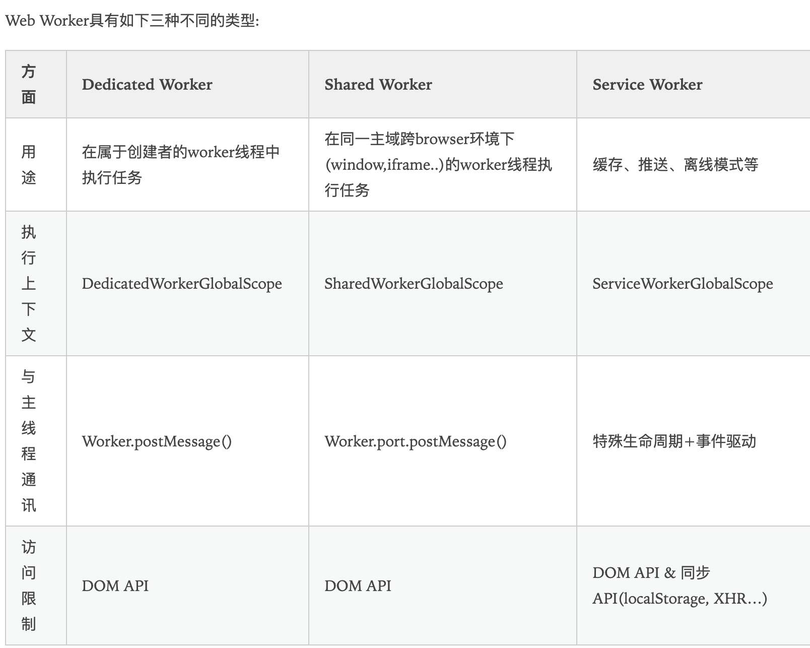

# h5 新增特性

1. <简化的文档类型和字符集>

```jsx
<!DOCTYPE HTML>
```

```jsx
<meta charset="UTF-8">
```

2. 标签更加语义化

3. 新增的内联元素

figure 元素

time 元素

4. 支持动态页面

- 1 菜单 \<menu>
- 2.右键菜单 \<menitem>
- 3.\<script> //标签用使用 async 属性
- 4.detail 元 用于描述文档细节

  5.全新的表单设计

  h5 新的 input 类型 emial url number range date pickers

h5 的新的表单元素

新的 form 属性 autocomplete novalidate

新的 input 属性 autofocus form form overrides

6.强大的绘图功能和多媒体功能

canvas svg aduio video

7.打造桌面应用的一系列新功能

web stroage

localstorage 5M

支持 websql 等轻量级数据库， 可以开发支持离线 web 应用程序

关闭浏览器后再次打开时恢复数据，以减少网络流量

8.获取地理位置信息

9.支持多线程

新增 webworker 对象 可以在后台运行 js 脚本 也就是支持多线程，从而提高了页面加载效率

关于 webworker 可以创建多个 worker 线程 小规模分布式计算

- 不能使用
- Web Worker 无法访问 DOM 节点；
- Web Worker 无法访问全局变量或是全局函数；
- Web Worker 无法调用 alert()或者 confirm 之类的函数；
- Web Worker 无法访问 window、document 之类的浏览器全局变量

- 可以使用

setTimeout setInterval ajax 通信

webworker 分为两种 专用线程 dedicated web worker 共享线程 shared web worker

dedicated web worker 随当前页面关闭而关闭 只能被当前创建页面所访问



5. webworker 使用 xmlhttprequest 与服务端通信

```jsx
addEventListener(
  "message",
  function (evt) {
    var xhr = new XMLHttpRequest();
    xhr.open("GET", "lengthytaskhandler.ashx");
    xhr.onload = function () {
      postMessage(xhr.responseText);
    };
    xhr.send();
  },
  false
);
```

```java
namespace WebWorkerDemo {
    public class LengthyTaskHandler: IHttpHandler
    {
public void ProcessRequest(HttpContext context)
        {
            System.Threading.Thread.Sleep(10000);
            context.Response.ContentType = "text/plain";
            content.Response.Write("Processing successful!");
        }
public bool IsReusable
        {
            get
            {
                return false;
            }
        }
    }
}
```

6. 通过 error 事件捕捉错误信息

7. 通过 terminate() 方法终止 web worker

8. history 对象
