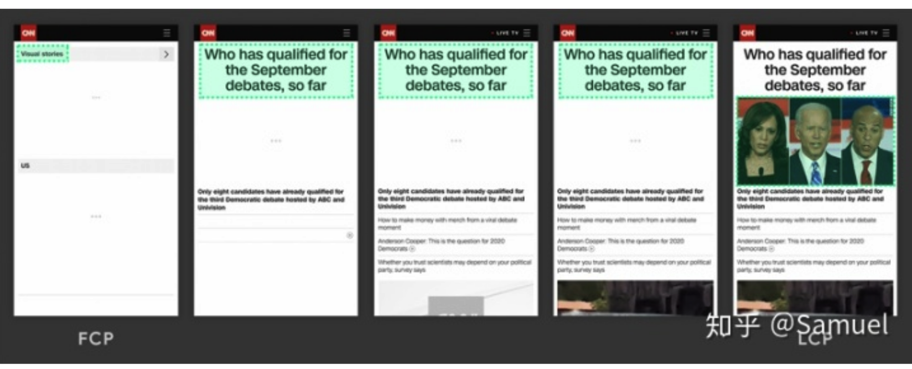
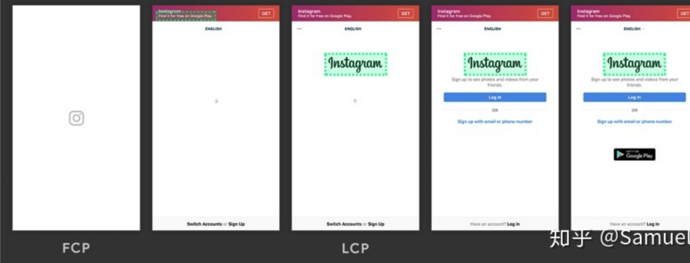
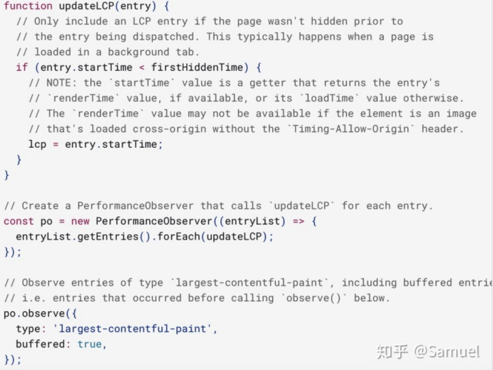
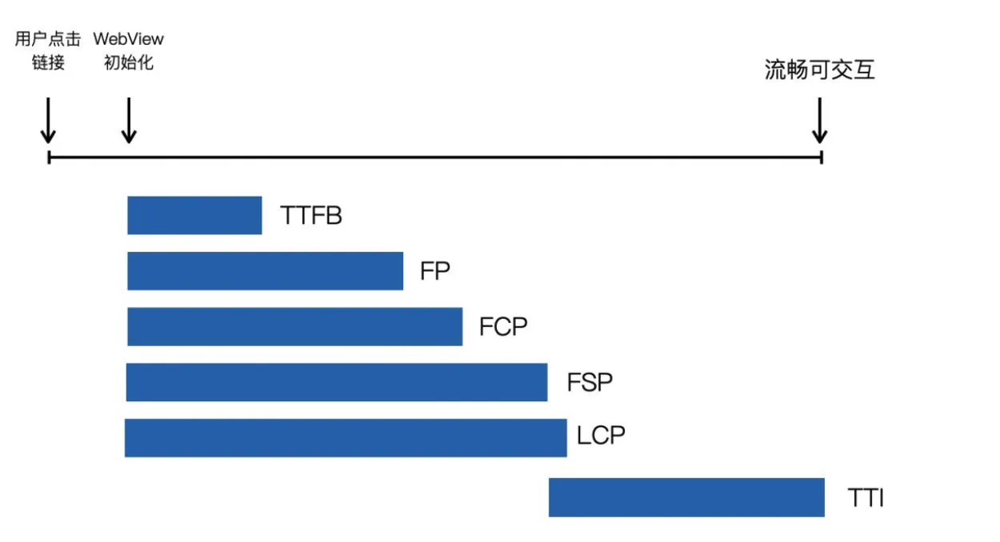
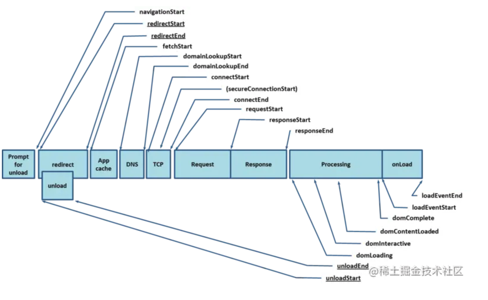

# 性能优化 页面的性能统计指标

在过去的翻页设计，常用 load 和 DOMContentLoaded 事件反应页面完成，淡了更精准的获取，得使用 FCP 指标
但是在 SPA 的时代，页面常常一开始是先显示一个载入图示，此时，FCP 就很难反应页面初次载入直到 Web 能够提供使用的那个时间点。

WICG 上则孵化了一个新的指标 LCP，简单清楚地以网页 Viewport 最大 Element 载入为基准点，衡量标准如下图，在 2.5 秒内载入最大 Element 为良好的网页载入速度。

其最大指的是实际 Element 长宽大小，Margin / Padding / Border 等 CSS 大小效果不计入。包含的种类为`, <image>, url(…), <video>`及包含文字节点的 Block 或 Inline Element，未来可能会再加入`<svg>`。

因为网页上的 Element 可能持续加载，最大的 Element 也可能持续改变 (如文字载入完，然后载入图片) ，所以当每一个当下最大的 Element 载完，浏览器会发出一个 PerformanceEntry Metric，直到使用者可以进行 Keydown / Scrolling / Tapping 等操作，Browser 才会停止发送 Entry，故只要抓到最后一次 Entry ，即能判断 LCP 的持续时间。

如下图所示，绿色区域是 LCP 不断改变的侦测对象，也能看到 FCP 与 LCP 的判断差异。



下图可以看到一开始的 <svg> 图片并没有被计入 LCP 的侦测对象。



开发者可透过 PerformanceObserver 及设定 Type 'largest-contentful-paint' 拿到 LCP 的时间，如下图所示。(建议使用 Chrome v83 以上版本)



可视元素偏移（CLS） 是指页面加载时的稳定性（也称为"视觉稳定性"）。换句话说：如果页面上的元素随着页面加载而移动，那么 CLS 就会变高，这是不好的。相反，你应该希望页面元素在加载时相当稳定。这样，当页面完全加载时，用户不必重新学习链接，图像和字段的位置，或者错误地点击某些内容。下面是一些可以执行的简单操作，能一定程度地减少 CLS。1.对任何媒体（视频、图片、GIF、信息图表等）使用设置大小属性维度：这样，用户的浏览器就可以确切地知道该元素将在该页面上占用多少空间。2.确保广告元素具有预留空间：否则，它们可能会突然出现在页面上，将内容向下，向上或向一侧推送。3.在首屏下方添加新的 UI 元素：这样，他们就不会将用户"期望"的内容向下推送。

## 指标

TTFB 第一个字节的时间 从点击链接到收到第一个字节内容的时间 0.8

FP 第一次绘制， 用户第一次看到任何像素内容的时间 白屏时间

FCP 第一次内容绘制 用户看到第一次有效内容的时间 首屏时间

Core Web Vitals 三大指标：

- Largest Contentful Paint (LCP): 衡量加载性能。为了提供一个好的用户体验，LCP 应该在 2.5 秒内。
- First Input Delay (FID): 衡量可交互性。为了提供一个好的用户体验，FID 应该在 100 毫秒内。
- Cumulative Layout Shift (CLS): 衡量视觉稳定性。为了提供一个好的用户体验，CLS 应该小于 0.1。



## 首屏时间 白屏时间

白屏时间(First Paint)：是指浏览器从响应用户输入网址地址，到浏览器开始显示内容的时间。

首屏时间(First Contentful Paint)：是指浏览器从响应用户输入网络地址，到首屏内容渲染完成的时间。

## 常见计算方式

1. 白屏时间计算

白屏时间(FP)

白屏时间 = 页面开始展示的时间点 - 开始请求的时间点

在 head 标签开始加一段脚本，用于记录白屏开始时间，在 head 标签结束之前，加一段脚本，用于计算白屏时间，有些浏览器可以调用 performance api 得出白屏结束时间，有些不支持，因此，计算方式分两种：

```js
<!DOCTYPE html>
<html>
<head>
    <meta charset="utf-8">
    <title>白屏</title>
    <script>
        // 不兼容 performance.timing 的浏览器
        window.pageStartTime = Date.now()
    </script>
        <!-- 页面 CSS 资源 -->
        <link rel="stylesheet" href="xx.css">
        <link rel="stylesheet" href="zz.css">
        <script>
            // 白屏结束时间
            window.firstPaint = Date.now()
            // 白屏时间
            console.log(firstPaint - performance.timing.navigationStart)
        </script>
</head>
<body>
    <h1>Hello World</h1>
</body>
</html>

```

2. 首屏时间计算：

首屏时间 = 首屏内容渲染结束时间点 - 开始请求的时间点

对于交互少的： 由于区别不大，所以自由选择
对于大型复杂页面： 需处理更多复杂的元素，白屏时间和首屏时间相隔比较远，这时候计算白屏时间更有用

白屏时间是小于首屏时间的

DOMContentLoaded 的值只能表示空白页（当前页面 body 标签里面没有内容）加载花费的时间

浏览器需要先加载 JS , 然后再通过 JS 来渲染页面内容，这个时候单页面类型首屏才算渲染完成

常见计算方式：

用户自定义打点：

MutationObserver 接口

```javascript
function mountObserver() {
  if (!window.MutationObserver) {
    // 不支持 MutationObserver 的话
    console.warn("MutationObserver 不支持，首屏时间无法被采集");
    return;
  }

  // 每次 dom 结构改变时，都会调用里面定义的函数
  const observer = new window.MutationObserver(() => {
    const time = getTimestamp() - this.startTime; // 当前时间 - 性能开始计算时间

    const body = document.querySelector("body");
    let score = 0;

    if (body) {
      score = traverseEl(body, 1, false);
      this.observerData.push({ score, time });
    } else {
      this.observerData.push({ score: 0, time });
    }
  });

  // 设置观察目标，接受两个参数: target：观察目标，options：通过对象成员来设置观察选项
  // 设为 childList: true, subtree: true 表示用来监听 DOM 节点插入、删除和修改时
  observer.observe(document, { childList: true, subtree: true });

  this.observer = observer;

  if (document.readyState === "complete") {
    // MutationObserver监听的最大时间，10秒，超过 10 秒将强制结束
    this.unmountObserver(10000);
  } else {
    win.addEventListener(
      "load",
      () => {
        this.unmountObserver(10000);
      },
      false
    );
  }
}
```

lighthouse 中 我们可以得到 fcp 值， fcp 首次有效绘制 表示页面的主要内容开始出现在屏幕上的时间点，它是我们测量用户加载体验的主要指标。我们可以认为 fcp 的值就是首屏时间。

- 如果页面首屏有图片

首屏时间 = 首屏图片全部加载完毕的时刻 - window.performance.timing.navigationStart

- 如果页面首屏没有图片

首屏时间 = 页面处于稳定状态前最后一次 dom 变化的时刻 - window.performance.timing.navigationStart

FCP（First ContentFull Paint）：白屏时间（第一个文本绘制时间）

Speed Index：首屏时间

TTI（Time To Interactive）: 第一次可交互的时间

lighthouse Score（performance）：Chrome 浏览器审查工具性能评分（也可以 npm install -g lighthouse，编程式调用）

## 耗时计算



- DNS 查询耗时：domainLookupEnd - domainLookupStart
- TCP 连接耗时：connectEnd - connectStart
- 内容加载耗时：responseEnd - requestStart
- firstbyte（首包时间）：responseStart – domainLookupStart
- fpt（First Paint Time 首次渲染时间 / 白屏时间）：responseEnd – fetchStart
- tti（Time to Interact 首次可交互时间）：domInteractive – fetchStart
- ready（HTML 加载完成时间）：domContentLoaded – fetchStart
- load（页面完全加载时间）：loadEventStart – fetchStart

当 HTML 文档加载解析完成的时候，就是首屏加载完成的时候，首屏时间可以参考浏览器开发者工具 Network 面板的 DOMContentLoaded 值

domContentLoadedEventEnd 指 HTML 文档加载完成时间。fetchStart 指页面初始进入的时间。

```JS
//JavaScript
DOMContentLoaded = (window.performance.timing.domContentLoadedEventEnd - window.performance.timing.fetchStart)/1000
```

## 单页面类型指标采集

单页面的 DOM 的值只能表示空白页（当前页面 body 标签里面没有内容）加载花费的时间。

## 页面 DOM 性能如何优化

DOM 节点的数量越多，构建 DOM 树所需的时间就越长。

## 网络请求耗时细节

1. Queued（排队）：

   请求在浏览器队列中等待的时间。

   可能因浏览器限制了并发连接数（通常是 6 个）而产生。

2. Stalled（停滞）：
   请求被推迟的时间，可能包括代理协商、等待可用连接等。
   通常与浏览器或网络环境有关。

3. DNS Lookup（DNS 解析）：

   域名解析成 IP 地址所需的时间。

   如果耗时长，可能是 DNS 服务器响应慢。

4. Connecting（建立连接）：

   与服务器建立 TCP 连接的时间（包括三次握手）。

   如果是 HTTPS，还包括 SSL/TLS 握手时间。

5. Sending（发送请求）：

   浏览器将请求数据发送到服务器的时间。

   通常很短，除非上传数据量很大。

6. Waiting (TTFB - Time to First Byte)：

   等待服务器返回第一个字节的时间。

   包括服务器处理时间和网络延迟。如果这里耗时长，可能是后端处理慢或网络延迟高。

7. Receiving（接收数据）：

   下载响应数据的时间。

   取决于资源大小和网络速度。

[Queued] [Stalled] [DNS Lookup] [Connecting] [Sending] [Waiting] [Receiving]

通过 axios 拦截器统计请求耗时

```js
import axios from "axios";

// 创建 axios 实例
const instance = axios.create({
  baseURL: "https://api.example.com",
  timeout: 10000, // 设置超时时间
});

// 存储请求开始时间
instance.interceptors.request.use(
  (config) => {
    // 在请求发出前记录时间戳
    config.metadata = { startTime: performance.now() };
    return config;
  },
  (error) => {
    return Promise.reject(error);
  }
);

// 响应拦截器计算耗时并上报
instance.interceptors.response.use(
  (response) => {
    // 计算总耗时
    const endTime = performance.now();
    const startTime = response.config.metadata.startTime;
    const duration = endTime - startTime; // 单位：毫秒

    // 收集请求相关信息
    const requestInfo = {
      url: response.config.url,
      method: response.config.method,
      status: response.status,
      duration: duration.toFixed(2), // 保留两位小数
      timestamp: new Date().toISOString(),
    };

    // 上报数据（假设有个 report 函数）
    reportRequestInfo(requestInfo);

    return response;
  },
  (error) => {
    // 处理错误情况下的耗时
    const endTime = performance.now();
    const startTime = error.config?.metadata?.startTime || 0;
    const duration = startTime ? (endTime - startTime).toFixed(2) : "N/A";

    const errorInfo = {
      url: error.config?.url || "unknown",
      method: error.config?.method || "unknown",
      status: error.response?.status || "N/A",
      duration,
      errorMessage: error.message,
      timestamp: new Date().toISOString(),
    };

    reportRequestInfo(errorInfo);

    return Promise.reject(error);
  }
);

// 上报函数（示例，可以替换为你的埋点系统）
function reportRequestInfo(info) {
  console.log("上报请求信息：", info);
  // 实际项目中可以用 fetch 或另一个 axios 实例发送到埋点服务
  fetch("/api/report", {
    method: "POST",
    headers: {
      "Content-Type": "application/json",
    },
    body: JSON.stringify(info),
  }).catch((err) => console.error("上报失败:", err));
}

// 使用示例
instance
  .get("/users")
  .then((res) => {
    console.log("响应数据:", res.data);
  })
  .catch((err) => {
    console.error("请求失败:", err);
  });
```

前端无法直接拿到浏览器底层网络阶段的耗时（如 DNS 解析、TCP 连接等），这些信息只能通过 Performance API 获取部分数据。如果你想更细化分析，可以结合以下方式：
使用 Performance API
window.performance 可以提供一些网络相关的性能数据。例如：

```js
instance.interceptors.response.use((response) => {
  const endTime = performance.now();
  const startTime = response.config.metadata.startTime;
  const totalDuration = endTime - startTime;

  // 获取 Performance 条目（需要浏览器支持）
  const resourceTiming = performance.getEntriesByName(response.config.url)[0];
  if (resourceTiming) {
    const detailedInfo = {
      url: response.config.url,
      totalDuration: totalDuration.toFixed(2),
      // DNS 解析时间
      dnsTime: (
        resourceTiming.domainLookupEnd - resourceTiming.domainLookupStart
      ).toFixed(2),
      // TCP 连接时间
      connectTime: (
        resourceTiming.connectEnd - resourceTiming.connectStart
      ).toFixed(2),
      // 等待服务器响应时间 (TTFB)
      waitingTime: (
        resourceTiming.responseStart - resourceTiming.requestStart
      ).toFixed(2),
      // 下载时间
      downloadTime: (
        resourceTiming.responseEnd - resourceTiming.responseStart
      ).toFixed(2),
      status: response.status,
      timestamp: new Date().toISOString(),
    };
    reportRequestInfo(detailedInfo);
  } else {
    // 简单版本
    reportRequestInfo({
      url: response.config.url,
      totalDuration: totalDuration.toFixed(2),
      status: response.status,
      timestamp: new Date().toISOString(),
    });
  }

  return response;
});
```

注意事项
performance.getEntriesByName 需要完整的 URL（包括域名），所以 response.config.url 可能需要拼接 baseURL。

不是所有请求都会有详细的 resourceTiming 数据（例如缓存命中或跨域限制）。

## 解决“用户说慢，后端说快”的问题

通过上述埋点，你可以收集到：

- 总耗时：从请求发出到收到响应的时间。

- 状态码和错误信息：判断是否成功。

- URL 和参数：定位具体接口。

- 时间戳：结合后端日志对比。

可能的原因及排查

1. 前端总耗时长，但后端响应快：

   检查 DNS 解析或连接时间（如果用了 Performance API）。

   检查客户端网络环境（如弱网）。

2. 后端日志显示快，但前端慢：

   可能是代理、中间件或 CDN 延迟。

   对比前端时间戳和后端日志时间戳，计算网络传输时间。

3. 偶发性慢：

   分析上报数据的分布（平均耗时、P95、P99），找出异常值。
