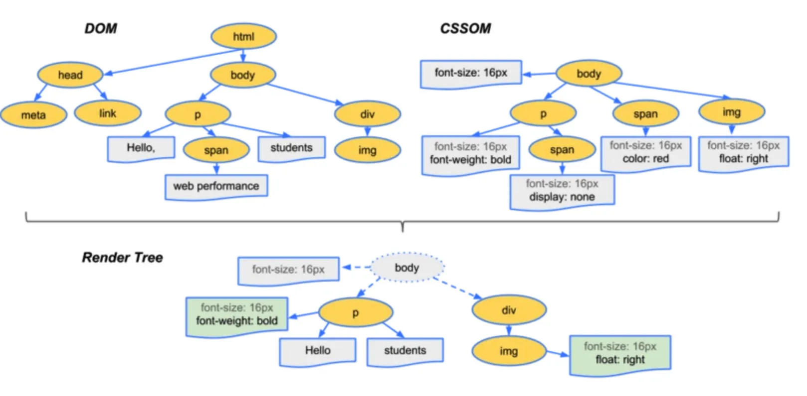

# 浏览器的渲染进程

网页生成过程：

1. 浏览器开始解析目标 HTML 文件,执行流的顺序为自上而下。
2. HTML 结构被 HTML 解析器转换为基础的 DOM (文档对象模型),构建 DOM 树完成后,触发 DomContendLoaded 事件。
3. CSS 解析器将 CSS 解析为 CSSOM (层叠样式表对象模型),一棵仅含有样式信息的树。
4. CSSOM 和 DOM 开始合并构成渲染树(Render Tree),每个节点开始包含具体的样式信息（几何信息： 位置、大小）。渲染树的构建过程中，浏览器会忽略掉不需要渲染的节点，比如 display: none 的节点。
5. 当渲染树构建完成后，计算渲染树中个各个节点的位置信息,即布局阶段。
6. 在绘制或光栅化阶段，浏览器将在布局阶段计算的每个盒子转换为屏幕上的实际像素。绘制可以将布局树中的元素分解为多个图层。将内容提升到 GPU 上的层可以提高绘制和重新绘制性能。
7. 当文档的各个部分以不同的层绘制，相互重叠时，必须进行合成，以确保它们以正确的顺序绘制到屏幕上，并正确显示内容。

如果改变页面布局, 则是先通过 js 更新 dom 在经历计算样式到合成图像这个过程. 如果仅仅是非几何变化(颜色, visibility, transform), 则可以跳过布局步骤

1. 网络进程获取到数据后，通过 ipc 将数据传给渲染器进程的主线程
2. 主线程将 html 解析构造 Dom 树， 然后进行样式计算， 根据 DOM 树和生成好的样式生成 LayoutTree
3. 通过遍历 layoutTree 生成绘制顺序表接着遍历 LayoutTree 生成 layerTree ，
4. 传给合成器线程按规则进行分图层
5. 在接着就是栅格线程进行 draw quads 传回个合成器线程 frame 交给 gpu 进行渲染

LayoutTree 和 DomTree 并不一定相同，而是在最后面解析出的相同。

合成器帧最后交由进行绘制

这里面有两点优化方案：

1. requestAnimationFrame 能够将 js 分成更小的任务块，在每一帧时间用完前暂停 js 执行。

2. 直接通过 transform 实现的动画由于不需要经过布局绘制， 主线程 就不会跟 js 抢占执行时间。

## 从获得 HTML 到解析页面全流程，为什么栅格线程使用 GPU 计算而不是 CPU 计算

## CSSOM 会堵塞渲染

CSSOM 和 DOM 是并行构建的，构建 CSSOM 不会阻塞 DOM 的构建。但 CSSOM 会阻塞 JS 的执行，因为 JS 可能会操作样式信息。虽然 CSSOM 不会阻塞 DOM 的构建，但在进入下一阶段之前，必须等待 CSSOM 构建完成。这也是通常所说的 CSSOM 会阻塞渲染。

## 浏览器如果渲染过程中遇到 js 文件怎么处理？

渲染过程中，如果遇到<script>就停止渲染，执行 JS 代码。因为浏览器有 GUI 渲染线程与 JS 引擎线程，为了防止渲染出现不可预期的结果，这两个线程是互斥的关系。JavaScript 的加载、解析与执行会*阻塞 DOM 的构建*，也就是说，在构建 DOM 时，HTML 解析器若遇到了 JavaScript，那么它会暂停构建 DOM，将控制权移交给 JavaScript 引擎，等 JavaScript 引擎运行完毕，浏览器再从中断的地方恢复 DOM 构建。
