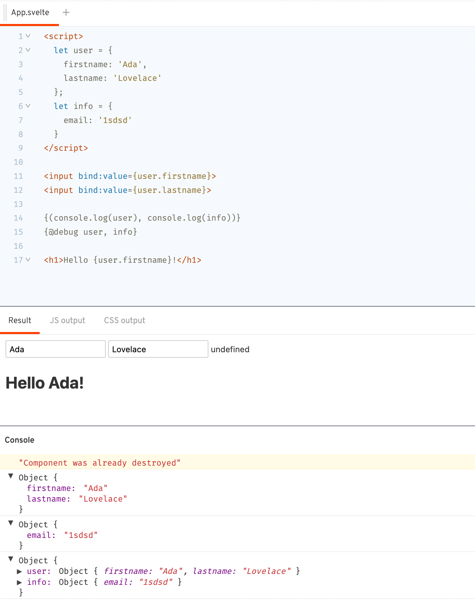

# AfterShip

1. 早上 8-10 学习和总结：
   启动 5w 的逻辑和其他的工作方法

2. 中午开始处理工作

3. 每天或者隔天清空 tab 页

4. 提一下可以量化的指标
   notion ==>看三四篇文章

5. 维护一份单词翻译表和单词简写表

---

1. 重新整理下备忘录里面的东西

## 在这里我能学到什么

1. 技术
   jest ts
   细分一下 在极客时间 搞门 ts 的课程看看 能够写一下复杂的 ts 类型体操

2. 通识
   todo 1.英语的提升 --- 有环境 1. 看是否需要报班 ---x

2.思考一下 有没有回二线城市的成本=====>(至少能有首付房子的钱 才能回吧)

1.控制风险 2.接受现状 3.保持努力和思考

保持努力的状态，保持深度思考的习惯，苦练内功，让自己的每一天充实起来。这样等到机会来临之际才能抓住

摆脱低水平的「勤奋陷阱」，获得高水平的「反思能力」。

---

## 我该怎么做

1. 总结：
   从工具人进步到架构师的自我修养

2. 面向巧合编程

3. 小步拆分 稳扎稳打 从长而久到短而精的转变

4。学会某些工具链、技术栈、设计原则和软件工程方法

5. 学习可以看看轮子， 生产环境少造轮子

6. 对开源的反思是要敬畏开源，敬畏社区，在反馈中不断地成长，完善自身项目。

作正确的事情，并保持长期的耐心

1. 不要事无巨细的请教老同学， 要有 owner 的心态

熟悉业务

熟悉部署结构

从问题中学习

遇到疑问要首先要自己做一个判断，不论判断的是否正确，经过一次思考后，对系统的理解将会上一个台阶。

如果是我应该怎么做

先了解业务 以及项目的运转模式

好的设计可以直接从工程的目录结构上了解到应用的模块分类，从命名上知道模块大致的作用，其次我们可以从 pom 文件、打包脚本、接口类等对应用模块以及提供的服务能力进行初步了解（这里以 Java 工程为例），同时进行到这一步后，我们可以将应用以及应用内模块的功能进行了一个整理，形成一个文档；这样当我们需要实现一个需求或者需要修 Bug 的时候，我们可以快速知道这个功能可能需要涉及哪些应用以及模块。

▐ 第一步，了解业务

在上手新项目前，如果对该项目所在的业务并不了解，那么先大致了解下整体业务，以及新项目在整体业务中所处的位置，能帮助你后续更快了解新项目。可以重点关注与新项目有关的上下游业务。

过程中可以产出：业务大图、整体业务流程图。

▐ 第二步：了解项目/产品

功能&流程：通过试用项目对应的产品先建立对项目功能和流程的初步概念。

技术架构：通过项目现有设计资料并结合表结构、重点功能代码、鹰眼调用链信息等了解新项目的技术架构。

过程中可以产出：项目业务流程图、系统架构图、数据模型、重点逻辑流程图。

▐ 第三步：了解技术栈

如果新项目是和前项目完全不同的技术栈，那么你还需要了解新项目所在的技术生态。通过开发一个小功能来了解和熟悉新项目的项目风格和依赖的技术产品是不错。

过程中要动手做记录， 可以画流程图， 可以记录文档。

1、低阶：先行动，看数据，再取舍

大多数人对生活的常态是「没想好」，没想好是做个快乐摸鱼仔还是当一线上进打工人，没想好为什么、是什么、是不是，而这些问题可能也想不出来。

这种时候更好的方法是：先看见，然后发现。可以先按 30 分钟的粒度记录下自己每天时间的花费，如：睡觉、工作、通勤、吃饭、读书、健身、发呆...记录完成后，看看自己的时间花在了哪里，分析下可以怎么更好的利用时间？哪个大块的时间可以来做之前想尝试的事情。

2、高阶：定目标，拆行动，管时间

知道自己想要什么且有明确目标的人，他们的行动和自我管理必自成体系。他们会将目标按年、月、周、日一层层拆解，按照 PDCA 的方法，看时间的分配、看关键事项的进度并及时调整。

用数据思维做时间管理，可以分为如下四步：

第一步：年目标设定。

第二步：月目标及周任务拆解。根据时间和进度，铺排未来 2 个月目标，再分解到每周 todo 的形式整理任务。

第三步：每日时间记录。

每日时间记录有两个思路：一侧重看时间的花费，二侧重看每天完成的事项。

1、看时间花费。

以时间轴方式记录时间，适合刚开始做时间记录的人，因为多数人每天日程差不多，这种记录方式看不到整体时间花费情况，不方便横向纵向比较。

2、看每天完成的事项。

根据年/月目标理出关键统计项，切换记录方式，着重记录关注事项的时间话费。

如果想养成习惯，建议从精细化的时间记录开始，有了一定的掌控力就可以把注意力放在事情本身。

第四步：数据反馈及调整。

统计不是目的，是为了调整和优化。

时间花费数据是最直接的反馈，我们要关注如下两点：

1、看投入的时间够不够？

2、如果时间足够，就关注方法和效率，发现问题解决问题逐步反馈。

并可视化方式来监控趋势及整体进度。根据图表的内容反馈实际执行情况，复盘调整。

另外，个人感觉纯粹记录还是挺难坚持的，还需要一些自我激励的办法可以根据自己的喜好设立激励机制，比如 3 个月、6 个月、1 年等不同节点给自己奖励，一个礼物、一顿大餐、一场说走就走的旅行。刚开始做时间记录时，2020 年我试着做了可视化的自我总结，成就感满满的，不信你看！

## 做两件事情--

todo 1.把备忘录代码部分迁移到 markdown 上面 2.把 notions 上面的东西迁移到 markdown

## 你的直属上司，而不是你的绩效表现和做事的能力决定了你的生死。"大厂人要学会的第一项生产法则是向上管理、包装自己和抢地盘"

## 产品矩阵

主站 WWW AfterShip
AfterShip Protection 售后物流保证
AfterShip Green 碳排放
AfterShip Returns Center 退货中心
Postmen 自动化快递 自动化运输流程： 合作快递 usps fedex usps
Automizely Marketing 自动营销
Automizely Dropshipping 自动待发货
Automizely Reviews 自动审核
Automizely Shopping 自动购物
Automizely Traffic 自动流量 免费广告 --- 广告联盟？？
Automizely Loyalty 自动忠诚度 推荐计划 --- 全民营销？？
Automizely Page Builder 自动页面构建器 --- 在 shopfiy 上面搭建页面
Automizely SMS 自动短信
AfterShip for Shoppers

company
Customers 顾客
Partners 伙伴
Perks 津贴
Carriers 合作伙伴
Affiliates
News
Careers

AfterShip
Apps & plugins
Developers
Glossary 电子商务词汇表

shopify 更像是微信一样的基座 aftership 是作为小程序一样 生长在上面的一个应用

这里面涉及到的电商平台 基本都是自建的 shopfiy WooCommerce magento

## 单元测试

jest
js dom 浏览器环境的 nodejs 模拟
enzyme react 组件渲染和测试
nock 模拟 http 请求
istanbul 生成覆盖率

## accounts

todo
1.svelte 的基础知识

- 官网--<https://www.sveltejs.cn/tutorial/updating-arrays-and-objects>

特殊点：

1. 更新值
   赋值给数组和对象的 属性（properties） （例如，obj.foo += 1 或 array[i] = x）与对值本身进行赋值的方式相同。

```js
function addNumber() {
  numbers[numbers.length] = numbers.length + 1;
}
```

一个简单的经验法则是：被更新的变量的名称必须出现在赋值语句的左侧。例如下面这个：

```js
const foo = obj.foo;
foo.bar = "baz";
```

就不会更新对 obj.foo.bar 的引用，除非使用 obj = obj 方式。 2.属性
props 传值 接收部分-export let answer;

```js
	import Info from './Info.svelte';

	const pkg = {
		name: 'svelte',
		version: 3,
		speed: 'blazing',
		website: 'https://svelte.dev'
	};
</script>

<Info {...pkg}/>
```

3.逻辑这块 有点像模板语法
if

```JS
{#if user.loggedIn}
	<button on:click={toggle}>
		Log out
	</button>
{:else}
	<button on:click={toggle}>
		Log in
	</button>
{/if}

{#if x > 10}
	<p>{x} is greater than 10</p>
{:else if 5 > x}
	<p>{x} is less than 5</p>
{:else}
	<p>{x} is between 5 and 10</p>
{/if}
```

each

```JS
{#each cats as cat, i}
	<li><a target="_blank" href="https://www.youtube.com/watch?v={cat.id}">
		{i + 1}: {cat.name}
	</a></li>
{/each}
```

如果你希望代码更加健壮，你可以使用 each cats as { id, name }来解构，用 cat.id 和 cat.name 来代替 id 和 name。
4.await 块

```JS
{#await promise}
	<p>...waiting</p>
{:then number}
	<p>The number is {number}</p>
{:catch error}
	<p style="color: red">{error.message}</p>
{/await}
```

应该是在模板层面去监听 promise 的状态，在修改相对应的模板显示

5.事件修饰符

```JS
<button on:click|once={handleClick}>
	Click me
</button>
```

所有修饰符列表：

preventDefault ：调用 event.preventDefault() ，在运行处理程序之前调用。比如，对客户端表单处理有用。
stopPropagation ：调用 event.stopPropagation(), 防止事件影响到下一个元素。
passive ： 优化了对 touch/wheel 事件的滚动表现(Svelte 会在合适的地方自动添加滚动条)。
capture — 在 capture 阶段而不是 bubbling 阶段触发事件处理程序 ()
once ：运行一次事件处理程序后将其删除。
self — 仅当 event.target 是其本身时才执行。

5.事件、 组件事件

```JS
<script>
	import Inner from './Inner.svelte';

	function handleMessage(event) {
		alert(event.detail.text);
	}

</script>

<Inner on:message={handleMessage}/>
-----------------------------------
<script>
	// setup code goes here
	import { createEventDispatcher } from 'svelte';

	const dispatch = createEventDispatcher();

	function sayHello() {
		dispatch('message', {
			text: 'Hello!'
		});
	}
</script>

<button on:click={sayHello}>
	Click to say hello
</button>
```

on:message 才有用 on:click 还没效果了

6.事件转发
多层嵌套的事件
Svelte 设立了一个简写属性 on:message。 message 没有赋予特定的值得情况下意味着转发所有 massage 事件：

```js
<script>
	import Inner from './Inner.svelte';
</script>

<Inner on:message/>
```

7.支持 contenteditable

```JS
<div
	contenteditable="true"
	bind:innerHTML={html}
></div>
```

8.支持 todos

```JS
{#each todos as todo}
	<div class:done={todo.done}>
		<input
			type=checkbox
			bind:checked={todo.done}
		>

		<input
			placeholder="What needs to be done?"
			bind:value={todo.text}
		>
	</div>
{/each}
```

9.尺寸绑定
每个块级标签都可以对 clientWidth、clientHeight、offsetWidth 以及 offsetHeight 属性进行绑定：

```JS
<div bind:clientWidth={w} bind:clientHeight={h}>
	<span style="font-size: {size}px">{text}</span>
</div>
```

10.生命周期
onMount
onDestroy
beforeUpdate 函数实现在 DOM 渲染完成前执行。afterUpdate 函数则相反，它会运行在你的异步数据加载完成后。

11.store
只要一个对象正确的使用 subscribe ，它就是可以称之为 store。因此，使用特定语法来创建自定义 stores 变得非常容易。
可以使用 update set writable

12.调试


13.组件--slot
如果 slot 里面有值，则外部引用为空的时候，才生效，否则只按传入的 slot 值
没看懂。。// <!-- https://www.sveltejs.cn/tutorial/slot-props -->

14.特殊标签
svelte option --- <https://www.sveltejs.cn/tutorial/svelte-options>

- 实战 Demo
  开发官网--<https://juejin.cn/post/6944355557495013412>
  从零搭建服务端渲染----<https://www.jianshu.com/p/a6cfbe476503>

  2.tailwindcss 的基础知识
  3.accounts 代码 -- svelte 部分
  -- ui 部分

## react 的路由部分和 lazy

## organtion 的代码组织形式和 business 的代码组织

区别：
org 没有在 tsx 里面直接使用 actionSaga ，
转而采用 useDisptch

## react - redux 的几个概念

## 给的对工作有帮助的工具

1. <https://github.com/airbnb/javascript>
2. <https://www.notion.so/automizely/Unit-test-guideline-92ebdd8d1ab643cf87dfd2466c221b1d#2d3a693a7d2947fc9dcba68a3c2e7800>
3. <https://jestjs.io/zh-Hans/docs/mock-function-api#mockfnmockresolvedvaluevalue>
4. <https://www.notion.so/automizely/Top-100-SaaS-Activation-Ideas-8be8c7133fed43a3ae3dca87b1fcd76c>

## 有时候太想当然了，很多事情 要么是超出我的认知 ，要么就是在当时场景下或是合理或是不合理，但已造成的事实

##

todo
<https://formik.bootcss.com/>

## 关于 jira 的故事点---来自 Thoughtworks 洞见

故事点的本质是对复杂度的估计，而复杂度其实包含了两部分---难度和工作量

可能一个故事工作量并不大，但是难度比较大，需要处理复杂逻辑，复杂的验证等等；也有可能一个故事并不复杂，但是工作量比较大，比如一个简单的工作重复 20 次。这两种情况都可能使得一个故事的故事点变大。

时间 = 工作总量/速率

现在问题变成了速率哪里来，敏捷实践告诉我们——昨天的天气。理论上同一个团队上一个迭代的速率跟现在这个迭代的速率不会相差太大，于是我们可以假设当前迭代的速率与上一个迭代相等，但通常来说一个团队的速率本来就不是一成不变的：

- 项目刚启动时由于大家需要熟悉业务上下文，熟悉技术栈，磨合工作方式，此时的速率不会太快，但是会处于一个慢慢上升的状态

- 项目中期大家熟悉了这些情况，逐渐以一个稳定的速率向前跑

- 此时 PM/TL 发现以当前速率往前跑在规定时间到之前烧不完所有故事点，可能会考虑加人

- 由于新成员的加入，需要老成员分享一些业务和技术上下文，一起 pair 传递知识，这势必会拖慢团队速率

- 然后团队将以比之前快一些的速率继续稳定前进

- ......

于是整个项目工作总量的消耗和每个迭代消耗的工作量组成了敏捷项目管理最重要的两个图表 —— **燃尽图和速率图**，它们可以告诉团队到底还需要多少时间能够完成项目，或者我们还能不能在某一时间点完成项目，时间这个关键指标就被“计算”出来了

--------------管理客户预期

## dispatching actions to the saga

## storyblock

www 项目

对应的 react-bootstrap 对应的是：bootstrap 的 4.x 版本

主线任务 触发支线任务

O 涨薪 2700  
 K 提高自己 react 技术 看懂 sdk
R
R
R
R
----------
K 提高自己的 TS 技术
R TS 的常见类型都能够看懂
R
----------
O 创建独立站
K
R
R
R
R

自己找 ork 例如熟悉系统 那我就自己下单 用 as 查询

O 比特币
K 赚够 10W
R
R
R
标记重要非紧急

## 总结下：storyblock 的几个要点

- css 用 emotion 写

- 注意考虑 ssr 场景，因为可能遇到没有 useEffect 包裹起来

## 老袁的课 要能够收回成本，其他人我管不了

1W 里面的课程
