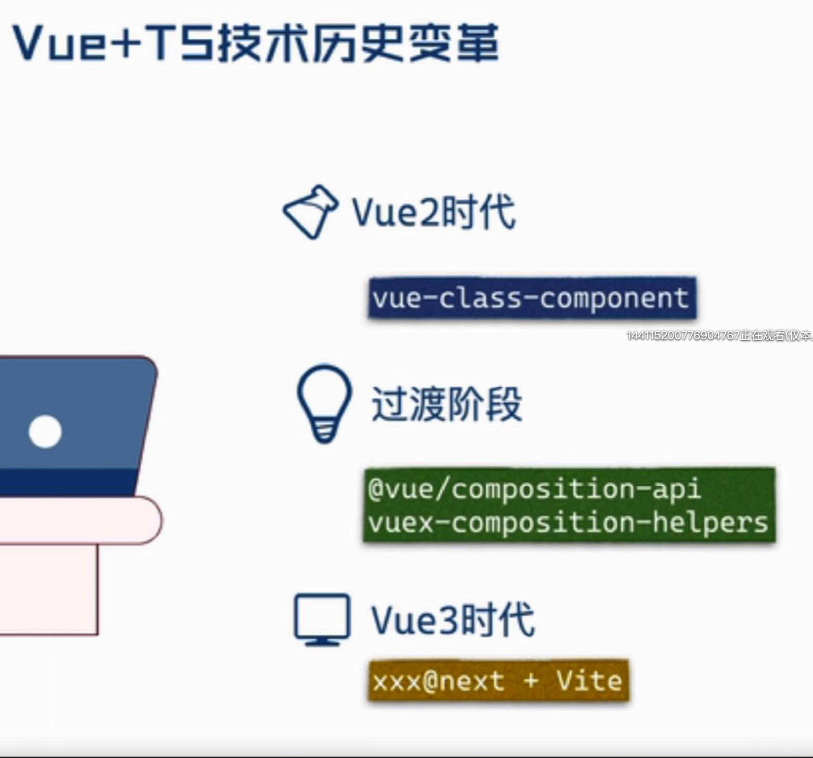
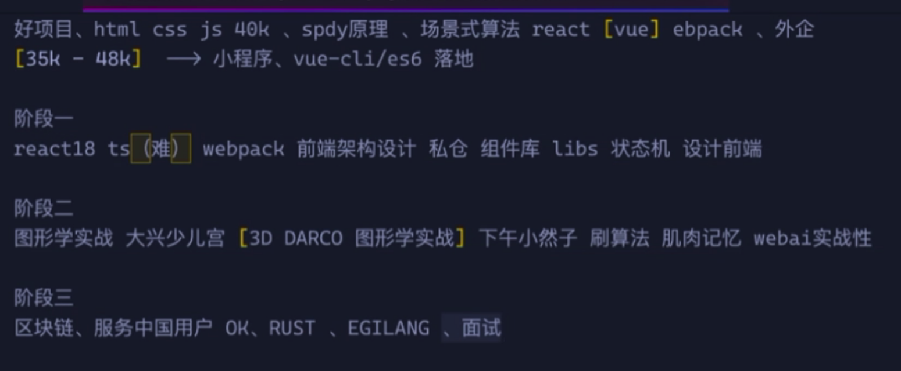
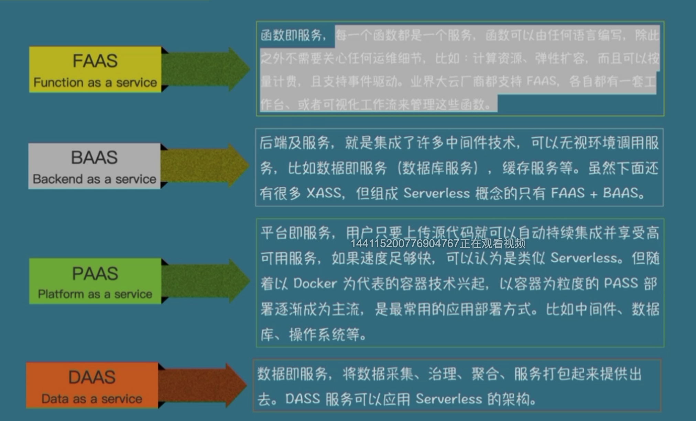
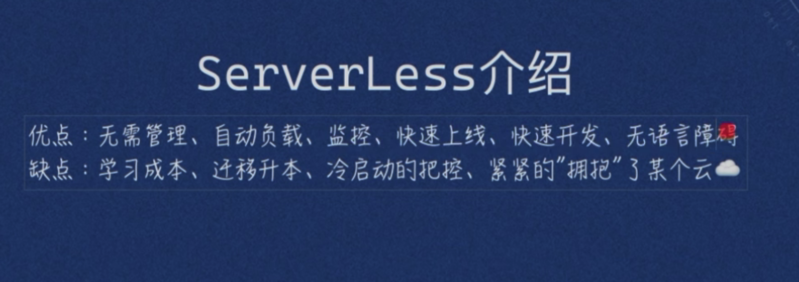

1.上课时间

周一  周三 周四 晚8点 阶段一的课程

2.简历：
 1.深度了解（jotai/recoil/zustand） css项目中降低css 体积70%
 2.原子状态配合状态机+FRX 实现项目私仓通信机制(Xstate+rx。js)
 3.熟悉React16-18源码以及对VUE原理深入掌握  对渲染优化有交深入认识
 4.基于项目私仓封装过公司组件库  基于mui css机制 ts的支持
 5.深入落地公司CI CD对前端工程化提出建设性的一键 涵WEBPACK优化以及CI CD代码质量拦截
 6.对前端高性能计算有深厚的兴趣 如前端多线程机制、以及TS编译成WASM进行项目深度优化
 7.关键住前端新知识、新方向 如 bun、rust、webai、iot.js
 8.图形学方向 自己开发过公司 xx babylon three xeogl
 9.崇尚具有严格类型的开发模型  严格遵守TS的类型校验 开发了部分js to ts nocode代码
 10.计算机基础扎实 了解http、v8、chrome引擎渲染机制、eventloop/libuv原理
 11、项目架构基于SFF的架构模式，深入了解AWS cloudFlare 以及AWS的ServerLess开发流程以及原理
 12.对前端性能要求较高的追求  对常用性能指标有较深的认识  关注google开发者大会的技术指标
 13.对E2E unittest 利用jest达到覆盖率

1. y-libs 私仓
2. yd-libs state
3. yd components
4. ydApp react

项目经历
  1.大公司

阶段一的课程
  基础前端  react？私仓 组件库封装  前端架构设计  hooks ts  react原理  状态
阶段二
图形学 + 区块链

阶段三
rust webai bun v8等等

Vue2 时代: vue-class-component

Vue3 过渡：过渡阶段
  @vue/Composition-api
  vuex-composition-helpers

Vue3 时代：XX@next + Vite

1.libuv原理
2。同构化js

faas 里面的lamda做了koa做的事情

第一节课的作业：

1. 使用cra创建ts的react项目
2.创建coludflare workers 输出一段json

3.上线coludflare 代码 【sebuild 编译】
4. task 3分钟输出数据变化一波
5. github链接cloudflare pages-> workers
6.前端中使用worker-box做前端离线缓存 关于不关

server
web 免费

代码+地址
总结：http强缓？ 本地缓？ workbox 项目中怎么利用 核心区别是什么
文字：描述

1.create

4.hooks
  1、useTransition
  2。startTransition
  3. useDefer

自己的优势---劣势
