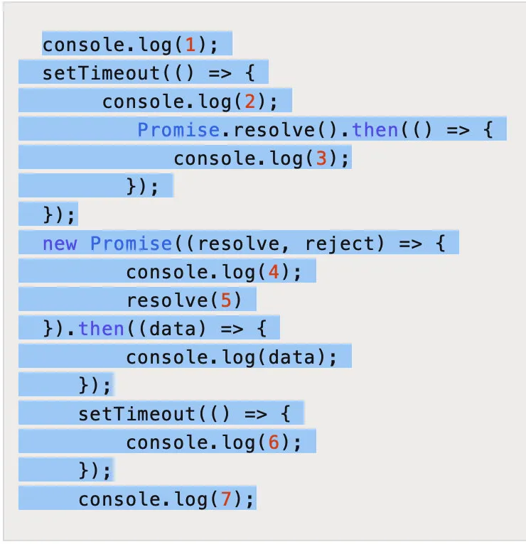

```js
console.log("1");
async function async1() {
  console.log("2");
  await async2();
  console.log("3");
}
async function async2() {
  console.log("4");
}
setTimeout(function () {
  console.log("5");
  new Promise(function (resolve) {
    console.log("6");
    resolve();
  }).then(function () {
    console.log("7");
  });
});
async1();
new Promise(function (resolve) {
  console.log("8");
  resolve();
}).then(function () {
  console.log("9");
});
console.log("10");

async function async1() {
  console.log("async1 start");
  await async2();
  console.log("async1 end");
}
async function async2() {
  console.log("async2");
}
console.log("script start");
setTimeout(function () {
  console.log("setTimeout");
}, 0);
async1();
new Promise(function (resolve) {
  console.log("promise1");
  resolve();
}).then(function () {
  console.log("promise2");
});
console.log("script end");

// -------------------------------

console.log("script start");
console.log("async1 start");
console.log("async2");
console.log("promise1");
console.log("script end");

console.log("setTimeout");
console.log("promise2");

// ------------------------------
// Promise.all((Promise.then(1), 2).then(v=> console.log(v)) // 输出 1,2

// Promise.all((Promise.then(1), 2, Promise.reject(3)).then(v=> console.log(v)) // 3

// Promise.all((setTimeout()=>{console.log(1), 500}, 2, Promise.reject(3)).then(v=> console.log(v)) // 1,2,3
```

---

## Event Loops 的作用

在 JavaScript 引擎的主线程上,会包含一个执行栈,按照栈后进先出的顺序处理栈中的任务。

<https://www.jianshu.com/p/be5bfc1f1ae4>

首先执行同步代码,即 script 脚本,这属于宏任务
当执行完所有同步代码后,执行栈清空
从微任务队列中逐个取出回调任务,放入执行栈中执行,直至所有微任务执行完成。注意：如果在执行微任务的过程中,产生了新的微任务,那么这个微任务会加入到队列的末尾,同样会在这个周期内被执行。
当执行完所有微任务后,如果有必要会开始渲染页面
开始下一轮 Event Loop,执行宏任务中的异步代码,也就是 setTimeout 中的回调函数。


1、执行全局的 script 代码,第 1 行代码

此时 Stack Queue：[console]

Macrotask Queue：[],

Microtask Queue：[]

此阶段输出 1。

2、执行到 2-7 行 setTimeout 代码,此时会将 setTimeout 的回调推入 Macrotask Queue

此时 Stack Queue：[setTimeout 本身]

Macrotask Queue：[setTimeout callback],

Microtask Queue：[]

此阶段没有输出。

3、执行 8-13 行 Promise 代码,在 Promise 构造函数内部的代码实际是同步代码,直到遇到 resolve 或者 reject,才会触发异步的回调。

而 Promise 的异步任务回调会被推入到 Microtask Queue。

此时 Stack Queue：[Promise 内的 console],

Macrotask Queue：[setTimeout callback1],

Microtask Queue：[Promise callback]

此阶段输出 4。

4、执行 14-16 行 setTimeout 代码,与上一个 setTimeout 一样,会被推入到 Macrotask Queue

此时 Stack Queue：[setTimeout 本身],

Macrotask Queue：[setTimeout callback1,setTimeout callback2],

Microtask Queue：[Promise callback]

此阶段没有输出。

5、执行第 17 行代码,实际是同步代码,会进入到执行栈中。

此时 Stack Queue：[console],

Macrotask Queue：[setTimeout callback1,setTimeout callback2],

Microtask Queue：[Promise callback1]

此阶段输出 7。

6、至此第一轮的宏任务执行完成,开始从微任务队列中取出任务执行,直至微任务队列为空。

第 10 行代码 resolve(5)执行后,会进入到 then()方法内部,执行第 12 行代码。

此时 Stack Queue：[Promise callback1],

Macrotask Queue：[setTimeout callback1,setTimeout callback2],

Microtask Queue：[]

此阶段输出 5。

7、至此微任务队列清空,第一轮微任务也执行完成,开始下一轮 event loop

8、执行 setTimeout 宏任务的回调,并将其推入到执行栈中。

此时 Stack Queue：[setTimeout callback1],

Macrotask Queue：[setTimeout callback2],

Microtask Queue：[]

此阶段输出 2。

但是在执行到第 4 行代码时,又生成了一个新的 Promise,会将其推入到 Microtask Queue 中。

Microtask Queue：[promise callback2]。

9、宏任务执行完成后,开始从微任务队列中取出任务执行,即第 5 行代码

此时 Stack Queue：[promise callback2],

Macrotask Queue：[setTimeout callback2],

Microtask Queue：[]

此阶段输出 3。

10、第二轮任务轮询结束,开始第三轮 event loop

11、执行第二个 setTimeout 任务回调,即第 15 行代码。

此时 Stack Queue：[setTimeout callback2],

Macrotask Queue：[],

Microtask Queue：[]

此阶段输出 6。

12、至此全部执行完成,Stack Queue,Macrotask Queue,Microtask Queue 均为空。

关于宏任务和微任务中的 setTimeout 和 Promise,我们再增加一些更加容易让人理解的解释。

setTimeout 的作用是等待给定的时间后为它的回调产生一个新的宏任务,这个宏任务将在下一轮循环中执行,而 Promise 的回调是在当前轮循环中产生,并推入到当前循环的微任务队列中。

这就是为什么打印'2'在'5'之后。因为打印'5'是第一轮微任务里做的事情,而打印'2'是在第二轮的宏任务里做的事情。

setTimeout 的作用是等待给定的时间后为它的回调产生一个新的宏任务,这个宏任务将在下一轮循环中执行,而 Promise 的回调是在当前轮循环中产生,并推入到当前循环的微任务队列中。
