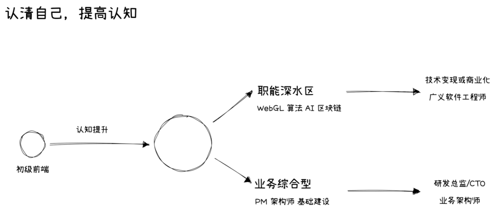
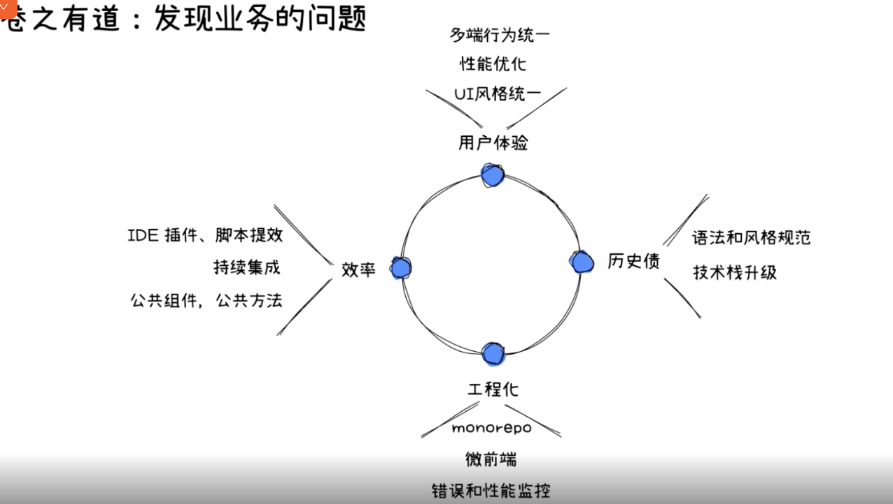
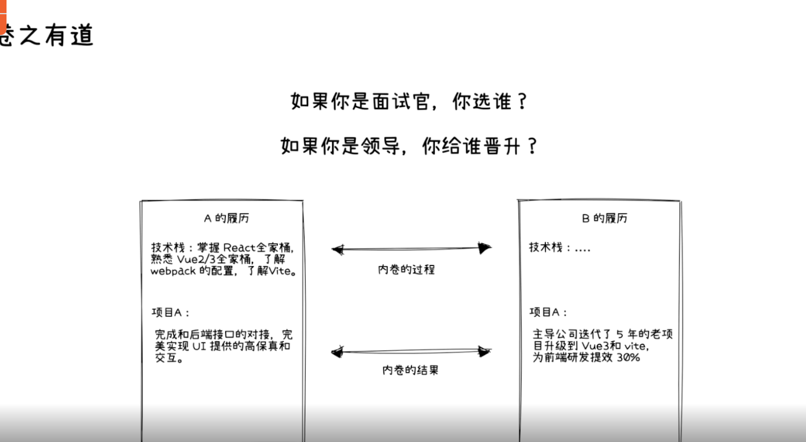
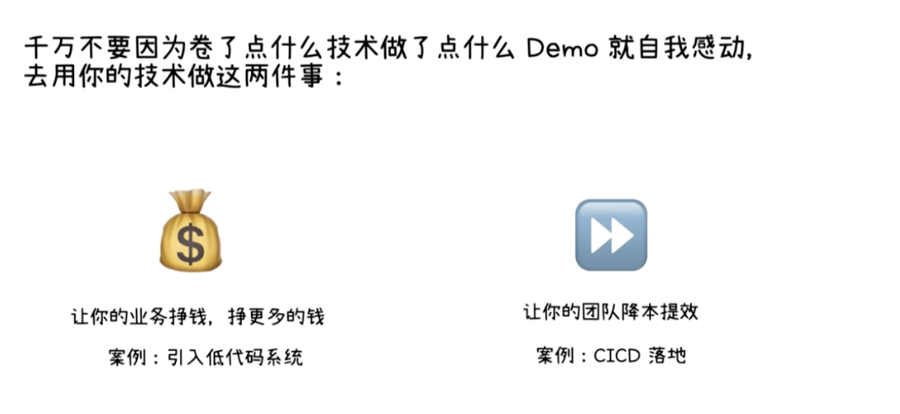

间歇性踌躇满志，持续性混吃等死。。。

考PM或者MO

1.知识储备和沉淀
2.选对行业
3.选对公司
4.选对领导

1.从何卷起
绝大多数公司，业务与基建不是非黑即白的。
做服务业务的基建

  业务：    业务：硬编码速度提升（解决问题的能力） => 基建
            扪心自问：为什么你的产品赚钱
            发现业务问题，发现工程问题
            ---------回馈业务-----------

低代码案例：

1.

方法和工具有了，是什么让你落地拉胯
1.个人因素    环境因素
解决问题的能力   惰性团队
执行力        办公室政治
时间问题    激励政策
          向上管理
