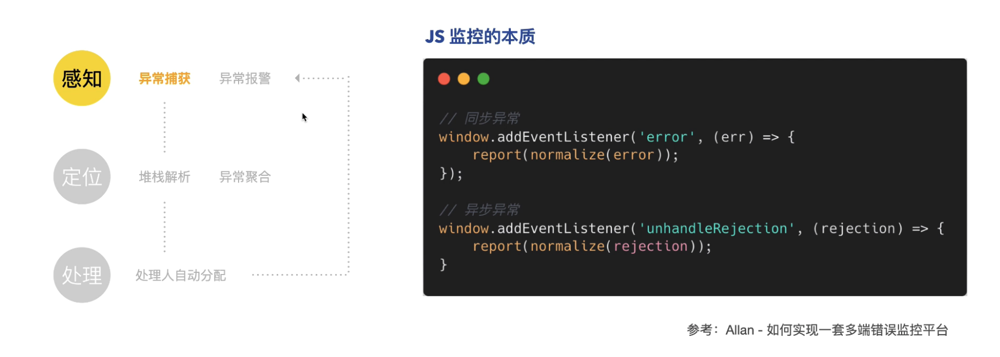
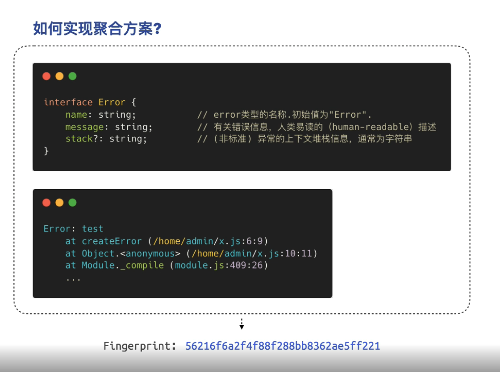
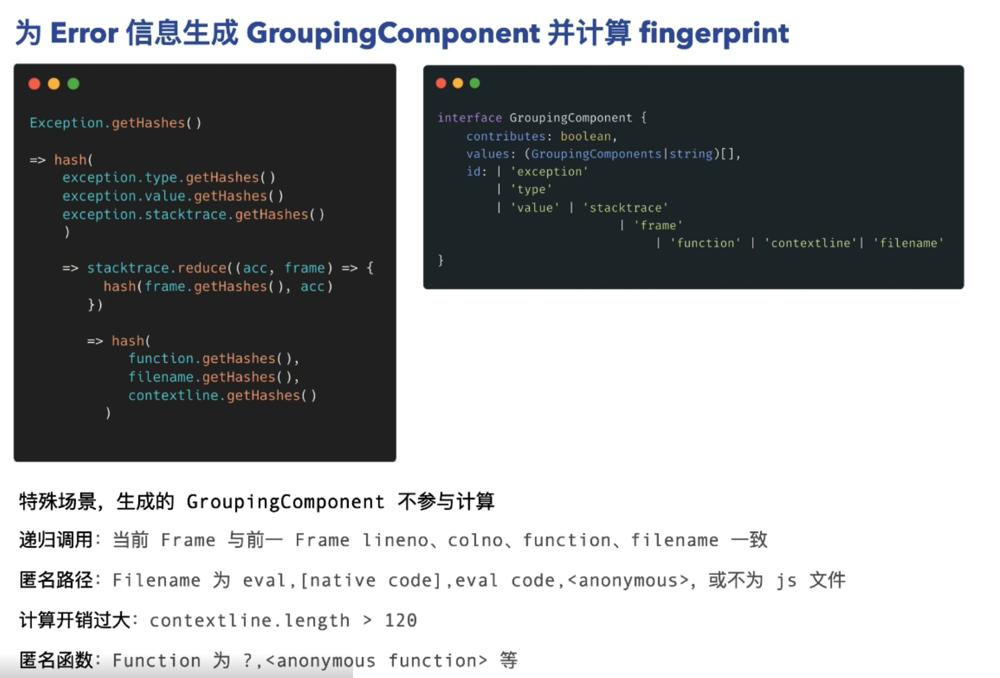
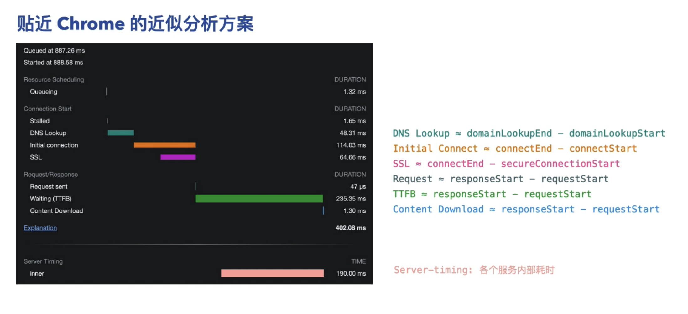
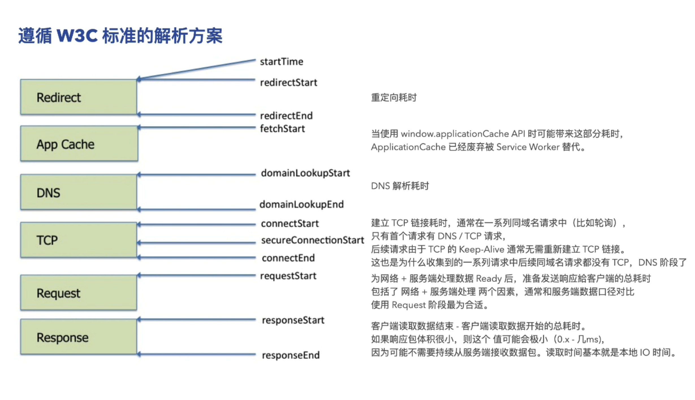
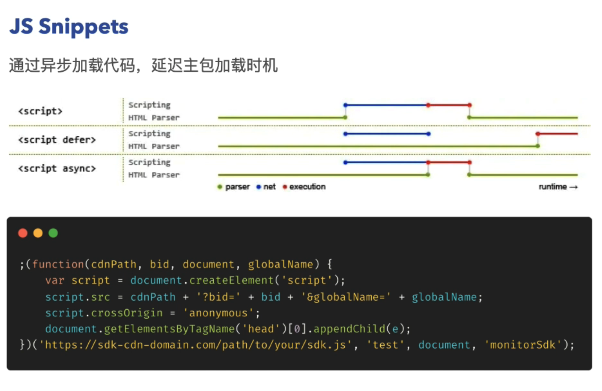
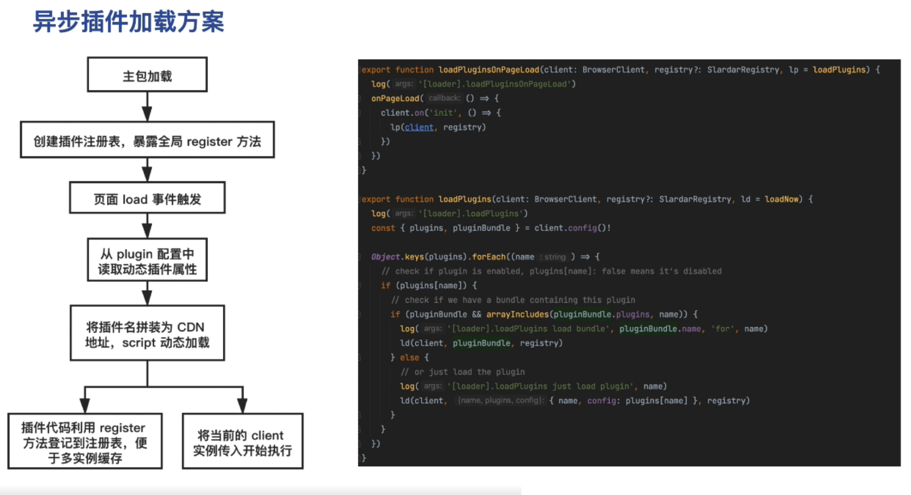

# 张皓洋：字节前端监控实践

## JS异常监控

// 同步
window.addEventListener('error', function (e) {
  console.log(e);
});
// 异步
window.addEventListener('unhandleRejection', function (e) {
  console.log(e);
});

对sourceMap的进行反编译

通过issue Grouping聚合提交

注意落地：

1. 线上报错项目对应的源代码仓库元信息
2.线上报错代码的发生版本
3.线上报错版本的关联的起止信息

## 性能监控 性能指标

一. 指标采集： Web Vitals & Navigation Timings

二. 关联用户行为

1.采集交互事件，触发全局 action_id 记录
通过 addEventListen 记录下
2.Mutation Observer 观察DOM，观察后续请求，静态资源加载，longtask等数据
3.100ms内若没有新的变更产生，则结算上报，若持续时长超过10s，强制结算上报

三：单页面视角的性能度量

## 请求/静态资源监控

采集方案：
手动打点：
 使用场景：请求耗时兜底、请求状态、请求响应相关信息
 监控方式： hook XMLHttpRequest.prototype  Hook fetch -> wrappedFetch
  优势： 兼容性佳、采集方便
ResourceTiming：
  使用场景：精确的请求耗时、静态资源耗时、分阶段观测数据
  监控方式：performance.getEntriesByType('resource') PerformanceObserver.observe(type)
  优势: 更精准，可以避开额外的事件队列处理耗时

## SDK设计

### 异步加载

js nipper 异步加载 运用了async

### 预收集

  

### 事件驱动

  1.按需加载，不使用的代码就不拉取
  2.高扩展性，允许开发自己的采集逻辑
  3.降低多端开发成本

异步加载

