# 如何识别优秀的前端猎头来跳槽大厂

关于猎头的
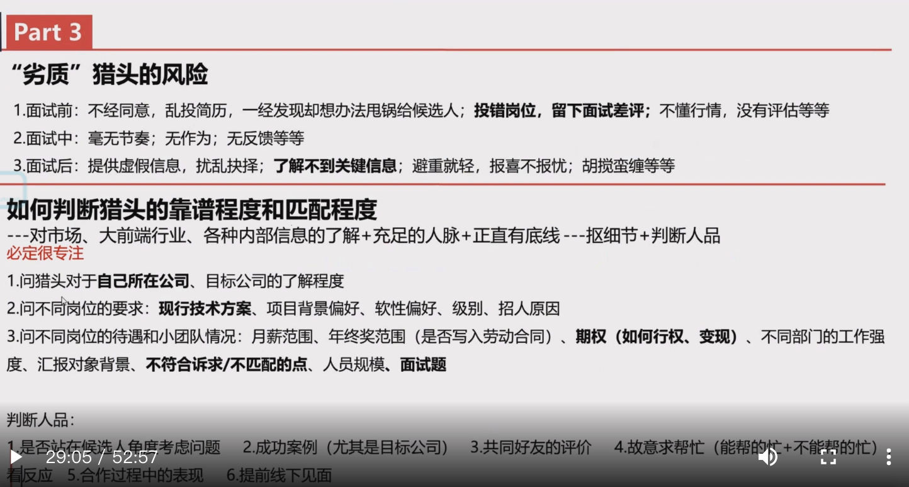

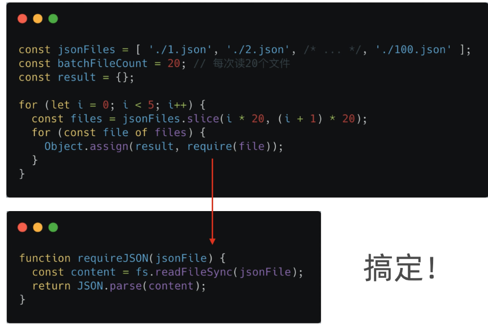

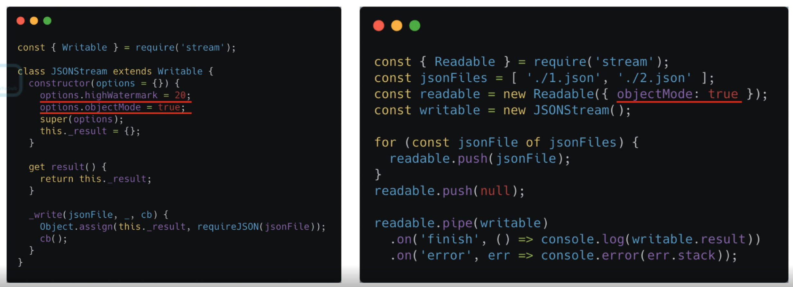

系统： 整体➕

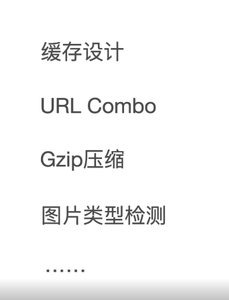

容器化 是无状态的 涉及一些缓存

* 多看源码， 特别是流行的库和工具

* 多上手实践， 特别是前端工程化领域

* 有机会的话，多了解一下操作系统

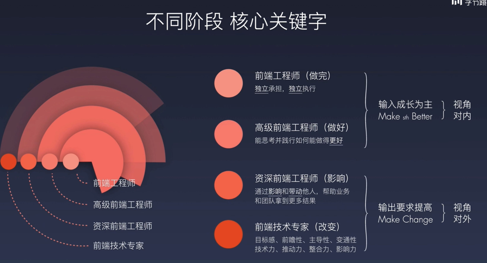

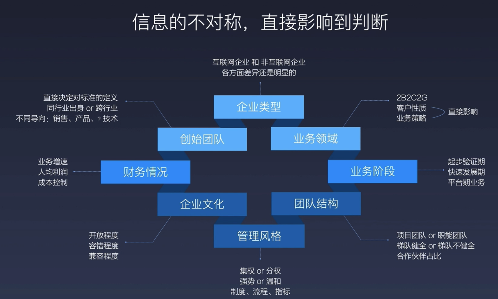

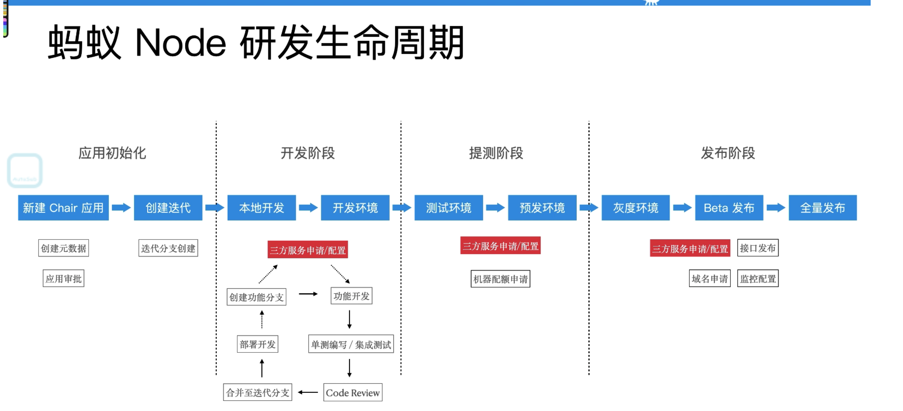

编辑器

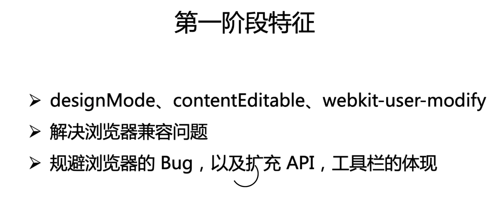

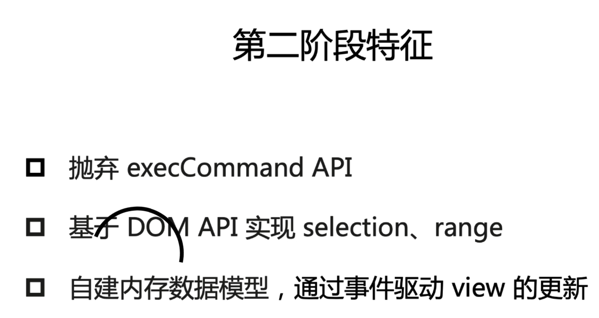

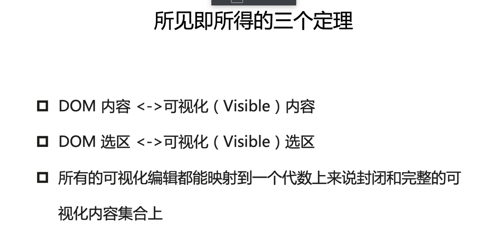

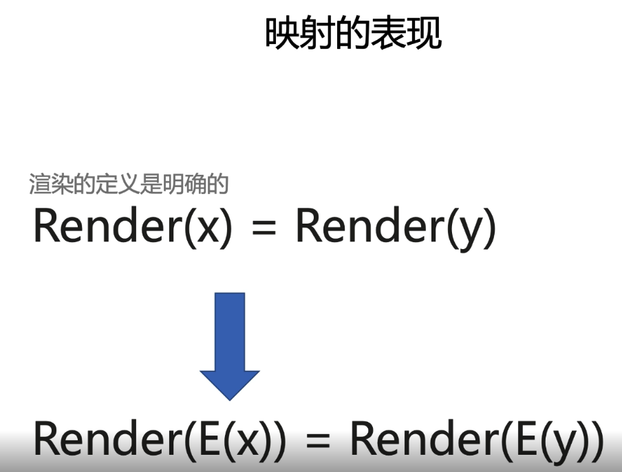

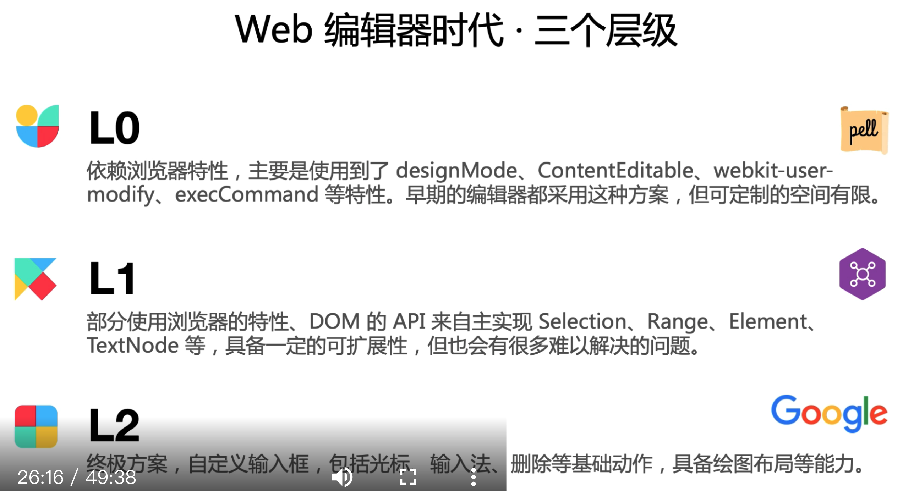

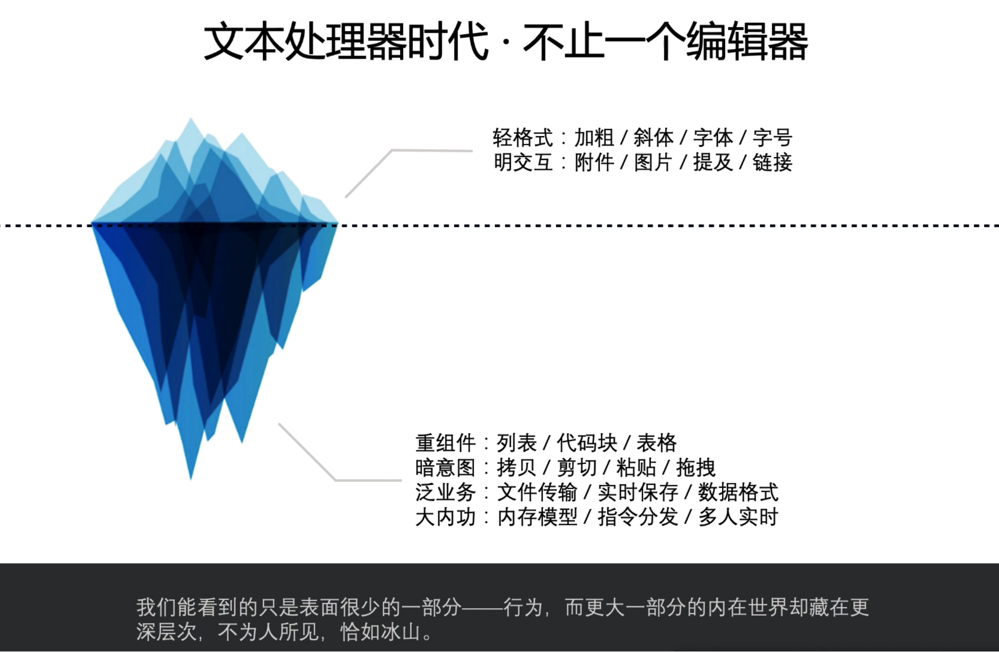

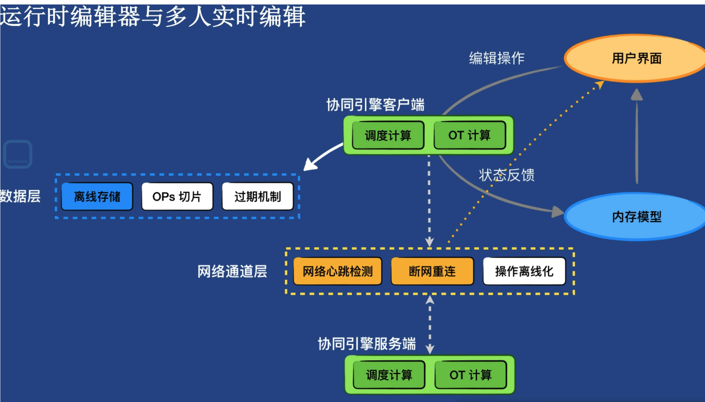

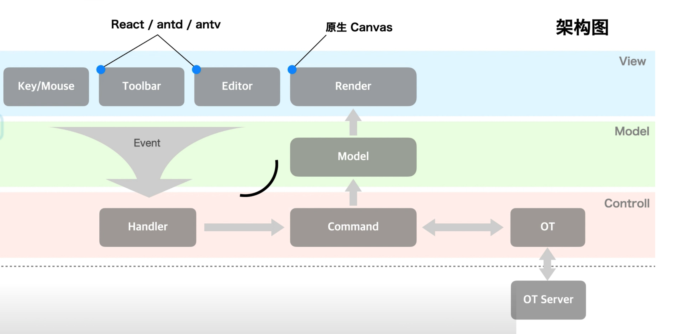

同构 异构表 

1. 同构表 不支持合并单元格
2. 信息结构化 -- 异构表 
3. 数据处理  --- 同构表

多人实施协同
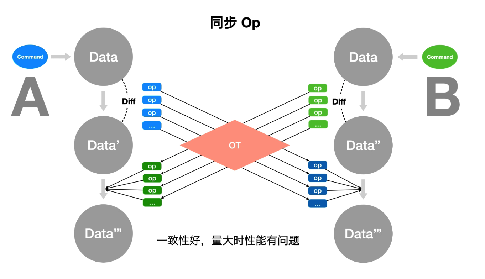

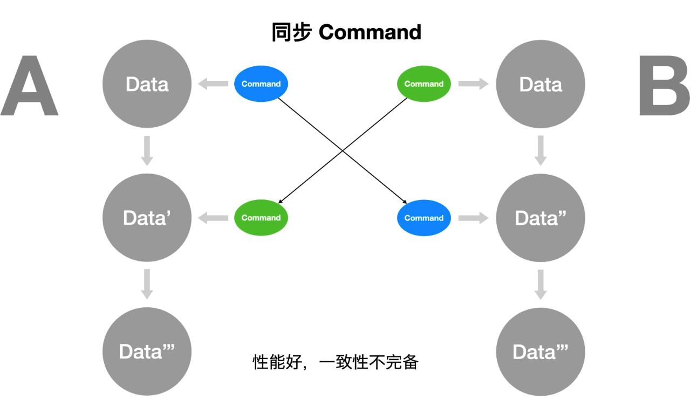

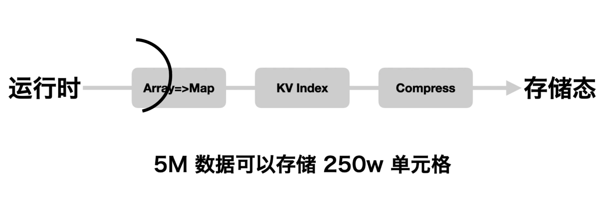