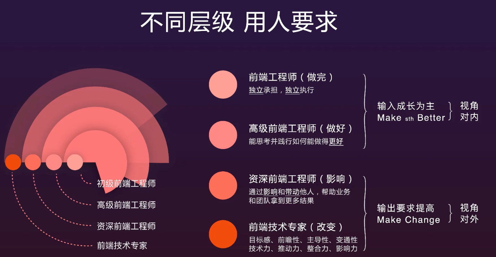

复盘的价值在于认知和迭代自己

最新的 ECMAScript 标准定义了 8 种数据类型:

7 种原始类型: Boolean. Null. Undefined. Number. BigInt. String. Symbol.
和 Object.

FMP 值采集, 避免业务代码嵌入埋点逻辑, 通过 MutationObserver API 监听 dom 变化实现无手动埋点采集

babel-plugin-try-catch-auto 插件, 实现手动 try-catch 捕获运行时错误

同构后性能优化成果

css 代码采用 BEM + 原子 css 命名规范, 规范化开发

线上项目安全部门提出存在 csrf 攻击漏洞, 通过规范请求方式及使用 cookie 参数作为唯一标识 token, 验证请求来源, 完成漏洞修复

在性能优化上, 通过多种方式减少首屏时间, 包括使用 dns-prefetch 预解析 cdn, 充分应用了 react 的 state 批处理/purecomponent/memo 等功能减少不必要的调羹行

技术能力

1. 团队中技术用不上?? 创造条件 需找能用上点

1. 函数式编程 typescript 测试, 掌握一门后端语言

1. node docker k8s

new vue({}) v8 快属性 想到这个的对比 o = object.create() 和 o = {}

词法 => 语法 => ast => 字节码 => ao vo go => 收集代码信息 => 优化字节码 生成机器码

1. css bem 原子 矩阵 next houdini 小程序和周边框架的原理

webpack 5 system + 通信 + 主服务

面试中遇到的大部分人的知识点，技能都差不多, 所以我们的基础一定要都记得全而且．
我们要在第一时间吸引面试官. 就是要有亮点,针对你的项目中运用到的技术栈,要比别人高大上，看看　ｒｅａｃｔ　ｎｏｄｅ　ｗｅｂｐａｃｋ　ｓｓｒ　能不能都用上去．自己创造条件．
还有能拉开距离的，还是你对框架的理解程度．　所以要多看框架源码，看能不能将现在一些常见的框架（ｑｉａｎｋｕｎ），自己实现一遍，反正就是在　ｇｉｔｈｕｂ，上面最好能有　ｓｔａｒ　．
还有就是　你在团队中的角色，是不是能够　ｈｏｌｄ　住新技术．并为团队带来工效的提升．

## immutable.js 原理 及 优缺点

## redux 和 mobx 的区别与优缺点

[Redux 与 Mobx 对比](../源码/Redux/与Mobx对比.md)

vue-router

vuex

