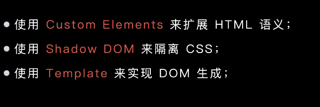
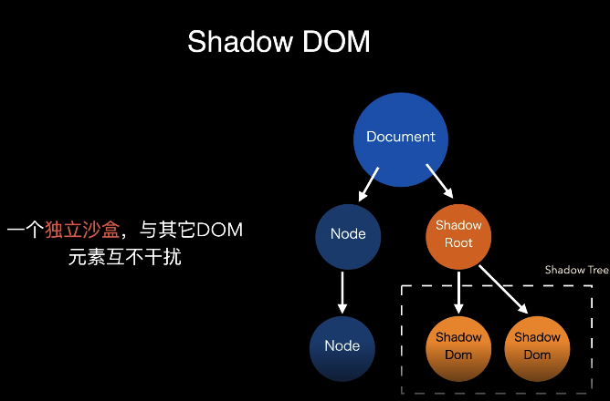
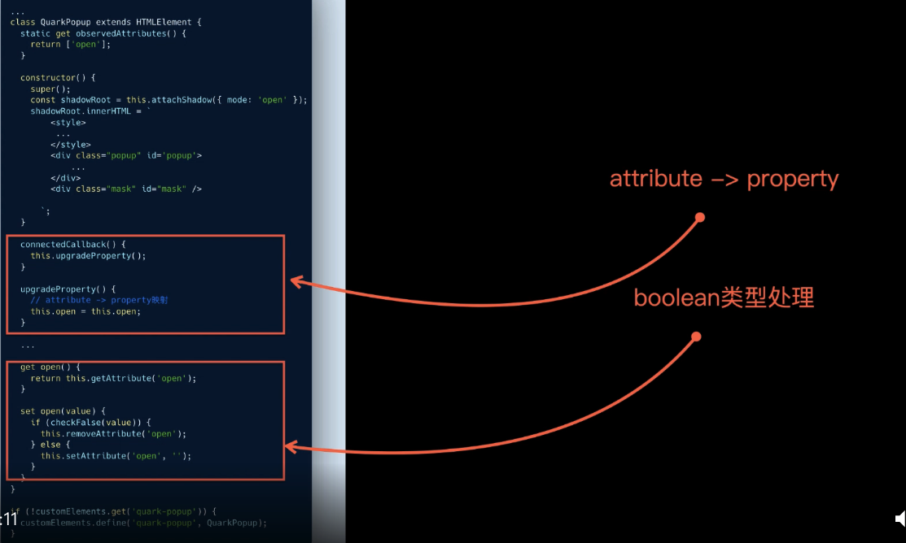
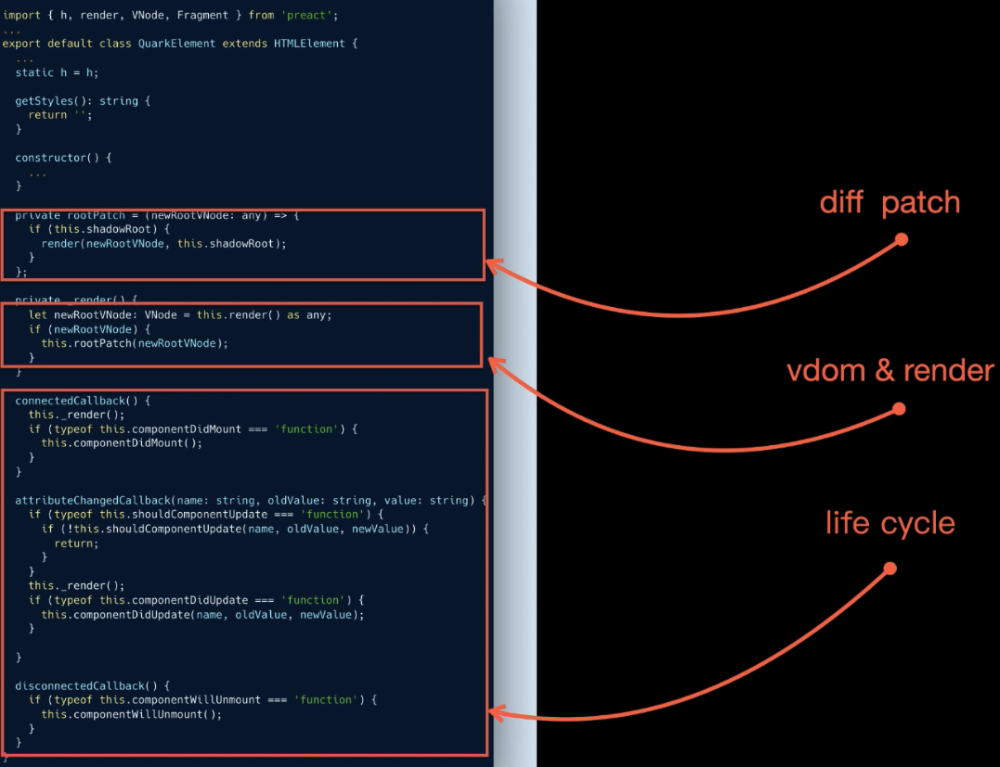
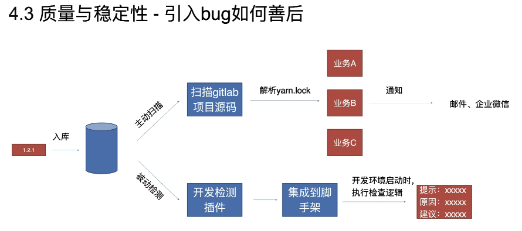

# 基于webCompents的跨技术组件库实践

什么是ShadowDOM

它是影子dom 跟外界互不干扰

|  initialization   | mounted  | update |  unmount
|  ----  | ----  |
|  constructor   | connectedCallback  | attributeChangedCallback |  disconnectedCallback
|  组件创建时调用，通常在该生命周期生成DOM结构   | 当自定义元素第一次被连接到文档dom时被调用。通常在该生命周期更新dom元素  | 当自定义元素的一个属性被增加、移除或更改时被调用。通常在该生命周期更新dom元素 |  当自定义元素与文档dom断开连接时被调用。通常在该生命周期移除副作用

## DOM Property & DOM Atrribute

## <https://v3.cn.vue.js.org/guide/web-components.html#definecustomelement>

## <https://developer.mozilla.org/zh-CN/docs/Web/API/CustomElementRegistry/define>

## <https://developer.google.com/web/fundamentals/web-components/best-practices#lifecycle-callbacks>

DOM Property 转成 Dom Attribute

弊端：

quarkElement 是基于preact

质量追踪

