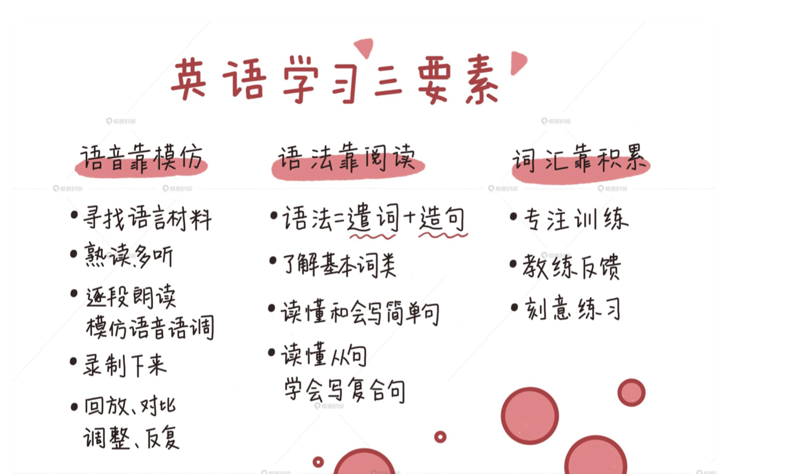

# 互联网人的英语私教课

KSA（Knowledge, Skills and Abilities framework）即知识、技能和才华模型

学习知识（knowledge），是多渠道获取、消化和记忆信息（information）的过程，主要通过理解概念（concept）以及知悉事实（fact），最终达到“我知道了、我懂了、我记住了（know what）”的效果。

而学习技能（skills），是在已有知识的基础上，通过反复模仿（repeated imitation）和刻意练习（deliberate practice），最终能够娴熟使用某种工具（tool），达到“我会了、我熟练了、我运用自如了（know how）”的效果。

第一，语音靠模仿。

第二，语法靠阅读。

了解基本词类：主要是名词（数、格、性）和动词（时态、被动语态、助动词和情态动词，非限定动词、虚拟语气等），同时也会穿插代词、副词和形容词。读懂和会写简单句：结合文章介绍基本句型，通过例句讲解搭配、断句、主谓一致等问题，搞清楚句子的成分，慢慢能自己读懂句子，并模仿出清晰准确的句子。读懂从句，学会写复合句：逐步熟悉名词从句、定语从句、状语从句，融会贯通强调句、虚拟语气、倒装结构、直接和间接引语等语言现象。

第三，词汇靠积累。

领悟只是第一步，是学习知识的过程。更关键的是在理解之后，我们可以通过背诵段落、改写例句、用自己的语言写作相同的意思并与原文对照等方式，来逐步消化和积累常用的词汇和句式。

学习音标最重要的永远是跟读和模仿，建议搜索教学视频（带有口型的那种）来学习。关键词搜索“48个国际音标的发音”，你可以找到无数的国际音标表，和教学视频。建议首先把48个国际音标表抄写三遍，然后打开教学视频跟读（建议找外国人领读的教学视频），每天都跟读至少三遍，抄写加跟读一遍花不了一个小时的时间。如此这般坚持一周左右，就可以打开朗文字典网页版，随便找一些阅读文章中你认得或者不认得的单词，先根据音标自己发一下音，再播放字典自带的真人发音和自己的发音对照，模仿到一模一样为止。

关于单词（其实主要是短语），很重要的工作就是把被动词汇变成主动词汇，你说的这种情况是典型的被动词汇。学习单词的时候尽量用英英字典（推荐朗文字典的网站），如果看到单词后面标了W1、S1之类的，表示是写作（W）和口语（S）核心1000词，这些一定要深入学习例句，把单词以及词组都吃透。一开始是会觉得蛮麻烦，花了很长时间才搞了三四个词，其实是投入产出比最高的办法。朗文字典带有真人读的例句，跟读和模仿乃至背诵，对慢慢开始练习口语也颇有好处。

第一步，找音视频资料。不妨试一试TED，当然如果可以翻墙油管上选择余地更大。TED上找语速不快、内容你比较感兴趣又熟悉的演讲，连带每篇演讲下面的中英文稿。第二步，如果粗粗一听，可以听懂百分之五六十以上，就可以用。先泛听两遍练习听力，实在听不懂的可以去找笔录的英文原文，查字典、查资料，最后感觉基本理解了之后，还可以看中文的参考译文（可以不看，但不要一开始就看）。第三步，选择几段自己最喜欢的再精听几遍，模仿老外的语音朗读文章，这时候要把自己的声音录下来，过后和原文对比，找到差距后，读第二遍，如此循环三次，每次都应根据发现的问题，刻意练习改进；第四步，用自己的话复述听过的文章，可以提前列出文章的提纲，供自己复述的时候题词，这个内容也要录下来，回头自己当教练，自我评价和反馈、改进。复述也要循环三遍，每一遍都要录音，力求有改进。一周弄一篇，看看累不累，再决定后面的节奏。试一试，应该会很有效果。

Article 
1：The Product-Minded Software EngineerArticle https://blog.pragmaticengineer.com/the-product-minded-engineer/?utm_source=wanqu.co&utm_campaign=Wanqu+Daily&utm_medium=website
2：Open Source Benefits to Innovation and Organizational AgilityArticle https://www.infoq.com/news/2019/03/open-source-benefits/
3：Successful Remote WorkingArticle https://www.infoq.com/news/2020/03/successful-remote-working/
4：Breaking through Three Common Engineering MythsArticle  https://www.infoq.com/articles/breaking-through-engineering-myths/
5：InfoQ’s 2019, and Software Predictions for 2020 https://www.infoq.com/articles/infoq-2019-retrospective/

## 

##

##

##

##

