# 全栈工程师

## 网络互联的昨天、今天和明天： http协议的演化

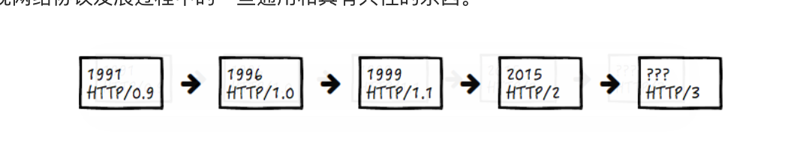
从网络协议分层上看， TCP 协议在 HTTP 协议的下方（TCP 是在 OSI 7 层协议的第 4 层，而 HTTP 则是在最高的第 7 层应用层，因此，前者更加“底层”一点）。

在 HTTP 1.0 版本时，每一组请求和响应的交互，都要完成一次 TCP 的连接和关闭操作，

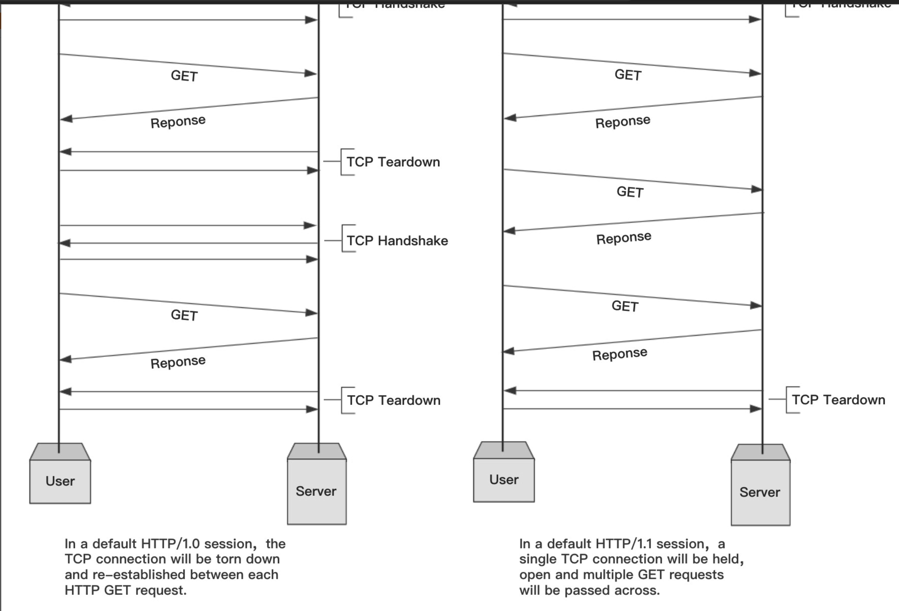

通过建立长连接，中间的几次 TCP 连接开始和结束的握手都省掉了。

1. 在 HTTP 头部，有这样一行：

Transfer-Encoding: chunked

1. 正文的内容是这样的：

127a
...
0

事实上，如果协议头中存在上述的 chunked 头，表示将采用分块传输编码，响应的消息将由若干个块分次传输，而不是一次传回。刚才的 127a，指的是接下去这一块的大小，在这些有意义的块传输完毕后，会紧跟上一个长度为 0 的块和一个空行，表示传输结束了，这也是最后的那个 0 的含义。

在长连接开启的情况下，使用 Content-Length 还是 chunked 头，必须具备其中一种。分块传输编码大大地提高了 HTTP 交互的灵活性，服务端可以在还不知道最终将传递多少数据的时候，就可以一块一块将数据传回来

HTTP/2现在最广泛使用的 HTTP 协议还是 1.1 ，但是 HTTP/2 已经提出，在保持兼容性的基础上，包含了这样几个重要改进：

* 设计了一种机制，允许客户端来选择使用的 HTTP 版本，这个机制被命名为 ALPN；

* HTTP 头的压缩，在 HTTP/2 以前，HTTP 正文支持多种方式的压缩，但是 HTTP 头部却不能；

* 多路复用，允许客户端同时在一个连接中同时传输多组请求响应的方法；

* 服务端的 push 机制，比方说客户端去获取一个网页的时候，下载网页，分析网页内容，得知还需要一个 js 文件和一个 css 文件，于是再分别下载，而服务端的 push 机制可以提前就把这些资源推送到客户端，而不需要客户端来索取，从而节约网页加载总时间。

这两个是不一样的，keep-alive 是不关闭 TCP 连接，也就是长连接，但是在不使用管道机制的情况下，交互是单工的，即客户端必须要等前一个请求的响应返回之后，新的请求才能发过去。而在使用管道机制的情况下，请求发送可以非阻塞，但是响应返回必须依然严格按照请求的顺序。

而多路复用则是基于流的，那么在传输的时候，无论请求还是响应，只要逻辑上允许就可以传输，如果两个请求没有依赖关系可以不必等待前一个返回而直接发送，虽说用的是同一条连接。

长连接需要客户端和服务端都要支持，同时 HTTP/1.1 的 keep-alive 要打开，对于这个 TCP 连接的维护，大多数 web 服务器都支持。

分块传输两个特性：

1. 分块传输可以保持 HTTP 的持续链接（即 Keep-Alive）。
2. 分块传输可以让客户端在 body 信息发送完后，继续发送额外的 header 信息。

基于这两个特性，暂时想到下面两个类似的应用场景：

* 优先传输网页上最重要的内容（比如首屏内容，首屏 CSS），其他延后传输。
* 页面上内容的长度未知的场景，比如瀑布流布局。
* 可以在内容传输后，加上 Expires header，来告知内容是否已经过期。

知识点：

【基础】如果你对 HTTP 还不熟悉的话，推荐你阅读一篇系统性介绍 HTTP 的教程，比如 MDN 的这篇[教程](https://developer.mozilla.org/zh-CN/docs/Web/HTTP)。
【基础】The OSI model explained: How to understand (and remember) the 7 layer network model：[教程](https://www.networkworld.com/article/3239677/the-osi-model-explained-and-how-to-easily-remember-its-7-layers.html)

## 为 http 穿上盔甲 

早期 http 会产生以下安全问题

* Interception：拦截。传输的消息可以被中间人 C 截获，并泄露数据。
* Spoofing：伪装。A 和 B 都可能被 C 冒名顶替，因此消息传输变成了 C 发送到 B，或者 A 发送到 C。
* Falsification：篡改。C 改写了传输的消息，因此 B 收到了一条被篡改的消息而不知情。
* Repudiation：否认。这一类没有 C 什么事，而是由于 A 或 B 不安好心。A 把消息成功发送了，但之后 A 否认这件事发生过；或者 B 其实收到了消息，但是否认他收到过。

但是，与其重新设计一套安全传输方案，倒不如发挥一点拿来主义的精神，把已有的和成熟的安全协议直接拿过来套用，最好它位于呈现层（Presentation Layer），因此正好加塞在 HTTP 所在的应用层（Application Layer）下面，这样这个过程对于 HTTP 本身透明，也不影响原本 HTTP 以下的协议（例如 TCP）。

HTTP + SSL/TLS = HTTPS

这里涉及到的两个安全协议，SSL 和 TLS，下面简要说明下二者关系。SSL 指的是 Secure Socket Layer，而 TLS 指的是 Transport Layer Security，事实上，一开始只有 SSL，但是在 3.0 版本之后，SSL 被标准化并通过 RFC 2246 以 SSL 为基础建立了 TLS 的第一个版本，因此可以简单地认为 SSL 和 TLS 是具备父子衍生关系的同一类安全协议。

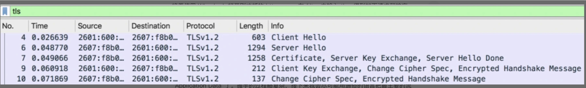

### “对称性加密”和“非对称性加密”

对称性加密（Symmetric Cryptography），指的是加密和解密使用相同的密钥。这种方式相对简单，加密解密速度快，但是由于加密和解密需要使用相同的密钥，如何安全地传递密钥，往往成为一个难题。

非对称性加密（Asymmetric Cryptography），指的是数据加密和解密需要使用不同的密钥。通常一个被称为公钥（Public Key），另一个被称为私钥（Private Key），二者一般同时生成，但是公钥往往可以公开和传播，而私钥不能。经过公钥加密的数据，需要用私钥才能解密；

原始数据 + 公钥 → 加密数据
加密数据 + 私钥 → 原始数据

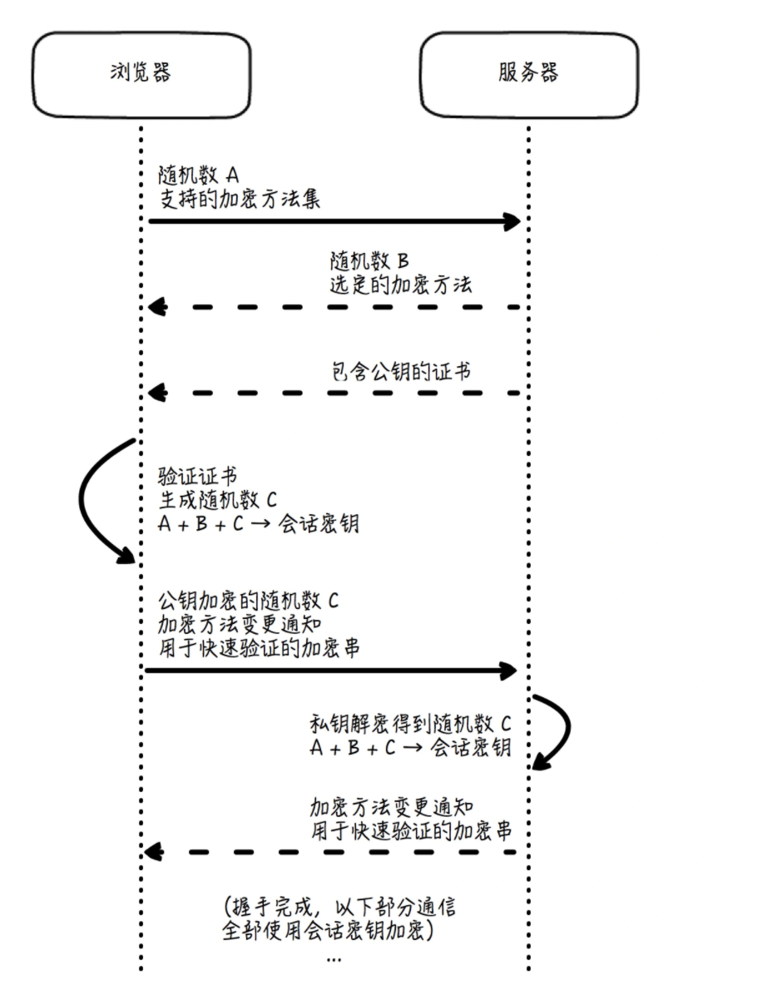

Step 1: Client Hello. 客户端很有礼貌，先向服务端打了个招呼，并携带以下信息：
客户端产生的随机数 A；
客户端支持的加密方法列表。

Step 2: Server Hello. 服务端也很有礼貌，向客户端回了个招呼：
服务端产生的随机数 B；
服务端根据客户端的支持情况确定出的加密方法组合（Cipher Suite）。

Step 3: Certificate, Server Key Exchange, Server Hello Done. 服务端在招呼之后也紧跟着告知：
Certificate，证书信息，证书包含了服务端生成的公钥。

这个公钥有什么用呢？别急，后面会说到。客户端收到消息后，验证确认证书真实有效，那么这个证书里面的公钥也就是可信的了。

接着客户端再生成一个随机数 C（Pre-master Secret），于是现在共有随机数 A、B 和 C，根据约好的加密方法组合，三者可生成新的密钥 X（Master Secret），而由 X 可继续生成真正用于后续数据进行加密和解密的对称密钥。因为它是在本次 TLS 会话中生成的，所以也被称为会话密钥（Session Secret）。

客户端随机数 A + 服务端随机数 B + 客户端 Pre-master Secret C → 会话密钥

Step 4: Client Key Exchange, Change Cipher Spec, Encrypted Handshake Message. 接着客户端告诉服务端：

Client Key Exchange，本质上它就是上面说的这个 C，但使用了服务端通过证书发来的公钥加密；

Change Cipher Spec，客户端同意正式启用约好的加密方法和密钥了，后面的数据传输全部都使用密钥 X 来加密；

Encrypted Handshake Message，快速验证：这是客户端对于整个对话进行摘要并加密得到的串，如果经过服务端解密，和原串相等，就证明整个握手过程是成功

服务端收到消息后，用自己私钥解密上面的 Client Key Exchange，得到了 C，这样它和客户端一样，也得到了 A、B 和 C，继而到 X，以及最终的会话密钥。

于是，客户端和服务端都得到了能够加密解密传输数据的对称密钥——会话密钥。

：TLS 是通过非对称加密技术来保证握手过程中的可靠性（公钥加密，私钥解密），再通过对称加密技术来保证数据传输过程中的可靠性的。

Step 5: Change Cipher Spec, Encrypted Handshake Message. 服务端最后也告知客户端：

Change Cipher Spec，服务端也同意要正式启用约好的加密方法和密钥，后面的数据传输全部都使用 X 来加密。

Encrypted Handshake Message，快速验证：这是服务端对于整个对话进行摘要并加密得到的串，如果经过客户端解密，和原串相等，就证明整个握手过程是成功的。

握手过程是使用非对称加密实现的，而真正后续的数据传输部分却是由对称加密（会话密钥）实现的。

### 客户端验证ca证书📄

证书在申请的时候，我们提到的服务器公钥就已经是该证书的一部分了，因此我们才说，如果证书是有效的，那么它携带的公钥就是有效的。

在当时申请的时候，证书发布机构对证书做摘要生成指纹，并使用它自己的私钥为该指纹加密，生成数字签名（Digital Signature），而这个数字签名也随证书一起发布。这个发布机构的私钥是它内部自己管理的，不会外泄。

指纹 + 私钥 → 数字签名

验证过程则正好是发布过程的反向，即在客户端要对这个被检测证书做两件事：

对它用指定算法进行摘要，得到指纹 P1；
使用证书发布机构的公钥对它的数字签名进行解密，得到指纹 P2。

数字签名 + 公钥 → 指纹

如果 P1 和 P2 一致，就说明证书未被篡改过，也说明这个服务端发来的证书是真实有效的，而不是仿冒的。

对称性密钥是每次会话生成的，会话以外自动失效，这就像武功唯快不破一样，通常很短的时间就更换掉了；如果使用非对称性加密方式来传输实际数据，因为它只在最开始的时候生成一次，而不是每次会话都生成，因此在传输中同一个公钥会被发给多个不同的客户端，因此第三方的中间人可以使用这个公开的公钥解密服务端发给其它客户端的数据，这显然不具备安全性。

证书可能被篡改
证书返回给客户端的内容是： 证书内容（版本、有效期、公钥等） + 数字签名
数字签名是对证书内容进行摘要的指纹 + 密钥进行加密 得到的

## 服务端推送技术

“Pull”指的是去主动发起行为获取消息，一般在客户端 / 服务器（C/S，Client/Server）或浏览器 / 服务器（B/S，Browser/Server）交互中，客户端或浏览器主动发起的网络请求数据的行为。

而“Poll”，尽管在某些场景下也和 Pull 通用了，但在计算机网络的领域里，通常把它解释为“轮询”，或者“周期性查询”，在 Pull 的基础上增加了“周期性”的概念，这也是它和 Pull 相比最本质的区别。

pull 应用远比push广泛， 特别在分布式系统中

服务端不需要维护客户端的列表，不需要知晓客户端的情况，不需要了解客户端查询的策略。这有助于把服务端从对客户端繁重的管理工作中解放出来，而成为无状态的简单服务，变得具备幂等性（idempotent，指执行多次和执行一次的结果一样），更容易横向扩展。

服务端推动技术

1. Comet

客户端发送一个普通的 HTTP 请求到服务端以后，服务端不像以往一样在处理后立即返回数据，而是保持住连接不释放，每当有更新事件发生，就使用分块传输的方式返回数据

若干次数据返回以后可以完成此次请求响应过程（分块传输返回长度为 0 的块，表示传输结束），等待客户端下一次请求发送。这种过程看起来也属于轮询，但是每个周期可包含多次服务端数据返回，因而也被形象地称为“长轮询”（Long Polling）。

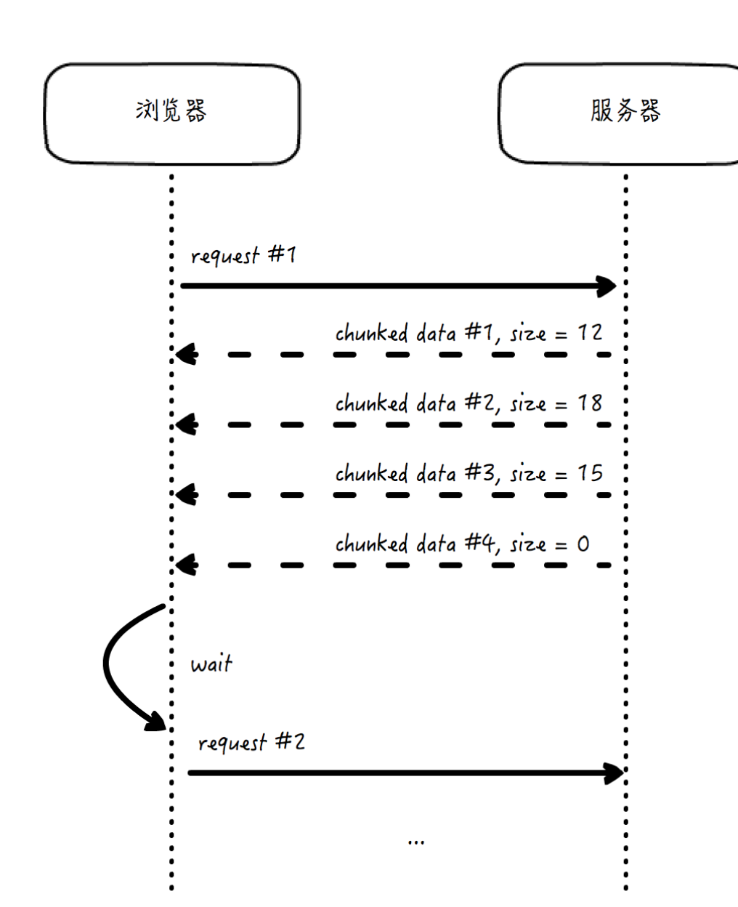

2. WebSocket

它是真正的双向、全双工协议，也就是说，客户端和服务端都可以主动发起请求，回复响应，而且两边的传输都互相独立。

由于它在网络分层模型中位于 TLS 上方，因此他可以使用和 HTTP 一样的加密方式传输：HTTP → WSHTTPS → WSS

## 工整与自由的风格之争：SOAP和REST

SOAP，Simple Object Access Protocol，即简单对象访问协议，定义了数据对象传输的格式，以便在网络的节点之间交换信息。

消息传输就像快递，HTTP 主要关心的是信封，而 SOAP 主要关心的是信封里的物件

REST，Representational State Transfer，即表现层状态转换，指的是一种为了信息能在互联网上顺利传递而设计的软件架构风格。


REST 的核心要素包括资源、表现层和状态转换这三个部分。


幂等性指的是对服务端的数据状态，执行多次操作是否和执行一次产生的结果一样。

幂等操作是可以被重试而不产生副作用的。

安全性指的是该操作是否对服务端的数据状态产生了影响。

安全操作是可以被缓存的

全栈系统的设计和优化都需要紧密围绕幂等性和安全性进行，
就把 HTTP 的方法和实际对资源的操作行为绑定起来了。当然，还有一些其它方法，比较常见的有：

* PATCH：和 PUT 类似，也用于资源更新，但支持的是资源单位的部分更新，并且在资源不存在的时候，能够自动创建资源，这个方法实际使用比较少。
* HEAD：这个方法只返回资源的头部，避免了资源本身获取和传输的开销。这种方法很有用，经常用来检查资源是否存在，以及有无修改。
* OPTIONS：这个方法常用来返回服务器对于指定资源所支持的方法列表。

## 漫谈Web API 的设计

第一步：明确核心问题，确定问题域

第二步：结合实际需求和限制，选择承载技术

第三步：确定接口风格

第四步：定义具体接口形式

1. 条件查询

2.  消息正文封装


1xx：表示请求已经被接受，但还需要继续处理。这时你可能还记得在 [第 03 讲] 中，我们将普通的 HTTP 请求升级成为 WebSocket 的过程，101 就是确认连接升级的状态码。
2xx：表示请求已经被接受和成功处理。最常见的就是 204，表示请求成功处理，且返回中没有正文内容。
3xx：表示重定向，请客户端使用重定向后的新地址继续请求。其中，301 是永久重定向，而  302 是临时重定向，新地址一般在响应头“Location”字段中指定。
4xx：表示客户端错误。服务端已经接到了请求，但是处理失败了，并且这个锅服务端不背。这可能是我们最熟悉的返回码了，比如最常见的 404，表示页面不存在。常见的还有 400，表示请求格式错误，以及 401，鉴权和认证失败。
5xx：表示服务端错误。这回这个处理失败的锅在服务端这边。最常见的是 500，通用的和未分类的服务端内部错误，还有 503，服务端暂时不可用。

[拓展阅读]

[]()
[]()
[]()
[]()


如何权衡 graphql / rest 两种api

我对 GraphQL 的理解简单来说是这样的，仅供参考。它本质上是一种声明式的 DSL，把接口逻辑从服务端拿到客户端来，客户端来决定做什么查询，执行什么操作，资源的概念被彻底弱化了。

和基于资源的 REST 相比，因为可以更加细粒度地控制需要什么数据，减少了多次调用或者是不需要的数据返回造成的开销。当然，它也有许多弱点，比如复杂性更高（客户端需要理解复杂的业务数据模型），不容易使用缓存等等。

我觉得它应该是 REST 风格的一种补充，而不是绝对的替代。有很多场景，比如复杂的数据查询，使用 GraphQL 可以做得很灵活，且有比较高的效率。而多数业务场景，REST 确是更好的选择。

1.在介绍 REST 的参数传递的时候，我们讲了 category 参数传递的两种方式，一种是通过路径传递，一种是通过 Query String 的参数传递。你觉得哪些参数适合使用第一种，哪些参数更适合使用第二种？
————————————
好像要从产品角度来分析，路径传递觉得适合那些能归总为“大类”或“页面”的模块
例如：图书类别（点击类别进入到该类别图书的页面），某个出版社页面（进入该指定出版社的页面）

而 queryString 方式适用在某个“大类”页面筛选器，例如：在某个类别页面再筛选作者叫johnson的图书

## 北美大厂如何招聘工程师

招人理念

1. 领导力准则
2. 技术能力
  编程能力  问题解决能力 和 架构、设计能力

国外的招聘风格就是
题目不得涉及技术本身的奇技淫巧，不得对候选人使用的编程语言有限制，更要避免“知识性问题”。

那什么是“知识性问题”呢？知识性问题，就是那些直接的、较容易通过搜索和文档获取到的知识性内容。比如，Spring 怎样配置 Bean，Tomcat 怎么修改最大连接数等等，这些问题，手册一翻就是分分钟的事情。

针对招聘的思考：
你的竞争力，在具备扎实基础的前提下，应该是经验、思路、眼界等等这些东西。技术是相通的，技术本质是不容易改变的，在新技术到来的时候，你有基础，无论是深度还是广度的积累，应该让你学得更快，而不是学得更慢。

* 扎实的基础不可或缺，这是前提。老实说，我经常遇到工作了好多年的一线程序员，连一个简单的二叉树广度优先遍历算法都写不出来。

* 经验、思路、眼界，都有高度，才是更高级别技术职位的要求，这也反映在上述面试系统设计、问题解决等等方面。

这也是我自己强调的 两条腿走路

算法 和 英语

毕竟，招聘也好，面试也罢，其中的随机性太强，冷静、淡定分析自己的情况，再采取合理的措施，才是王道

## 解耦是永恒的主题：MVC框架的发展

JSP 和 Servlet

Servlet 指的是服务端的一种 Java 写的组件，它可以接收和处理来自浏览器的请求，并生成结果数据，通常它会是 HTML、JSON 等常见格式，写入 HTTP 响应，返回给用户。

JSP，它的全称叫做 Java Server Pages，它允许静态的 HTML 页面插入一些类似于“<% %>”这样的标记（scriptlet），而在这样的标记中，还能以表达式或代码片段的方式，嵌入一些 Java 代码，在 Web 容器响应 HTTP 请求时，这些标记里的 Java 代码会得到执行，这些标记也会被替换成代码实际执行的结果，嵌入页面中一并返回。这样一来，原本静态的页面，就能动态执行代码，并将执行结果写入页面了。

编译过程：JSP 页面 → Java 文件（Servlet）→ class 文件（Servlet）
运行过程：HTTP 请求 + class 文件（Servlet）→ HTML 文本

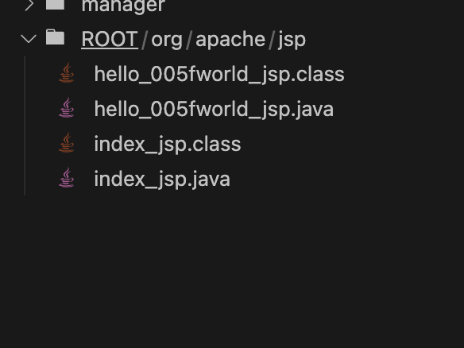

前面的两个java 代表 jsp 生成的 Servlet 的源代码，后两个就是这个 Servlet 编译后的字节码。以 index 开头的文件就是 Tomcat 启动时你最初看到的主页面，而以 hello 开头的这两个文件则完全来自于我们创建的 hello_world.jsp。

JSP 实际工作的时候，是以 Servlet 的形式存在的，也就是说，前者其实是可以转化成后者的。

从编程范型的角度来看，JSP 页面的代码多是基于声明式（Declarative），而 Servlet 的代码则多是基于命令式（Imperative），

最初来源于编程范型的分类，声明式编程，是去描述物件的性质，而非给出指令，而命令式编程则恰恰相反。

在java中

JavaBean 其实指的是一类特殊的封装对象，这里的“Bean”其实指的就是可重用的封装对象。它的特点是可序列化，包含一个无参构造器，以及遵循统一的 getter 和 setter 这样的简单命名规则的存取方法。
POJO，即 Plain  Old Java Object，还是最擅长创建软件概念的 Martin Fowler 的杰作。它指的就是一个普通和简单的 Java 对象，没有特殊限制，也不和其它类有关联（它不能继承自其它类，不能实现任何接口，也不能被任何注解修饰）。

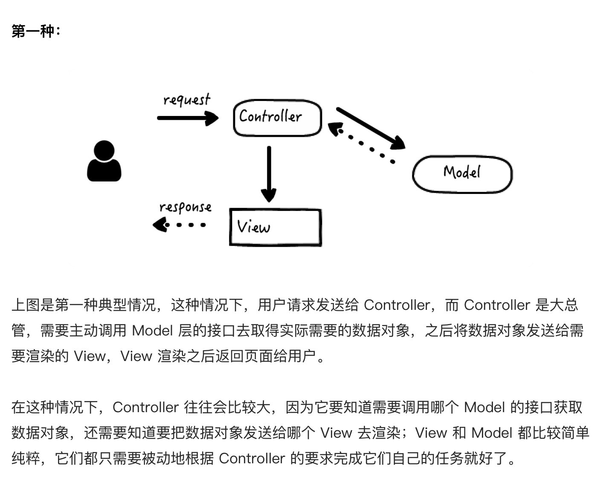

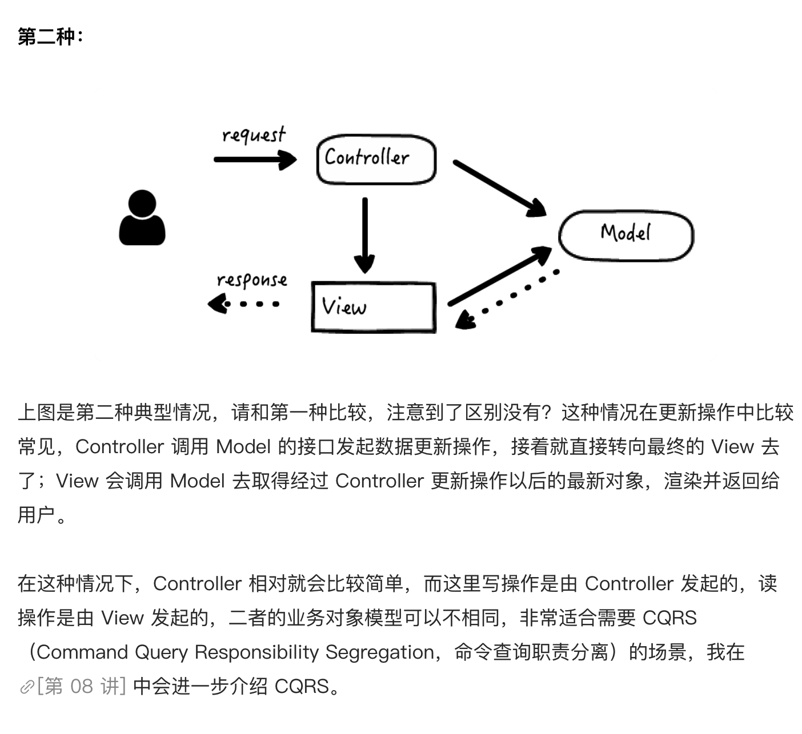

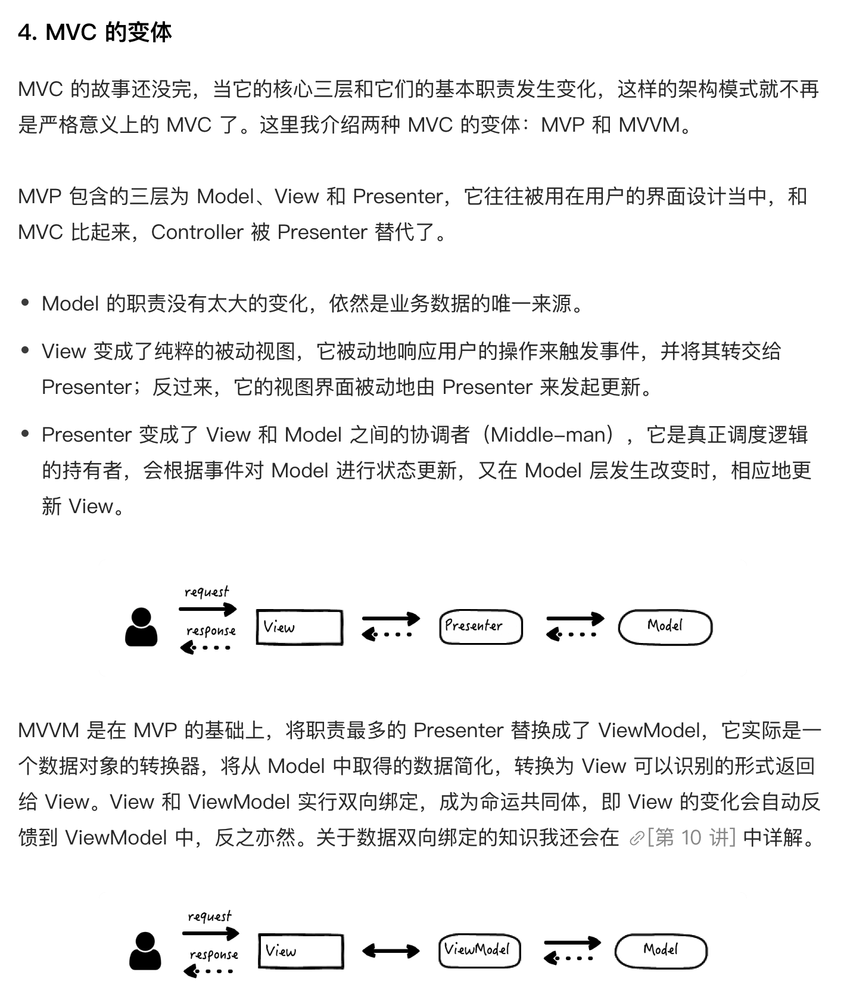

mvc和mvp的主要区别
MVP 是 MVC 的变体，功能、层次和应用场景有所区别，下面是我的归纳，供参考。

简单说，对于 MVC 来说，Controller 层次上完全独立于 View，它可以跨多个视图、可以决定视图路由，更多存放的是控制逻辑，应用较为广泛，但多数在服务端代码中；

而对于 MVP 来说，Presenter 则其实是和 View 在相似的层次上，协调并把 Model 的数据绑定到指定 View 上去，主要用在纯粹 UI 的实现中。

跟php 一样
①xxxAction-②(Ixxx接口类-xxxServiceImpl实现类)-③xxxDao这“三层”结构，xxxAction属于Controller，那么(Ixxx接口类-xxxServiceImpl实现类)-xxxDao应该都属于Model层

## model 层

模型就是当我们使用软件去解决真实世界中各种实际问题的时候，对那些我们关心的实际事物的抽象和简化

贫血模型（Anemic Domain Model），意味着模型实体在设计和实现上，不包含或包含很少的逻辑。常这种情况下，逻辑是被挪了出去，由其它单独的一层代码（比如这层代码是“Service”）来完成。
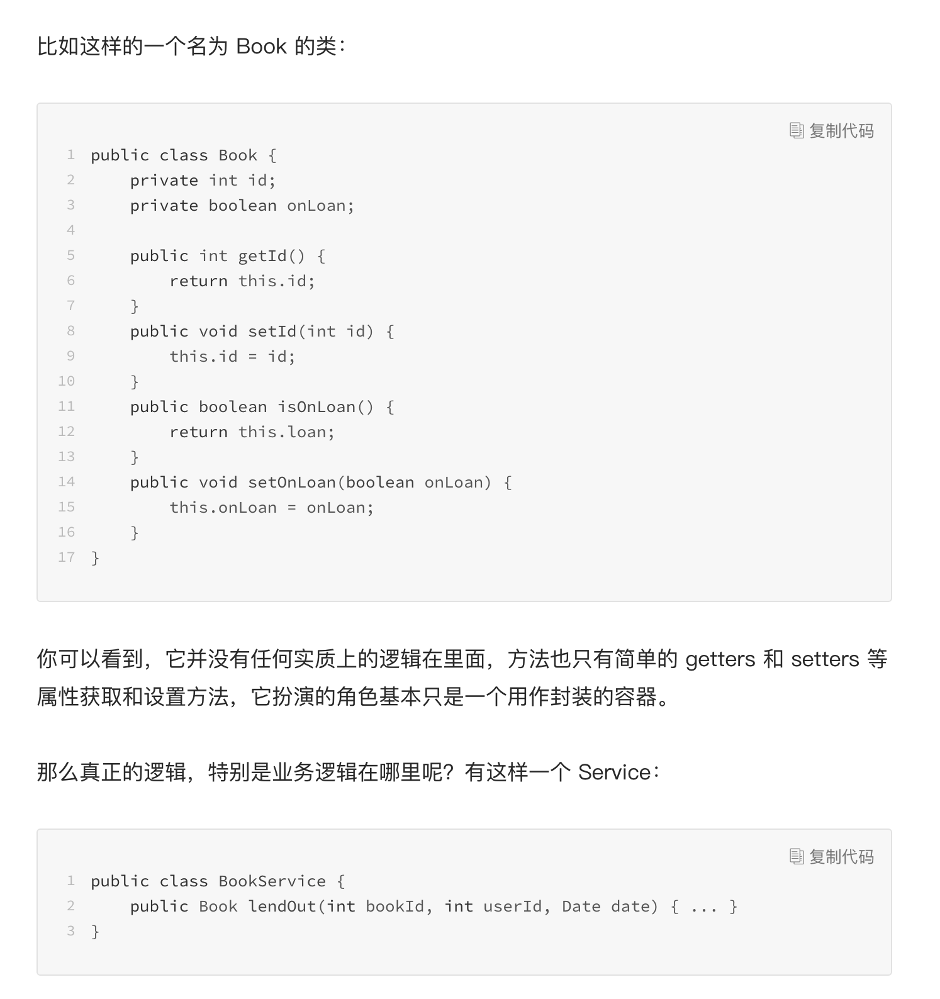
这时的模型实体，不包含逻辑，但包含状态，而逻辑被解耦到了无状态 Service 中。

在充血模型的设计中，领域模型实体就是有血有肉的了，既包含数据，也包含逻辑，具备了更高程度的完备性和自恰性，
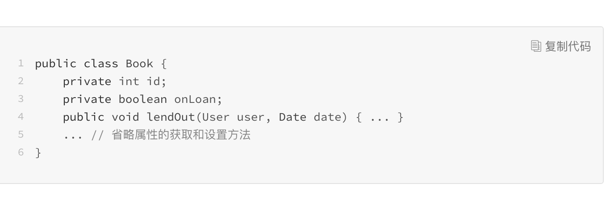

而在贫血模型中就做不到这一点，一是因为数据和行为分散在两处，二是为了在 Service 中能组装模型，模型实体中本不该对用户开放的接口会被迫暴露出来，于是整个过程中就会存在状态不一致的可能。

第一层 Facade，提供粗粒度的接口，逻辑上是对 Service 功能的组合。
第二层 Service，前面已经介绍了，通常会存放仅属于单个领域模型实体的操作。
第三层数据访问层，在某些类型的数据访问中需要，比如关系型数据库，这里存放数据库字段和模型对象之间的 ORM（Object-Relational Mapping，对象关系映射）关系。
第四层基础设施层，这一层的通用性最好，必须和业务无关。某些框架会把基础设施的工作给做了，但有时候也需要我们自己实现。比如 S3Service，存放数据到亚马逊的分布式文件系统。

简单来说，CQRS 模式下，模型层的接口分为且只分为两种：

命令（Command），它不返回任何结果，但会改变数据的状态。
查询（Query），它返回结果，但是不会改变数据的状态。

           | 数据 | 逻辑
------------------------------------------------
数据 | 承载模型状态，开 | 面向对象
           | 放操作状态的接口 | 充血模型
------------------------------------------------
逻辑 | 面向对象 | 面向服务
           | 充血模型 | 无状态，restful


架构上，客户端聚合达成了客户端 - 服务端分离和模板 - 数据聚合这二者的统一，这往往可以简化架构，保持灵活性。

资源上，客户端聚合将服务器端聚合造成的计算压力，分散到了客户端

客户端聚合也有它天然的弊端。其中最重要的一条，就是客户端聚合要求客户端具备一定的规范性和运算能力

常见的聚合技术

1. iframe 聚合


2. 模版引擎

## 控制器

控制器用于接收请求，校验参数，调用 Model 层获取业务数据，构造和绑定上下文，并转给 View 层去渲染。

入口路由就是路径映射，根据配置的规则，以及请求 URI 的路径，找到具体接收和处理这个请求的控制器逻辑；
出口路由就是视图指向，根据配置的规则，以及控制器处理完毕后返回的信息，找到需要渲染的视图页面。

1. 更喜欢把配置放在单独一层，这么做的好处是部署的时候，更改配置比较方便而且基本不会有遗漏。这里不知道是不是可以使用二者结合的方式，对于那些经常变的配置，比如 IP 地址，端口号，token，数据库连接可以考虑放在单独一层，其他和具体业务逻辑相关的，不容易改变的配置，利用注解和实现逻辑放在一起

2. 控制层基本上就做数据验证、然后 mapping 到对应的业务处理函数，业务处理函数处理好请求后会将结果返回，控制层将业务处理函数返回的结果作为响应返回给前端页面

选修课堂的例子，web.xml 和 BookSevlet.java 所做的事情都属于 controller 层的范畴，book.jsp 里面对应的是 Model 层和 view 层，因为使用了 JavaBean 这里应该算是 View 去直接接触 Model？

## 面向切面编程

AOP 的概念
面向切面编程是一种通过横切关注点（Cross-cutting Concerns）分离来增强代码模块性的方法，它能够在不修改业务主体代码的情况下，对它添加额外的行为。

编译期间的静态织入，又称为编译时增强。织入（Weaving），指的是将切面代码和源业务代码链接起来的过程

运行期间的动态代理，又称为运行时增强。这种方式是在程序运行时，依靠预先创建或运行时创建的代理类来完成切面功能的。

Spring AOP 默认支持的是后者——运行期间的动态代理。至于具体实现，通常来说，我们应该优先考虑使用 JDK 的动态代理技术；但是如果目标类没有实现接口，我们只能退而求其次，使用 CGLib。

动态代理的方式由于在运行时完成代理类或代理对象的创建，需要用到 Java 的拦截、反射和字节码生成等技术，因此运行时的性能表现往往没有静态织入好，功能也有较多限制，但是由于使用起来简便（不需要语言扩展，不需要特殊的编译器等），它的实际应用更为广泛。

控制反转 IoC

控制反转，IoC，即 Inversion of Control，言下之意，指的是把原有的控制方向掉转过来了。在我们常规的程序流程中，对象是由主程序流程创建的，例如，在业务流程中使用 new 关键字来创建依赖对象。

但是，当我们使用 Spring 框架的时候，Spring 把对象创建的工作接管过来，它作为对象容器，来负责对象的查找、匹配、创建、装配，依赖管理，等等。而主程序流程，则不用关心对象是怎么来的，只需要使用对象就可以了

IoC 在实现上包含两种方式，一种叫做依赖查找（DL，Dependency Lookup），另一种叫做依赖注入（DI，Dependency Injection）。二者缺一不可，Spring 容器做到了两者，就如同上面的例子，容器需要先查找到 bookDao 和 loanDao 所对应的对象，再把它们注入进来。当然，我们平时听到的更多是第二种。

有了一个大致的感受，那么 IoC 到底能带来什么好处呢？我觉得主要有这样两个方面：

资源统一配置管理。这个方面很好，但并不是 IoC 最大的优势，因为，如果你不把资源交给容器管理，而是自己建立一个资源管理类来管理某项资源，一样可以得到“统一管理”的所有优势。

业务代码不再包含依赖资源的访问逻辑，因此资源访问和业务流程的代码解耦开了。我觉得这里的“解耦”才是 IoC 最核心的优势，它让各层之间的依赖关系变得松散。就如同上面的代码例子一样，如果哪一天我想把它依赖的 bookDao 和 loanDao 替换掉（比如，我想为 Service 层做测试），Service 一行代码都不用改，它压根都不需要知道。

使用 Java 的人可以快速上手，也可以把精力专注在高层的架构和设计上面，这就是为什么使用 Java 的人往往对模式特别敏感的原因。

Java EE，全称为 Java Platform Enterprise Edition，即 Java 平台企业版，是 Java 的三大平台之一，另两大是 Java SE（标准版）和 Java ME（微型版）

数据访问对象

DAO 本质上是能够为某种特定数据持久化的机制提供抽象结构的对象

DAO（data access object）

第一，技术是分级的，具体说，是分短命和长寿的，也是分表面和本质的。我们要学习各种技术，但是我们要把足够的精力放到长寿的技术以及技术本质上。这就是第一个故事带来的启发。

第二，基础知识和能力的训练需要长期坚持，无论是在工作中，还是工作以外。这就是第二个故事带来的启发。

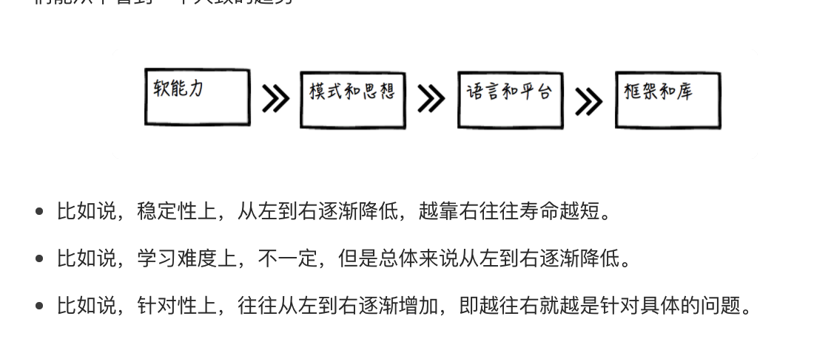

把大量的时间都花在记忆一个接一个的框架和库上面，妄图靠数量取胜，不可取。

1. 过于关注配置使用，忽略原理和场景分析。这一点我觉得是最容易在迈入职场没多久的程序员身上见到的问题，非常普遍。老板一个命令下来，心里慌得很，就想着怎么把问题搞定，而有一些问题是知识迷局一类的，比如，怎样配置整合 SSH（Struts、Spring 和 Hibernate）。

可是呢，对于刚才使用到的技术，付出了那么多，却只收获了这一个小小的迷局的解。

2. 过于关注编程语言的语法和语言技巧，忽略语言思考和书写时的思维模式。

JavaScript 语言，里面有很多坑，但是有一些坑是语言本身的不良设计造成的，知道当然好，但也不要因此沾沾自喜。但是对于一个写惯了 C++、Java 等后端静态语言的程序员来说，JavaScript 异步编程、函数成为一等公民等等这些颠覆以往编程思维模式的特性，才是学习这门新语言一个收获颇丰的地方

3. 过于关注具体实现逻辑，忽略了对于设计的思考和权衡。

4. 直接学习模式和思想，脱离了具体实践。

基础知识和能力

数据结构、算法、网络等等这些，都是基础知识，如果工作中的强化不够，工作以外的学习和训练还是需要的。

除了基础知识，还有基础能力。最重要的，就是编程能力。

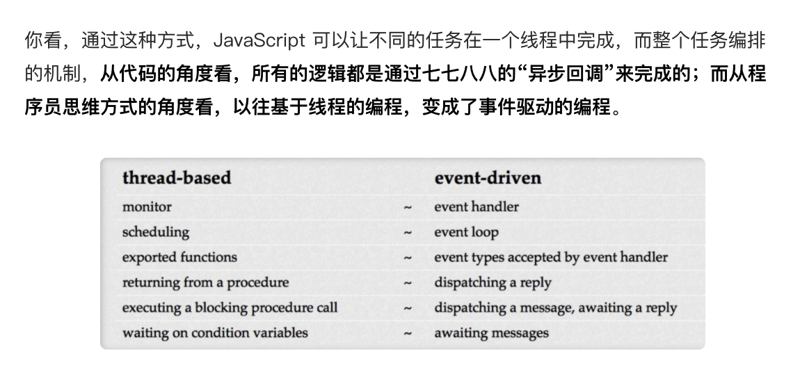

基于线程的方式可以阻塞线程，等待时间或某个条件满足后再继续执行；而事件驱动则相反，发送一条消息后无阻塞等待回调的发生。阻塞线程的方式对资源的消耗往往更加显著，因为无论是否执行线程都被占用，但从人直观理解的角度来说，代码更直白，更符合人对顺序执行的理解；而事件驱动的方式则相反，资源消耗上更优，但是代码的执行顺序，以及由此产生的系统状态判断变得难以预知。

请注意的是，在 JavaScript 中我们通常无法使用基于线程的编程，但是在很多情况下，例如 Java 和 Python 这些传统的后端编程语言中，我们可以混合使用基于线程和事件驱动的编程，它们是互不矛盾的。

浏览器的 JavaScript 执行是单线程的，但不代表浏览器是单线程的。浏览器通常还包含其它线程，

界面（GUI）渲染线程，这个线程的执行和上述的 JavaScript 工作线程是互斥的，即二者不可同时执行；

事件触发线程，这个也很好理解，我们介绍过有一个神秘人物帮着往队列中放入事件（例子中的回调打印 2 和回调打印 3），这个神秘人物就是事件触发线程。

1. 封装

在面向对象编程中，封装（Encapsulation）说的是一种通过接口抽象将具体实现包装并隐藏起来的方法。具体来说，封装的机制包括两大部分：

限制对对象内部组件直接访问的机制；

将数据和方法绑定起来，对外提供方法，从而改变对象状态的机制。

闭包简单说，就是引用了自由变量的函数。这里的关键是“自由变量”，其实这个自由变量，扮演的作用是为这个函数调用提供了一个“上下文”，而上下文的不同，将对入参相同的函数调用造成不同的影响，它包括：

函数的行为不同，即函数调用改变其上下文中的其它变量，如例子中的 setName()；

函数的返回值不同，如例子中的 getName()。

和闭包相对的，是一种称为“纯函数”（Pure Function）的东西，即函数不允许引用任何自由变量。因此，和上面两条“影响”对应，纯函数的调用必须满足如下特性：

函数的调用不允许改变其所属的上下文；
相同入参的函数调用一定能得到相同的返回值。

闭包的调用是不安全的，因为它可能改变对象的内部属性（闭包的上下文）；同时它也不是幂等的，因为一次调用和多次调用可能产生不同的结果。纯函数的调用是安全的，也是幂等的。

于是，我们又一次发现，技术是相通，是可以联想和类比的。本质上，它们围绕的都是一个方法（函数）是否引用和改变外部状态的问题。

2. 继承

在面向对象编程中，继承（Inheritance）指的是一个对象或者类能够自动保持另一个对象或者类的实现的一种机制。我们经常讲的子类具备父类的所有特性，只是继承中的一种，叫做类继承；其实还有另一种，对象继承，这种继承只需要对象，不需要类。

在 ES6 以前，没有继承（extends）关键字，JavaScript 最常见的继承方式叫做原型链继承。原型（prototype）是 JavaScript 函数的一个内置属性，指向另外的一个对象，而那个对象的所有属性和方法，都会被这个函数的所有实例自动继承。

3. 多态在面向对象编程中，多态（Polymorphism）指的是同样的接口，有着不同的实现。

2，还可以把 原型链继承 和 构造继承组合 起来。
```js
function Base(name) {
this.name = name;
}
function Child(name) {
Base.call(this, name); // 第一次调用父类构造函数
}
Child.prototype = new Base(); // 第二次调用父类构造函数

var c = new Child('Life');
console.log(c.name); // "Life"
console.log(c instanceof Base); // true
```

好处是结合了 原型链继承 和 构造继承 的优点。
坏处是需要调用两次父类构造函数。如果继承链很长，则开销很大，以2的n次方增长（n是继承链的深度）

优雅降级并非一定发生在用户设备的能力不匹配时，还有可能发生在服务器端资源出现瓶颈的时候，比如某些访问量特别大或者系统出现问题的时刻，资源紧张，服务端可以关闭某一些次要功能，降低一些用户体验，用几种核心资源来保证基础功能的正常运行。

回归增强

它要求为系统的特性设定基线，并应用到较老的设备和浏览器中。

目的是使得同一份网页，在不同的设备上有合适的展现。

Web 绘图标准

绝大多数都是位图。位图又叫栅格图像，无论位图采用何种压缩算法，它本质就是点阵，它对于图像本身更具备普适性，无论图像的形状如何，都可以很容易分解为一个二维的点阵，更大的图，或者更高的分辨率，只是需要更密集的点阵而已。

矢量图是使用点、线段或者多边形等基于数学方程的几何形状来表示的图像。将一个复杂图像使用矢量的方式来表达，显然要比位图困难得多，但是矢量图可以无损放大，因为它的本质是一组基于数学方程的几何形状的集合，因此无论放大多少倍，形状都不会发生失真或扭曲。

前端生成的图形图像具有天然的交互性。前端生成的图像不仅仅意味着一张“图”，还意味着它能够和 HTML 这样的呈现结构紧密地结合起来，而图像上的组成部分都可以响应用户的行为。

图像的生成可能需要显著的资源消耗，放到前端可以减轻服务器压力。这里的消耗既包括 CPU、内存等物理资源消耗，还有用户的等待时间消耗，在前端可以更好地给用户提供渲染过程的反馈。

图形图像的设计和规划本就属于呈现层，系统架构上把它放到前端更容易实现前后端分离，组织结构上能让擅长视觉处理的前端工程师和 UX 设计师更自然地工作。有了数据，就可以对前端的图像生成逻辑进行设计和测试，工程师和设计师只需要专注于前端的通用技能就可以较为独立地完成工作。

1. SVG
SVG 即 Scalable Vector Graphics，可缩放矢量图形。它是基于可扩展标记语言（XML），用于描述二维矢量图形的一种图形格式。

SVG 支持三种格式的图形：矢量图形、栅格图像和文本。 SVG 并不只是一个矢量图的简单表示规范，而是尝试把矢量图、位图和文字统一起来的标准。

```jsx

<?xml version="1.0" encoding="UTF-8"?>
<svg xmlns="http://www.w3.org/2000/svg" version="1.1" width="300" height="300">
  <rect x="60" y="60" width="200" height="200" fill="red" stroke="black" stroke-width="2px" />
</svg>

```

第一行了指明 XML 的版本和编码；第二行是一个 svg 的根节点，指明了协议和版本号，图像画布的大小（500 x 500），其中只包含一个矩形（rect），这个矩形的起始位置是（x, y），宽和高都为 200，填充红色，并使用 2px 宽的黑色线条来描边。

2. Canvas

canvas 不是矢量图，而是位图，会失真。

总的来说，从图片描述过程上来说，SVG 是 HTML 标签原生支持的，因此就可以使用这种声明式的语言来描述图片，它更加直观、形象、具体，每一个图形组成的 DOM 都可以很方便地绑定和用户交互的事件。这种在渲染技术上通过提供一套完整的图像绘制模型来实现的方式叫做 Retained Mode。

Canvas 则是藉由 JavaScript 的命令式的语言对既定 API 的调用，来完成图像的绘制，canvas 标签的内部，并没有任何 DOM 结构，这让它无法使用传统的 DOM 对象绑定的方式来和图像内部的元素进行互动，但它更直接、可编程性强，在浏览器内存中不需要为了图形维护一棵巨大的 DOM 树，这也让它在遇到大量的密集对象时，拥有更高的渲染性能。这种在渲染技术上通过直接调用图形对象的绘制命令接口来实现的方式叫做 Immediate Mode。

1. 用 Promise 优化嵌套回调

2. 用生成器来实现协程

协程，Coroutine，简单说就是一种通用的协作式多任务的子程序，它通过任务执行的挂起与恢复，来实现任务之间的切换。

这里提到的“协作式”，是一种多任务处理的模式，它和“抢占式”相对。如果是协作式，每个任务处理的逻辑必须主动放弃执行权（挂起），将继续执行的资源让出来给别的任务，直到重新获得继续执行的机会（恢复）；而抢占式则完全将任务调度交由第三方，比如操作系统，它可以直接剥夺当前执行任务的资源，分配给其它任务。

我们知道，创建线程的开销比进程小，而协程通常完全是在同一个线程内完成的，连线程切换的代价都免去了，因此它在资源开销方面更有优势。

JavaScript 的协程是通过生成器来实现的，执行的主流程在生成器中可以以 yield 为界，进行协作式的挂起和恢复操作，从而在外部函数和生成器内部逻辑之间跳转，而 JavaScript 引擎会负责管理上下文的切换。

首先我们来认识一下 JavaScript 和迭代有关的两个协议，它们是我们后面学习生成器的基础：

* 第一个是可迭代协议，它允许定义对象自己的迭代行为，比如哪些属性方法是可以被 for 循环遍历到的；
* 第二个是迭代器协议，它定义了一种标准的方法来依次产生序列的下一个值（next() 方法），如果序列是有限长的，并且在所有的值都产生后，将有一个默认的返回值。

生成器对象是由生成器函数 function* 返回，且符合“可迭代协议”和“迭代器协议”两者。

function* 和 yield 关键字通常一起使用，yield 用来在生成器的 next() 方法执行时，标识生成器执行中断的位置，并将 yield 右侧表达式的值返回。

生成器可不是只能往外返回，还能往里传值。具体说，yield 右侧的表达式会返回，但是在调用 next() 方法时，入参会被替代掉 yield 及右侧的表达式而参与代码运算.

## 缓存

缓存针对的是“资源”

当某一个操作是“幂等”的和“安全”的。那么这样的操作就可以被抽象为对“资源”的获取操作，那么它才可以考虑被缓存。有些操作不幂等、不安全，比如银行转账，改变了目标对象的状态，自然就难以被缓存。

缓存必须是“重复”获取的

我们把一批数据获取中，通过缓存获得数据的次数，除以总的次数，得到的结果，叫做缓存的命中率

缓存是为了解决“开销”的问题

有两个使用动机最为常见，一个是 latency，延迟，即追求更低的延迟，这也是“更快”这个印象的由来；另一个使用动机，是 throughput，吞吐量，即追求更高的吞吐量。

3. 异步错误处理

听和读重于说和写


### 缓存应用模式

1. Cache-Aside
数据获取策略：

应用先去查看缓存是否有所需数据；

* 如果有，应用直接将缓存数据返回给请求方；
* 如果没有，应用执行原始逻辑，例如查询数据库得到结果数据；
* 应用将结果数据写入缓存。

数据读取的异常情形：

* 如果数据库读取异常，直接返回失败，没有数据不一致的情况发生；
* 如果数据库读取成功，但是缓存写入失败，那么下一次同一数据的访问还将继续尝试写入，因此这时也没有不一致的情况发生。可见，这两种异常情形都是“安全”的。

数据更新策略：

* 应用先更新数据库；
* 应用再令缓存失效。

数据更新的这个策略，通常来说，最重要的一点是必须先更新数据库，而不是先令缓存失效，即这个顺序不能倒过来。

第二个关键点是，数据库更新以后，需要令缓存失效，而不是更新缓存为数据库的最新值。

数据更新的异常情形：

* 如果数据库操作失败，那么直接返回失败，没有数据不一致的情况发生；
* 如果数据库操作成功，但是缓存失效操作失败，这个问题很难发生，但一旦发生就会非常麻烦，缓存中的数据是过期数据，需要特殊处理来纠正。

2. Read-Through
例如一些 ORM 框架，
数据获取策略：

* 应用向缓存要求数据；
* 如果缓存中有数据，返回给应用，应用再将数据返回；
* 如果没有，缓存查询数据库，并将结果写入自己；
* 缓存将数据返回给应用。

3. Write-Through

数据更新策略：

* 应用要求缓存更新数据；
* 如果缓存中有对应数据，先更新该数据；
* 缓存再更新数据库中的数据；
* 缓存告知应用更新完成。

### 缓存使用的问题

1. 缓存穿透
缓存穿透，指的是在某些情况下，大量对于同一个数据的访问，经过了缓存屏障，但是缓存却未能起到应有的保护作用

2. 缓存雪崩
原本起屏障作用的缓存，如果在一定的时间段内，对于大量的请求访问失效，即失去了屏障作用，造成它后方的系统压力过大，引起系统过载、宕机等问题，就叫做缓存雪崩。

对于这种类型的雪崩，最常见的解决方法无非还是限流、预热两种：前者保证了请求大量落到数据库的时候，系统只接纳能够承载的数量；而后者则在请求访问前，先主动地往内存中加载一定的热点数据，这样请求到来的时候，缓存不是空的，已经具有一定的保护能力了。

3. 缓存容量失控

4. LRU 的致命缺陷

原理是：维护一个限定最大容量的队列，队列头部总是放置最近访问的元素（包括新加入的元素），而在超过容量限制时总是从队尾淘汰元素。

有多种算法可以作为 LRU 的改进方案，比如 LRU-K。就是主缓存队列排的是“第 K 次访问的元素”，也就是说，如果访问次数小于 K，则在另外的一个“低级”队列中维护，这样就保证了只有到达一定的访问下限才会被送到主 LRU 队列中。

这种方法保证了偶然的页面访问不会影响网站在 LRU 队列中应有的数据分布。再进一步优化，可以将两级队列变成更多级，或者是将低级队列的策略变成 FIFO（2Q 算法）等等，但原理是不变的。

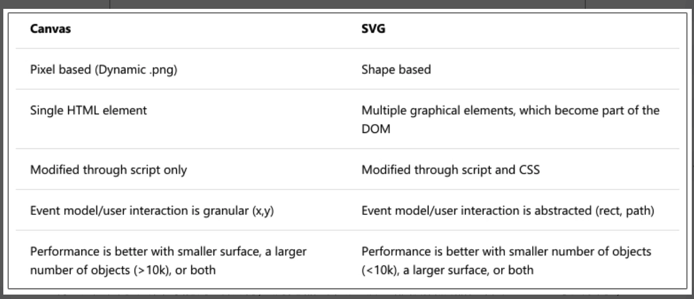

数据可视化的 JavaScript 库

状态都在统一的地方维护，而状态的改变，都通过事件的发生和响应机制来进行，且都将事件的响应逻辑（回调）交给用户来完成.
