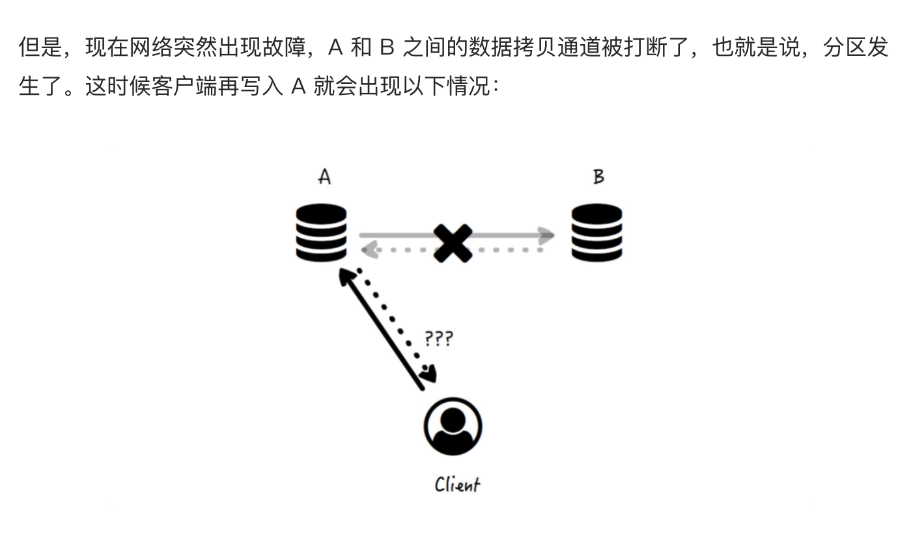
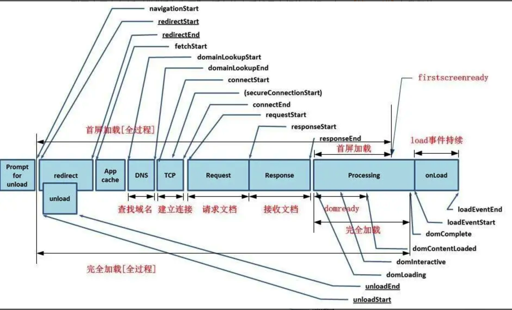

# 全栈工程师

## 网络互联的昨天、今天和明天： http协议的演化


从网络协议分层上看， TCP 协议在 HTTP 协议的下方（TCP 是在 OSI 7 层协议的第 4 层，而 HTTP 则是在最高的第 7 层应用层，因此，前者更加“底层”一点）。

在 HTTP 1.0 版本时，每一组请求和响应的交互，都要完成一次 TCP 的连接和关闭操作，


通过建立长连接，中间的几次 TCP 连接开始和结束的握手都省掉了。

1. 在 HTTP 头部，有这样一行：

Transfer-Encoding: chunked

1. 正文的内容是这样的：

127a
...
0

事实上，如果协议头中存在上述的 chunked 头，表示将采用分块传输编码，响应的消息将由若干个块分次传输，而不是一次传回。刚才的 127a，指的是接下去这一块的大小，在这些有意义的块传输完毕后，会紧跟上一个长度为 0 的块和一个空行，表示传输结束了，这也是最后的那个 0 的含义。

在长连接开启的情况下，使用 Content-Length 还是 chunked 头，必须具备其中一种。分块传输编码大大地提高了 HTTP 交互的灵活性，服务端可以在还不知道最终将传递多少数据的时候，就可以一块一块将数据传回来

HTTP/2现在最广泛使用的 HTTP 协议还是 1.1 ，但是 HTTP/2 已经提出，在保持兼容性的基础上，包含了这样几个重要改进：

* 设计了一种机制，允许客户端来选择使用的 HTTP 版本，这个机制被命名为 ALPN；

* HTTP 头的压缩，在 HTTP/2 以前，HTTP 正文支持多种方式的压缩，但是 HTTP 头部却不能；

* 多路复用，允许客户端同时在一个连接中同时传输多组请求响应的方法；

* 服务端的 push 机制，比方说客户端去获取一个网页的时候，下载网页，分析网页内容，得知还需要一个 js 文件和一个 css 文件，于是再分别下载，而服务端的 push 机制可以提前就把这些资源推送到客户端，而不需要客户端来索取，从而节约网页加载总时间。

这两个是不一样的，keep-alive 是不关闭 TCP 连接，也就是长连接，但是在不使用管道机制的情况下，交互是单工的，即客户端必须要等前一个请求的响应返回之后，新的请求才能发过去。而在使用管道机制的情况下，请求发送可以非阻塞，但是响应返回必须依然严格按照请求的顺序。

而多路复用则是基于流的，那么在传输的时候，无论请求还是响应，只要逻辑上允许就可以传输，如果两个请求没有依赖关系可以不必等待前一个返回而直接发送，虽说用的是同一条连接。

长连接需要客户端和服务端都要支持，同时 HTTP/1.1 的 keep-alive 要打开，对于这个 TCP 连接的维护，大多数 web 服务器都支持。

分块传输两个特性：

1. 分块传输可以保持 HTTP 的持续链接（即 Keep-Alive）。
2. 分块传输可以让客户端在 body 信息发送完后，继续发送额外的 header 信息。

基于这两个特性，暂时想到下面两个类似的应用场景：

* 优先传输网页上最重要的内容（比如首屏内容，首屏 CSS），其他延后传输。
* 页面上内容的长度未知的场景，比如瀑布流布局。
* 可以在内容传输后，加上 Expires header，来告知内容是否已经过期。

知识点：

【基础】如果你对 HTTP 还不熟悉的话，推荐你阅读一篇系统性介绍 HTTP 的教程，比如 MDN 的这篇[教程](https://developer.mozilla.org/zh-CN/docs/Web/HTTP)。
【基础】The OSI model explained: How to understand (and remember) the 7 layer network model：[教程](https://www.networkworld.com/article/3239677/the-osi-model-explained-and-how-to-easily-remember-its-7-layers.html)

## 为 http 穿上盔甲 

早期 http 会产生以下安全问题

* Interception：拦截。传输的消息可以被中间人 C 截获，并泄露数据。
* Spoofing：伪装。A 和 B 都可能被 C 冒名顶替，因此消息传输变成了 C 发送到 B，或者 A 发送到 C。
* Falsification：篡改。C 改写了传输的消息，因此 B 收到了一条被篡改的消息而不知情。
* Repudiation：否认。这一类没有 C 什么事，而是由于 A 或 B 不安好心。A 把消息成功发送了，但之后 A 否认这件事发生过；或者 B 其实收到了消息，但是否认他收到过。

但是，与其重新设计一套安全传输方案，倒不如发挥一点拿来主义的精神，把已有的和成熟的安全协议直接拿过来套用，最好它位于呈现层（Presentation Layer），因此正好加塞在 HTTP 所在的应用层（Application Layer）下面，这样这个过程对于 HTTP 本身透明，也不影响原本 HTTP 以下的协议（例如 TCP）。

HTTP + SSL/TLS = HTTPS

这里涉及到的两个安全协议，SSL 和 TLS，下面简要说明下二者关系。SSL 指的是 Secure Socket Layer，而 TLS 指的是 Transport Layer Security，事实上，一开始只有 SSL，但是在 3.0 版本之后，SSL 被标准化并通过 RFC 2246 以 SSL 为基础建立了 TLS 的第一个版本，因此可以简单地认为 SSL 和 TLS 是具备父子衍生关系的同一类安全协议。


### “对称性加密”和“非对称性加密”

对称性加密（Symmetric Cryptography），指的是加密和解密使用相同的密钥。这种方式相对简单，加密解密速度快，但是由于加密和解密需要使用相同的密钥，如何安全地传递密钥，往往成为一个难题。

非对称性加密（Asymmetric Cryptography），指的是数据加密和解密需要使用不同的密钥。通常一个被称为公钥（Public Key），另一个被称为私钥（Private Key），二者一般同时生成，但是公钥往往可以公开和传播，而私钥不能。经过公钥加密的数据，需要用私钥才能解密；

原始数据 + 公钥 → 加密数据
加密数据 + 私钥 → 原始数据


Step 1: Client Hello. 客户端很有礼貌，先向服务端打了个招呼，并携带以下信息：
客户端产生的随机数 A；
客户端支持的加密方法列表。

Step 2: Server Hello. 服务端也很有礼貌，向客户端回了个招呼：
服务端产生的随机数 B；
服务端根据客户端的支持情况确定出的加密方法组合（Cipher Suite）。

Step 3: Certificate, Server Key Exchange, Server Hello Done. 服务端在招呼之后也紧跟着告知：
Certificate，证书信息，证书包含了服务端生成的公钥。

这个公钥有什么用呢？别急，后面会说到。客户端收到消息后，验证确认证书真实有效，那么这个证书里面的公钥也就是可信的了。

接着客户端再生成一个随机数 C（Pre-master Secret），于是现在共有随机数 A、B 和 C，根据约好的加密方法组合，三者可生成新的密钥 X（Master Secret），而由 X 可继续生成真正用于后续数据进行加密和解密的对称密钥。因为它是在本次 TLS 会话中生成的，所以也被称为会话密钥（Session Secret）。

客户端随机数 A + 服务端随机数 B + 客户端 Pre-master Secret C → 会话密钥

Step 4: Client Key Exchange, Change Cipher Spec, Encrypted Handshake Message. 接着客户端告诉服务端：

Client Key Exchange，本质上它就是上面说的这个 C，但使用了服务端通过证书发来的公钥加密；

Change Cipher Spec，客户端同意正式启用约好的加密方法和密钥了，后面的数据传输全部都使用密钥 X 来加密；

Encrypted Handshake Message，快速验证：这是客户端对于整个对话进行摘要并加密得到的串，如果经过服务端解密，和原串相等，就证明整个握手过程是成功

服务端收到消息后，用自己私钥解密上面的 Client Key Exchange，得到了 C，这样它和客户端一样，也得到了 A、B 和 C，继而到 X，以及最终的会话密钥。

于是，客户端和服务端都得到了能够加密解密传输数据的对称密钥——会话密钥。

：TLS 是通过非对称加密技术来保证握手过程中的可靠性（公钥加密，私钥解密），再通过对称加密技术来保证数据传输过程中的可靠性的。

Step 5: Change Cipher Spec, Encrypted Handshake Message. 服务端最后也告知客户端：

Change Cipher Spec，服务端也同意要正式启用约好的加密方法和密钥，后面的数据传输全部都使用 X 来加密。

Encrypted Handshake Message，快速验证：这是服务端对于整个对话进行摘要并加密得到的串，如果经过客户端解密，和原串相等，就证明整个握手过程是成功的。

握手过程是使用非对称加密实现的，而真正后续的数据传输部分却是由对称加密（会话密钥）实现的。

### 客户端验证ca证书📄

证书在申请的时候，我们提到的服务器公钥就已经是该证书的一部分了，因此我们才说，如果证书是有效的，那么它携带的公钥就是有效的。

在当时申请的时候，证书发布机构对证书做摘要生成指纹，并使用它自己的私钥为该指纹加密，生成数字签名（Digital Signature），而这个数字签名也随证书一起发布。这个发布机构的私钥是它内部自己管理的，不会外泄。

指纹 + 私钥 → 数字签名

验证过程则正好是发布过程的反向，即在客户端要对这个被检测证书做两件事：

对它用指定算法进行摘要，得到指纹 P1；
使用证书发布机构的公钥对它的数字签名进行解密，得到指纹 P2。

数字签名 + 公钥 → 指纹

如果 P1 和 P2 一致，就说明证书未被篡改过，也说明这个服务端发来的证书是真实有效的，而不是仿冒的。

对称性密钥是每次会话生成的，会话以外自动失效，这就像武功唯快不破一样，通常很短的时间就更换掉了；如果使用非对称性加密方式来传输实际数据，因为它只在最开始的时候生成一次，而不是每次会话都生成，因此在传输中同一个公钥会被发给多个不同的客户端，因此第三方的中间人可以使用这个公开的公钥解密服务端发给其它客户端的数据，这显然不具备安全性。

证书可能被篡改
证书返回给客户端的内容是： 证书内容（版本、有效期、公钥等） + 数字签名
数字签名是对证书内容进行摘要的指纹 + 密钥进行加密 得到的

## 服务端推送技术

“Pull”指的是去主动发起行为获取消息，一般在客户端 / 服务器（C/S，Client/Server）或浏览器 / 服务器（B/S，Browser/Server）交互中，客户端或浏览器主动发起的网络请求数据的行为。

而“Poll”，尽管在某些场景下也和 Pull 通用了，但在计算机网络的领域里，通常把它解释为“轮询”，或者“周期性查询”，在 Pull 的基础上增加了“周期性”的概念，这也是它和 Pull 相比最本质的区别。

pull 应用远比push广泛， 特别在分布式系统中

服务端不需要维护客户端的列表，不需要知晓客户端的情况，不需要了解客户端查询的策略。这有助于把服务端从对客户端繁重的管理工作中解放出来，而成为无状态的简单服务，变得具备幂等性（idempotent，指执行多次和执行一次的结果一样），更容易横向扩展。

服务端推动技术

1. Comet

客户端发送一个普通的 HTTP 请求到服务端以后，服务端不像以往一样在处理后立即返回数据，而是保持住连接不释放，每当有更新事件发生，就使用分块传输的方式返回数据

若干次数据返回以后可以完成此次请求响应过程（分块传输返回长度为 0 的块，表示传输结束），等待客户端下一次请求发送。这种过程看起来也属于轮询，但是每个周期可包含多次服务端数据返回，因而也被形象地称为“长轮询”（Long Polling）。


2. WebSocket

它是真正的双向、全双工协议，也就是说，客户端和服务端都可以主动发起请求，回复响应，而且两边的传输都互相独立。

由于它在网络分层模型中位于 TLS 上方，因此他可以使用和 HTTP 一样的加密方式传输：HTTP → WSHTTPS → WSS

## 工整与自由的风格之争：SOAP和REST

SOAP，Simple Object Access Protocol，即简单对象访问协议，定义了数据对象传输的格式，以便在网络的节点之间交换信息。

消息传输就像快递，HTTP 主要关心的是信封，而 SOAP 主要关心的是信封里的物件

REST，Representational State Transfer，即表现层状态转换，指的是一种为了信息能在互联网上顺利传递而设计的软件架构风格。

REST 的核心要素包括资源、表现层和状态转换这三个部分。


幂等性指的是对服务端的数据状态，执行多次操作是否和执行一次产生的结果一样。

幂等操作是可以被重试而不产生副作用的。

安全性指的是该操作是否对服务端的数据状态产生了影响。

安全操作是可以被缓存的

全栈系统的设计和优化都需要紧密围绕幂等性和安全性进行，
就把 HTTP 的方法和实际对资源的操作行为绑定起来了。当然，还有一些其它方法，比较常见的有：

* PATCH：和 PUT 类似，也用于资源更新，但支持的是资源单位的部分更新，并且在资源不存在的时候，能够自动创建资源，这个方法实际使用比较少。
* HEAD：这个方法只返回资源的头部，避免了资源本身获取和传输的开销。这种方法很有用，经常用来检查资源是否存在，以及有无修改。
* OPTIONS：这个方法常用来返回服务器对于指定资源所支持的方法列表。

## 漫谈Web API 的设计

第一步：明确核心问题，确定问题域

第二步：结合实际需求和限制，选择承载技术

第三步：确定接口风格

第四步：定义具体接口形式

1. 条件查询

2.  消息正文封装

1xx：表示请求已经被接受，但还需要继续处理。这时你可能还记得在 [第 03 讲] 中，我们将普通的 HTTP 请求升级成为 WebSocket 的过程，101 就是确认连接升级的状态码。
2xx：表示请求已经被接受和成功处理。最常见的就是 204，表示请求成功处理，且返回中没有正文内容。
3xx：表示重定向，请客户端使用重定向后的新地址继续请求。其中，301 是永久重定向，而  302 是临时重定向，新地址一般在响应头“Location”字段中指定。
4xx：表示客户端错误。服务端已经接到了请求，但是处理失败了，并且这个锅服务端不背。这可能是我们最熟悉的返回码了，比如最常见的 404，表示页面不存在。常见的还有 400，表示请求格式错误，以及 401，鉴权和认证失败。
5xx：表示服务端错误。这回这个处理失败的锅在服务端这边。最常见的是 500，通用的和未分类的服务端内部错误，还有 503，服务端暂时不可用。

[拓展阅读]

[]()
[]()
[]()
[]()

如何权衡 graphql / rest 两种api

我对 GraphQL 的理解简单来说是这样的，仅供参考。它本质上是一种声明式的 DSL，把接口逻辑从服务端拿到客户端来，客户端来决定做什么查询，执行什么操作，资源的概念被彻底弱化了。

和基于资源的 REST 相比，因为可以更加细粒度地控制需要什么数据，减少了多次调用或者是不需要的数据返回造成的开销。当然，它也有许多弱点，比如复杂性更高（客户端需要理解复杂的业务数据模型），不容易使用缓存等等。

我觉得它应该是 REST 风格的一种补充，而不是绝对的替代。有很多场景，比如复杂的数据查询，使用 GraphQL 可以做得很灵活，且有比较高的效率。而多数业务场景，REST 确是更好的选择。

1. 在介绍 REST 的参数传递的时候，我们讲了 category 参数传递的两种方式，一种是通过路径传递，一种是通过 Query String 的参数传递。你觉得哪些参数适合使用第一种，哪些参数更适合使用第二种？
————————————
好像要从产品角度来分析，路径传递觉得适合那些能归总为“大类”或“页面”的模块
例如：图书类别（点击类别进入到该类别图书的页面），某个出版社页面（进入该指定出版社的页面）

而 queryString 方式适用在某个“大类”页面筛选器，例如：在某个类别页面再筛选作者叫johnson的图书

## 北美大厂如何招聘工程师

招人理念

1. 领导力准则
2. 技术能力
  编程能力  问题解决能力 和 架构、设计能力

国外的招聘风格就是
题目不得涉及技术本身的奇技淫巧，不得对候选人使用的编程语言有限制，更要避免“知识性问题”。

那什么是“知识性问题”呢？知识性问题，就是那些直接的、较容易通过搜索和文档获取到的知识性内容。比如，Spring 怎样配置 Bean，Tomcat 怎么修改最大连接数等等，这些问题，手册一翻就是分分钟的事情。

针对招聘的思考：
你的竞争力，在具备扎实基础的前提下，应该是经验、思路、眼界等等这些东西。技术是相通的，技术本质是不容易改变的，在新技术到来的时候，你有基础，无论是深度还是广度的积累，应该让你学得更快，而不是学得更慢。

* 扎实的基础不可或缺，这是前提。老实说，我经常遇到工作了好多年的一线程序员，连一个简单的二叉树广度优先遍历算法都写不出来。

* 经验、思路、眼界，都有高度，才是更高级别技术职位的要求，这也反映在上述面试系统设计、问题解决等等方面。

这也是我自己强调的 两条腿走路

算法 和 英语

毕竟，招聘也好，面试也罢，其中的随机性太强，冷静、淡定分析自己的情况，再采取合理的措施，才是王道

## 解耦是永恒的主题：MVC框架的发展

JSP 和 Servlet

Servlet 指的是服务端的一种 Java 写的组件，它可以接收和处理来自浏览器的请求，并生成结果数据，通常它会是 HTML、JSON 等常见格式，写入 HTTP 响应，返回给用户。

JSP，它的全称叫做 Java Server Pages，它允许静态的 HTML 页面插入一些类似于“<% %>”这样的标记（scriptlet），而在这样的标记中，还能以表达式或代码片段的方式，嵌入一些 Java 代码，在 Web 容器响应 HTTP 请求时，这些标记里的 Java 代码会得到执行，这些标记也会被替换成代码实际执行的结果，嵌入页面中一并返回。这样一来，原本静态的页面，就能动态执行代码，并将执行结果写入页面了。

编译过程：JSP 页面 → Java 文件（Servlet）→ class 文件（Servlet）
运行过程：HTTP 请求 + class 文件（Servlet）→ HTML 文本


前面的两个java 代表 jsp 生成的 Servlet 的源代码，后两个就是这个 Servlet 编译后的字节码。以 index 开头的文件就是 Tomcat 启动时你最初看到的主页面，而以 hello 开头的这两个文件则完全来自于我们创建的 hello_world.jsp。

JSP 实际工作的时候，是以 Servlet 的形式存在的，也就是说，前者其实是可以转化成后者的。

从编程范型的角度来看，JSP 页面的代码多是基于声明式（Declarative），而 Servlet 的代码则多是基于命令式（Imperative），

最初来源于编程范型的分类，声明式编程，是去描述物件的性质，而非给出指令，而命令式编程则恰恰相反。

在java中

JavaBean 其实指的是一类特殊的封装对象，这里的“Bean”其实指的就是可重用的封装对象。它的特点是可序列化，包含一个无参构造器，以及遵循统一的 getter 和 setter 这样的简单命名规则的存取方法。
POJO，即 Plain  Old Java Object，还是最擅长创建软件概念的 Martin Fowler 的杰作。它指的就是一个普通和简单的 Java 对象，没有特殊限制，也不和其它类有关联（它不能继承自其它类，不能实现任何接口，也不能被任何注解修饰）。


mvc和mvp的主要区别
MVP 是 MVC 的变体，功能、层次和应用场景有所区别，下面是我的归纳，供参考。

简单说，对于 MVC 来说，Controller 层次上完全独立于 View，它可以跨多个视图、可以决定视图路由，更多存放的是控制逻辑，应用较为广泛，但多数在服务端代码中；

而对于 MVP 来说，Presenter 则其实是和 View 在相似的层次上，协调并把 Model 的数据绑定到指定 View 上去，主要用在纯粹 UI 的实现中。

跟php 一样
①xxxAction-②(Ixxx接口类-xxxServiceImpl实现类)-③xxxDao这“三层”结构，xxxAction属于Controller，那么(Ixxx接口类-xxxServiceImpl实现类)-xxxDao应该都属于Model层

## model 层

模型就是当我们使用软件去解决真实世界中各种实际问题的时候，对那些我们关心的实际事物的抽象和简化

贫血模型（Anemic Domain Model），意味着模型实体在设计和实现上，不包含或包含很少的逻辑。常这种情况下，逻辑是被挪了出去，由其它单独的一层代码（比如这层代码是“Service”）来完成。

这时的模型实体，不包含逻辑，但包含状态，而逻辑被解耦到了无状态 Service 中。

在充血模型的设计中，领域模型实体就是有血有肉的了，既包含数据，也包含逻辑，具备了更高程度的完备性和自恰性，


而在贫血模型中就做不到这一点，一是因为数据和行为分散在两处，二是为了在 Service 中能组装模型，模型实体中本不该对用户开放的接口会被迫暴露出来，于是整个过程中就会存在状态不一致的可能。

第一层 Facade，提供粗粒度的接口，逻辑上是对 Service 功能的组合。
第二层 Service，前面已经介绍了，通常会存放仅属于单个领域模型实体的操作。
第三层数据访问层，在某些类型的数据访问中需要，比如关系型数据库，这里存放数据库字段和模型对象之间的 ORM（Object-Relational Mapping，对象关系映射）关系。
第四层基础设施层，这一层的通用性最好，必须和业务无关。某些框架会把基础设施的工作给做了，但有时候也需要我们自己实现。比如 S3Service，存放数据到亚马逊的分布式文件系统。

简单来说，CQRS 模式下，模型层的接口分为且只分为两种：

命令（Command），它不返回任何结果，但会改变数据的状态。
查询（Query），它返回结果，但是不会改变数据的状态。

           | 数据 | 逻辑

------------------------------------------------
数据 | 承载模型状态，开 | 面向对象

           | 放操作状态的接口 | 充血模型

------------------------------------------------
逻辑 | 面向对象 | 面向服务

           | 充血模型 | 无状态，restful

架构上，客户端聚合达成了客户端 - 服务端分离和模板 - 数据聚合这二者的统一，这往往可以简化架构，保持灵活性。

资源上，客户端聚合将服务器端聚合造成的计算压力，分散到了客户端

客户端聚合也有它天然的弊端。其中最重要的一条，就是客户端聚合要求客户端具备一定的规范性和运算能力

常见的聚合技术

1. iframe 聚合

2. 模版引擎

## 控制器

控制器用于接收请求，校验参数，调用 Model 层获取业务数据，构造和绑定上下文，并转给 View 层去渲染。

入口路由就是路径映射，根据配置的规则，以及请求 URI 的路径，找到具体接收和处理这个请求的控制器逻辑；
出口路由就是视图指向，根据配置的规则，以及控制器处理完毕后返回的信息，找到需要渲染的视图页面。

1. 更喜欢把配置放在单独一层，这么做的好处是部署的时候，更改配置比较方便而且基本不会有遗漏。这里不知道是不是可以使用二者结合的方式，对于那些经常变的配置，比如 IP 地址，端口号，token，数据库连接可以考虑放在单独一层，其他和具体业务逻辑相关的，不容易改变的配置，利用注解和实现逻辑放在一起

2. 控制层基本上就做数据验证、然后 mapping 到对应的业务处理函数，业务处理函数处理好请求后会将结果返回，控制层将业务处理函数返回的结果作为响应返回给前端页面

选修课堂的例子，web.xml 和 BookSevlet.java 所做的事情都属于 controller 层的范畴，book.jsp 里面对应的是 Model 层和 view 层，因为使用了 JavaBean 这里应该算是 View 去直接接触 Model？

## 面向切面编程

AOP 的概念
面向切面编程是一种通过横切关注点（Cross-cutting Concerns）分离来增强代码模块性的方法，它能够在不修改业务主体代码的情况下，对它添加额外的行为。

编译期间的静态织入，又称为编译时增强。织入（Weaving），指的是将切面代码和源业务代码链接起来的过程

运行期间的动态代理，又称为运行时增强。这种方式是在程序运行时，依靠预先创建或运行时创建的代理类来完成切面功能的。

Spring AOP 默认支持的是后者——运行期间的动态代理。至于具体实现，通常来说，我们应该优先考虑使用 JDK 的动态代理技术；但是如果目标类没有实现接口，我们只能退而求其次，使用 CGLib。

动态代理的方式由于在运行时完成代理类或代理对象的创建，需要用到 Java 的拦截、反射和字节码生成等技术，因此运行时的性能表现往往没有静态织入好，功能也有较多限制，但是由于使用起来简便（不需要语言扩展，不需要特殊的编译器等），它的实际应用更为广泛。

控制反转 IoC

控制反转，IoC，即 Inversion of Control，言下之意，指的是把原有的控制方向掉转过来了。在我们常规的程序流程中，对象是由主程序流程创建的，例如，在业务流程中使用 new 关键字来创建依赖对象。

但是，当我们使用 Spring 框架的时候，Spring 把对象创建的工作接管过来，它作为对象容器，来负责对象的查找、匹配、创建、装配，依赖管理，等等。而主程序流程，则不用关心对象是怎么来的，只需要使用对象就可以了

IoC 在实现上包含两种方式，一种叫做依赖查找（DL，Dependency Lookup），另一种叫做依赖注入（DI，Dependency Injection）。二者缺一不可，Spring 容器做到了两者，就如同上面的例子，容器需要先查找到 bookDao 和 loanDao 所对应的对象，再把它们注入进来。当然，我们平时听到的更多是第二种。

有了一个大致的感受，那么 IoC 到底能带来什么好处呢？我觉得主要有这样两个方面：

资源统一配置管理。这个方面很好，但并不是 IoC 最大的优势，因为，如果你不把资源交给容器管理，而是自己建立一个资源管理类来管理某项资源，一样可以得到“统一管理”的所有优势。

业务代码不再包含依赖资源的访问逻辑，因此资源访问和业务流程的代码解耦开了。我觉得这里的“解耦”才是 IoC 最核心的优势，它让各层之间的依赖关系变得松散。就如同上面的代码例子一样，如果哪一天我想把它依赖的 bookDao 和 loanDao 替换掉（比如，我想为 Service 层做测试），Service 一行代码都不用改，它压根都不需要知道。

使用 Java 的人可以快速上手，也可以把精力专注在高层的架构和设计上面，这就是为什么使用 Java 的人往往对模式特别敏感的原因。

Java EE，全称为 Java Platform Enterprise Edition，即 Java 平台企业版，是 Java 的三大平台之一，另两大是 Java SE（标准版）和 Java ME（微型版）

数据访问对象

DAO 本质上是能够为某种特定数据持久化的机制提供抽象结构的对象

DAO（data access object）

第一，技术是分级的，具体说，是分短命和长寿的，也是分表面和本质的。我们要学习各种技术，但是我们要把足够的精力放到长寿的技术以及技术本质上。这就是第一个故事带来的启发。

第二，基础知识和能力的训练需要长期坚持，无论是在工作中，还是工作以外。这就是第二个故事带来的启发。


把大量的时间都花在记忆一个接一个的框架和库上面，妄图靠数量取胜，不可取。

1. 过于关注配置使用，忽略原理和场景分析。这一点我觉得是最容易在迈入职场没多久的程序员身上见到的问题，非常普遍。老板一个命令下来，心里慌得很，就想着怎么把问题搞定，而有一些问题是知识迷局一类的，比如，怎样配置整合 SSH（Struts、Spring 和 Hibernate）。

可是呢，对于刚才使用到的技术，付出了那么多，却只收获了这一个小小的迷局的解。

2. 过于关注编程语言的语法和语言技巧，忽略语言思考和书写时的思维模式。

JavaScript 语言，里面有很多坑，但是有一些坑是语言本身的不良设计造成的，知道当然好，但也不要因此沾沾自喜。但是对于一个写惯了 C++、Java 等后端静态语言的程序员来说，JavaScript 异步编程、函数成为一等公民等等这些颠覆以往编程思维模式的特性，才是学习这门新语言一个收获颇丰的地方

3. 过于关注具体实现逻辑，忽略了对于设计的思考和权衡。

4. 直接学习模式和思想，脱离了具体实践。

基础知识和能力

数据结构、算法、网络等等这些，都是基础知识，如果工作中的强化不够，工作以外的学习和训练还是需要的。

除了基础知识，还有基础能力。最重要的，就是编程能力。


基于线程的方式可以阻塞线程，等待时间或某个条件满足后再继续执行；而事件驱动则相反，发送一条消息后无阻塞等待回调的发生。阻塞线程的方式对资源的消耗往往更加显著，因为无论是否执行线程都被占用，但从人直观理解的角度来说，代码更直白，更符合人对顺序执行的理解；而事件驱动的方式则相反，资源消耗上更优，但是代码的执行顺序，以及由此产生的系统状态判断变得难以预知。

请注意的是，在 JavaScript 中我们通常无法使用基于线程的编程，但是在很多情况下，例如 Java 和 Python 这些传统的后端编程语言中，我们可以混合使用基于线程和事件驱动的编程，它们是互不矛盾的。

浏览器的 JavaScript 执行是单线程的，但不代表浏览器是单线程的。浏览器通常还包含其它线程，

界面（GUI）渲染线程，这个线程的执行和上述的 JavaScript 工作线程是互斥的，即二者不可同时执行；

事件触发线程，这个也很好理解，我们介绍过有一个神秘人物帮着往队列中放入事件（例子中的回调打印 2 和回调打印 3），这个神秘人物就是事件触发线程。

1. 封装

在面向对象编程中，封装（Encapsulation）说的是一种通过接口抽象将具体实现包装并隐藏起来的方法。具体来说，封装的机制包括两大部分：

限制对对象内部组件直接访问的机制；

将数据和方法绑定起来，对外提供方法，从而改变对象状态的机制。

闭包简单说，就是引用了自由变量的函数。这里的关键是“自由变量”，其实这个自由变量，扮演的作用是为这个函数调用提供了一个“上下文”，而上下文的不同，将对入参相同的函数调用造成不同的影响，它包括：

函数的行为不同，即函数调用改变其上下文中的其它变量，如例子中的 setName()；

函数的返回值不同，如例子中的 getName()。

和闭包相对的，是一种称为“纯函数”（Pure Function）的东西，即函数不允许引用任何自由变量。因此，和上面两条“影响”对应，纯函数的调用必须满足如下特性：

函数的调用不允许改变其所属的上下文；
相同入参的函数调用一定能得到相同的返回值。

闭包的调用是不安全的，因为它可能改变对象的内部属性（闭包的上下文）；同时它也不是幂等的，因为一次调用和多次调用可能产生不同的结果。纯函数的调用是安全的，也是幂等的。

于是，我们又一次发现，技术是相通，是可以联想和类比的。本质上，它们围绕的都是一个方法（函数）是否引用和改变外部状态的问题。

2. 继承

在面向对象编程中，继承（Inheritance）指的是一个对象或者类能够自动保持另一个对象或者类的实现的一种机制。我们经常讲的子类具备父类的所有特性，只是继承中的一种，叫做类继承；其实还有另一种，对象继承，这种继承只需要对象，不需要类。

在 ES6 以前，没有继承（extends）关键字，JavaScript 最常见的继承方式叫做原型链继承。原型（prototype）是 JavaScript 函数的一个内置属性，指向另外的一个对象，而那个对象的所有属性和方法，都会被这个函数的所有实例自动继承。

3. 多态在面向对象编程中，多态（Polymorphism）指的是同样的接口，有着不同的实现。

2，还可以把 原型链继承 和 构造继承组合 起来。

```js
function Base(name) {
    this.name = name;
}

function Child(name) {
    Base.call(this, name); // 第一次调用父类构造函数
}
Child.prototype = new Base(); // 第二次调用父类构造函数

var c = new Child('Life');
console.log(c.name); // "Life"
console.log(c instanceof Base); // true
```

好处是结合了 原型链继承 和 构造继承 的优点。
坏处是需要调用两次父类构造函数。如果继承链很长，则开销很大，以2的n次方增长（n是继承链的深度）

优雅降级并非一定发生在用户设备的能力不匹配时，还有可能发生在服务器端资源出现瓶颈的时候，比如某些访问量特别大或者系统出现问题的时刻，资源紧张，服务端可以关闭某一些次要功能，降低一些用户体验，用几种核心资源来保证基础功能的正常运行。

回归增强

它要求为系统的特性设定基线，并应用到较老的设备和浏览器中。

目的是使得同一份网页，在不同的设备上有合适的展现。

Web 绘图标准

绝大多数都是位图。位图又叫栅格图像，无论位图采用何种压缩算法，它本质就是点阵，它对于图像本身更具备普适性，无论图像的形状如何，都可以很容易分解为一个二维的点阵，更大的图，或者更高的分辨率，只是需要更密集的点阵而已。

矢量图是使用点、线段或者多边形等基于数学方程的几何形状来表示的图像。将一个复杂图像使用矢量的方式来表达，显然要比位图困难得多，但是矢量图可以无损放大，因为它的本质是一组基于数学方程的几何形状的集合，因此无论放大多少倍，形状都不会发生失真或扭曲。

前端生成的图形图像具有天然的交互性。前端生成的图像不仅仅意味着一张“图”，还意味着它能够和 HTML 这样的呈现结构紧密地结合起来，而图像上的组成部分都可以响应用户的行为。

图像的生成可能需要显著的资源消耗，放到前端可以减轻服务器压力。这里的消耗既包括 CPU、内存等物理资源消耗，还有用户的等待时间消耗，在前端可以更好地给用户提供渲染过程的反馈。

图形图像的设计和规划本就属于呈现层，系统架构上把它放到前端更容易实现前后端分离，组织结构上能让擅长视觉处理的前端工程师和 UX 设计师更自然地工作。有了数据，就可以对前端的图像生成逻辑进行设计和测试，工程师和设计师只需要专注于前端的通用技能就可以较为独立地完成工作。

1. SVG
SVG 即 Scalable Vector Graphics，可缩放矢量图形。它是基于可扩展标记语言（XML），用于描述二维矢量图形的一种图形格式。

SVG 支持三种格式的图形：矢量图形、栅格图像和文本。 SVG 并不只是一个矢量图的简单表示规范，而是尝试把矢量图、位图和文字统一起来的标准。

```jsx

<?xml version="1.0" encoding="UTF-8"?>
<svg xmlns="http://www.w3.org/2000/svg" version="1.1" width="300" height="300">
  <rect x="60" y="60" width="200" height="200" fill="red" stroke="black" stroke-width="2px" />
</svg>

```

第一行了指明 XML 的版本和编码；第二行是一个 svg 的根节点，指明了协议和版本号，图像画布的大小（500 x 500），其中只包含一个矩形（rect），这个矩形的起始位置是（x, y），宽和高都为 200，填充红色，并使用 2px 宽的黑色线条来描边。

2. Canvas

canvas 不是矢量图，而是位图，会失真。

总的来说，从图片描述过程上来说，SVG 是 HTML 标签原生支持的，因此就可以使用这种声明式的语言来描述图片，它更加直观、形象、具体，每一个图形组成的 DOM 都可以很方便地绑定和用户交互的事件。这种在渲染技术上通过提供一套完整的图像绘制模型来实现的方式叫做 Retained Mode。

Canvas 则是藉由 JavaScript 的命令式的语言对既定 API 的调用，来完成图像的绘制，canvas 标签的内部，并没有任何 DOM 结构，这让它无法使用传统的 DOM 对象绑定的方式来和图像内部的元素进行互动，但它更直接、可编程性强，在浏览器内存中不需要为了图形维护一棵巨大的 DOM 树，这也让它在遇到大量的密集对象时，拥有更高的渲染性能。这种在渲染技术上通过直接调用图形对象的绘制命令接口来实现的方式叫做 Immediate Mode。

1. 用 Promise 优化嵌套回调

2. 用生成器来实现协程

协程，Coroutine，简单说就是一种通用的协作式多任务的子程序，它通过任务执行的挂起与恢复，来实现任务之间的切换。

这里提到的“协作式”，是一种多任务处理的模式，它和“抢占式”相对。如果是协作式，每个任务处理的逻辑必须主动放弃执行权（挂起），将继续执行的资源让出来给别的任务，直到重新获得继续执行的机会（恢复）；而抢占式则完全将任务调度交由第三方，比如操作系统，它可以直接剥夺当前执行任务的资源，分配给其它任务。

我们知道，创建线程的开销比进程小，而协程通常完全是在同一个线程内完成的，连线程切换的代价都免去了，因此它在资源开销方面更有优势。

JavaScript 的协程是通过生成器来实现的，执行的主流程在生成器中可以以 yield 为界，进行协作式的挂起和恢复操作，从而在外部函数和生成器内部逻辑之间跳转，而 JavaScript 引擎会负责管理上下文的切换。

首先我们来认识一下 JavaScript 和迭代有关的两个协议，它们是我们后面学习生成器的基础：

* 第一个是可迭代协议，它允许定义对象自己的迭代行为，比如哪些属性方法是可以被 for 循环遍历到的；
* 第二个是迭代器协议，它定义了一种标准的方法来依次产生序列的下一个值（next() 方法），如果序列是有限长的，并且在所有的值都产生后，将有一个默认的返回值。

生成器对象是由生成器函数 function* 返回，且符合“可迭代协议”和“迭代器协议”两者。

function* 和 yield 关键字通常一起使用，yield 用来在生成器的 next() 方法执行时，标识生成器执行中断的位置，并将 yield 右侧表达式的值返回。

生成器可不是只能往外返回，还能往里传值。具体说，yield 右侧的表达式会返回，但是在调用 next() 方法时，入参会被替代掉 yield 及右侧的表达式而参与代码运算.

## 缓存

缓存针对的是“资源”

当某一个操作是“幂等”的和“安全”的。那么这样的操作就可以被抽象为对“资源”的获取操作，那么它才可以考虑被缓存。有些操作不幂等、不安全，比如银行转账，改变了目标对象的状态，自然就难以被缓存。

缓存必须是“重复”获取的

我们把一批数据获取中，通过缓存获得数据的次数，除以总的次数，得到的结果，叫做缓存的命中率

缓存是为了解决“开销”的问题

有两个使用动机最为常见，一个是 latency，延迟，即追求更低的延迟，这也是“更快”这个印象的由来；另一个使用动机，是 throughput，吞吐量，即追求更高的吞吐量。

3. 异步错误处理

听和读重于说和写

### 缓存应用模式

1. Cache-Aside
数据获取策略：

应用先去查看缓存是否有所需数据；

* 如果有，应用直接将缓存数据返回给请求方；
* 如果没有，应用执行原始逻辑，例如查询数据库得到结果数据；
* 应用将结果数据写入缓存。

数据读取的异常情形：

* 如果数据库读取异常，直接返回失败，没有数据不一致的情况发生；
* 如果数据库读取成功，但是缓存写入失败，那么下一次同一数据的访问还将继续尝试写入，因此这时也没有不一致的情况发生。可见，这两种异常情形都是“安全”的。

数据更新策略：

* 应用先更新数据库；
* 应用再令缓存失效。

数据更新的这个策略，通常来说，最重要的一点是必须先更新数据库，而不是先令缓存失效，即这个顺序不能倒过来。

第二个关键点是，数据库更新以后，需要令缓存失效，而不是更新缓存为数据库的最新值。

数据更新的异常情形：

* 如果数据库操作失败，那么直接返回失败，没有数据不一致的情况发生；
* 如果数据库操作成功，但是缓存失效操作失败，这个问题很难发生，但一旦发生就会非常麻烦，缓存中的数据是过期数据，需要特殊处理来纠正。

2. Read-Through
例如一些 ORM 框架，
数据获取策略：

* 应用向缓存要求数据；
* 如果缓存中有数据，返回给应用，应用再将数据返回；
* 如果没有，缓存查询数据库，并将结果写入自己；
* 缓存将数据返回给应用。

3. Write-Through

数据更新策略：

* 应用要求缓存更新数据；
* 如果缓存中有对应数据，先更新该数据；
* 缓存再更新数据库中的数据；
* 缓存告知应用更新完成。

### 缓存使用的问题

1. 缓存穿透
缓存穿透，指的是在某些情况下，大量对于同一个数据的访问，经过了缓存屏障，但是缓存却未能起到应有的保护作用

2. 缓存雪崩
原本起屏障作用的缓存，如果在一定的时间段内，对于大量的请求访问失效，即失去了屏障作用，造成它后方的系统压力过大，引起系统过载、宕机等问题，就叫做缓存雪崩。

对于这种类型的雪崩，最常见的解决方法无非还是限流、预热两种：前者保证了请求大量落到数据库的时候，系统只接纳能够承载的数量；而后者则在请求访问前，先主动地往内存中加载一定的热点数据，这样请求到来的时候，缓存不是空的，已经具有一定的保护能力了。

3. 缓存容量失控

4. LRU 的致命缺陷

原理是：维护一个限定最大容量的队列，队列头部总是放置最近访问的元素（包括新加入的元素），而在超过容量限制时总是从队尾淘汰元素。

有多种算法可以作为 LRU 的改进方案，比如 LRU-K。就是主缓存队列排的是“第 K 次访问的元素”，也就是说，如果访问次数小于 K，则在另外的一个“低级”队列中维护，这样就保证了只有到达一定的访问下限才会被送到主 LRU 队列中。

这种方法保证了偶然的页面访问不会影响网站在 LRU 队列中应有的数据分布。再进一步优化，可以将两级队列变成更多级，或者是将低级队列的策略变成 FIFO（2Q 算法）等等，但原理是不变的。


数据可视化的 JavaScript 库

状态都在统一的地方维护，而状态的改变，都通过事件的发生和响应机制来进行，且都将事件的响应逻辑（回调）交给用户来完成.

数据的持久化和一致性

一致性模型：

1. 强一致性

  强一致性要求任意时间下，读操作总是能取得最近一次写操作写入的数据。

2. 弱一致性

  弱一致性和强一致性相反，读操作并不能保证可以取得最新一次写操作写入的数据，也就是说，客户端可能读到最新的数据，也可能读不到最新的数据。

3. 最终一致性

  最终一致性介于强一致性和弱一致性之间，写操作之后立即进行读操作，可能无法读到更新后的值，但是如果经过了一个指定的时间窗口，就能保证可以读到那个更新后的值。

数据高可用的架构技术

1。简单备份

指的就是定期或按需对存储系统中的数据全量或增量进行复制，并保存为副本，从而降低数据丢失风险的一种方式。

2. Multi-Master

Multi-Master 架构是指存在多个 Master（主）节点，各自都提供完整的读写服务，数据备份之间的互相拷贝为了不影响读写请求的性能，通常是异步进行的。

关于一致性，通常情况下节点之间的数据互拷贝是异步进行的，因此是最终一致性。需要说明的是，这个数据互拷贝理论上也是可以做到同步进行的，即将数据拷贝到所有其它的主节点以后再将响应返回给用户，而且那种情况下就可以做到强一致性，不过实际却很少有这样做的，这是为什么呢？

第一个原因，显而易见，同步的数据拷贝会导致整体请求响应的时延增加。

它最大的缺陷是关于事务处理的，本地事务（即单个存储节点）可以提交成功，但是全局事务（所有存储节点）却可能失败。

3. Master-Slave

Master-Slave 架构是指存在一个可读可写（或者只写）的 Master 节点，而存在多个只读的 Slave 节点，每当有通过 Master 的更新出现，数据会以异步的方式单向拷贝到所有的 Slave 节点上去。

关系数据库 是强一致性，因为需要每次 query 出来的都是最新的数据
本地文件 是强一致性，解释和关系型数据库类似
浏览器缓存 是弱一致性，因为不能保证每次获取的都是最新的数据，如果失效，还得去 DB 查看
网盘数据 是最终一致性
CDN 节点上的静态资源 是最终一致性，CDN 的作用有点像缓存，但是必须保证存储的资源是正确的
搜索引擎爬虫爬到的数据 是最终一致性，文中已有提及

什么是哈希算法。哈希算法，又被称为散列算法，就是通过某种确定的键值函数，将源数据映射成为一个简短的新数据串，这个串叫做哈希值。如果两个源数据的 hash 值不同，那么它们一定不相同；如果两个源数据的 hash 值相同，那么这两个源数据可能相同，也可能不相同。

一致性哈希，就是一种尽可能减少 Rehashing 过程中进行数据迁移的算法。


1. CAP 的概念
CAP 理论，又叫做布鲁尔理论（Brewer’s Theorem），指的是在一个共享数据的分布式存储系统中，下面三者最多只能同时保证二者，对这三者简单描述如下：

* 一致性（Consistency）：读操作得到最近一次写入的数据（其实就是上一讲我们讲的强一致性）；
* 可用性（Availability）：请求在限定时间内从非失败的节点得到非失败的响应；
* 分区容忍性（Partition Tolerance）：系统允许节点间网络消息的丢失或延迟（出现分区）。

可用性，体现的是存储系统持续提供服务的能力，这里表现在两个方面：

* 返回“非失败”的响应，就是说，不是光有响应就可以了，系统得是在实实在在地提供服务，而不是在报错；
* 在限定时间内返回，就是说，这个响应是预期时间内返回的，而不出现请求超时。

分区容忍性，体现了系统是否能够接纳基于数据的网络分区。



如果写入并返回成功，满足系统的可用性，就意味着丢失了数据一致性。因为节点 A 的数据是最新的，而节点 B 的数据是过期的。如果不写入数据，而直接返回失败，即节点 A 拒绝写操作，那么 A 和 B 节点上的数据依然满足一致性（写入失败，但依然都是相互一致的老数据），但是整个系统失去了可用性。

但请注意，那其实已经不是 CAP 理论关心的对象了，因为 CAP 要求的是节点间的数据交换和数据共享。

* 单节点系统
* 虽然是多节点，但是节点间没有数据共享和数据交换

存储技术的选择：NoSQL 三角形

NoSQL 是“非关系数据库”，和它相对应的是传统的“关系数据库”。它被设计出来的目的，并非要取代关系数据库，而是成为关系数据库的补充，即“Not Only SQL”

损失了强结构定义和关系查询等能力，但是它往往可以具备比关系数据库高得多的性能和横向扩展性（scalability）等优势。

关系数据库的一大优势，就是可以通过事务的支持来实现强一致性，而事务，通常可以包含这样几个特性。

Atomicity：原子性，指的是无论事务执行的过程有多么复杂，要么提交成功改变状态，要么提交失败回滚到提交前的状态，这些过程是原子化的，不存在第三种状态。
Consistency：一致性，这里的一致性和我们前面介绍的一致性含义略有不同，它指的是事务开始前、结束后，数据库的完整性都没有被破坏，所有键、数据类型、检查、触发器等等都依然有效。
Isolation：隔离性，指的是多个并发事务同一时间对于数据进行读写的能力，同时执行，互不影响。事务隔离分为四大级别，不同的数据库默认实现在不同的级别，我在扩展阅读中放置了一些学习材料，感兴趣的话可以进一步学习。
Durability：持久性，一旦事务成功提交，那么改变是永久性的。

前面已经谈到了 NoSQL，CAP、最终一致性，再加上 BASE，被称作 NoSQL 的三大基石。而 BASE，是基于 CAP 衍生出来，对于其牺牲一致性和保证可用性的这一分支，落实到具体实践中的经验总结，在大规模互联网分布式系统的设计中具有指导意义。
BA：基本可用，即 Basically Available。这就是说，为了保障核心特性的“基本可用”，无论是次要特性的功能上，还是性能上，都可以牺牲。严格说来，这都是在“可用性”方面做的妥协。例如电商网站在双十一等访问压力较大的期间，可以关闭某一些次要特性，将购物支付等核心特性保证起来。如果你还记得 [第 17 讲] 中的“优雅降级”，那么你应该知道，这里说的就是优雅降级中一个常见的应用场景。
S：软状态，即 Soft State。说的是允许系统中的数据存在中间状态，这也一样，为了可用性，而牺牲了一致性。
E：最终一致性，即 Eventually Consistent。
S 和 E 两点其实说的是一个事情，一致性的牺牲是可行且有限度的，某个数据变更后的时间窗口内出现了不一致的情况，但是之后数据会恢复到一致的状态。举例来说，上文提到过的 CDN 系统便是如此，再比如社交媒体发布后的互动，像点赞、评论等功能，这些数据可以延迟一会儿显示，但是超过了一定的时间窗口还不同步到就会是问题。

## 设计数据持久层：理论分析

持久层的设计包括持久化框架选择、持久层代码设计，以及存储技术选型等等

关系数据库

关系数据库就是以“关系模型”为基础而建立的数据库，关系模型最终可以通过二维表格的结构来表达。关系数据库除了带来了明确的 schema 和关系以外，还带来了对事务的支持，也就是对于强一致性的支持。

数据库范式

1. 第一范式（1 NF）
第一范式要求每个属性值都是不可再分的。

2. 第二范式（2 NF）
第二范式要求去除局部依赖。

3. 第三范式（3 NF）
第三范式要求去除非主属性的传递依赖。

NoSQL

NoSQL 数据库的分类

1. 键值（Key-value）数据库

以 DynamoDB 为例，它的 key 由 Partition Key 和 Sort Key 两级组成，即前者用来找到数据存在哪一个存储单元（Storage Unit），而后者用来找到 value 在存储单元上的具体位置。

2. 列式（Columnar）数据库

3. 文档（Document）数据库

4. 对象（Object）数据库

选择的思路

1. 对于中小型系统，在数据量不大且没有特殊的吞吐量、可用性等要求的情况下，或者在多种关系和非关系数据库都满足业务要求的情况下，优先考虑关系数据库。

2. 是否具备明确的 schema 定义，是否需要支持关系查询和事务？如果有一项回答“是”，优先考虑关系数据库。

3. 如果符合结构不定（包括半结构化和无结构化）、高伸缩性、最终一致性、高性能（高吞吐量、高可用性、低时延等）的特点和要求，可以考虑非关系数据库。

设计持久层，都有哪些需要考虑的方面呢？
首先，是代码层面的设计：提供数据服务的设计，即 MVC 中模型层的设计，你可以阅读 [第 08 讲] 来复习回顾；
对于模型到关系数据库的映射（ORM）和技术选择，在 [第 12 讲] 的加餐部分有所介绍；

其次，是系统层面的设计：
持久层内部或者持久层之上的缓存技术，请参阅 [第 21 讲] 和 [第 22 讲]；
对于持久化的核心关注点之一 ——一致性，包括存储系统扩容的基础技术一致性哈希，请参阅 [第 23 讲]；
关于分布式数据存储涉及到的 CAP 理论和应用，以及相关的 ACID、BASE 原则，请参阅 [第 24 讲]；
持久层存储技术的选择，你可以阅读 [第 25 讲] 来回顾，更进一步地，今天这一讲提供了一些具体问题实例和技术选择的思路。

代码cr

5及时表达肯定，委婉表达意见。

只针对代码，不针对人。这听起来很简单，都知道对事不对人的重要性，但是要非常小心不能违背。审查并不是只提反面意见的，在遇到好的实现，不错的想法的时候，可以表示肯定，当然这个数量不宜多，要不然适得其反。至于表达意见方面，我来举几个例子：

对于一些次要问题，我都会标注这个问题是一个 picky 或者 nit 的问题（“挑剔的问题”）。这样的好处在于，明确告知对方，我虽然提出了这个问题，但是它没有什么大不了的，如果你坚持不改，我也不打算说服你。或者说，我对这个问题持有不同的看法，但是我也并不坚信我的提议更好。

使用也许、或许、可能、似乎这样表示不确定的语气词（英文中有时可以使用虚拟语气）。这样的好处是，缓和自己表达观点的语气。比如说：“这个地方重构一下，去掉这个循环，也许会更好。

”间接地表达否定。比如说，你看到对方配置了周期为 60 秒，但是你觉得不对，但又不很确定，你可以这样说：“我有一个疑问，为什么这里要使用 60 秒而不是其他值呢？” 对方可能会反应过来这个值选取得不够恰当。你看，这个方式就是使用疑问，而非直接的否定，这就委婉得多。

放上例子、讨论的链接，以及其它一些辅助材料证明自己的观点，但是不要直接表述观点，让对方来确认这个观点。比如说：“下面的讨论是关于这个逻辑的另一种实现方式，不知你觉得如何？

”先肯定，再否定。这个我想很多人一直都在用，先摆事实诚恳地说一些同意和正面的话，然后用“不过”、“但是”和“然而”之类的将话锋一转，说出相反的情况，这样也就在言论中比较了优劣，意味着这是经过权衡得出的结论。

鉴权和授权

鉴权，Authentication，指的是对于用户身份的鉴别；而授权，Authorization，指的是允许对于特定资源的指定操作。

为了安全考虑，在实际应用中鉴权有时不是靠“单因子”（Single-Factor）就够了的，我们还会采用“多因子”（Multi-Factor）的方式。

### 负载均衡

### 负载分担

负载分担，又叫负载均衡，也就是 Load Balancer，就是反向代理设备中非常常见的一种，它可以高效地将访问请求按某种策略发送到内网相应的后端服务器上，但是对外却只暴露单一的一个地址。

策略算法

负载分担需要把请求发送到相应的服务器上，但是怎么选择那一台服务器，这里就涉及到策略算法了，这个算法可以很简单，也可以非常复杂。

1. 随机选择：从服务器的池中随机选择一台，这是一种实现上最简单的方式。
1. 轮询（Round Robin）：按顺序一台一台地将请求转发，本质上它和随机选择一样，缺乏对任务较为合理的分配。
1. 最小连接：这种方式检测当前和负载均衡器连接的所有后端服务器中，连接数最小的一个。这是一种近似寻找“最小资源占用”的机器的方法。
1. 其它寻找“最小资源占用的方法”，例如根据服务器报告上来的 CPU 使用率等等来分配，但是对于统计信息的收集，会显著增加系统的复杂度。
1. 指定的哈希算法：例如我们曾在 [第 23 讲] 中介绍的一致性哈希，这种方式也非常常用，这种方式就不只是从访问压力分散的角度来考虑了，还起到了寻找数据的“路由”的作用，如果你忘记了，可以回看。

服务端 Session 和浏览器 Cookie

大部分的策略算法是适合服务器“无状态”的场景

服务端 Session

比如说，登陆是一个消耗资源较为明显的行为，在登陆的过程中，服务器要进行鉴权，去数据库查询用户的权限，获取用户的信息等操作。那么用户在登陆以后，一定时间内活跃的访问，我们希望可以直接完成，而不需要再次进行重复的鉴权、权限查询和用户信息获取等操作。

这就需要服务端存储的“会话”（Session）对象来实现了。Web 服务器在内存中存放一个临时对象，这个对象就可以存放针对特定用户的具体信息，比如上面提到的用户信息和用户权限信息等等。这样，当用户再一次的请求访问到来的时候，就可以优先去会话对象中查看，如果用户已经登录，已经具备了这些信息，那么就不需要再执行这些重复的鉴权、信息获取等操作了，从而省下大量的资源。

当然，我们也不知道用户什么时候就停止了对网站的使用，他可能会主动“登出”，这就要求我们主动将会话过期或销毁；他也可能默默地离开，这就需要一个会话管理的超时机制，在一定时间以后也要“被动”销毁这个会话，以避免会话信息无效的资源占用或潜在的安全隐患，这个时间就叫做会话超时时间。

浏览器 Cookie

说完了服务端 Session，我再来说说浏览器 Cookie。

浏览器可以以文本的形式在本地存放少量的信息。比如，在最近一次访问服务器、创建会话之后，服务器会生成一个标记用户身份的随机串，这样在这个用户下次访问同一个服务器的时候，就可以带上这个随机串，那么服务器就能够根据这个随机串得知，哦，是老用户到访，欢迎欢迎。

这个随机串，以文本的形式在浏览器端的存储，就被称为 Cookie。这个存储可以仅仅是在内存中的，因而浏览器退出就失效了；也可以存储在硬盘上，那么浏览器重新启动以后，请求发送依然可以携带这个信息。

回想一下，我们已经介绍过 HTTP 版本的天生缺陷。在 [第 02 讲] 我们介绍了，缺乏数据加密传输的安全性大坑，被 HTTPS 给填了；在 [第 03 讲] 我们学习了，只能由客户端主动发起消息传递的交互模式上的坑，被服务端推送等多种技术给填了。现在，我们来填第三个坑——HTTP 协议本身无法保持状态的坑。既然协议本身无法保持状态，那么协议的两头只好多做一点工作了，而客户端 Cookie 和服务端 Session 都能够保存一定的状态信息，这就让客户端和服务端连续的多次交互，可以建立在一定状态的基础上进行。


一个 Set-Cookie 的头，这说明服务器没有发现这个 Session，因此给这个浏览器用户创建了一个 Session 对象，并且生成了一个标记用户身份的随机串（名为 JSESSIONID）传回：

会话超时过程：


负载分担常常支持的一个重要特性被称为“Session Stickiness”，这指的就是，能够根据这个会话的随机串，将请求转发到相应的服务器上。

这样，我们就能够保证在集群部署的环境下，来自于同一客户的的请求，可以落到同一服务器上，这实际上是许多业务能够正常进行的前提要求。

Session Stickiness 其实是属于前面介绍的负载分担策略算法中的一部分，它是整个策略算法中的优先策略，即在匹配 Cookie 能够匹配上的情况下，就使用这个策略来选择服务器；
但是如果匹配不上，就意味着是一个新的用户，会按照前面介绍的一般策略算法来决定路由。另外，在一些特殊的项目中，我们可能会选择一些其它的优先策略，例如 IP Stickiness，这就是说，使用源 IP 地址来作为优先策略选择服务器。

1. 单元测试

问题一：执行缓慢，缺乏快速反馈。

问题二：无法消除依赖。

问题三：对达到“单元测试覆盖率”机械而生硬地执行。

2. 集成测试

集成测试的过程中，一个很容易出现的问题，就是测试无法具备独立性或幂等性。

3. 冒烟测试

冒烟测试最容易出现的问题，是用例简洁程度和核心功能覆盖的不平衡。

选修课堂：持续集成和持续发布的更多挑战

1. 代码静态分析
2. 依赖管理
3. 环境监控

多维度、分级别、可视化的数据统计和监控

### 常见的 Web 攻击方式

1. XSSXSS，Cross Site Script，跨站脚本攻击。

原理是攻击者通过某种方式在网页上嵌入脚本代码，这样，正当用户在浏览网页或执行操作的时候，脚本被执行，就会触发攻击者预期的“不正当”行为。举个例子。在 [第 29 讲] 中我介绍了会话的原理，服务端给用户分配了一个标识身份的字符串，整个会话生命周期内有效，保存在浏览器的 Cookie 中（如果你忘记了，请回看）。

知道了原理，我们就可以针对 XSS 的特点来进行防御，比如有这样两个思路：
第一个，做好字符转义和过滤，让用户上传的文本在展示的时候永远只是文本，而不可能变成 HTML 和脚本。
第二个，控制好 Cookie 的作用范围。比如服务器在返回 Set-Cookie 头的时候，设置 HttpOnly 这个标识，这样浏览器

当然上述内容只是 XSS 原理的一个简单示意，实际的跨站脚本攻击会比这个复杂且隐蔽得多。而且，这个跨站脚本可不只是能偷偷摸摸地把用户的 Cookie 传给攻击者，还能做其它的事情，比如我下面将要介绍的 CSRF。

2. CSRF

CSRF，Cross-Site Request Forgery，跨站请求伪造，它指的是攻击者让用户进行非其本意的操作。CSRF 和 XSS 的最大区别在于，在 CSRF 的情况下，用户的“非其本意”的行为全部都是从受害用户的浏览器上发生的，而不是从攻击者的浏览器上挟持用户会话以后发起的。

针对 CSRF 的策略
第一种，使用 HTTP 的 Referer 头，因为 Referer 头可以携带请求的来源页面地址，这样可以根据 Referer 头鉴别出伪造的请求。
第二种，使用 token，原理上也很简单，服务端给每个表单都生成一个随机值，这个值叫做 token。Token 和我们前面讲到的用来标识用户身份的 Cookie 所不同的是，前者是对每个页面或每个表单就会生成一个新的值，而后者则是只有会话重新生成的时候才会生成。当用户正常操作的时候，这个 token 会被带上，从而证明用户操作的合法性，而如果是 CSRF 的情形，这个请求来自于一个非预期的位置，那么就不可能带有这个正确的 token。

值得注意的是，CSRF 和 XSS 不是地位均等的，具体说，在防范 CSRF 的情况下，必须首先确保没有 XSS 的问题，否则 CSRF 就会失去意义。

因为一旦用户的会话以 XSS 的方式被劫持，攻击者就可以在他自己的浏览器中假装被劫持用户而进行操作。由于攻击者在他自己的浏览器中遵循着正确的操作流程，因而这种情况下无论是 Referer 头还是 token，从服务端的角度来看都是没有问题的，也就是说，当 XSS 被攻破，所有的 CSRF 的防御就失去了意义。

3. SQL 注入

SQL 注入，指的是攻击者利用网站漏洞，通过构造特殊的嵌入了 SQL 命令的网站请求以欺骗服务器，并执行该恶意 SQL 命令。

知道了原理，那么我们就可以采取相应的措施来应对了：
第一种，对于参数进行转义和过滤，这和我们前面介绍的 XSS 的应对是一样的。如果参数的格式明确，我们应当较为严格地校验参数，比如上面的例子，如果 id 实际是一个数值，那么用户输入非数值就应当报错。
第二种，SQL 的语句执行尽可能采用参数化查询的接口，而不是单纯地当做字符串来拼接。当然，一般在使用持久化框架的时候，这样的事情框架一般都替程序员考虑到了。
第三种，严格的权限控制，这和 Linux 下面权限控制的原则是一样的，保持“最小授权”原则，即尽可能只授予能实现功能的最小权限。

4. HTTP 劫持

HTTP 劫持的原理很简单，但是却非常常见。就是说，由于 HTTP 协议是明文通信的，它就可以被任意篡改。而干这事儿干得最多的，不是什么传统意义上的“黑客”，而是那些无良的网络服务提供商和运营商们，他们利用对网络控制之便利，通过这种方式强行给用户塞广告。

对于 HTTP 劫持，由于攻击者利用了 HTTP 明文传输的特性，因此解决方案很简单，就是将网站切换为 HTTPS。至于其它的方法，相对都比较特例化，并不一般和通用，只有将传输加密才是最理想的解决方案。

5. DNS 劫持

用户的浏览器在通过 DNS 查询目标域名对应的 IP 地址的时候，会被攻击者引导到一个恶意网站的地址。这个假的网站也可以有相似的页面布局，也可能有“正规”方式申请的 HTTPS 证书，换言之，HTTPS 加密通信并不能防范 DNS 劫持，因此用户很可能被欺骗而不察觉。

DNS 假如被劫持了，浏览器都去和一个假冒的网站通信了，HTTPS 加密做的也只是保证你和这个假冒网站通信的完整性、保密性，那还有何用？就好比要去药店买药，可去了家假的药店，那么保证整个交易过程的安全性就失去了它原本的意义了

安全防范的各个环节就像一个木桶的各个木板，网络公共服务的安全性，经常决定了用户网上冲浪安全性的上限

事实上，安全防范的各个环节就像一个木桶的各个木板，网络公共服务的安全性，经常决定了用户网上冲浪安全性的上限。2010 年的百度被黑事件，就是遭遇了 DNS 劫持。由于 DNS 解析的过程比较长，劫持可能发生在网络，也可以发生在本机（别忘了本机有 hosts 文件），还可能发生在某一个子网的路由。对于 DNS 网络明文通信带来的隐患，有一个安全的域名解析方案，叫做 DNS over HTTPS，目前还在实验阶段，仅有部分 DNS 服务支持。

6. DDoS 攻击

最后我来简单介绍一下 DDoS，Distributed Denial-of-Service，分布式拒绝服务，这种攻击方式从理论上说，最难以防范，被称为互联网的“癌症”。

为什么呢？因为它的原理是，攻击者使用若干被“攻陷”的电脑（比如被病毒占领和控制的“肉鸡”），向网络应用和服务同一时间发起请求，通过一瞬间的请求洪峰，将服务冲垮。

DDoS 攻击的目的不是偷窃用户数据，也不是为了仿冒用户身份，而是“无差别”阻塞网络，引发“拒绝服务”，让正常使用网站和应用的用户难以继续使用，这个“无差别”最要命，简单、粗暴，但却有效。

因此对于 DDoS 的攻击，我们需要整个网络链路配合，包括路由器、交换机、防火墙等等组件，采取入侵检测和流量过滤等多种方式来联合防范。这部分的内容涉及比较多，我在扩展阅读放了一点材料，感兴趣的话可以阅读。

XSS和CSRF都和身份有关系，前者是劫持了某个身份，后者是假冒了某个身份

### 和搜索引擎的对话： seo的原理和基础

#### 组成部分

1. 爬取
2. 建立索引（Indexing）
3. 返回结果（Serving Results）

在实际搜索的时候，需要做到两个因素的平衡：一个是 Reputation，也就是上面说的这个影响力，它并不会因为用户单次搜索的关键字不同而改变；还有一个是 Proximity，也就是接近程度，这是根据用户搜索的关键字的匹配程度来确定返回网页的。

1. 白帽和黑帽
当我们明确了上述的目的，遵循搜索引擎规则，通过正当和高效的技术途径来实现 SEO 的效果，这样的方法叫做白帽（White Hat）法。相应的，如果是通过作弊、欺骗这样的手段，就叫做黑帽（Black Hat）法

网站的正常运行时间。比方说，如果一个站点，在爬虫爬取的时候总是遭遇 4xx、5xx 这样的错误，显然对影响力是一个负面的加权。
网站的年龄，网页内容的新鲜程度，好的原创内容总是最好的优化方式。
网站采用 HTTPS 还是 HTTP，显然 HTTPS 要更优。
HTML 代码的质量，是否存在错误。网页在站点访问的深度。

黑帽法我们也来简单了解几个。

关键字堆砌
引擎和用户看不同的页面，
链接农场
Article Spinning

2. 站内优化和站外优化

3. roberts.txt

roberts.txt 不是标准，也不是规范，而是一种“约定俗成”，几乎所有的搜索引擎都会遵守它。

#### 网站的性能

我想你应该理解了为什么说“好的性能是设计出来的”，但是说说容易做却难。如果由于种种原因，我们还是遇到了需要在项目的中后期，来做性能优化的情况，那么这时候，我们可以遵循这样三条原则来进行：

* 问题定位，出现性能瓶颈，定位清楚问题的原因，是进行后面优化工作的前提；
* 问题解决，有时候问题比较棘手，我们可能会将解决方案划分为临时方案和长期方案，分别进行；
* 问题泛化，这指的是将解决一个问题泛化到更大的维度上，比如项目中还有没有类似的隐患？能不能总结经验以供未来的其他开发人员学习？这些是为了提高对未发生问题的预见性。

性能指标与关注点

1. 业务角度

延迟和吞吐量，这两个指标往往是应用性能评估中最重要的两个。先来明确二者的定义：延迟，其实就是响应时间，指的是客户端发送请求以后，到收到该请求的响应，中间需要的时间消耗；而吞吐量，指的是系统处理请求的速率，反映的是单位时间内处理请求的能力。

一般说来，延迟和吞吐量是既互斥、又相辅相成的关系。

* 单独观察 Latency 曲线，延迟总是非递减的。一开始延迟可以说几乎不变，到了某一个特定的值（转折点）以后，延迟突然迅速增大。
* 再来单独观察 Throughput 曲线，吞吐量总是一个先线性增大，后来增长减缓，到达峰值后逐渐减小的过程。
* 再把两者结合起来观察，延迟曲线前面提到的那个转折点，和吞吐量的最高点，通常在一个比较接近的位置上，并且延迟的转折点往往要略先于吞吐量的最高点出现。

如果我们不做流量控制，在系统压力大到一定程度的时候，系统并非只能做它“力所能及”的工作，而往往是“什么也做不成”了。

2. 资源角度

寻找性能瓶颈

大致思路

首先，我们应该对系统有一个大致的预期。

其次，过一遍待优化业务的环境、配置、代码，对于整个请求的处理流程做到心中有数。

再次，开始压测，缓慢、逐步增大请求速率，直到预期的业务角度的性能指标无法再提升，待系统稳定。

最后，才是根据业务角度的指标来进行特定的分析，

1. 对于延迟一类的问题

2. 对于吞吐量一类的问题

吞吐量逐步上升，而 CPU 变化很小。这种情况说明系统设计得比较好，能继续“扛”更高的负载，该阶段可以继续增大请求速率。

吞吐量逐步上升，而 CPU 也平稳上升。其实这还算是一种较为理想的系统，CPU 使用随着吞吐量的上升而平稳上升，直到 CPU 成为瓶颈——这里的原因很简单，用于业务处理的 CPU 是真正“干活的”，这部分的消耗显然是少不了的。

吞吐量变化很小甚至回落，而 CPU 大幅上升。这种情况说明 CPU 的确在干活，却不是用于预期内的“业务处理”。最典型的例子就是，内存泄漏，系统在一个劲地 GC，CPU 看起来忙得要命，但是却不是忙于业务。

吞吐量上不去，CPU 也上不去。这种情况其实非常常见，而且随着压力的增大，它往往伴随着延迟的上升。这种情况是说，CPU 无法成为瓶颈，因为其它瓶颈先出现了，因此这种情况下就要检查磁盘 I/O、网络带宽、工作线程数等等

CPU 使用率、负载: TOP
可用内存、换页: free
磁盘 I/O:iostat
网络 I/O：sar
应用进程、线程：pidstat  ps 

#### 产品和架构调整

1. 同步变异步

2. 远程变本地

3. 页面静态化

后端和持久层优化

1. 串行变并行
2. 数据库索引创建
3. 数据库表拆分

横向拆分，指的是把业务意义上的同一个表，拆分到不同的数据库节点或不同子表中，也就是说，这些节点中的表结构都是一样的，当然，存储的数据是不一样的。

再来说说垂直拆分，说的是把一个表拆成多个表，甚至拆到多个库中，这时的拆分是按照不同列来进行的，拆分出的表结构是完全不一样的，表和表之间通常使用外键关联。

4. 悲观锁变乐观锁

前端和网络层优化



1. 减少请求次数

文本资源：CSS 压缩、JavaScript 压缩。有两个静态资源的后期处理方式我们经常结合起来使用，一个是压缩，一个是混淆。前者将多个文件压缩成一个，目的是减少大小，而更重要的是减少请求数；后者则是将变量使用无意义的名称替代，目的就是让产品代码“难懂”，减少代码实际意义的泄露。

图像资源：CSS Sprites 和 Inline Image。前者又叫做雪碧图、精灵图，是将网站所用的多张图片拼成一张，这样多张图片只需要下载一次，而使用 CSS 中的 background-image 和 background-position 在目标位置选择显示哪一张图片。后者则是干脆将二进制的图片使用 Base64 算法序列化成文本，直接嵌入在原始页面上。

缓存控制头部。即 Cache-Control 头，这部分我们在 [第 21 讲] 已经介绍过；还有 Etag 头，浏览器会把它发送给服务端用于鉴别目标资源是否发生了更改，如果没有更改，一个 304 响应会返回；以及 Expires 头，是服务端来指定过期时间的。

2. 减少渲染次数

CSS 或者 DOM 的变化都会引发渲染，而渲染是由单独的线程来进行的，这个过程会阻塞用户的操作。对于较大的页面、DOM 较多的页面，浏览器渲染会占用大量的 CPU 并带来明显的停顿时间。

渲染其实包括两种，一种是 reflow，就是页面元素的位置、间隔等等发生更改，这个工作是由 CPU 完成的；另一种叫做 repaint，基本上就是当颜色等发生变更的时候就需要重新绘制，这个工作是由 GPU 完成的。

因此，如果我们能够减少反复、多次，或是无意义的渲染，就可以在一定程度上为 Web 应用提速，特别是 reflow。那么对于这方面优化的其中一个思路，就是合并操作，即可以合并多个 DOM 操作为一次进行，或是合并单个 DOM 的多次操作为一次进行（React 或者 Vue.js 的 Virtual DOM 技术就借鉴了这种思路）。

3. 减少 JavaScript 阻塞

JavaScript 阻塞，本质上是由于 JavaScript 解释执行是单线程所造成的，阻塞期间浏览器拒绝响应用户的操作。同步的 Ajax 调用会引发阻塞（一直阻塞到响应返回），耗时的 JavaScript 代码执行也会引起阻塞。

我们通过将大的工作分裂成多次执行（可以通过每次具备一定间隔时间的回调来实现），每次执行后主动让出执行线程，这样每次就可以只阻塞一小会儿，以显著减少 JavaScript 阻塞对用户造成的影响；而对于一些独立的耗时操作，可以引入 Web Worker 分配单独运行的线程来完成。

4. 文本消息压缩

对于页面这样的文本内容，通过配置 Web 容器的 gzip 压缩，可以获得很好的压缩比，从而减小消息体的大小，减少消息传输的时间，代价是压缩和解压缩需要消耗 CPU 时间。

这种优化的本质是时间换空间，而前面介绍过的缓存本质则是空间换时间，二者比起来，刚好是相反的。可有趣的是，它们的目的却是一致的，都是为了缩短用户访问的时间，都是为了减少延迟。

物理分页和逻辑分页

物理分页一般指的就是数据库分页，而逻辑分页则是程序员口中的“内存分页”。前者是通过条件查询的方式，从数据库中取出特定的数据段来，而后者，则是在完整数据都加载在内存中的情况下，从中取出特定段的数据来。

数据量不大，可以放在内存中；
一致性满足要求，或者使用专门的设计维护内存中数据的一致性；
持久性方面，数据允许丢失，因为在内存中，断电即丢失。

XML 和 JSON 的比较

XML 全称叫做 Extensible Markup Language，就像 HTML、CSS 一样，是一种标记语言（标记语言不属于传统意义上的编程语言），且是一种具备结构化特征的数据交换语言；类似地，JSON，也就是 JavaScript Object Notation，被称作 JavaScript 对象表示法，非结构化，更轻量，但归根结底也是一种数据交换语言。

算术编码

1. 采用二进制来代替十进制

最理想的状况，应当是用于压缩后数据表达的数值，可以按照比例“恰好”地去覆盖所有被编码的数据组合——而不存在某一种表达是冗余的，或者说对应的被编码的实际数据组合不存在。

2. 引入结束字符

3. 适当考虑条件概率

4. 将静态模型改进为自适应模型
