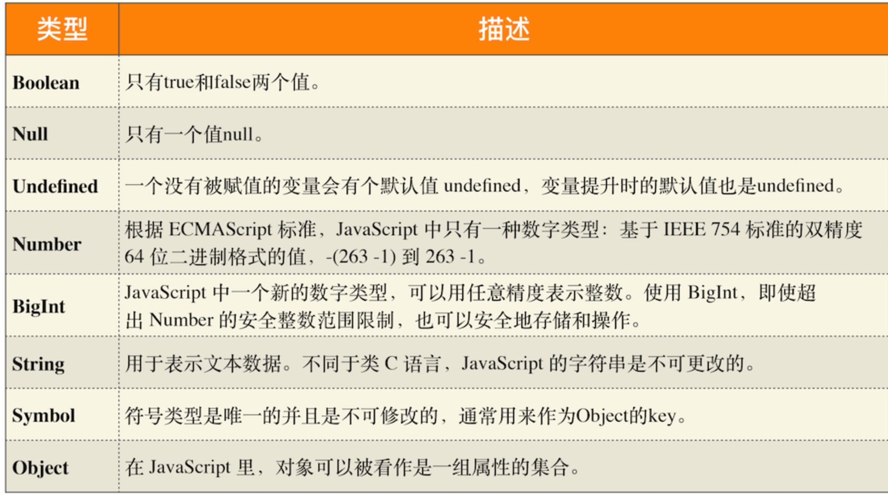
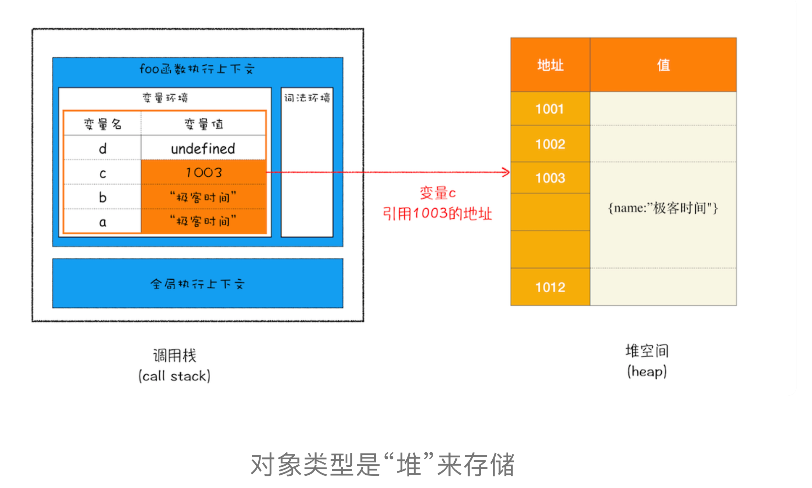

### 作用域链和闭包

作用域链

其实在每个执行上下文的变量环境中，都包含了一个外部引用，用来指向外部的执行上下文，我们把这个外部引用称为 outer。

词法作用域。这是因为在 JavaScript 执行过程中，其作用域链是由词法作用域决定的。

词法作用域

**词法作用域就是指作用域是由代码中函数声明的位置来决定的，所以词法作用域是静态的作用域，通过它就能够预测代码在执行过程中如何查找标识符。**

**词法作用域是代码编译阶段就决定好的，和函数是怎么调用的没有关系。**

对象内部的方法称为方法

根据词法作用域的规则，内部函数 getName 和 setName 总是可以访问它们的外部函数 foo 中的变量

在 JavaScript 中，根据词法作用域的规则，内部函数总是可以访问其外部函数中声明的变量，当通过调用一个外部函数返回一个内部函数后，即使该外部函数已经执行结束了，但是内部函数引用外部函数的变量依然保存在内存中，我们就把这些变量的集合称为闭包。比如外部函数是 foo，那么这些变量的集合就称为 foo 函数的闭包。

如果引用闭包的函数是一个全局变量，那么闭包会一直存在直到页面关闭；但如果这个闭包以后不再使用的话，就会造成内存泄漏。

如果该闭包会一直使用，那么它可以作为全局变量而存在；但如果使用频率不高，而且占用内存又比较大的话，那就尽量让它成为一个局部变量。

首先，介绍了什么是作用域链，我们把通过作用域查找变量的链条称为作用域链；作用域链是通过词法作用域来确定的，而词法作用域反映了代码的结构。其次，介绍了在块级作用域中是如何通过作用域链来查找变量的。最后，又基于作用域链和词法环境介绍了到底什么是闭包。

## v8 工作原理

### 栈空间和堆空间

我们把这种在使用之前就需要确认其变量数据类型的称为静态语言。相反地，我们把在运行过程中需要检查数据类型的语言称为动态语言。

C 编译器会把 int 型的变量悄悄转换为 bool 型的变量，我们通常把这种偷偷转换的操作称为隐式类型转换。而支持隐式类型转换的语言称为弱类型语言，不支持隐式类型转换的语言称为强类型语言。在这点上，C 和 JavaScript 都是弱类型语言。

弱类型，意味着你不需要告诉 JavaScript 引擎这个或那个变量是什么数据类型，JavaScript 引擎在运行代码的时候自己会计算出来。
动态，意味着你可以使用同一个变量保存不同类型的数据。

JavaScript 引擎并不是直接将该对象存放到变量环境中，而是将它分配到堆空间里面，分配后该对象会有一个在“堆”中的地址，然后再将该数据的地址写进 c 的变量值，

为什么要有堆和栈

这是因为 JavaScript 引擎需要用栈来维护程序执行期间上下文的状态，如果栈空间大了话，所有的数据都存放在栈空间里面，那么会影响到上下文切换的效率，进而又影响到整个程序的执行效率。

所以通常情况下，栈空间都不会设置太大，主要用来存放一些原始类型的小数据。而引用类型的数据占用的空间都比较大，所以这一类数据会被存放到堆中，堆空间很大，能存放很多大的数据，不过缺点是分配内存和回收内存都会占用一定的时间。

在 JavaScript 中，赋值操作和其他语言有很大的不同，原始类型的赋值会完整复制变量值，而引用类型的赋值是复制引用地址。

