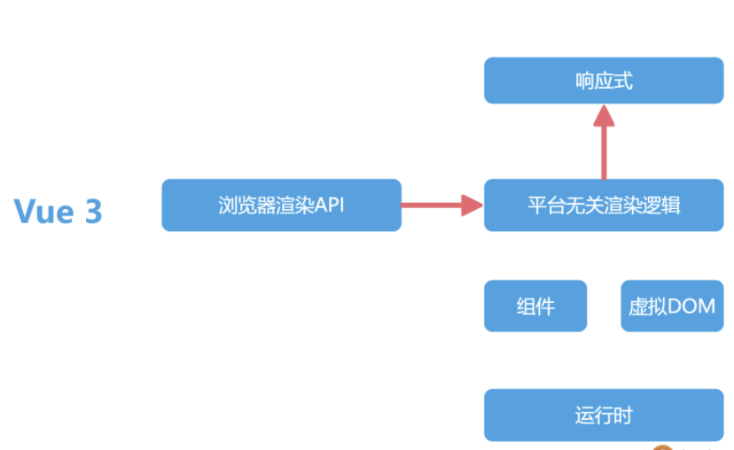
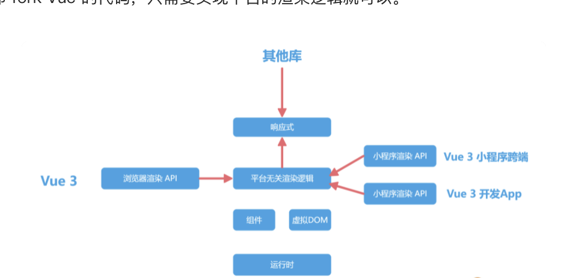
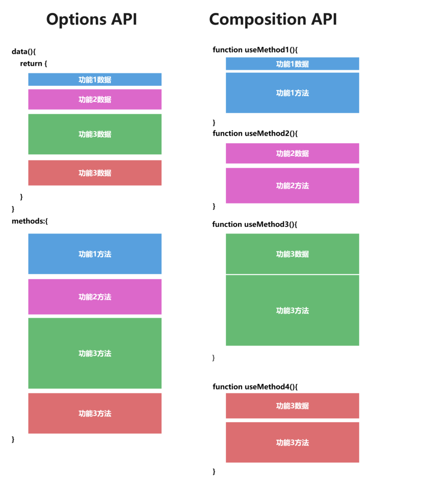
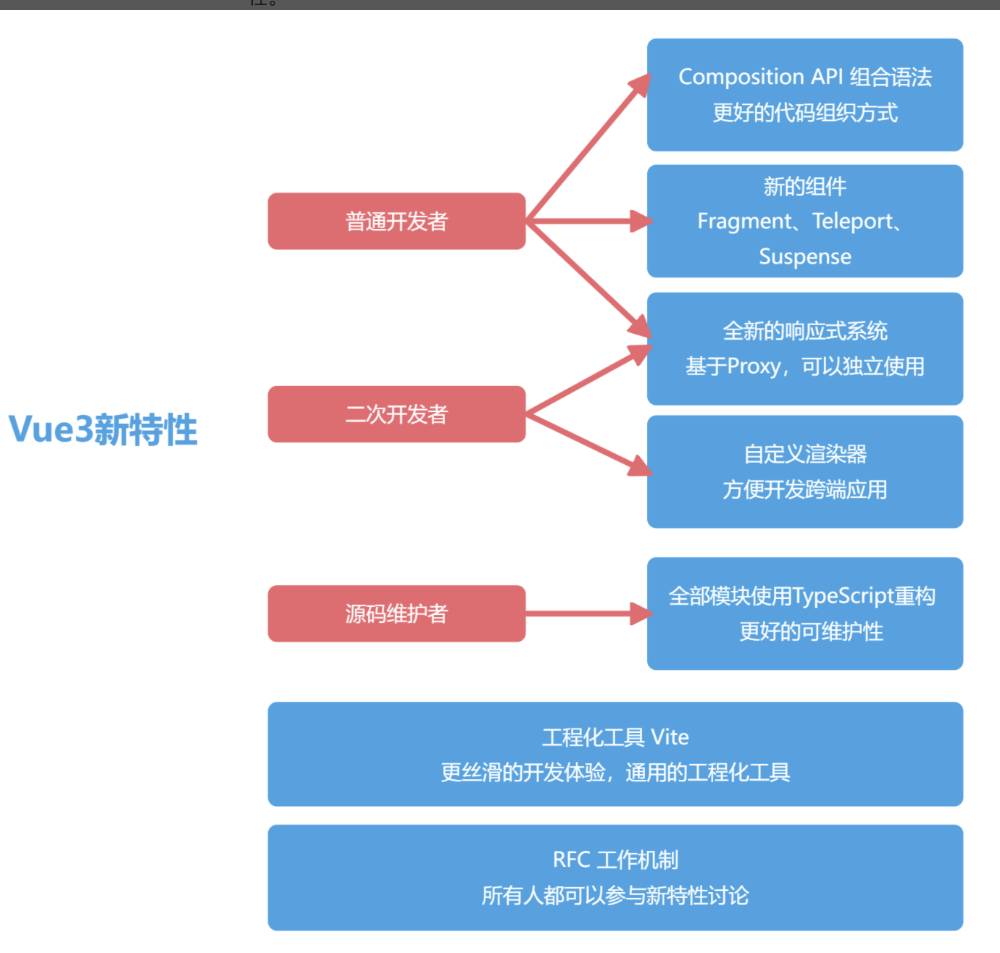
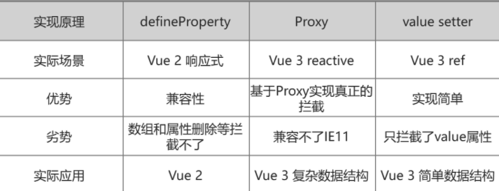
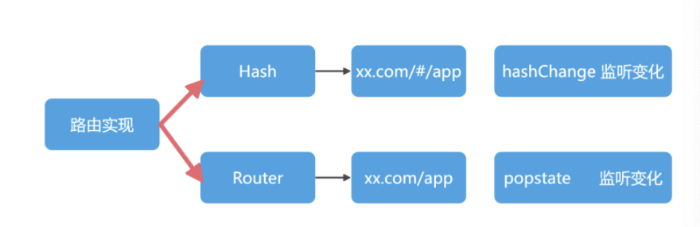
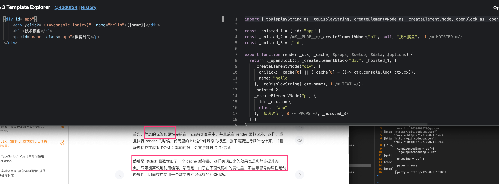
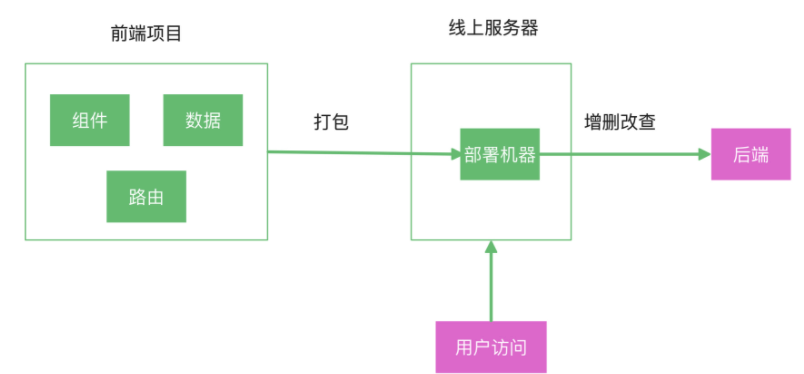
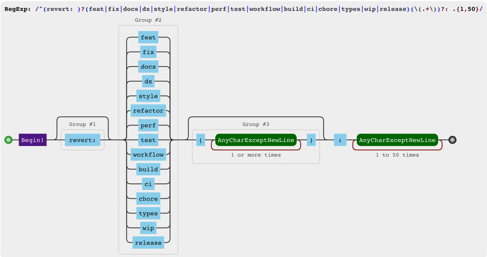

##

响应式数据是主动推送变化，虚拟 DOM 是被动计算数据的 Diff，一个推一个拉，它们看起来是两个方向的技术，但被 Vue 2 很好地融合在一起，采用的方式就是组件级别的划分。对于 Vue 2 来说，组件之间的变化，可以通过响应式来通知更新。组件内部的数据变化，则通过虚拟 DOM 去更新页面。这样就把响应式的监听器，控制在了组件级别，而虚拟 DOM 的量级，也控制在了组件的大小。

在模板的书写上，除了 Vue 和 React 走出的 template 和 JSX 两个路线，还出现了 Svelte 这种框架，没有虚拟 DOM 的库，直接把模板编译成原生 DOM，几乎没有 Runtime，所有的逻辑都在 Compiler 层优化，算是另外一个极致。

Vue 不需要 React 的 Fiber，因为更新系统中的 Watcher 控制在组件级。

1. Vue3 把虚拟 Dom 控制在组件级别，组件之间使用响应式，这就让 Vue3 的虚拟 Dom 不会过于庞大
2. Vue3 虚拟 Dom 的静态标记和自动缓存功能，让静态的节点和属性可以直接绕过 Diff 逻辑，也大大减少了虚拟 Dom 的 Diff 事件
3. 时间切片也会带来额外的系统复杂性

react 和 vue 的主要区别：
1 数据更新上：react 采用 fiber 架构，使用链表表示 DOM 结构可以在 diff 时随时中断和继续，利用 requestIdleCallback 在空闲时 diff，防止数据量大 diff 时间长导致卡顿；vue 采用响应式，一个组件对应一个观察者对象，数据变更触发 dom diff，将 dom diff 控制在组件级别；

## vue3 的新特性

- RFC 机制

- [rfc](https://github.com/vuejs/rfcs)

- 响应式系统

- 自定义渲染器

- 使用最近流行的 monorepo 管理方式，响应式，编译和运行时全部独立

- 平台无关渲染逻辑和浏览器渲染 API





- 全部模块使用 ts 重构

- Composition API 组合语法

关于 composition api 的优势

- 所有 API 都是 import 引入的（现在我们的例子还没有工程化，后续会加入）。用到的功能都 import 进来，对 Tree-shaking 很友好，我的例子里没用到功能，打包的时候会被清理掉 ，减小包的大小。

- 不再上下反复横跳，我们可以把一个功能模块的 methods、data 都放在一起书写，维护更轻松。

- 代码方便复用，可以把一个功能所有的 methods、data 封装在一个独立的函数里，复用代码非常容易。

- Composotion API 新增的 return 等语句，在实际项目中使用



- 新的组件

Vue 3 还内置了 Fragment、Teleport 和 Suspense 三个新组件。

Fragment: Vue 3 组件不再要求有一个唯一的根节点，清除了很多无用的占位 div。

Teleport: 允许组件渲染在别的元素内，主要开发弹窗组件的时候特别有用。

Suspense: 异步组件，更方便开发有异步请求的组件。

新一代工程化工具 Vite



我们使用引入的 ref 函数包裹数字，返回的 count 变量就是响应式的数据，使用 add 函数实现数字的修改。需要注意的是，对于 ref 返回的响应式数据，我们需要修改 .value 才能生效，而在

✿ Options API vs Composition API

      字面上, 选项 API 与 组合 API，细品, 这反映了设计面向的改变：

      1. 选项，谁的选项，关键在“谁”。谁？组件。也是 Vue2.x 的设计基础。组件有什么，
          有状态，有改变状态的方法，有生命周期，还有组件和组件之间的关系。这种情况
          下，“数据”要接受一定的“规矩”，“什么时候能做什么事”，“什么时候有什么表现”；
          这个状态下，开发模式像是“被动接受”。

      2. 组合，什么组合，关键在“什么”。什么？数据。数据的组合。Vue3.x 设计重点变了，数
          据变绝对的C了，现在去组件里串门，不用“守规矩”了，只需要说“我在 onMounted 的时
          候要这样这样，你看着办”，真只能的以“数据”为中心，没人能管得了了，想去哪就去哪，
          自然就灵活了

      至于这些是怎么做到由“被动接受”到“主动告知”的，实现这部分内容，我很期待。

✿ 模板语法更好用

      <script setup> 像是“语法糖”，很甜；<style>里能用 v-bind，以后开发可以
      少用“黑科技”了，双手点赞。

✿ 至于思考题

      Vue 本来就属于 DSL，语法方面各有偏好，见仁见智；响应式和生命周期需要 import，个
      人认为就代表了从之前的“被动主动”转向“主动告知”，这样设计更加灵活。从此一条主线在
      ”数据"，以后查 bug 顺着这条 "线" 应该更加容易了。

本次课程的知识点可以在 Vue3 官网进行详细学习：

1. 组合式 API ： https://v3.cn.vuejs.org/api/composition-api.html#setup
2. 单文件组件 <script setup> ：https://v3.cn.vuejs.org/api/sfc-script-setup.html
3. 单文件组件样式特性：https://v3.cn.vuejs.org/api/sfc-style.html

将值封装在一个对象中，看似没有必要，但为了保持 JavaScript 中不同数据类型的行为统一，这是必须的。这是因为在 JavaScript 中，Number 或 String 等基本类型是通过值而非引用传递的：在任何值周围都有一个封装对象，这样我们就可以在整个应用中安全地传递它，而不必担心在某个地方失去它的响应性

Vue 3 的 reactive 函数可以把一个对象变成响应式数据，而 reactive 就是基于 Proxy 实现的。我们还可以通过 watchEffect，在 obj.count 修改之后，执行数据的打印。

利用对象的 get 和 set 函数来进行监听，这种响应式的实现方式，只能拦截某一个属性的修改，这也是 Vue 3 中 ref 这个 API 的实现。在下面的代码中，我们拦截了 count 的 value 属性，并且拦截了 set 操作，也能实现类似的功能。

```js
let getDouble = (n) => n * 2;
let _value = 1;
double = getDouble(_value);

let count = {
  get value() {
    return _value;
  },
  set value(val) {
    _value = val;
    double = getDouble(_value);
  },
};
console.log(count.value, double);
count.value = 2;
console.log(count.value, double);
```



至于文中说的 Vue 3 的 ref 是用 “getter

         setter” 实现的，我的认识是，一个是“初始化”时的行为，一个是“改变行为”。

3. useXXX 为什么会这么灵活？
   像之前的 Composition API 我理解的是 Vue 的组织单位由 “组件” 变成 “数据” 了，
   现在组件在引入 useXXX，关注点在 XXX，至于 XXX 跟什么有联系，那是你的事情，在
   你自己的 useXXX 里去实现。

本节提到的 React Hooks 也有异曲同工的意思，Hooks 直接翻译成什么？“钩子”，用来
做什么？“钩东西”，钩什么？那先说下这个东西出来之前有什么。

React Hooks 出来之前 React 主要构建 App 还是用 Class Component，当然也有
functional component，这俩区别就在于 class 有状态，functional 比较“纯粹”没有
状态。这样复用成问题，得用什么高阶组件之类的方式。然后，在某一时刻，同样的问
题出现了，React 复用组件的也是以带状态的 Class 组件为主，“复杂”了，不纯粹。

应用越大，这种模式开发或维护越复杂。然后 Hooks 出现了，现在 React 都用
“functional” 组件，但是有“状态”的，状态哪里来的 “Hook” 过来的，钩过来的。
组件“不负责”维护状态，useXXX 去管理了。

## 数据流

我们使用 state 定义数据，使用 mutation 定义修改数据的逻辑，并且在组件中使用 commit 去调用 mutations。在此基础之上，还可以用 getters 去实现 Vuex 世界的计算属性，使用 action 来去定义异步任务，并且在内部调用 mutation 去同步数据。

Vuex 的出现，让我们整个项目中的数据流动变得非常自然。数据流向组件，但组件不能直接修改数据，而是要通过 mutation 提出申请，mutation 去修改数据，形成了一个圆环。

## 路由

在 vue-router 中对应两个函数，分别是 createWebHashHistory 和 createWebHistory。


hash 模式

```js
window.addEventListener("hashchange", fn);
```

history 模式

因为 HTML5 标准发布，浏览器多了两个 API：pushState 和 replaceState。

```js
window.addEventListener("popstate", fn);
```

## 调试

[Vue devtool](https://devtools.vuejs.org/guide/faq.html#the-vue-devtools-don-t-show-up)

## jsx

h 函数内部执行 createVNode，并返回虚拟 DOM，而 JSX 最终也是解析为 createVnode 执行。

JSX 可以支持更动态的需求。而 template 则因为语法限制原因，不能够像 JSX 那样可以支持更动态的需求。

JSX 相比于 template 还有一个优势，是可以在一个文件内返回多个组件，



比如在 p 标签上，使用 8 这个数字标记当前标签时，只有 props 是动态的。而在虚拟 DOM 计算 Diff 的过程中，可以忽略掉 class 和文本的计算，这也是 Vue 3 的虚拟 DOM 能够比 Vue 2 快的一个重要原因。

一些 知识点总结

- [h 函数](https://v3.cn.vuejs.org/api/global-api.html#h)
- [element3](https://github.com/hug-sun/element3/blob/master/packages/element3/packages/timeline/Timeline.vue#L35)
- [template explorer](https://vue-next-template-explorer.netlify.app/#eyJzcmMiOiI8ZGl2IGlkPVwiYXBwXCI+XG4gICAgPGRpdiBAY2xpY2s9XCIoKT0+Y29uc29sZS5sb2coeHgpXCIgIG5hbWU9XCJoZWxsb1wiPnt7bmFtZX19PC9kaXY+XG4gICAgPGgxID7mioDmnK/mkbjpsbw8L2gxPlxuICAgIDxwIDppZD1cIm5hbWVcIiBjbGFzcz1cImFwcFwiPuaegeWuouaXtumXtDwvcD5cbjwvZGl2PlxuIiwic3NyIjpmYWxzZSwib3B0aW9ucyI6eyJob2lzdFN0YXRpYyI6dHJ1ZSwiY2FjaGVIYW5kbGVycyI6dHJ1ZSwib3B0aW1pemVCaW5kaW5ncyI6ZmFsc2V9fQ==)

## TypeScript 

把 tapd 的组件用 ts 重构一版

1. vue3 写的 ts 的组件能供 vue2 使用吗
2. 市面上 有没有相关的 例如京东 小程序端的组件 ui

首先要讲到的进阶用法是泛型，泛型就是指有些函数的参数，你在定义的时候是不确定的类型，而返回值类型需要根据参数来确定。

```ts
function test<某种类型>(args: 某种类型): 某种类型 {
  return args;
}
```

```ts
function getProperty<某种类型, 某种属性 extends keyof 某种类型>(
  o: 某种类型,
  name: 某种属性
): 某种类型[某种属性] {
  return o[name];
}
function getProperty<T, K extends keyof T>(o: T, name: K): T[K] {
  return o[name];
}
```

## Vue

## 开发中的权限系统

那时候前后端不分家，整个应用的入口是后端控制模板的渲染。在模板渲染前，后端会直接判断路由的权限来决定是否跳转。登录的时候，后端只需要设置 setCookie 这个 header，之后浏览器会自动把 cookie 写入到我们的浏览器存起来，然后当前域名在发送请求的时候都会自动带上这个 cookie。

可以把 token 理解为手动管理的 cookie

可以用动态路由 来控制权限

```js
addRoutes({
    commit
}, accessRoutes) {
    // 添加动态路由，同时保存移除函数，将来如果需要重置路由可以用到它们
    const removeRoutes = []
    accessRoutes.forEach(route => {
        const removeRoute = router.addRoute(route)
        removeRoutes.push(removeRoute)
    })
    commit('SET_REMOVE_ROUTES', removeRoutes)
},
```

我们需要在 localStorage 中把静态路由和动态路由分开对待，在页面刷新的时候，通过 src/router/index.js 入口文件中的 routes 配置，从 localStorage 中获取完整的路由信息，并且新增到 vue-router 中，才能加载完整的路由。

与新增路由对应，在页面重新设置权限的时候，我们需要用 router.removeRoute 来删除注册的路由，这也是上面的代码中我们还有一个 remoteRoutes 来管理动态路由的原因。

首先，token 的过期时间认证是由后端来实现和完成的。如果登录状态过期，那么会有一个单独的报错信息，我们需要在接口拦截函数中，统一对接口的响应结果进行拦截。如果报错信息显示的是登录过期，我们需要清理所有的 token 和页面权限数据，并且跳转到登录页面。

实现按钮级别的权限认证:

1. 维护页面下需要控制权限的按钮权限标识，后台保存；
2. 登录后，获取权限数据，将该用户的按钮权限数组存放到对应页面的路由信息里；
3. 可编写v-auth的自定义指令（可以拿当前按钮标识去当前页面路由信息的按钮权限数组里去找，存在则显示，否则隐藏）；

## vue3 中如何集成第三方框架


## vue3 项目中的性能优化

网络请求优化和代码效率优化

网络请求优化： 对其他域名去做dns的预解析 

```js
dns-prefetch
```

首先是 First Contentful Paint，通常简写为 FCP，它表示的是页面上呈现第一个 DOM 元素的时间。在此之前，页面都是白屏的状态；然后是 Time to interactive，通常简写为 TTI，也就是页面可以开始交互的时间；还有和用户体验相关的 Largest Contentful Paint，通常简写为 LCP，这是页面视口上最大的图片或者文本块渲染的时间，在这个时间，用户能看到渲染基本完成后的首页，这也是用户体验里非常重要的一个指标。

```js

let timing = window.performance && window.performance.timing
let navigation = window.performance && window.performance.navigation

// DNS 解析：
let dns = timing.domainLookupEnd - timing.domainLookupStart

// 总体网络交互耗时：
let network = timing.responseEnd - timing.navigationStart

// 渲染处理：
let processing = (timing.domComplete || timing.domLoading) - timing.domLoading

// 可交互：
let active = timing.domInteractive - timing.navigationStart


```

资料：

[浏览器工作原理与实践](https://time.geekbang.org/column/intro/100033601?tab=catalog)

## 项目的优化



当你开始考虑上图中每一个环节的优化项，当你开始思考左侧的组件如何能在多个项目复用？整体项目的性能如何优化？项目打包上线的过程如何更稳定？如何提前发现项目中的报错等等问题的时候，亮点也就随之诞生了

参照react 的fiber 架构：requestIdleCallback


```js

let count = 0
const workLoop = async deadline => {
  // 计算，并且当前帧还没结束
  while (count < chunks.length && deadline.timeRemaining() > 1) {
    await appendToSpark(chunks[count].file)
    count++
    // 没有了 计算完毕
    if (count < chunks.length) {
      // 计算中
      this.hashProgress = Number(
        ((100 * count) / chunks.length).toFixed(2)
      )
      // console.log(this.hashProgress)
    } else {
      // 计算完毕
      this.hashProgress = 100
      resolve(spark.end())
    }
  }
  window.requestIdleCallback(workLoop)
}
window.requestIdleCallback(workLoop)

```

## 深入TypeScript 

[type T = arg 的类型]

```ts

function identity0(arg: any): any {
    return arg
}
// 相当于type T = arg的类型
function identity<T>(arg: T): T {
    return arg
}
identity<string>('玩转vue 3全家桶') // 这个T就是string，所以返回值必须得是string
identity<number>(1)
```

keyof 可以帮助我们拆解已有类型，下一步我们需要使用 extends 来实现类型系统中的条件判断。我们定义类型函数 ExtendsType，接受泛型参数 T 后，通过判断 T 是不是布尔值来返回不同的类型字符串，我们就可以通过 ExtendsType 传入不同的参数去返回不同的类型。

extends 相当于 TypeScript 世界中的条件语句，然后 in 关键字可以理解为 TypeScript 世界中的遍历。


```ts

// T extends U ? X : Y 类型三元表达式

type ExtendsType<T> = T extends boolean ? "重学前端" : "玩转Vue 3"
type ExtendsType1 = ExtendsType<boolean> // type ExtendsType1='重学前端'
type ExtendsType2 = ExtendsType<string> // type ExtendsType2='玩转Vue 3'

```

```ts

type Courses = '玩转Vue 3'|'重学前端'
type CourseObj = {
    [k in Courses]:number // 遍历Courses类型作为key
}
// 上面的代码等于下面的定义
// type CourseObj = {
//     玩转Vue 3: number;
//     重学前端: number;
// }

```

想问一下type和interface有什么区别?什么时候用type,什么时候用interface?
 
 type和interface都可以描述一个对象或者函数，并且都可以扩展，有几个小区别，首先type可以设置类型的别名，比如type Vue = string ,还可以用typeof获取实例的类型，interface可以直接合并申明，默认直接用interface即可



关于样式scss
```scss

// bem

$namespace: 'el';
@mixin b($block) {
  $B: $namespace + '-' + $block !global;
  .#{$B} {
    @content;
  }
}

// 添加ben后缀啥的
@mixin when($state) {
  @at-root {
    &.#{$state-prefix + $state} {
      @content;
    }
  }
}


```