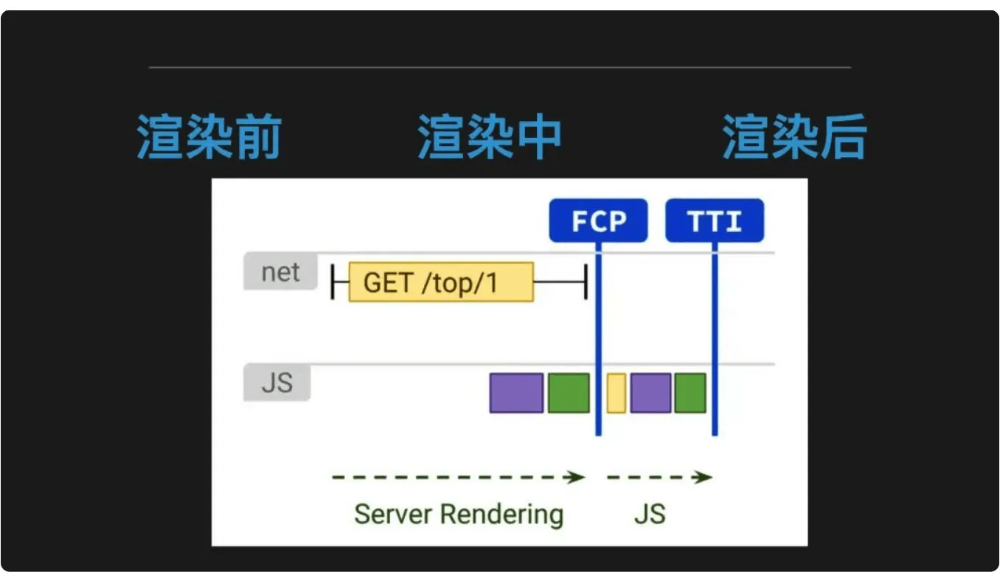

# SSR 的原理

vue-server-renderer:应用初始化和应用输出

# SSR 的 Cookies 问题

## 常见的性能问题

vue.mixin、axios 拦截请求使用不当，会内存泄露。
lru-cache 向内存缓存数据， 需要合理混存改动不频繁的资源。

ssr 的局限
服务端压力较大

开发条件受限
在服务端渲染中，created 和 beforeCreated 之外的生命周期钩子不可用，因此项目引用的第三方的库也不用其他生命周期钩子，这对引用库的选择产生了很大的限制。
一些外部扩展库 (external library) 可能需要特殊处理，才能在服务器渲染应用程序中运行。
你应该避免在 beforeCreate 和 created 生命周期时产生全局副作用的代码，例如在其中使用 setInterval 设置 timer。在纯客户端 (client-side only) 的代码中，我们可以设置一个 timer，然后在 beforeDestroy 或 destroyed 生命周期时将其销毁。为了避免这种情况，请将副作用代码移动到 beforeMount 或 mounted 生命周期中。

## 访问特定平台(Platform-Specific) API

## 自定义指令

大多数自定义指令直接操作 DOM，因此会在服务器端渲染 (SSR) 过程中导致错误。有两种方法可以解决这个问题：

推荐使用组件作为抽象机制，并运行在「虚拟 DOM 层级(Virtual-DOM level)」（例如，使用渲染函数(render function)）。

如果你有一个自定义指令，但是不是很容易替换为组件，则可以在创建服务器 renderer 时，使用 directives 选项所提供"服务器端版本(server-side version)"。

学习成本相对较高
除了对 webpack、vue 要熟悉，还需要掌握 node、express 相关技术。

## 避免状态单例

当编写纯客户端 (client-only) 代码时，我们习惯于每次在新的上下文中对代码进行取值。但是，Node.js 服务器是一个长期运行的进程。当我们的代码进入该进程时，它将进行一次取值并留存在内存中。这意味着如果创建一个单例对象，它将在每个传入的请求之间共享。

每个请求创建一个新的根 Vue 实例.

应用程序的代码分割或惰性加载，有助于减少浏览器在初始渲染中下载的资源体积，可以极大地改善大体积 bundle 的可交互时间(TTI - time-to-interactive)

Simple fix is adding a flag on Vue to make sure you only apply the mixin once.

## 在服务端请求 ssr 首屏数据

最合适的方式是通过 Vuex 的 Store, 在 entry-server.js

```js
// 对所有匹配的路由组件调用 `asyncData()`
Promise.all(
  matchedComponents.map((Component) => {
    if (Component.asyncData) {
      return Component.asyncData({
        store,
        route: router.currentRoute,
      });
    }
  })
)
  .then(() => {
    // 在所有预取钩子(preFetch hook) resolve 后，
    // 我们的 store 现在已经填充入渲染应用程序所需的状态。
    // 当我们将状态附加到上下文，
    // 并且 `template` 选项用于 renderer 时，
    // 状态将自动序列化为 `window.__INITIAL_STATE__`，并注入 HTML。
    context.state = store.state;

    resolve(app);
  })
  .catch((err) => {
    console.error(err);
    reject(err);
  });
```

同时给首屏的第一个路由组件添加 asyncData 方法来请求数据,注意是组件的静态方法,而非在 methods 中定义的方法.

```js
export default {
  name: 'wecircle',
  ...
  asyncData ({ store }) {
    // 触发 action 后，会返回 Promise
    return store.dispatch('setWecircleDataListSSR')
  },
  ...
}
```

## 注水

后面的 action 和 mutation 按照正常逻辑写即可, 最后, 当 ssr 数据渲染完成后,会在生成的 html 中添加一个 window.**INITIAL_STATE** 对象, 修改 entry-client.js 可以将数据直接赋值给客户端渲染.

entry-client.js: 客户端 entry 只需创建应用程序, 并且将其挂载到 DOM, 然后将 Store 状态同步给客户端 bundle：

```js
const { app, router, store } = createApp();

// 同步store

if (window.__INITIAL_STATE__) {
  store.replaceState(window.__INITIAL_STATE__);
}

router.onReady(() => {
  router.beforeResolve((to, from, next) => {
    const matched = router.getMatchedComponents(to);
    const prevMatched = router.getMatchedComponents(from);
    let diffed = false;
    const activated = matched.filter((c, i) => {
      return diffed || (diffed = prevMatched[i] !== c);
    });

    const asyncDataHooks = activated.map((c) => c.asyncData).filter((_) => _);
    if (!asyncDataHooks.length) {
      return next();
    }

    Promise.all(asyncDataHooks.map((hook) => hook({ store, route: to })))
      .then(() => {
        console.log("client entry asyncData function emit");
        next();
      })
      .catch(next);
  });

  app.$mount("#app");
});
```

服务端

entry-server.js: 服务端入口需要处理路由, 并触发数据预取逻辑

```JS
import { createApp } from '../main';

export default context => {
  return new Promise((resolve, reject) => {
    let { app, router, store } = createApp();

    router.push(context.url);

	  router.onReady(() => {
      const matchedComponents = router.getMatchedComponents();

      // 对所有匹配的路由组件调用 `asyncData()`
      Promise.all(
        matchedComponents.map(Component => {
          if (Component.asyncData) {
            return Component.asyncData({ store, route: router.currentRoute });
          }
        })
      ).then(() => {
          context.state = store.state;
          resolve(app);
        })
        .catch(reject);
    }, reject);
	})
}
```

## cookie 透传

当在 ssr 端请求数据时, 需要带上浏览器的 cookie, 在客户端到 ssr 服务器的请求中, 客户端是携带有 cookie 数据的,但是在 ssr 服务器请求后端接口的过程中, 相应的 cookie 数据的, 在 ssr 服务器进行接口请求的时候,我们需要手动那倒客户端的 cookie 传给后端服务器.

我们有个场景就是 需要在请求数据时, 带上 immei 进行登录, 而客户端到 ssr 服务器的请求中, 客户端是携带有 cookie 数据的. 但是在 ssr 服务器 请求后端接口的过程中, 却是没有相应的 immei 数据的, 因此在 ssr 服务器进行接口请求的时候, 我们需要手动拿到客户端的 immei 传给后端服务器.

在 Server.js 中获取浏览器 cookie, 并利用 window 对象存储

```js
app.use('*', (req, res) => {
  ...
  window.ssr_cookie = req.cookie
  ...
})
```

```js
在 axios 中, 添加 header 将 cookie 塞进去

axios.create({
  headers: window.ssr_cookie || {}
})

```

## 同时支持客户端渲染和服务端渲染

ssr 服务端渲染挂掉的时候, 需要有容错逻辑保证页面可用, 原先的客户端渲染相关的构建要保留, 即通过直接访问 inde.html 的方式能够正常使用页面, 这里通过 nginx 配置路径转发.

```js
location /index.html {
     return 301 https://$server_name/;
}
```

原先通过 <http://xxx.com/index.html> 变成 <http://xxx.com/> .history 模式的 vue-router 的 path="/"的路由, 对客户端访问和服务端的访问, 分别设置不同的转发

```sh
 # 客户端渲染服务
  location / {
     # 给静态文件添加缓存
     location ~ .*\.(js|css|png|jpeg)(.*) {
          valid_referers *.nihaoshijie.com.cn;
          if ($invalid_referer) {
            return 404;
          }
          proxy_pass http://localhost:8080;
          expires  3d;# 3天
      }
      proxy_pass http://localhost:8080; # 静态资源走8080端口
  }

  # ssr服务
  location  = /index_ssr {
     proxy_pass http://localhost:8888; # ssr服务使用8888端口
  }
```

只保留/index_ssr 作为 ssr 渲染的入口, 然后在 server.js 中, 将/index_ssr 处理成首页的路径, 并添加对 ssr 渲染的容错逻辑.

```js
  if (req.originalUrl === '/index_ssr' || req.originalUrl === '/index_ssr/') {
    context.url = '/'
  }
  ...
  renderer(bundle, manifest).renderToString(context, (err, html) => {
    ...
    if (err) {
      // 发现报错，直接走客户端渲染
      res.redirect('/')
      // 记录错误信息 这部分内容可以上传到日志平台 便于统计
      console.error(`error during render : ${req.url}`)
      console.error(err)
    }
    ...
  })
```

遇坑 1：vue 组件名尽量不要和路由重名，名字一样大小写不一样也不可（例如 组件叫 component，而引用这个组建的路由叫/Component）。如果重名了，会出现路由找不到的情况

遇坑 2： 一定要遵守标签的嵌套规则，尤其是<router-link>不要单独使用 tag="li"属性，嵌套规则的不一致会造成 client 和 server 两端的 dom 树不一致，导致本地开发没问题而打包上线有问题

## cookie 注入

将 Cookies 注入到 global. 在将 cookies 注入到组件的 asyncData 方法.

一套代码两套执行环境

（1）在 beforeCreate，created 生命周期以及全局的执行环境中调用特定的 api 前需要判断执行环境；

（2）使用 adapter 模式，写一套 adapter 兼容不同环境的 api。

```JS
 // 在路由组件内
 <template>
  <div>{{ fooCount }}</div>
 </template>
 <script>
 // 在这里导入模块，而不是在 `store/index.js` 中
 import fooStoreModule from '../store/modules/foo'
 export default {
  // 数据预获取生命周期，在服务端运行
  asyncData ({ store }) {
    //惰性注册store模块
    store.registerModule('foo', fooStoreModule)
    //执行foo命名空间下名为inc的action操作
    return store.dispatch('foo/inc')
  },
  // 重要信息：当多次访问路由时，
  // 避免在客户端重复注册模块。
  destroyed () {
    this.$store.unregisterModule('foo')
  },
  computed: {
    fooCount () {
      //获取store数据
      return this.$store.state.foo.count
    }
  }
 }
 </script>
```

因为 hash 模式的路由提交不到服务器上，因此 ssr 的路由需要采用 history 的方式。

异常处理问题 1.异常来自哪里？
（1）服务端数据预获取过程中的异常，如接口请求的各种异常，获取到数据后对数据进行操作的过程中出现的错误异常。

（2）在服务端数据预获取的生命周期结束后的渲染页面过程中出现的异常，包括各种操作数据的语法错误等，如对 undefined 取属性。

2.怎么处理异常

（1）官方处理方法

抛出 500 错误页面，体验不友好，产品不接受。

（2）目前采用的方法

a.服务端数据预获取过程中出现的异常，让页面继续渲染，不抛出 500 异常页面，打错误日志，接入监控。同时，在页面加入标志，让前端页面再次进行一次数据获取页面渲染的尝试。

b.页面渲染过程的异常。由于目前渲染过程是 vue 提供的一个插件进行的，异常不好捕获，同时出现问题的概率不是很大，因此还没有做专门的处理。

entry-server.js 服务端部分：

```JS
 Promise.all(matchedComponents.map(component => {
    //代码略，参见官方文档
 })).then(() => {
    //代码略，参见官方文档
 }).catch(err => {
    //官方代码在这里直接抛出异常，从而走500错误页面
    //我们做如下处理，首先打印错误日志，将日志加入监控报警，监控异常
    console.log('rendererror','entry-server',err);
    // 其次，增加服务端预渲染错误标识，前端拿到标志后重新渲染
    context.serverError = true;
    //最后，将服务端vue实例正常返回，避免抛500
    resolve(app)
 })
```

性能

（1）页面级别的缓存 将渲染完成的页面缓存到内存中，同时设置最大缓存数量和缓存时间。 优势：大幅度提高页面的访问速度 代价：增加服务器内存的使用

```js
const LRU = require("lru-cache"); //删除最近最少使用条目的缓存对象
// 实例化配置缓存对象
const microCache = LRU({
  max: 100, //最大存储100条
  maxAge: 1000, // 存储在 1 秒后过期
});
//http请求处理
server.get("*", (req, res) => {
  //根据url获取缓存页面
  const hit = microCache.get(req.url);
  //如果有缓存则直接返回缓存数据
  if (hit) {
    return res.end(hit);
  }
  renderer.renderToString((err, html) => {
    res.end(html);
    //将页面缓存到缓存对象中
    microCache.set(req.url, html);
  });
});
```

## 处理高并发 和 容易挂的问题

## SSR 的常见优化


FCP：首次内容绘制时间，TTI：可交互时间

常见的拆解方式是用户从浏览器发起的请求阶段、服务端渲染阶段和响应阶段

- 请求已经到到达服务还未执行渲染
- 开始渲染计算，直到渲染完成
- 服务器处理响应

渲染前：
缓存： 数据、组件、页面
请求：http、keep-alive
降级： 客户端渲染

在不考虑自研 CDN 的情况下，开启 CDN 缓存的步骤非常简单：

域名接入 CDN 服务，同时针对路径启用缓存
在源站设置 Cache-Control 响应头，为了更灵活地控制缓存规则，但并不是必须

什么服务可以开启 CDN 缓存

- 无用户状态
- 低时效性

从下面几个方面

1. 缓存时间
   提高 Cache-Control 的时间是最有效的措施，缓存持续时间越久，缓存失效的机会越少。Cache-Control 只能告知 CDN 该缓存的时间上限，并不影响它被 CDN 提早淘汰。流量过低的资源，很快会被清理掉，CDN 用逐级沉淀的缓存机制保护自己的资源不被浪费。

2. 忽略 url 参数
   页面的参数明显不符合预期， 例如微信等渠道分享后，末尾被挂上各种渠道自身设置的统计参数。 平均到单个资源的访问量就会大大降低，进而降低了缓存效果。

3. 主动缓存
   化被动为主动，才有可能实现 100% 的缓存命中率。常用的主动缓存是资源预热，更适合 URL 路径明确的静态文件，动态路由无法交给 CDN 智能预热，除非依次推送具体的地址。

## 应用代码层面

1. 掌控缓存

```js
app.use((ctx, next) => {
  if (["/foo", "/foo/"].includes(ctx.patch)) {
    ctx.set("Cache-Control", "max-age=300");
  }
});
```

客户端初始化： 获取 immei 拿到相关的逻辑

## SSR 的注水和脱水

在服务端渲染（SSR，Server-Side Rendering）中，“注水”（Hydration）和“脱水”（Dehydration）是两个核心概念，用于协调服务端和客户端的渲染过程，确保页面既有快速的首屏呈现，又能支持客户端的交互性。以下我会详细讲解这两个概念的原理、作用和实现方式，并结合 Next.js 等框架中的具体应用，帮助你深入理解 SSR 的“注水”和“脱水”。

1. 基本概念

(1) 脱水（Dehydration）
定义：服务端将渲染后的 HTML 和初始数据“脱水”成静态内容和序列化的状态，发送给客户端。
时机：发生在服务端渲染过程中。
目的：将服务端计算的状态（如 API 数据、组件状态）序列化为客户端可用的格式（如 JSON），减少客户端重复请求。

(2) 注水（Hydration）
定义：客户端接收服务端发送的 HTML 和状态数据，通过 JavaScript “注水”激活页面，使其变为可交互的动态应用。
时机：发生在客户端加载后。
目的：将静态 HTML 与前端框架（如 React、Vue）的运行时绑定，恢复事件监听和动态行为。

形象比喻

脱水：服务端把“湿漉漉”的动态页面烘干成静态 HTML 和数据“干货”。
注水：客户端把“干货”重新加水，变成“活”的应用。

2. 工作原理
   服务端（脱水）

- 渲染 HTML：
  服务端执行组件树，生成初始 HTML。
  例如，React 使用 renderToString 将组件转为 HTML 字符串。
- 序列化状态：
  将动态数据（如 API 返回的 JSON）序列化为字符串。
  通常嵌入到 HTML 中的 <script> 标签。
- 发送给客户端：
  返回完整的 HTML 和状态数据。
  客户端（注水）
- 加载 HTML：
  浏览器直接显示服务端渲染的静态页面（首屏可见）。
- 加载 JS：
  客户端加载前端框架的 JS 脚本。
- 绑定状态：
  使用服务端提供的数据初始化组件状态。
  React 调用 hydrate（而不是 render），复用现有 DOM 并添加事件监听。

3. Next.js 中的实现
   Next.js 是 SSR 的典型框架，以下以它为例说明“注水”和“脱水”。
   脱水（服务端）
   在 getServerSideProps 或 getStaticProps 中：

```javascript
// pages/index.js
export async function getServerSideProps() {
  const data = await fetch("https://api.example.com/data").then((res) =>
    res.json()
  );
  return {
    props: { data }, // 脱水数据
  };
}

export default function Home({ data }) {
  return <div>{data.message}</div>;
}
```

过程：
服务端调用 getServerSideProps，获取 data。
Next.js 将组件渲染为 HTML，同时将 data 序列化为 JSON，嵌入到页面：

```html
<div id="__next">
  <div>Hello from API</div>
</div>
<script id="__NEXT_DATA__" type="application/json">
  {
    "props": { "data": { "message": "Hello from API" } },
    "page": "/",
    "query": {},
    "buildId": "..."
  }
</script>
```

注水（客户端） 客户端加载时： Next.js 的 \_app.js 和 \_document.js 自动处理： 读取
**NEXT_DATA** 中的序列化数据。 调用 ReactDOM.hydrate（现已升级为 hydrateRoot 在
React 18 中）：

```javascript
import { hydrateRoot } from 'react-dom/client';
import App from './App'; const root =
hydrateRoot(document.getElementById('**next'),
<App {...window.**NEXT_DATA\_\_.props} />);
```

结果：客户端接管
HTML，添加事件监听，页面变为动态。 4. 代码示例（手动实现）
如果不用框架，手动实现 SSR 的注水和脱水： 服务端（Node.js + React）

```javascript
// server.js
const express = require("express");
const React = require("react");
const { renderToString } = require("react-dom/server");
const App = ({ data }) => <div>{data.message}</div>;
const app = express();
app.get("/", async (req, res) => {
  const data = {
    message: "Hello from SSR",
  }; // 模拟 API 数据
  const html = renderToString(<App data="{data}" />);
  // 脱水：将 HTML 和数据发送给客户端
  res.send(`
<html>
  <body>
    <div id="root">${html}</div>
    <script>
      window.__INITIAL_DATA__ = ${JSON.stringify(data)};
    </script>
    <script src="/client.js"></script>
  </body>
</html>
`);
});
app.listen(3000, () => console.log("Server running on port 3000"));
```

客户端

```javascript
// client.js
import React from 'react'; import { hydrate }
from 'react-dom'; import App from './App';
const data = window.**INITIAL_DATA**;
// 从服务端获取脱水数据
hydrate(<App data="{data}" />,
document.getElementById('root'));
```

5. 关键点与优化 脱水的注意事项
   序列化安全：确保数据可序列化（如避免循环引用）。
   数据体积：避免传输过多数据，影响首屏加载。

   安全性：敏感数据需加密或剔除。
   注水的注意事项 一致性： 服务端和客户端渲染结果必须一致，否则会导致“hydration
   mismatch”错误。 示例：服务端用 Date.now() 生成时间，客户端可能不同步。 性能：
   减少注水时的重复计算，利用服务端数据。 优化策略 按需注水：
   只对交互组件注水，非交互部分保持静态。 Next.js 13 的 app
   目录支持部分注水（Partial Hydration）。 延迟加载：
   使用动态导入（React.lazy）推迟非关键组件的注水。 缓存： 服务端缓存脱水数据（如
   Redis），减少重复计算。 6. 常见问题 Hydration 失败
   原因：服务端和客户端渲染不一致（如条件渲染不同）。
   解决：检查条件逻辑，确保两端一致，或用 useEffect 调整客户端状态。 性能瓶颈
   原因：注水时加载过多 JS。 解决：代码分割，懒加载非首屏组件。 7. 总结
   脱水：服务端渲染 HTML 并序列化状态（如 JSON），发送给客户端。 注水：客户端用 JS
   激活 HTML，绑定状态和事件。 Next.js：通过 getServerSideProps 和 **NEXT_DATA**
   自动实现。 手动实现：用 renderToString 脱水，hydrate 注水。 这个机制确保 SSR
   的首屏速度和客户端交互性兼得。如果你在项目中遇到具体问题（比如 Next.js 的 SSR
   优化），告诉我，我可以进一步帮你分析和实现！
