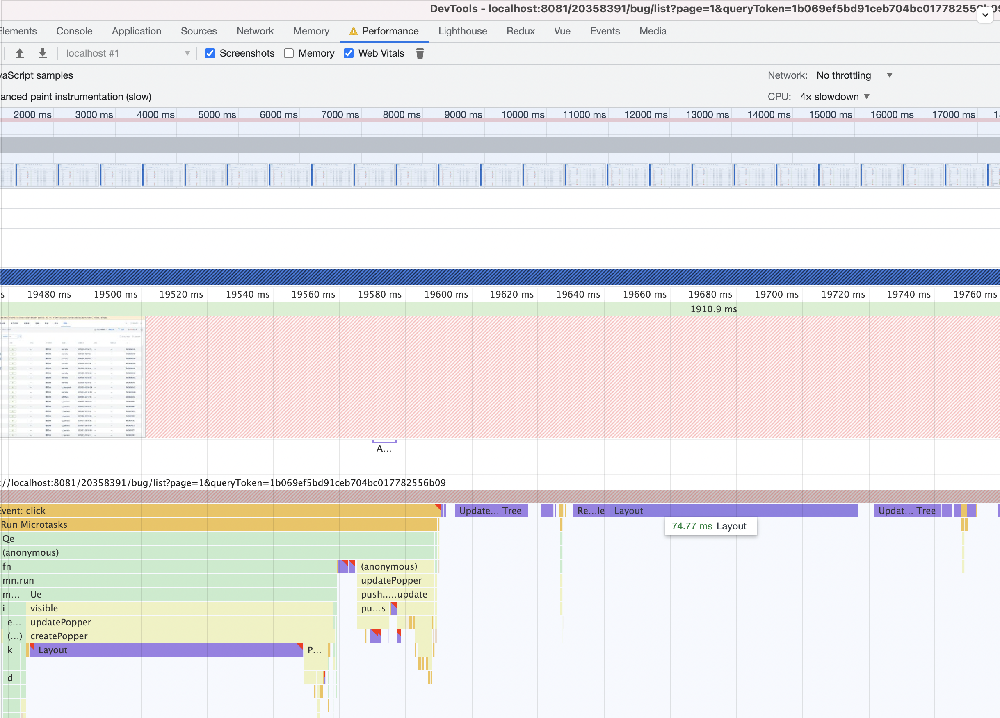
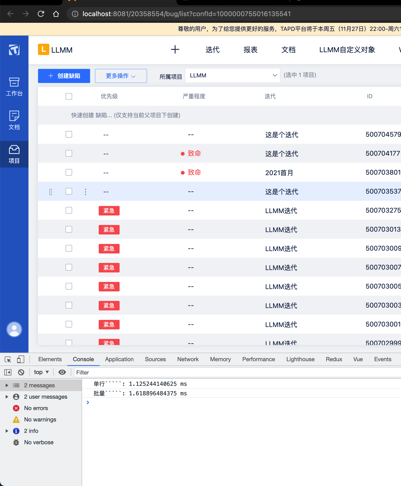

# 性能优化对比

## 表格性能优化对比

 在已经做分页的场景下，进行的一次优化。

### 我们先看效果

优化对比

优化前



优化后



### 核心代码

```js
  let memo
  const key = item.id;
  let cached
  if (useMemo) {
    cached = vnodeCache[key];
    if (cached && this.isRowSelectionChanged(item, cached.memo)) {
      return cached;
    }
    memo = cloneDeep(item);
  }
  const ret = (<tr
      key={idx}>
      // 代码
    </tr>);
  if (useMemo && column.length) {
    ret.memo = cloneDeep(memo);
    vnodeCache[key] = ret;
  }
  return ret;
```

 进行前后对比

```js
  isRowSelectionChanged(row, cached){
    const value = isEqual(row, cached);
    return value
  },

```

// 以空间换时间的方式进行优化

## 探索canvas 重新绘制table


