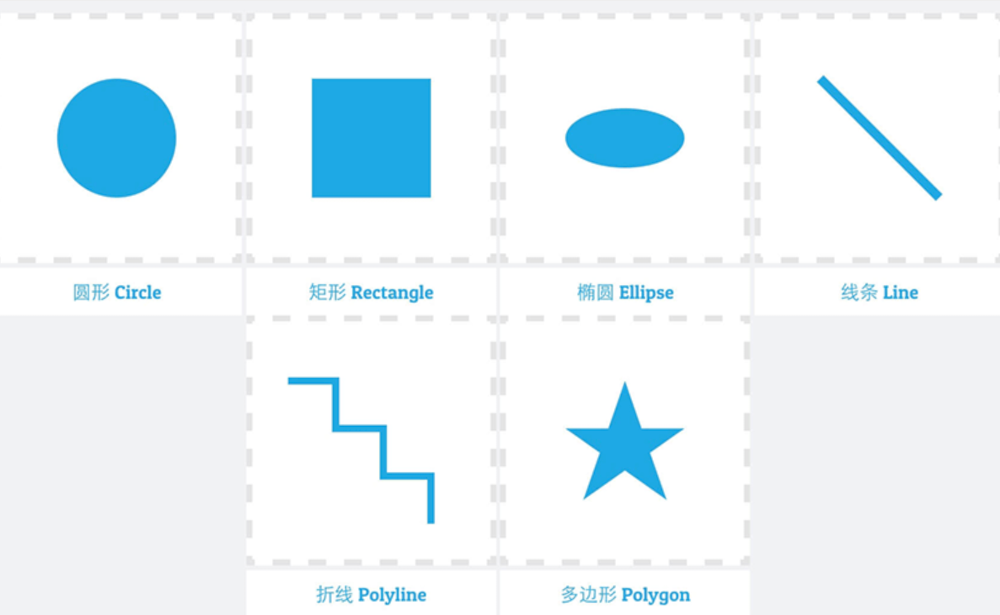
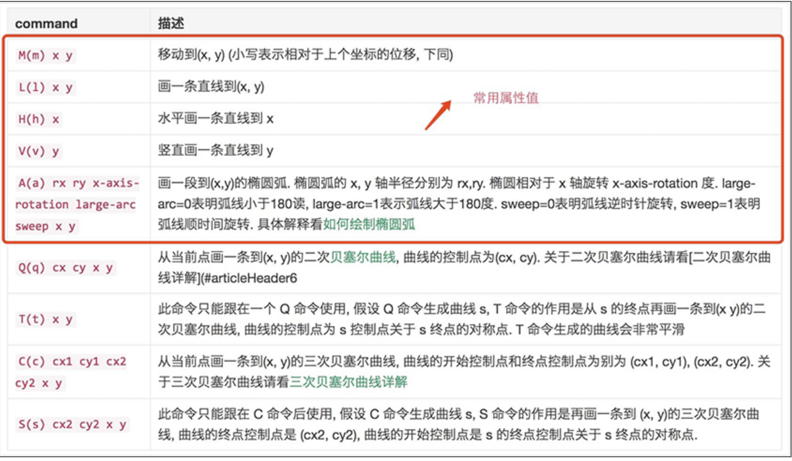

# svg 总是不对

先讲下缘由
某天找设计师 要图标的时候， 发来一个 codeDesign 的链接 咱就去下载， 下载下来后 运用内部的 svg 转换工具 转成 iconfont 没想到， 在页面上的效果跟 svg 的样式不一致，咱也不敢直接怀疑设计师给的有问题。只能自己排查。后面实在是找不到问题，只能让设计师重新发一遍，没想到重发的可以了，遂对比下前后。

## 原理

先了解下什么是 svg

svg 在变大变小的情况下不会失真（出现锯齿或者看到像素点），也可以像 GIF 一样动起来。

```css
SVG优缺点：
优点	缺点
1.缩放无损还原，显示清晰	1.SVG在绘制的性能上比PNG要差
2.语义性良好	2.局限性，对应单色或普通渐变没什么问题，但对不规则的渐变以及特效叠加效果显示不全
3.可用CSS控制图标样式以及动画	3.兼容性稍差，android4.1才开始支持
4.减少http请求	4.学习应用成本较高
```

## web 中使用 svg 的使用方式

1. inline svg ， 直接把 svg 写入 HTML 中

不需要在单独去请求，修改图标的形状也方便。

```html
<body>
  <svg width="100%" height="100%">
    <rect x="20" y="20" width="250" height="250" style="fill:#fecdddd;" />
  </svg>
</body>
```

2. img object embed 标签直接引用 svg

```html
<body>
  
</body>
```

3. SVG Sprite

这里的 Sprite 技术，类似于 CSS 中的 Sprite 技术。图标图形整合在一起，实际呈现的时候准确显示特定图标。其实基础的 SVG Sprite 也只是将原来的位图改成了 SVG 而已，控制 SVG 大小、颜色需要重新合并 SVG 文件。

```html
.icon-bg{ display: inline-block; width: 30px; height: 30px; background:
url(./res/svg-sprite-background.svg); background-size:100% 100%; }
.icon-facebook-logo{ background-position: 0 0; } .icon-earth{
background-position: 0 -30px; }

<span class="icon-bg icon-facebook-logo"></span>
<span class="icon-bg icon-earth"></span>
```

4.使用 SVG 中的 symbol，use 元素来制作 SVG Sprite

SVG Symbols 的使用，本质上是对 Sprite 的进一步优化，通过<symbol>元素来对单个 svg 元素进行分组，使用<use>元素引用并进行渲染。这种方法的解决了上述三种方式带来的弊端，少量的 http 请求，图标能被缓存方便复用，每个 SVG 图标可以更改大小颜色，整合、使用以及管理起来非常简单。

①SVG Symbols 作为 body 的第一个元素插入在 HTML 中使用：

```html
<body>
  <svg
    style="width:0; height:0; visibility:hidden;position:absolute;z-index:-1"
  >
    <symbol viewBox="0 0 24 24" id="heart">
      <path
        fill="#E86C60"
        d="M17,0c-1.9,0-3.7,0.8-5,2.1C10.7,0.8,8.9,0,7,0C3.1,0,0,3.1,0,7c0,6.4,10.9,15.4,11.4,15.8 c0.2,0.2,0.4,0.2,0.6,0.2s0.4-0.1,0.6-0.2C13.1,22.4,24,13.4,24,7C24,3.1,20.9,0,17,0z"
      ></path>
    </symbol>
  </svg>

  <svg>
    <use xlink:href="#heart" />
  </svg>
</body>
```

## 在 SVG 中嵌入 image

相比把一个.svg 文件嵌入到一个标签中，反过来把一个位图图像嵌入到 SVG 代码中也是可以的。

```html
<svg
  version="1.1"
  xmlns="http://www.w3.org/2000/svg"
  xmlns:xlink="http://www.w3.org/1999/xlink"
  width="300"
  height="200"
>
  <image width="300" height="200" xlink:href="xxxUrl.png" />
</svg>
```

## preserveAspectRatio 属性

preserveAspectRatio 属性强制统一缩放比来保持图形的宽高比。

## SVG 提供了 rect、circle、ellipse、line、polyline、polygon 六种基本形状用于图形绘制



1. rect 矩形

用于绘制矩形、圆角矩形，含有 6 个基本属性用于控制矩形的形状以及坐标

- x：矩形左上角 x 位置, 默认值为 0
- y：矩形左上角 y 位置, 默认值为 0
- width：矩形的宽度, 不能为负值否则报错, 0 值不绘制
- height：矩形的高度, 不能为负值否则报错, 0 值不绘制
- rx：圆角 x 方向半径, 不能为负值否则报错
- ry：圆角 y 方向半径, 不能为负值否则报错

- rx 和 ry 都没有设置, 则 rx = 0 ry = 0
- rx 和 ry 有一个值为 0, 则相当于 rx = 0 ry = 0，圆角无效
- rx 和 ry 有一个被设置, 则全部取这个被设置的值
- rx 的最大值为 width 的一半, ry 的最大值为 height 的一半

2. circle 圆形

SVG 中 circle 元素用于绘制圆形，含有 3 个基本属性用于控制圆形的坐标以及半径，具体如下：

- r：半径
- cx：圆心 x 位置, 默认为 0
- cy：圆心 y 位置, 默认为 0

  3.ellipse 椭圆

SVG 中 ellipse 元素用于绘制椭圆，是 circle 元素更通用的形式，含有 4 个基本属性用于控制椭圆的形状以及坐标，具体如下：

- rx：椭圆 x 半径
- ry：椭圆 y 半径
- cx：圆心 x 位置, 默认为 0
- cy：圆心 y 位置, 默认为 0

4. line 直线

line 绘制直线。它取两个点的位置作为属性，指定这条线的起点和终点位置。

- x1：起点的 x 位置
- y1：起点的 y 位置
- x2：终点的 x 位置
- y2：终点的 y 位置

5. polyline 折线
   polyline 是一组连接在一起的直线。因为它可以有很多的点，折线的的所有点位置都放在一个 points 属性中：

points 点集数列，每个数字用空白、逗号、终止命令符或者换行符分隔开，每个点必须包含 2 个数字，一个是 x 坐标，一个是 y 坐标 如 0 0, 1 1, 2 2

6. polygon 多边形
   polygon 和折线很像，它们都是由连接一组点集的直线构成。不同的是，polygon 的路径在最后一个点处自动回到第一个点。需要注意的是，矩形也是一种多边形，如果需要更多灵活性的话，你也可以用多边形创建一个矩形。

points 点集数列，每个数字用空白、逗号、终止命令符或者换行符分隔开，每个点必须包含 2 个数字，一个是 x 坐标，一个是 y 坐标 如 0 0, 1 1, 2 2， 路径绘制完闭合图形”

## SVG path 路径

SVG 的路径<path>功能非常强大，它不仅能创建基本形状，还能创建更多复杂的形状。<path>路径是由一些命令来控制的，每一个命令对应一个字母，并且区分大小写，大写主要表示绝对定位，小写表示相对定位。<path> 通过属性 d 来定义路径， d 是一系列命令的集合，主要有以下几个命令著作权归作者所有。



通常大部分形状，都可以通过指令 M(m)、L(l)、H(h)、V(v)、A(a)来实现，注意特别要区分大小写，相对与绝对坐标情况，转换时推荐使用相对路径可减少代码量，例如：

```js
// 以下两个等价
d = "M 10 10 20 20"; // (10, 10) (20 20) 都是绝对坐标
d = "M 10 10 L 20 20";
// 以下两个等价
d = "m 10 10 20 20"; // (10, 10) 绝对坐标, (20 20) 相对坐标
d = "M 10 10 l 20 20";
```

## SVG 基本形状路径转换原理

##

1. svg 事件没有触发
   直接在 svg 组件上绑定 onClick 事件，这个事件在有的浏览器上面并不会触发，我们应该在外层去添加事件，外层套个 i 标签或者 button 标签

2.

3.
