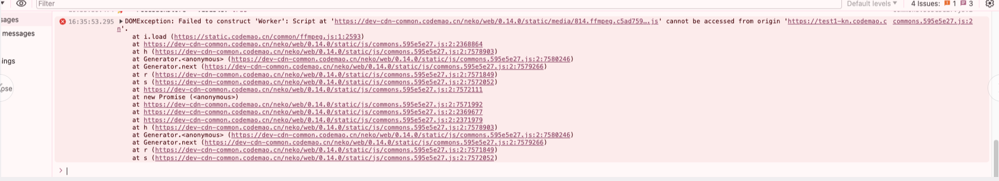

# web work 跨域解析与解决方式

## 遇到了跨域的问题

import Worker from 'workerize-loader?.inline=true&name=[name].[contenthash:8]&fallback=false!./worker/transcoder'; // eslint-disable-line import/no-webpack-loader-syntax
