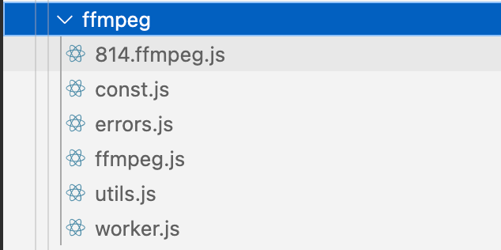

# 低版本 node 环境下 ffmpeg 的使用

先介绍一下 ffmpeg 是什么，这时候一款强大的压缩、编辑视频、音频的库，有各个语言的。web 用到 wasm。所以我用这个版本的，官网地址：https://ffmpegwasm.netlify.app

注意：区分是 0.11.x 版本还是 0.12+版本。

两个版本差异性比较大，方法也不一样。我使用的是 0.12+版本。

## 1. 安装 ffmpeg

常规情况下，肯定是用 npm 安装的，但是低版本 node 不支持 npm，所以需要下载 ffmpeg。通过 cdn 的形式。

### 1.1 下载 ffmpeg



```js
const { FFmpeg } = (window as any).FFmpegWASM;
  const ffmpeg = new FFmpeg();
  await ffmpeg.load({
    worker814URL: new URL(
      `${window.location.origin}/ffmpeg/814.ffmpeg.js`,
      import.meta.url
    ).toString(),
    classWorkerURL: new URL(
      `${window.location.origin}/ffmpeg/worker.js`,
      import.meta.url
    ).toString(),
  });

    // 监听进度事件
  const onProgress = ({ progress }: { progress: number }) => {
    eventEmitterManager.emit(EventType.COMPRESS_MEDIA_PROGRESS, {
      name: data.name,
      progress,
    });
  };

  // 监听错误事件
  const onError = (err: any) => {
    eventEmitterManager.emit(EventType.COMPRESS_MEDIA_PROGRESS, {
      name: data.name,
      progress: 1.1,
    });
  };

  // 取消压缩处理
  const cancelCompression = () => {
    ffmpeg.off('progress', onProgress);
    ffmpeg.off('error', onError);
    ffmpeg.terminate(); // 终止 FFmpeg 进程
  };

  // 监听进度和错误事件
  ffmpeg.on('progress', onProgress);
  ffmpeg.on('error', onError);

  try {
    const fetchData = await (window as any).FFmpegUtil.fetchFile(data);
    ffmpeg.writeFile(newName, fetchData);
    await ffmpeg.exec([
      '-i',
      newName, // 输入文件名
      '-preset',
      'ultrafast', // 最快速编码预设
      '-b:v',
      '1000k', // 设置中等比特率
      'output.mp4', // 输出文件名
    ]);

    const fileData = await ffmpeg.readFile('output.mp4');
    return [fileData];
  } catch (error) {
    console.error('压缩视频过程中出现错误:', error);
    return []; // 在发生错误时返回空数组
  } finally {
    // 清理文件系统中的文件以释放内存
    ffmpeg.deleteFile(newName);
    ffmpeg.deleteFile('output.mp4');
  }
```

### 遇到的问题

worker，在本地调试没问题，一到线上就报错跨域。， 解决版本，是把 worker 文件放到线上。这样 wasm 就可以访问到 worker 了。
