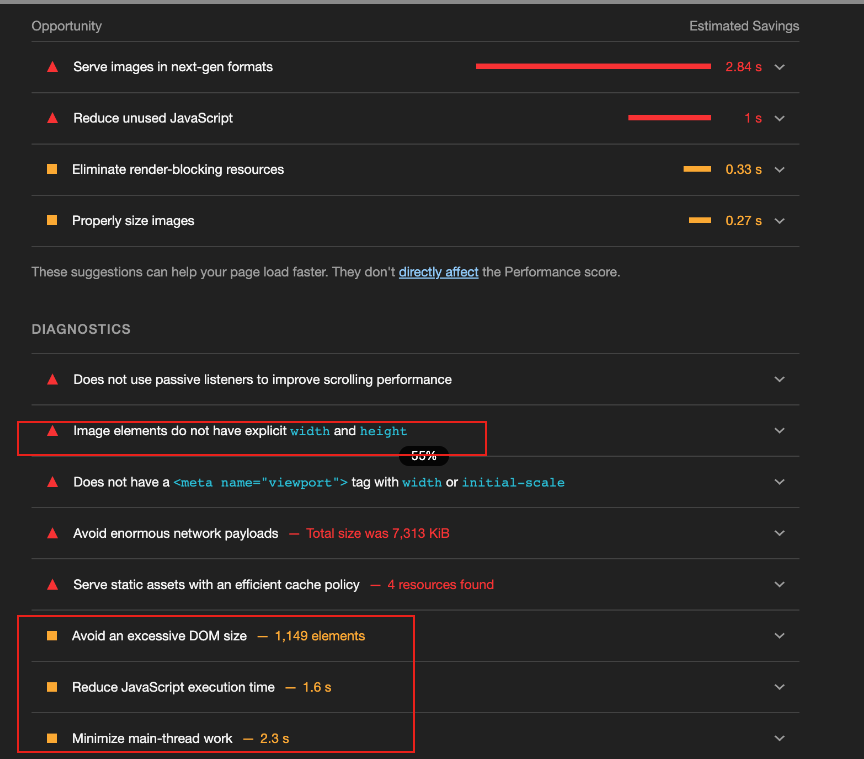
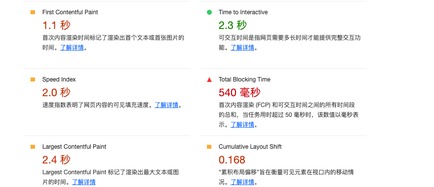

性能排查与优化实践

先说一下技术栈:React18 + Mobx + Antd

在看一下 LightHouse 的评分效果



优化重点：

1. memo useMemo useCallback
2. 剔除不规范写法（重复在 store 与 useEffect）

优化后的效果：


排查方案：

1. dev-tools 分析 profile 效果

profile 是在

以前的渲染优化方式：

1. 优化

```js
import React from "react";
import { is } from "immutable";
export default class extends React.Component {
  shouldComponentUpdate(nextProps = {}, nextState = {}) {
    if (
      Object.keys(this.props).length !== Object.keys(nextProps).length ||
      Object.keys(this.state).length !== Object.keys(nextState).length
    ) {
      return true;
    }
    for (const key in nextProps) {
      if (!is(this.props[key], nextProps[key])) {
        return true;
      }
    }
    for (const key in nextState) {
      if (!is(this.state[key], nextState[key])) {
        return true;
      }
    }
    return false;
  }
}
```

2. 优化

```js
// customEquals: lodash.isEqual、Immutable.is、dequal.deepEqual 等；
const useOriginalCopy = (value) => {
  const copy = React.useRef();
  const diffRef = React.useRef(0);
  if (!customEquals(value, copy.current)) {
    copy.current = value;
    diffRef.current += 1;
  }
  return [diffRef.current];
};
```
