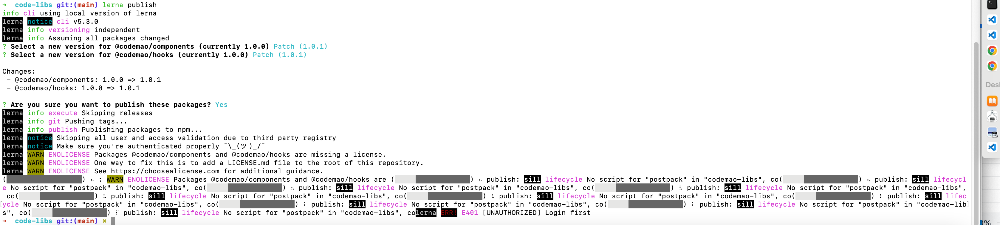
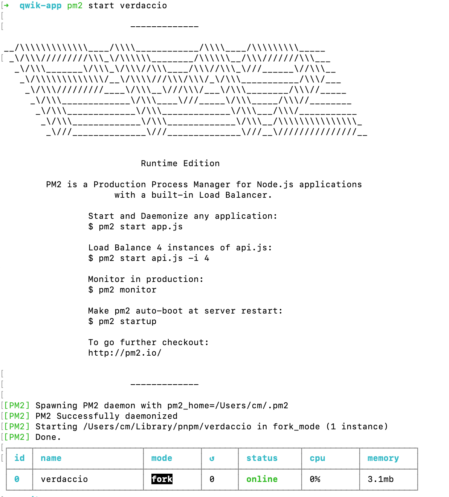
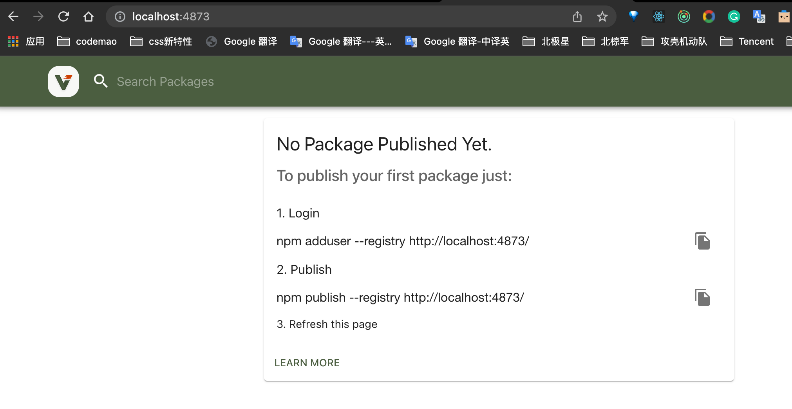
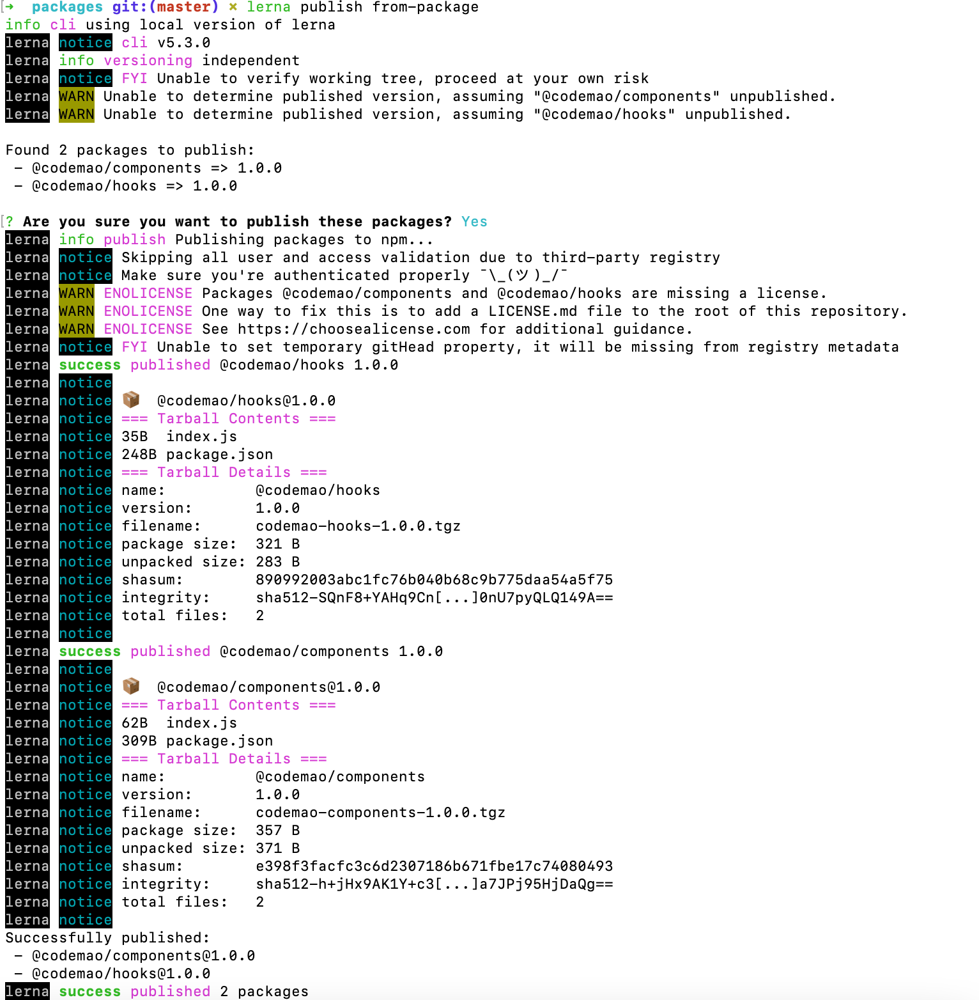
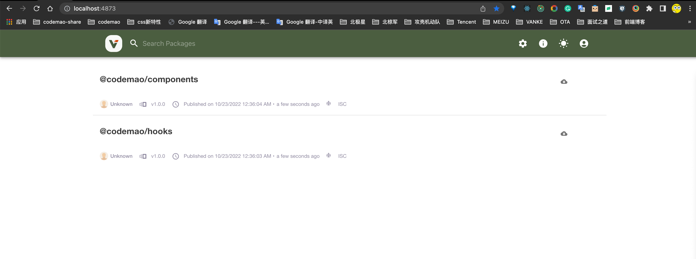
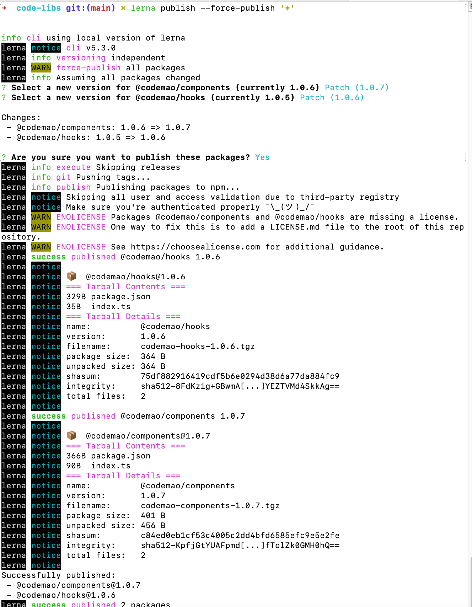

# monorepo 包管理方式

## monorepo 是什么

## monorepo 深入浅出

- 使用最近流行的 monorepo 管理方式，响应式，编译和运行时全部独立


## monorepo 和 multirepo 区别

multirepo 将应用按照模块分别在不同的仓库中进行管理

monorepo 将应用中所有的模块一股脑全部放在同一个项目中

## pnpm 和 npm 区别

npm3 以下的版本在安装依赖时非常直接，它会按照包依赖的树形结构将其下载到本地 node_modules 目录中， 也就是说，每个包都会将该包的依赖放到当前包所在的 node_modules 目录中

npm3 采用扁平结构，在安装依赖包时更加智能，会按照 package.json 中声明的顺序依次安装包， 遇到新的包就把它放在第一级 node_modules 目录中。后面在安装进行时，如果遇到一级 node_modules 目录已经存在的包， 就会先判断包版本，如果版本一样则跳过安装，否则会按照 npm2 的方式安装在树形目录结构下。


## lerna 是什么

lerna 是干什么的？

Lerna 是一个工具，它优化了使用 git 和 npm 管理多包存储库的工作流。

## lerna 可以做什么

1. 将一个大的 package 拆分成多个小的 package，便于分享和调试
2. 多个 git 仓库中更改容易变得混乱且难以跟踪
3. 多个 git 仓库中维护测试繁琐

## lerna 是如何工作的

lerna 有两种模式让你去管理你的项目：固定（Fixed）或独立（Independent）。

Fixed/Locked 模式（默认）
固定模式。该模式为单版本号，在根目录中的 lerna.json 中设置。当使用 lerna publish 时，如果自从上次发布后有模块改动，那么将会更新到新发布的版本。

这也是目前 Babel 用的模式，当你想要自动整合不同包的版本时使用这个模式。它的特点是任何 package 的 major change 均会导致所有包都会进行 major version 的更新。

Independent 模式

```json
// 独立模式的 lerna.json
{
  "packages": ["packages/*"],
  "version": "independent"
}
```

独立模式。该模式中允许开发者独立管理多个包的版本更新。每次发布时，会得到针对每个包改动(patch, minor, major custom change)的提示。lerna 会配合 git，检查文件变动，只发布有改动的 package。

独立模式允许你更具体地更新每个包的版本，并且对于一组组件是有意义的。将这种模式和 semantic-release 结合起来就不会那么痛苦了。

独立模式允许开发者更新指定 package 的版本。将 lerna.json 中的 version 键设为 independent 来启用独立模式。

## lerna 的一些相关概念

```json
{
  "version": 当前仓库的版本。,
  "npmClient": 一个选项执行客户端使用哪种命令运行。npm 和 yarn,
  "packages": 要用作包位置的全局变量数组。,
}

```

默认情况下，lerna 初始化 packages 值为["packages/"], 但是也可以使用自定义目录
["modules/"]或["package1", "package2"].

### 遇到的坑



lerna publish  主要做了以下几件事：
• 检查从上一个  git tag  之后是否有提交，没有提交就会显示  No changed packages to publish  的信息，然后退出
• 检查依赖了修改过的包的包，并更新依赖信息
• 提交相应版本的  git tag
• 发布修改的包及依赖它们的包

lerna publish --force-publish '\*'

如果 lerna.json 并没有更新，重试一下 lerna publish。
如果已经更新，您可以强制重新发布。

```zsh
lerna publish --force-publish $(ls packages/)
```

## lerna 的原理

## lerna 实战部分

### pm2 启动命令

准备工作

1. npm install pm2 -g
2. npm install --global verdaccio
3. pm2 start verdaccio
4. verdaccio


启动后


## 私仓部署核心命令

1. 配置文件地址～/.config/verdaccio/config.yaml
2. 底部 listen: 0.0.0.0:4873 阿里云端口
3. verdaccio 或者 pm2 start verdaccio 进行测试
4. 仓库文件地址～/.local/share/verdaccio/storage
5. 页面配置http://verdaccio.org/zh-CN/docs/webui/

## 安装 lerna

1. pnpm install lerna -g

## lerna 初始化

在当前根目录下执行： lerna init --independent

## pnpm 安装项目

pnpm install lerna@5.3.0 -D -w

pnpm dlx lerna init

通过 lerna add @codemao/hooks packages/components

发包 lerna publish from-package





## 删除指定的包

pnpm remove @codemao/hooks --filter @codemao/components

### 更新的工作

lerna publish


