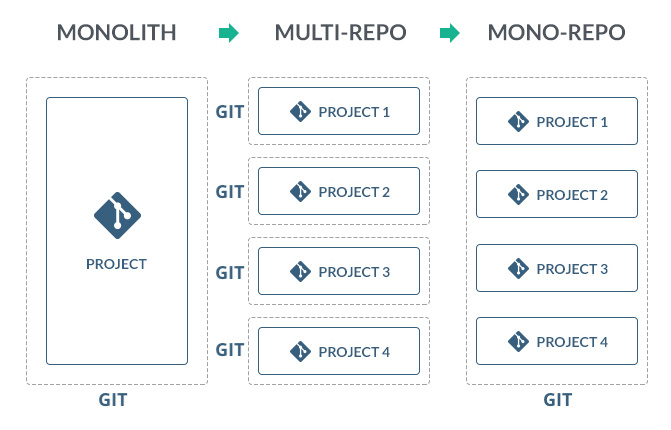

# monorepo 包管理方式

## monorepo 是什么

monorepo 是一种项目架构。 简单来说： 一个仓库内包含多个开发项目（模块、包）.

目前使用 lerna 进行多 packages 管理的明星仓库有：

- babel/babel
- facebook/create-react-app
- vuejs/vue-cli
- webpack/webpack-cli



## monorepo 和 multirepo 区别

multirepo 将应用按照模块分别在不同的仓库中进行管理

monorepo 将应用中所有的模块一股脑全部放在同一个项目中

## monorepo 的优缺点

- 各模块独立方便管理（对于 element 来说，修改表单只需要修改 packages 下的 form 目录）
- 结构清晰（模块独立之后，结构自然清晰）
- 有依赖的项目之间调试非常方便，上层应用能够感知其依赖的变化，可以很方便的对依赖项进行修改和调试。
- 缺点就是仓库代码体积可能比较大（一个仓库包含多个项目，项目多了，体积自然会大）

## 复用 package Workspaces

Workspaces 是设置包架构的一种新方式。他的目的是更方便的使用 monorepo, 具体就是能让你的多个项目集中在同一个仓库，并能够互相引用--被依赖的项目代码修改会实时反馈到依赖项目中。monorepo 中的子项目称为一个 workspace，多个 workspace 构成 Workspaces。

使用 Workspaces(以 yarn 为例)好处:

- 依赖包可以被 linked 到一起，这意味着你的工作区可以相互依赖，代码是实时更新的。这是比 `yarn link` 更好的方式因为这只会影响工作区部分，不会影响整个文件系统。

- 所有项目的依赖会被一起安装，这让 Yarn 更方便的优化安装依赖。

- Yarn 只有一个 lock 文件，而不是每个子项目就有一个，这意味着更少的冲突。

使用 monorepo 策略后，收益最大的两点是：

避免重复安装包，因此减少了磁盘空间的占用，并降低了构建时间；
内部代码可以彼此相互引用；
这两项好处全部都可以由一个成熟的包管理工具来完成，对前端开发而言，即是 yarn（1.0 以上）或 npm（7.0 以上）通过名为 Workspaces 的特性实现的（⚠️ 注意，支持 Workspaces 特性的 npm 目前依旧不是 TLS 版本）。

为了实现前面提到的两点收益，您需要在代码中做三件事：

1. 调整目录结构，将相互关联的项目放置在同一个目录，推荐命名为 packages；
2. 在项目根目录里的 package.json 文件中，设置 Workspaces 属性，属性值为之前创建的目录；
3. 同样，在 package.json 文件中，设置 private 属性为 true（为了避免我们误操作将仓库发布）；

```tree
 .
 ├── package.json
 └── packages/
     ├── @mono/project_1/ # 推荐使用 `@<项目名>/<子项目名>` 的方式命名
     │   ├── index.js
     │   └── package.json
     └── @mono/project_2/
         ├── index.js
         └── package.json
```

在项目根目录中执行 npm install 或 yarn install 后，您会发现在项目根目录中出现了 node_modules 目录，并且该目录不仅拥有所有子项目共用的 npm 包，还包含了我们的子项目。因此，我们可以在子项目中通过各种模块引入机制，像引入一般的 npm 模块一样引入其他子项目的代码

### 启用 yarn workspace

默认是 npm，每个子 package 下都有自己的 node_modules，如果使用 yarn workspace，可以共享 node_modules，减少安装时间

```json
"private": true,

"workspaces": [

    "packages/*"

],
```

## pnpm-workspace

安装依赖包
使用 pnpm 安装依赖包一般分以下几种情况：

全局的公共依赖包，比如打包涉及到的 rollup、typescript 等

pnpm 提供了 -w, --workspace-root 参数，可以将依赖包安装到工程的根目录下，作为所有 package 的公共依赖。
比如：

```zsh
pnpm install react -w
```

如果是一个开发依赖的话，可以加上 -D 参数，表示这是一个开发依赖，会装到 pacakage.json 中的 devDependencies 中，比如：

```zsh
pnpm install rollup -wD
```

给某个 package 单独安装指定依赖

pnpm 提供了 --filter 参数，可以用来对特定的 package 进行某些操作。
因此，如果想给 pkg1 安装一个依赖包，比如 axios，可以进行如下操作：

```zsh
pnpm add axios --filter @codemao/monorepo1
```

需要注意的是，--filter 参数跟着的是 package 下的 package.json 的 name 字段，并不是目录名。
关于 --filter 操作其实还是很丰富的，比如执行 pkg1 下的 scripts 脚本：

```zsh
pnpm build --filter @codemao/monorepo1
```

filter 后面除了可以指定具体的包名，还可以跟着匹配规则来指定对匹配上规则的包进行操作，比如：

```zsh
pnpm build --filter "./packages/\*\*"

```

此命令会执行所有 package 下的 build 命令。具体的用法可以参考 filter 文档。

模块之间的相互依赖

最后一种就是我们在开发时经常遇到的场景，比如 pkg1 中将 pkg2 作为依赖进行安装。
基于 pnpm 提供的 workspace:协议，可以方便的在 packages 内部进行互相引用。比如在 pkg1 中引用 pkg2：

```zsh
pnpm install @codemao/monorepo2 -r --filter @codemao/monorepo1
```

此时我们查看 pkg1 的 package.json，可以看到 dependencies 字段中多了对 @codemao/monorepo2 的引用，以 workspace: 开头，后面跟着具体的版本号。

```json
{
  "name": "@codemao/monorepo1",
  "version": "1.0.0",
  "dependencies": {
    "@codemao/monorepo2": "workspace:^1.0.0",
    "axios": "^0.27.2"
  }
}
```

在设置依赖版本的时候推荐用 workspace:\*，这样就可以保持依赖的版本是工作空间里最新版本，不需要每次手动更新依赖版本。
当 pnpm publish 的时候，会自动将 package.json 中的 workspace 修正为对应的版本号。

我们面临的问题：

1. 如果我们需要在多个子目录执行相同的命令，我们需要手动进入各个目录，并执行命令；
2. 当一个子项目更新后，我们只能手动追踪依赖该项目的其他子项目，并升级其版本。

## lerna 是什么

Lerna 是一个工具，它优化了使用 git 和 npm 管理多包存储库的工作流。

## lerna 可以做什么

1. 将一个大的 package 拆分成多个小的 package，便于分享和调试
2. 多个 git 仓库中更改容易变得混乱且难以跟踪
3. 多个 git 仓库中维护测试繁琐

## lerna 是如何工作的

lerna 有两种模式让你去管理你的项目：固定（Fixed）或独立（Independent）。

1. Fixed/Locked 模式（默认）

固定模式。该模式为单版本号，在根目录中的 lerna.json 中设置。当使用 lerna publish 时，如果自从上次发布后有模块改动，那么将会更新到新发布的版本。

这也是目前 Babel 用的模式，当你想要自动整合不同包的版本时使用这个模式。它的特点是任何 package 的 major change 均会导致所有包都会进行 major version 的更新。

2. Independent 模式

```json
// 独立模式的 lerna.json
{
  "packages": ["packages/*"],
  "version": "independent"
}
```

独立模式。该模式中允许开发者独立管理多个包的版本更新。每次发布时，会得到针对每个包改动(patch, minor, major custom change)的提示。lerna 会配合 git，检查文件变动，只发布有改动的 package。

独立模式允许你更具体地更新每个包的版本，并且对于一组组件是有意义的。将这种模式和 semantic-release 结合起来就不会那么痛苦了。

独立模式允许开发者更新指定 package 的版本。将 lerna.json 中的 version 键设为 independent 来启用独立模式。

## lerna 的一些相关概念

```json
{
  "version": 当前仓库的版本。,
  "npmClient": 一个选项执行客户端使用哪种命令运行。npm 和 yarn,
  "packages": 要用作包位置的全局变量数组。,
}
```

默认情况下，lerna 初始化 packages 值为["packages/"], 但是也可以使用自定义目录
["modules/"]或["package1", "package2"].

## lerna 的原理

## lerna 常见指令

lerna bootstrap

在当前 Lerna 仓库中执行引导流程（bootstrap）。安装所有 依赖项并链接任何交叉依赖。

lerna bootstrap --scope=@codemao/components

此命令至关重要，因为它让你可以 在 require() 中直接通过软件包的名称进行加载，就好像此软件包已经存在于 你的 node_modules 目录下一样。

lerna import <pathToRepo>

将本地路径 <pathToRepo> 中的软件包导入（import） packages/<directory-name> 中并提交 commit。

增加指定的包

```zsh
1. lerna add @codemao/hooks packages/components
2. lerna add lodash --scope=@codemao/components --dev
```

删除指定的包

```zsh
1. pnpm remove @codemao/hooks --filter @codemao/components

2. lerna exec 'pnpm remove loadsh' --scope=@codemao/components
```

更新的工作

lerna publish


lerna diff [package?]
列出所有或某个软件包自上次发布以来的修改情况。

lerna run [script]
在每一个包含 [script] 脚本的软件包中运行此 npm 脚本。

lerna ls
列出当前 Lerna 仓库中的所有公共软件包（public packages）。

lerna clean

删除所有包下面的 node_modules 目录，也可以删除指定包下面的 node_modules。
注意： 不会删除 package.json 里面的依赖项定义，也不会删除 root 目录的 node_modules。

lerna clean --scope=@codemao/components

## Lerna 与 pnpm/yarn/npm 分工

lerna 利用语义链接来实现这一目的。它还允许使用 yarn 工作空间，然后，将整个 Mono-Repo 方面的工作完全交给 yarn 工作空间的本地实现的功能。

在 Mono-Repo 工作流中使用 yarn 工作空间。 使用 lerna 的实用命令来优化多个包的管理，例如，选择性地执行 npm 脚本进行测试。

- 使用 lerna 发布软件包，因为 lerna 的版本和发布命令提供了复杂的功能。

通俗来讲就是：

包管理的能力交给 Lerna, 如版本管理; 依赖管理的能力交给 pnpm, 如依赖包的安装删除;

## lerna 实战部分

### pm2 启动命令

准备工作

1. npm install pm2 -g
2. npm install --global verdaccio
3. pm2 start verdaccio
4. verdaccio


启动后


### 安装 lerna

1. pnpm install lerna -g

### lerna 初始化

在当前根目录下执行： lerna init --independent

### pnpm 安装项目

pnpm install lerna@5.3.0 -D -w

pnpm dlx lerna init

通过 lerna add @codemao/hooks packages/components

发包 lerna publish from-package


## 遇到的坑


lerna publish  主要做了以下几件事：

- Run the equivalent of `lerna updated` to determine which packages need to be published.
- If necessary, increment the `version` key in `lerna.json`.
- Update the `package.json` of all updated packages to their new versions.
- Update all dependencies of the updated packages with the new versions, specified with a [caret (^)](https://docs.npmjs.com/files/package.json#dependencies).
- Create a new git commit and tag for the new version.
- Publish updated packages to npm.

• 检查从上一个  git tag  之后是否有提交，没有提交就会显示  No changed packages to publish  的信息，然后退出
• 检查依赖了修改过的包的包，并更新依赖信息
• 提交相应版本的  git tag
• 发布修改的包及依赖它们的包

如果 lerna.json 并没有更新，重试一下

```zsh
lerna publish。
```

如果已经更新，您可以强制重新发布。

```zsh
lerna publish --force-publish '\*'
```

## lerna 最佳实践

1. 采用 independent 模式
2. 根据 Gi 提交信息，自动生成 changelog
3. eslint 规则检查
4. prettier 自动格式化代码
5. 提交代码，代码检查 hook
6. 遵循 semver 版本规范

## 参考文献

[JavaScript and TypeScript Monorepos ](https://link.zhihu.com/?target=https%3A//frontendmasters.com/courses/monorepos/)

[lerna 管理前端 packages 的最佳实践](http://www.sosout.com/2018/07/21/lerna-repo.html)

[基于 lerna 和 yarn workspace 的 monorepo 工作流](https://zhuanlan.zhihu.com/p/71385053)

[Monorepos: Please don’t!](https://medium.com/@mattklein123/monorepos-please-dont-e9a279be011b)

[Monorepo: please do!](https://medium.com/@adamhjk/monorepo-please-do-3657e08a4b70)
