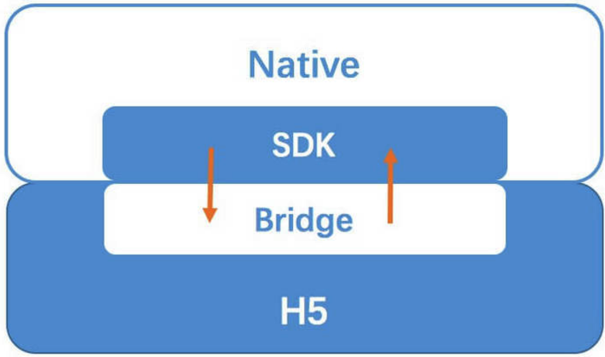

#

HybridApp 俗称混合应用，即混合了 Native技术 与 Web技术 进行开发的移动应用。在APP中使用 WebView 作为容器直接承载 Web页面。

## WebView的介绍

webview是移动APP中展示网页的容器组件。

ios上的webview
|  ui-webview    | wkwebview  |
|  ----  | ----  |
|  排版布局能力强  | 2014年推出的新一代组件  |

安卓上的webview
|  | webkit for webview  | chromium for webview  |
| ----  | ----  | ----  |
| 兼容 | Android4.4以下  | Android4.4以上  |
| JS引擎 | webCore JavaScript  | V8  |
| H5新API（Canvas,SVG,WebGL） | 不支持   | 支持  |
		
## 业界方案

1、基于 WebView UI 的基础方案，市面上大部分主流 App 都有采用，例如微信JS-SDK，通过 JSBridge 完成 H5 与 Native 的双向通讯，从而赋予H5一定程度的原生能力。

2、基于 Native UI 的方案，例如 React-Native、Weex。在赋予 H5 原生API能力的基础上，进一步通过 JSBridge 将js解析成的虚拟节点树(Virtual DOM)传递到 Native 并使用原生渲染。

3、近期比较流行的小程序方案，通过更加定制化的 JSBridge，并使用双 WebView 双线程的模式隔离了JS逻辑与UI渲染，形成了特殊的开发模式，加强了 H5 与 Native 混合程度，提高了页面性能及开发体验。

4、Flutter： 他是谷歌的移动UI框架，可以快速在iOS和Android上构建高质量的原生用户界面。采用了高性能渲染引擎(Skia)，界面开发语言使用dart，底层渲染引擎使用C, C++，框架层面针对IOS和安卓平台分别实现了对应的UI风格组件库。相比webview渲染、nativeUI渲染，性能更加出色。由于推出不久，性能还不够稳定。

## Hybrid 技术原理

混合开发中最核心的点就是Native端与H5端之间的双向通讯层，其实这里也可以理解为我们需要一套跨语言通讯方案，来完成Native(Java/Objective-c/...)与H5(JavaScript/...)之间的双向通讯。这个方案就是我们所说的JSBridge，而这实现的关键，便是作为容器的WebView,一切的原理都是基于webview的机制。

1. JavaScirpt 调用Native接口方式

1）API注入,原理其实就是 Native 获取 JavaScript环境上下文，并直接在上面挂载对象或者方法，使 js 可以直接调用，Android 与 IOS 分别拥有对应的挂载方式。
2) WebView 中的 prompt/confirm/alert 拦截，通常使用 prompt，因为这个方法在前端中使用频率低，比较不会出现冲突
3) WebView URL Scheme 跳转拦截
4) 在IOS上wkwebview上有window.webkit.messageHandler实现通信，支持IOS8及以上

2.Native调用JavaScript接口方式
 由于Native可以算作H5的宿主，因此拥有更大的权限，上面也提到了Navtive可以通过webView API直接执行Js代码。

IOS: stringByEvaluatingJavaScriptFromString

```Swift
// Swift
webview.stringByEvaluatingJavaScriptFromString("alert('NativeCall')")
```

Android: loadUrl (4.4-)

```java
// 调用js中的JSBridge.trigger方法
// 该方法的弊端是无法获取函数返回值；
webView.loadUrl("javascript:JSBridge.trigger('NativeCall')")
```

Android: evaluateJavascript (4.4+)

```java
// 4.4+后使用该方法便可调用并获取函数返回值；
mWebView.evaluateJavascript（"javascript:JSBridge.trigger('NativeCall')",      new ValueCallback<String>() {
    @Override
    public void onReceiveValue(String value) {
        //此处为 js 返回的结果
    }
});
```



### App中H5的接入方式

1. 在线H5，这是最常见的一种方式。我们只需要将H5代码部署到服务器上，只要把对应的 URL地址 给到客户端，用 WebView 打开该URL，即可嵌入。该方式的好处在于:

* 独立性强，有非常独立的开发/调试/更新/上线能力；
* 资源放在服务器上，完全不会影响客户端的包体积；
* 接入成本很低，完全的热更新机制。

但相对的，这种方式也有对应的缺点:

完全的网络依赖，在离线的情况下无法打开页面；
首屏加载速度依赖于网络，网络较慢时，首屏加载也较慢；

2.#(2) 内置包H5，这是一种本地化的嵌入方式，我们需要将代码进行打包后下发到客户端，并由客户端直接解压到本地储存中。通常我们运用在一些比较大和比较重要的模块上。其优点是:

* 由于其本地化，首屏加载速度快，用户体验更为接近原生；
* 可以不依赖网络，离线运行；
但同时，它的劣势也十分明显:

* 开发流程/更新机制复杂化，需要客户端，甚至服务端的共同协作；
* 会相应的增加 App 包体积；

## Bridge的初始化

在完成上面这个例子时，H5中native两边都需要先完成bridge的初始化，H5这边通常会在html的head中加载一段sdk代码，用来触发生成H5端bridge对象，每个公司都会自己提供一个对外的sdk脚本，比如微信提供的sdk等。通常放在head 中，是因为它需要最先执行完成，这样你代码中才可以使用。这个sdk脚本，其实就是提供了一个ready函数，bridge对象完成之后，会调用里面的回调函数，并提供bridge对象作为参数。
