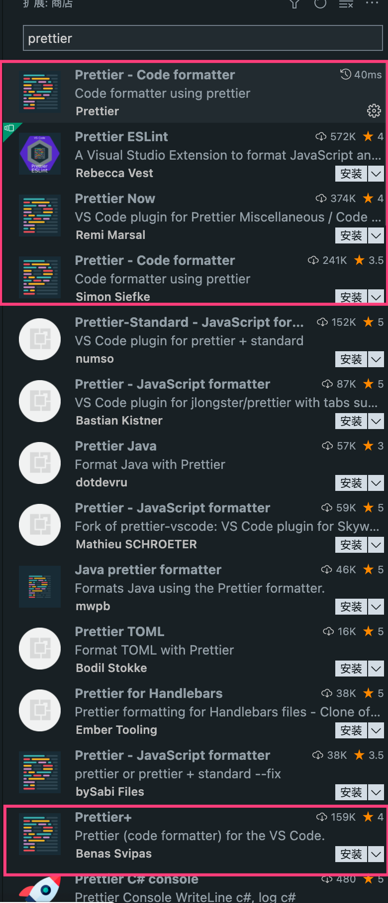

## 在项目中配置这几个关系

1.为什么要使用Prettier？
手动调整代码格式，不仅低效，而且在团队协作开发中，无法保证代码风格统一，所以需要引入自动格式化代码工具。Prettier不仅可以格式化js, jsx, vue,angular,ts,flow，还适用于HTML, CSS/Less,/Sass，Markdown, YAML,  GraphQL代码的格式化，

2.ESLint代码校验配置

2.1 有了Prettier之后，为什么还需要ESLint？
prettier只关心代码格式，这显然是不够的，我们追求的目标不仅仅是代码风格统一，还要在书写的时候，避免一些常见的低级的错误。所以，就要引入ESlint。ESLint也有许多与代码规则有关的配置项，那你可能要问，我只用eslint就好了，既能规范编码风格，也能提升代码质量。何必两个都用，用了还容易起冲突，这是因为eslint的代码格式化有盲区，只针对js,jsx,ts,tsx，不能格式化HTML, CSS/Less,/Sass，Markdown, YAML,  GraphQL，以及vue中的html和css。

2.2 Prettier和ESLint为什么会冲突?
Prettier的功能比较专一，是专门用来格式化代码的，格式化代码的范围比ESLint广泛。

ESLint的功能相对综合，大体可以分为类，
一类是规范代码风格：
一类是规范代码质量：

2.3 如何解决两者的冲突?
要么修改Prettier的规则，使之与ESLint保持一致，要么修改ESLint的校验规则，使之与Prettier的代码格式化风格一致，究竟要改哪一个，都可以。个人倾向于改ESlint的规则，因为Prettier的代码格式化规则是普适的，而ESLint的代码校验规则是针对特定语言的，特定的遵从普适的原则上好一些。



实不相瞒 之前的我格式化工具装了一大堆，如上图所示

甚至还装了 beautify
eslint 和 prettier-now、prettier+

首先我们需要先下载eslint的插件

接着在vscode里面配置setting.json

```javascript
{
  "eslint.run": "onType",
  "eslint.options": {
    "extensions": [".js", ".vue", ".jsx", ".tsx"]
  },
  "editor.codeActionsOnSave": {
    "source.fixAll.eslint": true
  }
}

  // 编辑器设置 - 保存时做格式化
  "editor.formatOnSave": true,
  // 编辑器设置 - 默认采用prettier-now做格式化
  // 如果使用的是prettier，这的设置应该是 esbenp.prettier-vscode
  "editor.defaultFormatter":"remimarsal.prettier-now",
```

接着安装prettier做格式化

接着在vscode里面配置setting.json

```json
  "[javascriptreact]": {
    "editor.defaultFormatter": "svipas.prettier-plus"
  },

  "[css]": {
    "editor.defaultFormatter": "svipas.prettier-plus"
  },

```

接着安装prettier+做格式化

接着在vscode里面配置setting.json

```json

  "[typescriptreact]": {
    "editor.defaultFormatter": "esbenp.prettier-vscode"
  },
```
