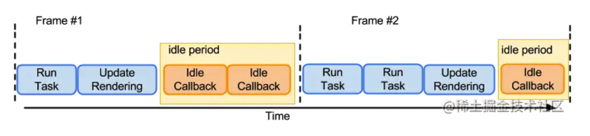

## 为什么JavaScript是单线程的呢?

这主要与JavaScript用途有关。它的主要用途是与用户互动，以及操作DOM。如果JavaScript是多线程的，会带来很多复杂的问题，假如 JavaScript有A和B两个线程，A线程在DOM节点上添加了内容，B线程删除了这个节点，应该是哪个为准呢? 所以，为了避免复杂性，所以设计成了单线程。

虽然 HTML5 提出了Web Worker标准。Web Worker 的作用，就是为 JavaScript 创造多线程环境，允许主线程创建 Worker 线程，将一些任务分配给后者运行。但是子线程完全受主线程控制，且不得操作DOM。所以这个并没有改变JavaScript单线程的本质。一般使用 Web Worker 的场景是代码中有很多计算密集型或高延迟的任务，可以考虑分配给 Worker 线程。

浏览器的内核是多进程的

brower进程（主进程）

负责浏览器的页面展示，与用户交互。如前进，后退
页面的前进，后退
负责页面的管理，创建和销毁其他进程

GPU进程

3D渲染

插件进程

每种类型的插件对应一个进程，仅当使用该插件时才能创建

浏览器渲染进程（浏览器内核）

GUI渲染线程

DOM解析， CSS解析，生成渲染树

js引擎线程

执行Js代码

事件触发

管理着一个任务队列

异步HTTP请求线程
定时触发器线程

浏览器内核中线程之间的关系

GUI渲染线程和JS引擎线程互斥

js是可以操作DOM的，如果在修改这些元素的同时渲染页面（js线程和ui线程同时运行），那么渲染线程前后获得的元素数据可能就不一致了。

JS阻塞页面加载

js如果执行时间过长就会阻塞页面

进程（process）和线程（thread）是操作系统的基本概念。

进程是 CPU 资源分配的最小单位（是能拥有资源和独立运行的最小单位）。
线程是 CPU 调度的最小单位（是建立在进程基础上的一次程序运行单位）。

setTimeout

setTimeout的运行机制：执行该语句时，是立即把当前定时器代码推入事件队列，当定时器在事件列表中满足设置的时间值时将传入的函数加入任务队列，之后的执行就交给任务队列负责。但是如果此时任务队列不为空，则需等待，所以执行定时器内代码的时间可能会大于设置的时间

setTimeout 和 setInterval区别

setTimeout: 指定延期后调用函数，每次setTimeout计时到后就会去执行，然后执行一段时间后才继续setTimeout,中间就多了误差，（误差多少与代码的执行时间有关）。
setInterval：以指定周期调用函数，而setInterval则是每次都精确的隔一段时间推入一个事件（但是，事件的执行时间不一定就不准确，还有可能是这个事件还没执行完毕，下一个事件就来了）.

requestAnimationFrame会在每次屏幕刷新的时候被调用，而requestIdleCallback则会每次屏幕刷新时，判断当前帧是否还有多余的时间，如果有，则会调用 requestAnimationFrame 的回调函数。

requestAnimationFrame会在每次屏幕刷新的时候被调用，而requestIdleCallback则会在每次屏幕刷新时，判断当前帧是否还有多余的时间，如果有，则会调用requestAnimationFrame的回调函数

图片中是两个连续的执行帧，大致可以理解为两个帧的持续时间大概为16.67，图中黄色部分就是空闲时间。所以，requestIdleCallback中的回调函数仅会在每次屏幕刷新并且有空闲时间时才会被调用.

利用这个特性，我们可以在动画执行的期间，利用每帧的空闲时间来进行数据发送的操作，或者一些优先级比较低的操作，此时不会使影响到动画的性能，或者和requestAnimationFrame搭配，可以实现一些页面性能方面的的优化，
