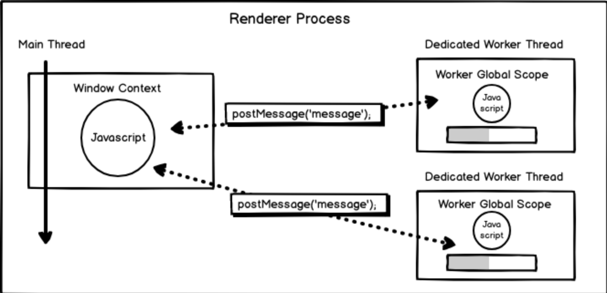

Worker 的本质是在本地开启一个系统级的新线程来处理任务，具有以下特点:

上下文: 具有独立的 worker 执行上下文，也就是 WorkerGlobalScope，在 worker 内通过 self 来获取引用它的对象
事件循环: 具有与 browser context 下不同的 worker event loop，它的任务队列仅包含事件、回调与网络活动
数据通讯: 在主线程与 worker 线程之间传递消息时使用结构化克隆算法对数据进行处理，使用基于 Transferable 接口的 postMessage()方法进行数据的传输，无法直接传输 Error 和 Function 对象，在另一侧通过监听 message 事件来获取数据。
网络访问: XMLHttpRequest(Service Worker 中无法使用), 执行 I/O (尽管 responseXML 和 channel 属性总是为空)

主线程与 worker 线程之间的消息传递示意图:



除了专用和共享的 web worker，还有一些其它类型的 worker：

- ServiceWorkers (en-US) （服务 worker）一般作为 web 应用程序、浏览器和网络（如果可用）之前的代理服务器。它们旨在（除开其他方面）创建有效的离线体验，拦截网络请求，以及根据网络是否可用采取合适的行动并更新驻留在服务器上的资源。他们还将允许访问推送通知和后台同步 API。
- Chrome Workers 是一种仅适用于 firefox 的 worker。如果您正在开发附加组件，希望在扩展程序中使用 worker 且有在你的 worker 中访问 js-ctypes 的权限，你可以使用 Chrome Workers。详情请参阅 ChromeWorker。
- Audio Workers （音频 worker）使得在 web worker 上下文中直接完成脚本化音频处理成为可能。

怎么用
创建一个 worker 对象(以 Dedicated Worker 为例)

```js
// main.js
let myWorker = new Worker("worker.js");
```

主线程发送消息

```js
// main.js
myWorker.postMessage("hi from main");
```

worker 线程处理&发送消息

```js
// worker.js
self.addEventListener("message", (e) => {
  let { data } = e;
  console.log("Message received from main script: ", data);
  console.log("Posting message back to main script");
  self.postMessage("hello fron worker");
  // self.close() 在内部关闭worker
});
```

主线程监听消息

```js
// main.js
myWorker.addEventListener("message", (e) => {
  let { data } = e;
  console.log("Message received from worker: ", data);
  // myWorker.terminate() 在外部关闭worker
});
```

什么时候用
列举一些常见场景

轮询
比如说对文件上传进度的轮询，对于每一个上传的文件均在 worker 内启用一个定时任务来进行轮询处理。

```js
// polling-worker.js
import { apiURL, WORKER_SIGNAL } from "@/utils/config";
import axios from "axios";
let intervalTasks = [];
const pollingPeriod = 5000;
self.onmessage = async (e) => {
  let { message, id, token } = e.data;
  switch (message) {
    case WORKER_SIGNAL.AUDIO_POLLING:
      let url = apiURL + "/upload/status";
      let param = `?ids=${id}`;
      let interval = setInterval(async () => {
        try {
          let res = await axios.get(url + param, { headers: { token } });
          self.postMessage({ status: "success", data: res.data });
        } catch (err) {
          self.postMessage({ status: "error", data: err });
        }
      }, pollingPeriod);
      intervalTasks.push({ interval, id });
      break;
    case WORKER_SIGNAL.STOP:
      let obj = intervalTasks.find((e) => e.id === id);
      clearInterval(obj.interval);
  }
};
```

当请求成功时通知渲染进程已完成该文件上传，并在 worker 内部终止自身线程，在队列中取消该 worker 任务的 flag。

复杂数据解析
在 worker 中处理与解析复杂的数据对象可以避免阻塞 UI 线程，而且也可以节省一次往返时间(round trip)。

```js
// filter-worker.js
self.onmessage = function (e) {
  self.postMessage(e.data.filter(function () {
    return e.flagged;
  }));
}
// app.js
var filterWorker = new Worker('filter-worker.js');

filterWorker.onmessage = function (e) {
  // Log filtered list
  console.log(e.data);
}

var hugeData = [ ... ];

filterWorker.postMessage(hugeData);
```

代理其他 JS 库的 API
可以在 worker 线程中加载与执行 JS 库，执行相关操作。

```js
// proxy-worker.js
loadScripts('https://large/but/cool/library.js');

self.onmessage = function (e) {
  switch(e.data.type) {
    case: 'thingIWantToDo':
      myLibraryScope.doTheThing(e.data.payload).then(res => {
        self.postMessage({
          status: 'COMPLETED'
          type: e.data.type,
          payload: res
        })
      });
      break;

    default:
      throw new Error(`Action ${e.data.type} is not handled by proxy-worker`);
  }
}

// app.js
var coolWorker = new Worker('proxy-worker.js');

dispatch({
  type: 'thingIWantToDo',
  payload: 1000
}).then(console.log);

function dispatch(action) {
  return new Promise(resolve => {
    const listener = res => {
      if (res.data.type === action.type && res.data.status === 'COMPLETED') {
        resolve(res.data.payload);

        coolWorker.removeEventListener('message', listener);
      }
    };

    coolWorker.addEventListener('message', listener);

    coolWorker.postMessage(action);
  });
}
```

electron 中的 node 任务
在使用 electron 时，由于全局 node 可用的特点，也可以把一些 node 任务放在渲染进程的 worker 线程中，如文件读写等。

```js
// node-worker.js
import { WORKER_SIGNAL } from '@/utils/config'
import nodeUtils from '@/utils/node'
onmessage = async e => {
    let { message, detailInfos,type,targetPath } = e.data
    switch (message) {
        case WORKER_SIGNAL.EXPORT_CONFERENCE:
            try {
                await nodeUtils.generateOfficeWord(detailInfos, type, targetPath)
                self.postMessage({status: 'success'})
            } catch (err) {
                self.postMessage({status: 'error'， data: err})
            }
            break
        default:
            console.log(message)
    }
}
```

三种创建的方式:

1. 放在 /public 目录下

将 worker 脚本执行的 .js 文件作为静态资源放在项目中（例如，通常/public/assets 作为存放静态资源的目录，打包时直接被拷贝到/build/assets 中，具体看项目自己的配置），即可通过同源 url 直接访问

2. 嵌入 <script />

new Worker 的 url 参数，也支持 blob url，这提供了将 worker 脚本代码 放在项目代码中的另一途径
方法二、三 都基于 blob url 实现，原理就是：得到脚本代码的字符串内容，然后即可将字符串内容转换为 blob url 传给 Worker.

<html>
   <body>
    <script id="worker" type="app/worker">
      self.addEventListener('message', function (event) {
        postMessage('Got a message from the main thread');
      }, false);
    </script>
  </body>
</html>

上面是一段嵌入网页的脚本，注意必须指定 <script /> 标签的 type 属性是一个浏览器不认识的值，上例是 app/worker 然后，读取到这段嵌入页面脚本的字符串内容，转换为 blob url，用 Worker 来处理

const blob = new Blob([document.querySelector('#worker').textContent], {type: "application/javascript"});
const url = window.URL.createObjectURL(blob);

const worker = new Worker(url);

3. 函数式 toString()

```js
function createWorker(f) {
  const blob = new Blob(["(" + f.toString() + ")()"], {
    type: "application/javascript",
  });
  const blobUrl = window.URL.createObjectURL(blob);
  const worker = new Worker(blobUrl);
  return worker;
}

/* 使用 */
createWorker(function () {
  self.addEventListener(
    "message",
    function (event) {
      postMessage("Got a message from the main thread");
    },
    false
  );
});

// 该函数的内容，即为需要在worker中执行的脚本
const workerScriptWrapper = () => {
  self.addEventListener(
    "message",
    function (event) {
      postMessage("Got a message from the main thread");
    },
    false
  );
};

// 将上述函数转换为字符串
const wrapperCode = workerScriptWrapper.toString();
// 对字符串进行分割，取到worker执行的脚本
const workerCode = wrapperCode.substring(
  code.indexOf("{") + 1,
  code.lastIndexOf("}")
);

// 将字符串转换为Blob URL
const blob = new Blob([workerCode], { type: "application/javascript" });
const blobUrl = URL.createObjectURL(blob);
```

workerize & workerize-loader
如果想要通过 async/await 与 ES6 的模块化使用 worker，可以使用 workerize:

Moves a module into a Web Worker, automatically reflecting exported functions as asynchronous proxies.

workerize 的使用
通过 workerize 使用 worker 如下所示:

```js
let worker = workerize(`
	export function add(a, b) {
		// block for half a second to demonstrate asynchronicity
		let start = Date.now();
		while (Date.now()-start < 500);
		return a + b;
	}
`);

(async () => {
  console.log("3 + 9 = ", await worker.add(3, 9));
  console.log("1 + 2 = ", await worker.add(1, 2));
})();
```

workerize-loader 的使用
如果是在 webpack 环境中需要使用 workerize-loader 来载入 worker:

```js
// worker.js
// block for `time` ms, then return the number of loops we could run in that time:
export const expensive = (time) =>
  new Promise((resolve, reject) => {
    let start = Date.now();
    let count = 0;
    while (Date.now() - start < time) count++;
    resolve(count);
  });

// main.js
import worker from "workerize-loader!./worker";
let instance = worker(); // `new` is optional
instance.expensive(1000).then((count) => {
  console.log(`Ran ${count} loops`);
});
```

workerize 的核心

workerize 的源码非常简洁，来看看其中主要的两个方法。

生成 worker 对象的 workerize 方法：

```js
export default function workerize(code, options) {
	let exports = {};
  ...
  // 若为函数，则获取函数的字符串转化结果
	if (typeof code==='function') code = `(${Function.prototype.toString.call(code)})(${exportsObjName})`;
  // 转换为commonjs模块规范
	code = toCjs(code, exportsObjName, exports) + `\n(${Function.prototype.toString.call(setup)})(self,${exportsObjName},{})`;
	let url = URL.createObjectURL(new Blob([code])),
		worker = new Worker(url, options);
    ...
}
```

该方法中最关键的是使用了 Function.prototype.toString()将函数转换成了字符串再进行传输，这是由于根据结构化克隆的限制是不能传递 Function 类型对象的，只有使用这个 trick。

另外，Function.prototype.toString()并不继承自 Object.prototype.toString()，对于用户定义的函数会返回一个包含用于定义函数源文本段的字符串，详情见 MDN 文档。

除此之外为了兼容性还使用了 toCjs()方法来转换模块化的方式(ES6 –> CommonJS):

```js
function toCjs(code, exportsObjName, exports) {
  code = code.replace(/^(\s*)export\s+default\s+/m, (s, before) => {
    exports.default = true;
    return `${before}${exportsObjName}.default=`;
  });
  code = code.replace(
    /^(\s*)export\s+((?:async\s*)?function(?:\s*\*)?|const|let|var)(\s+)([a-zA-Z$_][a-zA-Z0-9$_]*)/gm,
    (s, before, type, ws, name) => {
      exports[name] = true;
      return `${before}${exportsObjName}.${name}=${type}${ws}${name}`;
    }
  );
  return `var ${exportsObjName}={};\n${code}\n${exportsObjName};`;
}
```
