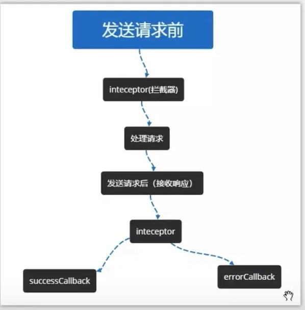

# 从 ajax 到 axios

## XMLHttpRequest 对象

```js
const xhr = new XMLHttpRequest();

xhr.onreadystatechange = function () {
  if (xhr.readyState === 4 && xhr.status === 200) {
  }
};

const url = "http://www.baidu.com/";
xhr.open("post", url, true); //初始化
const body = {
  data: {
    a: 1,
  },
};

xhr.send(body);

xhr.onload = function () {
  // 请求结束后, 在此处写处理代码
  console.log("请求成功", xhr.responseText);
};

// 当网络不佳时，我们需要给请求设置一个超时时间

// 超时时间单位为毫秒
xhr.timeout = 1000;

// 当请求超时时，会触发 ontimeout 方法
xhr.ontimeout = () => console.log("请求超时");
```

- xhr.readyStatus==0 尚未调用 open 方法
- xhr.readyStatus==1 已调用 open 但还未发送请求（未调用 send）
- xhr.readyStatus==2 已发送请求（已调用 send）
- xhr.readyStatus==3 已接收到请求返回的数据
- xhr.readyStatus==4 请求已完成

XMLHttpRequest.responseType 属性是一个枚举属性, 返回响应式数据的类型.

responseType 支持以下几种值:

- ""
  responseType 为空字符串时，采用默认类型 DOMString，与设置为 text 相同。
- arraybuffer
  response 是一个包含二进制数据的 JavaScript arrayBuffer
- blob
  response 是一个包含二进制数据的 blob 对象
- document
  response 是一个 html document 或 xmldocument, 这取决于接收到的数据的 mime 类型.
- json
  response 是一个 JavaScript 对象。这个对象是通过将接收到的数据类型视为 JSON 解析得到的
- text
  response 是一个以 DOMString 对象表示的文本。

## ajax

```js
function ajax(options) {
  let url = options.url;
  const method = options.method.toLocaleLowerCase() || "get";
  const async = options.async == true; // default is true
  const data = options.data;
  const xhr = new XMLHttpRequest();

  if (options.timeout && options.timeout > 0) {
    xhr.timeout = options.timeout;
  }

  return new Promise((resolve, reject) => {
    xhr.ontimeout = () => reject && reject("请求超时");
    xhr.onreadystatechange = () => {
      if (xhr.readyState == 4) {
        if ((xhr.status >= 200 && xhr.status < 300) || xhr.status == 304) {
          resolve && resolve(xhr.responseText);
        } else {
          reject && reject();
        }
      }
    };
    xhr.onerror = (err) => reject && reject(err);

    let paramArr = [];
    let encodeData;
    if (data instanceof Object) {
      for (let key in data) {
        // 参数拼接需要通过 encodeURIComponent 进行编码
        paramArr.push(
          encodeURIComponent(key) + "=" + encodeURIComponent(data[key])
        );
      }
      encodeData = paramArr.join("&");
    }

    if (method === "get") {
      // 检测 url 中是否已存在 ? 及其位置
      const index = url.indexOf("?");
      if (index === -1) url += "?";
      else if (index !== url.length - 1) url += "&";
      // 拼接 url
      url += encodeData;
    }

    xhr.open(method, url, async);
    if (method === "get") xhr.send(null);
    else {
      // post 方式需要设置请求头
      xhr.setRequestHeader(
        "Content-Type",
        "application/x-www-form-urlencoded;charset=UTF-8"
      );
      xhr.send(encodeData);
    }
  });
}
```

## fetch

```js
// 原生XHR
var xhr = new XMLHttpRequest();
xhr.open("GET", url);
xhr.onreadystatechange = function () {
  if (xhr.readyState === 4 && xhr.status === 200) {
    console.log(xhr.responseText); // 从服务器获取数据
  }
};
xhr.send();
// fetch
fetch(url)
  .then((response) => {
    if (response.ok) {
      return response.json();
    }
  })
  .then((data) => console.log(data))
  .catch((err) => console.log(err));
```

```js
// 创建一个 AbortController 实例
const controller = new AbortController();
const signal = controller.signal;

// 发送请求
fetch("https://example.com/data", { signal })
  .then((response) => response.json())
  .then((data) => {
    // 处理响应数据
    console.log(data);
  })
  .catch((error) => {
    if (error.name === "AbortError") {
      console.log("请求被取消");
    } else {
      // 处理其他错误
      console.error("请求错误:", error);
    }
  });

// 在需要取消请求的地方调用
controller.abort();
```

Fetch API 也能像 XHR 那样中断一个请求了，只是稍微绕了一点。通过创建一个 AbortController 实例，我们得到了一个 Fetch API 原生支持的控制中断的控制器。这个实例的 signal 参数是一个 AbortSignal 实例，还提供了一个 abort() 方法发送中断信号。只需要将 signal 参数传递进 fetch() 的初始化参数中，就可以在 fetch 请求之外控制请求的中断了：

过去 FileReader 只能在 onload 事件上拿到整个文件的数据，或者对文件使用 slice() 方法得到 Blob 文件片段。

## axios


我们可以为 axios 处理一下错误

```js
axios.get("/user/12345").catch(function (error) {
  if (error.response) {
    // 请求已发出，但服务器响应的状态码不在 2xx 范围内
    console.log(error.response.data);
    console.log(error.response.status);
    console.log(error.response.headers);
  } else {
    // Something happened in setting up the request that triggered an Error
    console.log("Error", error.message);
  }
  console.log(error.config);
});
```

### 取消请求

```js
// 创建取消令牌的生成器对象
var CancelToken = axios.CancelToken;
// 从中获取令牌对象
var source = CancelToken.source();

// 发请求
axios
  .get("/user/12345", {
    // 传递令牌
    cancelToken: source.token,
  })
  .catch(function (thrown) {
    if (axios.isCancel(thrown)) {
      console.log("Request canceled", thrown.message);
    } else {
      // 处理错误
    }
  });

// 取消请求（message 参数是可选的）
source.cancel("Operation canceled by the user.");
```

1. 创建 CancelToken 对象： 在发起请求之前，可以通过 axios.CancelToken.source() 方法创建一个 CancelToken 对象，并获取其中的 token。这个 token 是一个用于标识该请求的令牌。

2. 关联 CancelToken： 将创建的 CancelToken 对象中的 token 关联到请求的配置中，通过 cancelToken 参数。这告诉 Axios 在取消令牌触发时要取消这个请求。

3. 取消请求： 当想要取消请求时，调用 CancelToken 对象中的 cancel 方法，并提供一个取消的原因。这会触发 Axios 内部的逻辑，导致底层的网络请求被中止。

4. 捕获取消错误： 如果请求在取消前已经发出，Axios 会抛出一个名为 Cancel 的错误。可以使用 axios.isCancel(error) 来检查是否是取消错误。在 .catch 部分处理这个取消错误。

封装完成的取消请求

```js
import axios from "axios";

axios.defaults.timeout = 5000;
axios.defaults.baseURL = "";

let pending = []; //声明一个数组用于存储每个ajax请求的取消函数和ajax标识
let cancelToken = axios.CancelToken;
let removePending = (ever) => {
  for (let p in pending) {
    if (pending[p].u === ever.url + "&" + ever.method) {
      //当当前请求在数组中存在时执行函数体
      pending[p].f(); //执行取消操作
      pending.splice(p, 1); //把这条记录从数组中移除
    }
  }
};

//http request 拦截器
axios.interceptors.request.use(
  (config) => {
    config.data = JSON.stringify(config.data);
    config.headers = {
      "Content-Type": "application/x-www-form-urlencoded",
    };
    // ------------------------------------------------------------------------------------
    removePending(config); //在一个ajax发送前执行一下取消操作
    config.cancelToken = new cancelToken((c) => {
      // 这里的ajax标识我是用请求地址&请求方式拼接的字符串，当然你可以选择其他的一些方式
      pending.push({
        u: config.url + "&" + config.method,
        f: c,
      });
    });
    // -----------------------------------------------------------------------------------------
    return config;
  },
  (error) => {
    return Promise.reject(err);
  }
);
//http response 拦截器
axios.interceptors.response.use(
  (response) => {
    // ------------------------------------------------------------------------------------------
    removePending(res.config); //在一个ajax响应后再执行一下取消操作，把已经完成的请求从pending中移除
    // -------------------------------------------------------------------------------------------
    if (response.data.errCode == 2) {
      router.push({
        path: "/login",
        query: {
          redirect: router.currentRoute.fullPath,
        }, //从哪个页面跳转
      });
    }
    return response;
  },
  (error) => {
    return Promise.reject(error);
  }
);
```

// 自己实现一个简略版的

```js
// 创建Promise，返回放行开关cancel
function source() {
  var cancel;
  var promise = new Promise(function (resolve) {
    cancel = resolve;
  });
  return {
    cancel: cancel,
    token: promise,
  };
}
// 发请求
function axios_get(config) {
  if (config.cancelToken) {
    config.cancelToken.then(function () {
      xhr.abort();
    });
  }

  // 最终发请求
  xhr.request();
}

// 代码执行
var source = source();

axios_get({
  cancelToken: source.token,
});

setTimeout(function () {
  source.cancel(); // 5秒之后执行下一步操作
}, 5000);
```

demo

```js
    <button @click="getMsg" class="get-msg">获取数据</button>
    getMsg() {
      let CancelToken = axios.CancelToken;
      let self = this;
      axios
        .get("http://www.zhangxinxu.com/study/201802/cros-ajax.php", {
          cancelToken: new CancelToken(function executor(c) {
            self.cancel = c;
            console.log(c);
            // 这个参数 c 就是CancelToken构造函数里面自带的取消请求的函数，这里把该函数当参数用
          }),
        })
        .then((res) => {
          this.items = res.data;
        })
        .catch((err) => {
          console.log(err);
        });

      //手速够快就不用写这个定时器了，点击取消获取就可以看到效果了
      setTimeout(function () {
        //只要我们去调用了这个cancel()方法，没有完成请求的接口便会停止请求
        self.cancel();
      }, 100);
    }


```

接下来是 ant-design-pro 的代码

```js
// adapter.js

import axios from "axios";

const codeMessage = {
  200: "服务器成功返回请求的数据。",
  201: "新建或修改数据成功。",
  202: "一个请求已经进入后台排队（异步任务）。",
  204: "删除数据成功。",
  400: "发出的请求有错误，服务器没有进行新建或修改数据的操作。",
  401: "用户没有权限（令牌、用户名、密码错误）。",
  403: "用户得到授权，但是访问是被禁止的。",
  404: "发出的请求针对的是不存在的记录，服务器没有进行操作。",
  406: "请求的格式不可得。",
  410: "请求的资源被永久删除，且不会再得到的。",
  422: "当创建一个对象时，发生一个验证错误。",
  500: "服务器发生错误，请检查服务器。",
  502: "网关错误。",
  503: "服务不可用，服务器暂时过载或维护。",
  504: "网关超时。",
};

// 检查http code
const checkStatus = (response) => {
  if (response.status >= 200 && response.status < 300) {
    return response;
  }
  const errortext = codeMessage[response.status] || response.statusText;
  // 弹窗通知报错
  const error = new Error(errortext);
  error.name = response.status;
  error.response = response;
  throw error;
};

/**
 * 封装的请求函数
 * @param  {string} url
 * @param  {object} [option]
 * @return {object}
 */
export default function request(option) {
  const newOptions = Object.assign({}, option, {
    credentials: "include",
  });

  if (
    newOptions.method === "POST" ||
    newOptions.method === "PUT" ||
    newOptions.method === "DELETE"
  ) {
    if (!(newOptions.body instanceof FormData)) {
      newOptions.headers = {
        Accept: "application/json",
        "Content-Type": "application/json; charset=utf-8",
        ...newOptions.headers,
      };
      newOptions.data = JSON.parse(JSON.stringify(newOptions.data));
    } else {
      newOptions.headers = {
        Accept: "application/json",
        ...newOptions.headers,
      };
    }
  } else {
    newOptions.headers = {
      Accept: "application/json",
      ...newOptions.headers,
    };
  }

  return axios(newOptions)
    .then(checkStatus)
    .then((response) => {
      var res = response.data;
      if (res.code === 1) {
        return res.data;
      } else {
        Message.error({
          content: res.msg,
          duration: 1.5,
        });
      }
    })
    .catch((err) => {
      let status = err.name;
      if (status === 401) {
        console.log("未经授权, 错误码:", status);
      }
      if (status === 403) {
        console.log("禁止访问, 错误码:", status);
      }
      if (status <= 504 && status >= 500) {
        console.log("服务器错误, 错误码:", status);
      }
      if (status >= 404 && status < 422) {
        console.log("找不到资源路径, 错误码 :", status);
      }
    });
}
```

封装层级深

```js
import axios from "axios";
import Cookies from "js-cookie";
import { handleUrl, handleHttpStatus, handleResultStatus } from "./utils";

class Adapter {
  // 获取options
  getOptions = ({ options, needAuthorToken, needCsrfToken }) => {
    let { url, headers } = options;
    // 检查url，url可能为 /api/backend/，也可能是完整的url=http://seewo.com
    url = handleUrl(url);
    if (needAuthorToken) {
      const authorToken = Cookies.get("x-auth-token"); // 这个由你们定义
      headers["xauthtoken"] = authorToken;
    }
    if (needCsrfToken) {
      const csrfToken = Cookies.get("csrfToken"); // 这个由你们定义
      headers["x-csrf-token"] = csrfToken;
    }
    return Object.assign(options, {
      url: url,
      method: options.method || "GET",
      headers: headers,
    });
  };

  // request
  dispatchCallAPI = ({ options, authorToken = false, csrfToken = false }) => {
    const options = this.getOptions({ options, authorToken, csrfToken });

    return axios(options)
      .then(handleHttpStatus)
      .then(handleResultStatus)
      .then((res) => {
        /**
         * 如果返回的不是一个JSON对象，而是一个字符串，因此需要对这个字符串进行处理
         * 如果直接返回的是一个JSON对象，这个时候，JSON.parse会抛出异常，如果出现异常
         * 我们直接返回这个对象本身的值即可
         */
        try {
          return JSON.parse(res.data);
        } catch (err) {
          return res.data;
        }
      })
      .catch((error) => {
        console.log(error);
      });
  };
}

export default new Adapter();
```
