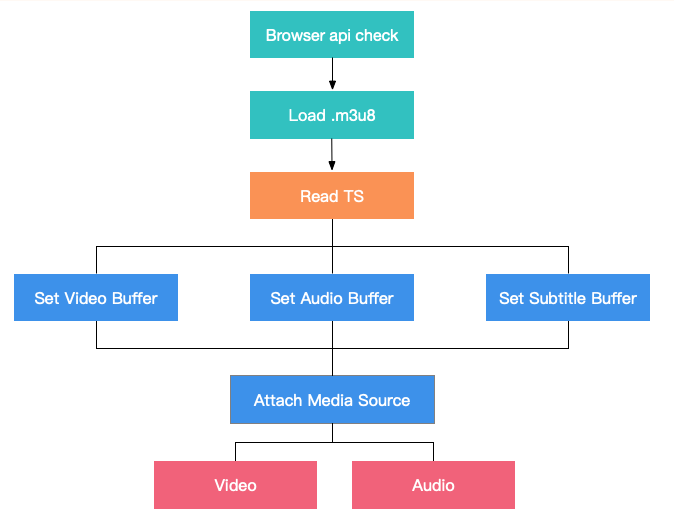

1, 容器格式、编码格式、流媒体协议、渲染容器、多实例播放

多协议：

1. http-flv 流媒体协议

flv.js 通过纯 js 实现 flv 转封装、使 flv 格式文件能在 web 上进行播放

2. http live stream 协议

hls 会先请求 m3u8 文件，然后读取到文件的分片列表，以及视频的编码格式、时长等。然后会按照顺序去对 ts 分片进行请求，然后借助 mse 讲二进制 buffer 内容进行合流，组成一个可播放的媒体资源文件。

