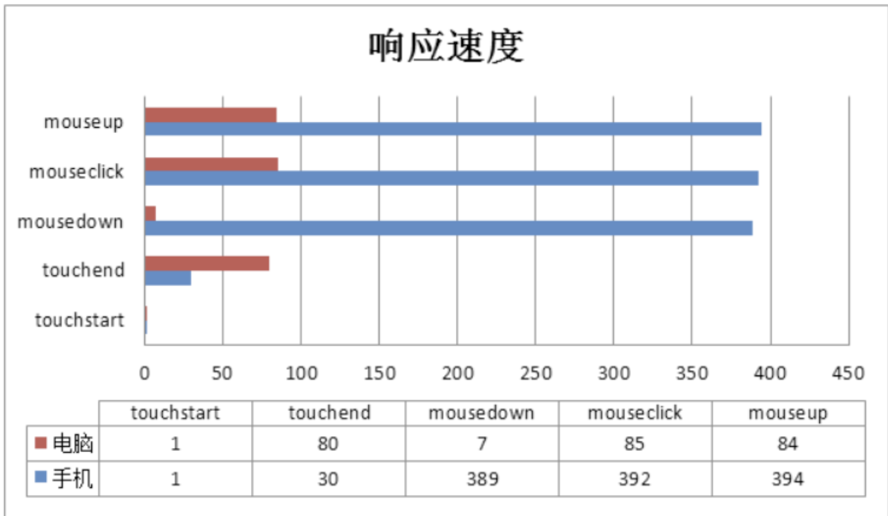

pc 端： PC 网页上的大部分操作都是用鼠标的，即响应的是鼠标事件，包括 mousedown、mouseup、mousemove 和 click 事件。一次点击行为，可被拆解成：mousedown -> click -> mouseup 三步。
移动端没有鼠标，所以就用触摸事件来代替，包括 touchstart、touchmove、touchend。手机端并没有 tap 事件。手机触发触摸事件的过程中为：touchstart -> touchmove -> touchend。

手机上没有鼠标，但不代表手机不能响应 mouse 事件（其实是借助 touch 去触发 mouse 事件）。说明手机对 touch 事件相应速度快于 mouse 事件

tap 是怎么来的
我们做 pc 页面时绑定 click，相对应的移动端页面就绑定 tap。

手机上响应 click 事件会有 300ms 的延迟，那么这 300ms 的延迟是怎么来的呢？ 浏览器在 touchend 后会等待 300ms，原因是判断用户是否有双击（double tap），如果有的话，就不触发 click 事件，如果没有的话，就触发 click 事件。

这里再介绍下鼠标的各个事件：

DOM3 级事件中定义了 9 个鼠标事件，简介如下。
click：在用户单击主鼠标按钮（一般是左边的按钮）或者按下回车键时触发。这一点对确保易访问性很重要，意味着 onclick 事件处理程序既可以通过键盘也可以通过鼠标执行。

dblclick：在用户双击主鼠标按钮（一般是左边的按钮）时触发。从技术上说，这个事件并不是 DOM2 级事件规范中规定的，但鉴于它得到了广泛支持，所以 DOM3 级事件将其纳入了标准。

mousedown：在用户按下了任意鼠标按钮时触发。不能通过键盘触发这个事件。

mouseenter：在鼠标光标从元素外部首次移动到元素范围之内时触发。这个事件不冒泡，而且在光标移动到后代元素上不会触发。DOM2 级事件并没有定义这个事件，但 DOM3 级事件将它纳入了规范。IE、Firefox 9+和 Opera 支持这个事件。

mouseleave：在位于元素上方的鼠标光标移动到元素范围之外时触发。这个事件不冒泡，而且在光标移动到后代元素上不会触发。DOM2 级事件并没有定义这个事件，但 DOM3 级事件将它 纳入了规范。IE、Firefox 9+和 Opera 支持这个事件。

mousemove：当鼠标指针在元素内部移动时重复地触发。不能通过键盘触发这个事件。

mouseout：在鼠标指针位于一个元素上方，然后用户将其移入另一个元素时触发。又移入的另一个元素可能位于前一个元素的外部，也可能是这个元素的子元素。不能通过键盘触发这个事件。

mouseover：在鼠标指针位于一个元素外部，然后用户将其首次移入另一个元素边界之内时触 发。不能通过键盘触发这个事件。

mouseup：在用户释放鼠标按钮时触发。不能通过键盘触发这个事件。 页面上的所有元素都支持鼠标事件。除了 mouseenter 和 mouseleave，所有鼠标事件都会冒泡， 也可以被取消，而取消鼠标事件将会影响浏览器的默认行为。取消鼠标事件的默认行为还会影响其他事 件，因为鼠标事件与其他事件是密不可分的关系。
