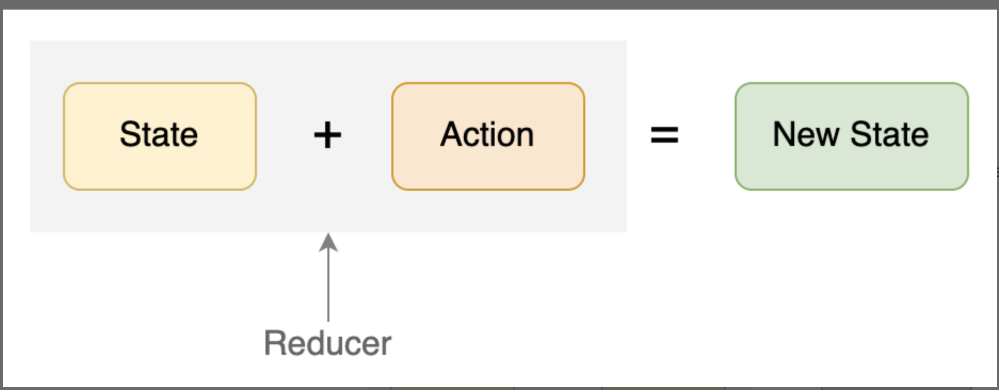

1. 如何正确理解函数组件的生命周期
   从 Model 到 View 的映射。假设状态永远不变，那么实际上函数组件就相当于是一个模板引擎，只执行一次。但是 React 本身正是为动态的状态变化而设计的，而可能引起状态变化的原因基本只有两个：
   -. 用户操作产生的事件，比如点击了某个按钮。
   -. 副作用产生的事件，比如发起某个请求正确返回了。

这两种事件本身并不会导致组件的重新渲染，但我们在这两种事件处理函数中，一定是因为改变了某个状态，这个状态可能是 State 或者 Context，从而导致了 UI 的重新渲染。

构造函数和函数式组件

这时候我们不妨思考下构造函数的本质，其实就是：在所以其它代码执行之前的一次性初始化工作。在函数组件中，因为没有生命周期的机制，那么转换一下思路，其实我们要实现的是：一次性的代码执行。

虽然没有直接的机制可以做到这一点，但是利用 useRef 这个 Hook，我们可以实现一个 useSingleton 这样的一次性执行某段代码的自定义 Hook，代码如下：

```JS

import { useRef } from 'react';

// 创建一个自定义 Hook 用于执行一次性代码
function useSingleton(callback) {
  // 用一个 called ref 标记 callback 是否执行过
  const called = useRef(false);
  // 如果已经执行过，则直接返回
  if (called.current) return;
  // 第一次调用时直接执行
  callBack();
  // 设置标记为已执行过
  called.current = true;
}
```

```JS
import useSingleton from './useSingleton';

const MyComp = () => {
  // 使用自定义 Hook
  useSingleton(() => {
    console.log('这段代码只执行一次');
  });

  return (
    <div>My Component</div>
  );
};
```

复杂状态处理：保持状态的一致性

1. 原则一：“保证状态最小化

这个状态是必须的吗？是否能通过计算得到呢？

2. 原则二：避免中间状态，确保唯一数据源

函数组件设计模式：复杂场景下的两种渲染模式：

一. 容器模式
把条件判断的结果放到两个组件中，确保真正 render UI 的组件收到的所有属性都是有值的。

```JS
// 定义一个容器组件用于封装真正的 UserInfoModal
export default function UserInfoModalWrapper({
  visible,
  ...rest, // 使用 rest 获取除了 visible 之外的属性
}) {
  // 如果对话框不显示，则不 render 任何内容
  if (!visible) return null;
  // 否则真正执行对话框的组件逻辑
  return <UserInfoModal visible {...rest} />;
}

```

受控与非受控组件

受控组件：组件的展示完全由传入的属性决定。比如说，如果一个输入框中的值完全由传入的 value 属性决定，而不是由用户输入决定，那么就是受控组件，写法是：< input value={value} onChange={handleChange} />。这也是为什么只给 < input/> 传了一个 value 值但是没有传 onChange 事件，那么键盘怎么输入都没有反应。

非受控组件：表单组件可以有自己的内部状态，而且它的展示值是不受控的。比如 input 在非受控状态下的写法是：< input onChange={handleChange}/>。也就是说，父组件不会把 value 直接传递给 input 组件。

```js
import React, { useState, useCallback } from "react";

function PriceInput({
  // 定义默认的 value 的数据结构
  value = { amount: 0, currency: "rmb" },
  // 默认不处理 onChange 事件
  onChange = () => {},
}) {
  // 定义一个事件处理函数统一处理 amount 或者 currency 变化的场景
  const handleChange = useCallback(
    (deltaValue) => {
      // 直接修改外部的 value 值，而不是定义内部 state
      onChange({
        ...value,
        ...deltaValue,
      });
    },
    [value, onChange]
  );
  return (
    <div className="exp-02-price-input">
      {/* 输入价格的数量 */}
      <input
        value={value.amount}
        onChange={(evt) => handleChange({ amount: evt.target.value })}
      />
      {/* 选择货币种类*/}
      <select
        value={value.currency}
        onChange={(evt) => handleChange({ currency: evt.target.value })}
      >
        <option value="rmb">RMB</option>
        <option value="dollar">Dollar</option>
      </select>
    </div>
  );
}
```

1.避免多余的状态：我们不需要在 PriceInput 这个自定义组件内部，去定义状态用于保存的 amount 或者 currency.

2.找到准确的唯一数据源：这里内部两个基础组件的值，其准确且唯一的来源就是 value 属性，而不是其它的任何中间状态.

2. 把判断条件放到 Hooks 中去

```JS

function useUser(id) {
  const [data, setData] = useState(null);
  const [loading, setLoading] = useState(false);
  const [error, setError] = useState(null);
  useEffect(() => {
    // 当 id 不存在，直接返回，不发送请求
    if (!id) return
    // 获取用户信息的逻辑
  });
}
```

二：使用 render props 模式重用 UI 逻辑

render props 就是把一个 render 函数作为属性传递给某个组件，由这个组件去执行这个函数从而 render 实际内容

抽象出业务逻辑， 已计数器为例子

```JS

import { useState, useCallback } from "react";

function CounterRenderProps({ children }) {
  const [count, setCount] = useState(0);
  const increment = useCallback(() => {
    setCount(count + 1);
  }, [count]);
  const decrement = useCallback(() => {
    setCount(count - 1);
  }, [count]);

  return children({ count, increment, decrement });
}
```

在要使用的地方，把 render 函数作为属性传递给 CounterRenderProps 组件

```JS

function CounterRenderPropsExample() {
  return (
    <CounterRenderProps>
      {({ count, increment, decrement }) => {
        return (
          <div>
            <button onClick={decrement}>-</button>
            <span>{count}</span>
            <button onClick={increment}>+</button>
          </div>
        );
      }}
    </CounterRenderProps>
  );
}
```

这里利用了 children 这个特殊属性，也就是组件开始 tag 和结束 tag 之间的内容，其实是会作为 children 属性传递给组件。
那么在使用的时候，是直接传递了一个函数过去，由实现计数逻辑的组件去调用这个函数，并把相关的三个参数 count，increase 和 decrease 传递给这个函数。

我们完全也可以使用其它的属性名字，而不是 children。我们只需要把这个 render 函数作为属性传递给组件就可以了，这也正是 render props 这个名字的由来。

还有一种方式是用 Hooks 实现

```JS

import { useState, useCallback }from 'react';

function useCounter() {
  // 定义 count 这个 state 用于保存当前数值
  const [count, setCount] = useState(0);
  // 实现加 1 的操作
  const increment = useCallback(() => setCount(count + 1), [count]);
  // 实现减 1 的操作
  const decrement = useCallback(() => setCount(count - 1), [count]);

  // 将业务逻辑的操作 export 出去供调用者使用
  return { count, increment, decrement };
}
```

问题 1：函数体也是每次 render 都会执行，那么，需要每次都会 render 执行的语句是放在 无依赖的 useEffect 中呢，还是直接放在函数体中比较好呢？

讲解：这两种情况的语义是不一样的。useEffect 代表副作用，是在函数 render 完后执行。而函数体中的代码，是直接影响当次 render 的结果。所以在写代码的时候，我们一定要理解每个 API 的语义，副作用一定是和当前 render 的结果没关系的，而只是 render 完之后做的一些额外的事情。

在 useCounter 这个例子中，我们是固定让数字每次加一。假如要做一个改进，允许灵活配置点击加号时应该加几，比如说每次加 10，那么应该如何实现？

```JS
function useCounter(n) {
  // 定义 count 这个 state 用于保存当前数值
  const [count, setCount] = useState(0);
  // 实现加 n 的操作
  const increment = useCallback(() => setCount(count + n), [count]);
  // 实现减 n 的操作
  const decrement = useCallback(() => setCount(count - n), [count]);
  // 重置计数器
  const reset = useCallback(() => setCount(0), []);

  // 将业务逻辑的操作 export 出去供调用者使用
  return { count, increment, decrement, reset };
}
```

只考虑 Redux 部分，对于计数器应用，目前每次是固定加减 1，如果要能够在每次调用时增加或减少指定的变量值，应该如何实现？讲解：这和上一讲的思考题几乎一样，只是这里考察的是，有没有注意到 Redux 的 action 就是一个普通的 object，我们可以在其中加入任何需要的参数，只要 reducer 能处理就可以了。

```JS

const incrementAction = {
  type: 'counter/incremented',
  n: 5, // 实现每次加5
};

function counterReducer(state = initialState, action) {
  switch (action.type) {
    case 'counter/incremented':
      // 从 action 中去拿每次加几
      return { value: state.value + action.n }
    default:
      return state
  }
```

在全局状态管理中：如何在函数组件中使用 redux
所以从这张对比图，我们可以看到 Redux Store 的两个特点：

1. Redux Store 是全局唯一的。即整个应用程序一般只有一个 Store。
2. Redux Store 是树状结构，可以更天然地映射到组件树的结构，虽然不是必须的。

我们通过把状态放在组件之外，就可以让 React 组件成为更加纯粹的表现层，那么很多对于业务数据和状态数据的管理，就都可以在组件之外去完成（后面课程会介绍的 Reducer 和 Action）。同时这也天然提供了状态共享的能力，有两个场景可以典型地体现出这一点。

- 跨组件的状态共享：当某个组件发起一个请求时，将某个 Loading 的数据状态设为 True，另一个全局状态组件则显示 Loading 的状态。

- 同组件多个实例的状态共享：某个页面组件初次加载时，会发送请求拿回了一个数据，切换到另外一个页面后又返回。这时数据已经存在，无需重新加载。设想如果是本地的组件 state，那么组件销毁后重新创建，state 也会被重置，就还需要重新获取数据。

Redux 引入的概念其实并不多，主要就是三个：State、Action 和 Reducer。其中 State 即 Store，一般就是一个纯 JavaScript Object。Action 也是一个 Object，用于描述发生的动作。而 Reducer 则是一个函数，接收 Action 和 State 并作为参数，通过计算得到新的 Store。



实现自己的 API client

一些通用的 Header。比如 Authorization Token。

服务器地址的配置。前端在开发和运行时可能会连接不同的服务器，比如本地服务器或者测试服务器，此时这个 API Client 内部可以根据当前环境判断该连接哪个 URL。

请求未认证的处理。比如如果 Token 过期了，需要有一个统一的地方进行处理，这时就会弹出对话框提示用户重新登录。

```JS

import axios from "axios";

// 定义相关的 endpoint
const endPoints = {
  test: "https://60b2643d62ab150017ae21de.mockapi.io/",
  prod: "https://prod.myapi.io/",
  staging: "https://staging.myapi.io/"
};

// 创建 axios 的实例
const instance = axios.create({
  // 实际项目中根据当前环境设置 baseURL
  baseURL: endPoints.test,
  timeout: 30000,
  // 为所有请求设置通用的 header
  headers: { Authorization: "Bear mytoken" }
});

// 听过 axios 定义拦截器预处理所有请求
instance.interceptors.response.use(
  (res) => {
    // 可以假如请求成功的逻辑，比如 log
    return res;
  },
  (err) => {
    if (err.response.status === 403) {
      // 统一处理未授权请求，跳转到登录界面
      document.location = '/login';
    }
    return Promise.reject(err);
  }
);

export default instance;
```

将业务逻辑的操作 换了个地方，也就是写到了 hook 里面

```JS

import { useState, useEffect } from "react";
import apiClient from "./apiClient";

// 将获取文章的 API 封装成一个远程资源 Hook
const useArticle = (id) => {
  // 设置三个状态分别存储 data, error, loading
  const [data, setData] = useState(null);
  const [loading, setLoading] = useState(false);
  const [error, setError] = useState(null);
  useEffect(() => {
    // 重新获取数据时重置三个状态
    setLoading(true);
    setData(null);
    setError(null);
    apiClient
      .get(`/posts/${id}`)
      .then((res) => {
        // 请求成功时设置返回数据到状态
        setLoading(false);
        setData(res.data);
      })
      .catch((err) => {
        // 请求失败时设置错误状态
        setLoading(false);
        setError(err);
      });
  }, [id]); // 当 id 变化时重新获取数据

  // 将三个状态作为 Hook 的返回值
  return {
    loading,
    error,
    data
  };
};
```

但是我们知道，React 函数组件是一个同步的函数，没有办法直接使用 await 这样的同步方法，而是要把请求通过副作用去触发。因此如果按照上面这种传统的思维，是很难把逻辑理顺的。

然后，我们需要充分利用 Hooks 能让数据源变得可绑定的能力，让一个远程 API 对应的数据成为一个语义化的数据源，既可以把业务逻辑和 UI 展现很好地分开，也有利于测试和维护。最后呢，我们学习了针对多请求的处理，怎么利用状态的组合变化来实现并发和串行请求。

11 ｜事件处理：如何创建自定义事件？

删除一个功能，就像删除一个文件夹那么简单。

在这里，我跟你介绍一种架构，这是我参与的项目基本上都会采用的，那就是扩展点机制：在任何可能产生单点复杂度的模块中，通过扩展点的方式，允许其它模块为其增加功能。

首先我们来看下受控组件应该如何使用。下面的例子展示了受控组件的用法：

```JS

function MyForm() {
  const [value, setValue] = useState('');
  const handleChange = useCallback(evt => {
    setValue(evt.target.value);
  }, []);
  return <input value={value} onChange={handleChange} />;
}
```

可以看到，输入框的值是由传入的 value 属性决定的。在 onChange 的事件处理函数中，我们设置了 value 这个状态的值，这样输入框就显示了用户的输入。

需要注意的是，React 统一了表单组件的 onChange 事件，这样的话，用户不管输入什么字符，都会触发 onChange 事件。而标准的 input 的 onchange 事件，则只有当输入框失去焦点时才会触发。

React 的这种 onChange 的机制，其实让我们对表单组件有了更灵活的控制。不过，受控组件的这种方式虽然统一了表单元素的处理，有时候却会产生性能问题。因为用户每输入一个字符，React 的状态都会发生变化，那么整个组件就会重新渲染。所以如果表单比较复杂，那么每次都重新渲染，就可能会引起输入的卡顿。在这个时候，我们就可以将一些表单元素使用非受控组件去实现，从而避免性能问题。

所谓非受控组件，就是表单元素的值不是由父组件决定的，而是完全内部的状态。联系第 8 讲提到的唯一数据源的原则，一般我们就不会再用额外的 state 去保存某个组件的值。而是在需要使用的时候，直接从这个组件获取值。

非受控组件

```JS

import { useRef } from "react";

export default function MyForm() {
  // 定义一个 ref 用于保存 input 节点的引用
  const inputRef = useRef();
  const handleSubmit = (evt) => {
    evt.preventDefault();
    // 使用的时候直接从 input 节点获取值
    alert("Name: " + inputRef.current.value);
  };
  return (
    <form onSubmit={handleSubmit}>
      <label>
        Name:
        <input type="text" ref={inputRef} />
      </label>
      <input type="submit" value="Submit" />
    </form>
  );
}
```

# 14 对话框

对话框在本质上，其实是独立于其他界面的一个窗口，用于完成一个独立的功能。

```JS
// 通过 create API 创建一个对话框，主要为了能够全局的控制对话框的展现
const UserInfoModal = NiceModal.create(
  'user-info-modal',
  RealUserInfoModal
);

// 创建一个 useNiceModal 这样的 Hook，用于获取某个 id 的对话框的操作对象
const modal = useNiceModal('user-info-modal');
// 通过 modal.show 显示一个对话框，并能够给它传递参数
modal.show(args);
// 通过 modal.hide 关闭对话框
modal.hide();
```

我们需要将 show 和 resolve 两个函数通过 Promise 联系起来。因为两个函数的调用位置不一样，所以我们使用了一个局部的临时变量，来存放 resolve 回调函数。

使用 react-loader，实现组件的异步加载上面的例子你已经看到了如何去实现一个 React 组件的动态加载，它的总体思路其实主要就是三个部分：

定义一个加载器组件，在使用的地方依赖于这个加载器组件而不是原组件；
在加载器组件的执行过程中，使用 import 去动态加载真实的实现代码；
处理加载过程，和加载出错的场景，确保用户体验。

```JS
import Loadable from "react-loadable";

// 创建一个显示加载状态的组件
function Loading({ error }) {
  return error ? 'Failed' : 'Loading';
}
// 创建加载器组件
const HelloLazyLoad = Loadable({
  loader: () => import("./RealHelloLazyLoad"),
  loading: Loading,
});
```

在代码中，我们可以看到 Loadable 这个高阶组件主要就是两个 API。

loader：用于传入一个加载器回调，在组件渲染到页面时被执行。在这个回调函数中，我们只需要直接使用 import 语句去加载需要的模块就可以了。

loading：表示用于显示加载状态的组件。在模块加载完成之前，加载器就会渲染这个组件。如果模块加载失败，那么 react-loadable 会将 errors 属性传递给 Loading 组件，方便你根据错误状态来显示不同的信息给用户。
