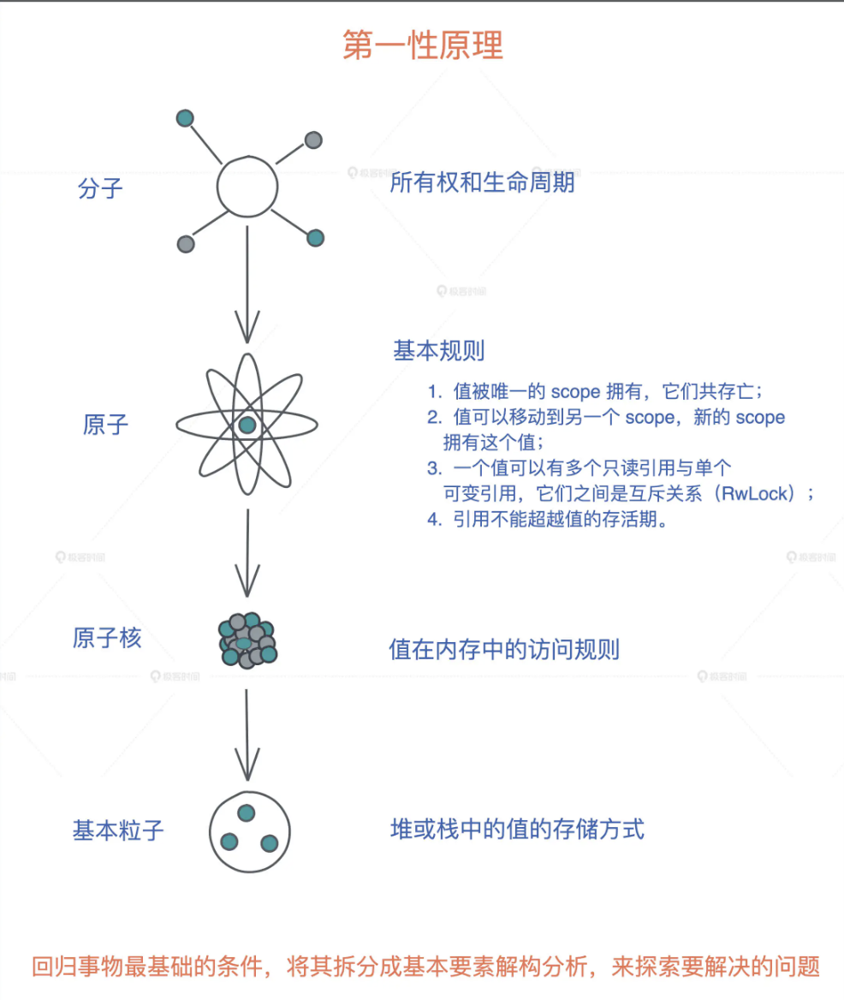
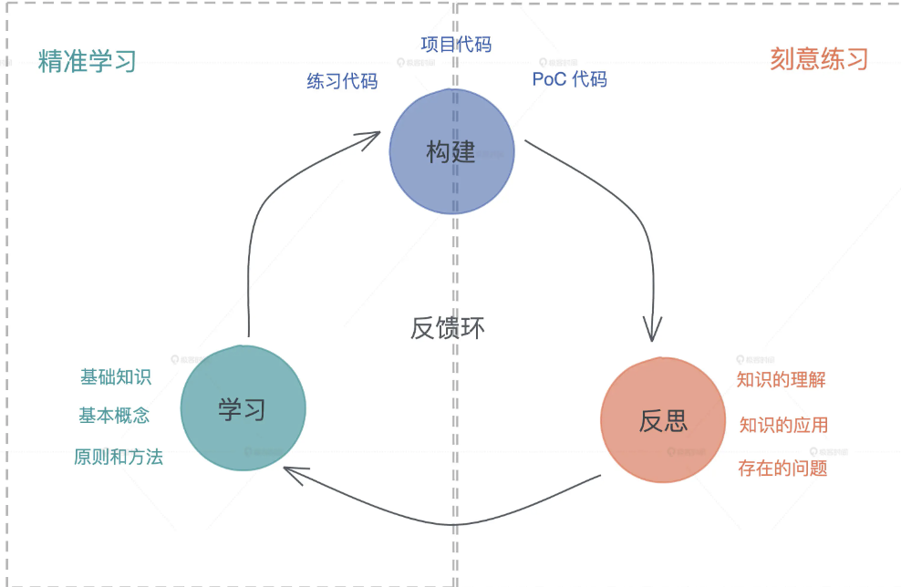

async 关键字，会把一个函数块或者代码块转换为一个 Future，这个 Future 代表的是这个代码块想要运行的数据的步骤。

当我们想运行一个 Future 的时候，需要使用关键字 await，这个关键字会使得编译器在代码处用一个 loop{}来运行该 Future。

Future 对象里面有 poll 方法，这个 poll 方法负责查看 Future 的状态机是否为 Ready，如果不是 Ready，则 Pending；如果是 Ready 的话，就返回结果。如果为 Pending 的话，\_task_context 会通过 yield，把该 Future 的线程交出去，让别的 Future 继续在这个线程上运行。

因为 Future 的底层对象是由 Generator 构成的，所以调用 poll 方法的时候，其实调用的是 genrator 的 resume 方法，这个方法会把 Generator 的状态机（Yielded、Completed）返回给 poll。如果为 Yielded，poll 返回 Pending；否则 Completed 返回 Ready，当返回 Ready 的时候，loop 就被跳出，这个 Future 不会被再次执行了。

其实在学习新知识的过程中，谁也不能一次性把知识点吃透，都是在不断重复之前的知识，然后加上自己的思考，在这个过程中不断汲取，内化为自己的知识。这样通过多次的打怪升级，最后我们也一定会有自己独到的见解。

所以如果你想从其他语言迁移到 Rust，必须要经过一段时期的思维转换（Paradigm Shift）。

从命令式（imperative）编程语言转换到函数式（functional）编程语言、从变量的可变性（mutable）迁移到不可变性（immutable）、从弱类型语言迁移到强类型语言，以及从手工或者自动内存管理到通过生命周期来管理内存，难度是多重叠加。

而 Rust 中最大的思维转换就是变量的所有权和生命周期，这是几乎所有编程语言都未曾涉及的领域。

从语言的内核来看，它重塑了我们对一些基本概念的理解。比如 Rust 清晰地定义了变量在一个作用域下的生命周期，让开发者在摒弃垃圾回收（GC）这样的内存和性能杀手的前提下，还能够无需关心手动内存管理，让内存安全和高性能二者兼得。

如何学好 Rust？

任何语言的学习离不开精准学习 + 刻意练习。

所谓精准学习，就是深挖一个个高大上的表层知识点，回归底层基础知识的本原，再使用类比、联想等方法，打通涉及的基础知识；然后从底层设计往表层实现，一层层构建知识体系，这样“撒一层土，夯实，再撒一层”，让你对知识点理解得更透彻、掌握得牢固。

但我们进一步思考“值在内存中的访问规则”，最后回归到堆和栈这些最基础的软件开发的概念，重新认识堆栈上的值的存储方式和生命周期之后，再一层层往上，我们就会越学越明白。

这就是回归本原的重要性，也就是常说的第一性原理：回归事物最基础的条件，将其拆分成基本要素解构分析，来探索要解决的问题。

这个过程就像子思在《中庸》里谈治学的方法：博学之，审问之，慎思之，明辨之，笃行之。我们学习就要这样，学了没有学会绝不罢休，不断在学习 - 构建 - 反思这个循环中提升自己。Rust 的学习，也是如此。

