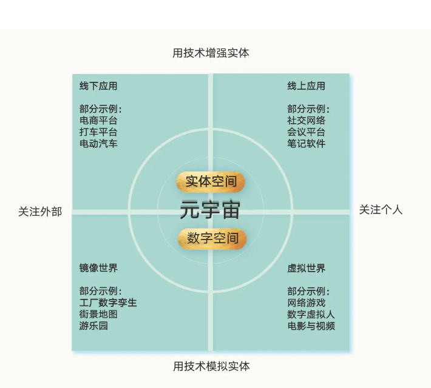

## Serverless 入门课

Serverless 是对运维体系的极端抽象，就像 iPhone 当年颠覆诺基亚一样，它给应用开发和部署提供了一个极简模型。

基础篇，我会继续带你理解 Serverless 要解决什么问题，以及 Serverless 的边界和定义。搞清楚了来龙去脉，我们会进入动手环节，我会通过一个例子来给你讲解 Serverless 引擎盖下的工作原理，以及 FaaS 的一些应用场景。

进阶篇，我们将一起学习 FaaS 的后端解决方案 BaaS，以及我们自己现有的后端应用如何 BaaS 化。为了更好地展现 Serverless 的发展历程和背后的思考，我也为你准备了一个基于 Node.js 的待办任务的 Web 应用，你要做好准备，这里我会给你布置很多动手作业。

实战篇，我会通过 Google 开源的 Kubernetes 向你演示本地化 Serverless 环境如何搭建，并根据我的经验，和你聊聊 Serverless 架构应该如何选型，以及目前 Serverless 开发的最佳实践。

前端 FaaS + 后端 Baas

##

###

###

###

###

###

由人机交互转为人人交互
第一个是用计算机模拟反馈的问题。

第二个是计算机图形能力问题。

第三个问题是，并非所有问题机器都能处理

## 08 | 数字财产确权：用区块链建立数字所有权管理系统

价值互联网：发生在协议层的变革

应用层的、价值流动的网络。

中本聪的技术方案有三个点：

第一，它是“去中心化网络 + 分布式账本”的结构。

第二，它用“区块 + 链”来存储账本。

第三，它用工作量证明共识机制与最长链原则来达成共识。

要讲清楚这个问题，我们可以逐一讨论分布式网络、共识机制、公钥密码学、虚拟机、智能合约等等一项项技术

用技术的语言说就是：我们要实现一个“去中心化”或者说“无中心”的网络，让每个人都运行自己的服务器，让大家各自保存自己的数据库。也就是，每个人都自己记账。

多个数据库带来的数据的一致性和变更的一致性就是个大问题。
第一，除了直接把原来的服务器、数据库复制 N 份，让大家各自运行之外，有没有更好的数据结构呢？

第二，这些分布在各处的服务器如何就数据的变更达成一致呢？如果这些服务器分布式在全球互联网上，各个节点存在通信延迟，数据的一致性和变更的一致性就是个大问题。

第三，由于这个网络是公开的、允许任何人加入成为计算节点。那么，一旦网络中坏人加入的节点超过一定比例，我们就会遇到所谓的“拜占庭将军问题”，直白地说就是这个网络无法形成可信的结果。

**区块链的的整个数据结构就是用这样的方式来组织的。一个状态就是一个数据区块，新的数据区块跟在上一个数据区块之后。每个新区块里都有一个指向上一个区块的哈希指针。新区块必须由所有人按所谓共识机制同意。这就形成了一个包含所有状态的链式结构，这也是“区块链”（区块 + 链，Block+Chain）这个名字的由来。**

这个设计的一大好处是防篡改，如果上一个区块的数据被人偷偷改写了，它的哈希值就会发生变化，与后一个区块中保存的哈希值就对不上了。

在技术上，区块链选择的是非对称加密密码学方法，每个人用“私钥和公钥”的组合来持有财产所有权。你拥有私钥就拥有了财产的掌控权，而密码学在技术上确保了没有你的私钥就没法伪造你的签名。

更具体地说，以主流区块链为例，如果想要创建一个账户，我们可以随机选择一个 2 的 256 次方的数字作为私钥。这是一个极大的数字，它接近于可见宇宙中的原子数量。因此，只要生成过程是绝对随机的，你生成的私钥就不会跟其他人重合。

有了私钥之后，我们可以用密码学中的椭圆曲线乘法计算出公钥，再按照规则转为适用于相应区块链的地址格式。我们可以由私钥可以推导出公钥，由公钥可以推导出地址。但要注意的是，反过来倒推都是不行的。地址和公钥略有不同，接下来，我们把用户的账户称为“私钥 + 地址”的组合。

我们把用户的账户称为“私钥 + 地址”的组合。

区块链每次的变更状态时，都会在链条后新增一个区块。

区块链解决这个问题有三种选择。

第一种选择最简单粗暴，我们可以规定，只有经过某个核心团体认可的“好人”才能加入，这就在一开始就把坏人排除在外了。后续状态的变更也是这样，统一由这个核心团队来确定。沿着这个思路发展下去就出现了现在的各类联盟链，它的特征是有准入机制，把坏人在一开始就排除在外。但如果还是想实现完全开放接入的目标，也就是建立无须许可的（Permissionless）分布式网络呢？根据分布式计算中的“FLP 不可能结果”，这样的分布式网络只靠技术是无解的。

区块链技术系统的做法是，引入了经济奖励与惩罚，它的共识机制算法是由技术 + 经济来完成的。具体做法又可以分成两种，也就是区块链解决这个问题的第二、第三种选择：POW（工作量证明）共识算法和 POS（权益证明）共识算法。

两种算法的思路是一致的：用户必须有一定的经济投入，以此获得网络参与权，如果成功记账，将可以获得经济奖励；如果失误或作恶，其投入会被罚没。经济上的惩罚与奖励，和技术结合在一起，确保了分布式网络中的众多节点能够就数据变更达成共识，确保分布式网络的安全性

## 09 | 数字交易协议：在数字空间“复制”社会经济活动

智能合约平台: 它真正指的是程序，是区块链上运行的独特的服务端程序。

以太坊中的新组件包括三个部分。

第一是运行代码的计算环境，还有和运行环境对应的数据存储机制，这些被统称为以太坊虚拟机。

第二是可以运行在以太坊上的特定程序，也就是智能合约程序。我们把智能合约代码编译、部署到链上后，它就成为了合约账户。与我们熟悉的服务端程序不同，智能合约在部署后，其代码不可修改。此外，合约也不会自动运行，相当于处于待机状态，只能被外部触发运行。

第三是高级编程语言、开发工具和更便于使用的以太坊钱包。

通证（Token），就是数字空间中财产所有权的凭证。

通证主要分为两种：可互换通证与不可互换通证。

对应地，也就出现了两种通证标准，它们在以太坊生态内分别是第 20 号和第 721 号改进提案，因此常被称为 ERC20 标准和 ERC721 标准。由于 2021 年 NFT 头像、艺术及国内数字藏品的爆火，不可互换通证的缩写——NFT（non-fungible token）——现在也广为人知。

区块链上的通证可以表示很多东西。除了金钱之外，它可以用来表示商场的积分，可以表示我们累积的航空里程，可以用来表示员工期权。任何有价值的事物的所有权，都可以用通证来表示。

我们再从软件编程的角度来看一下。要让各种程序都能方便地处理不同的可互换通证，这些通证最好遵循一致的标准，也就是，它们应该提供同样的编程接口供其他程序调用。

2015 年底，ERC20 标准被提了出来，现在，它已经成为了区块链业界的事实标准。虽然它的名字实际意思是“以太坊改进提案第 20 号”

在数字空间，可互换的财物也是少数，不可互换的财物同样普遍。2018 年初，有人提出要建立所谓不可互换通证的标准，这就是 ERC721 提案，它建议把这一类财物所有权凭证的编程接口也标准化。现在我们看到的绝大部分 NFT 头像、艺术品、游戏道具都遵循 ERC721 标准。

有了这两种通证标准之后，区块链从单一的财产所有权管理系统，演变成了全功能的财产所有权管理系统。我们也可以说，各种各样的价值都可以在用区块链技术构建起来的价值网络中流转了。

第一阶段，用“区块 + 链”的数据结构、用“去中心网络 + 分布式账本”的方式形成了财产所有权管理系统的技术雏形。这一阶段实现了所有权管理系统最核心的“账户、余额、交易”三要素。

第二阶段，为区块链账本增加了代码运行环境，放在以太坊生态内来说就是，增加了“以太坊虚拟机”，为编程与应用开发提供了可能性。

第三阶段，行业形成了一些标准程序接口，主要是 ERC20 可互换通证标准和 ERC721 不可互换通证标准等。到这里，在区块链技术支撑的价值互联网中，我们可以方便地表示各种类型的价值，并进行价值的流转了。

交易协议：将人类经济活动全面映射到数字空间

**有了这些技术准备之后，我们可以尝试着将一些人类经济活动映射到数字空间了。这带来了区块链技术发展的第四阶段，也就是交易协议阶段。**

协议（Protocol）是区块链领域的专业术语，指的是由一组智能合约组成、运行在区块链上、由用户与之交互的功能组合。

平台是由某个公司运行与掌控的，其权益属于一家公司，而协议是众人一致同意、共同遵守的规则，而其权益属于所有参与者。

，就同一个事物我们提及了三个名词——共有网络、经济社群、去中心化自治组织（DAO）。它们其实是在讨论一个事物的不同方面：共有网络关注的是技术上的网络，经济社群说的是人与人的社群，DAO 关注的是组织管理方式。

元宇宙四大应用象限强调用横向和纵向两个维度来分析未来的元宇宙应用。在横轴上，一端关注“个体”，另一端关注“外部”；在纵轴上，一端是“用技术增强实体”，另一端是“用技术模拟实体”。这两条轴线相互交叉，将未来的元宇宙应用分成了四个象限，它们分别是：线上应用、线下应用、镜像世界、虚拟世界。

这就带来了我对于元宇宙的第二个反思：仅仅强调所有权是不够的，所有权是基础，但更为重要的是人人参与的氛围，还有支撑它的机制。

这就带来了我对元宇宙的第三个反思：不要等待技术的成熟，不要被问题所阻碍，我们其实应该继续像互联网的发展之路那样迭代式前进。
