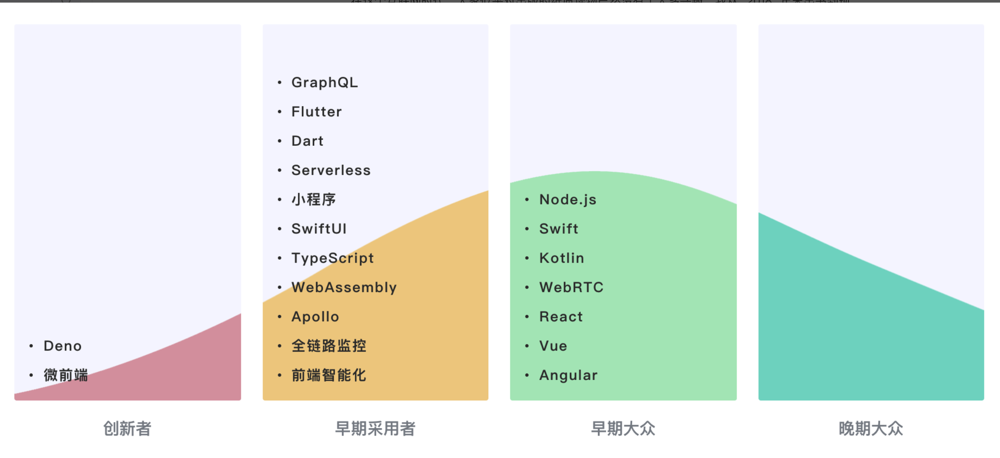
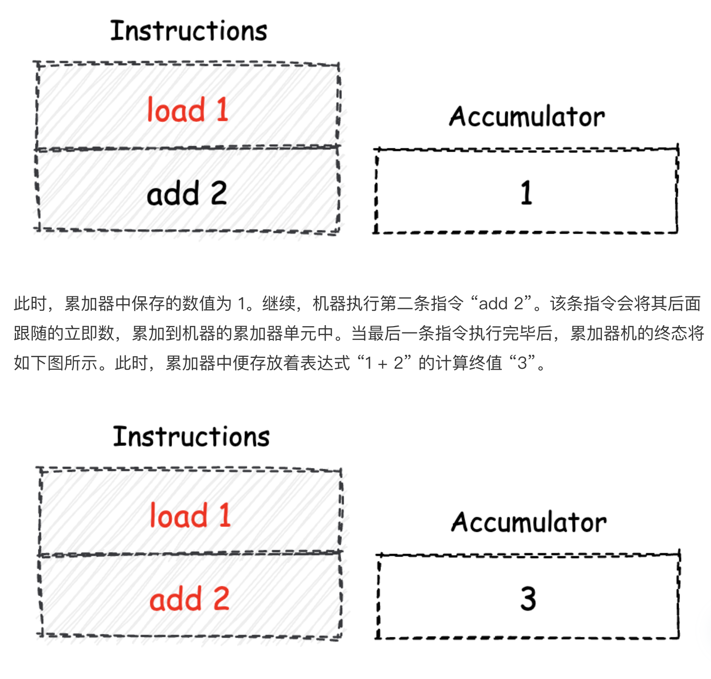

开篇词 | 我们为什么要了解 WebAssembly？

“WebAssembly 是基于栈式虚拟机的虚拟二进制指令集（V-ISA），它被设计为高级编程语言的可移植编译目标”。



Wasm 的出现更能够让我们直接在 Web 平台上，使用那些业界已存在许久的众多优秀的 C/C++ 代码库。


webAssembly 是一种能在浏览器运行的低级程序语言，可以将 c++或者 rust 编译成 webAssembly ，webAssembly 可以与 js 互相调用.

Wasm 不限于 C/C++ 哈，也可以尝试使用 Rust 或者基于 TypeScript 语法的 AssemblyScript。

01 | 基础篇：学习此课程你需要了解哪些基础知识？

TypedArray

顾名思义，TypedArray 便是指“带有类型的数组”，我们一般简称其为“类型数组”。我们都知道，在默认情况下，出现在 JavaScript 代码中的所有数字值，都是以“双精度浮点”的格式进行存储的。

一个普通 JavaScript 数组，对于数组内部的每一个元素，我们都可以重新将其赋值为双精度浮点类型所能表示值范围内的，任意一个值。

而 TypedArray 则不同于传统的 JavaScript 数组。TypedArray 为内部的元素指定了具体的数据类型，比如 Int8 表示的 8 位有符号整型数值、Float32 表示的 32 位单精度浮点数值，以及 Uint32 表示的 32 位无符号整型数值等等。

TypedArray 实际上构建于底层的“二进制数据缓冲区”，在 JavaScript 中可以由 ArrayBuffer 对象来生成。ArrayBuffer 描述了一个字节数组，用于表示通用的、固定长度的原始二进制数据缓冲区。

由于 ArrayBuffer 中的数据是以“字节”为单位进行表示的，因此我们无法直接通过 ArrayBuffer 对象来操作其内部的数据，而是要通过 TypedArray 以某个固定的“类型视图”，按照某个具体的“数据单位量度”来操作其内部数据。

```js
const DEFAULT_INDEX = 0;
// Way one:
const int8Arr = new Int8Array(10);
int8Arr[DEFAULT_INDEX] = 16;
console.log(int8Arr); // Int8Array [16, 0, 0, 0, 0, 0, 0, 0, 0, 0].

// Way two:
const int32Arr = new Int32Array(new ArrayBuffer(16));
int32Arr.set([1, 2, 3], 0);
console.log(int32Arr); // Int32Array [1, 2, 3, 0].
```

这里我列出了两种 TypedArray 的使用方式。第一种，我们可以直接通过相应类型的 TypedArray 构造函数来构造一个类型数组。比如这里我们使用的 Int8Array，其构造函数的参数为该数组可以容纳的元素个数。然后，我们修改了数组中第一个元素的值，并将整个数组的内容“打印”了出来。

第二种使用方式其实与第一种十分类似，唯一的不同是我们选用了另一种 TypedArray 的构造函数类型。该构造函数接受一个 ArrayBuffer 对象作为其参数，生成的 TypedArray 数组将会以该 ArrayBuffer 对象作为其底层的二进制数据缓冲区。

由于 ArrayBuffer 的构造函数其参数指定了该 ArrayBuffer 所能够存放的单字节数量，因此在“转换到”对应的 TypedArray 时，一定要确保 ArrayBuffer 的大小是 TypedArray 元素类型所对应字节大小的整数倍。

在方法二中，我们使用了 TypedArray.prototype.set 方法将一个普通 JavaScript 数组中的元素，存放到了刚刚生成的，名为 int32Arr 的类型数组中。

```c
#include <iostream>
extern "C" {
  int add(int x, int y) {
    return x + y;
  }
}
int main(int argc, char** argv) {
  int x = add(0, 1);
  std::cout << x;
  return 0;
}
```

C++ 编译器会强制以 C 语言的语法规则，来编译放置在这个作用域内的所有 C++ 源代码。而在 C 语言的规范中，没有“函数重载”这类特性，因此也不会对函数名进行 “Name Mangling” 的处理

02 | 历史篇：为什么会有 WebAssembly 这样一门技术？

Wasm 的前身 —— ASM.js

ASM.js 的设计目标也是为了能够在 JavaScript 语言之外，为“构建更高性能的 Web 应用”这个目标，提供另外一种实现的可能。

第一，ASM.js 是 JavaScript 的严格子集。这也就意味着，对于一段 ASM.js 代码，JavaScript 引擎可以将它视作普通的 JavaScript 代码来执行，这便保障了 ASM.js 在旧版本浏览器上的可移植性。

第二，ASM.js 使用了 “Annotation（注解）” 的方式来标记代码中包括：函数参数、局部 / 全局变量，以及函数返回值在内的各类值的实际类型。

```js
function asm(stdin, foreign, heap) {
  "use asm";

  function add(x, y) {
    x = x | 0; // 变量 x 存储了 int 类型值；
    y = y | 0; // 变量 y 存储了 int 类型值；
    var addend = 1.0,
      sum = 0.0; // 变量 addend 和 sum 默认存放了"双精度浮点"类型值；
    sum = sum + x + y;
    return +sum; // 函数返回值为"双精度浮点"类型；
  }
  return { add: add };
}
```

在上述 asm 模块内定义的内联函数 add 中，我们在其开头的前两行代码通过 “x|0” 和 “y|0” 的方式，分别对变量 x 与 y 的值类型进行了标记。而这种方式便是我们之前提到的 ASM.js 所使用的 Annotation。

当 JavaScript 引擎在编译这段 ASM.js 代码时，便会将这里的变量 x 与 y 的类型视为 int 整型。同样的，还有我们对函数返回值的处理 “+sum”。通过这样的 Annotation，引擎会将变量 sum 的值视为双精度浮点类型。类似的，ASM.js 在标准中还规定了其他的诸多 Annotation 形式，可以将变量值标记为不同的类型，甚至对值类型进行转换。

并不是说只要为函数添加了 “use asm” 指令，并且为使用到的变量添加 Annotation 之后，JavaScript 引擎就会通过 AOT 的方式来优化代码的执行

从过去到未来

这个 Prototype 和对应的字节码格式，便是如今 Wasm 所分别对应的 WAT 可读文本格式与二进制字节码格式。这两部分暂时被称为 ml-proto 与 v8-native-prototype。

AssemblyScript

03 | WebAssembly 是一门新的编程语言吗？

“WebAssembly（缩写为 Wasm）是一种基于堆栈式虚拟机的二进制指令集。

堆栈机模型

堆栈机，全称为“堆栈结构机器”，即英文的 “Stack Machine”。堆栈机本身是一种常见的计算模型。

基于堆栈机模型实现的计算机，无论是虚拟机还是实体计算机，都会使用“栈”这种结构来实现数据的存储和交换过程。栈是一种“后进先出（LIFO）”的数据结构，即最后被放入栈容器中的数据可以被最先取出。

寄存器机与累加器机

顾名思义，基于这种计算模型的机器，将使用特定的 CPU 寄存器组，来作为指令执行过程中数据的存储和交换容器。

在寄存器机中，由于每一条参与到数据交换和处理的指令，都需要显式地标记操作数所在的寄存器（比如通过别名的方式），因此相较于堆栈机和累加器机，寄存器机模型下的指令相对更长。但相对地，数据的交换过程也变得更加灵活。

累加器机

由于累加器的存储容量有限，因此对于一些需要进行暂存的中间数据，通常都只能够被存放到机器的线性内存中。又由于访问线性内存的速度，一般远远低于访问寄存器的速度，因此从某种程度上来讲，累加器机的指令整体执行效率会相对较低。



三种计算模型的比较

- 堆栈机使用栈结构作为数据的存储与交换容器，由于其“后进先出”的特性，使得我们无法直接对位于栈底的数据进行操作。因此在某些情况下，机器会使用额外的指令来进行栈数据的交换过程，从而损失了一定的执行效率。但另一方面，堆栈机模型最为简单且易于实现，对应生成的指令代码长短大小适中。

- 累加器机由于其内部只有一个累加器寄存器可用于暂存数据，因此在指令的执行过程中，可能会频繁请求机器的线性内存，从而导致一定的性能损耗。但另一方面，由于累加器模型下的指令最多只能有一个操作数，因此对应的指令较为精简。

- 寄存器机内大多数与数据操作相关的指令，都需要在执行时指定目标寄存器，这无疑增加了指令的长度。过于灵活的数据操作，也意味着寄存器的分配和使用规则变得复杂。但相对的，众多的数据暂存容器，给予了寄存器机更大的优化空间。因此，通常对于同样的一段计算逻辑，基于寄存器机模型，可以生成更为高效的指令执行结构。

ISA 与 V-ISA

i386、X86-64 等实际存在的物理系统架构上的指令集，我们一般称之为 ISA（Instruction Set Architecture，指令集架构）。而对另外一种使用在虚拟架构体系中的指令集，我们通常称之为 V-ISA，也就是 Virtual（虚拟）的 ISA

对这些 V-ISA 的设计，大多都是基于堆栈机模型进行的。而 Wasm 就是这样的一种 V-ISA。

Wasm 之所以会选择堆栈机模型来进行指令的设计，其主要原因是由于堆栈机本身的设计与实现较为简单。快速的原型实现可以为 Wasm 的未来发展预先试错。

另一个重要原因是，借助于堆栈机模型的栈容器特征，可以使得 Wasm 模块的指令代码验证过程变得更加简单。

简单的实现易于 Wasm 引擎与浏览器的集成。基于堆栈机的结构化控制流，通过对 Wasm 指令进行 SSA（Static Single Assignment Form，静态单赋值形式）变换，可以保证即使是在堆栈机模型下，Wasm 代码也能够有着较好的执行性能。而堆栈机模型本身长短适中的指令长度，确保了 Wasm 二进制模块能够在相同体积下，拥有着更高密度的指令代码。

Wasm 虚拟指令集

Wasm 是一种基于堆栈机模型设计的 V-ISA 指令集

```wasm
i32.const 1
i32.const 2
i32.add
```

i32.const 1 | 1
i32.const 1 | 1，1
i32.eq | 1
i32.const 10 | 1，10
i32.const 10 | 1，10，10
i32.add | 1，20
i32.mul | 20

04 | WebAssembly 模块的基本组成结构到底有多简单？
