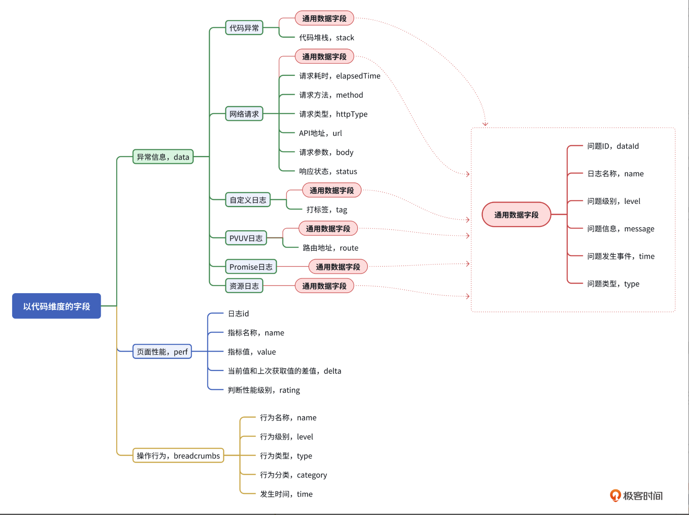

## 全链路

前端全链路也是通过一定的机制记录前端交互的过程。在前端领域里面，“链路”代表的是页面与页面之间的访问关系，前端与后端的调用关系，用户在页面的交互过程等一系列的动作。“全”是指完整的、可溯源的、可记录的用户路径。

前端全链路是指从用户在前端页面发起操作开始，经过前端应用的各个组件和逻辑，最终与后端服务器进行数据通讯并完成用户期望功能的整个过程。

[image.png](./image.png)

前端全链路的核心是监控与优化。

但也正是在这个时候，动态语言开始发展。此时 Web 页面的全链路问题排查、调试和优化，基本上都以解决浏览器页面兼容问题、处理脚本错误、结合动态语言调试等页面优化为主。

兼容、数据、交互、性能。这 4 种类型基本上形成了前端全链路最核心的问题维度。

用户视角的全链路：各个操作

--- 各个操作，包括交互，例如点击、手势、发起请求，接收请求、键盘输入等。

工程师视角的全链路： 用户失败、性能、执行报错等

--- 从用户发起请求，到用户完成所有产品功能的全路径，包括浏览器请求、服务器运行、浏览器返回、浏览器渲染、页面性能、脚本执行过程（包括失败、脚本错误）

03 ｜全链路流程：前端全链路的关键路径有哪些？

前端处理问题的四个维度，分别是数据维度、交互维度、性能维度、兼容维度。

前端全链路的实现方案中有三个关键要素：数据指标、监控、决策。这三个要素之间相辅相成，形成了一套完整的前端解决方案。


数据指标和监控的关系，更像是前后端互相配合的关系。

在前端技术领域，数据指标非常广泛，但不外乎 3 个维度：交互、性能、数据。7 种类型数据：PVUV 指标、基础指标、性能指标、行为动作指标、脚本异常日志、接口状态日志、资源状态日志。其中，基础数据是一套前端通用数据，用来记录其关联的数据，例如 UserAgent、URL、UserId 等等。

至于监控的核心职责就是发现问题并通知决策者，同时还能让我们通过日志库快速定位问题。

这个要素中，存在 3 个主要路径：日志分析、设置阈值监控、通知。如果问题跟产品功能相关，那么最佳的决策者就是产品。假如是性能问题，那么前端同学就是最合适的决策角色。


04 ｜ 数据结构：如何设计全链路数据模型

如何定义链路日志数据结构？

基础数据指标是全链路日志的通用数据，也是其他 6 种指标数据类型必备的字段

基础数据类型中一共有 17 个属性字段，又细分为 5 种类别：基本日志信息、浏览器信息、页面信息、用户信息、业务信息。


- 基础日志信息

1. 基础日志数据。顾名思义，这是链路日志的必要数据，包含了唯一键值、时间、类型以及最后更新时间。

首先，我们定义四个必要的字段，并将类型的名称命名为 BaseTrace。

```ts
// ./typing.d.ts

// 全链路日志基类
type BaseTrace = {
  // 唯一ID，用户侧生成
  traceId: string;
  // 日志类型
  type: TraceTypes;
  // 日志产生时间
  createdAt: string;
  // 日志最后更新时间
  updatedAt: string;
};
```

其中类型

```ts
// ./typing.d.ts

enum TraceTypes {
  // PVUV
  PAGE_VIEW = "PageView",
  // Event
  EVENT = "EVENT",
  // 性能
  PERF = "Perf",
  // 资源
  RESOURCE = "Resource",
  // 动作、行为类型
  ACTION = "Action",
  // 请求类型
  FETCH = "Fetch",
  // 代码错误
  CODE_ERROR = "CodeError",
  // 日志
  CONSOLE = "Console",
  // 其它
  CUSTOMER = "Customer",
}
```

其中，最核心的类型是 EVENT、PERF、ACTION、FETCH 和 CODE_ERROR，分别对应的是事件、性能、行为、接口和代码异常五大类。Action 类型在这里主要是记录用户的交互行为，作为我们分析用户行为的参考。

- 浏览器信息

分别是浏览器的 UserAgent 以及预定义的 BrowserType 枚举类型。

```ts
// ./typing.d.ts

enum BrowserType {
  // 手机端浏览器
  MOBILE = "mobile",
  // PC浏览器
  PC = "pc",
  // webview
  WEBVIEW = "webview",
  // 小程序
  MINI_PROGRAM = "miniProgram",
}

// 浏览器相关字段基类
type BaseBrowserTrace = {
  // 当前浏览器的UserAgent
  ua: string;
  // 浏览器类型
  bt: BrowserType;
};
```

- 页面信息

页面类型记录的是用户访问当前页面的一些基本信息，例如页面 URL、标题等。

页面类型属性的其中一个功能是帮助我们快速判断哪些页面出现了严重 BUG。同时，在监控中通过 URL 筛选，也可以判断是通用性问题还是个例问题。

```ts
// ./typing.d.ts

// 页面相关字段基类
type BasePageTrace = {
  // 页面ID
  pid: string;
  // 页面标题
  title?: string;
  // 当前页面URL
  url: string;
};
```

- 用户信息

用户信息记录的是用户的一些基本信息，例如用户 ID、用户名、用户类型等。

```ts
// 用户相关字段基类
type BaseUserTrace = {
  // 指纹ID，fingerprintId
  fpId: string;
  // 用户ID
  uid?: string | number;
  // 用户名称
  userName?: string;
  // 用户邮箱
  email?: string;
};
```

- 业务信息

业务信息记录的是用户在页面中的一些业务信息，例如页面 ID、页面标题等。

```ts
enum TraceLevelType {
  // 告警级别
  error = "error",
  // 预警级别
  warn = "warn",
  // 普通日志
  info = "info",
  // 调试日志
  debug = "debug",
}

enum TraceClientTypes {
  // 安卓
  ANDROID_H5 = "android",
  // iOS
  IOS_H5 = "ios",
  // PC端
  PC_H5 = "pc",
  // 浏览器
  BROWSER_H5 = "browser",
}

// 业务相关字段基类
type BaseAppTrace = {
  // 业务ID
  appId: string;
  // 业务名称
  appName?: string;
  // 客户端类型
  clientType: TraceClientTypes;
  // 日志级别
  level: TraceLevelType;
};
```

一条链路日志，不应该被过度设计

```ts
type BaseTraceInfo = BaseTrace &
  BaseBrowserTrace &
  BaseUserTrace &
  BaseAppTrace &
  BasePageTrace;
```

下面是上报的完整类型

```ts
const exampleBaseData: BaseTraceInfo = {
  traceId: "0bdf6c8e-25c8-427d-847a-9950318a2e14",
  level: TraceLevelType.warn,
  type: TraceTypes.ACTION,
  ua: "Mozilla/5.0 (Macintosh; Intel Mac OS X 10_15_7) AppleWebKit/537.36 (KHTML, like Gecko) Chrome/124.0.0.0 Safari/537.36",
  bt: BrowserType.MOBILE,
  fpId: "c77a37f4",
  uid: 1002,
  // 例如：极客邦App的命名
  appId: "kn-app",
  clientType: TraceClientTypes.iOS_H5,
  pid: "088c8a92-5a24-4144-9c37-310848c397e1",
  url: "https://time.kn.org/",
  createdAt: "",
  updatedAt: "",
};
```

## 全链路指标



代码维度把日志分成了异常信息、性能数据、操作行为三套数据模型

```ts
// 完整的全链路日志
type TraceData = BaseTraceInfo & {
  // 记录错误信息
  data?: TraceTypeData;
  // 记录操作行为
  breadcrumbs?: TraceBreadcrumbs;
  // 记录性能信息
  perf?: TracePerf[];
};
```

异常信息类型

代码异常。不仅包括脚本失败，还应该包含 trycatch 中的 catch 异常。

Promise 异常。这主要是由异步代码引起的逻辑问题。

网络请求。通常来说，发起 http 请求都无法保证 100% 的成功率。

资源异常信息。和网络请求同理，但这里的重点在于监控图片和一些外部资源的请求状态。

PV/UV 日志。用于记录用户访问的次数和频率，它也是唯一的非异常日志。

自定义日志。目的是在一些特殊场景下记录日志，以便快速定位问题。

通用数据字段

```ts
// 通用数据字段
type TraceBaseData = {
  // id
  dataId: number;
  // 日志信息名称
  name: string;
  // 问题级别
  level: TraceDataSeverity;
  // 异常信息
  message: string;
  // 发生时间
  time: number;
  // 问题类型
  type: TraceDataTypes;
};
```

dataId。这个字段不是指唯一键值，而是对异常信息进行哈希后得出的字符串。如果有大量相同字符串，那就说明存在通用异常问题。name。这是为异常日志提供的一个名称字段。message。这个字段的核心作用是记录异常信息的详情或者描述。time。顾名思义，就是时间。指事件触发的时刻。

网络请求类型

```ts
// 请求类信息
type TraceDataFetch = TraceBaseData & {
  // 执行时间，用于统计耗时
  elapsedTime: number;
  // 请求方法
  method: "POST" | "GET";
  // 请求类型
  httpType: "fetch" | "xhr";
  // 请求地址
  url: string;
  // 请求参数
  body: string;
  // 响应状态
  status: number;
};
```

其余类型字段（Promise、资源、自定义、PV/UV）剩余的其它数据类型，包括 Promise 类型、资源类型以及自定义日志类型。由于公共字段已经满足全链路概念的能力，所以，基于最少字段原则，对于 Promise 和 Resource，我不会再扩展过多的字段。至于自定义日志类型，我会增加一个 tag 字段作为对上层业务内容的补充，既可以当成标签使用，也可以当作一段需要标记的字符串。还有 PV/UV 统计类日志，也只补充一个用于 SPA 的静态路由字段，记录用户当前所在的页面。

```ts
// Promise类型
type TraceDataPromise = TraceBaseData;

// 资源类型
type TraceDataResource = TraceBaseData;

// 普通日志
type TraceDataLog = TraceBaseData & {
  tag: string;
};

// PV/UV
type TraceDataPageView = TraceBaseData & {
  route: string;
};
```

操作行为类型

```ts
// 基类行为日志类型
type TraceBaseAction = {
  // 动作名称
  name: string;
  // 动作参数
  level: TraceDataSeverity;
  // 动作时间
  time: string;
  // 日志类型
  type: BreadcrumbTypes;
  // 行为分类
  category: BreadcrumbsCategorys;
};

// 行为日志
type TraceAction = TraceBaseAction & {
  // 行为动作相关的信息，可以是DOM，可以是错误信息，可以是自定义信息
  message?: string;
  // 请求参数
  request?: any;
  // 请求结果内容
  response?: any;
  // 错误堆栈信息
  stack?: string;
};
```

完整的链路日志

```ts
// 一份错误信息的类型集合
type TraceTypeData =
  | TraceDataFetch
  | TractDataCodeError
  | TraceDataPromise
  | TraceDataResource
  | TraceDataLog
  | TraceDataPageView;

// 操作行为日志
type TraceBreadcrumbs = TraceAction[];

// 完整的全链路日志
type TraceData = BaseTraceInfo & {
  // 记录错误信息
  data?: TraceTypeData;
  // 记录操作行为
  breadcrumbs?: TraceBreadcrumbs;
  // 记录性能信息
  perf?: TracePerf[];
};
```

demo

```ts
// trace data json
{
  "traceId": "0bdf6c8e-25c8-427d-847a-9950318a2e14",
  "level": "warn",
  "type": "Action",
  "ua": "Mozilla/5.0 (Macintosh; Intel Mac OS X 10_15_7) AppleWebKit/537.36 (KHTML, like Gecko) Chrome/124.0.0.0 Safari/537.36",
  "bt": "mobile",
  "fpId": "c77a37f4",
  "uid": 1002,
  "appId": "geekbang-h5",
  "clientType": "browser",
  "pid": "088c8a92-5a24-4144-9c37-310848c397e1",
  "url": "https://time.geekbang.org/",
  "createdAt": "2024-03-13T15:35:30.292Z",
  "updatedAt": "2024-03-13T15:35:30.292Z",
  "data": {
    "dataId": 2384780,
    "name": "fetch-api",
    "level": "info",
    "message": "success",
    "time": 1710345961943,
    "type": "HTTP",
    "elapsedTime": 166.34,
    "method": "POST",
    "httpType": "fetch",
    "url": "https://time.geekbang.org/serv/v3/product/infos",
    "body": "{\"ids\":[100035801,100002401,100024001,100007001,100003901,100029601,100027801,100034101,100042501,100023701]}",
    "status": 0
  },
  "breadcrumbs": [
    {
      "name": "fetch-api",
      "level": "info",
      "time": "string",
      "type": "Fetch",
      "category": "hhtp"
    }
  ]
}

```


# 06 ｜ 指纹 id：关联起全链路日志

所以，我们只要收集这些具有较高辨析度的信息，并进行一定的计算处理，就能生成一个能唯一标识当前浏览器的值，也就是我们所说的指纹 ID。

但在这里，我们的目的是追踪前端应用的用户行为，是为了帮助用户提升体验，快速解决问题。一定要记住，我们的出发点并不是获取用户的隐私。

指纹生成方案的选择

1. fingerprintjs

2. 使用 cryptojs 生成指纹 ID

3. 使用 canvas 生成指纹 ID

轻量级的这个方案就是帆布指纹识别技术。它是一种利用帆布纹理特征进行身份验证的方法。具体实现的思路，就是利用 HTML5 的画布的 Canvas 特性，通过 Canvas 生成的图片，然后转换成哈希码，从而形成用户指纹。

```js
const canvas = document.createElement("canvas");
const ctx = canvas.getContext("2d");
const txt = "kn-editor";
ctx.textBaseline = "top";
ctx.font = "14px 'Arial'";

ctx.fillStyle = "#f60";
// 先画一个60x20矩形内容
ctx.fillRect(125, 1, 60, 20);
// 把字填充到矩形内
ctx.fillStyle = "#069";
ctx.fillText(txt, 2, 15);
```

然后，我们采用社区提供的转换方案，将填充的矩形和文字的画布转换成 Base64 字符串。接下来，我们使用 atob 函数对 Base64 字符串进行编码，最后截取一部分字符，将其转换成十六进制字符串。

```js
const b64 = canvas.toDataURL().replace("data:image/png;base64,", "");
const bin = atob(b64);
const crc = bin2hex(bin.slice(-16, -12));
```

定义了以下四个指纹参数类型。

```js
type FingerprintOptions = {
  font?: string
  reactStyle?: string | CanvasGradient | CanvasPattern
  contentStyle?: string | CanvasGradient | CanvasPattern
  textBaseline?: CanvasTextBaseline;
};
```

# 网页指标


## 目前，网页指标分为两部分，一部分是核心网页指标，一部分是其它网页指标。

核心网页指标，是围绕用户体验的三个方面去衡量，包括加载响应速度（LCP）、互动交互（FID）以及视觉稳定性（CLS）。

其它网页指标，包括首次内容绘制（FCP）、互动延迟（INP）、可交互时间（TTI）、总阻塞时间（TBT）、首字节时间（TTFB）等等。

1. 网页加载速度指标（LCP）

这个指标实际上是记录页面首屏可见区域中最大元素的呈现时间。而最大元素可能是一张图片，可能是一个视频，也可能是一段文本内容块。具体记录哪一种元素，与页面首屏所呈现的内容有关。

2. 网页可交互指标（FID）

第二个核心网页指标就是 FID，全称为 First Input Delay，其含义就是从用户首次和 Web 应用互动到浏览器实际开始处理事件或者处理脚本，响应用户互动的这段时间。

如果说，LCP 是衡量感受 Web 应用加载速度的第一印象的话，那么 FID 就是衡量你和 Web 应用互动的第一印象。

一个侧重加载，一个侧重互动，也即响应能力。

特别是移动端 Web 应用，由于用户环境复杂，我们经常会遇到，当在手机上加载一个 Web 页面时，看到页面内容那一刻（此时可能页面还没完全渲染完成），就会很自觉地快速找到我们想要的操作位置（例如表单、按钮等），并尝试和页面进行互动（例如弹出键盘并输入、点击播放按钮等），但此时，页面仍然没有任何反应。

3. 网页视觉稳定性指标（CLS）

第三个核心指标就是视觉稳定性指标（CLS），英文全称 Cumulative Layout Shift。这个指标更多的是判断用户的视觉上的体验，也就是在浏览器可视区内现有元素发生位置的改变，触发布局偏移，是否影响用户的使用体验。

4. 首次内容绘制（FCP）

首次内容绘制也是一个非常重要的指标。我认为如果三大核心网页指标作为排名前三重要的话，那排在第四位的就是 FCP。

从这样的概念理解，FCP 的时间必定小于 LCP，在 FCP 和 LCP 之间的时间差里，就是浏览器持续性地渲染加载页面内容，又或者在执行脚本的过程。

5. 可交互时间（TTI）

可交互时间（TTI），顾名思义，就是衡量从网页开始加载到其主要子资源加载完成的时间。从定义上看，这个时间比 FCP 更靠前。

6. 总阻塞时间（TBT）

首次内容绘制 FCP 之后还存在如 LCP 等其它指标。在基于 FCP 时间之后，页面会发生很多不同场景的事件，比如渲染内容、请求接口、主线程脚本执行等。而在这个时间范围内，可以定义一个用于衡量事件或任务的总阻塞时间，我们称为 TBT，它能帮助我们快速判断在这个时间范围内，哪些事件耗时较长、哪些接口请求时间长等等。

7. 首字节时间（TTFB）

首字节时间 TTFB，就是资源请求与响应的第一个字节开始到达之间的时间。TTFB 就是衡量 Performance.startTime 和 Performance.responseStart 之间的间隔时间。

虽然 TTFB 并不是核心网页指标，但它是衡量 Web 应用可用性的 最重要的参考指标。它能帮助我们分析和评估在到达用户设备之前的网络状况。

## 09 ｜ 接口指标： 监听接口状态，收集页面接口异常数据

监听请求目的是什么？

1. 监控前端发起请求的稳定性

2. 关注用户的网络情况

3. 现在许多接口功能具备登录鉴权和用户画像等特性，几乎每个用户都有其独特的数据或者分组，所以我们还需要判断接口返回的信息是否合理。

```ts
export const getFetchStatusLevel = (status: number): TraceDataSeverity => {
  if (status >= 500) {
    return TraceDataSeverity.Critical;
  } else if (status >= 400) {
    return TraceDataSeverity.Error;
  } else if (status >= 300) {
    return TraceDataSeverity.Warning;
  } else if (status >= 200) {
    return TraceDataSeverity.Info;
  } else {
    return TraceDataSeverity.Else;
  }
};
```

请求中断

```ts
try {
  res = await fetch(url, options);
} catch (err) {
  if (err.name == "AbortError") {
    // 发现被中止请求后，处理的逻辑
  } else {
    throw err;
  }
}
```

请求超时

```ts
const controller = new AbortController()
const { signal } = controller

const handleTimeout = (delay = 6000) => {
  return new Promise(_, reject) => {
    setTimeout(() => {
      // 触发中止
      controller.abort()
      reject(new Error("TimeoutAbortError"));
    }, delay);
  });
};

// 处理请求超时
Promise.race([
  handleTimeout(),
  fetch(url, {
    signal
  })
]).catch(err => {
    if (err.name === 'TimeoutAbortError') {
      // 请求超时
    }
})
```

由于我们需要在不耦合代码的前提下自动捕获 HTTP 状态码，所以，基于现有代码，结合前端全链路的数据指标设计方案，我们将增加三个逻辑。首先，由于我们只关心非正常状态，所以我们在拦截器里只关注非 2xx 的状态码。其次，我们将在 interceptFetch 函数中新增 onerror 函数参数，以便在请求异常时为外层提供自定义逻辑参数。最后，在拦截器内增加请求耗时，同时以 elapsedTime 参数传入 onerror 函数。具体的代码实现逻辑，参考如下。

```ts
import { getTimestamp } from "./util";
const { fetch: originFetch } = window;

export type OnFetchError = {
  url: string;
  status: number;
  statusText: string;
  method: "POST" | "GET";
  body: any;
  elapsedTime: number;
};

export type InterceptFetchType = {
  onError: (error: OnFetchError) => void;
};

// 拦截fetch
const interceptFetch = ({ onError }: InterceptFetchType) => {
  return async (...args: any) => {
    const [url, options] = args;
    const startTime = getTimestamp();
    let res;
    try {
      res = await originFetch(url, options);
    } catch (err) {}
    if (!(res.ok && res.status >= 200 && res.status < 300)) {
      onError({
        url,
        status: res.status,
        statusText: res.statusText,
        method: options.method,
        body: options.body,
        elapsedTime: getTimestamp() - startTime,
      });
    }

    return res;
  };
};

export default interceptFetch;
```

10 ｜资源和脚本异常指标：监听资源和脚本状态，收集异常数据
