# 图解 Google V8

## 开篇词 | 如何学习谷歌高性能 JavaScript 引擎 V8？

什么是 V8？

V8 是 JavaScript 虚拟机的一种。我们可以简单地把 JavaScript 虚拟机理解成是一个翻译程序，讲人类能够理解的编程语言 JavaScript，翻译成机器能够理解的机器语言。

在 v8 出现之前，所有的 JavaScript 虚拟机所采用的都是解释执行的方法，这是 JavaScript 执行速度过慢的一个主要原因。而 V8 率先引入了即时编译（JIT）的双轮驱动的设计，这是一种权衡策略，混合编译执行和解释执行这两种手段，给 JavaScript 的执行速度带来了极大的提升。

## 如何学习 V8

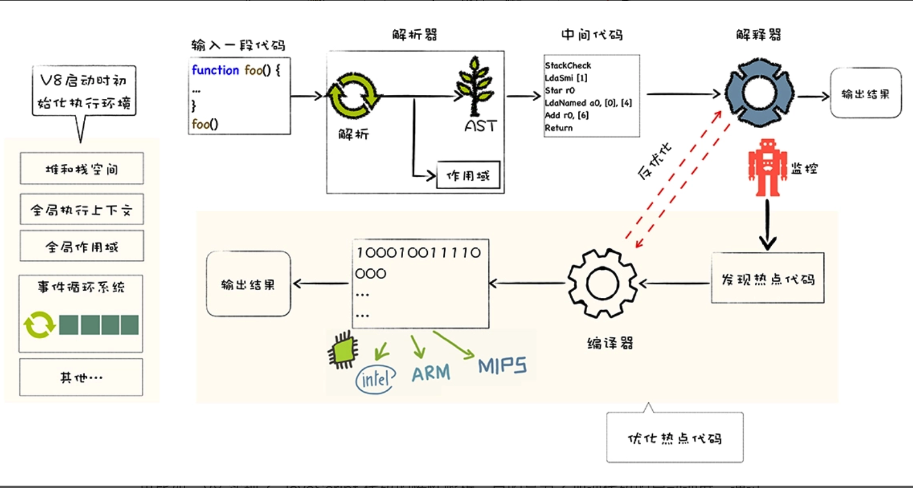

深入分析过 JavaScript 语言后，我们就可以学习 v8 执行 JavaScript 代码的完整流程了。

编译流水线本身并不复杂，但是其中涉及到了很多技术，诸如 JIT、延迟解析、隐藏类、内联缓存。

在比如 v8 中使用的隐藏类（hide class），这是将 JavaScript 中动态类型转为静态类型的一种技术，可以消除动态类型的语言执行速度过慢的问题。

在比如，v8 实现了 JavaScript 代码的惰性解析，目的是为了加速代码的启动速度，通过对惰性解析机制的学习，可以提高程序性能。

JavaScript 是一种自动垃圾回收的语言。V8 在执行垃圾回收时，会占用主线程的资源，如果我们编写的程序频繁触发垃圾回收，那么无疑会阻塞主线程，

v8 知识点

v8 会将 js 代码转为 字节码，然后有个解释器来执行字节码，如果有块字节码被反复执行，那么 v8 会将字节码转换为二进制机器代码，然后 cpu 直接执行二进制的机器代码。

01 | V8 是如何执行一段 JavaScript 代码的？

v8 的主要核心流程分为编译和执行两步。首先需要将 JavaScript 代码转为低级中间代码或者机器能够理解的机器代码，然后在执行转换后的代码并输出执行结果。

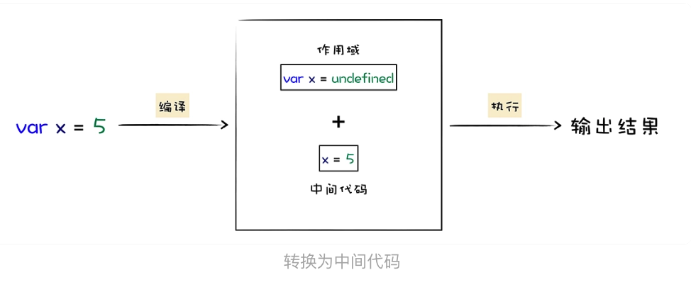

你可以把 V8 看成是一个虚构出来的计算机，也称为虚拟机，虚拟机通过模拟实际计算机的各种功能来实现代码的执行，如模拟实际计算机的 CPU、堆栈、寄存器等，虚拟机还具有它自己的一套指令系统。

高级代码为什么需要先编译在执行？

我们先从 cpu 是怎么执行机器代码讲起，可以把 cpu 看成是一个非常小的运算机器，我们可以通过二进制的指令和 cpu 沟通。

为了完成复杂的任务，工程师们为 cpu 提供了一大堆指令，来实现各种功能。我们把这一大堆指令称为指令集，也就是机器语言。

注意，CPU 只能识别二进制的指令，但是对程序员来说，二进制代码难以阅读和记忆，于是我们又将二进制指令集转换为人类可以识别和记忆的符号，这就是汇编指令集，你可以参考下面的代码：

```asm
1000100111011000  机器指令
mov ax,bx         汇编指令
```

那么你可能会问，CPU 能直接识别汇编语言吗？

答案是“不能”，所以如果你使用汇编编写了一段程序，你还需要一个汇编编译器，其作用是将汇编代码编程成机器代码，具体流程你可以参考下图：

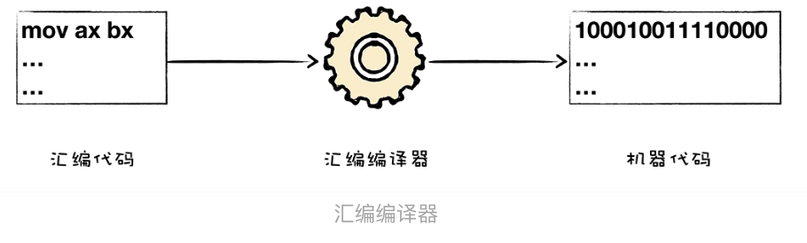

汇编语言比较繁琐的原因：

1. 不同的 CPU 有着不同的指令集
2. 在编写汇编代码时，我们还需要了解和处理器架构相关的硬件知识。

和汇编语言一样，处理器也不能直接识别高级语言所编写的代码。通常要有两种方式来执行这些代码。

第一种是解释执行，需要先将输入的源代码通过解析器编译成中间代码，之后直接使用解释器解释执行中间代码，然后直接输出结果。

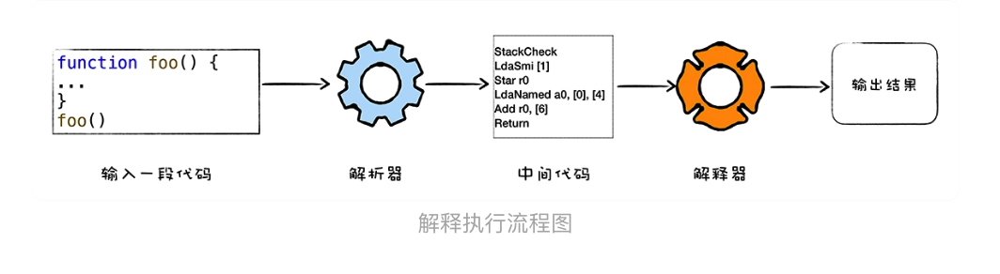

第二种是编译执行，采用这种方式，也需要将源代码转换为中间代码，然后我们的编译器再将中间代码编译成机器代码，通常编译成的机器代码是以二进制文件形式存储的，需要执行这段程序的时候直接执行二进制文件就可以了。还可以使用虚拟机将编译后的机器代码保存在内存中，然后直接执行内存中的二进制代码

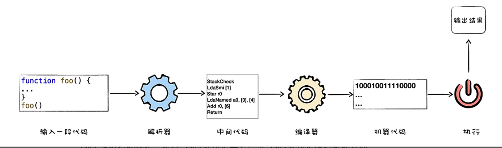

这就是高级语言的两种基本方式： 解释执行和编译执行。

要执行 c 语言编写的代码，你需要将其编译为二进制文件，然后直接执行二进制文件就可以了。
而对于像 Java 语言、JavaScript 语言等，则需要不同虚拟机，模拟计算机的这个编译执行流程。
执行 Java 语言，需要经过 Java 虚拟机的转换，执行 JavaScript 需要经过 JavaScript 虚拟机的转换。

V8 是怎么执行 JavaScript 代码的？

实际上 v8 并没有采用某种单一的技术，而是混合编译执行和解释执行这两种方式。我们把这种混合使用编译器和解释器的技术称为 JIT（Just In Time）编译技术。

在 v8 启动执行 JavaScript 之前，它还需要准备执行 JavaScript 时所需的一些基础环境，这些基础环境包括了“堆空间”和“栈空间”“全局执行上下文”“全局作用域”“消息循环系统”“内置函数”等，

- JavaScript 全局执行上下文就包含了执行过程中的全局信息，比如一些内置函数，全局变量等信息；

- 全局作用域包含了一些全局变量，在执行过程中的数据都需要存放在内存中；

- 而 V8 是采用了经典的堆和栈的内存管理模式，所以 V8 还需要初始化内存中的堆和栈结构；

- 另外，想要我们的 V8 系统活起来，还需要初始化消息循环系统，消息循环系统包含了消息驱动器和消息队列，它如同 V8 的心脏，不断接受消息并决策如何处理消息。

基础环境准备好之后，接下来就可以向 v8 提交要执行的 JavaScript 代码。

首先 V8 会接收到要执行的 JavaScript 源代码，不过这对 V8 来说只是一堆字符串，V8 并不能直接理解这段字符串的含义，它需要结构化这段字符串。结构化，是指信息经过分析后可分解成多个互相关联的组成部分，各组成部分间有明确的层次结构，方便使用和维护，并有一定的操作规范。

V8 源代码的结构化之后，就生成了抽象语法树 (AST)，我们称为 AST，AST 是便于 V8 理解的结构。

在生成 ast 的过程中，V8 会对源代码进行词法分析和语法分析，词法分析是将源代码分解成一个个 token，语法分析是将 token 组合成 AST。

在生成 ast 的同时，v8 还会生成相关的作用域，作用域中存放相关变量。

有了 AST 和作用域之后，接下来就可以生成字节码了，字节码是介于 AST 和机器代码的中间代码。但是与特定类型的机器代码无关，解释器可以直接解释执行字节码，或者通过编译器将其编译为二进制的机器代码再执行。

好了，生成了字节码之后，解释器就登场了，它会按照顺序解释执行字节码，并输出执行结果。

这其中有优化点，我们在解释器执行字节码的过程中，会记录一些热点代码，如果某个代码块被反复执行，那么这个代码块就是热点代码块，我们可以将其编译为二进制的机器代码，然后直接交给 CPU 执行，这样就可以提高代码的执行效率。（相信你注意到了，我们在解释器附近画了个监控机器人，这是一个监控解释器执行状态的模块，在解释执行字节码的过程中，如果发现了某一段代码会被重复多次执行，那么监控机器人就会将这段代码标记为热点代码。）

当某段代码被标记为热点代码后，v8 就会将这段字节码丢给优化编译器，优化编译器会在后台将字节码编译为二进制代码，然后在对编译后的二进制代码执行优化操作，优化后的二进制代码会被保存在代码缓存中，下次执行这段代码时，就可以直接使用优化后的二进制代码了。

需要注意的是： JavaScript 的对象结构和属性是可以在运行时任意修改的，而经过优化编译器优化过的代码只能针对某种固定的结构，一旦在执行过程中，对象的结构被动态修改了。那么优化之后的代码势必会变成无效的代码，这时候优化编译器就需要执行反优化操作，经过反优化的代码，下次执行时就会回退到解释器解释执行。

跟踪一段实际代码的执行流程

1. 首先代码解析器结构化成 AST.

2. 在生成 AST 的同时，生成作用域，作用域中存放相关变量。

3. 生成了 AST 和作用域之后，就可以使用解释器生成字节码了。

生成字节码后，解释器会执行这段字节码，如果重复执行了某段代码，监控器就会将其标记为热点代码，并提交给编译器优化执行。

总结：

- 初始化基础环境；
- 解析源码生成 AST 和作用域；
- 依据 AST 和作用域生成字节码；
- 解释执行字节码；
- 监听热点代码；
- 优化热点代码为二进制的机器代码；
- 反优化生成的二进制机器代码。

这里你需要注意的是，JavaScript 是一门动态语言，在运行过程中，某些被优化的结构可能会被 V8 动态修改了，这会导致之前被优化的代码失效，如果某块优化之后的代码失效了，那么编译器需要执行反优化操作。

## 答疑

全局执行上下文和全局作用域的关系

执行上下文是运行代码时的基础环境，包括了变量环境，词法环境，this 值，外部环境等内容。

全局执行上下文就是指全局代码执行时的运行环境。

而作用域是一个抽象概念，它主要引用了执行上下文中的变量，以方便查找。

如果全局执行上下文中有块级作用域：
let a=1
｛
let b =7
｝

比如执行上面这样的代码，当执行到大括号里面时，全局执行上下文只有一个，但是作用域却有两个

## 02 | 函数即对象：一篇文章彻底搞懂 JavaScript 的函数特点

JavaScript 中的函数就是一种特殊的对象。 我们可以称为一等公民。

JavaScript 是一门基于对象的语言，可以说 JavaScript 中大部分的内容都是由对象构成的

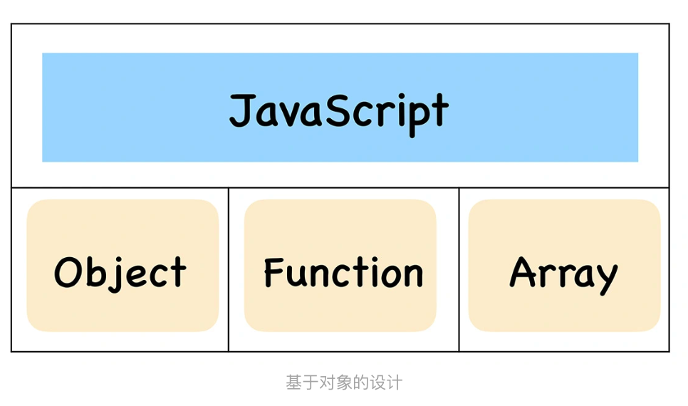

虽然 JavaScript 是基于对象设计的，但是它却不是一门面向对象的语言 (Object—Oriented Programming Language)，因为面向对象语言天生支持封装、继承、多态，但是 JavaScript 并没有直接提供多态的支持，


基于原型链的继承

只是在对象中添加了一个称为原型的属性，把继承的对象通过原型链接起来，就实现了继承，我们把这种继承方式称为基于原型链继承。

对象的属性值有三种：

1.原始类型

第一种是原始类型 (primitive)，所谓的原始类的数据，是指值本身无法被改变，比如 JavaScript 中的字符串就是原始类型，如果你修改了 JavaScript 中字符串的值，那么 V8 会返回给你一个新的字符串，原始字符串并没有被改变，我们称这些类型的值为“原始值”。

JavaScript 中的原始值主要包括 null、undefined、boolean、number、string、bigint、symbol 这七种。

2.对象类型
对象的属性值也可以是另外一个对象

3.函数类型

如果对象中的属性值是函数，那么我们把这个属性称为方法，所以我们又说对象具备属性和方法

函数的本质

函数是一种特殊的对象，它和对象一样可以拥有属性和值，但是函数和普通对象不同的是，函数可以被调用。

```JS
function foo(){
    var test = 1
}
foo.myName = 1
foo.uName = 2
console.log(foo.myName)
```

既然是函数，那么它也可以被调用，比如函数名加小括号或者匿名函数。

那么在 v8 内部是怎么实现函数的调用的呢？

其实在 v8 内部，会为函数对象添加了两个隐藏属性。

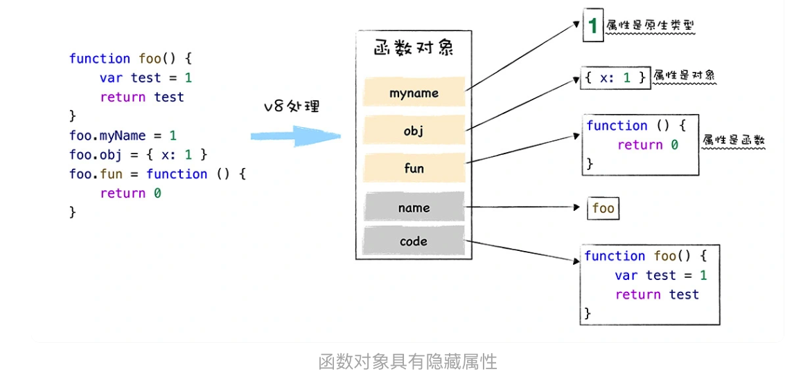

也就是说，函数除了可以拥有常用类型的属性值之外，还拥有两个隐藏属性，分别是 name 属性和 code 属性。

隐藏 name 属性的值就是函数名称，如果某个函数没有设置函数名。

```JS
(function (){
    var test = 1
    console.log(test)
})()
```

该函数对象的默认的 name 属性值就是 anonymous，表示该函数对象没有被设置名称。另外一个隐藏属性是 code 属性，其值表示函数代码，以字符串的形式存储在内存中。当执行到一个函数调用语句时，V8 便会从函数对象中取出 code 属性值，也就是函数代码，然后再解释执行这段函数代码。

函数是一等公民

因为函数是一种特殊的对象，所以在 JavaScript 中，函数可以赋值给一个变量，也可以作为函数的参数，还可以作为函数的返回值。

**如果某个编程语言的函数，可以和这个语言的数据类型做一样的事情，我们就把这个语言中的函数称为一等公民。**

由于函数的“可被调用”的特性

我们知道，在执行 JavaScript 函数的过程中，为了实现变量的查找，V8 会为其维护一个作用域链，如果函数中使用了某个变量，但是在函数内部又没有定义该变量，那么函数就会沿着作用域链去外部的作用域中查找该变量，具体流程如下图所示：

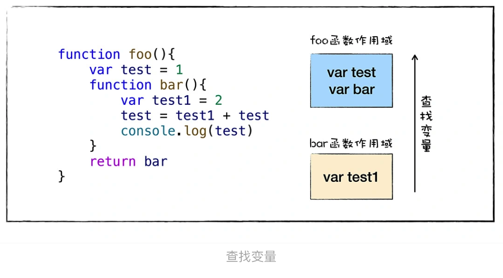

从图中可以看出，当函数内部引用了外部的变量时，使用这个函数进行赋值、传参或作为返回值，你还需要保证这些被引用的外部变量是确定存在的，这就是让函数作为一等公民麻烦的地方，因为虚拟机还需要处理函数引用的外部变量。

```JS
function foo(){
    var number = 1
    function bar(){
        number++
        console.log(number)
    }
    return bar
}
var mybar = foo()
mybar()
```

观察上段代码可以看到，我们在 foo 函数中定义了一个新的 bar 函数，并且 bar 函数引用了 foo 函数中的变量 number，当调用 foo 函数的时候，它会返回 bar 函数。

那么所谓的“函数是一等公民”就体现在，如果要返回函数 bar 给外部，那么即便 foo 函数执行结束了，其内部定义的 number 变量也不能被销毁，因为 bar 函数依然引用了该变量。

我们也把这种将外部变量和和函数绑定起来的技术称为闭包。

03 | 快属性和慢属性：V8 是怎样提升对象属性访问速度的？

在 v8 实现对象存储时，并没有完全采用字典的存储方式，这是主要出于性能的考量。

因为字典是非线性的数据结构，查询效率会低于线性的数据结构。V8 为了提升存储和查找效率，采用了一套复杂的存储策略

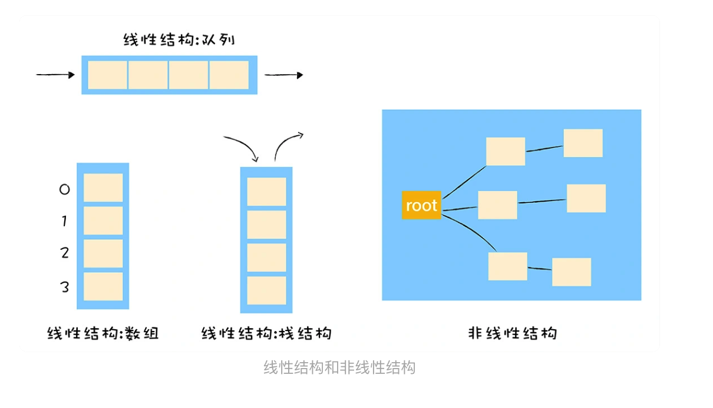

常规属性 properties 和排序属性 elements

```JS
function Foo() {
    this[100] = 'test-100'
    this[1] = 'test-1'
    this["B"] = 'bar-B'
    this[50] = 'test-50'
    this[9] =  'test-9'
    this[8] = 'test-8'
    this[3] = 'test-3'
    this[5] = 'test-5'
    this["A"] = 'bar-A'
    this["C"] = 'bar-C'
}
var bar = new Foo()


for(key in bar){
    console.log(`index:${key}  value:${bar[key]}`)
}
```

设置的数字属性被最先打印出来了，并且是按照数字大小的顺序打印的；

设置的字符串属性依然是按照之前的设置顺序打印的，比如我们是按照 B、A、C 的顺序设置的，打印出来依然是这个顺序。

之所以出现这样的结果，是因为在 ECMAScript 规范中定义了数字属性应该按照索引值大小升序排列，字符串属性根据创建时的顺序升序排列。

在这里我们把对象中的数字属性称为排序属性，在 V8 中被称为 elements，字符串属性就被称为常规属性，在 V8 中被称为 properties。

在 V8 内部，为了有效地提升存储和访问这两种属性的性能，分别使用了两个线性数据结构来分别保存排序属性和常规属性，

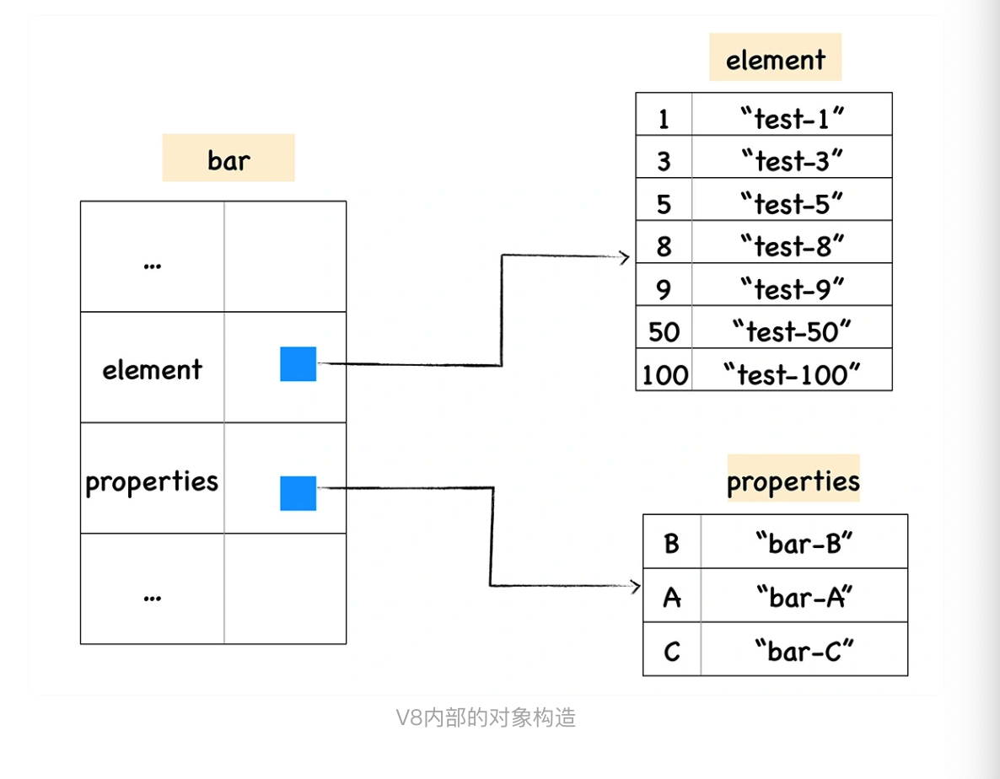

通过上图我们可以发现，bar 对象包含了两个隐藏属性：elements 属性和 properties 属性，elements 属性指向了 elements 对象，在 elements 对象中，会按照顺序存放排序属性，properties 属性则指向了 properties 对象，在 properties 对象中，会按照创建时的顺序保存了常规属性。

分解成这两种线性数据结构之后，如果执行索引操作，那么 V8 会先从 elements 属性中按照顺序读取所有的元素，然后再在 properties 属性中读取所有的元素，这样就完成一次索引操作。

快属性和慢属性

将不同的属性分别保存到 elements 属性和 properties 属性中，无疑简化了程序的复杂度，但是在查找元素时，却多了一步操作，比如执行 bar.B 这个语句来查找 B 的属性值，那么在 V8 会先查找出 properties 属性所指向的对象 properties，然后再在 properties 对象中查找 B 属性，这种方式在查找过程中增加了一步操作，因此会影响到元素的查找效率。

基于这个原因，V8 采取了一个权衡的策略以加快查找属性的效率，这个策略是将部分常规属性直接存储到对象本身，我们把这称为对象内属性 (in-object properties)。对象在内存中的展现形式你可以参看下图：

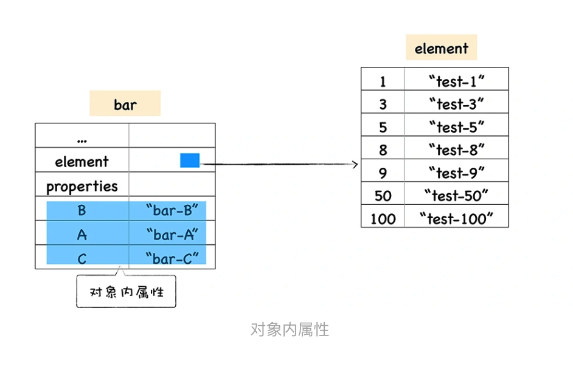

采用对象内属性之后，常规属性就被保存到 bar 对象本身了，这样当再次使用 bar.B 来查找 B 的属性值时，V8 就可以直接从 bar 对象本身去获取该值就可以了，这种方式减少查找属性值的步骤，增加了查找效率。

**不过对象内属性的数量是固定的，默认是 10 个**，如果添加的属性超出了对象分配的空间，则它们将被保存在常规属性存储中。虽然属性存储多了一层间接层，但可以自由地扩容。

通常，我们将保存在线性数据结构中的属性称之为“快属性”，因为线性数据结构中只需要通过索引即可以访问到属性，虽然访问线性结构的速度快，但是如果从线性结构中添加或者删除大量的属性时，则执行效率会非常低，这主要因为会产生大量时间和内存开销。

因此，如果一个对象的属性过多时，V8 就会采取另外一种存储策略，那就是“慢属性”策略，但慢属性的对象内部会有独立的非线性数据结构 (词典) 作为属性存储容器。所有的属性元信息不再是线性存储的，而是直接保存在属性字典中。

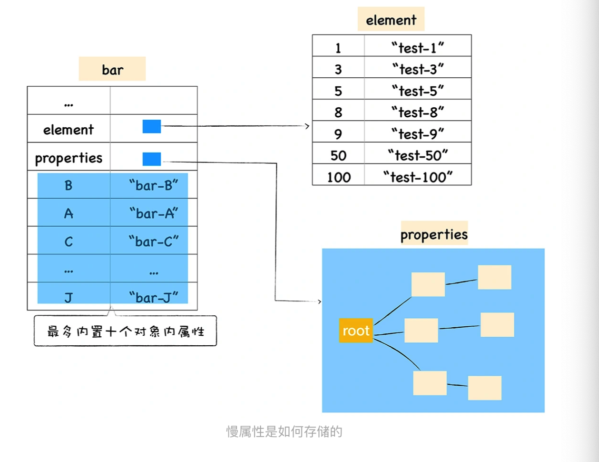

```JS
function Foo(property_num,element_num) {
    //添加可索引属性
    for (let i = 0; i < element_num; i++) {
        this[i] = `element${i}`
    }
    //添加常规属性
    for (let i = 0; i < property_num; i++) {
        let ppt = `property${i}`
        this[ppt] = ppt
    }
}
var bar = new Foo(30,10)
```

结合上图，我们可以看到，这时候的 properties 属性里面的数据并不是线性存储的，而是以非线性的字典形式存储的，所以这时候属性的内存布局是这样的：

- 10 属性直接存放在 bar3 的对象内 ;
- 90 个常规属性以非线性字典的这种数据结构方式存放在 properties 属性里面 ;
- 10 个数字属性存放在 elements 属性里面。

其他属性

除了 elements 和 porperties 属性之外，V8 还为对象添加了其他属性，比如 map 属性、**proto** 属性。**proto** 属性就是原型，是用来实现 JavaScript 继承的，我们会在下一节来介绍；而 map 则是隐藏类，

总结：

为了提升查找效率，V8 在对象中添加了两个隐藏属性，排序属性和常规属性，element 属性指向了 elements 对象，在 elements 对象中，会按照顺序存放排序属性。properties 属性则指向了 properties 对象，在 properties 对象中，会按照创建时的顺序保存常规属性。

通过引入这两个属性，加速了 V8 查找属性的速度，为了更加进一步提升查找效率，V8 还实现了内置内属性的策略，当常规属性少于一定数量时，V8 就会将这些常规属性直接写进对象中，这样又节省了一个中间步骤。

但是如果对象中的属性过多时，或者存在反复添加或者删除属性的操作，那么 V8 就会将线性的存储模式降级为非线性的字典存储模式，这样虽然降低了查找速度，但是却提升了修改对象的属性的速度。

使用 delete 来删除属性，首先 需要找到该属性是常规还是快属性，如果是常规属性而且是以字典的形式存储的话，查找需要耗时比较久。

04 | 函数表达式：涉及大量概念，函数表达式到底该怎么学？

函数声明与函数表达式的差异

```JS
foo()
function foo(){
    console.log('foo')
}
----------------
foo()
var foo = function (){
    console.log('foo')
}
```

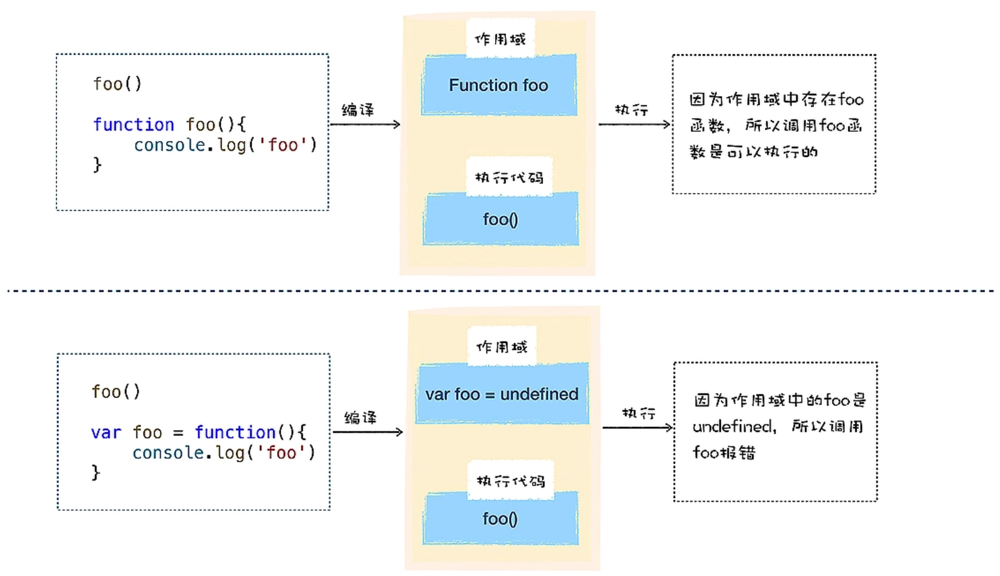

因为语义不同，所以我们给这两种定义函数的方式使用了不同的名称，第一种称之为函数声明，第二种称之为函数表达式。

V8 是怎么处理函数声明的？

我们先来看函数声明，函数声明定义了一个具有指定参数的函数，其声明语法如下所示：

```JS
function name([param,[, param,[..., param]]]) {
   [statements]
}
```

v8 是怎么处理函数声明的？ 在 v8 执行 javascript 的过程中，会先对其进行编译，然后在执行。

```JS
var x = 5
function foo(){
    console.log('Foo')
}
```

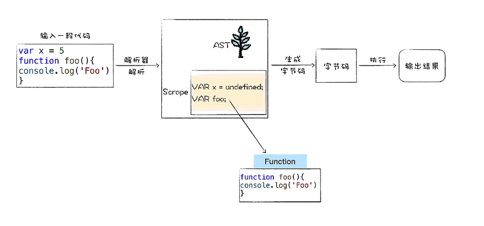

编译阶段，如果解析到函数声明，那么 v8 会将这个函数声明转换为内存中的函数对象，并将其放到作用域。同样，如果解析到某个变量声明，也会将其放到作用域中，但是会将其设置为 undefined，表示该变量还未被使用。

然后在 v8 执行阶段，如果使用了某个变量，或者调用了某个函数，那么 v8 便会去作用域查找相关内容。

关于作用域的数据，你也可以使用 d8 来查看，具体操作方式如下：

1. 将这段代码保存到一个文件中，比如 test.js

2. 使用“d8 --print-scopes test.js”命令即可查看作用域中的数据

```JS
Global scope:
global { // (0x7fb62281ca48) (0, 50)
  // will be compiled
  // 1 stack slots
  // temporary vars:
  TEMPORARY .result;  // (0x7fb62281cfe8) local[0]
  // local vars:
  VAR x;  // (0x7fb62281cc98)
  VAR foo;  // (0x7fb62281cf40)


  function foo () { // (0x7fb62281cd50) (22, 50)
    // lazily parsed
    // 2 heap slots
  }
}
```

作用 foo 函数对象被 v8 存放在内存中的堆空间了，这些变量都是在编译阶段被装进作用域中的。

我们把这种在编译阶段，将所有的变量提升到作用域的过程称为变量提升。

了解了变量提升，我们就能解释，为什么可以在函数声明之前调用该函数了，这是因为声明的函数在编译阶段就被提升到了作用域中，在执行阶段。

表达式就是表示值的式子，而语句是操作值的式子。

比如：

```JS

x = 5
```

就是表达式，因为执行这段代码，它会返回一个值。同样，6 === 5 也是一个表达式，因为它会返回 False。

而语句则不同了，比如你定义了一个变量：

```JS

var x
```

这就是一个语句，执行该语句时，V8 并不会返回任何值给你。

同样，当我声明了一个函数时，这个函数声明也是一个语句，比如下面这段函数声明：

```JS

function foo(){
  return 1
}
```

当执行到这段代码时，V8 并没有返回任何的值，它只是解析 foo 函数，并将函数对象存储到内存中。

在 v8 执行 var x = 5 这段代码时，会认为它是两段代码，一段是定义变量的语句，一段是赋值的表达式

```JS

var x = undefined
x = 5
```

首先，在变量提升阶段，V8 并不会执行赋值的表达式，该阶段只会分析基础的语句，比如变量的定义，函数的声明。

而这两行代码是在不同的阶段完成的，var x 是在编译阶段完成的，也可以说是在变量提升阶段完成的，而 x = 5 是表达式，所有的表达式都是在执行阶段完成的。

在变量提升阶段，V8 将这些变量存放在作用域时，还会给它们赋一个默认的 undefined 值，所以在定义一个普通的变量之前，使用该变量，那么该变量的值就是 undefined。

**表达式是不会在编译阶段执行的，**

```JS
function foo(){
    console.log('Foo')
}
```

执行这段代码，并不会输出任何内容，可以肯定的是，函数声明并不是一个表达式，而是一个语句。V8 在变量提升阶段，如果遇到函数声明，那么 V8 同样会对该函数声明执行变量提升操作。

函数也是一个对象，所以在编译阶段，V8 就会将整个函数对象提升到作用域中，并不是给该函数名称赋一个 undefined，理解这一点尤为重要。

总的来说，在 v8 解析 JavaScript 源码的过程中，如果遇到普通的变量声明，那么便会将其提升到作用域中，并给该变量赋值为 undefined，如果遇到普通的变量声明，那么便会将其提升到作用域中，并给该变量赋值为 undefined，如果遇到的是函数声明，那么 v8 会在内存中为声明生成函数对象，并将该对象提升到作用域中。

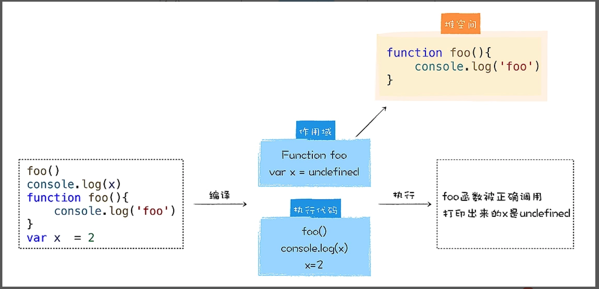

v8 是怎么处理函数表达式的？

我们在一个表达式中使用 function 来定义一个函数，那么就把该函数称为函数表达式。

函数表达式与函数声明的最主要区别有以下三点：

- 函数表达式是在表达式语句中使用 function 的，最典型的表达式是“a=b”这种形式，因为函数也是一个对象，我们把“a = function (){}”这种方式称为函数表达式；
- 在函数表达式中，可以省略函数名称，从而创建匿名函数（anonymous functions）；

- 一个函数表达式可以被用作一个即时调用的函数表达式——IIFE（Immediately Invoked Function Expression）。

在编译阶段，v8 并不会处理函数表达式，而 JavaScript 中的立即函数 调用表达式正是使用了这个特性来实现了非常广泛的应用

因为小括号之间存放的必须是表达式，所以如果在小阔号里面定义一个函数，那么 V8 就会把这个函数看成是函数表达式，执行时它会返回一个函数对象。

```JS
(function () {
    //statements
})
```

函数立即表达式也是一个表达式，所以在 v8 在编译阶段，并不会为该表达式创建函数对象。这样的一个好处就是不会污染环境，函数和函数内部的变量都不会被其他部分的代码访问到。

在 ES6 之前，JavaScript 中没有私有作用域的概念，如果在多人开发的项目中，你模块中的变量可能覆盖掉别人的变量，所以使用函数立即表达式就可以将我们内部变量封装起来，避免了相互之间的变量污染。

另外，因为函数立即表达式是立即执行的，所以将一个函数立即表达式赋给一个变量时，不是存储 IIFE 本身，而是存储 IIFE 执行后返回的结果。如下所示：

```JS
var a = (function () {
    return 1
})()
```

总结

函数声明和变量声明类似，V8 在编译阶段，都会对其执行变量提升的操作，将它们提升到作用域中，在执行阶段，如果使用了某个变量，就可以直接去作用域中去查找。

不过 V8 对于提升函数和提升变量的策略是不同的，如果提升了一个变量，那么 V8 在将变量提升到作用域中时，还会为其设置默认值 undefined，如果是函数声明，那么 V8 会在内存中创建该函数对象，并提升整个函数对象。

函数表达式也是表达式的一种，在编译阶段，V8 并不会将表达式中的函数对象提升到全局作用域中，所以无法在函数表达式之前使用该函数。函数立即表达式是一种特别的表达式，主要用来封装一些变量、函数，可以起到变量隔离和代码隐藏的作用，因此在一些大的开源项目中有广泛的应用。

05 ｜原型链：V8 是如何实现对象继承的？

**继承就是一个对象可以访问另外一个对象中的属性和方法**

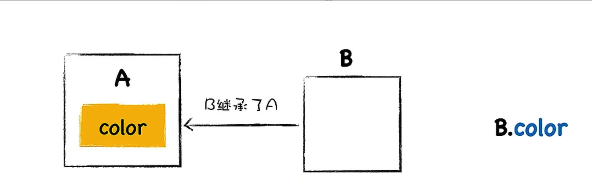

基于类的设计和基于原型继承的设计。

C++、Java、C# 这些语言都是基于经典的类继承的设计模式，这种模式最大的特点就是提供了非常复杂的规则，并提供了非常多的关键字，诸如 class、friend、protected、private、interface 等，通过组合使用这些关键字，就可以实现继承。

而 JavaScript 的继承方式和其他面向对象的继承方式有着很大差别，JavaScript 本身不提供一个 class 实现。虽然标准委员会在 ES2015/ES6 中引入了 class 关键字，但那只是语法糖，JavaScript 的继承依然和基于类的继承没有一点关系。所以当你看到 JavaScript 出现了 class 关键字时，不要以为 JavaScript 也是面向对象语言了。

JavaScript 仅仅在对象中引入了一个原型的属性，就实现了语言的继承机制，基于原型的继承省去了很多基于类继承时的繁文缛节，简洁而优美。

上节我们从 V8 的内存快照看到，JavaScript 的每个对象都包含了一个隐藏属性 **proto** ，我们就把该隐藏属性 **proto** 称之为该对象的原型 (prototype)，**proto** 指向了内存中的另外一个对象，我们就把 **proto** 指向的对象称为该对象的原型对象，那么该对象就可以直接访问其原型对象的方法或者属性。

我们把这个查找属性的路径称为原型链，它像一个链条一样，将几个原型链接了起来。

在这里还要注意一点，不要将原型链接和作用域链搞混淆了，作用域链是沿着函数的作用域一级一级来查找变量的，而原型链是沿着对象的原型一级一级来查找属性的

继承就是一个对象可以访问另外一个对象中的属性和方法，在 JavaScript 中，我们通过原型和原型链的方式来实现了继承特性。

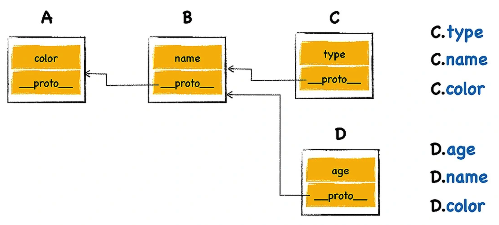

隐藏属性是不能使用 JavaScript 来直接使用的。

首先，这是隐藏属性，并不是标准定义的 ;其次，使用该属性会造成严重的性能问题。

我们可以通过构造函数来创建对象

比如我们要创建一个 dog 对象，我可以先创建一个 DogFactory 的函数，属性通过参数进行传递，在函数体内，通过 this 设置属性值。代码如下所示：

JavaScript

```js
function DogFactory(type, color) {
  this.type = type;
  this.color = color;
}
```

var dog = new DogFactory('Dog','Black')

通过这种方式，我们就把后面的函数称为构造函数，因为通过执行 new 配合一个函数，JavaScript 虚拟机便会返回一个对象。

关于 JavaScript 为什么要采用这种怪异的写法，我们文章最后再来介绍，先来看看这段代码的深层含义。

其实当 V8 执行上面这段代码时，V8 会在背后悄悄地做了以下几件事情，模拟代码如下所示：

```js
var dog = {};
dog.__proto__ = DogFactory.prototype;
DogFactory.call(dog, "Dog", "Black");
```

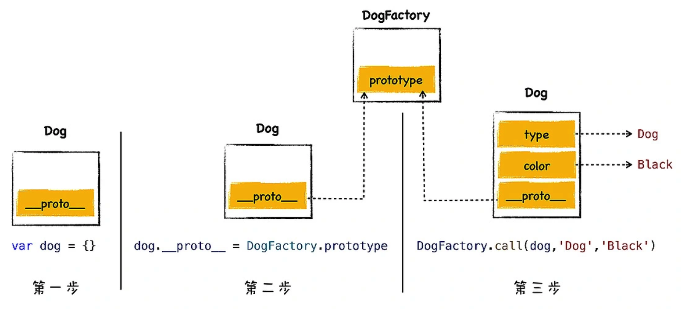

首先，创建了一个空白对象 dog；

然后，将 DogFactory 的 prototype 属性设置为 dog 的原型对象，这就是给 dog 对象设置原型对象的关键一步，我们后面来介绍；

最后，再使用 dog 来调用 DogFactory，这时候 DogFactory 函数中的 this 就指向了对象 dog，然后在 DogFactory 函数中，利用 this 对对象 dog 执行属性填充操作，最终就创建了对象 dog。

构造函数怎么实现继承？

好了，现在我们可以通过构造函数来创建对象了，接下来我们就看看构造函数是如何实现继承的？你可以先看下面这段代码：

```js
function DogFactory(type, color) {
  this.type = type;
  this.color = color;
  //Mammalia
  //恒温
  this.constant_temperature = 1;
}
var dog1 = new DogFactory("Dog", "Black");
var dog2 = new DogFactory("Dog", "Black");
var dog3 = new DogFactory("Dog", "Black");
```

还记得我们介绍函数时提到关于函数有两个隐藏属性吗？这两个隐藏属性就是 name 和 code，其实函数还有另外一个隐藏属性，那就是 prototype，刚才介绍构造函数时我们也提到过。一个函数有以下几个隐藏属性：

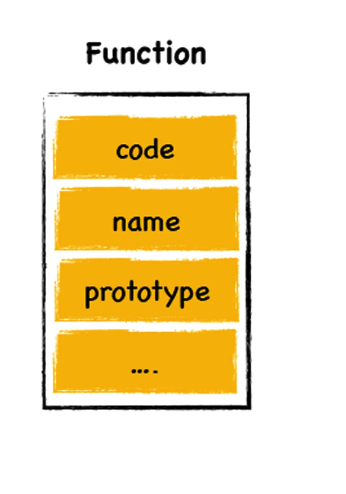

每个函数对象中都有一个公开的 prototype 属性，当你将这个函数作为构造函数来创建一个新的对象时，新创建对象的原型对象就指向了该函数的 prototype 属性。当然了，如果你只是正常调用该函数，那么 prototype 属性将不起作用。

现在我们知道了新对象的原型对象指向了构造函数的 prototype 属性，当你通过一个构造函数创建多个对象的时候，这几个对象的原型都指向了该函数的 prototype 属性，如下图所示：


06 ｜作用域链：V8 是如何查找变量的？

作用域链就是将一个个作用域串起来，实现变量查找的路径。

全局作用域是在 v8 启动过程中创建的，且一直保存在内存中不会被销毁的，直至 V8 退出。 而函数作用域是在执行该函数时创建的，当函数执行结束之后，函数作用域就随之被销毁掉了。

全局作用域中包含了很多全局变量，比如全局的 this 值，如果是浏览器，全局作用域中还有 window、document、opener 等非常多的方法和对象，如果是 node 环境，那么会有 Global、File 等内容。

V8 启动之后就进入正常的消息循环状态，这时候就可以执行代码了，比如执行到上面那段脚本时，V8 会先解析顶层 (Top Level) 代码，我们可以看到，在顶层代码中定义了变量 x，这时候 V8 就会将变量 x 添加到全局作用域中。

作用域链是怎么工作的

要了解查找路径，我们需要明白语法作用域，语法作用域是按照代码的位置来决定的，

因为 JavaScript 是基于词法作用域的，词法作用域就是指，查找作用域的顺序是按照函数定义时的位置来决定的。

因为词法作用域是根据函数在代码中的位置来确定的，作用域是在声明函数时就确定好的了，所以我们也将词法作用域称为静态作用域。

和静态作用域相对的是动态作用域，动态作用域并不关心函数和作用域是如何声明以及在何处声明的，只关心它们从何处调用。换句话说，作用域链是基于调用栈的

07 ｜类型转换：V8 是怎么实现 1+“2”的？

什么是类型系统

对机器语言来说，所有的数据都是一堆二进制代码，CPU 处理这些数据的时候，并没有类型的概念，CPU 所做的仅仅是移动数据，比如对其进行移位，相加或相乘。

而在高级语言中，我们都会为操作的数据赋予指定的类型，类型可以确认一个值或者一组值具有特定的意义和目的。所以，类型是高级语言中的概念。

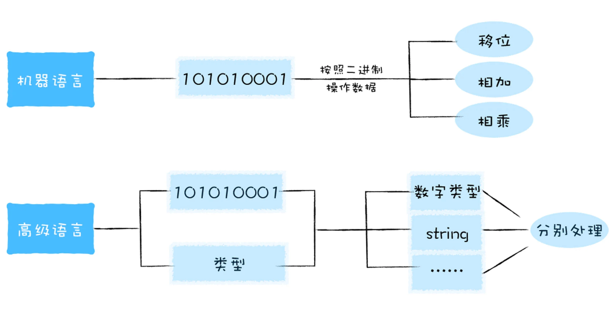

通用的类型有数字类型、字符串、Boolean 类型等等，引入了这些类型之后，编译器或者解释器就可以根据类型来限制一些有害的或者没有意义的操作。

将对象转换为原生类型的流程

- 先检测该对象中是否存在 valueOf 方法，如果有并返回了原始类型，那么就使用该值进行强制类型转换；

- 如果 valueOf 没有返回原始类型，那么就使用 toString 方法的返回值；

- 如果 vauleOf 和 toString 两个方法都不返回基本类型值，便会触发一个 TypeError 的错误。

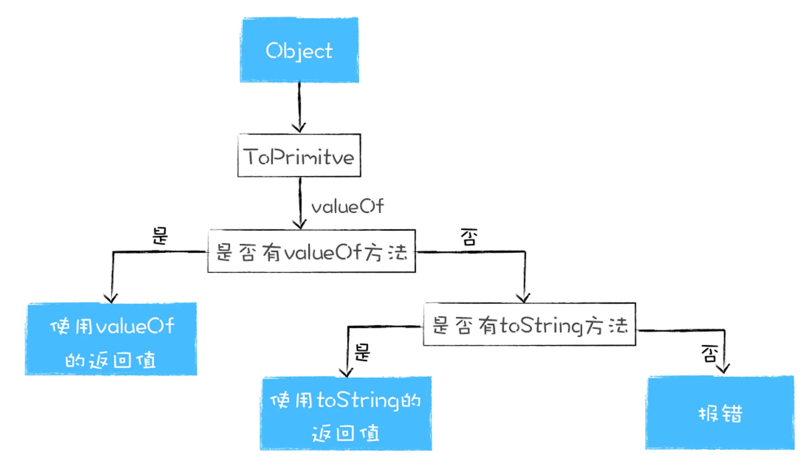

在 JavaScript 中，类型系统是依据 ECMAScript 标准来实现的，所以 V8 会严格根据 ECMAScript 标准来执行。在执行加法过程中，V8 会先通过 ToPrimitive 函数，将对象转换为原生的字符串或者是数字类型，在转换过程中，ToPrimitive 会先调用对象的 valueOf 方法，如果没有 valueOf 方法，则调用 toString 方法，如果 vauleOf 和 toString 两个方法都不返回基本类型值，便会触发一个 TypeError 的错误。

08 ｜答疑：如何构建和使用 V8 的调试工具 d8？

09 | 运行时环境：运行 JavaScript 代码的基石

其实在执行 JavaScript 代码之前，V8 就已经准备好了代码的运行时环境，这个环境包括了堆空间和栈空间、全局执行上下文、全局作用域、内置的内建函数、宿主环境提供的扩展函数和对象，还有消息循环系统。

准备好运行时环境之后，V8 才可以执行 JavaScript 代码，这包括解析源码、生成字节码、解释执行或者编译执行这一系列操作。

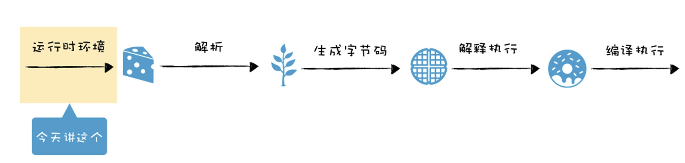

什么是宿主环境？

要聊运行 V8 的运行时环境，我们不得不聊 V8 的宿主环境，什么是 V8 的宿主环境呢？

同样，你可以把 V8 和浏览器的渲染进程的关系看成病毒和细胞的关系，浏览器为 V8 提供基础的消息循环系统、全局变量、Web API，而 V8 的核心是实现了 ECMAScript 标准，这相当于病毒自己的 DNA 或者 RNA，V8 只提供了 ECMAScript 定义的一些对象和一些核心的函数，这包括了 Object、Function、String。除此之外，V8 还提供了垃圾回收器、协程等基础内容，不过这些功能依然需要宿主环境的配合才能完整执行。

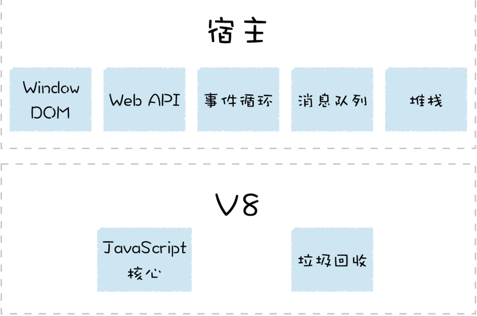

构造数据存储空间：堆空间和栈空间

由于 v8 是寄生在浏览器或者 node 这些宿主。 因此，V8 也是被这些宿主启动的。比如，在 Chrome 中，只要打开一个渲染进程，渲染进程便会初始化 V8，同时初始化堆空间和栈空间。
构造数据存储空间： 堆空间和栈空间

在 Chrome 中，只要打开一个渲染进程，渲染进程便会初始化 V8，同时初始化堆空间和栈空间。

栈空间主要是用来管理 JavaScript 函数调用的，栈是内存中连续的一块空间，同时栈结构是“先进后出”的策略。在函数调用过程中，涉及到上下文相关的内容都会存放在栈上，比如原生类型、引用到的对象的地址、函数的执行状态、this 值等都会存在在栈上。当一个函数执行结束，那么该函数的执行上下文便会被销毁掉。

栈空间的最大的特点是空间连续，所以在栈中每个元素的地址都是固定的，因此栈空间的查找效率非常高，但是通常在内存中，很难分配到一块很大的连续空间，因此，V8 对栈空间的大小做了限制，如果函数调用层过深，那么 V8 就有可能抛出栈溢出的错误。

如果有一些占用内存比较大的数据，或者不需要存储在连续空间中的数据，使用栈空间就显得不是太合适了，所以 V8 又使用了堆空间。

堆空间是一种树形的存储结构，用来存储对象类型的离散的数据

JavaScript 中除了原生类型的数据，其他的都是对象类型，诸如函数、数组，在浏览器中还有 window 对象、document 对象等，这些都是存在堆空间的。

宿主在启动 V8 的过程中，会同时创建堆空间和栈空间，再继续往下执行，产生的新数据都会存放在这两个空间中。

全局执行上下文和全局作用域

V8 初始化了基础的存储空间之后，接下来就需要初始化全局执行上下文和全局作用域了，这两个内容是 V8 执行后续流程的基础。

当 V8 开始执行一段可执行代码时，会生成一个执行上下文。V8 用执行上下文来维护执行当前代码所需要的变量声明、this 指向等。

执行上下文中主要包含三部分，变量环境、词法环境和 this 关键字。 比如在浏览器的环境中，全局执行上下文中就包括了 window 对象，还有默认指向 window 的 this 关键字，另外还有一些 Web API 函数，诸如 setTimeout、XMLHttpRequest 等内容。

而词法环境中，则包含了使用 let、const 等变量的内容。

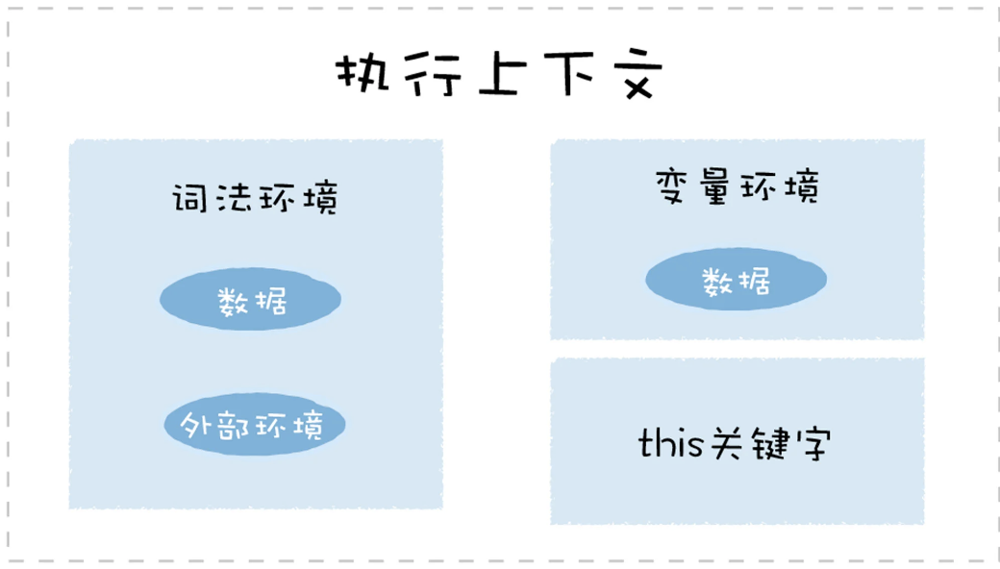

全局执行上下文在 V8 的生存周期内是不会被销毁的，它会一直保存在堆中，

全局作用域和全局执行上下文的关系，其实你可以把作用域看成是一个抽象的概念，比如在 ES6 中，同一个全局执行上下文中，都能存在多个作用域，你可以看下面这段代码：

```js
var x = 5;
{
  let y = 2;
  const z = 3;
}
```

这段代码在执行时，就会有两个对应的作用域，一个是全局作用域，另外一个是括号内部的作用域，但是这些内容都会保存到全局执行上下文中。

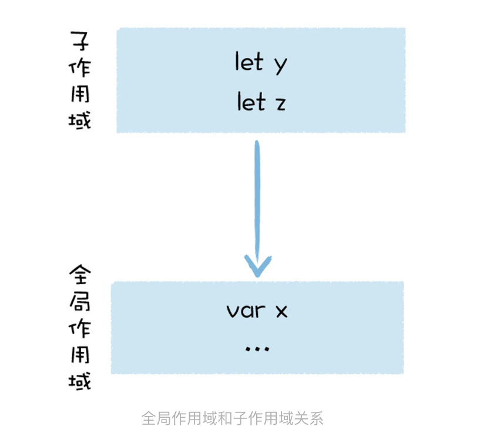

堆空间是一种树形的存储结构，用来存储对象类型的离散的数据

当 V8 开始执行一段可执行代码时，会生成一个执行上下文。V8 用执行上下文来维护执行当前代码所需要的变量声明、this 指向等。

执行上下文中主要包含三部分，变量环境、词法环境和 this 关键字。比如在浏览器的环境中，全局执行上下文中就包括了 window 对象，还有默认指向 window 的 this 关键字，另外还有一些 Web API 函数，诸如 setTimeout、XMLHttpRequest 等内容。

构造事件循环系统

为 V8 还需要有一个主线程，用来执行 JavaScript 和执行垃圾回收等工作。V8 是寄生在宿主环境中的，它并没有自己的主线程，而是使用宿主所提供的主线程，V8 所执行的代码都是在宿主的主线程上执行的。

V8 所执行的代码都是在宿主的主线程上执行的。

```javascript
while(1){
  Task task = GetNewTask()；
  RunTask(task)；
}
```

引入消息队列的原因： 1、为了能让任务等待，不丢失任务，更好地处理任务的调度； 2、为了线程间的任务传递

有一点你需要注意一下，因为所有的任务都是运行在主线程的，在浏览器的页面中，V8 会和页面共用主线程，共用消息队列，所以如果 V8 执行一个函数过久，会影响到浏览器页面的交互性能。

10 | 机器代码：二进制机器码究竟是如何被 CPU 执行的？

在执行代码时，V8 需要先将 JavaScript 编译成字节码，然后再解释执行字节码，或者将需要优化的字节码编译成二进制，并直接执行二进制代码。

也就是说，V8 首先需要将 JavaScript 编译成字节码或者二进制代码，然后再执行。

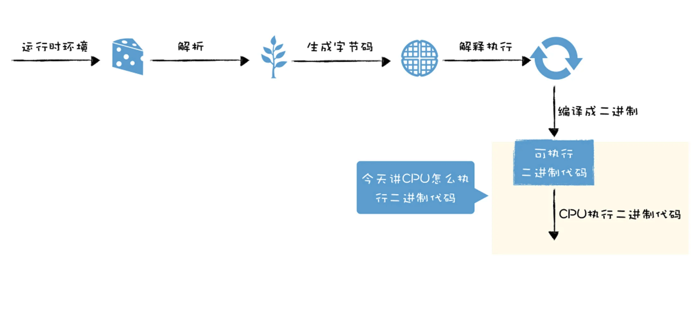

将源码编译成机器码

首先，在程序执行之前，我们的程序需要被装进内存，

一旦二进制代码被装载进内存，CPU 便可以从内存中取出一条指令，然后分析该指令，最后执行该指令。CPU 是永不停歇的，当它执行完成一条指令之后，会立即从内存中取出下一条指令，接着分析该指令，执行该指令，CPU 一直重复执行该过程，直至所有的指令执行完成。

观察上图，我们可以看到 CPU 中有一个 PC 寄存器，它保存了将要执行的指令地址，当二进制代码被装载进了内存之后，系统会将二进制代码中的第一条指令的地址写入到 PC 寄存器中，到了下一个时钟周期时，CPU 便会根据 PC 寄存器中的地址，从内存中取出指令。

我们把取出指令、分析指令、执行指令这三个过程称为一个 CPU 时钟周期。

PC 寄存器中的指令取出来之后，系统要做两件事：

第一件事是将下一条指令的地址更新到 PC 寄存器中，比如上图中，CPU 将第一个指令 55 取出来之后，系统会立即将下一个指令的地址填写到 PC 寄存器中，上个寄存器的地址是 100000f90，那么下一条指令的地址就是 100000f91 了，如下图所示：

更新了 PC 寄存器之后，CPU 就会立即做第二件事，那就是分析该指令，

并识别出不同的类型的指令，以及各种获取操作数的方法。

在指令分析完成之后，就要执行指令了。不过要了解 CPU 是如何执行指令的，我们还需要了解 CPU 中的一个重要部件：通用寄存器。

通用寄存器是 CPU 中用来存放数据的设备，不同处理器中寄存器的个数也是不一样的，之所以要通用寄存器，是因为 CPU 访问内存的速度很慢，所以 CPU 就在内部添加了一些存储设备，这些设备就是通用寄存器。

我们可以这样总结通用寄存器和内存的关系：通用寄存器容量小，读写速度快，内存容量大，读写速度慢。

通用寄存器通常用来存放数据或者内存中某块数据的地址，我们把这个地址又称为指针，通常情况下寄存器对存放的数据是没有特别的限制的，比如某个通用寄存器既可以存储数据，也可以存储指针。

不过由于历史原因，我们还会将某些专用的数据或者指针存储在专用的通用寄存器中 ，比如 rbp 寄存器通常是用来存放栈帧指针的，rsp 寄存器用来存放栈顶指针的，PC 寄存器用来存放下一条要执行的指令等。

那么 CPU 是如何执行指令的呢

第一种是加载的指令，其作用是从内存中复制指定长度的内容到通用寄存器中，并覆盖寄存器中原来的内容。

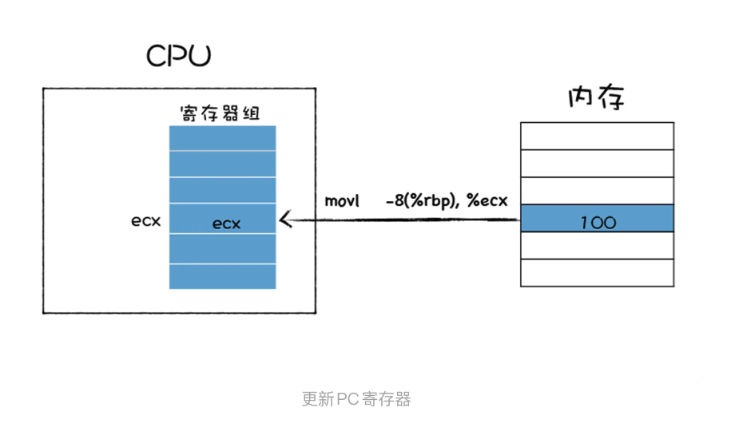

比如上图使用了 movl 指令，指令后面跟着的第一个参数是要拷贝数据的内存的位置，第二个参数是要拷贝到 ecx 这个寄存器。

第二种存储的指令，和加载类型的指令相反，其作用是将寄存器中的内容复制内存某个位置，并覆盖掉内存中的这个位置上原来的内容。

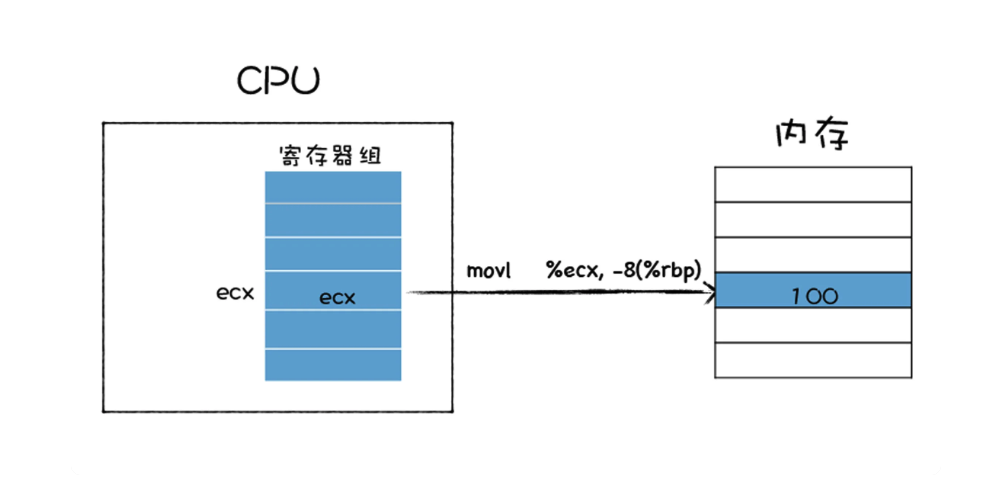

上图也是使用 movl 指令，movl 指令后面的 %ecx 就是寄存器地址，-8(%rbp) 是内存中的地址，这条指令的作用是将寄存器中的值拷贝到内存中。

第三种是更新指令，其作用是复制两个寄存器中的内容到 ALU 中，也可以是一块寄存器和一块内存中的内容到 ALU 中，ALU 将两个字相加，并将结果存放在其中的一个寄存器中，并覆盖该寄存器中的内容。

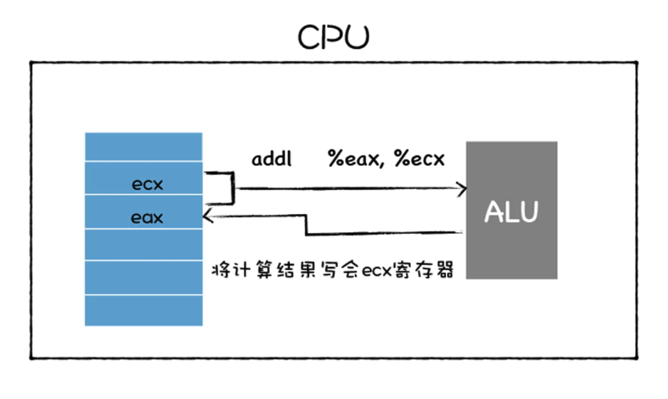

参看上图，我们可以发现 addl 指令，将寄存器 eax 和 ecx 中的值传给 ALU，ALU 对它们进行相加操纵，并将计算的结果写回 ecx。

还有一个非常重要的指令，是跳转指令，从指令本身抽取出一个字，这个字是下一条要执行的指令的地址，并将该字复制到 PC 寄存器中，并覆盖掉 PC 寄存器中原来的值。那么当执行下一条指令时，便会跳转到对应的指令了。

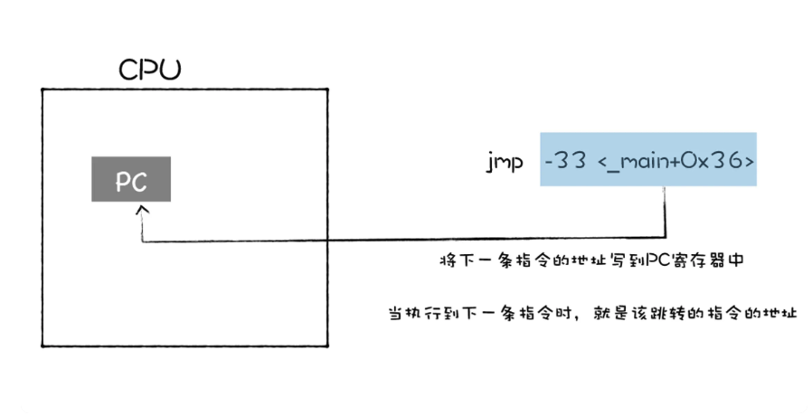

除了以上指令之外，还有 IO 读 / 写指令，这些指令可以从一个 IO 设备中复制指定长度的数据到寄存器中，也可以将一个寄存器中的数据复制到指定的 IO 设备。

分析一段汇编代码的执行流程


1. 二进制代码装载进内存，系统会将第一条指令的地址写入到 PC 寄存器中。
2. 读取指令：根据 pc 寄存器中地址，读取到第一条指令，并将 pc 寄存器中内容更新成下一条指令地址。
3. 分析指令：并识别出不同的类型的指令，以及各种获取操作数的方法。
4. 执行指令：由于 cpu 访问内存花费时间较长，因此 cpu 内部提供了通用寄存器，用来保存关键变量，临时数据等。指令包括加载指令，存储指令，更新指令，跳转指令。如果涉及加减运算，会额外让 ALU 进行运算。
5. 指令完成后，通过 pc 寄存器取出下一条指令地址，并更新 pc 寄存器中内容，再重复以上步骤。

11 | 堆和栈：函数调用是如何影响到内存布局的？

```js
function foo() {
  foo(); // 是否存在堆栈溢出错误?
}
foo();
```

```js
function foo() {
  setTimeout(foo, 0); // 是否存在堆栈溢出错误?
}
```

```js
function foo() {
  setTimeout(foo, 0); // 是否存在堆栈溢出错误?
}
```

为什么这三段代码，第一段造成栈溢出的错误，第二段能够正确执行，而第三段没有栈溢出的错误，却会造成页面的卡死呢？

其主要原因是这三段代码的底层执行逻辑是完全不同的：

第一段代码是在同一个任务中重复调用嵌套的 foo 函数；

第二段代码是使用 setTimeout 让 foo 函数在不同的任务中执行；

第三段代码是在同一个任务中执行 foo 函数，但是却不是嵌套执行。

为什么使用栈结构来管理函数调用？

1.第一个特点是函数可以被调用，你可以在一个函数中调用另外一个函数，当函数调用发生时，执行代码的控制权将从父函数转移到子函数，子函数执行结束之后，又会将代码执行控制权返还给父函数；

2.第二个特点是函数具有作用域机制，所谓作用域机制，是指函数在执行的时候可以将定义在函数内部的变量和外部环境隔离，在函数内部定义的变量我们也称为临时变量，临时变量只能在该函数中被访问，外部函数通常无权访问，当函数执行结束之后，存放在内存中的临时变量也随之被销毁。

函数调用者的生命周期总是长于被调用者（后进），并且被调用者的生命周期总是先于调用者的生命周期结束 (先出)。

因为函数是有作用域机制的，作用域机制通常表现在函数执行时，会在内存中分配函数内部的变量、上下文等数据，在函数执行完成之后，这些内部数据会被销毁掉。所以站在函数资源分配和回收角度来看，被调用函数的资源分配总是晚于调用函数 (后进)，而函数资源的释放则总是先于调用函数 (先出)。

我们将 main 函数的控制权转交给 main 函数。这个过程叫做恢复现场

其实方法很简单，只要在寄存器中保存一个永远指向当前栈顶的指针，栈顶指针的作用就是告诉你应该往哪个位置添加新元素，这个指针通常存放在 esp 寄存器中。如果你想往栈中添加一个元素，那么你需要先根据 esp 寄存器找到当前栈顶的位置，然后在栈顶上方添加新元素，新元素添加之后，还需要将新元素的地址更新到 esp 寄存器中。

12 | 延迟解析：V8 是如何实现闭包的？

在第一节我们介绍过 V8 执行 JavaScript 代码，需要经过编译和执行两个阶段，其中编译过程是指 V8 将 JavaScript 代码转换为字节码或者二进制机器代码的阶段，而执行阶段则是指解释器解释执行字节码，或者是 CPU 直接执行二进制机器代码的阶段

首先，如果一次解析和编译所有的 JavaScript 代码，过多的代码会增加编译时间，这会严重影响到首次执行 JavaScript 代码的速度，让用户感觉到卡顿。因为有时候一个页面的 JavaScript 代码都有 10 多兆，如果要将所有的代码一次性解析编译完成，那么会大大增加用户的等待时间；

其次，解析完成的字节码和编译之后的机器代码都会存放在内存中，如果一次性解析和编译所有 JavaScript 代码，那么这些中间代码和机器代码将会一直占用内存，特别是在手机普及的年代，内存是非常宝贵的资源。

基于以上的原因，所有主流的 JavaScript 虚拟机都实现了惰性解析。所谓惰性解析是指解析器在解析的过程中，如果遇到函数声明，那么会跳过函数内部的代码，并不会为其生成 AST 和字节码，而仅仅生成顶层代码的 AST 和字节码。

惰性解析的过程

```js
function foo(a, b) {
  var d = 100;
  var f = 10;
  return d + f + a + b;
}
var a = 1;
var c = 4;
foo(1, 5);
```

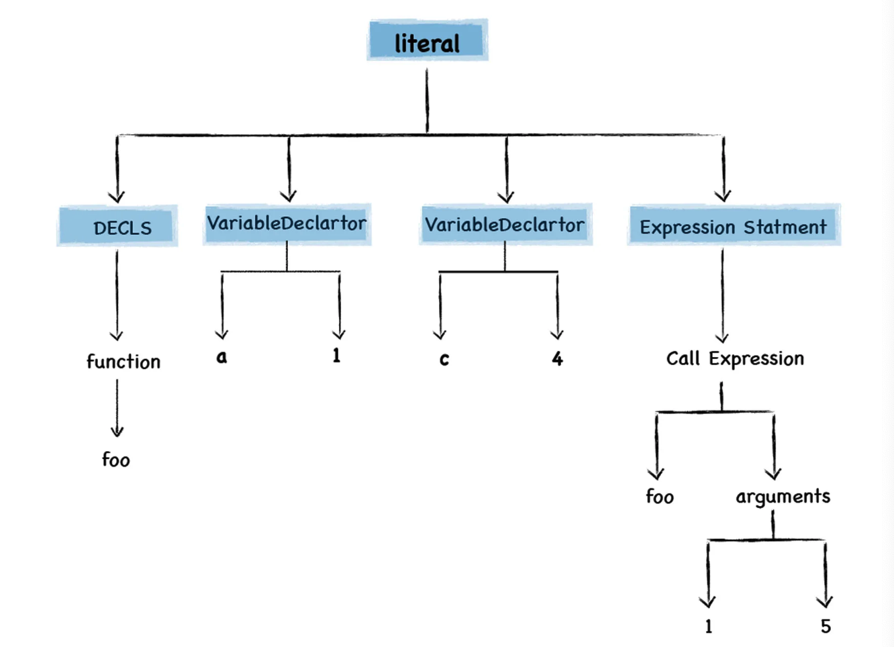

代码解析完成之后，V8 便会按照顺序自上而下执行代码，首先会先执行“a=1”和“c=4”这两个赋值表达式，接下来执行 foo 函数的调用，过程是从 foo 函数对象中取出函数代码，然后和编译顶层代码一样，V8 会先编译 foo 函数的代码，编译时同样需要先将其编译为抽象语法树和字节码，然后再解释执行。

拆解闭包——JavaScript 的三个特性

第一，JavaScript 语言允许在函数内部定义新的函数，

第二，可以在内部函数中访问父函数中定义的变量

第三，因为函数是一等公民，所以函数可以作为返回值

预解析器如何解决闭包带来的问题

V8 引入预解析器，比如当解析顶层代码的时候，遇到了一个函数，那么预解析器并不会直接跳过该函数，而是对该函数做一次快速的预解析，其主要目的有两个。

第一，是判断当前函数是不是存在一些语法上的错误

第二，除了检查语法错误之外，预解析器另外的一个重要的功能就是检查函数内部是否引用了外部变量，如果引用了外部的变量，预解析器会将栈中的变量复制到堆中，在下次执行到该函数的时候，直接使用堆中的引用，这样就解决了闭包所带来的问题。

⚠️：如果引用了，那么需要将该变量存放到堆中，即便当前函数执行结束之后，也不会释放该变量。

13 | 字节码（一）：V8 为什么又重新引入字节码？

所谓字节码，是指编译过程中的中间代码，你可以把字节码看成是机器代码的抽象，在 V8 中，字节码有两个作用：

第一个是解释器可以直接解释执行字节码 ;

第二个是优化编译器可以将字节码编译为二进制代码，然后再执行二进制机器代码。

但是呢 早起的 v8 并不是这样设计的，当时的 v8 是直接将 JavaScript 代码编译为二进制机器代码，然后再执行的，这样做的好处是执行速度快，但是坏处是编译时间长，而且占用内存多。

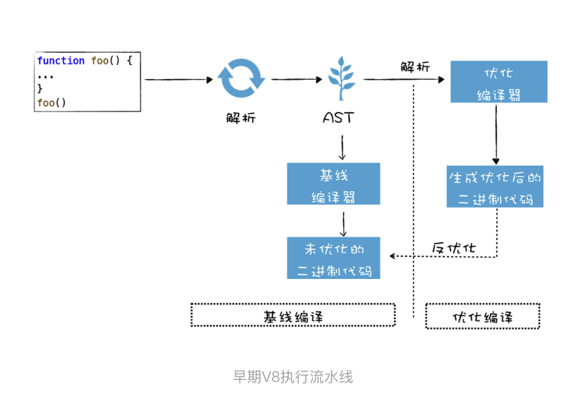

观察上面的执行流程图，我们可以发现，早期的 V8 也使用了两个编译器：

第一个是基线编译器，它负责将 JavaScript 代码编译为没有优化过的机器代码。

第二个是优化编译器，它负责将一些热点代码（执行频繁的代码）优化为执行效率更高的机器代码。

早期的 v8 执行流程

1. 首先，V8 会将一段 JavaScript 代码转换为抽象语法树 (AST)。

2. 接下来基线编译器会将抽象语法树编译为未优化过的机器代码，然后 V8 直接执行这些未优化过的机器代码。

3. 在执行未优化的二进制代码过程中，如果 V8 检测到某段代码重复执行的概率过高，那么 V8 会将该段代码标记为 HOT，标记为 HOT 的代码会被优化编译器优化成执行效率高的二进制代码，然后就执行该段优化过的二进制代码。

4. 不过如果优化过的二进制代码并不能满足当前代码的执行，这也就意味着优化失败，V8 则会执行反优化操作。

机器代码缓存

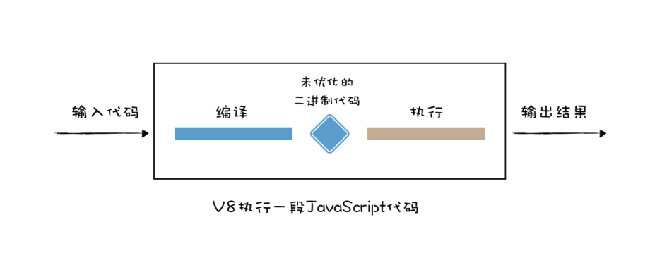

V8 为了提高执行效率，引入了机器代码缓存，机器代码缓存是指将优化过的二进制代码缓存到内存中，这样下次执行相同的代码时，V8 就可以直接从缓存中取出二进制代码，而不需要再次编译。

这就是 Chrome 浏览器引入二进制代码缓存的原因，通过把二进制代码保存在内存中来消除冗余的编译，重用它们完成后续的调用，这样就省去了再次编译的时间。

V8 使用两种代码缓存策略来缓存生成的代码。

首先，是 V8 第一次执行一段代码时，会编译源 JavaScript 代码，并将编译后的二进制代码缓存在内存中，我们把这种方式称为内存缓存（in-memory cache)。然后通过 JavaScript 源文件的字符串在内存中查找对应的编译后的二进制代码。这样当再次执行到这段代码时，V8 就可以直接去内存中查找是否编译过这段代码。如果内存缓存中存在这段代码所对应的二进制代码，那么就直接执行编译好的二进制代码。

其次，V8 除了采用将代码缓存在内存中策略之外，还会将代码缓存到硬盘上，这样即便关闭了浏览器，下次重新打开浏览器再次执行相同代码时，也可以直接重复使用编译好的二进制代码。

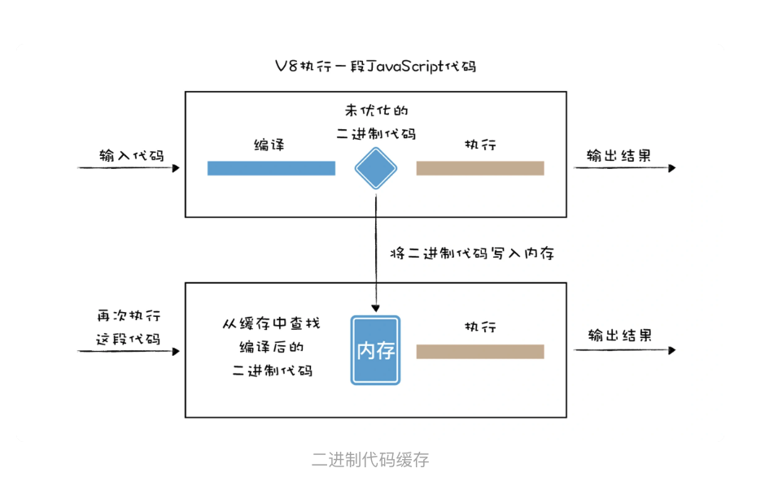

字节码降低了内存占用

所以在早期，Chrome 做了两件事来提升 JavaScript 代码的执行速度：

第一，将运行时将二进制机器代码缓存在内存中；

第二，当浏览器退出时，缓存编译之后二进制代码到磁盘上。

为什么说字节码降低了内存占用呢？

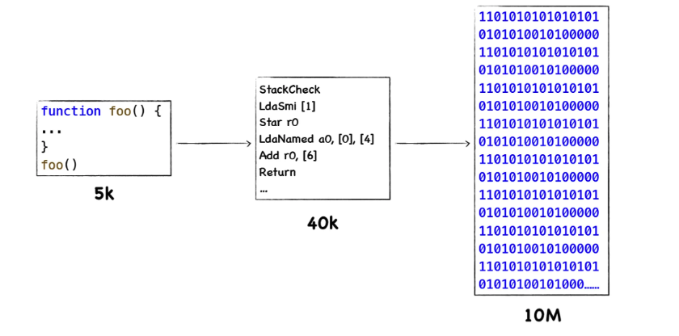

有了字节码，无论是解释器的解释执行，还是优化编译器的编译执行，都可以直接针对字节来进行操作。由于字节码占用的空间远小于二进制代码，所以浏览器就可以实现缓存所有的字节码，而不是仅仅缓存顶层的字节码。

虽然采用字节码在执行速度上稍慢于机器代码，但是整体上权衡利弊，采用字节码也许是最优解。之所以说是最优解，是因为采用字节码除了降低内存之外，还提升了代码的启动速度，并降低了代码的复杂度，而牺牲的仅仅是一点执行效率。接下来我们继续来分析下，采用字节码是怎么提升代码启动速度和降低复杂度的。

字节码如何提升代码启动速度？

解释器可以快速生成字节码，但字节码通常效率不高。 相比之下，优化编译器虽然需要更长的时间进行处理，但最终会产生更高效的机器码，这正是 V8 在使用的模型。它的解释器叫 Ignition，（就原始字节码执行速度而言）是所有引擎中最快的解释器。V8 的优化编译器名为 TurboFan，最终由它生成高度优化的机器码。

字节码如何降低代码的复杂度？

引入了字节码，就可以统一将字节码转换为不同平台的二进制代码，你可以对比下执行流程：

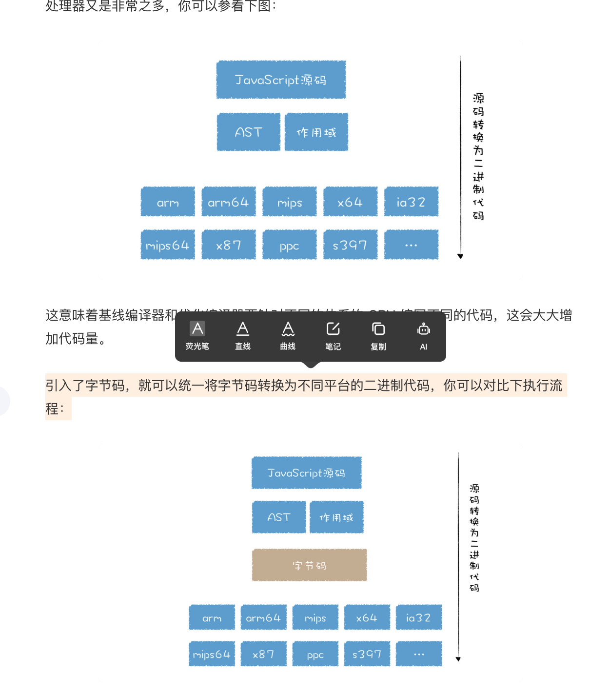

这两个问题无疑会阻碍 V8 在移动设备上的普及，于是 V8 团队大规模重构代码，引入了中间的字节码。字节码的优势有如下三点：

解决启动问题：生成字节码的时间很短；

解决空间问题：字节码占用内存不多，缓存字节码会大大降低内存的使用；

代码架构清晰：采用字节码，可以简化程序的复杂度，使得 V8 移植到不同的 CPU 架构平台更加容易。

14 ｜字节码（二）：解释器是如何解释执行字节码的？

如何生成字节码？我们知道当 V8 执行一段 JavaScript 代码时，会先对 JavaScript 代码进行解析 (Parser)，并生成为 AST 和作用域信息，之后 AST 和作用域信息被输入到一个称为 Ignition 的解释器中，并将其转化为字节码，之后字节码再由 Ignition 解释器来解释执行。

```js
function add(x, y) {
  var z = x + y;
  return z;
}
console.log(add(1, 2));
```

我们知道当 V8 执行一段 JavaScript 代码时，会先对 JavaScript 代码进行解析 (Parser)，并生成为 AST 和作用域信息，之后 AST 和作用域信息被输入到一个称为 Ignition 的解释器中，并将其转化为字节码，之后字节码再由 Ignition 解释器来解释执行。

理解字节码： 解释器的架构设计

因为解释器就是模拟物理机器来执行字节码的，比如可以实现如取指令、解析指令、执行指令、存储数据等，所以解释器的执行架构和 CPU 处理机器代码的架构类似

**通常有两种类型的解释器，基于栈 (Stack-based)和基于寄存器 (Register-based)，基于栈的解释器使用栈来保存函数参数、中间运算结果、变量等，基于寄存器的虚拟机则支持寄存器的指令操作，使用寄存器来保存参数、中间计算结果。**

通常，基于栈的虚拟机也定义了少量的寄存器，基于寄存器的虚拟机也有堆栈，其区别体现在它们提供的指令集体系。

大多数解释器都是基于栈的，比如 Java 虚拟机，.Net 虚拟机，还有早期的 V8 虚拟机。基于堆栈的虚拟机在处理函数调用、解决递归问题和切换上下文时简单明快。

现在的 V8 虚拟机则采用了基于寄存器的设计，它将一些中间数据保存到寄存器中

解释器执行时主要有四个模块，内存中的字节码、寄存器、栈、堆。

- 使用内存中的一块区域来存放字节码；

- 使用了通用寄存器 r0，r1，r2，…… 这些寄存器用来存放一些中间数据；

- PC 寄存器用来指向下一条要执行的字节码；

- 栈顶寄存器用来指向当前的栈顶的位置。

15 | 隐藏类：如何在内存中快速查找对象属性？

因为静态语言中，可以直接通过偏移量查询来查询对象的属性值，这也就是静态语言的执行效率高的一个原因。

什么是隐藏类？

v8 对每个对象都做了如下两点：

1. 对象创建好之后不会添加新的属性
2. 对象创建好之后也不会删除属性

具体地讲，V8 会为每个对象创建一个隐藏类，对象的隐藏类中记录了该对象一些基础的布局信息，包括以下两点：

对象中所包含的所有的属性；每个属性相对于对象的偏移量。

```js
let point = { x: 100, y: 200 };
```

在 V8 中，把隐藏类又称为 map，每个对象都有一个 map 属性，其值指向内存中的隐藏类。

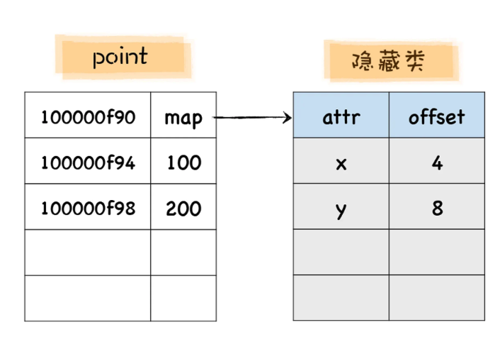

在这张图中，左边的是 point 对象在内存中的布局，右边是 point 对象的 map，我们可以看到，point 对象的第一个属性就指向了它的 map，关于如何通过浏览器查看对象的 map，有了 map 之后，当你再次使用 point.x 访问 x 属性时，V8 会查询 point 的 map 中 x 属性相对 point 对象的偏移量，然后将 point 对象的起始位置加上偏移量，就得到了 x 属性的值在内存中的位置，有了这个位置也就拿到了 x 的值，这样我们就省去了一个比较复杂的查找过程

多个对象共用一个隐藏类

如果两个对象的形状是相同的，v8 就会为其复用同一个隐藏类。

1. 减少隐藏类的创建次数，也间接加速了代码的执行速度；
2. 减少了隐藏类的存储空间。

那么，什么情况下两个对象的形状是相同的，要满足以下两点：相同的属性名称；相等的属性个数。

最佳实践：

- 如果对象的形状没有发生改变，那么该对象就会一直使用该隐藏类；

- 如果对象的形状发生了改变，那么 V8 会重建一个新的隐藏类给该对象。

在工作中注意到：

一，使用字面量初始化对象时，要保证属性的顺序是一致的。比如先通过字面量 x、y 的顺序创建了一个 point 对象，然后通过字面量 y、x 的顺序创建一个对象 point2，代码如下所示：

二，尽量使用字面量一次性初始化完整对象属性。因为每次为对象添加一个属性时，V8 都会为该对象重新设置隐藏类。

三，尽量避免使用 delete 方法。delete 方法会破坏对象的形状，同样会导致 V8 为该对象重新生成新的隐藏类。

总结：

- 在 V8 中，每个对象都有一个隐藏类，隐藏类在 V8 中又被称为 map。

- 在 V8 中，每个对象的第一个属性的指针都指向其 map 地址。

- map 描述了其对象的内存布局，比如对象都包括了哪些属性，这些数据对应于对象的偏移量是多少？

- 如果添加新的属性，那么需要重新构建隐藏类。

- 如果删除了对象中的某个属性，同样也需要构建隐藏类。

16 | 答疑： V8 是怎么通过内联缓存来提升函数执行效率的？

通常 V8 获取 o.x 的流程是这样的：查找对象 o 的隐藏类，再通过隐藏类查找 x 属性偏移量，然后根据偏移量获取属性值，在这段代码中 loadX 函数会被反复执行，那么获取 o.x 流程也需要反复被执行。我们有没有办法再度简化这个查找过程，最好能一步到位查找到 x 的属性值呢？答案是，有的。

其实这是一个关于内联缓存的思考题。我们可以看到，函数 loadX 在一个 for 循环里面被重复执行了很多次，因此 V8 会想尽一切办法来压缩这个查找过程，以提升对象的查找效率。这个加速函数执行的策略就是内联缓存 (Inline Cache)，简称为 IC。

什么是内联缓存？

要回答这个问题，我们需要知道 IC 的工作原理。其实 IC 的原理很简单，直观地理解，就是在 V8 执行函数的过程中，会观察函数中一些调用点 (CallSite) 上的关键的中间数据，然后将这些数据缓存起来，当下次再次执行该函数的时候，V8 就可以直接利用这些中间数据，节省了再次获取这些数据的过程，因此 V8 利用 IC，可以有效提升一些重复代码的执行效率。

IC 会为每个函数维护一个反馈向量 (FeedBack Vector)，反馈向量记录了函数在执行过程中的一些关键的中间数据。

v8 缓存 load 类型，存储(store)类型、函数调用(call)类型

```js
StackCheck
LdaSmi [4]
StaNamedProperty a0, [0], [0]
LdaGlobal [1], [2]
Star r0
CallUndefinedReceiver0 r0, [4]
LdaNamedProperty a0, [2], [6]
Return
```

StackCheck: 这是检查当前函数执行过程中栈的状态，以避免栈溢出。
LdaSmi [4]: 从常量池中加载一个整数值到累加器中。
StaNamedProperty a0, [0], [0]: 将 a0 寄存器中的值存储到对象的指定属性中。
LdaGlobal [1], [2]: 从全局对象中加载指定属性的值到累加器中。
Star r0: 将累加器中的值存储到寄存器 r0 中。
CallUndefinedReceiver0 r0, [4]: 调用一个未定义的接收器函数。
LdaNamedProperty a0, [2], [6]: 从对象的指定属性中加载值到累加器中。
Return: 返回累加器中的值作为函数执行的结果。

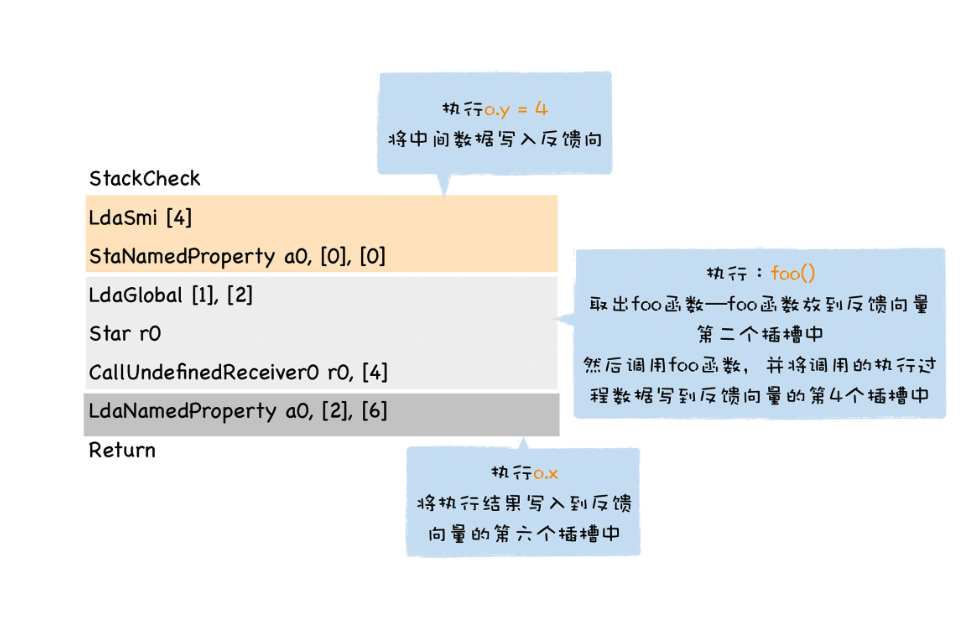

当 V8 再次调用 loadX 函数时，比如执行到 loadX 函数中的 return o.x 语句时，它就会在对应的插槽中查找 x 属性的偏移量，之后 V8 就能直接去内存中获取 o.x 的属性值了。这样就大大提升了 V8 的执行效率。

多态和超态

- 如果一个插槽中只包含 1 个隐藏类，那么我们称这种状态为单态 (monomorphic)；
- 如果一个插槽中包含了 2 ～ 4 个隐藏类，那我们称这种状态为多态 (polymorphic)；
- 如果一个插槽中超过 4 个隐藏类，那我们称这种状态为超态 (magamorphic)。

尽量保持单态

这就是 IC 的一些基础情况，非常简单，只是为每个函数添加了一个缓存，当第一次执行该函数时，V8 会将函数中的存储、加载和调用相关的中间结果保存到反馈向量中。当再次执行时，V8 就要去反馈向量中查找相关中间信息，如果命中了，那么就直接使用中间信息。

总的来说，我们只需要记住一条就足够了，那就是单态的性能优于多态和超态，所以我们需要稍微避免多态和超态的情况。

总结：

总的来说，我们只需要记住一条就足够了，那就是单态的性能优于多态和超态，所以我们需要稍微避免多态和超态的情况。

17 | 消息队列：V8 是怎么实现回调函数的？

回调函数有两种不同的形式，同步回调和异步回调。通常，我们需要将回调函数传入给另外一个执行函数，那么同步回调和异步回调的最大区别在于同步回调函数是在执行函数内部被执行的，而异步回调函数是在执行函数外部被执行的。

早期页面是运行在一个单独的 ui 线程中的，所以 js 也被设计运行在 ui 线程中。

所谓 UI 线程，是指运行窗口的线程，当你运行一个窗口时，无论该页面是 Windows 上的窗口系统，

在页面线程中，当一个事件被触发时，比如用户使用鼠标点击了页面，系统需要将该事件提交给 UI 线程来处理。

UI 线程提供一个消息队列，并将这些待执行的事件添加到消息队列中，然后 UI 线程会不断循环地从消息队列中取出事件、执行事件。我们把 UI 线程每次从消息队列中取出事件，执行事件的过程称为一个任务。

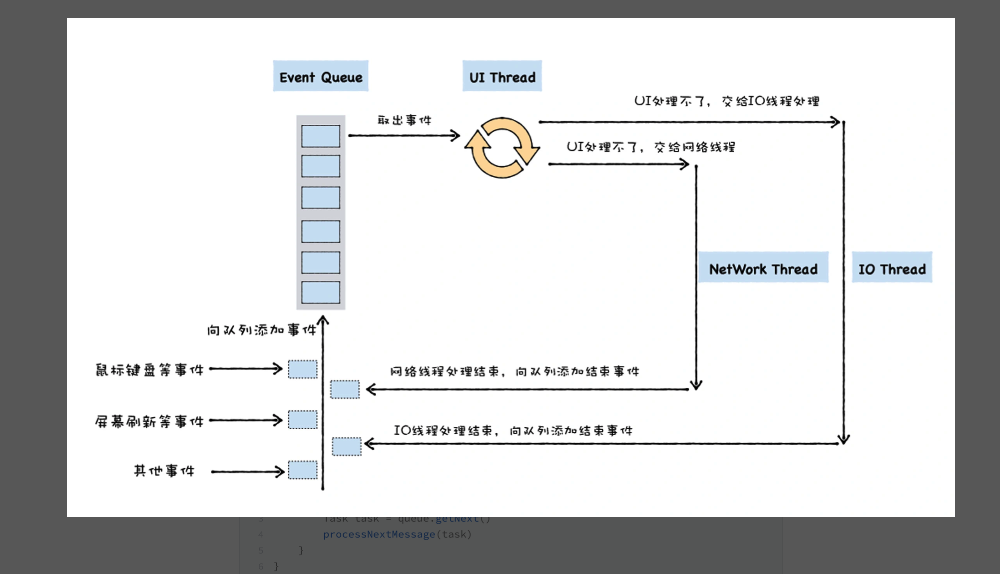

```js
function UIMainThread() {
    while (queue.waitForMessage()) {
        Task task = queue.getNext()
        processNextMessage(task)
    }
}
```

在这段代码中，queue 是消息队列，queue.waitForMessage() 会同步地等待消息队列中的消息到达，如果当前没有任何消息等待被处理，则这个函数会将 UI 线程挂起。如果消息队列中有消息，则使用 queue.getNext() 取出下一个要执行的消息，并交由 processNextMessage 函数来处理消息。

这就是通用的 UI 线程的结构，有消息队列，通过鼠标、键盘、触控板等产生的消息都会被添加进消息队列，主线程会循环地从消息队列中取出消息并执行。

总结：

UI 线程提供一个消息队列，并将待执行的事件添加到消息队列中，然后 UI 线程会不断循环地从消息队列中取出事件、执行事件。

关于异步回调，这里也有两种不同的类型，其典型代表是 setTimeout 和 XMLHttpRequest。

setTimeout 的执行流程其实是比较简单的，在 setTimeout 函数内部封装回调消息，并将回调消息添加进消息队列，然后主线程从消息队列中取出回调事件，并执行回调函数。

XMLHttpRequest 稍微复杂一点，因为下载过程需要放到单独的一个线程中去执行，所以执行 XMLHttpRequest.send 的时候，宿主会将实际请求转发给网络线程，然后 send 函数退出，主线程继续执行下面的任务。网络线程在执行下载的过程中，会将一些中间信息和回调函数封装成新的消息，并将其添加进消息队列中，然后主线程从消息队列中取出回调事件，并执行回调函数。

```js
var fs = require("fs");
var data = fs.readFileSync("test.js");
```

```js
fs.readFile("test.txt", function (err, data) {
  data.toString();
});
```

本质是 readFileSync 是在主线程上执行的，readFile 在读写线程中执行的(在浏览器中页面的 UI 线程就是主线程，在 Node 中主线程就是主线程)

18 | 异步编程（一）：V8 是如何实现微任务的？

宏任务：
宏任务很简单，就是指消息队列中的等待被主线程执行的事件。每个宏任务在执行的时候，v8 都会重新创建栈，然后随着宏任务中函数调用，栈随之变化，最终，当该宏任务执行结束时，整个栈又会被清空，接着主线程继续执行下一个宏任务。

微任务：
微任务稍微复杂一点，其实你可以把微任务看成是一个需要异步执行的函数，执行时机是在主函数执行结束之后、当前宏任务结束之前。

JavaScript 中之所以要引入微任务，主要是由于主线程执行消息队列中宏任务的时间颗粒度太粗了，无法胜任一些对精度和实时性要求较高的场景，那么微任务可以在实时性和效率之间做一个有效的权衡。另外使用微任务，可以改变我们现在的异步编程模型，使得我们可以使用同步形式的代码来编写异步调用。

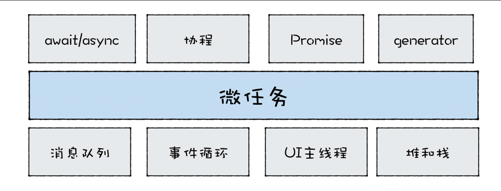

微任务是基于消息队列、事件循环、UI 主线程还有堆栈而来的，然后基于微任务，又可以延伸出协程、Promise、Generator、await/async 等现代前端经常使用的一些技术。

主线程、调用栈、消息队列

我们先从主线程和调用栈开始分析。我们知道，调用栈是一种数据结构，用来管理在主线程上执行的函数的调用关系。

```js
function foo() {
  setTimeout(foo, 0);
}
foo();
```

首先，主线程会从消息队列中取出需要执行的宏任务，假设当前取出的任务就是要执行的这段代码，这时候主线程便会进入代码的执行状态。这时关于主线程、消息队列、调用栈的关系如下图所示：

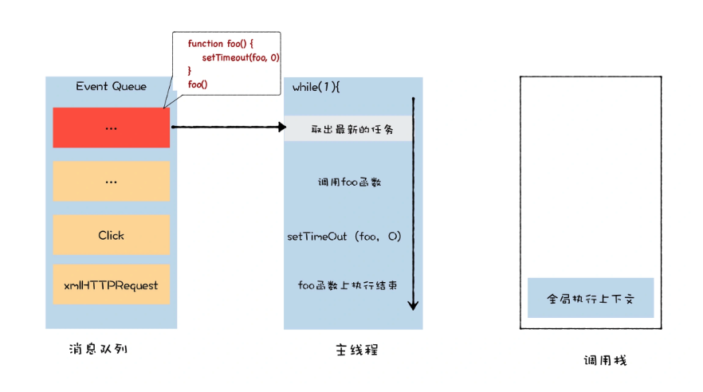

接下来 V8 就要执行 foo 函数了，同样执行 foo 函数时，会创建 foo 函数的执行上下文，并将其压入栈中，最终效果如下图所示

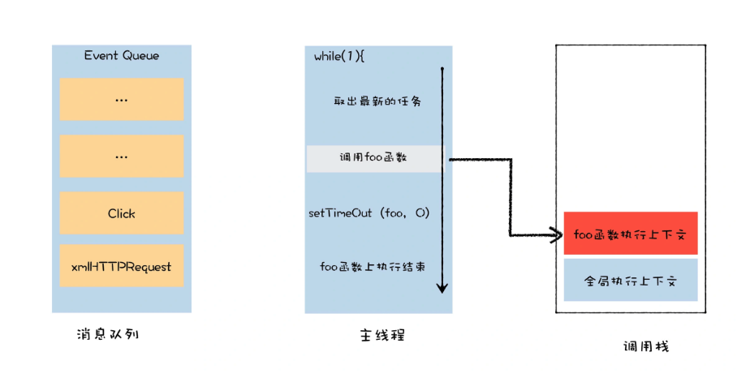

当 V8 执行执行 foo 函数中的 setTimeout 时，setTimeout 会将 foo 函数封装成一个新的宏任务，并将其添加到消息队列中，在 V8 执行 setTimeout 函数时的状态图如下所示：

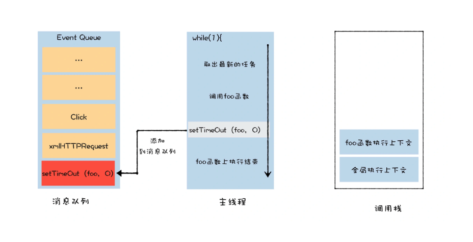

等 foo 函数执行结束，V8 就会结束当前的宏任务，调用栈也会被清空，调用栈被清空后状态如下图所示：

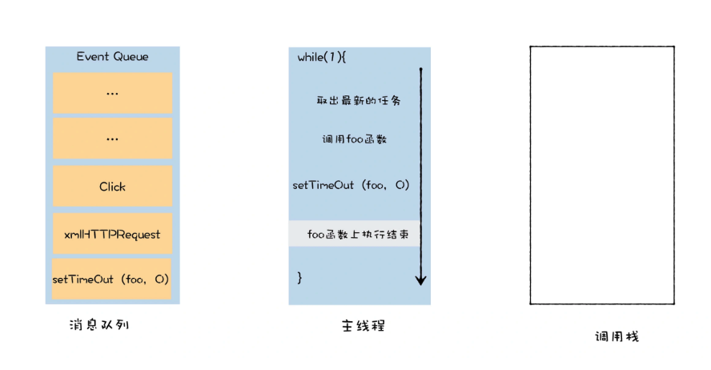

当一个宏任务执行结束之后，忙碌的主线程依然不会闲下来，它会一直重复这个取宏任务、执行宏任务的过程。刚才通过 setTimeout 封装的回调宏任务，也会在某一时刻被主线取出并执行，这个执行过程，就是 foo 函数的调用过程。具体示意图如下所示：

因为 foo 函数并不是在当前的父函数内部被执行的，而是封装成了宏任务，并丢进了消息队列中，然后等待主线程从消息队列中取出该任务，再执行该回调函数 foo，这样就解决了栈溢出的问题。

微任务解决了宏任务执行时机不可控的问题

上面的栈溢出问题虽然某些函数封装成宏任务的方式来解决，但是宏任务需要先被放入到消息队列中，如果某些宏任务执行时间过长，那么就会影响到消息队列后面的宏任务的执行，而且这个影响是不可控的，因为你无法知道前面的宏任务需要多久才能执行完成。

于是 JavaScript 中又引入了微任务，微任务会在当前的任务快要执行结束时执行，利用微任务，你就能比较精准地控制你的回调函数的执行时机。

V8 会为每个宏任务维护一个微任务队列。当 V8 执行一段 JavaScript 时，会为这段代码创建一个环境对象，微任务队列就是存放在该环境对象中的。当你通过 Promise.resolve 生成一个微任务，该微任务会被 V8 自动添加进微任务队列，等整段代码快要执行结束时，该环境对象也随之被销毁，但是在销毁之前，V8 会先处理微任务队列中的微任务。

理解微任务的执行时机，你只需要记住以下两点：

首先，如果当前的任务中产生了一个微任务，通过 Promise.resolve() 或者 Promise.reject() 都会触发微任务，触发的微任务不会在当前的函数中被执行，所以执行微任务时，不会导致栈的无限扩张；

- 其次，和异步调用不同，微任务依然会在当前任务执行结束之前被执行，这也就意味着在当前微任务执行结束之前，消息队列中的其他任务是不可能被执行的。

- 因此在函数内部触发的微任务，一定比在函数内部触发的宏任务要优先执行。

```js
function bar() {
  console.log("bar");
  Promise.resolve().then((str) => console.log("micro-bar"));
  setTimeout((str) => console.log("macro-bar"), 0);
}

function foo() {
  console.log("foo");
  Promise.resolve().then((str) => console.log("micro-foo"));
  setTimeout((str) => console.log("macro-foo"), 0);

  bar();
}
foo();
console.log("global");
Promise.resolve().then((str) => console.log("micro-global"));
setTimeout((str) => console.log("macro-global"), 0);
```

能否在微任务中循环地触发新的微任务？

```js
function foo() {
  return Promise.resolve().then(foo);
}
foo();
```

当执行 foo 函数时，由于 foo 函数中调用了 Promise.resolve()，这会触发一个微任务，那么此时，V8 会将该微任务添加进微任务队列中，退出当前 foo 函数的执行。

然后，V8 在准备退出当前的宏任务之前，会检查微任务队列，发现微任务队列中有一个微任务，于是先执行微任务。由于这个微任务就是调用 foo 函数本身，所以在执行微任务的过程中，需要继续调用 foo 函数，在执行 foo 函数的过程中，又会触发了同样的微任务。

不过，由于 V8 每次执行微任务时，都会退出当前 foo 函数的调用栈，所以这段代码是不会造成栈溢出的。

总结：

调用栈是一种数据结构，用来管理在主线程上执行的函数的调用关系。主线在执行任务的过程中，如果函数的调用层次过深，可能造成栈溢出的错误，我们可以使用 setTimeout 来解决栈溢出的问题。

setTimeout 的本质是将同步函数调用改成异步函数调用，这里的异步调用是将回调函数封装成宏任务，并将其添加进消息队列中，然后主线程再按照一定规则循环地从消息队列中读取下一个宏任务。

消息队列中事件又被称为宏任务，不过，宏任务的时间颗粒度太粗了，无法胜任一些对精度和实时性要求较高的场景，而微任务可以在实时性和效率之间做有效的权衡。

微任务之所以能实现这样的效果，主要取决于微任务的执行时机，微任务其实是一个需要异步执行的函数，执行时机是在主函数执行结束之后、当前宏任务结束之前。

因为微任务依然是在当前的任务中执行的，所以如果在微任务中循环触发新的微任务，那么将导致消息队列中的其他任务没有机会被执行。

19 ｜异步编程（二）：V8 是如何实现 async/await 的？

使用 Generator 函数实现更加线性化逻辑

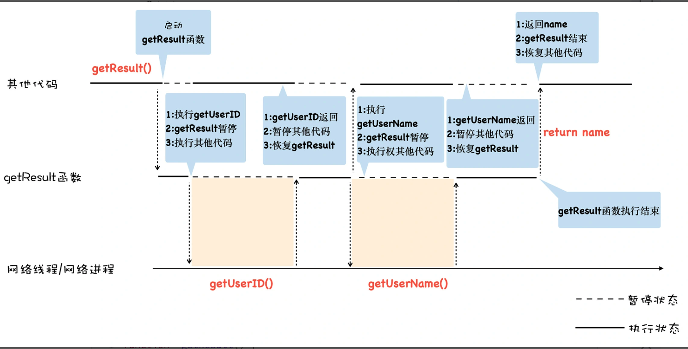

这个模型的关键就是实现函数暂停执行和函数恢复执行，而生成器就是为了实现暂停函数和恢复函数而设计的。

生成器函数是一个带星号函数，配合 yield 就可以实现函数的暂停和恢复，

```js
function* getResult() {
  yield "getUserID";

  yield "getUserName";

  return "name";
}

let result = getResult();

console.log(result.next().value);

console.log(result.next().value);
console.log(result.next().value);
```

其实这就是生成器函数的特性，在生成器内部，如果遇到 yield 关键字，那么 V8 将返回关键字后面的内容给外部，并暂停该生成器函数的执行。生成器暂停执行后，外部的代码便开始执行，外部代码如果想要恢复生成器的执行，可以使用 result.next 方法。

那么 v8 是怎么实现生成器函数的暂停执行和恢复执行的呢？

这背后的魔法就是协程，协程是一种比线程更加轻量级的存在。你可以把协程看成是跑在线程上的任务，一个线程上可以存在多个协程，但是在线程上同时只能执行一个协程。比如，当前执行的是 A 协程，要启动 B 协程，那么 A 协程就需要将主线程的控制权交给 B 协程，这就体现在 A 协程暂停执行，B 协程恢复执行；同样，也可以从 B 协程中启动 A 协程。通常，如果从 A 协程启动 B 协程，我们就把 A 协程称为 B 协程的父协程。

正如一个进程可以拥有多个线程一样，一个线程也可以拥有多个协程

协程不是被操作系统内核所管理，而完全是由程序所控制（也就是在用户态执行）。这样带来的好处就是性能得到了很大的提升，不会像线程切换那样消耗资源。

虽然这种方式看起来像是同步代码，但是实际上它又是异步执行的，也就是说，在执行到 await fetch 的时候，整个函数会暂停等待 fetch 的执行结果，等到函数返回时，再恢复该函数，然后继续往下执行。

其实 async/await 技术背后的秘密就是 Promise 和生成器应用，往底层说，就是微任务和协程应用。要搞清楚 async 和 await 的工作原理，我们就得对 async 和 await 分开分析。

async 是一个通过异步执行并隐式返回 Promise 作为结果的函数。

- 通常，await 可以等待两种类型的表达式：

- 可以是任何普通表达式 ;也可以是一个 Promise 对象的表达式。

如果 await 等待的是一个 Promise 对象，它就会暂停执行生成器函数，直到 Promise 对象的状态变成 resolve，才会恢复执行，然后得到 resolve 的值，作为 await 表达式的运算结果。

总结：

Callback 模式的异步编程模型需要实现大量的回调函数，大量的回调函数会打乱代码的正常逻辑，使得代码变得不线性、不易阅读，这就是我们所说的回调地狱问题。

async 是一个可以暂停和恢复执行的函数，我们会在 async 函数内部使用 await 来暂停 async 函数的执行，await 等待的是一个 Promise 对象，如果 Promise 的状态变成 resolve 或者 reject，那么 async 函数会恢复执行。因此，使用 async/await 可以实现以同步的方式编写异步代码这一目标。

co 的原理是自动识别生成器代码的 yield，做暂停执行和恢复执行的操作

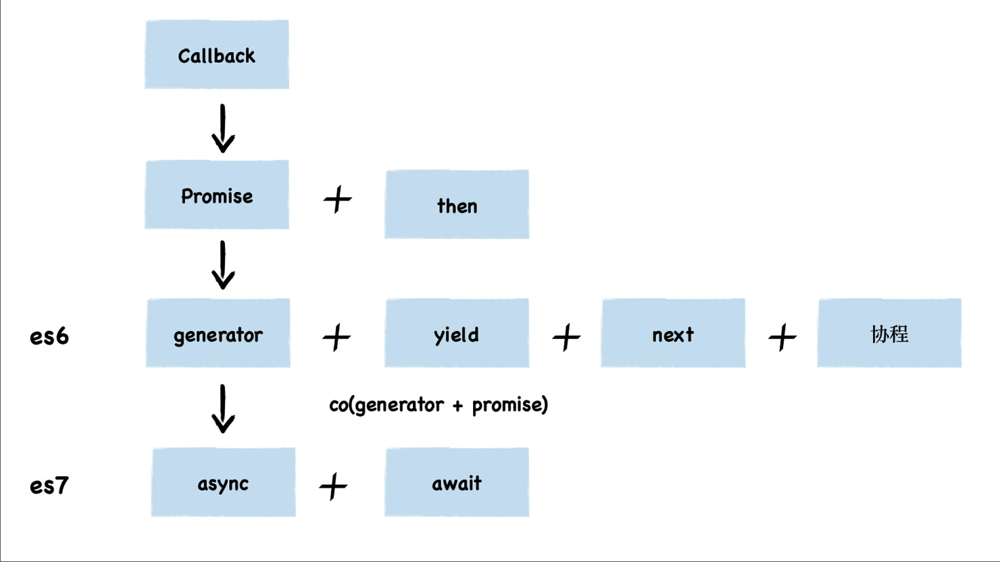

20 | 垃圾回收（一）：V8 的两个垃圾回收器是如何工作的？

垃圾回收算法

第一步，通过 GC Root 标记空间中活动对象和非活动对象。

目前 V8 采用的可访问性（reachability）算法来判断堆中的对象是否是活动对象。具体地讲，这个算法是将一些 GC Root 作为初始存活的对象的集合，从 GC Roots 对象出发，遍历 GC Root 中的所有对象：

- 通过 GC Root 遍历到的对象，我们就认为该对象是可访问的（reachable），那么必须保证这些对象应该在内存中保留，我们也称可访问的对象为活动对象；

- 通过 GC Roots 没有遍历到的对象，则是不可访问的（unreachable），那么这些不可访问的对象就可能被回收，我们称不可访问的对象为非活动对象。

第二步，回收非活动对象所占据的内存。其实就是在所有的标记完成之后，统一清理内存中所有被标记为可回收的对象。

第三步，做内存整理。一般来说，频繁回收对象后，内存中就会存在大量不连续空间，我们把这些不连续的内存空间称为内存碎片。

目前 V8 采用了两个垃圾回收器，主垃圾回收器 -Major GC 和副垃圾回收器 -Minor GC (Scavenger)。V8 之所以使用了两个垃圾回收器，主要是受到了代际假说（The Generational Hypothesis）的影响。

- 第一个是大部分对象都是“朝生夕死”的，也就是说大部分对象在内存中存活的时间很短，比如函数内部声明的变量，或者块级作用域中的变量，当函数或者代码块执行结束时，作用域中定义的变量就会被销毁。因此这一类对象一经分配内存，很快就变得不可访问；

- 第二个是不死的对象，会活得更久，比如全局的 window、DOM、Web API 等对象。

结束语：

比如学习前端这门手艺，栈底到栈顶依次是浏览器架构、Web 网络、事件循环机制、JavaScript 核心、V8 的内存管理、浏览器的渲染流程、Web 安全、CSS、React、Vue、Node、构建工具链等。
