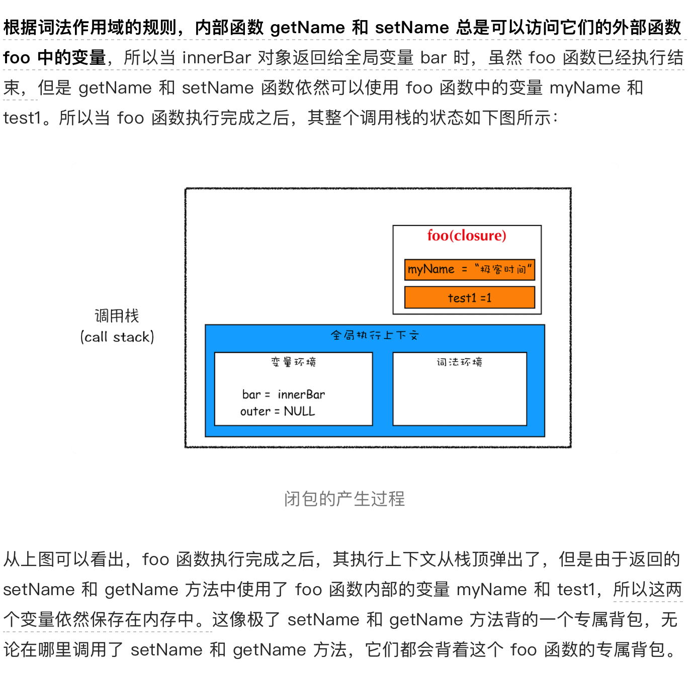
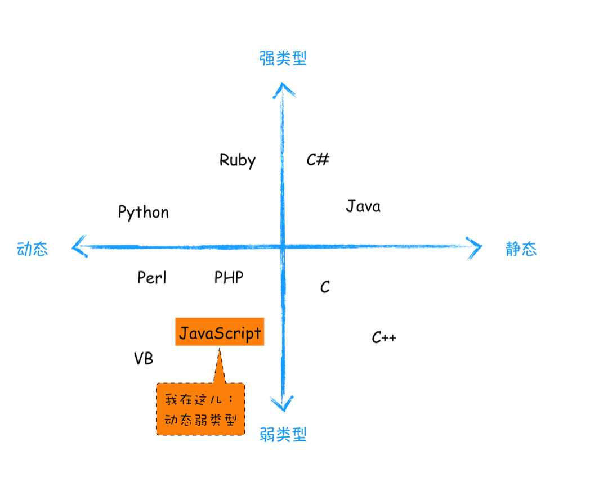

# 浏览器工作原理与实践

## 进程与线程

理解什么是并行处理

多线程可以并行处理任务， 但是线程是不能够单独存在的， 它是由进程来启动和管理的。

一个进程就是一个程序的运行实例。详细解释就是，启动一个程序的时候，操作系统会为该程序创建一块内存，用来存放代码、运行中的数据和一个执行任务的主线程，我们把这样的一个运行环境叫进程


**线程是依附于进程**的，而进程中使用多线程并行处理能提升运算效率。

总结：

1. 进程中的任意一线程执行出错，都会导致整个进程的崩溃。
2. 线程之间共享进程中的数据。

线程 1、线程 2、线程 3 分别把执行的结果写入 A、B、C 中，然后线程 2 继续从 A、B、C 中读取数据，用来显示执行结果。

3. 当一个进程关闭之后，操作系统会回收进程所占用的内存。
4. 进程之间的内容相互隔离。
隔离是为了保护， 避免进程a写入数据到进程b的情况，间通信（ipc）的机制。

单进程浏览器时代
单进程浏览器是指浏览器的所有功能模块都是运行在同一个进程里，这些模块包含了网络、插件、JavaScript 运行环境、渲染引擎和页面等

分析出现的问题

1. 不稳定
渲染引擎模块也是不稳定的，通常一些复杂的 JavaScript 代码就有可能引起渲染引擎模块的崩溃。
2. 不流畅
所有页面的渲染模块、JavaScript 执行环境以及插件都是运行在同一个线程中的，这就意味着同一时刻只能有一个模块可以执行。

```js
function freeze() {
  while (1) {
    console.log("freeze");
  }
}
freeze();
```

浏览器中所有的页面都运行在该线程中，所以这些页面都没有机会去执行任务，这样就会导致整个浏览器失去响应，变卡顿。

页面的内存泄漏也是单进程变慢的一个重要原因。通常浏览器的内核都是非常复杂的，运行一个复杂点的页面再关闭页面，会存在内存不能完全回收的情况，这样导致的问题是使用时间越长，内存占用越高，浏览器会变得越慢。

3. 不安全

插件可以使用 C/C++ 等代码编写，通过插件可以获取到操作系统的任意资源，当你在页面运行一个插件时也就意味着这个插件能完全操作你的电脑。

## 多进程时代


1. 解决不流畅

2. 解决不稳定

采用多进程架构的额外好处是可以使用安全沙箱，

3. 更复杂的体系架构
4. 更高的资源占用

目前多进程架构


最新的 Chrome 浏览器包括：1 个浏览器（Browser）主进程、1 个 GPU 进程、1 个网络（NetWork）进程、多个渲染进程和多个插件进程。

* 浏览器进程。主要负责界面显示、用户交互、子进程管理，同时提供存储等功能。
* 渲染进程。核心任务是将 HTML、CSS 和 JavaScript 转换为用户可以与之交互的网页，排版引擎 Blink 和 JavaScript 引擎 V8 都是运行在该进程中，默认情况下，Chrome 会为每个 Tab 标签创建一个渲染进程。出于安全考虑，渲染进程都是运行在沙箱模式下。
* GPU 进程。其实，Chrome 刚开始发布的时候是没有 GPU 进程的。而 GPU 的使用初衷是为了实现 3D CSS 的效果，只是随后网页、Chrome 的 UI 界面都选择采用 GPU 来绘制，这使得 GPU 成为浏览器普遍的需求。最后，Chrome 在其多进程架构上也引入了 GPU 进程。
* 网络进程。主要负责页面的网络资源加载，之前是作为一个模块运行在浏览器进程里面的，直至最近才独立出来，成为一个单独的进程。
* 插件进程。主要是负责插件的运行，因插件易崩溃，所以需要通过插件进程来隔离，以保证插件进程崩溃不会对浏览器和页面造成影响。

不过会有更高的资源占用，更复杂的体系架构。

面向未来服务的架构


即使是如今的多进程架构，我偶尔还会碰到一些由于单个页面卡死最终崩溃导致所有页面崩溃的情况，请问这是什么原因呢
作者回复: 是这样的，通常情况下是一个页面使用一个进程，但是，有一种情况，叫"同一站点(same-site)"，具体地讲，我们将“同一站点”定义为根域名（例如，geekbang.org）加上协议（例如，https:// 或者http://），还包含了该根域名下的所有子域名和不同的端口，比如下面这三个：

<https://time.geekbang.org>
<https://www.geekbang.org>
<https://www.geekbang.org:8080>
都是属于同一站点，因为它们的协议都是https，而根域名也都是geekbang.org。你也许了解同源策略，但是同一站点和同源策略还是存在一些不同地方，在这里你需要了解它们不是同一件事就行了。

Chrome的默认策略是，每个标签对应一个渲染进程。但是如果从一个页面打开了新页面，而新页面和当前页面属于同一站点时，那么新页面会复用父页面的渲染进程。官方把这个默认策略叫process-per-site-instance。

直白的讲，就是如果几个页面符合同一站点，那么他们将被分配到一个渲染进程里面去。

所以，这种情况下，一个页面崩溃了，会导致同一站点的页面同时崩溃，因为他们使用了同一个渲染进程。

为什么要让他们跑在一个进程里面呢？

因为在一个渲染进程里面，他们就会共享JS的执行环境，也就是说A页面可以直接在B页面中执行脚本。因为是同一家的站点，所以是有这个需求的。

## tcp/ip

### 作用域链和闭包

作用域链

其实在每个执行上下文的变量环境中，都包含了一个外部引用，用来指向外部的执行上下文，我们把这个外部引用称为 outer。

词法作用域。这是因为在 JavaScript 执行过程中，其作用域链是由词法作用域决定的。

词法作用域

**词法作用域就是指作用域是由代码中函数声明的位置来决定的，所以词法作用域是静态的作用域，通过它就能够预测代码在执行过程中如何查找标识符。**

**词法作用域是代码编译阶段就决定好的，和函数是怎么调用的没有关系。**

对象内部的方法称为方法



根据词法作用域的规则，内部函数 getName 和 setName 总是可以访问它们的外部函数 foo 中的变量

在 JavaScript 中，根据词法作用域的规则，内部函数总是可以访问其外部函数中声明的变量，当通过调用一个外部函数返回一个内部函数后，即使该外部函数已经执行结束了，但是内部函数引用外部函数的变量依然保存在内存中，我们就把这些变量的集合称为闭包。比如外部函数是 foo，那么这些变量的集合就称为 foo 函数的闭包。

如果引用闭包的函数是一个全局变量，那么闭包会一直存在直到页面关闭；但如果这个闭包以后不再使用的话，就会造成内存泄漏。

如果该闭包会一直使用，那么它可以作为全局变量而存在；但如果使用频率不高，而且占用内存又比较大的话，那就尽量让它成为一个局部变量。

总结：
首先，介绍了什么是作用域链，我们把通过作用域查找变量的链条称为作用域链；作用域链是通过词法作用域来确定的，而词法作用域反映了代码的结构。其次，介绍了在块级作用域中是如何通过作用域链来查找变量的。最后，又基于作用域链和词法环境介绍了到底什么是闭包。

## v8 工作原理

### 栈空间和堆空间

我们把这种在使用之前就需要确认其变量数据类型的称为静态语言。相反地，我们把在运行过程中需要检查数据类型的语言称为动态语言。

C 编译器会把 int 型的变量悄悄转换为 bool 型的变量，我们通常把这种偷偷转换的操作称为隐式类型转换。而支持隐式类型转换的语言称为弱类型语言，不支持隐式类型转换的语言称为强类型语言。在这点上，C 和 JavaScript 都是弱类型语言。



弱类型，意味着你不需要告诉 JavaScript 引擎这个或那个变量是什么数据类型，JavaScript 引擎在运行代码的时候自己会计算出来。
动态，意味着你可以使用同一个变量保存不同类型的数据。


JavaScript 引擎并不是直接将该对象存放到变量环境中，而是将它分配到堆空间里面，分配后该对象会有一个在“堆”中的地址，然后再将该数据的地址写进 c 的变量值，


为什么要有堆和栈

这是因为 JavaScript 引擎需要用栈来维护程序执行期间上下文的状态，如果栈空间大了话，所有的数据都存放在栈空间里面，那么会影响到上下文切换的效率，进而又影响到整个程序的执行效率。

所以通常情况下，栈空间都不会设置太大，主要用来存放一些原始类型的小数据。而引用类型的数据占用的空间都比较大，所以这一类数据会被存放到堆中，堆空间很大，能存放很多大的数据，不过缺点是分配内存和回收内存都会占用一定的时间。

在 JavaScript 中，赋值操作和其他语言有很大的不同，原始类型的赋值会完整复制变量值，而引用类型的赋值是复制引用地址。
