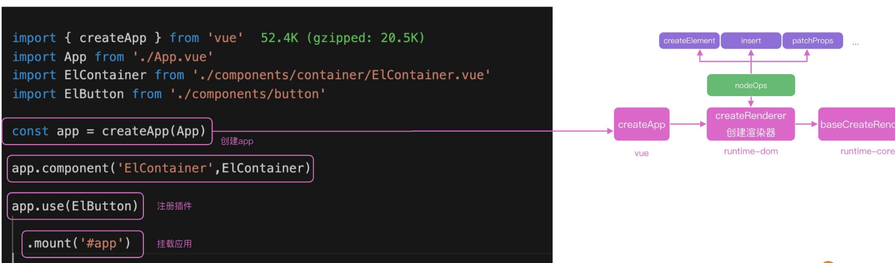
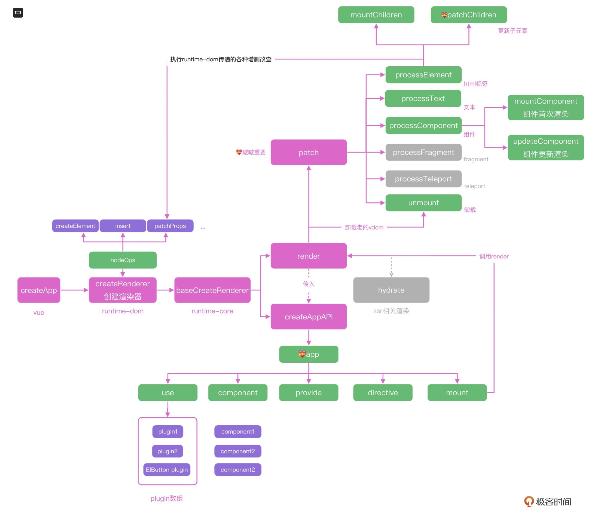
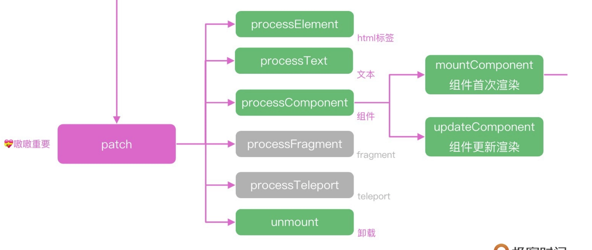
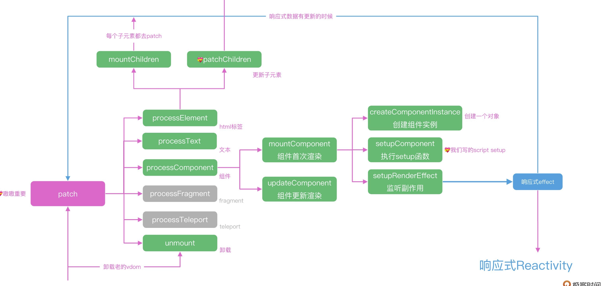
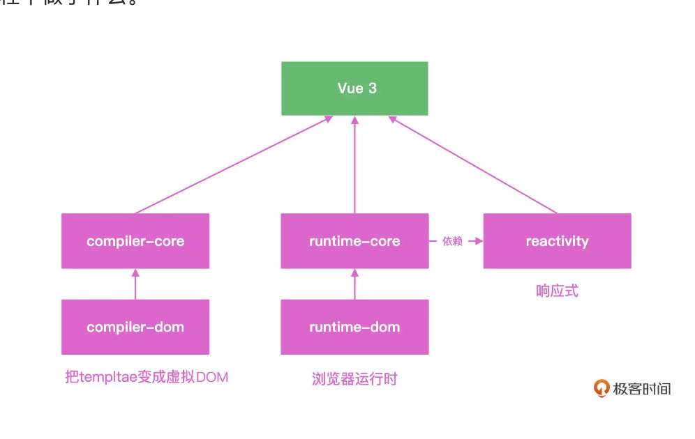
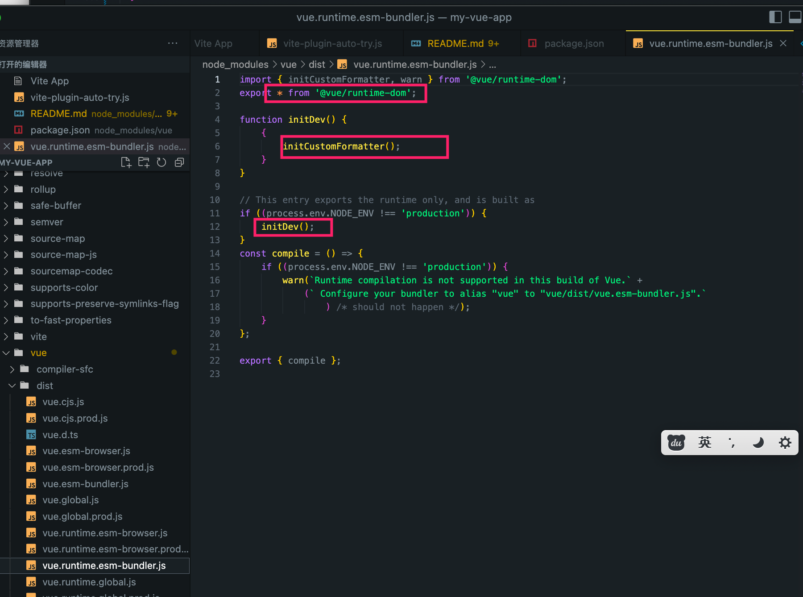
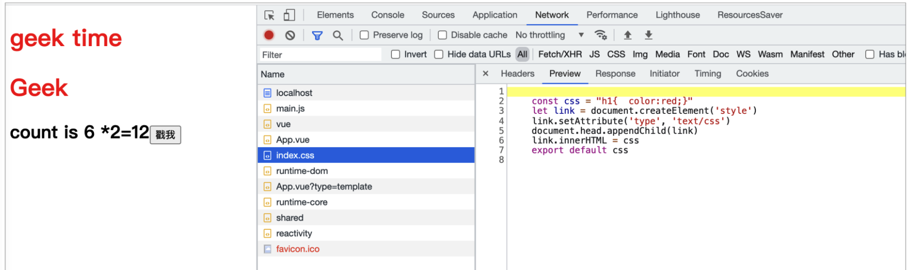

# 玩转 vue 全家桶

响应式数据是主动推送变化，虚拟 DOM 是被动计算数据的 Diff，一个推一个拉，它们看起来是两个方向的技术，但被 Vue 2 很好地融合在一起，采用的方式就是组件级别的划分。对于 Vue 2 来说，组件之间的变化，可以通过响应式来通知更新。组件内部的数据变化，则通过虚拟 DOM 去更新页面。这样就把响应式的监听器，控制在了组件级别，而虚拟 DOM 的量级，也控制在了组件的大小。

在模板的书写上，除了 Vue 和 React 走出的 template 和 JSX 两个路线，还出现了 Svelte 这种框架，没有虚拟 DOM 的库，直接把模板编译成原生 DOM，几乎没有 Runtime，所有的逻辑都在 Compiler 层优化，算是另外一个极致。

Vue 不需要 React 的 Fiber，因为更新系统中的 Watcher 控制在组件级。

1. Vue3 把虚拟 Dom 控制在组件级别，组件之间使用响应式，这就让 Vue3 的虚拟 Dom 不会过于庞大
2. Vue3 虚拟 Dom 的静态标记和自动缓存功能，让静态的节点和属性可以直接绕过 Diff 逻辑，也大大减少了虚拟 Dom 的 Diff 事件
3. 时间切片也会带来额外的系统复杂性

react 和 vue 的主要区别：
1 数据更新上：react 采用 fiber 架构，使用链表表示 DOM 结构可以在 diff 时随时中断和继续，利用 requestIdleCallback 在空闲时 diff，防止数据量大 diff 时间长导致卡顿；vue 采用响应式，一个组件对应一个观察者对象，数据变更触发 dom diff，将 dom diff 控制在组件级别；

## vue3 的新特性

- RFC 机制

- [rfc](https://github.com/vuejs/rfcs)

- 响应式系统

- 自定义渲染器

- 使用最近流行的 monorepo 管理方式，响应式，编译和运行时全部独立

- 平台无关渲染逻辑和浏览器渲染 API


- 全部模块使用 ts 重构

- Composition API 组合语法

关于 composition api 的优势

- 所有 API 都是 import 引入的（现在我们的例子还没有工程化，后续会加入）。用到的功能都 import 进来，对 Tree-shaking 很友好，我的例子里没用到功能，打包的时候会被清理掉 ，减小包的大小。

- 不再上下反复横跳，我们可以把一个功能模块的 methods、data 都放在一起书写，维护更轻松。

- 代码方便复用，可以把一个功能所有的 methods、data 封装在一个独立的函数里，复用代码非常容易。

- Composotion API 新增的 return 等语句，在实际项目中使用


- 新的组件

Vue 3 还内置了 Fragment、Teleport 和 Suspense 三个新组件。

Fragment: Vue 3 组件不再要求有一个唯一的根节点，清除了很多无用的占位 div。

Teleport: 允许组件渲染在别的元素内，主要开发弹窗组件的时候特别有用。

Suspense: 异步组件，更方便开发有异步请求的组件。

新一代工程化工具 Vite


我们使用引入的 ref 函数包裹数字，返回的 count 变量就是响应式的数据，使用 add 函数实现数字的修改。需要注意的是，对于 ref 返回的响应式数据，我们需要修改 .value 才能生效，而在

✿ Options API vs Composition API

      字面上, 选项 API 与 组合 API，细品, 这反映了设计面向的改变：

      1. 选项，谁的选项，关键在“谁”。谁？组件。也是 Vue2.x 的设计基础。组件有什么，
          有状态，有改变状态的方法，有生命周期，还有组件和组件之间的关系。这种情况
          下，“数据”要接受一定的“规矩”，“什么时候能做什么事”，“什么时候有什么表现”；
          这个状态下，开发模式像是“被动接受”。

      2. 组合，什么组合，关键在“什么”。什么？数据。数据的组合。Vue3.x 设计重点变了，数
          据变绝对的C了，现在去组件里串门，不用“守规矩”了，只需要说“我在 onMounted 的时
          候要这样这样，你看着办”，真只能的以“数据”为中心，没人能管得了了，想去哪就去哪，
          自然就灵活了

      至于这些是怎么做到由“被动接受”到“主动告知”的，实现这部分内容，我很期待。

✿ 模板语法更好用

      <script setup> 像是“语法糖”，很甜；<style>里能用 v-bind，以后开发可以
      少用“黑科技”了，双手点赞。

✿ 至于思考题

      Vue 本来就属于 DSL，语法方面各有偏好，见仁见智；响应式和生命周期需要 import，个
      人认为就代表了从之前的“被动主动”转向“主动告知”，这样设计更加灵活。从此一条主线在
      ”数据"，以后查 bug 顺着这条 "线" 应该更加容易了。

本次课程的知识点可以在 Vue3 官网进行详细学习：

1. 组合式 API ： <https://v3.cn.vuejs.org/api/composition-api.html#setup>
2. 单文件组件 <script setup> ：<https://v3.cn.vuejs.org/api/sfc-script-setup.html>
3. 单文件组件样式特性：<https://v3.cn.vuejs.org/api/sfc-style.html>

将值封装在一个对象中，看似没有必要，但为了保持 JavaScript 中不同数据类型的行为统一，这是必须的。这是因为在 JavaScript 中，Number 或 String 等基本类型是通过值而非引用传递的：在任何值周围都有一个封装对象，这样我们就可以在整个应用中安全地传递它，而不必担心在某个地方失去它的响应性

Vue 3 的 reactive 函数可以把一个对象变成响应式数据，而 reactive 就是基于 Proxy 实现的。我们还可以通过 watchEffect，在 obj.count 修改之后，执行数据的打印。

利用对象的 get 和 set 函数来进行监听，这种响应式的实现方式，只能拦截某一个属性的修改，这也是 Vue 3 中 ref 这个 API 的实现。在下面的代码中，我们拦截了 count 的 value 属性，并且拦截了 set 操作，也能实现类似的功能。

```js
let getDouble = (n) => n * 2;
let _value = 1;
double = getDouble(_value);

let count = {
  get value() {
    return _value;
  },
  set value(val) {
    _value = val;
    double = getDouble(_value);
  },
};
console.log(count.value, double);
count.value = 2;
console.log(count.value, double);
```


至于文中说的 Vue 3 的 ref 是用 “getter

         setter” 实现的，我的认识是，一个是“初始化”时的行为，一个是“改变行为”。

3. useXXX 为什么会这么灵活？
   像之前的 Composition API 我理解的是 Vue 的组织单位由 “组件” 变成 “数据” 了，
   现在组件在引入 useXXX，关注点在 XXX，至于 XXX 跟什么有联系，那是你的事情，在
   你自己的 useXXX 里去实现。

本节提到的 React Hooks 也有异曲同工的意思，Hooks 直接翻译成什么？“钩子”，用来
做什么？“钩东西”，钩什么？那先说下这个东西出来之前有什么。

React Hooks 出来之前 React 主要构建 App 还是用 Class Component，当然也有
functional component，这俩区别就在于 class 有状态，functional 比较“纯粹”没有
状态。这样复用成问题，得用什么高阶组件之类的方式。然后，在某一时刻，同样的问
题出现了，React 复用组件的也是以带状态的 Class 组件为主，“复杂”了，不纯粹。

应用越大，这种模式开发或维护越复杂。然后 Hooks 出现了，现在 React 都用
“functional” 组件，但是有“状态”的，状态哪里来的 “Hook” 过来的，钩过来的。
组件“不负责”维护状态，useXXX 去管理了。

## 数据流

我们使用 state 定义数据，使用 mutation 定义修改数据的逻辑，并且在组件中使用 commit 去调用 mutations。在此基础之上，还可以用 getters 去实现 Vuex 世界的计算属性，使用 action 来去定义异步任务，并且在内部调用 mutation 去同步数据。

Vuex 的出现，让我们整个项目中的数据流动变得非常自然。数据流向组件，但组件不能直接修改数据，而是要通过 mutation 提出申请，mutation 去修改数据，形成了一个圆环。

## 路由

在 vue-router 中对应两个函数，分别是 createWebHashHistory 和 createWebHistory。


hash 模式

```js
window.addEventListener("hashchange", fn);
```

history 模式

因为 HTML5 标准发布，浏览器多了两个 API：pushState 和 replaceState。

```js
window.addEventListener("popstate", fn);
```

## 调试

[Vue devtool](https://devtools.vuejs.org/guide/faq.html#the-vue-devtools-don-t-show-up)

## jsx

h 函数内部执行 createVNode，并返回虚拟 DOM，而 JSX 最终也是解析为 createVnode 执行。

JSX 可以支持更动态的需求。而 template 则因为语法限制原因，不能够像 JSX 那样可以支持更动态的需求。

JSX 相比于 template 还有一个优势，是可以在一个文件内返回多个组件，


比如在 p 标签上，使用 8 这个数字标记当前标签时，只有 props 是动态的。而在虚拟 DOM 计算 Diff 的过程中，可以忽略掉 class 和文本的计算，这也是 Vue 3 的虚拟 DOM 能够比 Vue 2 快的一个重要原因。

一些 知识点总结

- [h 函数](https://v3.cn.vuejs.org/api/global-api.html#h)
- [element3](https://github.com/hug-sun/element3/blob/master/packages/element3/packages/timeline/Timeline.vue#L35)
- [template explorer](https://vue-next-template-explorer.netlify.app/#eyJzcmMiOiI8ZGl2IGlkPVwiYXBwXCI+XG4gICAgPGRpdiBAY2xpY2s9XCIoKT0+Y29uc29sZS5sb2coeHgpXCIgIG5hbWU9XCJoZWxsb1wiPnt7bmFtZX19PC9kaXY+XG4gICAgPGgxID7mioDmnK/mkbjpsbw8L2gxPlxuICAgIDxwIDppZD1cIm5hbWVcIiBjbGFzcz1cImFwcFwiPuaegeWuouaXtumXtDwvcD5cbjwvZGl2PlxuIiwic3NyIjpmYWxzZSwib3B0aW9ucyI6eyJob2lzdFN0YXRpYyI6dHJ1ZSwiY2FjaGVIYW5kbGVycyI6dHJ1ZSwib3B0aW1pemVCaW5kaW5ncyI6ZmFsc2V9fQ==)

## TypeScript

1. vue3 写的 ts 的组件能供 vue2 使用吗
2. 市面上 有没有相关的 例如京东 小程序端的组件 ui

首先要讲到的进阶用法是泛型，泛型就是指有些函数的参数，你在定义的时候是不确定的类型，而返回值类型需要根据参数来确定。

```ts
function test<某种类型>(args: 某种类型): 某种类型 {
  return args;
}
```

```ts
function getProperty<某种类型, 某种属性 extends keyof 某种类型>(
  o: 某种类型,
  name: 某种属性
): 某种类型[某种属性] {
  return o[name];
}
function getProperty<T, K extends keyof T>(o: T, name: K): T[K] {
  return o[name];
}
```

## Vue

## 开发中的权限系统

那时候前后端不分家，整个应用的入口是后端控制模板的渲染。在模板渲染前，后端会直接判断路由的权限来决定是否跳转。登录的时候，后端只需要设置 setCookie 这个 header，之后浏览器会自动把 cookie 写入到我们的浏览器存起来，然后当前域名在发送请求的时候都会自动带上这个 cookie。

可以把 token 理解为手动管理的 cookie

可以用动态路由 来控制权限

```js
addRoutes({
    commit
}, accessRoutes) {
    // 添加动态路由，同时保存移除函数，将来如果需要重置路由可以用到它们
    const removeRoutes = []
    accessRoutes.forEach(route => {
        const removeRoute = router.addRoute(route)
        removeRoutes.push(removeRoute)
    })
    commit('SET_REMOVE_ROUTES', removeRoutes)
},
```

我们需要在 localStorage 中把静态路由和动态路由分开对待，在页面刷新的时候，通过 src/router/index.js 入口文件中的 routes 配置，从 localStorage 中获取完整的路由信息，并且新增到 vue-router 中，才能加载完整的路由。

与新增路由对应，在页面重新设置权限的时候，我们需要用 router.removeRoute 来删除注册的路由，这也是上面的代码中我们还有一个 remoteRoutes 来管理动态路由的原因。

首先，token 的过期时间认证是由后端来实现和完成的。如果登录状态过期，那么会有一个单独的报错信息，我们需要在接口拦截函数中，统一对接口的响应结果进行拦截。如果报错信息显示的是登录过期，我们需要清理所有的 token 和页面权限数据，并且跳转到登录页面。

实现按钮级别的权限认证:

1. 维护页面下需要控制权限的按钮权限标识，后台保存；
2. 登录后，获取权限数据，将该用户的按钮权限数组存放到对应页面的路由信息里；
3. 可编写 v-auth 的自定义指令（可以拿当前按钮标识去当前页面路由信息的按钮权限数组里去找，存在则显示，否则隐藏）；

## vue3 中如何集成第三方框架

## vue3 项目中的性能优化

网络请求优化和代码效率优化

网络请求优化： 对其他域名去做 dns 的预解析

```js
dns - prefetch;
```

首先是 First Contentful Paint，通常简写为 FCP，它表示的是页面上呈现第一个 DOM 元素的时间。在此之前，页面都是白屏的状态；然后是 Time to interactive，通常简写为 TTI，也就是页面可以开始交互的时间；还有和用户体验相关的 Largest Contentful Paint，通常简写为 LCP，这是页面视口上最大的图片或者文本块渲染的时间，在这个时间，用户能看到渲染基本完成后的首页，这也是用户体验里非常重要的一个指标。

```js
let timing = window.performance && window.performance.timing;
let navigation = window.performance && window.performance.navigation;

// DNS 解析：
let dns = timing.domainLookupEnd - timing.domainLookupStart;

// 总体网络交互耗时：
let network = timing.responseEnd - timing.navigationStart;

// 渲染处理：
let processing = (timing.domComplete || timing.domLoading) - timing.domLoading;

// 可交互：
let active = timing.domInteractive - timing.navigationStart;
```

资料：

[浏览器工作原理与实践](https://time.geekbang.org/column/intro/100033601?tab=catalog)

## 项目的优化


当你开始考虑上图中每一个环节的优化项，当你开始思考左侧的组件如何能在多个项目复用？整体项目的性能如何优化？项目打包上线的过程如何更稳定？如何提前发现项目中的报错等等问题的时候，亮点也就随之诞生了

参照 react 的 fiber 架构：requestIdleCallback

```js
let count = 0;
const workLoop = async (deadline) => {
  // 计算，并且当前帧还没结束
  while (count < chunks.length && deadline.timeRemaining() > 1) {
    await appendToSpark(chunks[count].file);
    count++;
    // 没有了 计算完毕
    if (count < chunks.length) {
      // 计算中
      this.hashProgress = Number(((100 * count) / chunks.length).toFixed(2));
      // console.log(this.hashProgress)
    } else {
      // 计算完毕
      this.hashProgress = 100;
      resolve(spark.end());
    }
  }
  window.requestIdleCallback(workLoop);
};
window.requestIdleCallback(workLoop);
```

## 代码效率的优化

比如 computed 内置有缓存机制，比使用 watch 函数好一些；组件里也优先使用 template 去激活 Vue 内置的静态标记，也就是能够对代码执行效率进行优化；v-for 循环渲染一定要有 key，从而能够在虚拟 DOM 计算 Diff 的时候更高效复用标签等等

## 用户体验优化

为了提高用户的体验，我们可以选择断点续传，也就是把文件切分成小块后，挨个上传。这样即使中间上传中断，但下次再上传时，只上传缺失的那些部分就可以了。可以看到，断点上传虽然在性能上，会造成网络请求变多的问题，但也极大地提高了用户上传的体验。

还有很多组件库也会提供骨架图的组件，能够在页面还没有解析完成之前，先渲染一个页面的骨架和 loading 的状态，这样用户在页面加载的等待期就不至于一直白屏，下图所示就是 antd-vue 组件库骨架图渲染的结果。

## 如何打包发布你的 Vue3 应用

## 深入 TypeScript

```ts
[type T = arg 的类型]

function identity0(arg: any): any {
    return arg
}
// 相当于type T = arg的类型
function identity<T>(arg: T): T {
    return arg
}
identity<string>('玩转vue 3全家桶') // 这个T就是string，所以返回值必须得是string
identity<number>(1)
```

keyof 可以帮助我们拆解已有类型，下一步我们需要使用 extends 来实现类型系统中的条件判断。我们定义类型函数 ExtendsType，接受泛型参数 T 后，通过判断 T 是不是布尔值来返回不同的类型字符串，我们就可以通过 ExtendsType 传入不同的参数去返回不同的类型。

extends 相当于 TypeScript 世界中的条件语句，然后 in 关键字可以理解为 TypeScript 世界中的遍历。

```ts
// T extends U ? X : Y 类型三元表达式

type ExtendsType<T> = T extends boolean ? "重学前端" : "玩转Vue 3";
type ExtendsType1 = ExtendsType<boolean>; // type ExtendsType1='重学前端'
type ExtendsType2 = ExtendsType<string>; // type ExtendsType2='玩转Vue 3'
```

```ts
type Courses = "玩转Vue 3" | "重学前端";
type CourseObj = {
  [k in Courses]: number; // 遍历Courses类型作为key
};
// 上面的代码等于下面的定义
// type CourseObj = {
//     玩转Vue 3: number;
//     重学前端: number;
// }
```

## 想问一下 type 和 interface 有什么区别? 什么时候用 type, 什么时候用 interface?

// todo 归纳下区别
type 和 interface 都可以描述一个对象或者函数，并且都可以扩展，有几个小区别，首先 type 可以设置类型的别名，比如 type Vue = string , 还可以用 typeof 获取实例的类型，interface 可以直接合并申明，默认直接用 interface 即可


关于样式 scss

```scss
// bem

$namespace: "el";
@mixin b($block) {
  $B: $namespace + "-" + $block !global;
  .#{$B} {
    @content;
  }
}

// 添加ben后缀啥的
@mixin when($state) {
  @at-root {
    &.#{$state-prefix + $state} {
      @content;
    }
  }
}
```

## 配置 husy

```JS
const msg = require('fs')
    .readFileSync('.git/COMMIT_EDITMSG', 'utf-8')
    .trim()

const commitRE = /^(revert: )?(feat|fix|docs|dx|style|refactor|perf|test|workflow|build|ci|chore|types|wip|release)(\(.+\))?: .{1,50}/
const mergeRe = /^(Merge pull request|Merge branch)/
if (!commitRE.test(msg)) {
    if (!mergeRe.test(msg)) {
        console.log('git commit信息校验不通过')

        console.error(`git commit的信息格式不对, 需要使用 title(scope): desc的格式
      比如 fix: xxbug
      feat(test): add new
      具体校验逻辑看 scripts/verifyCommit.js
    `)
        process.exit(1)
    }

} else {
    console.log('git commit信息校验通过')
}
```


### 单测

TDD 开发一个组件

```JS
module.exports = {
    transform: {
        // .vue文件用 vue-jest 处理
        '^.+\\.vue$': 'vue-jest',
        // .js或者.jsx用 babel-jest处理
        '^.+\\.jsx?$': 'babel-jest',
        //.ts文件用ts-jest处理
        '^.+\\.ts$': 'ts-jest'
    },
    testMatch: ['**/?(*.)+(spec).[jt]s?(x)']
}
```

我们首先要从 @vue/test-utils 库中导入 mount 函数，这个函数可以在命令行里模拟 Vue 的组件渲染。在 Button 的 slot 传递了文本之后，wrapper.text() 就能获取到文本内容，然后对 Button 渲染结果进行判断。

通过 scss 控制浏览器页面内的大小

```scss
@include b(button) {
  display: inline-block;
  cursor: pointer;
  background: $--button-default-background-color;
  color: $--button-default-font-color;
  @include button-size(
    $--button-padding-vertical,
    $--button-padding-horizontal,
    $--button-font-size,
    $--button-border-radius
  );
  @include m(small) {
    @include button-size(
      $--button-medium-padding-vertical,
      $--button-medium-padding-horizontal,
      $--button-medium-font-size,
      $--button-medium-border-radius
    );
  }
  @include m(large) {
    @include button-size(
      $--button-large-padding-vertical,
      $--button-large-padding-horizontal,
      $--button-large-font-size,
      $--button-large-border-radius
    );
  }
}
```

还可以通过全局配置的方式设置默认大小。我们进入到代码文件 src/main.ts 中，设置全局变量 $AILEMENTE 中的 size 为 large，

```JS
const app = createApp(App)
app.config.globalProperties.$AILEMENTE = {
    size: 'large'
}
app.use(ElContainer)
    .use(ElButton)
    .mount('#app')
```

首先我们要支持全局的 size 配置，在 src 目录下新建 util.ts，写入下面的代码。我们通过 vue 提供的 getCurrentInstance 获取当前的实例，然后返回全局配置的 $AILEMENTE。这里请注意，由于很多组件都需要读取全局配置，所以我们封装了 useGlobalConfig 函数。

```JS
import {
    getCurrentInstance,
    ComponentInternalInstance
} from 'vue'

export function useGlobalConfig() {
    const instance: ComponentInternalInstance | null = getCurrentInstance()
    if (!instance) {
        console.log('useGlobalConfig 必须得在setup里面整')
        return
    }
    return instance.appContext.config.globalProperties.$AILEMENTE || {}

}
```

### 实现一个表单组件

拆分成三个部分
form 提供了所有的数据对象和配置规则；
input 负责具体的输入交互；
form-item 负责中间的数据和规则管理，以及显示具体的报错信息。
这就需要一个强有力的组件通信机制，在 Vue 中组件之间的通信机制有这么几种。

那么 form 和 input 组件如何通信呢？这种祖先元素和后代元素，中间可能嵌套了很多层的关系，Vue 则提供了 provide 和 inject 两个 API 来实现这个功能

在组件中我们可以使用 provide 函数向所有子组件提供数据，子组件内部通过 inject 函数注入使用。注意这里 provide 提供的只是普通的数据，并没有做响应式的处理，如果子组件内部需要响应式的数据，那么需要在 provide 函数内部使用 ref 或者 reative 包裹才可以。

关于 prvide 和 inject 的类型系统，我们可以使用 Vue 提供的 InjectiveKey 来声明。我们在 form 目录下新建 type.ts 专门管理表单组件用到的相关类型，在下面的代码中，我们定义了表单 form 和表单管理 form-item 的上下文，并且通过 InjectionKey 管理提供的类型。

## 自定义渲染器

渲染器是围绕虚拟 Dom 存在的。在浏览器中，我们把虚拟 Dom 渲染成真实的 Dom 对象，Vue 源码内部把一个框架里所有和平台相关的操作，抽离成了独立的方法。

基本上做的事情:

首先用 createElement 创建标签，还有用 createText 创建文本。创建之后就需要用 insert 新增元素，通过 remote 删除元素，通过 setText 更新文本和 patchProps 修改属性。然后再实现 parentNode、nextSibling 等方法实现节点的查找关系。

```js

export const nodeOps: Omit<RendererOptions<Node, Element>, 'patchProp'> = {
  //插入元素
  insert: (child, parent, anchor) => {
    parent.insertBefore(child, anchor || null)
  },
  // 删除元素
  remove: child => {
    const parent = child.parentNode
    if (parent) {
      parent.removeChild(child)
    }
  },
  // 创建元素
  createElement: (tag, isSVG, is, props): Element => {
    const el = isSVG
      ? doc.createElementNS(svgNS, tag)
      : doc.createElement(tag, is ? { is } : undefined)

    if (tag === 'select' && props && props.multiple != null) {
      ;(el as HTMLSelectElement).setAttribute('multiple', props.multiple)
    }

    return el
  }
  //...其他操作函数
}

```

上面这段代码是 vue 提供浏览器端操作的函数, 这些 DOM 编程接口完成了浏览器端的增加、删除和添加操作

但是 若想实现跨端能力，渲染器则本身不能依赖任何平台下特有的接口

```js
export default function createRenderer(options) {
  const {
    insert: hostInsert,
    remove: hostRemove,
    patchProp: hostPatchProp,
    createElement: hostCreateElement,
    createText: hostCreateText,
    createComment: hostCreateComment,
    setText: hostSetText,
    setElementText: hostSetElementText,
    parentNode: hostParentNode,
    nextSibling: hostNextSibling,
    setScopeId: hostSetScopeId = NOOP,
    cloneNode: hostCloneNode,
    insertStaticContent: hostInsertStaticContent,
  } = options;

  function render(vnode, container) {}

  function mount(vnode, container, isSVG, refNode) {}

  function mountElement(vnode, container, isSVG, refNode) {}

  function mountText(vnode, container) {}

  function patch(prevVNode, nextVNode, container) {}

  function replaceVNode(prevVNode, nextVNode, container) {}
  function patchElement(prevVNode, nextVNode, container) {}
  function patchChildren(
    prevChildFlags,
    nextChildFlags,
    prevChildren,
    nextChildren,
    container
  ) {}

  function patchText(prevVNode, nextVNode) {}
  function patchComponent(prevVNode, nextVNode, container) {}

  return { render };
}
```

对比一下：经过渲染器抽离之后，内部的 mountElement 就会把所有 document 的操作全部换成 options 传递进来的 hostCreate 函数。

```js

function mountElement(vnode, container, isSVG, refNode) {
  const el = isSVG
    ? document.createElementNS(....)
    : document.createElement(vnode.tag)
}


```

```javascript
function mountElement(vnode, container, isSVG, refNode) {
  const el = hostCreateElement(vnode.tag, isSVG);
}
```

runtime-core 包还可以封装其他平台的渲染器，Vue 组件和 Vue 的各种 API

```javascript
const { render } = createRenderer({
  nodeOps: {
    createElement() {},
    createText() {},
    // more...
  },
  patchData,
});
```

上面的代码创建一个具体平台的渲染器， 例如：runtime-dom 中实现具体的步骤， 其功能包括处理原生 DOM API 和 DOM 事件和 DOM 属性等

自定义渲染

自定义渲染器让 Vue 脱离了浏览器的限制，我们只需要实现平台内部的增删改查函数后，就可以直接对接 Vue 3。比方说，我们可以把 Vue 渲染到小程序平台，实现 Vue 3-minipp；也可以渲染到 Canvas，实现 vue 3-canvas，把虚拟 dom 渲染成 Canvas；甚至还可以尝试把 Vue 3 渲染到 threee.js 中，在 3D 世界使用响应式开发。

首先我们了解了自定义渲染器的原理，就是把所有的增删改查操作暴露出去，使用的时候不需要知道内部的实现细节，我们只需要针对每个平台使用不同的 API 即可。

```javascript
const { createApp: originCa } = createRenderer({
  insert: (child, parent, anchor) => {
    if (typeof child == "string") {
      parent.text = child;
    } else {
      child.parent = parent;
      if (!parent.child) {
        parent.child = [child];
      } else {
        parent.child.push(child);
      }
    }
    if (parent.nodeName) {
      draw(child);
      if (child.onClick) {
        ctx.canvas.addEventListener(
          "click",
          () => {
            child.onClick();
            setTimeout(() => {
              draw(child);
            });
          },
          false
        );
      }
    }
  },
  createElement(type, isSVG, isCustom) {
    return {
      type,
    };
  },
  setElementText(node, text) {
    node.text = text;
  },
  patchProp(el, key, prev, next) {
    el[key] = next;
  },
});
```

```js
import { createRenderer } from "@vue/runtime-core";
import * as THREE from "three";
import { nextTick } from "@vue/runtime-core";

let renderer;

function draw(obj) {
  const {
    camera,
    cameraPos,
    scene,
    geometry,
    geometryArg,
    material,
    mesh,
    meshY,
    meshX,
  } = obj;
  if (
    [
      camera,
      cameraPos,
      scene,
      geometry,
      geometryArg,
      material,
      mesh,
      meshY,
      meshX,
    ].filter((v) => v).length < 9
  ) {
    return;
  }
  let cameraObj = new THREE[camera](
    40,
    window.innerWidth / window.innerHeight,
    0.1,
    10
  );
  Object.assign(cameraObj.position, cameraPos);

  let sceneObj = new THREE[scene]();

  let geometryObj = new THREE[geometry](...geometryArg);
  let materialObj = new THREE[material]();

  let meshObj = new THREE[mesh](geometryObj, materialObj);
  meshObj.rotation.x = meshX;
  meshObj.rotation.y = meshY;
  sceneObj.add(meshObj);
  renderer.render(sceneObj, cameraObj);
}

const { createApp: originCa } = createRenderer({
  insert: (child, parent, anchor) => {
    if (parent.domElement) {
      draw(child);
    }
  },
  createElement(type, isSVG, isCustom) {
    return {
      type,
    };
  },
  setElementText(node, text) {},
  patchProp(el, key, prev, next) {
    el[key] = next;
    draw(el);
  },
  parentNode: (node) => node,
  nextSibling: (node) => node,
  createText: (text) => text,
  remove: (node) => node,
});
function createApp(...args) {
  const app = originCa(...args);
  return {
    mount(selector) {
      renderer = new THREE.WebGLRenderer({ antialias: true });
      renderer.setSize(window.innerWidth, window.innerHeight);
      document.body.appendChild(renderer.domElement);
      app.mount(renderer);
    },
  };
}
export { createApp };
```

在 Vue 渲染器的设计中就是把 document 所有的操作都抽离成 nodeOps, 并且通过调用 Vue 的 createRenderer 函数创建平台的渲染器。

## 响应式

响应式机制的主要功能就是，可以把普通的 JavaScript 对象封装成为响应式对象，拦截数据的获取和修改操作，实现依赖数据的自动化更新。

一个最简单的响应式模型，我们可以通过 reactive 或者 ref 函数，把数据包裹成响应式对象，并且通过 effect 函数注册回调函数，然后在数据修改之后，响应式地通知 effect 去执行回调函数即可。


上图的依赖地图 targetMap 把每个对象 拥有的属性 -> 映射的 effect

在 effect 中获取 counter.num1 和 counter.num2 的时候，就会触发 counter 的 get 拦截函数；get 函数，会把当前的 effect 函数注册到一个全局的依赖地图中去。这样 counter.num1 在修改的时候，就会触发 set 拦截函数，去依赖地图中找到注册的 effect 函数，然后执行。

我们

```javascript
const get = createGetter();
const set = createSetter();

function createGetter(shallow = false) {
  return function get(target, key, receiver) {
    const res = Reflect.get(target, key, receiver);
    track(target, "get", key);
    if (isObject(res)) {
      // 值也是对象的话，需要嵌套调用reactive
      // res就是target[key]
      // 浅层代理，不需要嵌套
      return shallow ? res : reactive(res);
    }
    return res;
  };
}

function createSetter() {
  return function set(target, key, value, receiver) {
    const result = Reflect.set(target, key, value, receiver);
    // 在触发 set 的时候进行触发依赖
    trigger(target, "set", key);
    return result;
  };
}
export const mutableHandles = {
  get,
  set,
};
```

响应式机制的主要功能就是，可以把普通的 JavaScript 对象封装成为响应式对象，拦截数据的获取和修改操作，实现依赖数据的自动化更新。

### 万能的面试题，怎么手写响应式系统

所以，一个最简单的响应式模型，我们可以通过 reactive 或者 ref 函数，把数据包裹成响应式对象，并且通过 effect 函数注册回调函数，然后在数据修改之后，响应式地通知 effect 去执行回调函数即可。

```js
export function reactive(target) {
  if (typeof target !== "object") {
    console.warn(`reactive  ${target} 必须是一个对象`);
    return target;
  }

  return new Proxy(target, mutableHandlers);
}
```

reactive 是通过 ES6 中的 Proxy 特性实现的属性拦截

Vue3 中除了 reactive 还有很多别的函数需要实现，比如只读的响应式数据、浅层代理的响应式数据等，并且 reactive 中针对 ES6 的代理也需要单独的处理。

```js
const get = createGetter();
const set = createSetter();

function createGetter(shallow = false) {
  return function get(target, key, receiver) {
    const res = Reflect.get(target, key, receiver);
    track(target, "get", key);
    if (isObject(res)) {
      // 值也是对象的话，需要嵌套调用reactive
      // res就是target[key]
      // 浅层代理，不需要嵌套
      return shallow ? res : reactive(res);
    }
    return res;
  };
}

function createSetter() {
  return function set(target, key, value, receiver) {
    const result = Reflect.set(target, key, value, receiver);
    // 在触发 set 的时候进行触发依赖
    trigger(target, "set", key);
    return result;
  };
}
export const mutableHandles = {
  get,
  set,
};
```

- get 中直接返回读取的数据，这里的 Reflect.get 和 target[key]实现的结果是一致的；并且返回值是对象的话，还会嵌套执行 reactive，并且调用 track 函数收集依赖。

- set 中调用 trigger 函数，执行 track 收集的依赖。

```js
const get = createGetter();
const set = createSetter();

function createGetter(shallow = false) {
  return function get(target, key, receiver) {
    const res = Reflect.get(target, key, receiver);
    track(target, "get", key);
    if (isObject(res)) {
      // 值也是对象的话，需要嵌套调用reactive
      // res就是target[key]
      // 浅层代理，不需要嵌套
      return shallow ? res : reactive(res);
    }
    return res;
  };
}

function createSetter() {
  return function set(target, key, value, receiver) {
    const result = Reflect.set(target, key, value, receiver);
    // 在触发 set 的时候进行触发依赖
    trigger(target, "set", key);
    return result;
  };
}
export const mutableHandles = {
  get,
  set,
};
```


在 track 函数中，我们可以使用一个巨大的 tragetMap 去存储依赖关系。map 的 key 是我们要代理的 target 对象，值还是一个 depsMap，存储这每一个 key 依赖的函数，每一个 key 都可以依赖多个 effect。上面的代码执行完成，depsMap 中就有了 num1 和 num2 两个依赖。

依赖地图的格式

```js
targetMap = {
 target: {
   key1: [回调函数1，回调函数2],
   key2: [回调函数3，回调函数4],
 }  ,
  target1: {
   key3: [回调函数5]
 }

}
```

#### triggerMap

用 map 才可以把 target 作为 key 来管理管理 target

```js
const targetMap = new WeakMap();

export function track(target, type, key) {
  // console.log(`触发 track -> target: ${target} type:${type} key:${key}`)

  // 1. 先基于 target 找到对应的 dep
  // 如果是第一次的话，那么就需要初始化
  // {
  //   target1: {//depsmap
  //     key:[effect1,effect2]
  //   }
  // }
  let depsMap = targetMap.get(target);
  if (!depsMap) {
    // 初始化 depsMap 的逻辑
    // depsMap = new Map()
    // targetMap.set(target, depsMap)
    // 上面两行可以简写成下面的
    targetMap.set(target, (depsMap = new Map()));
  }
  let deps = depsMap.get(key);
  if (!deps) {
    deps = new Set();
  }
  if (!deps.has(activeEffect) && activeEffect) {
    // 防止重复注册
    deps.add(activeEffect);
  }
  depsMap.set(key, deps);
}
```

#### trigger

trigger 函数实现的思路就是从 targetMap 中，根据 target 和 key 找到对应的依赖函数集合 deps，然后遍历 deps 执行依赖函数

```JS

export function trigger(target, type, key) {
  // console.log(`触发 trigger -> target:  type:${type} key:${key}`)
  // 从targetMap中找到触发的函数，执行他
  const depsMap = targetMap.get(target)
  if (!depsMap) {
    // 没找到依赖
    return
  }
  const deps = depsMap.get(key)
  if (!deps) {
    return
  }
  deps.forEach((effectFn) => {

    if (effectFn.scheduler) {
      effectFn.scheduler()
    } else {
      effectFn()
    }
  })

}
```

可以看到执行的是 effect 的 scheduler 或者 run 函数，这是因为我们需要在 effect 函数中把依赖函数进行包装，并对依赖函数的执行时机进行控制，这是一个小的设计点。

#### effect

我们把传递进来的 fn 函数通过 effectFn 函数包裹执行，在 effectFn 函数内部，把函数赋值给全局变量 activeEffect；然后执行 fn() 的时候，就会触发响应式对象的 get 函数，get 函数内部就会把 activeEffect 存储到依赖地图中，完成依赖的收集：

```js
export function effect(fn, options = {}) {
  // effect嵌套，通过队列管理
  const effectFn = () => {
    try {
      activeEffect = effectFn;
      //fn执行的时候，内部读取响应式数据的时候，就能在get配置里读取到activeEffect
      return fn();
    } finally {
      activeEffect = null;
    }
  };
  if (!options.lazy) {
    //没有配置lazy 直接执行
    effectFn();
  }
  effectFn.scheduler = options.scheduler; // 调度时机 watchEffect回用到
  return effectFn;
}
```

effect 传递的函数，比如可以通过传递 lazy 和 scheduler 来控制函数执行的时机，默认是同步执行。

scheduler 存在的意义就是我们可以手动控制函数执行的时机，方便应对一些性能优化的场景，比如数据在一次交互中可能会被修改很多次，我们不想每次修改都重新执行依次 effect 函数，而是合并最终的状态之后，最后统一修改一次。

scheduler 怎么用你可以看下面的代码，我们使用数组管理传递的执行任务，最后使用 Promise.resolve 只执行最后一次，这也是 Vue 中 watchEffect 函数的大致原理。

```js
const obj = reactive({ count: 1 });
effect(
  () => {
    console.log(obj.count);
  },
  {
    // 指定调度器为 queueJob
    scheduler: queueJob,
  }
);
// 调度器实现
const queue: Function[] = [];
let isFlushing = false;
function queueJob(job: () => void) {
  if (!isFlushing) {
    isFlushing = true;
    Promise.resolve().then(() => {
      let fn;
      while ((fn = queue.shift())) {
        fn();
      }
    });
  }
}
```

### ref

ref 的执行逻辑要比 reactive 要简单一些，不需要使用 Proxy 代理语法，直接使用对象语法的 getter 和 setter 配置，监听 value 属性即可

在 ref 函数返回的对象中，对象的 get value 方法，使用 track 函数去收集依赖，set value 方法中使用 trigger 函数去触发函数的执行。

```js
export function ref(val) {
  if (isRef(val)) {
    return val;
  }
  return new RefImpl(val);
}

export function isRef(val) {
  return !!(val && val.__v_isRef);
}

// ref就是利用面向对象的getter和setters进行track和trigget
class RefImpl {
  constructor(val) {
    this.__isRef = true;
    this._val = convert(val);
  }
  get value() {
    track(this, "value");
    return this._val;
  }

  set value(newVal) {
    if (this._val === newVal) {
      return;
    }
    this._val = convert(newVal);
    trigger(this, "value");
  }
}

// ref也可以支持复杂数据结构function convert(val) {  return isObject(val) ? reactive(val) : val}
```

**ref 函数实现的相对简单很多，只是利用面向对象的 getter 和 setter 拦截了 value 属性的读写，这也是为什么我们需要操作 ref 对象的 value 属性的原因。**

**ref 也可以包裹复杂的数据结构，内部会直接调用 reactive 来实现，**

### computed

拦截 computed 的 value 属性，并且定制了 effect 的 lazy 和 scheduler 配置，computed 注册的函数就不会直接执行，而是要通过 scheduler 函数中对 \_dirty 属性决定是否执行。

```js
export function computed(getterOrOptions) {
  // getterOrOptions可以是函数，也可以是一个对象，支持get和set
  // 还记得清单应用里的全选checkbox就是一个对象配置的computed
  let getter, setter;
  if (typeof getterOrOptions === "function") {
    getter = getterOrOptions;
    setter = () => {
      console.warn("计算属性不能修改");
    };
  } else {
    getter = getterOrOptions.get;
    setter = getterOrOptions.set;
  }
  return new ComputedRefImpl(getter, setter);
}
class ComputedRefImpl {
  constructor(getter, setter) {
    this._setter = setter;
    this._val = undefined;
    this._dirty = true;
    // computed就是一个特殊的effect，设置lazy和执行时机
    this.effect = effect(getter, {
      lazy: true,
      scheduler: () => {
        if (!this._dirty) {
          this._dirty = true;
          trigger(this, "value");
        }
      },
    });
  }
  get value() {
    track(this, "value");
    if (this._dirty) {
      this._dirty = false;
      this._val = this.effect();
    }
    return this._val;
  }
  set value(val) {
    this._setter(val);
  }
}
```

响应式的主要功能就是可以把普通的 JavaScript 对象封装成为响应式对象，在读取数据的时候通过 track 收集函数的依赖关系，把整个对象和 effect 注册函数的依赖关系全部存储在一个依赖图中。

定义的 dependsMap 是一个巨大的 Map 数据，effect 函数内部读取的数据都会存储在 dependsMap 中，数据在修改的时候，通过查询 dependsMap，获得需要执行的函数，再去执行即可。

dependsMap 中存储的也不是直接存储 effect 中传递的函数，而是包装了一层对象对这个函数的执行实际进行管理，内部可以通过 active 管理执行状态，还可以通过全局变量 shouldTrack 控制监听状态，并且执行的方式也是判断 scheduler 和 run 方法，实现了对性能的提升。

dependsMap 中存储的也不是直接存储 effect 中传递的函数，而是包装了一层对象对这个函数的执行实际进行管理，内部可以通过 active 管理执行状态，还可以通过全局变量 shouldTrack 控制监听状态，并且执行的方式也是判断 scheduler 和 run 方法，实现了对性能的提升

## 运行时： Vue 在浏览器里是怎么跑起来的？

最核心的两个流程: 首次渲染和数据更新后的渲染

我们首次查看源码的时候，可以先把一些无用的信息删除，方便自己梳理主体的逻辑。



```js
export const createApp = (...args) => {
  const app = ensureRenderer().createApp(...args);
  const { mount } = app;
  // 重写mount
  app.mount = (containerOrSelector: Element | ShadowRoot | string): any => {
    const container = normalizeContainer(containerOrSelector);
    if (!container) return;

    const component = app._component;
    if (!isFunction(component) && !component.render && !component.template) {
      component.template = container.innerHTML;
    }
    container.innerHTML = "";
    const proxy = mount(container, false, container instanceof SVGElement);
    if (container instanceof Element) {
      container.removeAttribute("v-cloak");
      container.setAttribute("data-v-app", "");
    }
    return proxy;
  };
  return app;
};
function normalizeContainer(container) {
  if (isString(container)) {
    const res = document.querySelector(container);
  }
  return container;
}
```

这里 ensureRenderer 函数，内部通过 createRenderer 函数，创建了一个浏览器的渲染器，并且缓存了渲染器 renderer，

```js
// 浏览器dom操作
import { nodeOps } from "./nodeOps";
// 浏览器dom属性更新
import { patchProp } from "./patchProp";
import { createRenderer } from "@vue/runtime-core";
const rendererOptions = extend({ patchProp }, nodeOps);

let renderer: Renderer<Element | ShadowRoot> | HydrationRenderer;

function ensureRenderer() {
  return (
    renderer ||
    ((renderer = createRenderer < Node),
    Element | (ShadowRoot > rendererOptions))
  );
}
```

createRenderer 函数传递的参数是 nodeOps 和 patchProp 的合并对象。

```js

export const nodeOps: Omit<RendererOptions<Node, Element>, 'patchProp'> = {
  insert: (child, parent, anchor) => {
    parent.insertBefore(child, anchor || null)
  },
  remove: child => {
    const parent = child.parentNode
    if (parent) {
      parent.removeChild(child)
    }
  },
  createElement: (tag, isSVG, is, props): Element => {
    const el = isSVG
      ? doc.createElementNS(svgNS, tag)
      : doc.createElement(tag, is ? { is } : undefined)

    if (tag === 'select' && props && props.multiple != null) {
      ;(el as HTMLSelectElement).setAttribute('multiple', props.multiple)
    }
    return el
  },

  createText: text => doc.createTextNode(text),

  createComment: text => doc.createComment(text),

  setText: (node, text) => {
    node.nodeValue = text
  },

  setElementText: (el, text) => {
    el.textContent = text
  },
  parentNode: node => node.parentNode as Element | null,
  nextSibling: node => node.nextSibling,
  querySelector: selector => doc.querySelector(selector),
...
}
```

通过 ensureRenderer 存储这些操作方法后，createApp 内部就可以脱离具体的渲染平台了，

createRenderer 是调用 baseCreateRenderer 创建的



最后返回的 createApp 方法，实际上是 createAPI 的返回值，并且给 createAPI 传递了 render 方法。render 方法内部很简单，就是判断 container 容器上有没有 \_vnode 属性，如果有的话就执行 unmout 方法，没有的话就执行 patch 方法，最后把 vnode 信息存储在 container.\_vnode 上。

那 createAppAPI 又做了什么呢？我们继续进入 createAppAPI 源码，看下面的代码。内部创建了一个 app 对象，app 上注册了我们熟悉的 use、component 和 mount 等方法：

```js

export function createAppAPI<HostElement>(
  render: RootRenderFunction,
  hydrate?: RootHydrateFunction
): CreateAppFunction<HostElement> {
  return function createApp(rootComponent, rootProps = null) {
    const context = createAppContext()
    let isMounted = false

    const app: App = (context.app = {
      _context: context,
      _instance: null,
      use(plugin: Plugin, ...options: any[]) ,
      component(name: string, component?: Component): any {
        if (!component) {
          return context.components[name]
        }
        context.components[name] = component
        return app
      },
      directive(name: string, directive?: Directive)
      mount(
        rootContainer: HostElement,
        isHydrate?: boolean,
        isSVG?: boolean
      ): any {
        if (!isMounted) {
          const vnode = createVNode(
            rootComponent as ConcreteComponent,
            rootProps
          )
          vnode.appContext = context
          // 核心的逻辑
          if (isHydrate && hydrate) {
            hydrate(vnode as VNode<Node, Element>, rootContainer as any)
          } else {
            render(vnode, rootContainer, isSVG)
          }
          return getExposeProxy(vnode.component!) || vnode.component!.proxy
        }
      },

      provide(key, value) {
        context.provides[key as string] = value
        return app
      }
    })

    return app
  }
}
```

可以看到 mount 内部执行的是传递进来的 render 方法，也就是上面的 render 方法。container 就是我们 app.mount 中传递的 DOM 元素，对 DOM 元素进行处理之后，执行 patch 函数实现整个应用的加载。

#### patch 函数

patch 函数 patch 传递的是 container.\_vnode，也就是上一次渲染缓存的 vnode、本次渲染组件的 vnode，以及容器 container。

其中 n1 是上次渲染的虚拟 DOM，n2 是下次要渲染的虚拟 DOM。

首先可以把 n1 和 n2 做一次判断，如果虚拟 DOM 的节点类型不同，就直接 unmount 之前的节点。因为比如之前是 Button 组件，现在要渲染 Container 组件，就没有计算 diff 的必要，直接把 Button 组件销毁再渲染 Container 即可。

如果 n1 和 n2 类型相同，比如都是 Button 组件或者都是 div 标签，我们需要判断具体的类型再去执行不同的函数，比如 processText、processFragment、processElement 以及 processComponent 等函数。

**第 55 行，这里用到了位运算的知识，ShapeFlags 可以帮助我们快速判断需要操作的类型就可以了。**

```js

  const patch: PatchFn = (
    n1,
    n2,
    container,
    anchor = null,
    parentComponent = null,
    parentSuspense = null,
    isSVG = false,
    slotScopeIds = null,
    optimized = __DEV__ && isHmrUpdating ? false : !!n2.dynamicChildren
  ) => {
    // 两次虚拟dom完全一样 啥也不用干
    if (n1 === n2) {
      return
    }
    // 虚拟dom节点类型不一样， unmount老的虚拟dom，并且n1赋值null
    if (n1 && !isSameVNodeType(n1, n2)) {
      anchor = getNextHostNode(n1)
      unmount(n1, parentComponent, parentSuspense, true)
      n1 = null
    }
    // n2是要渲染的虚拟dom，我们获取type，ref和shapeFlag
    const { type, ref, shapeFlag } = n2
    switch (type) {
      case Text:
        // 文本
        processText(n1, n2, container, anchor)
        break
      case Comment:
        // 注释
        processCommentNode(n1, n2, container, anchor)
        break
      case Static:
        // 静态节点
        if (n1 == null) {
          mountStaticNode(n2, container, anchor, isSVG)
        } else if (__DEV__) {
          patchStaticNode(n1, n2, container, isSVG)
        }
        break
      case Fragment:
        processFragment(
          n1,
          n2,
          container,
          anchor,
          parentComponent,
          parentSuspense,
          isSVG,
          slotScopeIds,
          optimized
        )
        break
      default:
        // 运运算判断操作类型
        if (shapeFlag & ShapeFlags.ELEMENT) {
          // html标签
          processElement(
            n1,
            n2,
            container,
            anchor,
            parentComponent,
            parentSuspense,
            isSVG,
            slotScopeIds,
            optimized
          )
        } else if (shapeFlag & ShapeFlags.COMPONENT) {
          // 组件
          processComponent(
            n1,
            n2,
            container,
            anchor,
            parentComponent,
            parentSuspense,
            isSVG,
            slotScopeIds,
            optimized
          )
        } else if (shapeFlag & ShapeFlags.TELEPORT) {
          ;(type as typeof TeleportImpl).process(
            n1 as TeleportVNode,
            n2 as TeleportVNode,
            container,
            anchor,
            parentComponent,
            parentSuspense,
            isSVG,
            slotScopeIds,
            optimized,
            internals
          )
        } else if (__FEATURE_SUSPENSE__ && shapeFlag & ShapeFlags.SUSPENSE) {
          ;(type as typeof SuspenseImpl).process(
            n1,
            n2,
            container,
            anchor,
            parentComponent,
            parentSuspense,
            isSVG,
            slotScopeIds,
            optimized,
            internals
          )
        } else if (__DEV__) {
          warn('Invalid VNode type:', type, `(${typeof type})`)
        }
    }

    // set ref
    if (ref != null && parentComponent) {
      setRef(ref, n1 && n1.ref, parentSuspense, n2 || n1, !n2)
    }
  }
```



首次渲染的 App 是一个组件，所以要执行的就是 processComponent 方法。

#### processComponent 方法

首次渲染的时候，n1 就是 null，所以会执行 mountComponent；如果是更新组件的时候，n1 就是上次渲染的 vdom，需要执行 updateComponent。

```js

  const processComponent = (
    n1: VNode | null,
    n2: VNode,
    container: RendererElement,
    anchor: RendererNode | null,
    parentComponent: ComponentInternalInstance | null,
    parentSuspense: SuspenseBoundary | null,
    isSVG: boolean,
    slotScopeIds: string[] | null,
    optimized: boolean
  ) => {
    n2.slotScopeIds = slotScopeIds
    if (n1 == null) {
      if (n2.shapeFlag & ShapeFlags.COMPONENT_KEPT_ALIVE) {
        ;(parentComponent!.ctx as KeepAliveContext).activate(
          n2,
          container,
          anchor,
          isSVG,
          optimized
        )
      } else {
        mountComponent(
          n2,
          container,
          anchor,
          parentComponent,
          parentSuspense,
          isSVG,
          optimized
        )
      }
    } else {
      updateComponent(n1, n2, optimized)
    }
  }
```

所以我们进入 mountComponent 函数中，可以看到 mountComponent 函数内部会对组件的类型进行一系列的判断，还有一些对 Vue 2 的兼容代码，核心的渲染逻辑就是 **setupComponent** 函数和 **setupRenderEffect** 函数。

```js
import { setupComponent } from "./component";
const mountComponent: MountComponentFn = () => {
  // 2.x compat may pre-creaate the component instance before actually
  // mounting
  const compatMountInstance =
    __COMPAT__ && initialVNode.isCompatRoot && initialVNode.component;
  const instance: ComponentInternalInstance =
    compatMountInstance ||
    (initialVNode.component = createComponentInstance(
      initialVNode,
      parentComponent,
      parentSuspense
    ));

  // resolve props and slots for setup context
  if (!(__COMPAT__ && compatMountInstance)) {
    setupComponent(instance);
  }
  instance, initialVNode, container, anchor, parentSuspense, isSVG, optimized;

  if (__DEV__) {
    popWarningContext();
    endMeasure(instance, `mount`);
  }
};
```



#### setupComponent

首先看 setupComponent，要完成的就是执行我们写的 setup 函数。

可以看到，内部先初始化了 props 和 slots，并且执行 setupStatefulComponent 创建组件，而这个函数内部从 component 中获取 setup 属性，也就是 script setup 内部实现的函数，就进入到我们组件内部的 reactive、ref 等函数实现的逻辑了。

```js

export function setupComponent(
  instance: ComponentInternalInstance,
  isSSR = false
) {
  isInSSRComponentSetup = isSSR

  const { props, children } = instance.vnode
  const isStateful = isStatefulComponent(instance)
  initProps(instance, props, isStateful, isSSR)
  initSlots(instance, children)

  const setupResult = isStateful
    ? setupStatefulComponent(instance, isSSR)
    : undefined
  isInSSRComponentSetup = false
  return setupResult
}

function setupStatefulComponent(
  instance: ComponentInternalInstance,
  isSSR: boolean
) {
  const Component = instance.type as ComponentOptions
  // 执行setup
  const { setup } = Component
  if (setup) {
    const setupContext = (instance.setupContext =
      setup.length > 1 ? createSetupContext(instance) : null)

    setCurrentInstance(instance)
    pauseTracking()
    const setupResult = callWithErrorHandling(
      setup,
      instance,
      ErrorCodes.SETUP_FUNCTION,
      [instance.props, setupContext]
    )
    if (isPromise(setupResult)) {
      setupResult.then(unsetCurrentInstance, unsetCurrentInstance)
    } else {
      handleSetupResult(instance, setupResult, isSSR)
    }
  } else {
    finishComponentSetup(instance, isSSR)
  }
}

export function callWithErrorHandling(
  fn: Function,
  instance: ComponentInternalInstance | null,
  type: ErrorTypes,
  args?: unknown[]
) {
  let res
  try {
    res = args ? fn(...args) : fn()
  } catch (err) {
    handleError(err, instance, type)
  }
  return res
}
```

通过 ReactiveEffect 创建了 effect 函数，这个概念上一讲我们手写过，然后执行 instance.update 赋值为 effect.run 方法，这样结合 setup 内部的 ref 和 reactive 绑定的数据，数据修改之后，就会触发 update 方法的执行，内部就会 componentUpdateFn，内部进行递归的 patch 调用执行每个组件内部的 update 方法实现组件的更新。

```js
if (!instance.isMounted) {
      patch(
        null,
        subTree,
        container,
        anchor,
        instance,
        parentSuspense,
        isSVG
      )
}else{
  // updateComponent
}
// create reactive effect for rendering
const effect = new ReactiveEffect(
  componentUpdateFn,
  () => queueJob(instance.update),
  instance.scope // track it in component's effect scope
)

const update = (instance.update = effect.run.bind(effect) as SchedulerJob)
update.id = instance.uid

update()

```

#### 更新 DOM

Vue 通过 createApp 创建应用，并且执行返回的 mount 方法实现在浏览器中的挂载，在 createApp 中，通过传递浏览器平台的操作方法 nodeOps 创建了浏览器的渲染器 renderer。

首次执行 Vue 项目的时候，通过 patch 实现组件的渲染，patch 函数内部根据节点的不同类型，去分别执行 processElement、processComponent、processText 等方法去递归处理不同类型的节点，最终通过 setupComponent 执行组件的 setup 函数，setupRenderEffect 中使用响应式的 effect 函数监听数据的变化。

Vue 虚拟 Dom 执行流程

Vue 内部的虚拟 DOM，也就是 vnode，就是一个对象，通过 type、props、children 等属性描述整个节点：

```js

const vnode = createVNode(
  rootComponent as ConcreteComponent,
  rootProps
)
function _createVNode() {

  // 处理属性和class
  if (props) {
    ...
  }

  // 标记vnode信息
  const shapeFlag = isString(type)
    ? ShapeFlags.ELEMENT
    : __FEATURE_SUSPENSE__ && isSuspense(type)
    ? ShapeFlags.SUSPENSE
    : isTeleport(type)
    ? ShapeFlags.TELEPORT
    : isObject(type)
    ? ShapeFlags.STATEFUL_COMPONENT
    : isFunction(type)
    ? ShapeFlags.FUNCTIONAL_COMPONENT
    : 0

  return createBaseVNode(
    type,
    props,
    children,
    patchFlag,
    dynamicProps,
    shapeFlag,
    isBlockNode,
    true
  )
}

function createBaseVNode(type,props,children,...){
    const vnode = {
    type,
    props,
    key: props && normalizeKey(props),
    ref: props && normalizeRef(props),
    children,
    shapeFlag,
    patchFlag,
    dynamicProps,
     ...
  } as VNode
  // 标准化子节点
  if (needFullChildrenNormalization) {
    normalizeChildren(vnode, children)
  } else if (children) {
    vnode.shapeFlag |= isString(children)
      ? ShapeFlags.TEXT_CHILDREN
      : ShapeFlags.ARRAY_CHILDREN
  }
  return vnode
}
```

我们给组件注册了 update 方法，这个方法使用 effect 包裹后，当组件内的 ref、reactive 包裹的响应式数据变化的时候就会执行 update 方法，触发组件内部的更新机制

在更新函数中，主要做了两件事，pathProps 更新节点自身的属性，这里面使用了 pathFlags 做到了按需更新；patchChildren 执行子元素的更新。其中 patch 函数内部会只对节点内部的动态属性做更新，这种按需更新的机制是 Vue 性能优秀的一个原因。

为了最大化减少 DOM 操作，patchKeyedChildren 使用了最长递增子序列来实现，并且相比于 React 的虚拟 DOM diff，新增了双端的预先判断 + 最长递增子序列算法来实现，这也是 Vue 性能比较优秀的另外一个原因。

#### 虚拟 Dom

方法就是使用 & 操作符来判断操作的类型，比如 patchFlag & PatchFlags.CLASS 来判断当前元素的 class 是否需要计算 diff；shapeFlag & ShapeFlags.ELEMENT 来判断当前虚拟 DOM 是 HTML 元素还是 Component 组件。这个“&”其实就是位运算的按位与。

```js
// class
// this flag is matched when the element has dynamic class bindings.
if (patchFlag & PatchFlags.CLASS) {
  if (oldProps.class !== newProps.class) {
    hostPatchProp(el, "class", null, newProps.class, isSVG);
  }
}

// style
// this flag is matched when the element has dynamic style bindings
if (patchFlag & PatchFlags.STYLE) {
  hostPatchProp(el, "style", oldProps.style, newProps.style, isSVG);
}
if (shapeFlag & ShapeFlags.ELEMENT) {
  processElement(
    n1,
    n2,
    container,
    anchor,
    parentComponent,
    parentSuspense,
    isSVG,
    slotScopeIds,
    optimized
  );
} else if (shapeFlag & ShapeFlags.COMPONENT) {
  processComponent(
    n1,
    n2,
    container,
    anchor,
    parentComponent,
    parentSuspense,
    isSVG,
    slotScopeIds,
    optimized
  );
}
```

##### 最长递增的序列

Vue 3 借鉴了 infero 的算法逻辑，就像操场上需要按照个头从低到高站好一样，我们采用的思路是先寻找一个现有队列中由低到高的队列，让这个队列尽可能的长，它们的相对位置不需要变化，而其他元素进行插入和移动位置，这样就可以做到尽可能少的操作 DOM。

贪心的思路就是在寻找最长递增的序列，所以，[1,3]要比[1,5]好，也就是说，在这个上升的序列中，我们要让上升速度尽可能的变得慢，这样才有可能让后面的元素尽可能也递增。

patchKeyedChildren 的核心逻辑就是在进行双端对比后，对无法预判的序列计算出最长递增子序列之后，我们通过编译数组，对其余的元素进行 patch 或者 move 的操作，完整实现了虚拟 DOM 的 diff。

使用位运算对 Vue 中的动态属性和节点进行标记，实现高效判断；对于两个数组的 diff 计算使用了最长递增子序列算法实现，优化了 diff 的时间复杂度。

获取最长递增子序列的目的 就是为了减少 dom 移动的次数，最长递增子序列的位置不动，把其他元素移动到正确的位置就可以

### 手写一个 vue3 Compiler



代码会被解析成一个对象，这个对象就是抽象语法树，然后通过 transform 模块对代码进行优化，比如识别 vue 中的语法、静态标记、最后通过 generate 模块生成最终的 render 函数

其中 parse 函数负责生成抽象语法树 AST，transform 函数负责语义转换，generate 函数负责最终的代码生成。

```js
function compiler(template) {
  const ast = parse(template);
  transform(ast);
  const code = generate(ast);
  return code;
}

let template = `<div id="app">
  <div @click="()=>console.log(xx)" :id="name">{{name}}</div>
  <h1 :name="title">玩转vue3</h1>
  <p >编译原理</p>
</div>
`;

const renderFunction = compiler(template);
console.log(renderFunction);
```

使用 tokens 数组存储解析的结果，然后对模板字符串进行循环，在 template 中,< > / 和空格都是关键的分隔符，如果碰见 < 字符，我们需要判断下一个字符的状态。如果是字符串我们就标记 tagstart；如果是 /，我们就知道是结束标签，标记为 tagend，最终通过 push 方法把分割之后的 token 存储在数组 tokens 中返回。

```js
function tokenizer(input) {
  let tokens = [];
  let type = "";
  let val = "";
  // 粗暴循环
  for (let i = 0; i < input.length; i++) {
    let ch = input[i];
    if (ch === "<") {
      push();
      if (input[i + 1] === "/") {
        type = "tagend";
      } else {
        type = "tagstart";
      }
    }
    if (ch === ">") {
      if (input[i - 1] == "=") {
        //箭头函数
      } else {
        push();
        type = "text";
        continue;
      }
    } else if (/[\s]/.test(ch)) {
      // 碰见空格截断一下
      push();
      type = "props";
      continue;
    }
    val += ch;
  }
  return tokens;

  function push() {
    if (val) {
      if (type === "tagstart") val = val.slice(1); // <div => div
      if (type === "tagend") val = val.slice(2); //  </div  => div
      tokens.push({
        type,
        val,
      });
      val = "";
    }
  }
}
```

#### 语义分析和优化

我们使用 context 对象存储 AST 所需要的上下文，如果我们用到了变量{{}}，就需要引入 toDisplayString 函数，上下文中的 helpers 存储的就是我们用到的工具函数。

```js
function transform(ast) {
  // 优化一下ast
  let context = {
    // import { toDisplayString , createVNode , openBlock , createBlock } from "vue"
    helpers: new Set(["openBlock", "createVnode"]), // 用到的工具函数
  };
  traverse(ast, context);
  ast.helpers = context.helpers;
}
```

然后我们使用 traverse 函数递归整个 AST，去优化 AST 的结构，并且在这一步实现简单的静态标记。

当节点标记为 element 的时候，我们递归调用整个 AST，内部挨个遍历 AST 所有的属性，我们默认使用 ast.flag 标记节点的动态状态。如果属性是 @开头的，我们就认为它是 Vue 中的事件绑定，使用 arg.flag|= PatchFlags.EVENT 标记当前节点的事件是动态的，需要计算 diff

然后冒号开头的就是动态的属性传递，并且把 class 和 style 标记了不同的 flag。如果都没有命中的话，就使用 static:true，标记当前节点位是静态节点。

```js
function traverse(ast, context) {
  switch (ast.type) {
    case "root":
      context.helpers.add("createBlock");
    // log(ast)
    case "element":
      ast.children.forEach((node) => {
        traverse(node, context);
      });
      ast.flag = 0;
      ast.props = ast.props.map((prop) => {
        const { key, val } = prop;
        if (key[0] == "@") {
          ast.flag |= PatchFlags.EVENT; // 标记event需要更新
          return {
            key: "on" + key[1].toUpperCase() + key.slice(2),
            val,
          };
        }
        if (key[0] == ":") {
          const k = key.slice(1);
          if (k == "class") {
            ast.flag |= PatchFlags.CLASS; // 标记class需要更新
          } else if (k == "style") {
            ast.flag |= PatchFlags.STYLE; // 标记style需要更新
          } else {
            ast.flag |= PatchFlags.PROPS; // 标记props需要更新
          }
          return {
            key: key.slice(1),
            val,
          };
        }
        if (key.startsWith("v-")) {
          // pass such as v-model
        }
        //标记static是true 静态节点
        return { ...prop, static: true };
      });
      break;
    case "text":
      // trnsformText
      let re = /\{\{(.*)\}\}/g;
      if (re.test(ast.val)) {
        //有{{
        ast.flag |= PatchFlags.TEXT; // 标记props需要更新
        context.helpers.add("toDisplayString");
        ast.val = ast.val.replace(/\{\{(.*)\}\}/g, function (s0, s1) {
          return s1;
        });
      } else {
        ast.static = true;
      }
  }
}
```

我们通过在 compiler 阶段的标记，让 template 产出的虚拟 DOM 有了更精确的状态，可以越过大部分的虚拟 DOM 的 diff 计算，极大提高 Vue 的运行时效率，这个思想我们日常开发中也可以借鉴学习。

```JS

if(vnode.static){
  return
}
if(vnode.flag & patchFlag.CLASS){
  遍历class 计算diff
}else if(vnode.flag & patchFlag.STYLE){
  计算style的diff
}else if(vnode.flag & patchFlag.TEXT){
  计算文本的diff
}
```

接下来，我们基于优化之后的 AST 生成目标代码，也就是 generate 函数要做的事：遍历整个 AST，拼接成最后要执行的函数字符串。

我们首先把 helpers 拼接成 import 语句，并且使用 walk 函数遍历整个 AST，在遍历的过程中收集 helper 集合的依赖。最后，在 createVnode 的最后一个参数带上 ast.flag 进行状态的标记。

```js
function generate(ast) {
  const { helpers } = ast;

  let code = `
import {${[...helpers].map((v) => v + " as _" + v).join(",")}} from 'vue'\n
export function render(_ctx, _cache, $props){
  return(_openBlock(), ${ast.children.map((node) => walk(node))})}`;

  function walk(node) {
    switch (node.type) {
      case "element":
        let { flag } = node; // 编译的标记
        let props =
          "{" +
          node.props
            .reduce((ret, p) => {
              if (flag.props) {
                //动态属性
                ret.push(p.key + ":_ctx." + p.val.replace(/['"]/g, ""));
              } else {
                ret.push(p.key + ":" + p.val);
              }

              return ret;
            }, [])
            .join(",") +
          "}";
        return `_createVnode("${node.tag}",${props}),[
          ${node.children.map((n) => walk(n))}
        ],${JSON.stringify(flag)}`;
        break;
      case "text":
        if (node.static) {
          return '"' + node.val + '"';
        } else {
          return `_toDisplayString(_ctx.${node.val})`;
        }
        break;
    }
  }
  return code;
}
```

我们也实现了一个非常迷你的 Vue compiler，这个产出的 render 函数最终会和组件的 setup 函数一起组成运行时的组件对象。

```js
function compiler(template) {
  const ast = parse(template);
  transform(ast);

  const code = generate(ast);
  return code;
}

let template = `<div id="app">
  <div @click="()=>console.log(xx)" :id="name">{{name}}</div>
  <h1 :name="title">玩转vue3</h1>
  <p >编译原理</p>
</div>
`;

const renderFunction = compiler(template);
console.log(renderFunction);

// 下面是输出结果
import {
  openBlock as _openBlock,
  createVnode as _createVnode,
  createBlock as _createBlock,
  toDisplayString as _toDisplayString,
} from "vue";

export function render(_ctx, _cache, $props) {
  return (
    _openBlock(),
    _createVnode("div", { id: "app" }),
    [
      _createVnode("div", { onClick: "()=>console.log(xx)", id: "name" }),
      [_toDisplayString(_ctx.name)],
      24,
      _createVnode("h1", { name: "title" }),
      ["玩转vue3"],
      8,
      _createVnode("p", {}),
      ["编译原理"],
      0,
    ],
    0
  );
}
```

通过这个迷你的 compiler，我们学习了编译原理的入门知识：包括 parser 的实现、AST 是什么，AST 的语义化优化和代码生成 generate 模块，这给我们下一讲弄清楚 Vue 的 compiler 的核心逻辑打下了良好的理论基础。

#### Vue Compiler 模块全解析

Vue 3 内部有 4 个和 compiler 相关的包

compiler-dom 和 compiler-core 负责实现浏览器端的编译
compiler-ssr 负责服务器端渲染，我们后面讲 ssr 的时候再研究，compiler-sfc 是编译.vue 单文件组件的，

compiler 函数有两个参数，第一个参数 template，它是我们项目中的模板字符串；第二个参数 options 是编译的配置，内部调用了 baseCompile 函数。

```js
export function compile(
  template: string,
  options: CompilerOptions = {}
): CodegenResult {
  return baseCompile(
    template,
    extend({}, parserOptions, options, {
      nodeTransforms: [
        // ignore <script> and <tag>
        // this is not put inside DOMNodeTransforms because that list is used
        // by compiler-ssr to generate vnode fallback branches
        ignoreSideEffectTags,
        ...DOMNodeTransforms,
        ...(options.nodeTransforms || []),
      ],
      directiveTransforms: extend(
        {},
        DOMDirectiveTransforms,
        options.directiveTransforms || {}
      ),
      transformHoist: __BROWSER__ ? null : stringifyStatic,
    })
  );
}
```

compiler-dom 负责传入浏览器 Dom 相关的 API，实际编译的 baseCompile 是由 compiler-core 提供的

首先，parserOption 传入了 parse 的配置，通过 parserOption 传递的 isNativeTag 来区分 element 和 component。这里的实现也非常简单，把所有 html 的标签名存储在一个对象中，然后就可以很轻松地判断出 div 是浏览器自带的 element。

```js


export const parserOptions: ParserOptions = {
  isVoidTag,
  isNativeTag: tag => isHTMLTag(tag) || isSVGTag(tag),
  isPreTag: tag => tag === 'pre',
  decodeEntities: __BROWSER__ ? decodeHtmlBrowser : decodeHtml,

  isBuiltInComponent: (tag: string): symbol | undefined => {
    if (isBuiltInType(tag, `Transition`)) {
      return TRANSITION
    } else if (isBuiltInType(tag, `TransitionGroup`)) {
      return TRANSITION_GROUP
    }
  },
  ...
}
const HTML_TAGS =
  'html,body,base,head,link,meta,style,title,address,article,aside,footer,' +
  'header,h1,h2,h3,h4,h5,h6,nav,section,div,dd,dl,dt,figcaption,' +
  'figure,picture,hr,img,li,main,ol,p,pre,ul,a,b,abbr,bdi,bdo,br,cite,code,' +
  'data,dfn,em,i,kbd,mark,q,rp,rt,ruby,s,samp,small,span,strong,sub,sup,' +
  'time,u,var,wbr,area,audio,map,track,video,embed,object,param,source,' +
  'canvas,script,noscript,del,ins,caption,col,colgroup,table,thead,tbody,td,' +
  'th,tr,button,datalist,fieldset,form,input,label,legend,meter,optgroup,' +
  'option,output,progress,select,textarea,details,dialog,menu,' +
  'summary,template,blockquote,iframe,tfoot'
export const isHTMLTag = /*#__PURE__*/ makeMap(HTML_TAGS)
```

#### Vue 浏览器端编译的核心流程

先通过 baseParse 把传递的 template 解析成 AST，然后通过 transform 函数对 AST 进行语义化分析，最后通过 generate 函数生成代码。

```JS

export function baseCompile(
  template: string | RootNode,
  options: CompilerOptions = {}
): CodegenResult {
  const ast = isString(template) ? baseParse(template, options) : template
  const [nodeTransforms, directiveTransforms] =
    getBaseTransformPreset(prefixIdentifiers)

  transform(
    ast,
    extend({}, options, {
      prefixIdentifiers,
      nodeTransforms: [
        ...nodeTransforms,
        ...(options.nodeTransforms || []) // user transforms
      ],
      directiveTransforms: extend(
        {},
        directiveTransforms,
        options.directiveTransforms || {} // user transforms
      )
    })
  )
  return generate(
    ast,
    extend({}, options, {
      prefixIdentifiers
    })
  )
}

```

loc 用来描述节点对应代码的信息，component 和 directive 用来记录代码中出现的组件和指令等等。

然后我们进入到 baseParse 函数中, 这里的 createParserContext 和 createRoot 用来生成上下文，其实就是创建了一个对象，保存当前 parse 函数中需要共享的数据和变量，最后调用 parseChildren。

children 内部开始判断 < 开头的标识符，判断开始还是闭合标签后，接着会生成一个 nodes 数组。其中，advanceBy 函数负责更新 context 中的 source 用来向前遍历代码，最终对不同的场景执行不同的函数。

```js

export function baseParse(
  content: string,
  options: ParserOptions = {}
): RootNode {
  const context = createParserContext(content, options)
  const start = getCursor(context)
  return createRoot(
    parseChildren(context, TextModes.DATA, []),
    getSelection(context, start)
  )
}
function parseChildren(
  context: ParserContext,
  mode: TextModes,
  ancestors: ElementNode[]
): TemplateChildNode[] {
  const parent = last(ancestors)
  // 依次生成node
  const nodes: TemplateChildNode[] = []
  // 如果遍历没结束
  while (!isEnd(context, mode, ancestors)) {

    const s = context.source
    let node: TemplateChildNode | TemplateChildNode[] | undefined = undefined

    if (mode === TextModes.DATA || mode === TextModes.RCDATA) {
      if (!context.inVPre && startsWith(s, context.options.delimiters[0])) {
        // 处理vue的变量标识符，两个大括号 '{{'
        node = parseInterpolation(context, mode)
      } else if (mode === TextModes.DATA && s[0] === '<') {
        // 处理<开头的代码，可能是<div>也有可能是</div> 或者<!的注释
        if (s.length === 1) {
          // 长度是1，只有一个< 有问题 报错
          emitError(context, ErrorCodes.EOF_BEFORE_TAG_NAME, 1)
        } else if (s[1] === '!') {
          // html注释
          if (startsWith(s, '<!--')) {
            node = parseComment(context)
          } else if (startsWith(s, '<!DOCTYPE')) {

            // DOCTYPE
            node = parseBogusComment(context)
          }
        } else if (s[1] === '/') {
           //</ 开头的标签，结束标签
          // https://html.spec.whatwg.org/multipage/parsing.html#end-tag-open-state
          if (/[a-z]/i.test(s[2])) {
            emitError(context, ErrorCodes.X_INVALID_END_TAG)
            parseTag(context, TagType.End, parent)
            continue
          }
        } else if (/[a-z]/i.test(s[1])) {
          // 解析节点
          node = parseElement(context, ancestors)
          // 2.x <template> with no directive compat
          node = node.children
          }
        }
      }
    }
    if (!node) {
      // 文本
      node = parseText(context, mode)
    }
    // node树数组，遍历puish
    if (isArray(node)) {
      for (let i = 0; i < node.length; i++) {
        pushNode(nodes, node[i])
      }
    } else {
      pushNode(nodes, node)
    }
  }

  return removedWhitespace ? nodes.filter(Boolean) : nodes
}
```

parseInterpolation 和 parseText 函数的逻辑比较简单。parseInterpolation 负责识别变量的分隔符 {{ 和}} ，然后通过 parseTextData 获取变量的值，并且通过 innerStart 和 innerEnd 去记录插值的位置；parseText 负责处理模板中的普通文本，主要是把文本包裹成 AST 对象。

接着我们看看处理节点的 parseElement 函数都做了什么。首先要判断 pre 和 v-pre 标签，然后通过 isVoidTag 判断标签是否是自闭合标签，这个函数是从 compiler-dom 中传来的，之后会递归调用 parseChildren，接着再解析开始标签、解析子节点，最后解析结束标签。

```js
const VOID_TAGS =
  "area,base,br,col,embed,hr,img,input,link,meta,param,source,track,wbr";

export const isVoidTag = /*#__PURE__*/ makeMap(VOID_TAGS);
function parseElement(
  context: ParserContext,
  ancestors: ElementNode[]
): ElementNode | undefined {
  // Start tag.
  // 是不是pre标签和v-pre标签
  const wasInPre = context.inPre;
  const wasInVPre = context.inVPre;
  const parent = last(ancestors);
  // 解析标签节点
  const element = parseTag(context, TagType.Start, parent);
  const isPreBoundary = context.inPre && !wasInPre;
  const isVPreBoundary = context.inVPre && !wasInVPre;

  if (element.isSelfClosing || context.options.isVoidTag(element.tag)) {
    // #4030 self-closing <pre> tag
    if (isPreBoundary) {
      context.inPre = false;
    }
    if (isVPreBoundary) {
      context.inVPre = false;
    }
    return element;
  }

  // Children.
  ancestors.push(element);
  const mode = context.options.getTextMode(element, parent);
  const children = parseChildren(context, mode, ancestors);
  ancestors.pop();
  element.children = children;

  // End tag.
  if (startsWithEndTagOpen(context.source, element.tag)) {
    parseTag(context, TagType.End, parent);
  } else {
    emitError(context, ErrorCodes.X_MISSING_END_TAG, 0, element.loc.start);
    if (context.source.length === 0 && element.tag.toLowerCase() === "script") {
      const first = children[0];
      if (first && startsWith(first.loc.source, "<!--")) {
        emitError(context, ErrorCodes.EOF_IN_SCRIPT_HTML_COMMENT_LIKE_TEXT);
      }
    }
  }

  element.loc = getSelection(context, element.loc.start);

  if (isPreBoundary) {
    context.inPre = false;
  }
  if (isVPreBoundary) {
    context.inVPre = false;
  }
  return element;
}
```

解析节点的 parseTag 函数的逻辑，匹配文本标签结束的位置后，先通过 parseAttributes 函数处理属性，然后对 pre 和 v-pre 标签进行检查，最后通过 isComponent 函数判断是否为组件。

isComponent 内部会通过 compiler-dom 传递的 isNativeTag 来辅助判断结果，最终返回一个描述节点的对象，包含当前节点所有解析之后的信息，tag 表示标签名，children 表示子节点的数组，具体代码我放在了后面。

#### AST 的语义化分析

transform 函数的执行流程分支很多，核心的逻辑就是识别一个个的 Vue 的语法，并且进行编译器的优化，我们经常提到的静态标记就是这一步完成的。

进入到 transform 函数中，可以看到，内部通过 createTransformContext 创建上下文对象，这个对象包含当前分析的属性配置，包括是否 ssr，是否静态提升还有工具函数等等，

```JS
export function transform(root: RootNode, options: TransformOptions) {
  const context = createTransformContext(root, options)
  traverseNode(root, context)
  if (options.hoistStatic) {
    hoistStatic(root, context)
  }
  if (!options.ssr) {
    createRootCodegen(root, context)
  }
  // finalize meta information
  root.helpers = [...context.helpers.keys()]
  root.components = [...context.components]
  root.directives = [...context.directives]
  root.imports = context.imports
  root.hoists = context.hoists
  root.temps = context.temps
  root.cached = context.cached

  if (__COMPAT__) {
    root.filters = [...context.filters!]
  }
}

```

然后通过 traverseNode 即可编译 AST 所有的节点。核心的转换流程是在遍历中实现，内部使用 switch 判断 node.type 执行不同的处理逻辑。

比如如果是 Interpolation，就需要在 helper 中导入 toDisplayString 工具函数，这个迷你版本中我们也实现过。

```js


export function traverseNode(
  node: RootNode | TemplateChildNode,
  context: TransformContext
) {
  context.currentNode = node
  // apply transform plugins
  const { nodeTransforms } = context
  const exitFns = []
  for (let i = 0; i < nodeTransforms.length; i++) {
    // 处理exitFns
  }
  swtch (node.type) {
    case NodeTypes.COMMENT:
      if (!context.ssr) {
        context.helper(CREATE_COMMENT)
      }
      break
    case NodeTypes.INTERPOLATION:
      if (!context.ssr) {
        context.helper(TO_DISPLAY_STRING)
      }
      break
    case NodeTypes.IF:
      for (let i = 0; i < node.branches.length; i++) {
        traverseNode(node.branches[i], context)
      }
      break
    case NodeTypes.IF_BRANCH:
    case NodeTypes.FOR:
    case NodeTypes.ELEMENT:
    case NodeTypes.ROOT:
      traverseChildren(node, context)
      break
  }

  // exit transforms
  context.currentNode = node
  let i = exitFns.length
  while (i--) {
    exitFns[i]()
  }
}

```

transform 中还会调用 transformElement 来转换节点，用来处理 props 和 children 的静态标记，transformText 用来转换文本

transform 函数参数中的 nodeTransforms 和 directiveTransforms 传递了 Vue 中 template 语法的配置，这个两个函数由 getBaseTransformPreset 返回。

##### template 到 render 函数的转化

generate 首先通过 createCodegenContext 创建上下文对象，然后通过 genModulePreamble 生成预先定义好的代码模板，然后生成 render 函数，最后生成创建虚拟 DOM 的表达式。

```JS

export function generate(
  ast,
  options
): CodegenResult {
  const context = createCodegenContext(ast, options)
  const {
    mode,
    push,
    prefixIdentifiers,
    indent,
    deindent,
    newline,
    scopeId,
    ssr
  } = context

  if (!__BROWSER__ && mode === 'module') {
    // 预设代码，module风格 就是import语句
    genModulePreamble(ast, preambleContext, genScopeId, isSetupInlined)
  } else {
    // 预设代码，函数风格 就是import语句
    genFunctionPreamble(ast, preambleContext)
  }
  // render还是ssrRender
  const functionName = ssr ? `ssrRender` : `render`
  const args = ssr ? ['_ctx', '_push', '_parent', '_attrs'] : ['_ctx', '_cache']
  if (!__BROWSER__ && options.bindingMetadata && !options.inline) {
    // binding optimization args
    args.push('$props', '$setup', '$data', '$options')
  }
  const signature =
    !__BROWSER__ && options.isTS
      ? args.map(arg => `${arg}: any`).join(',')
      : args.join(', ')

  if (isSetupInlined) {
    push(`(${signature}) => {`)
  } else {
    push(`function ${functionName}(${signature}) {`)
  }
  indent()

  // 组件，指令声明代码
  if (ast.components.length) {
    genAssets(ast.components, 'component', context)
    if (ast.directives.length || ast.temps > 0) {
      newline()
    }
  }
  if (ast.components.length || ast.directives.length || ast.temps) {
    push(`\n`)
    newline()
  }

  if (ast.codegenNode) {
    genNode(ast.codegenNode, context)
  } else {
    push(`null`)
  }

  if (useWithBlock) {
    deindent()
    push(`}`)
  }

  deindent()
  push(`}`)

  return {
    ast,
    code: context.code,
    preamble: isSetupInlined ? preambleContext.code : ``,
    // SourceMapGenerator does have toJSON() method but it's not in the types
    map: context.map ? (context.map as any).toJSON() : undefined
  }
}

```

genModulePreamble 函数生成 import 风格的代码，这也是我们迷你版本中的功能：通过遍历 helpers，生成 import 字符串，这对应了代码的第二行。

```js

// 生成这个
// import { toDisplayString as _toDisplayString, createElementVNode as _createElementVNode, openBlock as _openBlock, createElementBlock as _createElementBlock } from "vue"

function genModulePreamble(
  ast: RootNode,
  context: CodegenContext,
  genScopeId: boolean,
  inline?: boolean
) {

  if (genScopeId && ast.hoists.length) {
    ast.helpers.push(PUSH_SCOPE_ID, POP_SCOPE_ID)
  }
  // generate import statements for helpers
  if (ast.helpers.length) {
      push(
        `import { ${ast.helpers
          .map(s => `${helperNameMap[s]} as _${helperNameMap[s]}`)
          .join(', ')} } from ${JSON.stringify(runtimeModuleName)}\n`
      )
    }
  }
  ...
}

```

接下来的步骤就是生成渲染函数 render 和 component 的代码，最后通过 genNode 生成创建虚拟的代码，执行 switch 语句生成不同的代码，一共有十几种情况，这里就不一一赘述了。我们可以回顾上一讲中迷你代码的逻辑，总之针对变量，标签，v-if 和 v-for 都有不同的代码生成逻辑，最终才实现了 template 到 render 函数的转化。

```JS

function genNode(node: CodegenNode | symbol | string, context: CodegenContext) {
  if (isString(node)) {
    context.push(node)
    return
  }
  if (isSymbol(node)) {
    context.push(context.helper(node))
    return
  }
  switch (node.type) {
    case NodeTypes.ELEMENT:
    case NodeTypes.IF:
    case NodeTypes.FOR:
      genNode(node.codegenNode!, context)
      break
    case NodeTypes.TEXT:
      genText(node, context)
      break
    case NodeTypes.SIMPLE_EXPRESSION:
      genExpression(node, context)
      break
    case NodeTypes.INTERPOLATION:
      genInterpolation(node, context)
      break
    case NodeTypes.TEXT_CALL:
      genNode(node.codegenNode, context)
      break
    case NodeTypes.COMPOUND_EXPRESSION:
      genCompoundExpression(node, context)
      break
    case NodeTypes.COMMENT:
      genComment(node, context)
      break
    case NodeTypes.VNODE_CALL:
      genVNodeCall(node, context)
      break

    case NodeTypes.JS_CALL_EXPRESSION:
      genCallExpression(node, context)
      break
    case NodeTypes.JS_OBJECT_EXPRESSION:
      genObjectExpression(node, context)
      break
    case NodeTypes.JS_ARRAY_EXPRESSION:
      genArrayExpression(node, context)
      break
    case NodeTypes.JS_FUNCTION_EXPRESSION:
      genFunctionExpression(node, context)
      break
    case NodeTypes.JS_CONDITIONAL_EXPRESSION:
      genConditionalExpression(node, context)
      break
    case NodeTypes.JS_CACHE_EXPRESSION:
      genCacheExpression(node, context)
      break
    case NodeTypes.JS_BLOCK_STATEMENT:
      genNodeList(node.body, context, true, false)
      break

    /* istanbul ignore next */
    case NodeTypes.IF_BRANCH:
      // noop
      break

  }
}
```

#### 编译原理给我们带来什么

Babel 提供了完整的编译代码的功能后函数，包括 AST 的解析、语义分析、代码生成等，我们可以通过下面的函数去实现自己的插件。

@babel/parser 提供了代码解析的能力，能够把 js 代码解析成 AST，代码就从字符串变成了树形结构，方便我们进行操作；
@babel/traverse 提供了遍历 AST 的能力，我们可以从 travser 中获取每一个节点的信息后去修改它；
@babe/types 提供了类型判断的函数，我们可以很方便的判断每个节点的类型；
@babel/core 提供了代码转化的能力。

有了 Babel 提供的能力之后，我们可以只关注于代码中需要转换的逻辑，比如我们可以使用 Babel 实现国际化，把每种语言在编译的时候自动替换语言，打包成独立的项目；也可以实现页面的自动化监控，在一些操作函数里面加入监控的代码逻辑。你可以自行发挥想象力，使用编译的思想来提高日常的开发效率。

最后我们回顾一下 Vue 中的 compiler。Vue 中的 compiler-dom 提供了 compile 函数，具体的 compile 逻辑我们在上一讲中已经详细学习了。其实我们也可以手动导入 compiler-dom 包之后，自己实现对 vue template 的解析。另外，Vue 中还提供了 @vue/compiler-sfc 包，用来实现单文件组件.vue 的解析，还有 @vue/compiler-ssr 包，它实现了服务端渲染的解析。

## Vite 原理

webpack 的核心原理就是通过分析 JavaScript 中的 require 语句，分析出当前 JavaScript 文件所有的依赖文件，然后递归分析之后，就得到了整个项目的一个依赖图。对图中不同格式的文件执行不同的 loader，比如会把 CSS 文件解析成加载 CSS 标签的 JavaScript 代码，最后基于这个依赖图获取所有的文件。

前端的项目之所以需要 webpack 打包，是因为浏览器里的 JavaScript 没有很哈的方式去引入其他文件。webpack 提供的打包功能可以帮助我们更好的组织开发代码。

浏览器的 module 功能有一些限制需要额外处理，浏览器识别出 JavaScript 中的 import 语句后，会发起一个新的网络请求去获取新的文件，所以只支持/、./和../开头的路径

- 首先浏览器并不知道 Vue 是从哪来，我们第一个要做的，就是分析文件中的 import 语句。如果路径不是一个相对路径或者绝对路径，那就说明这个模块是来自 node_modules，我们需要去 node_modules 查找这个文件的入口文件后返回浏览器。
- 然后 ./App.vue 是相对路径，可以找到文件，但是浏览器不支持 .vue 文件的解析，
- ，并且 index.css 也不是一个合法的 JavaScript 文件。



```js

else if(url.startsWith('/@modules/')){
    // 这是一个node_module里的东西
    const prefix = path.resolve(__dirname,'node_modules',url.replace('/@modules/',''))
    const module = require(prefix+'/package.json').module
    const p = path.resolve(prefix,module)
    const ret = fs.readFileSync(p,'utf-8')
    ctx.type = 'application/javascript'
    ctx.body = rewriteImport(ret)
}
```

如果是 @module 的地址，就把后面的 Vue 解析出来，去 node_modules 中查询。然后拼接出目标路径 ./node_modules/vue/package.json 去读取 Vue 项目中 package.json 的 module 字段，这个字段的地址就是 ES6 规范的入口文件。在我们读取到文件后，再使用 rewriteImport 处理后返回即可。

这里还要使用 rewriteImport 的原因是，Vue 文件内部也会使用 import 的语法去加载其他模块。然后我们就可以看到浏览器网络请求列表中多了好几个 Vue 的请求。

.vue 文件是 Vue 中特有的文件格式，我们上一节课提过 Vue 内部通过 @vue/compiler-sfc 来解析单文件组件，把组件分成 template、style、script 三个部分，我们要做的就是在 Node 环境下，把 template 的内容解析成 render 函数，并且和 script 的内容组成组件对象，再返回即可。

判断 .vue 的文件请求后，通过 compilerSFC.parse 方法解析 Vue 组件，通过返回的 descriptor.script 获取 JavaScript 代码，并且发起一个 type=template 的方法去获取 render 函数。在 query.type 是 template 的时候，调用 compilerDom.compile 解析 template 内容，直接返回 render 函数。

```JS

const compilerSfc = require('@vue/compiler-sfc') // .vue
const compilerDom = require('@vue/compiler-dom') // 模板


if(url.indexOf('.vue')>-1){
    // vue单文件组件
    const p = path.resolve(__dirname, url.split('?')[0].slice(1))
    const {descriptor} = compilerSfc.parse(fs.readFileSync(p,'utf-8'))

    if(!query.type){
      ctx.type = 'application/javascript'
      // 借用vue自导的compile框架 解析单文件组件，其实相当于vue-loader做的事情
      ctx.body = `
  ${rewriteImport(descriptor.script.content.replace('export default ','const __script = '))}
  import { render as __render } from "${url}?type=template"
  __script.render = __render
  export default __script
      `
    }else if(query.type==='template'){
      // 模板内容
      const template = descriptor.template
      // 要在server端吧compiler做了
      const render = compilerDom.compile(template.content, {mode:"module"}).code
      ctx.type = 'application/javascript'

      ctx.body = rewriteImport(render)
    }

```

接下来我们再来实现对 CSS 文件的支持。下面的代码中，如果 url 是 CSS 结尾，我们就返回一段 JavaScript 代码。这段 JavaScript 代码会在浏览器里创建一个 style 标签，标签内部放入我们读取的 CSS 文件代码。这种对 CSS 文件的处理方式，让 CSS 以 JavaScript 的形式返回，这样我们就实现了在 Node 中对 Vue 组件的渲染。



### Vite 热更新原理

热更新的目的就是在我们修改代码之后，浏览器能够自动渲染更新的内容，所以我们要在客户端注入一个额外的 JavaScript 文件，这个文件用来和后端实现 WebSocket 通信。然后后端启动 WebSocket 服务，通过 chokidar 库监听文件夹的变化后，再通过 WebSocket 去通知浏览器即可。

```JS
export function watch() {
  const watcher = chokidar.watch(appRoot, {
    ignored: ['**/node_modules/**', '**/.git/**'],
    ignoreInitial: true,
    ignorePermissionErrors: true,
    disableGlobbing: true,
  });
  watcher;

  return watcher;
}
export function handleHMRUpdate(opts: { file: string; ws: any }) {
  const { file, ws } = opts;
  const shortFile = getShortName(file, appRoot);
  const timestamp = Date.now();

  console.log(`[file change] ${chalk.dim(shortFile)}`);
  let updates;
  if (shortFile.endsWith('.css')) {
    updates = [
      {
        type: 'js-update',
        timestamp,
        path: `/${shortFile}`,
        acceptedPath: `/${shortFile}`,
      },
    ];
  }

  ws.send({
    type: 'update',
    updates,
  });
}

```

然后客户端注入一段额外的 JavaScript 代码，判断后端传递的类型是 js-update 还是 css-update 去执行不同的函数即可。

```JS

async function handleMessage(payload: any) {
  switch (payload.type) {
    case 'connected':
      console.log(`[vite] connected.`);

      setInterval(() => socket.send('ping'), 30000);
      break;

    case 'update':
      payload.updates.forEach((update: Update) => {
        if (update.type === 'js-update') {
          fetchUpdate(update);
        }
      });
      break;
  }
}

```

流程 1.先请求 index.html 2.加载 script 为 type=module 的 main.js 3.识别里面的 vue，改变为相对路径 替换为 node_modules/vue 4.获取@module 内的 package.json 中 module 定义的入口文件 5.请求./App.vue 6.将 vue 里面单文件的引入方式 compileSFC.parse 解析 Vue 组件，通过返回的 descriptor.script 获取 js 代码 7.请求./App.vue?type=template 8.调用 compilerDom.compile 解析 template 内容，直接返回 render 函数

### vuex5

Vuex5 能够同时支持 Composition API 和 Option API，并且去掉了 namespace 模式，使用组合 store 的方式更好地支持了 TypeScript 的类型推导，还去掉了容易混淆的 Mutation 和 Action 概念，只保留了 Action，并且支持自动的代码分割。

### Pinia

```js
import { createApp } from "vue";
import { createPinia } from "pinia";
import App from "./App.vue";
const pinia = createPinia();
const app = createApp(App);
app.use(pinia).mount("#app");
```

```js
import { defineStore } from "pinia";

export const useCounterStore = defineStore("count", {
  id: "count",
  state: () => {
    return { count: 1 };
  },
  actions: {
    add() {
      this.count++;
    },
  },
});
```

我们也可以使用 Composition 风格的语法，去创建一个 store。使用 ref 或者 reactive 包裹后，通过 defineStore 返回，这样 store 就非常接近我们自己分装的 Composition 语法了，

#### Pinna 源码

我们通过 effectScope 创建一个作用域对象，并且通过 ref 创建了响应式的数据对象 state。然后通过 install 方法支持了 app.use 的注册，内部通过 provide 的语法和全局的 $pinia 变量配置 Pinia 对象，并且通过 use 方法和 toBeInstalled 数组实现了 Pinia 的插件机制。最后还通过 pinia.use(devtoolsPlugin) 实现了对 VueDevtools 的支持。

```js

export function createPinia(): Pinia {
  const scope = effectScope(true)
  // NOTE: here we could check the window object for a state and directly set it
  // if there is anything like it with Vue 3 SSR
  const state = scope.run(() => ref<Record<string, StateTree>>({}))!

  let _p: Pinia['_p'] = []
  // plugins added before calling app.use(pinia)
  let toBeInstalled: PiniaPlugin[] = []

  const pinia: Pinia = markRaw({
    install(app: App) {
      // this allows calling useStore() outside of a component setup after
      // installing pinia's plugin
      setActivePinia(pinia)
      if (!isVue2) {
        pinia._a = app
        app.provide(piniaSymbol, pinia)
        app.config.globalProperties.$pinia = pinia
        toBeInstalled.forEach((plugin) => _p.push(plugin))
        toBeInstalled = []
      }
    },

    use(plugin) {
      if (!this._a && !isVue2) {
        toBeInstalled.push(plugin)
      } else {
        _p.push(plugin)
      }
      return this
    },

    _p,
    _a: null,
    _e: scope,
    _s: new Map<string, StoreGeneric>(),
    state,
  })
  if (__DEV__ && IS_CLIENT) {
    pinia.use(devtoolsPlugin)
  }

  return pinia
}
```

通过上面的代码，我们可以看到 Pinia 实例就是 ref({}) 包裹的响应式对象，项目中用到的 state 都会挂载到 Pinia 这个响应式对象内部。然后我们去看下创建 store 的 defineStore 方法, defineStore 内部通过 useStore 方法去定义 store，并且每个 store 都会标记唯一的 ID。

首先通过 getCurrentInstance 获取当前组件的实例，如果 useStore 参数没有 Pinia 的话，就使用 inject 去获取 Pinia 实例，这里 inject 的数据就是 createPinia 函数中 install 方法提供的。

## 前端路由原理：vue-router 源码剖析

vue-router 入口分析

vue-router 提供了 createRouter 方法来创建路由配置，我们传入每个路由地址对应的组件后，使用 app.use 在 Vue 中加载 vue-router 插件，并且给 Vue 注册了两个内置组件，router-view 负责渲染当前路由匹配的组件，router-link 负责页面的跳转

参数 RouteOptions 是规范我们配置的路由对象，主要包含 history、routes 等数据

currentRoute 就是我们在 install 方法中注册的全局变量 route，每次页面跳转 currentRoute 都会更新为 toLocation，在任意组件中都可以通过 route 变量来获取当前路由的数据，最后在 handleScroll 设置滚动行为。

routerHistory 在 createRouter 中通过 option.history 获取，就是我们创建 vue-router 应用时通过 createWebHistory 或者 createWebHashHistory 创建的对象。createWebHistory 返回的是 HTML5 的 history 模式路由对象，createWebHashHistory 是 Hash 模式的路由对象。

```JS

  function finalizeNavigation(
    toLocation: RouteLocationNormalizedLoaded,
    from: RouteLocationNormalizedLoaded,
    isPush: boolean,
    replace?: boolean,
    data?: HistoryState
  ): NavigationFailure | void {


    const isFirstNavigation = from === START_LOCATION_NORMALIZED
    const state = !isBrowser ? {} : history.state

    if (isPush) {

      if (replace || isFirstNavigation)
        routerHistory.replace(
          toLocation.fullPath
        )
      else routerHistory.push(toLocation.fullPath, data)
    }

    // accept current navigation
    currentRoute.value = toLocation
    handleScroll(toLocation, from, isPush, isFirstNavigation)

    markAsReady()
  }

  function markAsReady(err?: any): void {
    if (ready) return
    ready = true
    setupListeners()
    readyHandlers
      .list()
      .forEach(([resolve, reject]) => (err ? reject(err) : resolve()))
    readyHandlers.reset()
  }
```

createWebHashHistory 和 createWebHistory 的实现，内部都是通过 useHistoryListeners 实现路由的监听，通过 useHistoryStateNavigation 实现路由的切换。useHistoryStateNavigation 会返回 push 或者 replace 方法来更新路由

```js
export function createWebHashHistory(base?: string): RouterHistory {
  base = location.host ? base || location.pathname + location.search : "";
  // allow the user to provide a `#` in the middle: `/base/#/app`
  if (!base.includes("#")) base += "#";
  return createWebHistory(base);
}

export function createWebHistory(base?: string): RouterHistory {
  base = normalizeBase(base);

  const historyNavigation = useHistoryStateNavigation(base);
  const historyListeners = useHistoryListeners(
    base,
    historyNavigation.state,
    historyNavigation.location,
    historyNavigation.replace
  );
  function go(delta: number, triggerListeners = true) {
    if (!triggerListeners) historyListeners.pauseListeners();
    history.go(delta);
  }

  const routerHistory: RouterHistory = assign(
    {
      // it's overridden right after
      location: "",
      base,
      go,
      createHref: createHref.bind(null, base),
    },

    historyNavigation,
    historyListeners
  );

  Object.defineProperty(routerHistory, "location", {
    enumerable: true,
    get: () => historyNavigation.location.value,
  });

  Object.defineProperty(routerHistory, "state", {
    enumerable: true,
    get: () => historyNavigation.state.value,
  });

  return routerHistory;
}
```

首先我们分析了 createRouter 函数入口函数，createRouter 函数返回了 router 对象，router 对象提供了 addRoute、push 等方法，并且在 install 方法中实现了路由，注册了组件 router-link 和 router-view。

然后通过 createRouterMatcher 创建路由匹配对象，并且在路由变化的时候维护 currentRoute，让你可以在每个组件内部 router 和 route 获取路由匹配的数据，并且动态渲染当前路由匹配的组件到 router-view 组件内部，实现了前端的路由系统。

### SSR

所有的路由和页面都是在客户端进行解析和渲染的，我们称之为 Client Side Rendering，简写为 CSR，也就是客户端渲染。

### Vue SSR 源码剖析

在 CSR 环境下，template 解析的 render 函数用来返回**组件的虚拟 DOM**，而 SSR 环境下 template 解析的 **ssrRender 函数**，函数内部是通过 \_push 对字符串进行拼接，最终生成组件渲染的结果的。

```js
const { mergeProps: _mergeProps } = require("vue");
const {
  ssrRenderAttrs: _ssrRenderAttrs,
  ssrInterpolate: _ssrInterpolate,
  ssrRenderList: _ssrRenderList,
} = require("vue/server-renderer");

return function ssrRender(
  _ctx,
  _push,
  _parent,
  _attrs,
  $props,
  $setup,
  $data,
  $options
) {
  const _cssVars = { style: { color: _ctx.color } };
  _push(`<div${_ssrRenderAttrs(_mergeProps(_attrs, _cssVars))}><ul><!--[-->`);
  _ssrRenderList(_ctx.todos, (todo, n) => {
    _push(`<li>${_ssrInterpolate(n + 1)}--${_ssrInterpolate(todo)}</li>`);
  });
  _push(`<!--]--></ul></div>`);
};
```

可以看到 ssrRender 函数内部通过传递的 \_push 函数拼接组件渲染的结果后，直接返回 renderToString 函数的执行结果。

```JS
export async function renderToString(
  input: App | VNode,
  context: SSRContext = {}
): Promise<string> {
  if (isVNode(input)) {
    // raw vnode, wrap with app (for context)
    return renderToString(createApp({ render: () => input }), context)
  }
  const vnode = createVNode(input._component, input._props)
  vnode.appContext = input._context
  // provide the ssr context to the tree
  input.provide(ssrContextKey, context)
  const buffer = await renderComponentVNode(vnode)

  await resolveTeleports(context)

  return unrollBuffer(buffer as SSRBuffer)
}
```

通过 renderComponentVNode 函数对创建的 Vnode 进行渲染，生成一个 buffer 变量，最后通过 unrollBuffer 返回字符串。

renderComponentVNode 函数，它内部通过 renderComponentSubTree 进行虚拟 DOM 的子树渲染，而 renderComponentSubTree 内部调用组件内部的 ssrRender 函数，这个函数就是我们代码中通过 @vue/compiler-ssr 解析之后的 ssrRender 函数，传递的 push 参数是通过 createBuffer 传递的：

```js

export function renderComponentVNode(
  vnode: VNode,
  parentComponent: ComponentInternalInstance | null = null,
  slotScopeId?: string
): SSRBuffer | Promise<SSRBuffer> {
  const instance = createComponentInstance(vnode, parentComponent, null)
  const res = setupComponent(instance, true /* isSSR */)
  if (hasAsyncSetup || prefetches) {
    ....
    return p.then(() => renderComponentSubTree(instance, slotScopeId))
  } else {
    return renderComponentSubTree(instance, slotScopeId)
  }
}
function renderComponentSubTree(instance,slotScopeId){
  const { getBuffer, push } = createBuffer()
  const ssrRender = instance.ssrRender || comp.ssrRender
  if (ssrRender) {
      ssrRender(
        instance.proxy,
        push,
        instance,
        attrs,
        // compiler-optimized bindings
        instance.props,
        instance.setupState,
        instance.data,
        instance.ctx
      )
  }
}
```

createBuffer 的实现也很简单，buffer 是一个数组，push 函数就是不停地在数组最后新增数据，如果 item 是字符串，就在数组最后一个数据上直接拼接字符串，否则就在数组尾部新增一个元素，这种提前合并字符串的做法，也算是一个小优化。

```JS

export function createBuffer() {
  let appendable = false
  const buffer: SSRBuffer = []
  return {
    getBuffer(): SSRBuffer {
      // Return static buffer and await on items during unroll stage
      return buffer
    },
    push(item: SSRBufferItem) {
      const isStringItem = isString(item)
      if (appendable && isStringItem) {
        buffer[buffer.length - 1] += item as string
      } else {
        buffer.push(item)
      }
      appendable = isStringItem
      if (isPromise(item) || (isArray(item) && item.hasAsync)) {
        // promise, or child buffer with async, mark as async.
        // this allows skipping unnecessary await ticks during unroll stage
        buffer.hasAsync = true
      }
    }
  }
}
```

最后我们看下返回字符串的 unrollBuffer 函数，由于 buffer 数组中可能会有异步的组件，服务器返回渲染内容之前，我们要把组件依赖的异步任务使用 await，等待执行完毕后，进行字符串的拼接，最后返回给浏览器。

```JS
async function unrollBuffer(buffer: SSRBuffer): Promise<string> {
  if (buffer.hasAsync) {
    let ret = ''
    for (let i = 0; i < buffer.length; i++) {
      let item = buffer[i]
      if (isPromise(item)) {
        item = await item
      }
      if (isString(item)) {
        ret += item
      } else {
        ret += await unrollBuffer(item)
      }
    }
    return ret
  } else {
    // sync buffer can be more efficiently unrolled without unnecessary await
    // ticks
    return unrollBufferSync(buffer)
  }
}
```

最终在服务端实现用户首次访问页面的时候通过服务器端入口进入，显示服务器渲染的结果，然后用户在后续的操作中由客户端接管，通过 vue-router 来提高页面跳转的交互体验，这就是同构应用的概念。

TypeScript 的重要性会在 2022 年进一步体现，如果你现在对 TypeScript 还不熟悉的话，现在就要努力学习啦；

熟练掌握 Vue 后，可以在 React、Angular、Svelte 和 Solid.js 中选一个也去学一下，主要学习这些框架和 Vue 框架的易同，使用对比的方式学习，会让你拥有更高的前端视野；

专栏中我们通过 Vue 源码感受了算法的魅力，你也可以把 LeetCode 刷 200 题作为 2022 年的 flag 之一；

Vue 的新文档也在编写之中，2022 年你也可以尝试一下只读英文文档去巩固英语基础。
