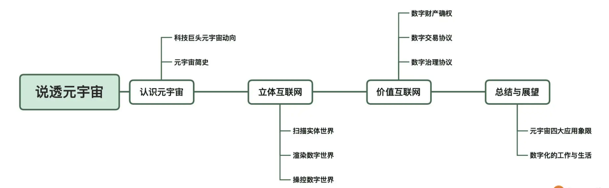
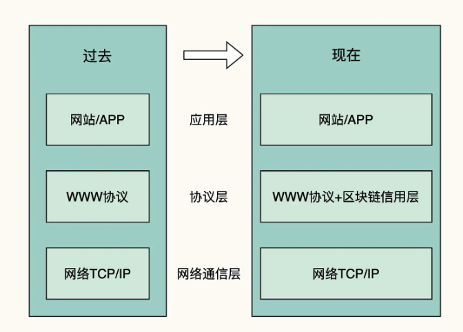
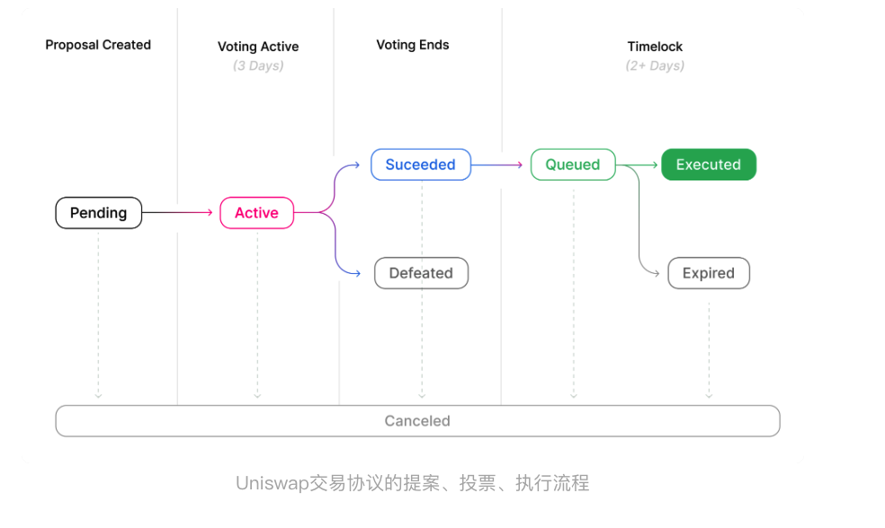

# 说透元宇宙

元宇宙 = 立体互联网 + 价值互联网

## 为什么应该关注元宇宙

VR 只是元宇宙的一个小子集，元宇宙要大得多，它代表着数字化未来的无限空间。

扫描实体世界，渲染数字世界，操控数字世界。
数字财产的确权、数字交易协议、数字治理协议。

为了定义自己的产品，这两家公司使用了与虚拟现实（VR）不同的术语，微软说自己做的是混合现实（MR），苹果说自己做的是增强现实（AR）

## 01 | 互联网科技巨头与资本追逐元宇宙，他们在追逐什么？

微软和facebook 不同之处

戴上 Facebook 的 VR 头盔，你看不到对面的人，只能看到电脑创造的画面；戴上微软的头戴设备，你既能看到电脑创造的画面，又能看到对面的人。
微软把自己的技术叫“混合现实”（MR）。简而言之就是现实和虚拟混合在一起，呈现在你的眼前。微软推出的头戴设备其实是一个特殊的眼镜，名叫“Hololens”，直译的意思是全息透镜，也就是可以看到全息影像（Hologram）的透镜。你看到的是电脑创造的全息影像和现实叠加在一起的世界。

进行价值转移有两条路

1.以支付宝首的中间人
2.不经过一个中间人，而是在数字空间直接地点对点转账
大家都找不到一个去掉中间人、在数字空间中点对点转账的方法。因此，很长时间以来，互联网底层可以很方便地进行信息传递，但是只有在应用层、在支付宝等“中间人”的协助之下，我们才能进行价值转移。

本聪讲解了采用分布式、链式数据结构来记账的方式，文中还讲述了让分布式节点达成共识的工作量证明机制。

## 02 | 元宇宙简史：能看到多远的过去，就能看到多远的未来

在区块链之前，互联网的关键协议是 WWW（万维网）协议，它的用途是进行信息的表示 (HTML)、寻址 (URI）和传输（HTTP）。但互联网一直没有和价值表示与价值转移相关的基础协议。

区块链技术补上了互联网缺失的一环，它提供了价值转移的基础协议。有了区块链，我们一直以来使用的互联网就得加个定语了，它叫“信息互联网”，而围绕区块链技术逐渐形成互联网的另一半，就成了所谓的“价值互联网”。

## 03 | 元宇宙=立体互联网：当我们的手和眼摆脱屏幕的束缚

现在，有一类叫体感互动的技术正在让这样的设想成为现实，它可能是未来我们与数字世界互动的重要方式之一。

第一，如何更好地在人眼前形成真实的三维立体画面效果？

第二，如何让我们更好地用身体与三维立体的世界互动呢？

计算机图形：线条图形、三维模型图形、像素图像。

想要实时渲染以假乱真的动态图像，并希望这个图像是三维立体的、是随着你个人的视角变化的，我们就面临着一个主要的挑战：算力。

画面的渲染需要海量的算力，需要超长的时间。比如说，渲染一部皮克斯动画电影当中的一帧，就大约需要一台高性能机器花费 24 小时才能完成，如果只使用一台机器，那么渲染出一部电影需要 400 年。当然，解决方法是有的，我们可以用大量的机器同时渲染，最终完成电影成片，再放映给观众观看。

如何实时地渲染以假乱真的动态图像就成了元宇宙在视觉方面的一个主要挑战。

## 04 | 元宇宙=价值互联网：当我们在数字空间能拥有物品

所谓价值互联网，是以区块链技术为基础设施建立起来的价值确权、价值持有、价值交易的网络。

我认为，不管是实体世界还是数字世界，财产所有权都是一个完善的经济和社会的基础，是经济繁荣和个人自由的保障。

所谓“资本品思维”的意思是，如果你知道这是一个资本品，未来能给你带来收益，你会不断地累积它。而“消费品思维”则是现在互联网的状态，互联网公司提供的是用完即抛的消费品，平台上的参与者也都被鼓励去创作快消品

首先，虽然它的最底层也用到了数据库，但它的应用数据结构是专门为账户与转账设计的。它是由直接转账交易的数据区块组成的链条。后一个数据区块存有上一个区块的哈希值，从而用哈希指针将这些数据区块连成链条，这就是区块链这个名字的来源。这种应用数据结构在逻辑上借鉴了流水日记账，人们也因此将它称为账本（Ledger）。第二，这些账本不是被严密地保管在一台中心服务器上的，而是分散地保管在每个参与者的服务器上。所有的参与者连成一个对等的网络，没有哪一台服务器是中心，所有服务器都是平等的。这个没有中心的网络共同保管这个账本。所有参与者一起，按照共识机制来接受新的转账交易，更新账本，然后由每个人复制一份更新后的账本。我们也称这种方式叫“去中心网络 + 分布式账本”。第三，它的账户机制是基于计算机密码学的，每个人都可以在离线状态下按照规则生成账户。我们不是到一个应用服务器去注册账户，而是按照这个系统选用的计算机密码学规则，自行生成账户，并用私钥自行掌管自己的账户。在转账时，我们用私钥签名确认，表明我们同意了这一交易。我们签名后的交易在去中心网络中广播、由所有人一起按照共识机制来纳入账本。就账户而言，变化是，账户不需要中心化的服务器来管理与协调了。

现有的互联网在应用之下的这一层是 WWW（万维网）协议。它包括三个部分：HTTP（信息传输）、URI（信息寻址）和 HTML（信息呈现）。也就是说，它们都是关于信息的。区块链技术在 WWW 协议旁边，增加了一个关于价值的基础协议，它实现了关于价值的三个基本功能：账户，余额，转账。也就是说，如果大而化之地将互联网分成三个层次：最底下是网络通信层次，中间层原来是 WWW 协议，上层是我们看到的网页与 APP。现在发生的变化是，在 WWW 协议旁边，多了一个处理价值的区块链协议，也常被称为“区块链信用层”。

## 05 | 扫描实体世界：将真实的世界数字化

我们的任务可以拆解为三大类：“扫描实体世界”、“渲染数字世界”和“操控数字世界”。“扫描实体世界”是将真实的世界数字化、建立物体的三维模型；“渲染数字世界”是基于模型和材质，用计算机渲染出可以欺骗双眼的图像；“操控数字世界”则是让我们能够与这个计算机创造出来的三维世界互动。

第一个层次是平面照片

第二个层次是三维图像

第三个层次是真正的三维模型。到了这个层次，我们不仅要得到西瓜外部的、立体的样子，得到外部的精确数据。我们还想进到西瓜内部，看清每个西瓜籽在什么地方。当然，目前只有在进行科研和产品设计时，我们才会用到这样有内外部结构的三维模型。

比如，我们可以拿着 iPhone 手机围绕一个西瓜走一圈，拍下它全方位的照片，也就是获得一组图像。然后，在苹果电脑上用对应的摄影测量 API（photogrammetry） 对这些特殊的照片进行处理，我们就可以获得一个物体的外部三维模型。之后，我们可以用相应的工具给它增加光线、阴影或其他视觉效果，我们也可以把这个三维模型导入到 Unity3D 等软件中去使用。

《模拟飞行》这款游戏处理数据的方式也可能对我们接下来实现元宇宙有一定的启发。《模拟飞行》中的天气数据是实时更新的，也就是说，它不是模拟一个静态的世界，而是模拟了一个随着时间变化的现实世界。这种实时性意味着它的数据不是预先下载的，而是本地数据和实时数据二者的混合，也就是所谓的“本地数据 + 数据流”的方式，这可能是将来元宇宙的主流数据传输方式。

## 06 | 渲染数字世界：“欺骗”你的眼睛与大脑

构建数字世界的第一步，是对实体世界进行建模，这就是我们上节课所讲的“扫描实体世界”。

渲染（Render）在电脑绘图中指的是用软件把模型变成图像的过程。

渲染数字世界的“引擎”

第一步，确定内容。我们要根据不同需求，在场景中放入各种三维模型，它包括建筑物、人、车等等，还包括光线。

第二步，设置互动。我们通常会设置物体和人物之间的互动关系，比如在一个游戏里，如果我们跳上台阶，会发生什么？如果我们向对面的恶龙投去标枪，它会怎么反击？

第三步，拍摄画面。顾名思义，这一步就是要设置虚拟摄像机，用它记录最终显示在屏幕上的画面。这个画面既可能供人事后观看，也可能是实时渲染出来供参与者观看的。

虚幻引擎把这种做法叫做“虚拟制片”。

虚幻引擎的用途就不局限在建构大型游戏或者虚拟世界了，它也被用到了电影和视频拍摄等各方面。

从游戏公司出来的引擎更加关注互动，而英伟达的产品则会更关注最终画面的视觉效果。

第一种是由计算机创造的，可以“被动观看”的数字世界，也就是说，它没有交互。这样被动观看的世界我们早就在电影、电视里看到很多了。
第二种是可以互动观看的三维数字世界，我们可以走入其中，从不同的角度观看它。这种互动看起来即将成为现实，比如在 Decentraland 这样的网页版虚拟世界中，我们能够在虚拟的建筑群中走动，它给你营造一种沉浸其中的感觉。
第三种是我们可以自然地与之互动的三维数字世界。我们想自然地生活在数字世界中，方便地操控其中的物品。

协议（Protocol）是区块链领域的专业术语，指的是由一组智能合约组成、运行在区块链上、由用户与之交互的功能组合。

由人机交互转为人人交互
第一个是用计算机模拟反馈的问题。

第二个是计算机图形能力问题。

第三个问题是，并非所有问题机器都能处理

## 08 | 数字财产确权：用区块链建立数字所有权管理系统

价值互联网：发生在协议层的变革

应用层的、价值流动的网络。

中本聪的技术方案有三个点：

第一，它是“去中心化网络 + 分布式账本”的结构。

第二，它用“区块 + 链”来存储账本。

第三，它用工作量证明共识机制与最长链原则来达成共识。

要讲清楚这个问题，我们可以逐一讨论分布式网络、共识机制、公钥密码学、虚拟机、智能合约等等一项项技术

用技术的语言说就是：我们要实现一个“去中心化”或者说“无中心”的网络，让每个人都运行自己的服务器，让大家各自保存自己的数据库。也就是，每个人都自己记账。

多个数据库带来的数据的一致性和变更的一致性就是个大问题。
第一，除了直接把原来的服务器、数据库复制 N 份，让大家各自运行之外，有没有更好的数据结构呢？

第二，这些分布在各处的服务器如何就数据的变更达成一致呢？如果这些服务器分布式在全球互联网上，各个节点存在通信延迟，数据的一致性和变更的一致性就是个大问题。

第三，由于这个网络是公开的、允许任何人加入成为计算节点。那么，一旦网络中坏人加入的节点超过一定比例，我们就会遇到所谓的“拜占庭将军问题”，直白地说就是这个网络无法形成可信的结果。

**区块链的的整个数据结构就是用这样的方式来组织的。一个状态就是一个数据区块，新的数据区块跟在上一个数据区块之后。每个新区块里都有一个指向上一个区块的哈希指针。新区块必须由所有人按所谓共识机制同意。这就形成了一个包含所有状态的链式结构，这也是“区块链”（区块 + 链，Block+Chain）这个名字的由来。**

这个设计的一大好处是防篡改，如果上一个区块的数据被人偷偷改写了，它的哈希值就会发生变化，与后一个区块中保存的哈希值就对不上了。

在技术上，区块链选择的是非对称加密密码学方法，每个人用“私钥和公钥”的组合来持有财产所有权。你拥有私钥就拥有了财产的掌控权，而密码学在技术上确保了没有你的私钥就没法伪造你的签名。

更具体地说，以主流区块链为例，如果想要创建一个账户，我们可以随机选择一个 2 的 256 次方的数字作为私钥。这是一个极大的数字，它接近于可见宇宙中的原子数量。因此，只要生成过程是绝对随机的，你生成的私钥就不会跟其他人重合。

有了私钥之后，我们可以用密码学中的椭圆曲线乘法计算出公钥，再按照规则转为适用于相应区块链的地址格式。我们可以由私钥可以推导出公钥，由公钥可以推导出地址。但要注意的是，反过来倒推都是不行的。地址和公钥略有不同，接下来，我们把用户的账户称为“私钥 + 地址”的组合。

我们把用户的账户称为“私钥 + 地址”的组合。

区块链每次的变更状态时，都会在链条后新增一个区块。

区块链解决这个问题有三种选择。

第一种选择最简单粗暴，我们可以规定，只有经过某个核心团体认可的“好人”才能加入，这就在一开始就把坏人排除在外了。后续状态的变更也是这样，统一由这个核心团队来确定。沿着这个思路发展下去就出现了现在的各类联盟链，它的特征是有准入机制，把坏人在一开始就排除在外。但如果还是想实现完全开放接入的目标，也就是建立无须许可的（Permissionless）分布式网络呢？根据分布式计算中的“FLP 不可能结果”，这样的分布式网络只靠技术是无解的。

区块链技术系统的做法是，引入了经济奖励与惩罚，它的共识机制算法是由技术 + 经济来完成的。具体做法又可以分成两种，也就是区块链解决这个问题的第二、第三种选择：POW（工作量证明）共识算法和 POS（权益证明）共识算法。

两种算法的思路是一致的：用户必须有一定的经济投入，以此获得网络参与权，如果成功记账，将可以获得经济奖励；如果失误或作恶，其投入会被罚没。经济上的惩罚与奖励，和技术结合在一起，确保了分布式网络中的众多节点能够就数据变更达成共识，确保分布式网络的安全性

## 09 | 数字交易协议：在数字空间“复制”社会经济活动

智能合约平台: 它真正指的是程序，是区块链上运行的独特的服务端程序。

以太坊中的新组件包括三个部分。

第一是运行代码的计算环境，还有和运行环境对应的数据存储机制，这些被统称为以太坊虚拟机。

第二是可以运行在以太坊上的特定程序，也就是智能合约程序。我们把智能合约代码编译、部署到链上后，它就成为了合约账户。与我们熟悉的服务端程序不同，智能合约在部署后，其代码不可修改。此外，合约也不会自动运行，相当于处于待机状态，只能被外部触发运行。

第三是高级编程语言、开发工具和更便于使用的以太坊钱包。

通证（Token），就是数字空间中财产所有权的凭证。

通证主要分为两种：可互换通证与不可互换通证。

对应地，也就出现了两种通证标准，它们在以太坊生态内分别是第 20 号和第 721 号改进提案，因此常被称为 ERC20 标准和 ERC721 标准。由于 2021 年 NFT 头像、艺术及国内数字藏品的爆火，不可互换通证的缩写——NFT（non-fungible token）——现在也广为人知。

区块链上的通证可以表示很多东西。除了金钱之外，它可以用来表示商场的积分，可以表示我们累积的航空里程，可以用来表示员工期权。任何有价值的事物的所有权，都可以用通证来表示。

我们再从软件编程的角度来看一下。要让各种程序都能方便地处理不同的可互换通证，这些通证最好遵循一致的标准，也就是，它们应该提供同样的编程接口供其他程序调用。

2015 年底，ERC20 标准被提了出来，现在，它已经成为了区块链业界的事实标准。虽然它的名字实际意思是“以太坊改进提案第 20 号”

在数字空间，可互换的财物也是少数，不可互换的财物同样普遍。2018 年初，有人提出要建立所谓不可互换通证的标准，这就是 ERC721 提案，它建议把这一类财物所有权凭证的编程接口也标准化。现在我们看到的绝大部分 NFT 头像、艺术品、游戏道具都遵循 ERC721 标准。

有了这两种通证标准之后，区块链从单一的财产所有权管理系统，演变成了全功能的财产所有权管理系统。我们也可以说，各种各样的价值都可以在用区块链技术构建起来的价值网络中流转了。

第一阶段，用“区块 + 链”的数据结构、用“去中心网络 + 分布式账本”的方式形成了财产所有权管理系统的技术雏形。这一阶段实现了所有权管理系统最核心的“账户、余额、交易”三要素。

第二阶段，为区块链账本增加了代码运行环境，放在以太坊生态内来说就是，增加了“以太坊虚拟机”，为编程与应用开发提供了可能性。

第三阶段，行业形成了一些标准程序接口，主要是 ERC20 可互换通证标准和 ERC721 不可互换通证标准等。到这里，在区块链技术支撑的价值互联网中，我们可以方便地表示各种类型的价值，并进行价值的流转了。

交易协议：将人类经济活动全面映射到数字空间

**有了这些技术准备之后，我们可以尝试着将一些人类经济活动映射到数字空间了。这带来了区块链技术发展的第四阶段，也就是交易协议阶段。**

协议（Protocol）是区块链领域的专业术语，指的是由一组智能合约组成、运行在区块链上、由用户与之交互的功能组合。

平台是由某个公司运行与掌控的，其权益属于一家公司，而协议是众人一致同意、共同遵守的规则，而其权益属于所有参与者。

第一，一个协议是部署在区块链上的一组智能合约，这些合约组合起来实现了某种业务逻辑，它通常是实体世界中人类经济某种活动的翻版。

第二，协议处理的主要是用通证表示的财产。这些通证既可以是可互换通证，也可以是不可互换通证。它能够接受通证，保管通证，给出通证。这是它和现在互联网上绝大部分应用的关键区别。当前互联网上的应用多数是处理信息，而这些协议处理通证则代表着在处理价值。

第三，这组智能合约是自主运转的程序体，它们会保持在某种状态，直到有用户与它交互时，它才会被触发，按预设的业务逻辑处理用户的需求。

## 10 | 数字治理协议：数字世界中的人如何组织与大规模协作

价值互联网中的治理协议从三个方面借鉴了思路：第一个是开源软件，第二个区块链最初的共有网络设计，第三个是科技互联网公司的风投与期权机制。在价值互联网发展的过程中，人们把从这个三个方面借鉴来的经验结合起来，形成了治理协议的最初原型。

因此，这就在代码开源、共有网络之外，给价值互联网治理协议增加了一个新原则：参与者按贡献获得回报。

互联网发展的利益分配机制。而治理协议，就是受到这三者的启发产生的利益分配协议。由于网络是共有的，如何进行决策则是衍生出来需要处理的问题，这是治理协议的又一个重点，也是我们接下来要讨论的内容。

到这里，治理协议在技术上的建设就基本完成了：共有网络通过一个合理的技术路径，将决策权交到了每一位所有权持有者的手中。市面上也出现了一些对应的管理工具，比如多签、投票、社区讨论等。

总结一下，落实治理权时的逻辑其实是很简单直接的：各参与方共同拥有网络的所有权，重大事务由大家按规则共同决策，关键是找到可信又可行的技术手段具体落实下来。

在有了各种工具来就利益进行协商、授权时，人们开始发现，其实一群人在一起构成了一个“经济社群”，它的组织管理方式则是 DAO，去中心化自治组织。

先看经济社群，这是我们造的一个词。我们把价值互联网中的一个个网络叫做共有网络，这个词强调的是，这个网络是由所有参与者共有的。如果我们从参与者的角度来看，会发现所有的参与者平等地组成了一个社群，大家通过这个社群共同地达成某种经济性的目标，我们把这些参与者组成的群体叫“经济社群”。

经济社群是我们在向数字世界转移时出现的事物，是现实世界中公司和社群两者的组合体。在实体经济中，常见的经济组织形态是有限责任公司，它是属于股东的。
