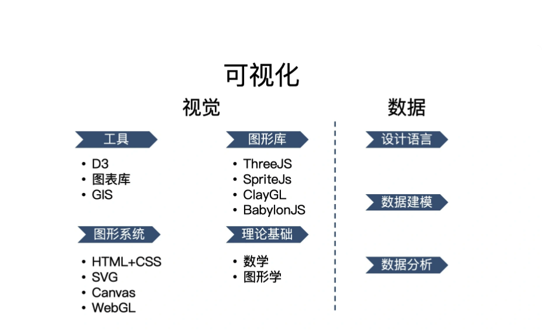
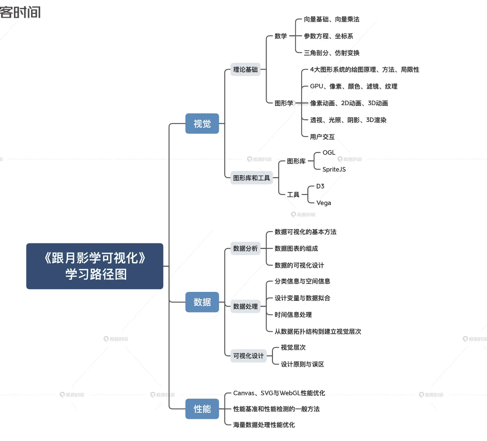
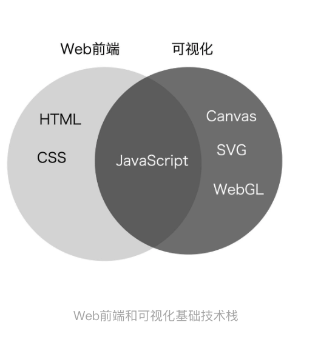
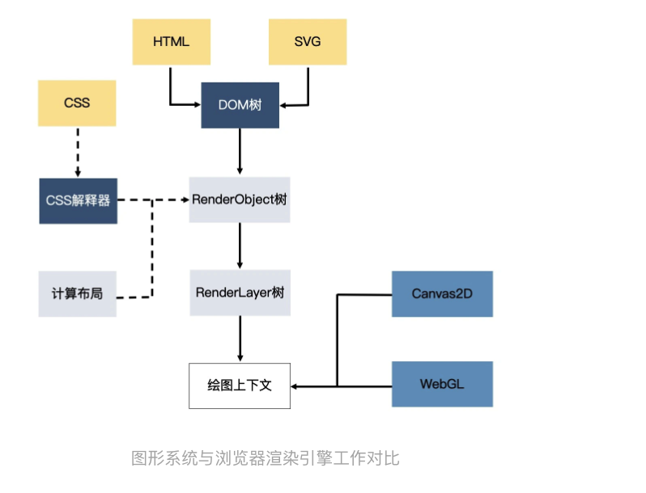

##

我们不能停留在可视化现有的库、框架和工具的使用层面上，必须深入技术栈的底层，充分理解数据，掌握视觉呈现相关的技术和基本原理。打好基础之后，再系统地学习可视化领域的方法论，才能提高解决问题的能力

可视化的视觉主要设计四个部分，分别是理论基础、图形系统、图形库和工具

视觉部分的理论基础就是数学和图形学

Web 开发以呈现块状内容为主，所以 HTML 是更合适的技术。而可视化开发因为需要呈现各种各样的形状、结构，所以，形状更丰富的 SVG 以及更底层的 Canvas2D 和 WebGL 就是更合适的技术了。

其次，Web 开发着重于处理普通的文本和多媒体信息，渲染普通的、易于阅读的文本和多媒体内容，而可视化开发则着重于处理结构化数据，渲染各种相对复杂的图表和图形元素。

就是 Web 开发的前端主要还是关注内容和样式，图形的渲染和绘制是由浏览器底层来完成的，而可视化前端则可能要深入底层渲染层，去真正地控制图形的绘制和细节的呈现。

可视化与 Web 前端一样，最终都是以图像呈现在浏览器上，因此有许多通用的方法论。

二者都使用 JavaScript，而且都是浏览器端的 JavaScript。

可视化领域的工具：

我们可以把这些工具大体上分为四类，分别是：
专业呈现各种类型图表的图表库；
专业处理地图、地理位置的可视化地理库；
专业处理视觉呈现的渲染库；
以及处理数据的数据驱动框架。

如果要绘制更加复杂的地图，比如，一座城市的交通线路和建筑物三维模型，或者一个园区的立体建筑模型等等，我们可能要依赖专业的 GIS 地图库。社区中比较成熟的 GIS 库也不少，比较常见的像 Mapbox、Leaflet、Deck.gl、CesiumJS 等等。

如果要绘制其他更灵活的图形、图像或者物理模型，我们常用的一些图表库就不一定能完成了。这个时候，我们可以用 ThreeJS、SpriteJS 这样比较通用的渲染库（实际上图表库或 GIS 地图库本身底层渲染也基于这些渲染库）。我们可以选择通用的图形库，比如，2D 渲染可以选择 SpriteJS，3D 渲染可以选择 ThreeJS、BabylonJS 以及 SpriteJS3D 扩展等等。

除了这些库之外，还有一类比较特殊的库，比如 D3.js，它属于数据驱动框架。那什么是数据驱动框架呢？这是一种特殊的库，它们更专注于处理数据的组织形式，而将数据呈现交给更底层的图形系统（DOM、SVG、Canvas）或通用图形库（SpriteJS、ThreeJS）去完成。

## 浏览器中实现可视化的四种方式

1. 传统的 html+CSS

2. SVG

3. Canvas2D

4. WebGL

用 GPU 渲染各种复杂的 2D 和 3D 图形。值得一提的是，WebGL 利用了 GPU 并行处理的特性，这让它在处理大量数据展现的时候，性能大大优于前 3 种绘图方式。

浏览器的渲染引擎在工作时，要先解析 HTML、SVG、CSS，构建 DOM 树、RenderObject 树和 RenderLayer 树，然后用 HTML（或 SVG）绘图。当图形发生变化时，我们很可能要重新执行全部的工作，这样的性能开销是非常大的。

一般情况下，Canvas2D 绘制图形的性能已经足够高了，但是在三种情况下我们有必要直接操作更强大的 GPU 来实现绘图。第一种情况，如果我们要绘制的图形数量非常多，比如有多达数万个几何图形需要绘制，而且它们的位置和方向都在不停地变化，那我们即使用 Canvas2D 绘制了，性能还是会达到瓶颈。这个时候，我们就需要使用 GPU 能力，直接用 WebGL 来绘制。

第二种情况，如果我们要对较大图像的细节做像素处理，比如，实现物体的光影、流体效果和一些复杂的像素滤镜。由于这些效果往往要精准地改变一个图像全局或局部区域的所有像素点，要计算的像素点数量非常的多（一般是数十万甚至上百万数量级的）。这时，即使采用 Canvas2D 操作，也会达到性能瓶颈，所以我们也要用 WebGL 来绘制。

第三种情况是绘制 3D 物体。因为 WebGL 内置了对 3D 物体的投影、深度检测等特性，所以用它来渲染 3D 物体就不需要我们自己对坐标做底层的处理了。那在这种情况下，WebGL 无论是在使用上还是性能上都有很大优势。
