# 软件设计之美

## 开篇词 | 软件设计，应对需求规模的“算法”

算法和软件设计其实是一样的，二者都是对抗的都是规模问题。只不过算法对抗的是数据的规模，而软件设计对抗的是需求的规模

你现在应该理解了，为什么软件设计是一门关注长期的学问了，因为只有长期的积累，需求才会累积，规模问题才会凸显出来。软件设计，实际上就是应对需求的“算法”。

关注长期变化的软件设计
设计是为了让软件在长期更容易适应变化。

如何学习软件设计

软件设计学习的难度，不在于一招一式，而在于融会贯通

对于软件设计：我们可以将其划分为两个维度：“了解现有软件的设计” 和“自己设计一个软件”

一个快速了解现有软件设计的方法，那就是抓住这个软件最核心的三个部分：模型、接口和实现。

例如：

- 我们怎样理解 Spring DI 容器模型，它的模型怎样有效解决了其面对的问题；

- 如何理解 Ruby on Rails 的接口，我们可以从其接口设计中借鉴哪些内容；

- Kafka 的实现有哪些独特之处，实现的诸多细节中，我们应该关注哪些内容。

软件设计的基础知识：

- 程序设计语言；
- 编程范式；
- 设计原则；
- 设计模式；
- 设计方法。

程序设计语言，是软件设计落地的基础。任何设计都依赖程序设计语言来实现。但任何语言也都有自己的局限，我将带领你横跨语言学语言，让你不再局限于某一种语言，而是择其善者而从之，更好地落地你的设计。

编程范式，是代码编写的风格，决定着你在设计时可以用到哪些元素：是模块、是对象，还是函数。在不同层次的设计中，选择不同的编程范式已经成为今天开发的主流。在这个主题下，我选择了几个最主流的编程范式，包括结构化编程、面向对象和函数式编程，帮你建立起软件设计的根基。

设计原则，是你在进入到具体设计的层面时，可以用来评判自己工作结果的一个衡量标准。我会给你介绍面向对象的主流设计原则：SOLID 原则。一来面向对象是当今的主流开发方式，二来 SOLID 原则也是比较成体系的设计原则，它本身也在不断发展。

设计模式，是设计原则在具体场景下的应用。

领域驱动设计

## 01 | 什么是软件设计？

核心的模型

区别于解决简单的问题，软件的开发往往是一项长期的工作，会有许多人参与其中。在这种情况下，就需要建立起一个统一的结构，

而在软件的开发过程中，这种统一的结构就是模型，而软件设计就是要构建出一套模型。

这里所说的模型，不仅包括用来描述业务的各种实体，也包括完成业务功能的各种组件。人们写代码中常常会用到的服务（Service）、调度器（Scheduler）等概念就是一个一个的模型。

模型，是一个软件的骨架，是一个软件之所以是这个软件的核心。

模型的粒度可大可小。如果把模型理解为一个一个的类，是不是你就会熟悉很多了，这就是小的模型。你也可以把一整个系统当作一个整体来理解，这就是大的模型。

“高内聚、低耦合”，（模块的内聚程度越高越好，模块间的耦合程度越低越好），这其实就是对模型的要求

即便是在一个软件内部，模型也可以是分层的。我们可以先从最核心的模型开始构建，有了这个核心模型之后，可以通过组合这些基础的模型，构建出上面一层的模型。

约束的规范

规范，就是限定了什么样的需求应该以怎样的方式去完成。

一种常见的问题就是缺乏显式的、统一的规范。

规范的一个重要作用，就是维系软件长期的演化。如果没有显式的规范，项目的维系只能依靠团队成员个人的发挥，老成员一个没留神，新成员就可能创造出一种诡异的新写法，项目就朝着失控又迈出了一步。

规范，就是限定了什么样的需要求应该以怎样的方式去完成。

一种常见的问题就是缺乏显式的、统一的规范。

规范的一个重要作用，就是维系软件长期的演化。如果没有显式的规范，项目的维系只能依靠团队成员个人的发挥，老成员一个没留神，新成员就可能创造出一种诡异的新写法，项目就朝着失控又迈出了一步。

没有一个统一的规范，每一个项目上的新成员都会痛斥一番前人的不负责任。然后，新的人准备另起炉灶，增加一些新东西。这种场景你是不是很熟悉呢？混乱通常就是这样开始的。

关于规范，还有一种常见问题就是，规范不符合软件设计原则。我给你讲一个让我印象深刻的故事。

只是因为旧的规范不符合软件设计原则而导致的错误：外部请求的对象需要在防腐层转换为内部对象。

模型与规范

有了模型，有了规范，那模型与规范是什么关系呢？模型与规范，二者相辅相成。一个项目最初建立起的模型，往往是要符合一定规范的，而规范的制定也有赖于模型。这就像讨论户型设计时，你可以按照各种方式组合不同的空间（模型），却不会把厨房与卫生间放在一起（规范）。


防腐层的理解： 在限界上下文之间映射（说白了就是交互）的方式，体现在代码上就是一个对象的转换，这个转换的意义在于隔离变化，防止因为对象在一个上下文中的变化扩散到其他的上下文中。

02 | 分离关注点：软件设计至关重要的第一步

技术和业务被混在了一起，随之而来的就是无尽的后患

这与业务并不是一个维度的事情，我们在做设计时，要能够发现这些非功能性的需求。也就是说，我们在分解问题的时候，会有很多维度，每一个维度都代表着一个关注点，这就是设计中一个常见的说法，“分离关注点（Separation of concerns）”。

最常见的一类问题就是把业务处理和技术实现两个关注点混在了一起，

**大部分程序员都不应该编写多线程程序。**

在真实项目中，程序员最常犯的错误就是认为所有问题都是技术问题，总是试图用技术解决所有问题。任何试图用技术去解决其他关注点的问题，只能是陷入焦油坑之中，越挣扎，陷得越深。

另外一个常见的容易产生混淆的关注点是不同的数据变动方向。

不同的数据变动方向：

动静分离，就是把变和不变的内容分开；

读写分离，就是把读和写分开；

前面提到的高频和低频，也可以分解开；

**不同的数据变动方向，就是一个潜在的、可以分离的关注点。**

分离关注点之所以重要，有两方面原因。一方面，不同的关注点混在一起会带来一系列的问题，正如前面提到的各种问题；另一方面，当分解得足够细小，你就会发现不同模块的共性，才有机会把同样的信息聚合在一起。这会为软件设计的后续过程，也就是组合，做好准备。

如果今天的内容你只能记住一件事，那请记住：分离关注点，发现的关注点越多越好，粒度越小越好。


03 | 可测试性： 一个影响软件设计的重要因素

软件设计要考虑“可测试性”

软件开发要解决的问题是从需求而来。需求包括两大类，第一类是功能性需求，也就是要完成怎样的业务功能；第二类是非功能性需求，是业务功能之外的一些需求。

非功能性需求也被分为两大类，一类称为执行质量（Execution qualities），你所熟悉的吞吐、延迟、安全就属于这一类，它们都是可以在运行时通过运维手段被观察到的；而另一类称为演化质量（Evolution qualities），它们内含于一个软件的结构之中，包括可测试性、可维护性、可扩展性等。


我们要保证每个小模块的正确性，就要保证每个模块在开发阶段能够测试，而想要每个模块能够测试，在设计过程中，就要保证每个模块是可以测试的，而这就是可测试性。

一旦我们在可测试性上考虑不足，就会引发一系列的后续问题。比如，复杂的系统不仅仅在测试上有难度，在集成、部署等各个环节，都有其复杂性，完成一次部署往往也需要很长时间。

所以，我们在设计一个函数 / 模块 / 系统时，必须将可测试性纳入考量，以便于能够完成不同层次的测试，减少对集成环境的依赖。

那么，具体该如何做呢？一方面，尽可能地给每个模块更多的测试，使构成系统的每个模块尽可能稳定，把集成测试环境更多地留作公共的验收资源。另一方面，尽可能搭建本地的集成测试环境，周边的系统可以采用模拟服务的方案。

在软件开发过程中考虑测试，实际上是思考软件的质量问题，而把质量的思考前移到开发，甚至是设计阶段，是软件开发从传统进入到现代的重要一步。


04 | 三步走：如何了解一个软件的设计？

模型、接口和实现

了解一个软件的设计可以从三个部分着手： 模型、接口和实现。

这三者的关系就好比你去看代码，你会先去看有哪些类以及它们之间的关系，这就是看模型；然后你会打开一个具体的类，看它提供了哪些方法，这就相当于看接口；最后，你再来打开一个具体的方法，去看它的代码是怎么写的，这就是看实现。

**首先是模型**，它是一个软件的核心部分。在其它的材料里，也有人称之为抽象，为了统一，我这里就都叫模型了。我们在前面的课程里也说过，设计最关键的就是构建出模型。而理解一个设计中的模型，可以帮助我们建立起对这个软件整体的认知。

**其次是接口**，它决定了软件通过怎样的方式，将模型提供的能力暴露出去。它是我们与这个软件交互的入口。如何理解这句话呢？我给你举几个具体的例子。

- 一个程序库的接口就是它的 API，但对于同样的模型，每个人会设计出不同的 API，而不同的 API 有着不同的表达能力。比如：Google 的 Guava 对 JDK 的一些 API 重新做了封装，其目的就是简化开发，而很多优秀的做法后来又被 JDK 学了回去。

- 一个工具软件一般会提供命令行接口，比如，每个程序员必备的基本技能——Unix 命令行工具就是典型的命令行接口。

- 一个业务系统的接口，就是对外暴露的各种接口，比如，它提供的各种 REST API，也可能是提供了 RPC 给其它系统的调用。
- ……

如果你想深入源码，去了解一个软件，接口是一个很好的指向标。你可以从一个接口进入到软件中，看它是怎样完成各种基本功能的。

**最后是实现**，就是指软件提供的模型和接口在内部是如何实现的，这是软件能力得以发挥的根基。这么说可能比较抽象，我再来举些例子。

- 一个业务系统收到一个请求之后，是把信息写到数据库，还是转发给另外的系统。
- 一个算法的实现，是选择调用与别人已有的程序库，还是需要自己实现一个特定的算法。
- 一个系统中的功能，哪些应该做成分布式的，哪些应该由一个中央节点统一处理。
- 一段业务处理，是应该做成单线程，还是多线程的。当资源有竞争，是每个节点自己处理，还是交由一个中间件统一处理。
- 不同系统之间的连接，该采用哪种协议，是自己实现，还是找一个中间件。

在讨论设计时应该遵循一个顺序：，先模型，再接口，最后是实现，同理，了解一个设计也应该遵循这样的顺序。

我还要强调一点，在了解设计时，要按层次去了解，因为设计常常是分层的。每当我们打开一个层次，需要了解它的内部时，我们还要按照模型、接口和实现的顺序解读这个层次。

我用大家比较熟悉的操作系统来举个例子，如果你去了解它的内部，就知道它有内存管理、进程调度、文件系统等模块。我们可以按照模型、接口和实现去理解每个模块，就以进程管理为例：

—— 进程管理的核心模型就包括进程模型和调度算法；
—— 它的接口就包括，进程的创建、销毁以及调度算法的触发等；
—— 不同调度算法就是一个个具体的实现。

今天，我们学习了如何了解一个软件设计，可以从三个部分入手：模型、接口和实现。

模型，也可以称为抽象，是一个软件的核心部分，是这个系统与其它系统有所区别的关键，是我们理解整个软件设计最核心的部分。

接口，是通过怎样的方式将模型提供的能力暴露出去，是我们与这个软件交互的入口。

实现，就是软件提供的模型和接口在内部是如何实现的，是软件能力得以发挥的根基。


05 | Spring DI 容器：如何分析一个软件的模型？

今天这一讲，我们就先来谈谈了解设计的第一步：模型。如果拿到一个项目，我们怎么去理解它的模型呢？我们肯定要先知道项目提供了哪些模型，模型又提供了怎样的能力。

我们都知道，任何模型都是为了解决问题而生的，所以，理解一个模型，需要了解在没有这个模型之前，问题是如何被解决的，这样，你才能知道新的模型究竟提供了怎样的提升。也就是说，理解一个模型的关键在于，要了解这个模型设计的来龙去脉，知道它是如何解决相应的问题。

耦合的依赖

Spring DI 容器的模型，就是一个典型的模型。它的核心模型就是依赖注入（Dependency Injection，简称 DI），它的接口就是 BeanFactory 和 ApplicationContext，它的实现就是 DefaultListableBeanFactory 和 ClassPathXmlApplicationContext。

那么，DI 容器要解决的问题是什么呢？它解决的是组件创建和组装的问题，但是为什么这是一个需要解决的问题呢？这就需要我们了解一下组件的创建和组装。

分离的依赖

把所有的对象创建和组装在一个地方完成：

...
ArticleRepository repository = new DBArticleRepository(connection);
AriticleService service = new ArticleService(repository);
...

虽然很无聊，但这一部分代码很重要，最好的解决方案就是有一个框架把它解决掉。在 Java 世界里，这种组装一堆对象的东西一般被称为“容器”，我们也用这个名字。

Container container = new Container();
container.bind(Connection.class).to(connection);
container.bind(ArticleReposistory.class).to(DBArticleRepository.class);
container.bind(ArticleService.class).to(ArticleService.class)

ArticleService service = container.getInstance(ArticleService.class);

至此，一个容器就此诞生。因为它解决的是依赖的问题，把被依赖的对象像药水一样，注入到了目标对象中，所以，它得名“依赖注入”（Dependency Injection，简称 DI）。这个容器也就被称为 DI 容器了。

有了 di 容器，对象的创建和组装都由 di 容器完成了。

而且，一旦有了容器的概念，它还可以不断增强。比如，我们想给所有与数据库相关的代码加上时间监控，只要在容器构造对象时添加处理即可。你可能已经发现了，这就是 AOP（Aspect Oriented Programming，面向切面编程）的处理手法。而这些改动，你的业务代码并无感知。


理解模型，要了解模型设计的来龙去脉。

06 | Ruby on Rails：如何分析一个软件的接口？

Ruby on Rails 模型

Rails 是标准的基于 MVC 模型进行开发的 Web 框架。

前面我提到过理解接口应该先找主线，找到项目主线的一个方法就是从起步走文档开始，因为它会把项目最基本的用法展现给你，你可以轻松地找到主线。

有了主线之后，我们就要开始从中了解接口的风格。Rails 给我们提供的三种接口，分别是：

Web 应用对外暴露的接口：
REST API；程序员写程序时用到的接口：
API；程序员在开发过程中用到的接口：命令行。

总结时刻：理解一个项目的接口，先找主线，再看风格。

07 | Kafka：如何分析一个软件的实现？

你需要找到两个关键点：软件的结构和关键的技术。

Kafka

Kafka 是一个分布式流平台。这是它现在的发展方向，但在更多人的心目中，Kafka 的角色是一个消息队列

消息队列还有一个最常见的特性是，它会提供一定的消息存储能力。这样的话，当生产者发消息的速度快于消费者处理消息的速度时，消息队列可以起到一定的缓冲作用。所以，有一些系统会利用消息队列的这个特性做“削峰填谷”，也就是在消息量特别大时，先把消息收下来，慢慢处理，以减小系统的压力。

消息队列实现消息存储的方式通常是把它写入到磁盘中，而 Kafka 的不同之处在于，它利用了磁盘顺序读写的特性。

如果站在了解实现的角度，你会觉得非常地自然。但要想从设计的角度学到更多，我们还是应该带着问题上路，多问自己一个问题，为什么其他的消息队列之前不这么做呢？这是一个值得深思的问题。Kafka 这个实现到底是哪里不容易想到呢？答案是软硬结合。

之前的消息队列实现也会把消息写入到文件里，但文件对它们来说，只是一个通用的接口。开发者并没有想过利用硬件的特性做开发。而 Kafka 的开发者突破了这个限制，把硬件特性利用了起来，从而取得了更好的结果。

总结时刻：
如果想了解一个系统的实现，应该从软件结构和关键技术两个方面着手。

08 | 语言的模型：如何打破单一语言局限，让设计更好地落地？

发展，就是函数式编程的程序设计语言，这方面的代表就是 LISP。

一切语法都是语法糖

学习程序设计语言其实就是要学习语言提供的编程模型，不提供新编程模型的语言是不值得刻意学习的。

如果你已经学会了一两门程序设计语言，学习一门新的语言其实并不困难，因为每种语言提供的新模型是有限的，基本的元素是类似的，无非是用了不同的关键字。

所以，学习新语言，只是在做增量的学习，思维负担并没有那么沉重。一旦对于程序设计语言的模型有了新的认识，你就能理解一件事：一切语法都是语法糖。

09 | 语言的接口：语法和程序库，软件设计的发力点

程序库就是为了消除重复而出现的。而消除重复，也是软件设计的初衷。

程序库（Library）是程序员最熟悉的一项内容。学习一门新语言，首先是学习语法（Syntax），然后学习程序库（Library），之后再学习运行时（Runtime），这样，你就具备一门语言的基础了。再往后，你需要了解的就是各种惯用法（Idiom），以及如何运用到实际的工作中。

一个经过验证的模式最终变成了语言的一部分，而它的起点只是一个常见的用法：一个程序库。

通常是先有程序库，再有语法；如果语法不够好，新的程序库就会出现，新一轮的编程模型就开始孵化。

js 也是如此，后面出的 es20xx，的各种新语法特性，很多都是来自程序库。

一切有生命力的语言都会不断改善自己的语法，某些好用的程序库就可以转正成为语法。

总结时刻

提升软件设计能力，可以从编写程序库入手


10 | 语言的实现：运行时，软件设计的地基

程序设计语言的实现就是支撑程序运行的部分：运行时，也有人称之为运行时系统，或运行时环境，它主要是为了实现程序设计语言的执行模型。

相比于语法和程序库，我们在学习语言的过程中，对运行时的关注较少。因为不理解语言的实现依然不影响我们写程序，那我们为什么还要学习运行时呢？

因为运行时，是我们做软件设计的地基。

我用个例子来进行说明，我曾经参与过一个开源项目：在 JVM 上运行 Ruby。这种行为肯定不是 Java 语言支持的，为了让 Ruby 能够运行在 JVM 上，我们将 Ruby 的代码编译成了 Java 的字节码，而字节码就属于运行时的一部分。

react 的运行时，也是如此，将 jsx 通过 babel 编译成 js，然后在浏览器中运行。

做设计真正的地基，并不是程序设计语言，而是运行时，有了对于运行时的理解，我们甚至可以做出语言本身不支持的设计。

运行时的编程接口

比如，使用 C 语言编程时，我们可以实现多态，做法就是自己实现一个虚拟表，这就是面向对象语言实现多态的一种方案。
总结时刻

今天，我们讨论了程序设计语言的实现：运行时。对于运行时的理解，我们甚至可以做出语言本身不支持的设计。所以，做设计真正的地基，并不是程序设计语言，而是运行时。

11 | DSL：你也可以设计一门自己的语言

讲到程序设计语言模型时，我说过，程序设计语言的发展趋势，就是离计算机本身越来越远，而离要解决的问题越来越近。但通用程序设计语言无论怎样逼近要解决的问题，它都不可能走得离问题特别近，因为通用程序设计语言不可能知道具体的问题是什么。

如果我们能把设计做到极致，它就能成为一门语言，填补这个空间。

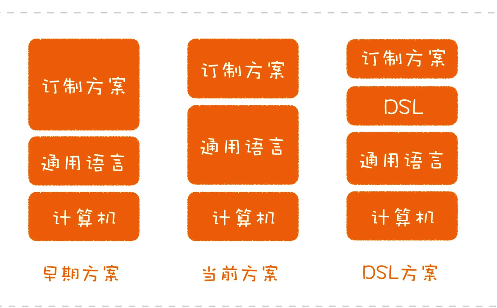

这种语言就是领域特定语言（Domain Specific Language，简称 DSL），它是一种用于某个特定领域的程序设计语言。

通用语言都是图灵完备的，但 DSL 不必做到图灵完备，它只要做到满足特定领域的业务需求，就足以缩短问题和解决方案之间的距离，降低理解的门槛。

领域特定语言

程序员最熟悉的一种 DSL 就是正则表达式了，没错，也许已经习惯使用正则表达式的你都不知道，但它确实就是一种 DSL，一种用于文本处理这个特定领域的 DSL。

如果你觉得正则表达式有点复杂，还有一种更简单的 DSL，就是配置文件。你可能真的不把配置文件当作一种 DSL，但它确实是在实现某个特定领域的需求，而且可以根据你的需求对软件的行为进行定制。

一个典型的例子是 Ngnix。无论你是用它单独做 Web 服务器也好，做反向代理也罢，抑或是做负载均衡，只要通过 Ngnix 的配置文件，你都能实现。配合 OpenResty，你甚至可以完成一些业务功能。

从设计角度看，DSL 最终呈现出来的语法只是一种接口，但最重要的是它包裹的模型。

Martin Fowler 在他的《领域特定语言》这本书中，将这个模型称为语义模型（Semantic Model）。

想要实现一个 DSL，可以这么说，DSL 的语法本身都是次要的，模型才是第一位的。当你有了模型之后，所谓的构建 DSL，就相当于设计一个接口，将模型的能力暴露出来。

既然是接口，形式就可以有很多种，我们经常能接触到的 DSL 主要有两种：外部 DSL 和内部 DSL。Martin Fowler 在他的书中还提到了语言工作台（Language Workbench），不过，这种做法在实际工作中用到的不多，我们暂且忽略。

外部 DSL 和内部 DSL 的区别就在于，DSL 采用的是不是宿主语言（Host Language）。你可以这么理解，假设你的模型主要是用 Java 写的，如果 DSL 用的就是 Java 语言，它就是内部 DSL，如果 DSL 用的不是 Java，比如，你自己设计了一种语法，那它就是外部 DSL。

把概念说清楚了，一些问题便迎刃而解了。这也可以解释为什么 DSL 让有些人畏惧了，原因就是说起 DSL，这些人想到的就是自己设计语法的外部的 DSL。其实，即便是外部 DSL，也不一定要设计一门语法，我们甚至可以借助已有的语法来完成。比如，很多程序员熟悉的一种语法：XML。

如果你是一个 Java 程序员，XML 就再熟悉不过了。从 Ant 到 Maven，从 Servlet 到 Spring，曾经的 XML 几乎是无处不在的。如果你有兴趣，可以去找一些使用 Ant 做构建工具的项目，项目规模稍微大一点，其 XML 配置文件的复杂程度就不亚于普通的源代码。

因为它本质上就是一种用于构建领域的 DSL，只不过，它的语法是 XML 而已。正是因为这种 DSL 越来越复杂，后来，一种新的趋势渐渐兴起，就是用全功能语言（也就是真正的程序设计语言）做 DSL，这是后来像 Gradle 这种构建工具逐渐流行的原因，它们只是用内部 DSL 替换了外部 DSL。

从复杂度而言，自己设计一种外部 DSL 语法，大于利用一种现有语法做外部 DSL，二者之间的差别在于谁来开发解析器。而外部 DSL 的复杂度要大于内部 DSL，因为内部 DSL 连解析的过程都省略了。从实用性的角度，更好地挖掘内部 DSL 的潜力对我们的实际工作助益更多。

二者的抽象级别是不同的，“怎么做”是一种实现，而“做什么”则体现着意图。将意图与实现分离开来，是内部 DSL 与普通的程序代码一个重要的区别，同样，这也是一个好设计的考虑因素。

Martin Fowler 在讨论 DSL 定义时，提到了 DSL 的 4 个关键元素：

计算机程序设计语言（Computer programming language）；

语言性（Language nature）；

受限的表达性（Limited expressiveness）；

针对领域（Domain focus）。

其中，语言性强调的就是 DSL 要有连贯的表达能力。也就是说，你设计自己的 DSL 时，重点是要体现出意图。抛开是否要实现一个 DSL 不说，的确，程序员在写代码时应该关注代码的表达能力，而这也恰恰是很多程序员忽略的，同时也是优秀程序员与普通程序员拉开差距的地方。

普通程序员的关注点只在于功能如何实现，而优秀的程序员会懂得将不同层次的代码分离开来，将意图和实现分离开来，而实现可以替换。

说到这里，你就不难理解学习内部 DSL 的价值了，退一步说，你不一定真的要自己设计一个内部 DSL，但学会将意图与实现分离开，这件事对日常写代码也是有极大价值的。

有了这个意识，你就可以很好地理解程序设计语言的一个重要发展趋势：声明式编程。现在一些程序设计语言的语法就是为了方便进行声明式编程，典型的例子就是 Java 的 Annotation。正是它的出现，Spring 原来基于 XML 的外部 DSL 就逐步转向了今天常用的内部 DSL 了，也就是很多人熟悉的 Java Config。

你会发现，虽然我在这说的是写代码，但分离意图和实现其实也是一个重要的设计原则，是的，想写好代码，一定要懂得设计。

意图可以理解成方法命名，实现可以理解成方法里的每行代码。

意图可以理解成接口定义，实现可以理解成实现类。


12 | 编程范式：明明写的是 Java，为什么被人说成了 C 代码？

编程范式， 指的是程序的编写模式

现在主流的编程范式主要有三种：

结构化编程（structured programming）；

面向对象编程（object-oriented programming）；

函数式编程（functional programming）。

结构化编程，是大部分程序员最熟悉的编程范式，它通过一些结构化的控制结构进行程序的构建。你最熟悉的控制结构应该就是 if/else 这样的选择结构和 do/while 这样的循环结构了。结构化编程是最早普及的编程范式，现在最典型的结构化编程语言是 C 语言。C 语言控制结构的影响极其深远，成为了很多程序设计语言的基础。

面向对象编程，是现在最主流的编程范式，它的核心概念就是对象。用面向对象风格写出的程序，本质上就是一堆对象之间的交互。面向对象编程给我们提供了一种管理程序复杂性的方式，其中最重要的概念就是多态（polymorphism）。现在主流的程序设计语言几乎都提供面向对象编程能力，其中最典型的代表当属 Java。

函数式编程，是近些年重新崛起的
编程范式。顾名思义，它的核心概念是函数。但是，它的函数来自于数学里面的函数，所以，和我们常规理解的函数有一个极大的不同：不变性。也就是说，一个符号一旦创建就不再改变。

编程范式不仅仅是提供了一个个的概念，更重要的是对能力施加了约束

结构化编程，限制使用 goto 语句，它是对程序控制权的直接转移施加了约束。

面向对象编程，限制使用函数指针，它是对程序控制权的间接转移施加了约束。

函数式编程，限制使用赋值语句，它是对程序中的赋值施加了约束。

多范式

我们尝试把不同编程风格中优秀的元素放在一起。比如：我们采用面向对象来组织程序，而在每个类具体的接口设计上，采用函数式编程的风格，在具体的实现中使用结构化编程提供的控制结构。

总结时刻：编程范式的一个关键点在于： 哪些事情不要做。

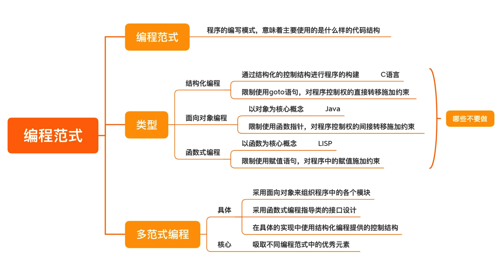

13 | 结构化编程：为什么做设计时仅有结构化编程是不够的？

结构化： 是相对于非结构化编程而言的。

高级语言对应的低级语言： 例如汇编 就是没有 if else

在汇编中，我们需要通过 goto 语句来实现条件判断，它可以让代码跳转到另外一个地方继续执行。还有几个比较指令，让你可以比较两个值。

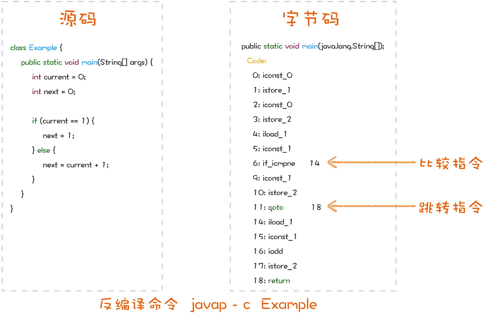

原来的程序员面对的是汇编，他们是站在直接使用指令的角度去思考。所以就是 goto 到哪里执行一段代码，然后，再 goto 到另外一个地方。

功能分解

函数式编程初步

函数式编程是一种编程范式，它提供给我们的编程元素就是函数。

总结时刻：

函数式编程的要素是一等公民的函数，如果语言不支持，可以自己模拟。

18 | 函数式编程之组合性：函数式编程为什么如此吸引人？

函数式编程在设计上对我们帮助最大的两个特性：组合性和不变性。

组合行为的高阶函数

在函数式编程中，有一类比较特殊的函数，它们可以接收函数作为输入，或者返回一个函数作为输出。这种函数叫做高阶函数

高阶函数有什么用呢？它的一个重要作用在于，我们可以用它去做行为的组合。

java

```java
find(byName(name).and(bySno(sno)));
```

可以这么说，高阶函数的出现，让程序的编写方式出现了质变。按照传统的方式，程序库的提供者要提供一个又一个的完整功能，就像 findByNameAndBySno 这样，但按照函数式编程的理念，提供者提供的就变成了一个又一个的构造块，像 find、byName、bySno 这样。然后，使用者可以根据自己的需要进行组合，非常灵活，甚至可以创造出我们未曾想过的组合方式。

模型提供者提供出来的是一个又一个的构造块，以及它们的组合方式。由使用者根据自己需要将这些构造块组合起来，提供出新的模型，供其他开发者使用。

列表转换思维

LISP 这个名字源自“list processing”

Lisp 的一个洞见就是，大部分操作最后都可以归结成列表转换，也就是说，数据经过一系列的列表转换会得到一个结果。

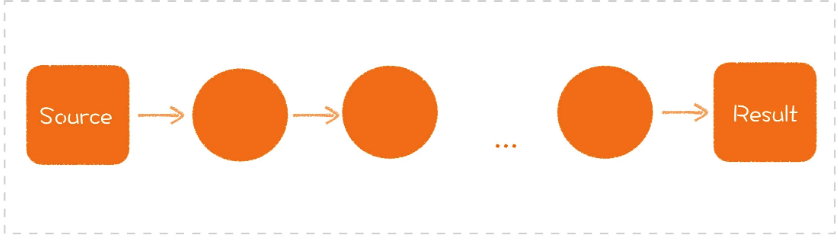

想要理解这一系列的转换，就要先对每个基础的转换有所了解。最基础的列表转换有三种典型模式，分别是 map、filter 和 reduce。

首先是 map。map 就是把一组数据通过一个函数映射为另一组数据。

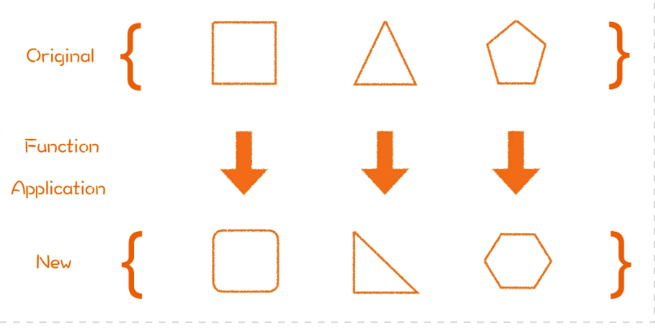

再来看 filter。filter 是把一组数据按照某个条件进行过滤，只有满足条件的数据才会留下。

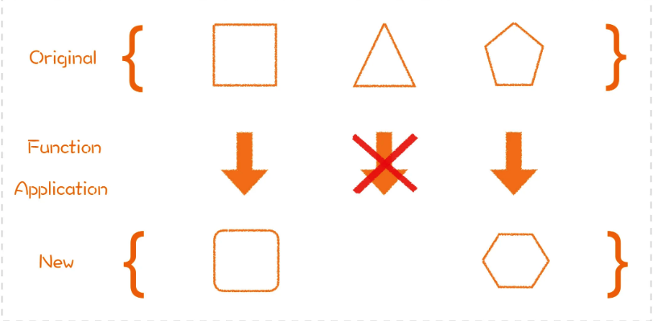

最后是 reduce。reduce 就是把一组数据按照某个规则，归约为一个数据。

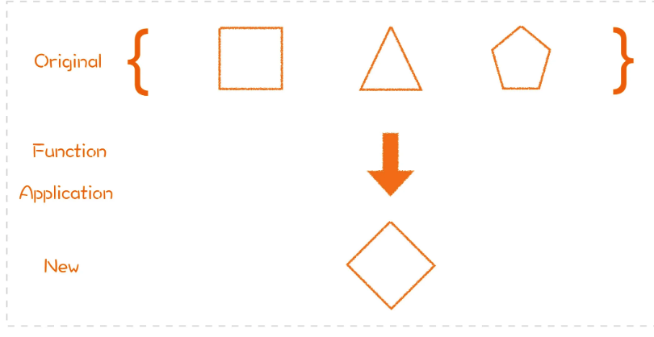

还是[1、2、3、4]，如果我们做一个 reduce 操作，其归约函数是一个加法操作，也就是这组数里面的每个元素相加，最终会得到一个结果，也就是 1+2+3+4=10。

同样是一组数据的处理，我更鼓励使用函数式的列表转换，而不是传统的 for 循环。一方面因为它是一种更有表达性的写法，从前面的代码就可以看到，它几乎和我们想做的事是一一对应的。另一方面，这里面提取出来比较性别的方法，它就是一个可以用作组合的基础接口，可以在多种场合复用。

我们之前在讲 DSL 的时候就谈到过代码的表达性，其中一个重要的观点就是，有一个描述了做什么的接口之后，具体怎么做就可以在背后不断地进行优化。比如，如果一个列表的数据特别多，我们可以考虑采用并发的方式进行处理，而这种优化在使用端完全可以做到不可见。MapReduce 甚至将运算分散到不同的机器上执行，其背后的逻辑是一致的。

面向对象与函数式编程的组合

我们可以用面向对象编程的方式对系统的结构进行搭建，然后，用函数式编程的理念对函数接口进行设计。你可以把它理解成盖楼，用面向对象编程搭建大楼的骨架，用函数式编程设计门窗。

总结时刻： 设计可以组合的函数接口。

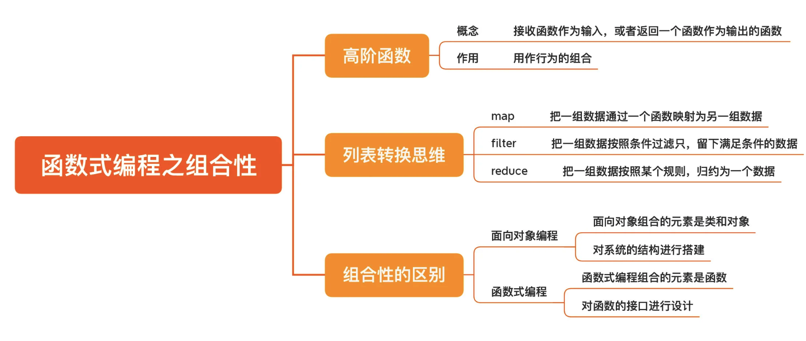

19 | 函数式编程之不变性：怎样保证我的代码不会被别人破坏？

多线程是另外一个关注点，能少用就少用。

不变性函数式编程的不变性主要体现在值和纯函数上。值，你可以将它理解为一个初始化之后就不再改变的量，换句话说，当你使用一个值的时候，值是不会变的。纯函数，是符合下面两点的函数：

对于相同的输入，给出相同的输出；

没有副作用。

和纯函数合起来看，值保证不会显式改变一个量，而纯函数保证的是，不会隐式改变一个量。

那怎么应用呢？首先是值。我们可以编写不变类，就是对象一旦构造出来就不能改变，Java 程序员最熟悉的不变类应该就是 String 类，怎样编写不变类呢？所有的字段只在构造函数中初始化；所有的方法都是纯函数；如果需要有改变，返回一个新的对象，而不是修改已有字段。

有了这个基础，等我们后面学习领域驱动设计的时候，你就很容易理解值对象（Value Object）是怎么回事了。

我们再来看纯函数。编写纯函数的重点是，不修改任何字段，也不调用修改字段内容的方法。因为在实际的工作中，我们使用的大多数都是传统的程序设计语言，而不是严格的函数式编程语言，不是所有用到的量都是值。所以，站在实用性的角度，如果要使用变量，就使用局部变量。

Java 就尽可能多使用 final，C/C++ 就多写 const。无论是修饰变量还是方法，它们的主要作用就是让编译器提醒你，要多从不变的角度思考问题。

不过，纯粹的函数式编程是很困难的，我们只能把编程原则设定为尽可能编写不变类和纯函数。但仅仅是这么来看，你也会发现，自己从前写的很多代码，尤其是大量负责业务逻辑处理的代码，完全可以写成不变的。

绝大多数涉及到可变或者副作用的代码，应该都是与外部系统打交道的。能够把大多数代码写成不变的，这已经是一个巨大的进步，也会减少许多后期维护的成本。

而正是不变性的优势，有些新的程序设计语言默认选项不再是变量(默认是 final，变量反而要显式)，而是值。比如，在 Rust 里，你这么声明的是一个值，因为一旦初始化了，你将无法修改它：
rust

```rust
let mut result = 1;
```

而如果你想声明一个变量，必须显式地告诉编译器：

rust

```rust
let mut result = 1;
```

总结时刻

然而，这类问题在函数式编程中并不存在。其中，重要的原因就是函数式编程的不变性。函数式编程的不变性主要体现在它的值和纯函数上。深入学习函数式编程时，你会遇到的与之相关的各种说法：无副作用、无状态、引用透明等等，其实都是在讨论不变性。

即便使用传统的程序设计语言，我们也可以从中借鉴一些编程的方法。比如，编写不变类、编写纯函数、尽量使用不变的修饰符等等。

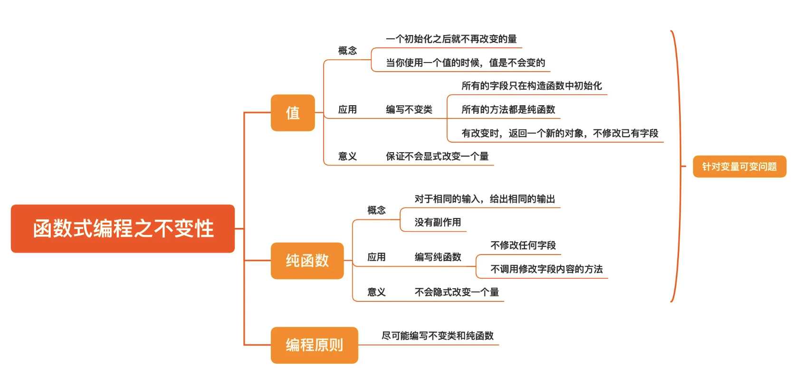

函数式编程加餐：

惰性求值

什么叫惰性求值呢？惰性求值（Lazy Evaluation）是一种求值策略，它将求值的过程延迟到真正需要这个值的时候。

无限流

无限长集合（Infinite Collection）是函数式编程中的一个重要概念，它是一种特殊的集合，它的长度是无限的。我们可以把它理解成一个集合，但它的元素是无穷尽的，也就是说，它的元素是不可能全部存储在内存中的。

无限长集合真正预置进去的是，元素的产生规则。这样一来，元素就会像流水一样源源不断地产生出来，我们将这种集合称为无限流（Infinite Stream）

记忆

Proxy 模式之所以要采用惰性求值的策略，一个重要的原因就是真正的计算部分往往是消耗很大的。所以，一旦计算完成，一个好的策略就是将计算的结果缓存起来，这样，再次调用时就不必重新计算了。其实，这种做法就是记忆。

函数式编程中的函数是纯函数，同样的输入必然会给出同样的输出。

optional

其实，Optional 将对象封装起来的做法来自于函数式编程中一个叫 Monad 的概念，你可以简单地把它理解成一个对象容器。Optional 就对应着其中的一种：Maybe Monad。

```rust
enum Version { Version1, Version2 }

// 定义一个解析版本的函数
fn parse_version(header: &[u8]) -> Result<Version, &'static str> {
    match header.get(0) {
        None => Err("invalid header length"), // 无法解析，返回错误
        Some(&1) => Ok(Version::Version1),  // 解析出版本1
        Some(&2) => Ok(Version::Version2),  // 解析出版本2
        Some(_) => Err("invalid version"),  // 无效版本，返回错误
    }
}

let version = parse_version(&[1, 2, 3, 4]);
// 根据返回值进行处理
match version {
    Ok(v) => println!("working with version: {:?}", v),
    Err(e) => println!("error parsing header: {:?}", e),
}
```

总结时刻

惰性求值是一种求值策略，它将求值的过程延迟到真正需要这个值的时候，其作用就是规避一些不必要的计算。因为惰性求值的存在，还衍生出一些有趣的做法，比如，无限流和记忆。无限流启发了现在的一些大数据平台的设计，而记忆可以很好地替代 Proxy 模式。

Optional 是为了解决空对象而产生的，它其实就是一个对象容器。因为这个容器的存在，访问对象时，需要增加一步思考，减少犯错的几率。

花点时间学习函数式编程。

20 | 单一职责原则：你的模块到底为谁负责？

- 单一职责原则（Single responsibility principle，SRP）

- 开放封闭原则（Open–closed principle，OCP）

- Liskov 替换原则（Liskov substitution principle，LSP）

- 接口隔离原则（Interface segregation principle，ISP）

- 依赖倒置原则（Dependency inversion principle，DIP）

原因就在于，我们一开始的理解就是错的，我们把单一职责理解成了有关如何组合的原则，但实际上，单一职责是关于如何分解的。

单一职责原则和一个类只干一件事之间，最大的差别就是，将变化纳入了考量。

变化是我们最不愿意面对却不得不面对的事，因为变化会引发新的不确定性，可能是新增功能自身的稳定问题，也可能是旧有功能遭到破坏带来的问题。

所以，一个模块最理想的状态是不改变，其次是少改变，它可以成为一个模块设计好坏的衡量标准。

在真实项目中，一个模块之所以会频繁变化，关键点就在于能引起它改变的原因太多了

解决这种问题，最好的办法就是把不同的需求引起的变动拆分开来。

理解单一职责原则本质上就是要理解分离关注点。

那应该把哪些内容组织到一起呢？这就需要我们考虑单一职责原则定义的升级版，也就是第二个定义：一个模块应该对一类且仅对一类行为者负责。

总结时刻

\*  我们需要理解封装，知道要把什么样的内容放到一起；

\*  我们需要理解分离关注点，知道要把不同的内容拆分开来；

\*  我们需要理解变化的来源，知道把不同行为者负责的代码放到不同的地方。

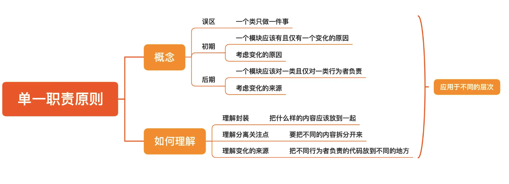

21 | 开放封闭原则：不改代码怎么写新功能？

不修改代码

软件实体（类、模块、函数）应该对扩展开放，对修改封闭。

以扩展的形式。用更通俗的话来解释，就是新需求应该用新代码实现。

开放封闭原则向我们描述的是一个结果，就是我们可以不修改代码而仅凭扩展就完成新功能。但是，这个结果的前提是要在软件内部留好扩展点，而这正是需要我们去设计的地方。因为每一个扩展点都是一个需要设计的模型。

构建扩展点

我们写软件就应该提供一个又一个稳定的小模块，然后，将它们组合起来。一个经常变动的模块必然是不稳定的，用它去构造更大的模块，就是将隐患深埋其中。

因为阻碍程序员们构造出稳定模块的障碍，其实是构建模型的能力。

构建模型的难点，首先在于分离关注点，其次在于找到共性。

构建模型的步骤： 第一步做的事情还是分解，就是把一个一个的步骤分开，然后找出步骤之间相似的地方，由此构建出一个新的模型。

开放封闭原则还可以帮助我们改进自己的系统，我们可以通过查看自己的源码控制系统，找到最经常变动的文件，它们通常都是没有满足开放封闭原则的，而这可以成为我们改进系统的起点。

总结时刻：

单一职责-封装（面向行为封装，识别分类变化，变化的来源），开闭原则-多态（行为多态，设计抽象，提供扩展点）

设计扩展点，迈向开放封闭原则。

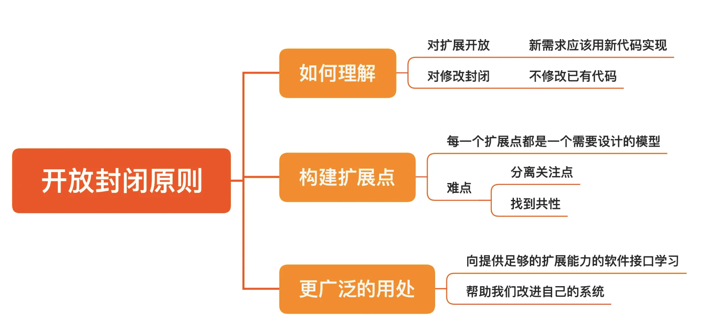

22 | Liskov 替换原则：用了继承，子类就设计对了吗？

大部分的面向接口编程要依赖于继承实现，继承实现这个接口的类，需要有个好的继承指导原则

子类型（subtype）必须能够替换其父类型（base type）。

这句话看似简单，但是违反这个原则，后果是很严重的，比如，父类型规定接口不能抛出异常，而子类型抛出了异常，就会导致程序运行的失败。

如果你发现了任何做运行时类型识别的代码，很有可能已经破坏了 LSP。

基于行为的 IS-A

IS-A 的判定是基于行为的，只有行为相同，才能说是满足 IS-A 的关系。

要满足 LSP，首先这个对象体系要有一个统一的接口，而不能各行其是，其次，子类要满足 IS-A 的关系。

明显违反 LSP 的问题，就是继承数据结构。

你会发现，LSP 的关注点让人把注意力放到父类上，而一旦子类成了重点，我们必须小心谨慎。在前面讲继承的时候，我们说过，关心子类是一种实现继承的表现，而实现继承是我们要努力摒弃的，接口继承才是我们的努力方向，而做好接口继承，显然会更符合 LSP。

总结时刻：

LSP 不仅仅可以用在类关系的设计上，我们还可以把它用在更广泛的接口设计中。任何接口都是宝贵的，在设计时，都要精心考量。

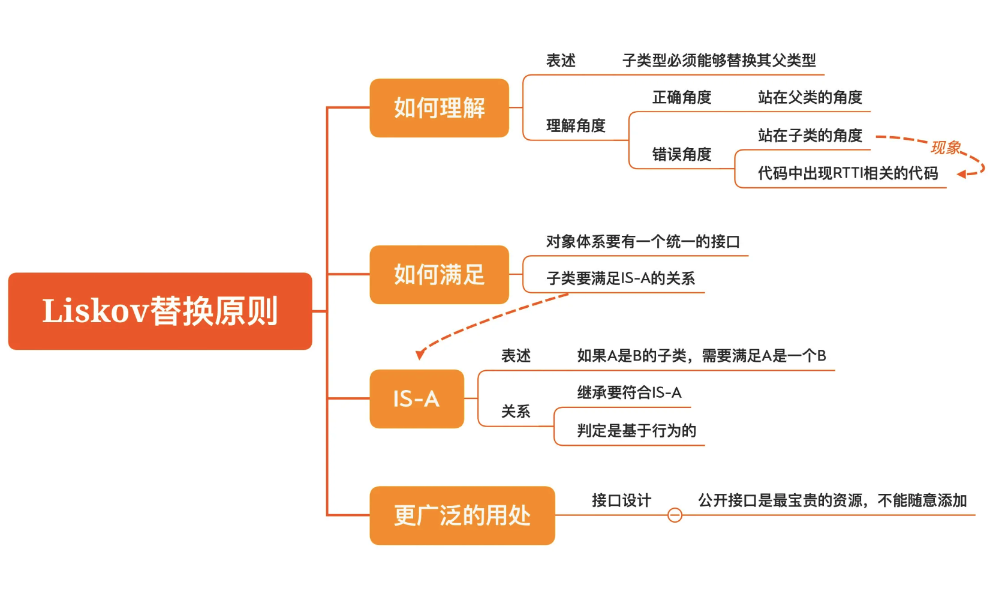

23 | 接口隔离原则：接口里的方法，你都用得到吗？

SRP 告诉我们，一个类的变化来源应该是单一的；OCP 说，不要随意修改一个类；LSP 则教导我们应该设计好类的继承关系

接口隔离原则

不应强迫使用者依赖于它们不用的方法。

实际上，很多程序员在开发过程中，其实是两种角色都没有的，他们根本没有思考过接口的问题，因为他们更关心的是一个个的具体类。只有到了必须的时候，接口才作为语法选项使用一次，这种做法干脆就是没在设计上进行思考。

在做软件设计的时候，我们经常考虑的是模型之间如何交互，接口只是一个方便描述的词汇，为了让我们把注意力从具体的实现细节中抽离出来。但是，如果没有设计特定的接口，你的一个个具体类就变成它的接口。同设计不好的接口一样，这样的“接口”往往也是存在问题的。

C/C++ 的程序在编译链接上常常需要花很多时间，除了语言本身的特点之外，因为设计没做好，造成本来不需要重新编译的文件也要重新编译的现象几乎是随处可见的。

可以理解为，如果一个接口修改了，依赖它的所有代码全部会受到影响，而这些代码往往也有依赖于它们实现的代码，这样一来，一个修改的影响就传播出去了。用这种角度去评估，你就会发现，不稳定的“胖”接口影响面是非常之广的，所以，我们说“胖”接口不好。

```java
interface TransactionRequest {
}

interface DepositRequest extends TransactionRequest {
  double getDepositAmount();
}

interface WithdrawRequest extends TransactionRequest {
  double getWithdrawAmount();
}

interface TransferRequest extends TransactionRequest {
  double getTransferAmount();
}

class ActualTransactionRequest implements DepositRequest, WithdrawRequest, TransferRequest {
  ...
}
```

这里，我们把 TransactionRequest 变成了一个接口，目的是给后面的业务处理进行统一接口，而 ActualTransactionRequest 则对应着原来的实现类。我们引入了 DepositRequest、WithdrawRequest、TransferRequest 等几个“瘦”接口，它们就是分别供不同的业务处理方法使用的接口。

```java
interface TransactionHandler<T extends TransactionRequest> {
  void handle(T request)；
}


class DepositHandler implements TransactionHandler<DepositRequest> {
  void handle(final DepositRequest request) {
    double amount = request.getDepositAmount();
    ...
  }
}


class WithdrawHandler implements TransactionHandler<WithdrawRequest> {
  void handle(final WithdrawRequest request) {
    double amount = request.getWithdrawAmount();
    ...
  }
}


class TransferHandler implements TransactionHandler<TransferRequest> {
  void handle(final TransferRequest request) {
    double amount = request.getTransferAmount();
    ...
  }
}
```

我们来回顾一下这个设计的改进过程，其中的重点就在于，原本那个大的 TransactionRequest 被拆分成了若干个小接口，每个小接口就只为特定的使用者服务。这样做的好处就在于，每个使用者只要关注自己所使用的方法就行，这样的接口才可能是稳定的，“胖”接口不稳定的原因就是，它承担了太多的职责。

我们在讲多态的时候说过，接口是把变和不变隔离开。现在有了对 ISP 的理解，我们知道了，接口应该是尽可能稳定的。接口的使用者对于接口是一种依赖关系，被依赖的一方越稳定越好，而只有规模越小，才越有可能稳定下来。

实际上，每个类都有自己的接口，所有的公开方法都是接口。

我们在做接口设计时，需要关注不同的使用者。我们可以把 ISP 理解成接口设计的 SRP。每个使用者面对的接口，其实都是一种角色接口。识别出接口不同的角色是至关重要的，这也与分离关注点的能力是相关的。

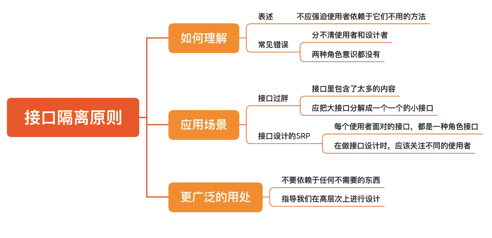

24 | 依赖倒置原则：高层代码和底层代码，到底谁该依赖谁？

依赖这个词，程序员们都好理解，意思就是，我这段代码用到了谁，我就依赖了谁。依赖容易有，但能不能把依赖弄对，就需要动点脑子了。如果依赖关系没有处理好，就会导致一个小改动影响一大片，而把依赖方向搞反，就是最典型的错误。

依赖倒置原则

高层模块不应该依赖低层模块，它们都应该依赖抽象；

抽象不应该依赖细节，细节应该依赖抽象。

在结构化编程解决问题的思路是自上而下进行功能分解

例如：

```java
class CriticalFeature {
  private Step1 step1;
  private Step2 step2;
  ...

  void run() {
    // 执行第一步
    step1.execute();
    // 执行第二步
    step2.execute();
    ...
  }
}
```

但是，这种未经审视的结构天然就有一个问题：高层模块会依赖于低层模块。在上面这段代码里，CriticalFeature 类就是高层类，Step1 和 Step2 就是低层模块，而且 Step1 和 Step2 通常都是具体类。虽然这是一种自然而然的写法，但是这种写法确实是有问题的。

软件设计需要关注长期、放眼长期，所有那些不在自己掌控之内的东西，都是有可能被替换的。

所谓倒置，就是把这种习惯性的做法倒过来，让高层模块不再依赖于低层模块。

这样一来，高层模块就不像原来一样直接依赖低层模块，而是将依赖关系“倒置”过来，让低层模块去依赖由高层定义好的接口。这样做的好处就在于，将高层模块与低层实现解耦开来。

前后对比例子

前

```java
class Handler {
  private KafkaProducer producer;

  void execute() {
    ...
    Message message = ...;
    producer.send(new KafkaRecord<>("topic", message);
    ...
  }
}
```

后

java

```java
interface MessageSender {
  void send(Message message);
}

class Handler {
  private MessageSender sender;

  void execute() {
    ...
    Message message = ...;
    sender.send(message);
    ...
  }
}
```

java

```java
class KafkaMessageSender implements MessageSender {
  private KafkaProducer producer;

  public void send(final Message message) {
    this.producer.send(new KafkaRecord<>("topic", message));
  }
}
```

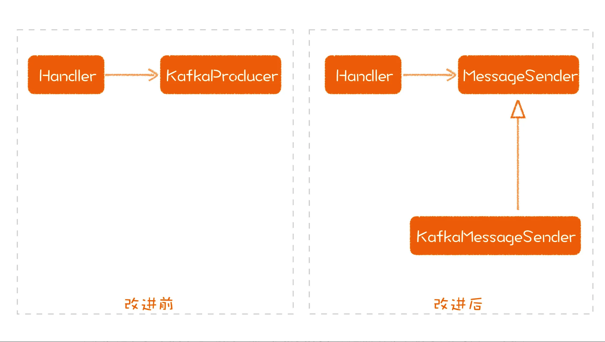

依赖于抽象

你有没有发现，我们学习的所有原则都是在讲，尽可能把变的部分和不变的部分分开，让不变的部分稳定下来。我们知道，模型是相对稳定的，实现细节则是容易变动的部分。所以，构建出一个稳定的模型层，对任何一个系统而言，都是至关重要的。

抽象不应依赖于细节，细节应依赖于抽象。

- 任何变量都不应该指向一个具体类；

- 任何类都不应继承自具体类；

- 任何方法都不应该改写父类中已经实现的方法。

负责组装的代码就需要用到一个一个的具体类（在 java 中，做这些组装工作的就是 DI 容器）

因为这些组装工作几乎是标准化的，而且非常繁琐。如果你常用的语言中，没有提供 DI 容器，最好还是把负责组装的代码和业务模型放到不同的代码里。

DI 容器在最初的讨论中有另外一个说法叫 IoC 容器，这个 IoC 是 Inversion of Control 的缩写，你会看到 IoC 和 DIP 中的 I 都是 inversion，二者表现的意图实际上是一致的。

是的，如果你想去编写一个框架，理解 DIP 是非常重要的。毫不夸张地说，不理解 DIP 的程序员，就只能写功能，不能构建出模型，也就很难再上一个台阶。在前面讨论程序库时，我建议每个程序员都去锻炼编写程序库，这其实就是让你去锻炼构建模型的能力。

对于任何一个项目而言，了解不同模块的依赖关系是一件很重要的事。

理解了 DIP，再来看一些关于依赖的讨论，我们也可以看到不同的角度。比如，循环依赖，有人会说从技术上要如何解决它，但实际上，循环依赖就是设计没有做好的结果，把依赖关系弄错了，才可能会出现循环依赖，先把设计做对，把该有的接口提取出来，依赖就不会循环了。

总结时刻

高层模块不依赖于低层模块，可以通过引入一个抽象，或者模型，将二者解耦开来。高层模块依赖于这个模型，而低层模块实现这个模型。

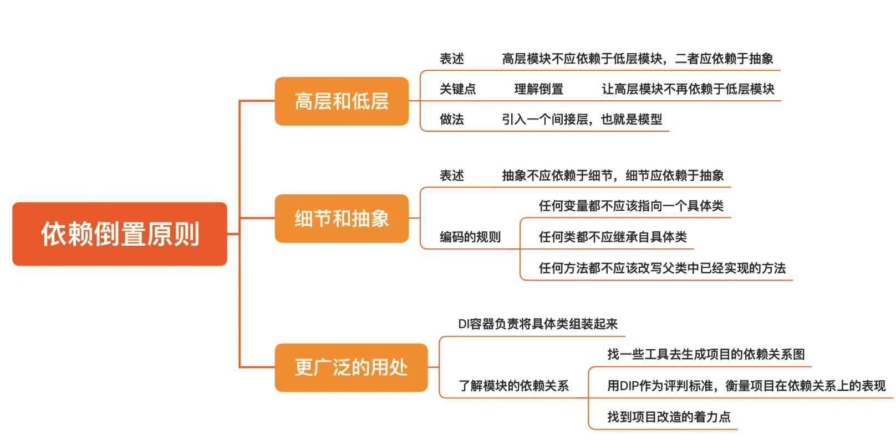

Anti-Corruption Layer

25 | 设计模式：每一种都是一个特定问题的解决方案

设计模式：一种特定的解决方案

设计原则就像公理，而设计模式就像定理。 他们是在特定场景下， 对于经常发生的问题给出的一个可复用的解决方案。

学习设计模式不要贪多求全，这样注定会吃力不讨好。

学习设计模式不仅仅要学习代码怎么写，更重要的是要了解模式的应用场景。

从原则到模式

设计原则其实是这些模式背后的东西

在真实的项目中，你可能很难一眼就看出当前场景是否适合使用某个模式，更实际的做法就是这样遵循着设计原则一点点去调整代码。

设计模式只是设计原则在特定场景下的应用。

开眼看模式

学习设计模式，我们还应该有一个更开阔的视角。首先是要看到语言的局限，虽然设计模式本身并不局限于语言，但很多模式之所以出现，就是受到了语言本身的限制。

比如，Visitor 模式主要是因为 C++、Java 之类的语言只支持单分发，也就是只能根据一个对象来决定调用哪个方法。而对于支持多分发的语言，Visitor 模式存在的意义就不大了。

学习设计模式，从设计原则开始，不局限于模式

随着程序语言的发展不断更新，例如有些模式有了新的写法，比如：Observer、Decorator、Command 等等。

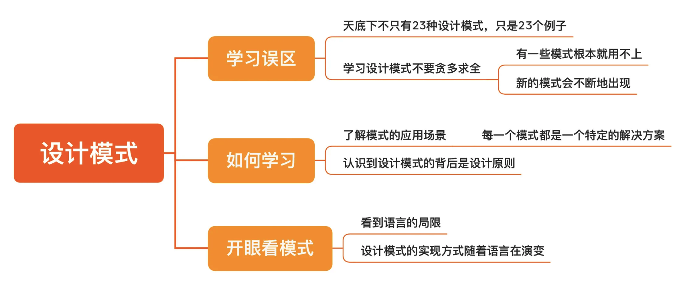

26 | 简单设计：难道一开始就要把设计做复杂吗？

Kiss 原则， 保持简单能够让系统运行得更好。

- 如果有现成的程序库，就不要自己写；

- 能用文本做协议就别用二进制；

- 方法写得越小越好；

- 能把一个基本的流程打通，软件就可以发布，无需那么多的功能；

上面的原则听上去很有吸引力，但是并不能指导具体的工作。所以在软件领域

YAGNIYAGNI 是“You aren’t gonna need it”的缩写，也就是，你用不着它。这个说法来自于极限编程社区（Extreme Programming，简称 XP），我们可以把它理解成：如非必要，勿增功能。

YAGNI 是一种上游思维，就是尽可能不去做不该做的事，从源头上堵住。从某种意义上说，它比其他各种设计原则都重要。

DRYDRY 是“Don’t repeat yourself”的缩写，也就是，不要重复自己。

虽然我们在这里讲的是代码，但 DRY 原则并不局限于写代码，比如：

- 注释和代码之间存在重复，可以尝试把代码写得更清晰；

- 内部 API 在不同的使用者之间存在重复，可以通过中立格式进行 API 的定义，然后用工具生成文档、模拟 API 等等；

- 开发人员之间做的事情存在重复，可以建立沟通机制降低重复；

简单设计之所以叫简单设计，因为它只包含了 4 条规则：

- 通过所有测试；

- 消除重复；

- 表达出程序员的意图；

- 让类和方法的数量最小化。

总结时刻今天，我给你讲了一些启发性的编程原则，这些设计原则更像是一种思考方式，让我们在软件设计上有更高的追求：KISS 原则，Keep it simple, stupid，我们要让系统保持简单；YAGNI 原则，You aren’t gonna need it，不要做不该做的需求；DRY 原则，Don’t repeat yourself，不要重复自己，消除各种重复。

我们还讲了一个可以指导我们实际工作的简单设计原则，它有 4 条规则：通过所有测试；消除重复；表达出程序员的意图；让类和方法的数量最小化。

27 | 领域驱动设计：如何从零开始设计一个软件？

学习 DDD，就要从理解 DDD 的根基入手：通用语言（Ubiquitous Language）和模型驱动的设计（Model-Driven Design），而领域驱动设计的过程，就是建立起通用语言和识别模型的过程。

事件风暴是一个工作坊，基本做法就是找一面很宽的墙，上面铺上大白纸，然后，用便利贴把识别出来的概念贴在上面。当然，前提依然是让业务人员和技术人员都参与其中。

这个实践之所以叫作事件风暴，因为它的关注点在于领域事件。领域事件是用来记录业务过程中发生过的重要事情，比如，作为电商平台的工作人员，你想知道产品是不是已经上架了，这个领域事件就是产品已上架；作为消费者，你会关心我的订单是不是下成功了，这个领域事件就是订单已下。

事件风暴这个工作坊主要分成三步：

第一步就是把领域事件识别出来，这个系统有哪些是人们关心的结果。有了领域事件，下面一个问题是，这些事件是如何产生的，它必然会是某个动作的结果。

第二步就是找出这些动作，也就是引发领域事件的命令。比如：产品已上架是由产品上架这个动作引发的，而订单已下就是由下单这个命令引发的。

第三步就是找出与事件和命令相关的实体或聚合，比如，产品上架就需要有个产品（Product），下单就需要有订单（Order）。

模型驱动设计

也正是因为在通常情况下，业务模型数量众多，所以在 DDD 的过程中，我们将设计分成了两个阶段：战略设计（Strategic Design）和战术设计（Tactical Design）。

战略设计是高层设计，是指将系统拆分成不同的领域。而领域驱动设计，核心的概念就是领域，也就是说，它给了我们一个拆分系统的新视角：按业务领域拆分。

比如，我把一个电商系统拆分成产品域、订单域、支付域、物流域等。拆分成领域之后，我们识别出来的各种业务对象就会归结到各个领域之中。然而，有时候，不同领域的业务对象会进行交互，比如，我要知道自己订单的物流情况。所以，要在不同的领域之间设计一些交互的方式。

而战术设计是低层设计，也就是如何具体地组织不同的业务模型。在这个层次上，DDD 给我们提供了一些标准的做法供我们参考。比如，哪种模型应该设计成实体，哪些应该设计成值对象。

我们还要考虑模型之间是什么样的关系，比如，哪些模型要一起使用，可以成为一个聚合。接下来，我们还需要考虑这些模型从哪来、怎样演变，DDD 同样为我们提供了一些标准的设计概念，比如仓库、服务等等。

总结时刻

DDD 的模型设计可以分为战略设计和战术设计。战略设计是高层设计，将系统拆分成领域，战术设计是低层设计，考虑如何组织不同的模型。

建立一套业务人员和开发人员共享的通用语言。

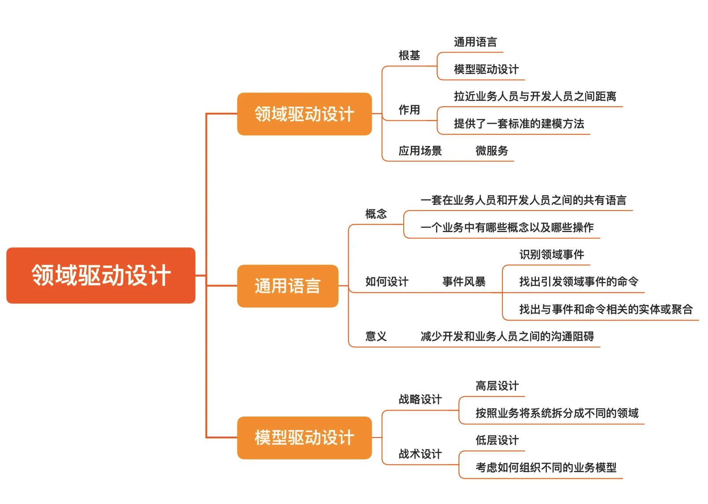

28 | 战略设计：如何划分系统的模块？

支撑 DDD 最核心的就是通用语言和模型驱动设计的方法

DDD 又分成两个阶段，战略设计和战术设计

战略设计中的概念，一部分是为了将不同的业务区分开来，也就是要将识别出来的业务概念做一个划分，另一部分则是将划分出来的业务落实到真实的解决方案中。

业务概念的划分

还有一种子域叫通用域，就是行业里通常都是这么做，即便不自己做，也并不影响你的业务运行。比如，很多 App 要给用户发通知，这样的功能完全可以买一个服务来做，丝毫不影响你的业务运行。它就是一个通用域。

29 | 战术设计：如何像写故事一样找出模型？

30 | 程序库的设计：Moco 是如何解决集成问题的？

总结时刻

今天，我给你讲了 Moco 的设计过程。一个好的软件也好，程序库也罢，都是从实际的问题出发的。阻碍一个程序员写出好的程序库的原因，往往是没有找到一个好问题去解决。程序员不能只当一个问题的解决者，还应该经常抬头看路，做一个问题的发现者。

有了问题之后，需要把问题拆解成可以下手解决的需求，让自己有一个更明确的目标。然后，我们才是根据这个需求找到一个适当的解决方案。一个通用的解决方案需要不断地抽丝剥茧，抛开无关的部分，找到核心的部分，这同样根植于分离关注点。

一个好的设计，应该找到一个最小的核心模型，所有其他的内容都是在这个核心模型上生长出来的，越小的模型越容易理解，相对地，也越容易保持稳定。

31 | 应用的设计：如何设计一个数据采集平台？

对我们程序员而言，一件事是不是有技术含量往往不取决于事情本身，而取决于我们怎么做它。换言之，问题是一样的，但不同的解决方案却会带来不同的效果。业务人员提出的是问题，解决方案是由技术人员给出的，千万别混淆问题和解决方案。

当你可以预见一件事将来会很繁琐、会不断重复，而且会持续相当长的时间，这时候我们就需要重新审视我们的解决方案了。

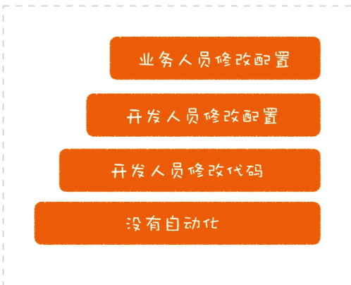

一个更好的设计从拒绝低水平重复开始，把工作做成有技术含量的事情。

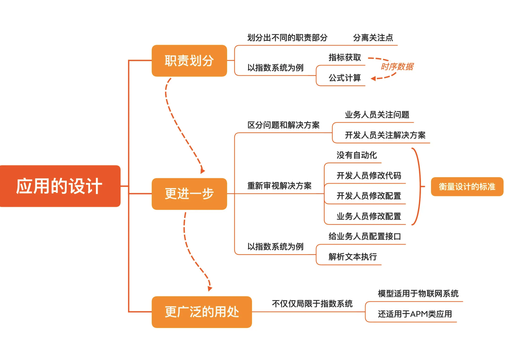

32 | 应用的改进：如何改进我们的软件设计？

设计一个系统和实施一次系统改进是两个完全不同的问题，可以分阶段地进行。

在这种情况下，我们该怎么办呢？我给你一个入手的起点，就是接口。

想要理解一个系统的设计，可以按照模型、接口和实现的这个框架去理解，其中，接口是模型能力的体现。

改进既有设计，从做一个正常的设计开始，小步向前。


不过，一切经验积累的前提条件是，先有软件设计的意识。

普通程序员和高手之间的差别就在于此，普通程序员凭直觉做事，高手却是把专业的做法训练成直觉
