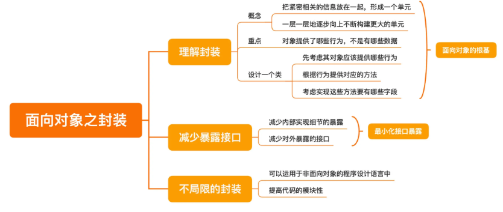
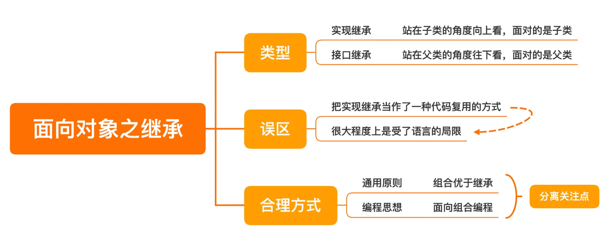
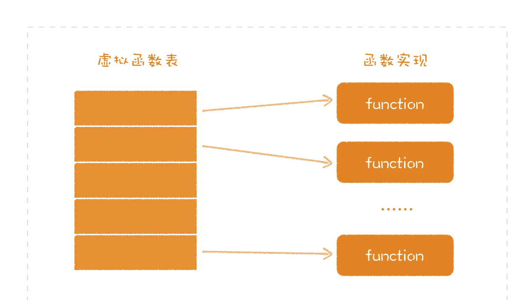
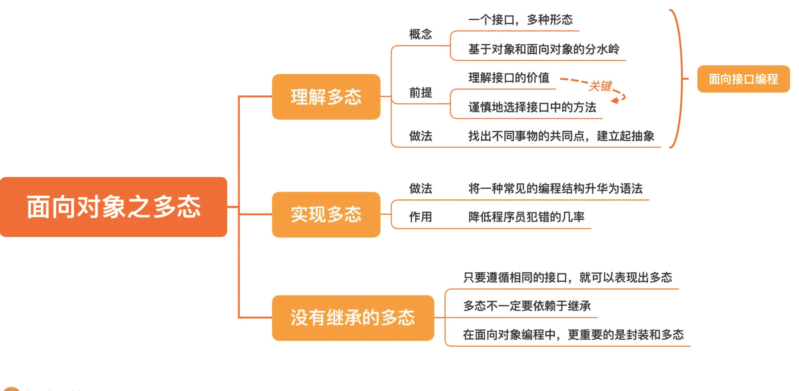

# 软件设计之美

## 开篇词 | 软件设计，应对需求规模的“算法”

算法和软件设计其实是一样的，二者都是对抗的都是规模问题。只不过算法对抗的是数据的规模，而软件设计对抗的是需求的规模

你现在应该理解了，为什么软件设计是一门关注长期的学问了，因为只有长期的积累，需求才会累积，规模问题才会凸显出来。软件设计，实际上就是应对需求的“算法”。

关注长期变化的软件设计
设计是为了让软件在长期更容易适应变化。

如何学习软件设计

软件设计学习的难度，不在于一招一式，而在于融会贯通

对于软件设计：我们可以将其划分为两个维度：“了解现有软件的设计” 和“自己设计一个软件”

一个快速了解现有软件设计的方法，那就是抓住这个软件最核心的三个部分：模型、接口和实现。

例如：

- 我们怎样理解 Spring DI 容器模型，它的模型怎样有效解决了其面对的问题；

- 如何理解 Ruby on Rails 的接口，我们可以从其接口设计中借鉴哪些内容；

- Kafka 的实现有哪些独特之处，实现的诸多细节中，我们应该关注哪些内容。

软件设计的基础知识：

- 程序设计语言；
- 编程范式；
- 设计原则；
- 设计模式；
- 设计方法。

程序设计语言，是软件设计落地的基础。任何设计都依赖程序设计语言来实现。但任何语言也都有自己的局限，我将带领你横跨语言学语言，让你不再局限于某一种语言，而是择其善者而从之，更好地落地你的设计。

编程范式，是代码编写的风格，决定着你在设计时可以用到哪些元素：是模块、是对象，还是函数。在不同层次的设计中，选择不同的编程范式已经成为今天开发的主流。在这个主题下，我选择了几个最主流的编程范式，包括结构化编程、面向对象和函数式编程，帮你建立起软件设计的根基。

设计原则，是你在进入到具体设计的层面时，可以用来评判自己工作结果的一个衡量标准。我会给你介绍面向对象的主流设计原则：SOLID 原则。一来面向对象是当今的主流开发方式，二来 SOLID 原则也是比较成体系的设计原则，它本身也在不断发展。

设计模式，是设计原则在具体场景下的应用。

领域驱动设计

## 01 | 什么是软件设计？

核心的模型

区别于解决简单的问题，软件的开发往往是一项长期的工作，会有许多人参与其中。在这种情况下，就需要建立起一个统一的结构，

而在软件的开发过程中，这种统一的结构就是模型，而软件设计就是要构建出一套模型。

这里所说的模型，不仅包括用来描述业务的各种实体，也包括完成业务功能的各种组件。人们写代码中常常会用到的服务（Service）、调度器（Scheduler）等概念就是一个一个的模型。

模型，是一个软件的骨架，是一个软件之所以是这个软件的核心。

模型的粒度可大可小。如果把模型理解为一个一个的类，是不是你就会熟悉很多了，这就是小的模型。你也可以把一整个系统当作一个整体来理解，这就是大的模型。

“高内聚、低耦合”，（模块的内聚程度越高越好，模块间的耦合程度越低越好），这其实就是对模型的要求

即便是在一个软件内部，模型也可以是分层的。我们可以先从最核心的模型开始构建，有了这个核心模型之后，可以通过组合这些基础的模型，构建出上面一层的模型。

约束的规范

规范，就是限定了什么样的需求应该以怎样的方式去完成。

一种常见的问题就是缺乏显式的、统一的规范。

规范的一个重要作用，就是维系软件长期的演化。如果没有显式的规范，项目的维系只能依靠团队成员个人的发挥，老成员一个没留神，新成员就可能创造出一种诡异的新写法，项目就朝着失控又迈出了一步。

规范，就是限定了什么样的需要求应该以怎样的方式去完成。

一种常见的问题就是缺乏显式的、统一的规范。

规范的一个重要作用，就是维系软件长期的演化。如果没有显式的规范，项目的维系只能依靠团队成员个人的发挥，老成员一个没留神，新成员就可能创造出一种诡异的新写法，项目就朝着失控又迈出了一步。

没有一个统一的规范，每一个项目上的新成员都会痛斥一番前人的不负责任。然后，新的人准备另起炉灶，增加一些新东西。这种场景你是不是很熟悉呢？混乱通常就是这样开始的。

关于规范，还有一种常见问题就是，规范不符合软件设计原则。我给你讲一个让我印象深刻的故事。

只是因为旧的规范不符合软件设计原则而导致的错误：外部请求的对象需要在防腐层转换为内部对象。

模型与规范

有了模型，有了规范，那模型与规范是什么关系呢？模型与规范，二者相辅相成。一个项目最初建立起的模型，往往是要符合一定规范的，而规范的制定也有赖于模型。这就像讨论户型设计时，你可以按照各种方式组合不同的空间（模型），却不会把厨房与卫生间放在一起（规范）。


防腐层的理解： 在限界上下文之间映射（说白了就是交互）的方式，体现在代码上就是一个对象的转换，这个转换的意义在于隔离变化，防止因为对象在一个上下文中的变化扩散到其他的上下文中。

02 | 分离关注点：软件设计至关重要的第一步

技术和业务被混在了一起，随之而来的就是无尽的后患

这与业务并不是一个维度的事情，我们在做设计时，要能够发现这些非功能性的需求。也就是说，我们在分解问题的时候，会有很多维度，每一个维度都代表着一个关注点，这就是设计中一个常见的说法，“分离关注点（Separation of concerns）”。

最常见的一类问题就是把业务处理和技术实现两个关注点混在了一起，

**大部分程序员都不应该编写多线程程序。**

在真实项目中，程序员最常犯的错误就是认为所有问题都是技术问题，总是试图用技术解决所有问题。任何试图用技术去解决其他关注点的问题，只能是陷入焦油坑之中，越挣扎，陷得越深。

另外一个常见的容易产生混淆的关注点是不同的数据变动方向。

不同的数据变动方向：

动静分离，就是把变和不变的内容分开；

读写分离，就是把读和写分开；

前面提到的高频和低频，也可以分解开；

**不同的数据变动方向，就是一个潜在的、可以分离的关注点。**

分离关注点之所以重要，有两方面原因。一方面，不同的关注点混在一起会带来一系列的问题，正如前面提到的各种问题；另一方面，当分解得足够细小，你就会发现不同模块的共性，才有机会把同样的信息聚合在一起。这会为软件设计的后续过程，也就是组合，做好准备。

如果今天的内容你只能记住一件事，那请记住：分离关注点，发现的关注点越多越好，粒度越小越好。


03 | 可测试性： 一个影响软件设计的重要因素

软件设计要考虑“可测试性”

软件开发要解决的问题是从需求而来。需求包括两大类，第一类是功能性需求，也就是要完成怎样的业务功能；第二类是非功能性需求，是业务功能之外的一些需求。

非功能性需求也被分为两大类，一类称为执行质量（Execution qualities），你所熟悉的吞吐、延迟、安全就属于这一类，它们都是可以在运行时通过运维手段被观察到的；而另一类称为演化质量（Evolution qualities），它们内含于一个软件的结构之中，包括可测试性、可维护性、可扩展性等。


我们要保证每个小模块的正确性，就要保证每个模块在开发阶段能够测试，而想要每个模块能够测试，在设计过程中，就要保证每个模块是可以测试的，而这就是可测试性。

一旦我们在可测试性上考虑不足，就会引发一系列的后续问题。比如，复杂的系统不仅仅在测试上有难度，在集成、部署等各个环节，都有其复杂性，完成一次部署往往也需要很长时间。

所以，我们在设计一个函数 / 模块 / 系统时，必须将可测试性纳入考量，以便于能够完成不同层次的测试，减少对集成环境的依赖。

那么，具体该如何做呢？一方面，尽可能地给每个模块更多的测试，使构成系统的每个模块尽可能稳定，把集成测试环境更多地留作公共的验收资源。另一方面，尽可能搭建本地的集成测试环境，周边的系统可以采用模拟服务的方案。

在软件开发过程中考虑测试，实际上是思考软件的质量问题，而把质量的思考前移到开发，甚至是设计阶段，是软件开发从传统进入到现代的重要一步。


04 | 三步走：如何了解一个软件的设计？

模型、接口和实现

了解一个软件的设计可以从三个部分着手： 模型、接口和实现。

这三者的关系就好比你去看代码，你会先去看有哪些类以及它们之间的关系，这就是看模型；然后你会打开一个具体的类，看它提供了哪些方法，这就相当于看接口；最后，你再来打开一个具体的方法，去看它的代码是怎么写的，这就是看实现。

**首先是模型**，它是一个软件的核心部分。在其它的材料里，也有人称之为抽象，为了统一，我这里就都叫模型了。我们在前面的课程里也说过，设计最关键的就是构建出模型。而理解一个设计中的模型，可以帮助我们建立起对这个软件整体的认知。

**其次是接口**，它决定了软件通过怎样的方式，将模型提供的能力暴露出去。它是我们与这个软件交互的入口。如何理解这句话呢？我给你举几个具体的例子。

- 一个程序库的接口就是它的 API，但对于同样的模型，每个人会设计出不同的 API，而不同的 API 有着不同的表达能力。比如：Google 的 Guava 对 JDK 的一些 API 重新做了封装，其目的就是简化开发，而很多优秀的做法后来又被 JDK 学了回去。

- 一个工具软件一般会提供命令行接口，比如，每个程序员必备的基本技能——Unix 命令行工具就是典型的命令行接口。

- 一个业务系统的接口，就是对外暴露的各种接口，比如，它提供的各种 REST API，也可能是提供了 RPC 给其它系统的调用。
- ……

如果你想深入源码，去了解一个软件，接口是一个很好的指向标。你可以从一个接口进入到软件中，看它是怎样完成各种基本功能的。

**最后是实现**，就是指软件提供的模型和接口在内部是如何实现的，这是软件能力得以发挥的根基。这么说可能比较抽象，我再来举些例子。

- 一个业务系统收到一个请求之后，是把信息写到数据库，还是转发给另外的系统。
- 一个算法的实现，是选择调用与别人已有的程序库，还是需要自己实现一个特定的算法。
- 一个系统中的功能，哪些应该做成分布式的，哪些应该由一个中央节点统一处理。
- 一段业务处理，是应该做成单线程，还是多线程的。当资源有竞争，是每个节点自己处理，还是交由一个中间件统一处理。
- 不同系统之间的连接，该采用哪种协议，是自己实现，还是找一个中间件。

在讨论设计时应该遵循一个顺序：，先模型，再接口，最后是实现，同理，了解一个设计也应该遵循这样的顺序。

我还要强调一点，在了解设计时，要按层次去了解，因为设计常常是分层的。每当我们打开一个层次，需要了解它的内部时，我们还要按照模型、接口和实现的顺序解读这个层次。

我用大家比较熟悉的操作系统来举个例子，如果你去了解它的内部，就知道它有内存管理、进程调度、文件系统等模块。我们可以按照模型、接口和实现去理解每个模块，就以进程管理为例：

—— 进程管理的核心模型就包括进程模型和调度算法；
—— 它的接口就包括，进程的创建、销毁以及调度算法的触发等；
—— 不同调度算法就是一个个具体的实现。

今天，我们学习了如何了解一个软件设计，可以从三个部分入手：模型、接口和实现。

模型，也可以称为抽象，是一个软件的核心部分，是这个系统与其它系统有所区别的关键，是我们理解整个软件设计最核心的部分。

接口，是通过怎样的方式将模型提供的能力暴露出去，是我们与这个软件交互的入口。

实现，就是软件提供的模型和接口在内部是如何实现的，是软件能力得以发挥的根基。


05 | Spring DI 容器：如何分析一个软件的模型？

今天这一讲，我们就先来谈谈了解设计的第一步：模型。如果拿到一个项目，我们怎么去理解它的模型呢？我们肯定要先知道项目提供了哪些模型，模型又提供了怎样的能力。

我们都知道，任何模型都是为了解决问题而生的，所以，理解一个模型，需要了解在没有这个模型之前，问题是如何被解决的，这样，你才能知道新的模型究竟提供了怎样的提升。也就是说，理解一个模型的关键在于，要了解这个模型设计的来龙去脉，知道它是如何解决相应的问题。

耦合的依赖

Spring DI 容器的模型，就是一个典型的模型。它的核心模型就是依赖注入（Dependency Injection，简称 DI），它的接口就是 BeanFactory 和 ApplicationContext，它的实现就是 DefaultListableBeanFactory 和 ClassPathXmlApplicationContext。

那么，DI 容器要解决的问题是什么呢？它解决的是组件创建和组装的问题，但是为什么这是一个需要解决的问题呢？这就需要我们了解一下组件的创建和组装。

分离的依赖

把所有的对象创建和组装在一个地方完成：

...
ArticleRepository repository = new DBArticleRepository(connection);
AriticleService service = new ArticleService(repository);
...

虽然很无聊，但这一部分代码很重要，最好的解决方案就是有一个框架把它解决掉。在 Java 世界里，这种组装一堆对象的东西一般被称为“容器”，我们也用这个名字。

Container container = new Container();
container.bind(Connection.class).to(connection);
container.bind(ArticleReposistory.class).to(DBArticleRepository.class);
container.bind(ArticleService.class).to(ArticleService.class)

ArticleService service = container.getInstance(ArticleService.class);

至此，一个容器就此诞生。因为它解决的是依赖的问题，把被依赖的对象像药水一样，注入到了目标对象中，所以，它得名“依赖注入”（Dependency Injection，简称 DI）。这个容器也就被称为 DI 容器了。

有了 di 容器，对象的创建和组装都由 di 容器完成了。

而且，一旦有了容器的概念，它还可以不断增强。比如，我们想给所有与数据库相关的代码加上时间监控，只要在容器构造对象时添加处理即可。你可能已经发现了，这就是 AOP（Aspect Oriented Programming，面向切面编程）的处理手法。而这些改动，你的业务代码并无感知。


理解模型，要了解模型设计的来龙去脉。

06 | Ruby on Rails：如何分析一个软件的接口？

Ruby on Rails 模型

Rails 是标准的基于 MVC 模型进行开发的 Web 框架。

前面我提到过理解接口应该先找主线，找到项目主线的一个方法就是从起步走文档开始，因为它会把项目最基本的用法展现给你，你可以轻松地找到主线。

有了主线之后，我们就要开始从中了解接口的风格。Rails 给我们提供的三种接口，分别是：

Web 应用对外暴露的接口：
REST API；程序员写程序时用到的接口：
API；程序员在开发过程中用到的接口：命令行。

总结时刻：理解一个项目的接口，先找主线，再看风格。

07 | Kafka：如何分析一个软件的实现？

你需要找到两个关键点：软件的结构和关键的技术。

Kafka

Kafka 是一个分布式流平台。这是它现在的发展方向，但在更多人的心目中，Kafka 的角色是一个消息队列

消息队列还有一个最常见的特性是，它会提供一定的消息存储能力。这样的话，当生产者发消息的速度快于消费者处理消息的速度时，消息队列可以起到一定的缓冲作用。所以，有一些系统会利用消息队列的这个特性做“削峰填谷”，也就是在消息量特别大时，先把消息收下来，慢慢处理，以减小系统的压力。

消息队列实现消息存储的方式通常是把它写入到磁盘中，而 Kafka 的不同之处在于，它利用了磁盘顺序读写的特性。

如果站在了解实现的角度，你会觉得非常地自然。但要想从设计的角度学到更多，我们还是应该带着问题上路，多问自己一个问题，为什么其他的消息队列之前不这么做呢？这是一个值得深思的问题。Kafka 这个实现到底是哪里不容易想到呢？答案是软硬结合。

之前的消息队列实现也会把消息写入到文件里，但文件对它们来说，只是一个通用的接口。开发者并没有想过利用硬件的特性做开发。而 Kafka 的开发者突破了这个限制，把硬件特性利用了起来，从而取得了更好的结果。

总结时刻：
如果想了解一个系统的实现，应该从软件结构和关键技术两个方面着手。

08 | 语言的模型：如何打破单一语言局限，让设计更好地落地？

发展，就是函数式编程的程序设计语言，这方面的代表就是 LISP。

一切语法都是语法糖

学习程序设计语言其实就是要学习语言提供的编程模型，不提供新编程模型的语言是不值得刻意学习的。

如果你已经学会了一两门程序设计语言，学习一门新的语言其实并不困难，因为每种语言提供的新模型是有限的，基本的元素是类似的，无非是用了不同的关键字。

所以，学习新语言，只是在做增量的学习，思维负担并没有那么沉重。一旦对于程序设计语言的模型有了新的认识，你就能理解一件事：一切语法都是语法糖。

09 | 语言的接口：语法和程序库，软件设计的发力点

程序库就是为了消除重复而出现的。而消除重复，也是软件设计的初衷。

程序库（Library）是程序员最熟悉的一项内容。学习一门新语言，首先是学习语法（Syntax），然后学习程序库（Library），之后再学习运行时（Runtime），这样，你就具备一门语言的基础了。再往后，你需要了解的就是各种惯用法（Idiom），以及如何运用到实际的工作中。

一个经过验证的模式最终变成了语言的一部分，而它的起点只是一个常见的用法：一个程序库。

通常是先有程序库，再有语法；如果语法不够好，新的程序库就会出现，新一轮的编程模型就开始孵化。

js 也是如此，后面出的 es20xx，的各种新语法特性，很多都是来自程序库。

一切有生命力的语言都会不断改善自己的语法，某些好用的程序库就可以转正成为语法。

总结时刻

提升软件设计能力，可以从编写程序库入手


10 | 语言的实现：运行时，软件设计的地基

程序设计语言的实现就是支撑程序运行的部分：运行时，也有人称之为运行时系统，或运行时环境，它主要是为了实现程序设计语言的执行模型。

相比于语法和程序库，我们在学习语言的过程中，对运行时的关注较少。因为不理解语言的实现依然不影响我们写程序，那我们为什么还要学习运行时呢？

因为运行时，是我们做软件设计的地基。

我用个例子来进行说明，我曾经参与过一个开源项目：在 JVM 上运行 Ruby。这种行为肯定不是 Java 语言支持的，为了让 Ruby 能够运行在 JVM 上，我们将 Ruby 的代码编译成了 Java 的字节码，而字节码就属于运行时的一部分。

react 的运行时，也是如此，将 jsx 通过 babel 编译成 js，然后在浏览器中运行。

做设计真正的地基，并不是程序设计语言，而是运行时，有了对于运行时的理解，我们甚至可以做出语言本身不支持的设计。

运行时的编程接口

比如，使用 C 语言编程时，我们可以实现多态，做法就是自己实现一个虚拟表，这就是面向对象语言实现多态的一种方案。
总结时刻

今天，我们讨论了程序设计语言的实现：运行时。对于运行时的理解，我们甚至可以做出语言本身不支持的设计。所以，做设计真正的地基，并不是程序设计语言，而是运行时。

11 | DSL：你也可以设计一门自己的语言

讲到程序设计语言模型时，我说过，程序设计语言的发展趋势，就是离计算机本身越来越远，而离要解决的问题越来越近。但通用程序设计语言无论怎样逼近要解决的问题，它都不可能走得离问题特别近，因为通用程序设计语言不可能知道具体的问题是什么。

如果我们能把设计做到极致，它就能成为一门语言，填补这个空间。


这种语言就是领域特定语言（Domain Specific Language，简称 DSL），它是一种用于某个特定领域的程序设计语言。

通用语言都是图灵完备的，但 DSL 不必做到图灵完备，它只要做到满足特定领域的业务需求，就足以缩短问题和解决方案之间的距离，降低理解的门槛。

领域特定语言

程序员最熟悉的一种 DSL 就是正则表达式了，没错，也许已经习惯使用正则表达式的你都不知道，但它确实就是一种 DSL，一种用于文本处理这个特定领域的 DSL。

如果你觉得正则表达式有点复杂，还有一种更简单的 DSL，就是配置文件。你可能真的不把配置文件当作一种 DSL，但它确实是在实现某个特定领域的需求，而且可以根据你的需求对软件的行为进行定制。

一个典型的例子是 Ngnix。无论你是用它单独做 Web 服务器也好，做反向代理也罢，抑或是做负载均衡，只要通过 Ngnix 的配置文件，你都能实现。配合 OpenResty，你甚至可以完成一些业务功能。

从设计角度看，DSL 最终呈现出来的语法只是一种接口，但最重要的是它包裹的模型。

Martin Fowler 在他的《领域特定语言》这本书中，将这个模型称为语义模型（Semantic Model）。

想要实现一个 DSL，可以这么说，DSL 的语法本身都是次要的，模型才是第一位的。当你有了模型之后，所谓的构建 DSL，就相当于设计一个接口，将模型的能力暴露出来。

既然是接口，形式就可以有很多种，我们经常能接触到的 DSL 主要有两种：外部 DSL 和内部 DSL。Martin Fowler 在他的书中还提到了语言工作台（Language Workbench），不过，这种做法在实际工作中用到的不多，我们暂且忽略。

外部 DSL 和内部 DSL 的区别就在于，DSL 采用的是不是宿主语言（Host Language）。你可以这么理解，假设你的模型主要是用 Java 写的，如果 DSL 用的就是 Java 语言，它就是内部 DSL，如果 DSL 用的不是 Java，比如，你自己设计了一种语法，那它就是外部 DSL。

把概念说清楚了，一些问题便迎刃而解了。这也可以解释为什么 DSL 让有些人畏惧了，原因就是说起 DSL，这些人想到的就是自己设计语法的外部的 DSL。其实，即便是外部 DSL，也不一定要设计一门语法，我们甚至可以借助已有的语法来完成。比如，很多程序员熟悉的一种语法：XML。

如果你是一个 Java 程序员，XML 就再熟悉不过了。从 Ant 到 Maven，从 Servlet 到 Spring，曾经的 XML 几乎是无处不在的。如果你有兴趣，可以去找一些使用 Ant 做构建工具的项目，项目规模稍微大一点，其 XML 配置文件的复杂程度就不亚于普通的源代码。

因为它本质上就是一种用于构建领域的 DSL，只不过，它的语法是 XML 而已。正是因为这种 DSL 越来越复杂，后来，一种新的趋势渐渐兴起，就是用全功能语言（也就是真正的程序设计语言）做 DSL，这是后来像 Gradle 这种构建工具逐渐流行的原因，它们只是用内部 DSL 替换了外部 DSL。

从复杂度而言，自己设计一种外部 DSL 语法，大于利用一种现有语法做外部 DSL，二者之间的差别在于谁来开发解析器。而外部 DSL 的复杂度要大于内部 DSL，因为内部 DSL 连解析的过程都省略了。从实用性的角度，更好地挖掘内部 DSL 的潜力对我们的实际工作助益更多。

二者的抽象级别是不同的，“怎么做”是一种实现，而“做什么”则体现着意图。将意图与实现分离开来，是内部 DSL 与普通的程序代码一个重要的区别，同样，这也是一个好设计的考虑因素。

Martin Fowler 在讨论 DSL 定义时，提到了 DSL 的 4 个关键元素：

计算机程序设计语言（Computer programming language）；

语言性（Language nature）；

受限的表达性（Limited expressiveness）；

针对领域（Domain focus）。

其中，语言性强调的就是 DSL 要有连贯的表达能力。也就是说，你设计自己的 DSL 时，重点是要体现出意图。抛开是否要实现一个 DSL 不说，的确，程序员在写代码时应该关注代码的表达能力，而这也恰恰是很多程序员忽略的，同时也是优秀程序员与普通程序员拉开差距的地方。

普通程序员的关注点只在于功能如何实现，而优秀的程序员会懂得将不同层次的代码分离开来，将意图和实现分离开来，而实现可以替换。

说到这里，你就不难理解学习内部 DSL 的价值了，退一步说，你不一定真的要自己设计一个内部 DSL，但学会将意图与实现分离开，这件事对日常写代码也是有极大价值的。

有了这个意识，你就可以很好地理解程序设计语言的一个重要发展趋势：声明式编程。现在一些程序设计语言的语法就是为了方便进行声明式编程，典型的例子就是 Java 的 Annotation。正是它的出现，Spring 原来基于 XML 的外部 DSL 就逐步转向了今天常用的内部 DSL 了，也就是很多人熟悉的 Java Config。

你会发现，虽然我在这说的是写代码，但分离意图和实现其实也是一个重要的设计原则，是的，想写好代码，一定要懂得设计。

意图可以理解成方法命名，实现可以理解成方法里的每行代码。

意图可以理解成接口定义，实现可以理解成实现类。


12 | 编程范式：明明写的是 Java，为什么被人说成了 C 代码？

编程范式， 指的是程序的编写模式

现在主流的编程范式主要有三种：

结构化编程（structured programming）；

面向对象编程（object-oriented programming）；

函数式编程（functional programming）。

结构化编程，是大部分程序员最熟悉的编程范式，它通过一些结构化的控制结构进行程序的构建。你最熟悉的控制结构应该就是 if/else 这样的选择结构和 do/while 这样的循环结构了。结构化编程是最早普及的编程范式，现在最典型的结构化编程语言是 C 语言。C 语言控制结构的影响极其深远，成为了很多程序设计语言的基础。

面向对象编程，是现在最主流的编程范式，它的核心概念就是对象。用面向对象风格写出的程序，本质上就是一堆对象之间的交互。面向对象编程给我们提供了一种管理程序复杂性的方式，其中最重要的概念就是多态（polymorphism）。现在主流的程序设计语言几乎都提供面向对象编程能力，其中最典型的代表当属 Java。

函数式编程，是近些年重新崛起的
编程范式。顾名思义，它的核心概念是函数。但是，它的函数来自于数学里面的函数，所以，和我们常规理解的函数有一个极大的不同：不变性。也就是说，一个符号一旦创建就不再改变。

编程范式不仅仅是提供了一个个的概念，更重要的是对能力施加了约束

结构化编程，限制使用 goto 语句，它是对程序控制权的直接转移施加了约束。

面向对象编程，限制使用函数指针，它是对程序控制权的间接转移施加了约束。

函数式编程，限制使用赋值语句，它是对程序中的赋值施加了约束。

多范式

我们尝试把不同编程风格中优秀的元素放在一起。比如：我们采用面向对象来组织程序，而在每个类具体的接口设计上，采用函数式编程的风格，在具体的实现中使用结构化编程提供的控制结构。

总结时刻：编程范式的一个关键点在于： 哪些事情不要做。


13 | 结构化编程：为什么做设计时仅有结构化编程是不够的？

结构化： 是相对于非结构化编程而言的。

高级语言对应的低级语言： 例如汇编 就是没有 if else

在汇编中，我们需要通过 goto 语句来实现条件判断，它可以让代码跳转到另外一个地方继续执行。还有几个比较指令，让你可以比较两个值。


原来的程序员面对的是汇编，他们是站在直接使用指令的角度去思考。所以就是 goto 到哪里执行一段代码，然后，再 goto 到另外一个地方。

功能分解

14 | 面向对象之封装：怎样的封装才算是高内聚？

结构化编程： 因为在它提供的解决方案中，各模块的依赖关系太强，不能有效地将变化隔离开来。

结构化编程的思考方式类似于用显微镜看世界，这种思考方式会让人只能看到局部。而想要用好面向对象编程，则需要我们有一个更宏观的视角。

面向对象的三个特点：封装、继承和多态。

封装， 则是面向对象的根基。

，对象就是一个细胞。当细胞一点一点组织起来，就可以组成身体的各个器官，再一点一点组织起来，就构成了人体。而当你去观察人的时候，就不用再去考虑每个细胞是怎样的。所以，面向对象给了我们一个更宏观的思考方式。

封装的重点在于对象提供了哪些行为。而不是有哪些数据。

函数是接口，而数据是内部的实现，正如我们一直说的那样，接口是稳定的，实现是易变的。

很多人的一个编程误区：

编写一个类的方法是，把这个类有哪些字段写出来，然后，生成一大堆 getter 和 setter，将这些字段的访问暴露出去。这种做法的错误就在于把数据当成了设计的核心，这一堆的 getter 和 setter，就等于把实现细节暴露了出去。

一个正确的做法应该是，我们设计一个类，先要考虑其对象应该提供哪些行为。然后，我们根据这些行为提供对应的方法，最后才是考虑实现这些方法要有哪些字段。

请注意，方法的命名，体现的是你的意图，而不是具体怎么做。所以，getXXX 和 setXXX 绝对不是一个好的命名。

两个做法的对比：

```java
class User {
private String username;
private String password;

...

// 修改密码
public void setPassword(final String password) {
  this.password = password;
}
}
```

表现意图

```java
class User {
  private String username;
  private String password;

  ...

  // 修改密码
  public void changePassword(final String password) {
    this.password = password;
  }
}
```

这两段代码相比，只是修改密码的方法名变了，但二者更重要的差异是，一个在说做什么，一个在说怎么做。将意图与实现分离开来，这是一个优秀设计必须要考虑的问题。

减少暴露接口

之所以我们需要封装，就是要构建一个内聚的单元。所以，我们要减少这个单元对外的暴露。这句话的第一层含义是减少内部实现细节的暴露，它还有第二层含义，减少对外暴露的接口。

最小化接口暴露。也就是，每增加一个接口，你都要找到一个合适的理由。

不局限于面向对象的封装

总结时刻：

基于行为进行封装，不要暴露实现细节，最小化接口暴露。



AI 总结

为了实现高内聚的封装，我们应该：

- 优先考虑对象的行为，而不是数据和字段
- 根据对象的功能和需求来确定应该提供哪些行为
- 尽量减少接口的暴露，以减少内部实现细节的暴露

15 | 面向对象之继承：继承是代码复用的合理方式吗？

如果我们把继承理解成一种代码复用方式，更多地是站在子类的角度向上看。在客户端代码使用的时候，面对的是子类，这种继承叫实现继承：

```java
Child object = new Child();

```

其实，还有一种看待继承的角度，就是从父类的角度往下看，客户端使用的时候，面对的是父类，这种继承叫接口继承：

```java
Parent object = new Child();

```

把实现继承当作一种代码复用的方式，并不是一种值得鼓励的做法。一方面，继承是很宝贵的，尤其是 Java 这种单继承的程序设计语言。每个类只能有一个父类，一旦继承的位置被实现继承占据了，再想做接口继承就很难了。

组合优于继承

要写继承的代码时，先问自己，这是接口继承，还是实现继承？如果是实现继承，那是不是可以写成组合？

面向组合编程

类是由这些一个个的小模块组合而成，这种编程的方式就是面向组合编程。

总结时刻：



做设计的两点建议： 1.是作抽象(找共性，文档中的系统模型，代码详细设计的接口);2 是作分解(找特性，实现)。分解的目的就是将处理逻辑和数据的不同点突出出来，根据不同的差异将各种实现进行相应的组合，支持接口功能。分解做好了，代码重复性就降低了。关于分解可以从两个方面着手:1.数据角度;2.数据处理角度。

16 | 面向对象之多态：为什么“稀疏平常”的多态，是软件设计的大杀器？

只使用封装和继承的编程方式，我们称之为基于对象（Object Based）编程，而只有把多态加进来，才能称之为面向对象（Object Oriented）编程。也就是说，多态是一个分水岭，将基于对象与面向对象区分开来，可以说，没写过多态的代码，就是没写过面向对象的代码。

理解多态

多态（Polymorphism），顾名思义，一个接口，多种形态。同样是一个绘图（draw）的方法，如果以正方形调用，则绘制出一个正方形；如果以圆形调用，则画出的是圆形：

```java

interface Shape {
  // 绘图接口
  void draw();
}

class Square implements Shape {
  void draw() {
    // 画一个正方形
  }
}

class Circle implements Shape {
  void draw() {
    // 画一个圆形
  }
}
```

既然多态这么好，为什么很多程序员不能在自己的代码中很好地运用多态呢？因为多态需要构建出一个抽象。

构建抽象，需要找出不同事物的共同点，而这是最有挑战的部分。

寻找共同点这件事，地基还是在分离关注点上。

在构建抽象上，接口扮演着重要的角色。首先，接口将变的部分和不变的部分隔离开来。不变的部分就是接口的约定，而变的部分就是子类各自的实现。

在软件开发中，对系统影响最大的就是变化。有时候需求一来，你的代码就要跟着改，一个可能的原因就是各种代码混在了一起。比如，一个通信协议的调整需要你改业务逻辑，这明显就是不合理的。对程序员来说，识别出变与不变，是一种很重要的能力。

其次，接口是一个边界。无论是什么样的系统，清晰界定不同模块的职责是很关键的，而模块之间彼此通信最重要的就是通信协议。这种通信协议对应到代码层面上，就是接口。

要想理解多态，首先要理解接口的价值，而理解接口，最关键的就是在于谨慎地选择接口中的方法。

一个编程原则了：面向接口编程。面向接口编程的价值就根植于多态，也正是因为有了多态，一些设计原则，比如，开闭原则、接口隔离原则才得以成立，相应地，设计模式才有了立足之本。

给函数指针赋值的操作下沉到了运行时去实现



一个类在编译时，会给其中的函数在虚拟函数表中找到一个位置，把函数指针地址写进去，不同的子类对应不同的虚拟表。当我们用接口去调用对应的函数时，实际上完成的就是在对应的虚拟函数表的一个偏移，不管现在面对的是哪个子类，都可以找到相应的实现函数。

多态依赖于继承，这只是某些程序设计语言自身的特点。你也看出来了，在面向对象本身的体系之中，封装和多态才是重中之重，而继承则处于一个很尴尬的位置。

在这里，你也看到了面向对象编程的三个特点也有不同的地位：

封装是面向对象的根基，软件就是靠各种封装好的对象逐步组合出来的；

继承给了继承体系内的所有对象一个约束，让它们有了统一的行为；

多态让整个体系能够更好地应对未来的变化。



17 | 函数式编程：不用函数式编程语言，怎么写函数式的程序？
