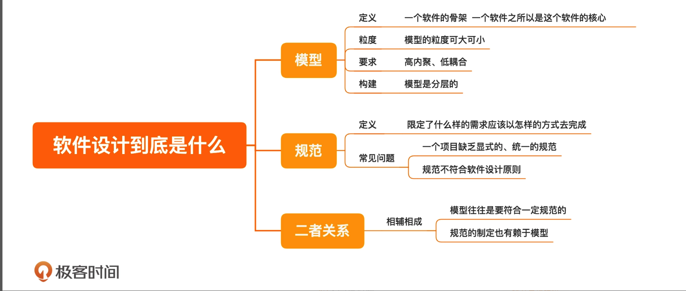
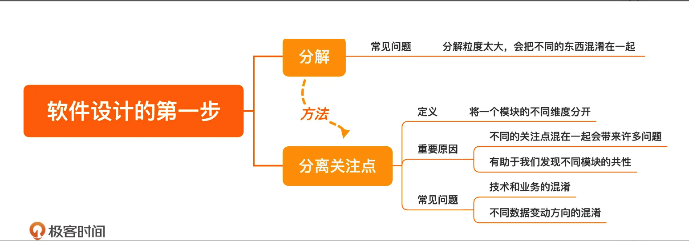
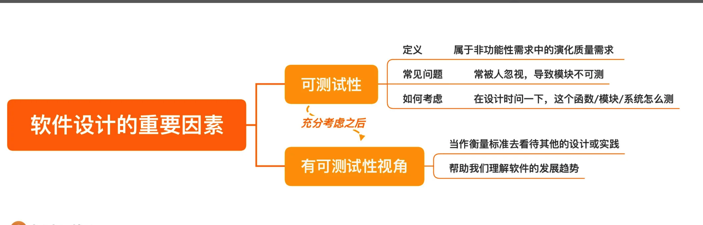
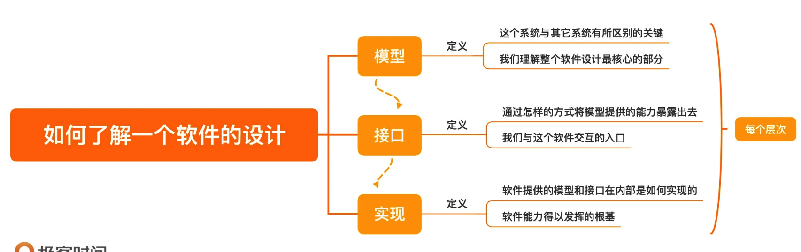
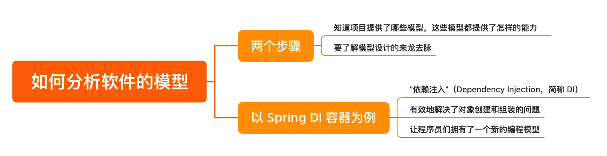
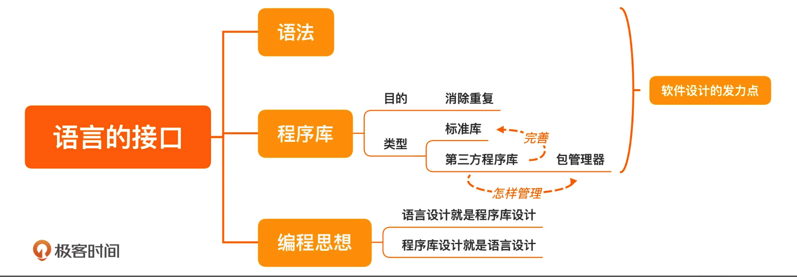

# 软件设计之美

## 开篇词 | 软件设计，应对需求规模的“算法”

算法和软件设计其实是一样的，二者都是对抗的都是规模问题。只不过算法对抗的是数据的规模，而软件设计对抗的是需求的规模

你现在应该理解了，为什么软件设计是一门关注长期的学问了，因为只有长期的积累，需求才会累积，规模问题才会凸显出来。软件设计，实际上就是应对需求的“算法”。

关注长期变化的软件设计
设计是为了让软件在长期更容易适应变化。

如何学习软件设计

软件设计学习的难度，不在于一招一式，而在于融会贯通

对于软件设计：我们可以将其划分为两个维度：“了解现有软件的设计” 和“自己设计一个软件”

一个快速了解现有软件设计的方法，那就是抓住这个软件最核心的三个部分：模型、接口和实现。

例如：

- 我们怎样理解 Spring DI 容器模型，它的模型怎样有效解决了其面对的问题；

- 如何理解 Ruby on Rails 的接口，我们可以从其接口设计中借鉴哪些内容；

- Kafka 的实现有哪些独特之处，实现的诸多细节中，我们应该关注哪些内容。

软件设计的基础知识：

- 程序设计语言；
- 编程范式；
- 设计原则；
- 设计模式；
- 设计方法。

程序设计语言，是软件设计落地的基础。任何设计都依赖程序设计语言来实现。但任何语言也都有自己的局限，我将带领你横跨语言学语言，让你不再局限于某一种语言，而是择其善者而从之，更好地落地你的设计。

编程范式，是代码编写的风格，决定着你在设计时可以用到哪些元素：是模块、是对象，还是函数。在不同层次的设计中，选择不同的编程范式已经成为今天开发的主流。在这个主题下，我选择了几个最主流的编程范式，包括结构化编程、面向对象和函数式编程，帮你建立起软件设计的根基。

设计原则，是你在进入到具体设计的层面时，可以用来评判自己工作结果的一个衡量标准。我会给你介绍面向对象的主流设计原则：SOLID 原则。一来面向对象是当今的主流开发方式，二来 SOLID 原则也是比较成体系的设计原则，它本身也在不断发展。

设计模式，是设计原则在具体场景下的应用。

领域驱动设计

## 01 | 什么是软件设计？

核心的模型

区别于解决简单的问题，软件的开发往往是一项长期的工作，会有许多人参与其中。在这种情况下，就需要建立起一个统一的结构，

而在软件的开发过程中，这种统一的结构就是模型，而软件设计就是要构建出一套模型。

这里所说的模型，不仅包括用来描述业务的各种实体，也包括完成业务功能的各种组件。人们写代码中常常会用到的服务（Service）、调度器（Scheduler）等概念就是一个一个的模型。

模型，是一个软件的骨架，是一个软件之所以是这个软件的核心。

模型的粒度可大可小。如果把模型理解为一个一个的类，是不是你就会熟悉很多了，这就是小的模型。你也可以把一整个系统当作一个整体来理解，这就是大的模型。

“高内聚、低耦合”，（模块的内聚程度越高越好，模块间的耦合程度越低越好），这其实就是对模型的要求

即便是在一个软件内部，模型也可以是分层的。我们可以先从最核心的模型开始构建，有了这个核心模型之后，可以通过组合这些基础的模型，构建出上面一层的模型。

约束的规范

规范，就是限定了什么样的需求应该以怎样的方式去完成。

一种常见的问题就是缺乏显式的、统一的规范。

规范的一个重要作用，就是维系软件长期的演化。如果没有显式的规范，项目的维系只能依靠团队成员个人的发挥，老成员一个没留神，新成员就可能创造出一种诡异的新写法，项目就朝着失控又迈出了一步。

规范，就是限定了什么样的需要求应该以怎样的方式去完成。

一种常见的问题就是缺乏显式的、统一的规范。

规范的一个重要作用，就是维系软件长期的演化。如果没有显式的规范，项目的维系只能依靠团队成员个人的发挥，老成员一个没留神，新成员就可能创造出一种诡异的新写法，项目就朝着失控又迈出了一步。

没有一个统一的规范，每一个项目上的新成员都会痛斥一番前人的不负责任。然后，新的人准备另起炉灶，增加一些新东西。这种场景你是不是很熟悉呢？混乱通常就是这样开始的。

关于规范，还有一种常见问题就是，规范不符合软件设计原则。我给你讲一个让我印象深刻的故事。

只是因为旧的规范不符合软件设计原则而导致的错误：外部请求的对象需要在防腐层转换为内部对象。

模型与规范

有了模型，有了规范，那模型与规范是什么关系呢？模型与规范，二者相辅相成。一个项目最初建立起的模型，往往是要符合一定规范的，而规范的制定也有赖于模型。这就像讨论户型设计时，你可以按照各种方式组合不同的空间（模型），却不会把厨房与卫生间放在一起（规范）。

防腐层的理解： 在限界上下文之间映射（说白了就是交互）的方式，体现在代码上就是一个对象的转换，这个转换的意义在于隔离变化，防止因为对象在一个上下文中的变化扩散到其他的上下文中。

02 | 分离关注点：软件设计至关重要的第一步

技术和业务被混在了一起，随之而来的就是无尽的后患

这与业务并不是一个维度的事情，我们在做设计时，要能够发现这些非功能性的需求。也就是说，我们在分解问题的时候，会有很多维度，每一个维度都代表着一个关注点，这就是设计中一个常见的说法，“分离关注点（Separation of concerns）”。

最常见的一类问题就是把业务处理和技术实现两个关注点混在了一起，

**大部分程序员都不应该编写多线程程序。**

在真实项目中，程序员最常犯的错误就是认为所有问题都是技术问题，总是试图用技术解决所有问题。任何试图用技术去解决其他关注点的问题，只能是陷入焦油坑之中，越挣扎，陷得越深。

另外一个常见的容易产生混淆的关注点是不同的数据变动方向。

不同的数据变动方向：

动静分离，就是把变和不变的内容分开；

读写分离，就是把读和写分开；

前面提到的高频和低频，也可以分解开；

**不同的数据变动方向，就是一个潜在的、可以分离的关注点。**

分离关注点之所以重要，有两方面原因。一方面，不同的关注点混在一起会带来一系列的问题，正如前面提到的各种问题；另一方面，当分解得足够细小，你就会发现不同模块的共性，才有机会把同样的信息聚合在一起。这会为软件设计的后续过程，也就是组合，做好准备。

如果今天的内容你只能记住一件事，那请记住：分离关注点，发现的关注点越多越好，粒度越小越好。

03 | 可测试性： 一个影响软件设计的重要因素

软件设计要考虑“可测试性”

软件开发要解决的问题是从需求而来。需求包括两大类，第一类是功能性需求，也就是要完成怎样的业务功能；第二类是非功能性需求，是业务功能之外的一些需求。

非功能性需求也被分为两大类，一类称为执行质量（Execution qualities），你所熟悉的吞吐、延迟、安全就属于这一类，它们都是可以在运行时通过运维手段被观察到的；而另一类称为演化质量（Evolution qualities），它们内含于一个软件的结构之中，包括可测试性、可维护性、可扩展性等。

我们要保证每个小模块的正确性，就要保证每个模块在开发阶段能够测试，而想要每个模块能够测试，在设计过程中，就要保证每个模块是可以测试的，而这就是可测试性。

一旦我们在可测试性上考虑不足，就会引发一系列的后续问题。比如，复杂的系统不仅仅在测试上有难度，在集成、部署等各个环节，都有其复杂性，完成一次部署往往也需要很长时间。

所以，我们在设计一个函数 / 模块 / 系统时，必须将可测试性纳入考量，以便于能够完成不同层次的测试，减少对集成环境的依赖。

那么，具体该如何做呢？一方面，尽可能地给每个模块更多的测试，使构成系统的每个模块尽可能稳定，把集成测试环境更多地留作公共的验收资源。另一方面，尽可能搭建本地的集成测试环境，周边的系统可以采用模拟服务的方案。

在软件开发过程中考虑测试，实际上是思考软件的质量问题，而把质量的思考前移到开发，甚至是设计阶段，是软件开发从传统进入到现代的重要一步。

04 | 三步走：如何了解一个软件的设计？

模型、接口和实现

了解一个软件的设计可以从三个部分着手： 模型、接口和实现。

这三者的关系就好比你去看代码，你会先去看有哪些类以及它们之间的关系，这就是看模型；然后你会打开一个具体的类，看它提供了哪些方法，这就相当于看接口；最后，你再来打开一个具体的方法，去看它的代码是怎么写的，这就是看实现。

**首先是模型**，它是一个软件的核心部分。在其它的材料里，也有人称之为抽象，为了统一，我这里就都叫模型了。我们在前面的课程里也说过，设计最关键的就是构建出模型。而理解一个设计中的模型，可以帮助我们建立起对这个软件整体的认知。

**其次是接口**，它决定了软件通过怎样的方式，将模型提供的能力暴露出去。它是我们与这个软件交互的入口。如何理解这句话呢？我给你举几个具体的例子。

- 一个程序库的接口就是它的 API，但对于同样的模型，每个人会设计出不同的 API，而不同的 API 有着不同的表达能力。比如：Google 的 Guava 对 JDK 的一些 API 重新做了封装，其目的就是简化开发，而很多优秀的做法后来又被 JDK 学了回去。

- 一个工具软件一般会提供命令行接口，比如，每个程序员必备的基本技能——Unix 命令行工具就是典型的命令行接口。

- 一个业务系统的接口，就是对外暴露的各种接口，比如，它提供的各种 REST API，也可能是提供了 RPC 给其它系统的调用。
- ……

如果你想深入源码，去了解一个软件，接口是一个很好的指向标。你可以从一个接口进入到软件中，看它是怎样完成各种基本功能的。

**最后是实现**，就是指软件提供的模型和接口在内部是如何实现的，这是软件能力得以发挥的根基。这么说可能比较抽象，我再来举些例子。

- 一个业务系统收到一个请求之后，是把信息写到数据库，还是转发给另外的系统。
- 一个算法的实现，是选择调用与别人已有的程序库，还是需要自己实现一个特定的算法。
- 一个系统中的功能，哪些应该做成分布式的，哪些应该由一个中央节点统一处理。
- 一段业务处理，是应该做成单线程，还是多线程的。当资源有竞争，是每个节点自己处理，还是交由一个中间件统一处理。
- 不同系统之间的连接，该采用哪种协议，是自己实现，还是找一个中间件。

在讨论设计时应该遵循一个顺序：，先模型，再接口，最后是实现，同理，了解一个设计也应该遵循这样的顺序。

我还要强调一点，在了解设计时，要按层次去了解，因为设计常常是分层的。每当我们打开一个层次，需要了解它的内部时，我们还要按照模型、接口和实现的顺序解读这个层次。

我用大家比较熟悉的操作系统来举个例子，如果你去了解它的内部，就知道它有内存管理、进程调度、文件系统等模块。我们可以按照模型、接口和实现去理解每个模块，就以进程管理为例：

—— 进程管理的核心模型就包括进程模型和调度算法；
—— 它的接口就包括，进程的创建、销毁以及调度算法的触发等；
—— 不同调度算法就是一个个具体的实现。

今天，我们学习了如何了解一个软件设计，可以从三个部分入手：模型、接口和实现。

模型，也可以称为抽象，是一个软件的核心部分，是这个系统与其它系统有所区别的关键，是我们理解整个软件设计最核心的部分。

接口，是通过怎样的方式将模型提供的能力暴露出去，是我们与这个软件交互的入口。

实现，就是软件提供的模型和接口在内部是如何实现的，是软件能力得以发挥的根基。

05 | Spring DI 容器：如何分析一个软件的模型？

今天这一讲，我们就先来谈谈了解设计的第一步：模型。如果拿到一个项目，我们怎么去理解它的模型呢？我们肯定要先知道项目提供了哪些模型，模型又提供了怎样的能力。

我们都知道，任何模型都是为了解决问题而生的，所以，理解一个模型，需要了解在没有这个模型之前，问题是如何被解决的，这样，你才能知道新的模型究竟提供了怎样的提升。也就是说，理解一个模型的关键在于，要了解这个模型设计的来龙去脉，知道它是如何解决相应的问题。

耦合的依赖

Spring DI 容器的模型，就是一个典型的模型。它的核心模型就是依赖注入（Dependency Injection，简称 DI），它的接口就是 BeanFactory 和 ApplicationContext，它的实现就是 DefaultListableBeanFactory 和 ClassPathXmlApplicationContext。

那么，DI 容器要解决的问题是什么呢？它解决的是组件创建和组装的问题，但是为什么这是一个需要解决的问题呢？这就需要我们了解一下组件的创建和组装。

分离的依赖

把所有的对象创建和组装在一个地方完成：

...
ArticleRepository repository = new DBArticleRepository(connection);
AriticleService service = new ArticleService(repository);
...

虽然很无聊，但这一部分代码很重要，最好的解决方案就是有一个框架把它解决掉。在 Java 世界里，这种组装一堆对象的东西一般被称为“容器”，我们也用这个名字。

Container container = new Container();
container.bind(Connection.class).to(connection);
container.bind(ArticleReposistory.class).to(DBArticleRepository.class);
container.bind(ArticleService.class).to(ArticleService.class)

ArticleService service = container.getInstance(ArticleService.class);

至此，一个容器就此诞生。因为它解决的是依赖的问题，把被依赖的对象像药水一样，注入到了目标对象中，所以，它得名“依赖注入”（Dependency Injection，简称 DI）。这个容器也就被称为 DI 容器了。

有了 di 容器，对象的创建和组装都由 di 容器完成了。

而且，一旦有了容器的概念，它还可以不断增强。比如，我们想给所有与数据库相关的代码加上时间监控，只要在容器构造对象时添加处理即可。你可能已经发现了，这就是 AOP（Aspect Oriented Programming，面向切面编程）的处理手法。而这些改动，你的业务代码并无感知。

理解模型，要了解模型设计的来龙去脉。

06 | Ruby on Rails：如何分析一个软件的接口？

Ruby on Rails 模型

Rails 是标准的基于 MVC 模型进行开发的 Web 框架。

前面我提到过理解接口应该先找主线，找到项目主线的一个方法就是从起步走文档开始，因为它会把项目最基本的用法展现给你，你可以轻松地找到主线。

有了主线之后，我们就要开始从中了解接口的风格。Rails 给我们提供的三种接口，分别是：

Web 应用对外暴露的接口：
REST API；程序员写程序时用到的接口：
API；程序员在开发过程中用到的接口：命令行。

总结时刻：理解一个项目的接口，先找主线，再看风格。

07 | Kafka：如何分析一个软件的实现？

你需要找到两个关键点：软件的结构和关键的技术。

Kafka

Kafka 是一个分布式流平台。这是它现在的发展方向，但在更多人的心目中，Kafka 的角色是一个消息队列

消息队列还有一个最常见的特性是，它会提供一定的消息存储能力。这样的话，当生产者发消息的速度快于消费者处理消息的速度时，消息队列可以起到一定的缓冲作用。所以，有一些系统会利用消息队列的这个特性做“削峰填谷”，也就是在消息量特别大时，先把消息收下来，慢慢处理，以减小系统的压力。

消息队列实现消息存储的方式通常是把它写入到磁盘中，而 Kafka 的不同之处在于，它利用了磁盘顺序读写的特性。

如果站在了解实现的角度，你会觉得非常地自然。但要想从设计的角度学到更多，我们还是应该带着问题上路，多问自己一个问题，为什么其他的消息队列之前不这么做呢？这是一个值得深思的问题。Kafka 这个实现到底是哪里不容易想到呢？答案是软硬结合。

之前的消息队列实现也会把消息写入到文件里，但文件对它们来说，只是一个通用的接口。开发者并没有想过利用硬件的特性做开发。而 Kafka 的开发者突破了这个限制，把硬件特性利用了起来，从而取得了更好的结果。

总结时刻：
如果想了解一个系统的实现，应该从软件结构和关键技术两个方面着手。

08 | 语言的模型：如何打破单一语言局限，让设计更好地落地？

发展，就是函数式编程的程序设计语言，这方面的代表就是 LISP。

一切语法都是语法糖

学习程序设计语言其实就是要学习语言提供的编程模型，不提供新编程模型的语言是不值得刻意学习的。

如果你已经学会了一两门程序设计语言，学习一门新的语言其实并不困难，因为每种语言提供的新模型是有限的，基本的元素是类似的，无非是用了不同的关键字。

所以，学习新语言，只是在做增量的学习，思维负担并没有那么沉重。一旦对于程序设计语言的模型有了新的认识，你就能理解一件事：一切语法都是语法糖。

09 | 语言的接口：语法和程序库，软件设计的发力点

程序库就是为了消除重复而出现的。而消除重复，也是软件设计的初衷。

程序库（Library）是程序员最熟悉的一项内容。学习一门新语言，首先是学习语法（Syntax），然后学习程序库（Library），之后再学习运行时（Runtime），这样，你就具备一门语言的基础了。再往后，你需要了解的就是各种惯用法（Idiom），以及如何运用到实际的工作中。

一个经过验证的模式最终变成了语言的一部分，而它的起点只是一个常见的用法：一个程序库。

通常是先有程序库，再有语法；如果语法不够好，新的程序库就会出现，新一轮的编程模型就开始孵化。

js 也是如此，后面出的 es20xx，的各种新语法特性，很多都是来自程序库。

一切有生命力的语言都会不断改善自己的语法，某些好用的程序库就可以转正成为语法。

总结时刻

提升软件设计能力，可以从编写程序库入手

10 | 语言的实现：运行时，软件设计的地基

程序设计语言的实现就是支撑程序运行的部分：运行时，也有人称之为运行时系统，或运行时环境，它主要是为了实现程序设计语言的执行模型。

相比于语法和程序库，我们在学习语言的过程中，对运行时的关注较少。因为不理解语言的实现依然不影响我们写程序，那我们为什么还要学习运行时呢？

因为运行时，是我们做软件设计的地基。

我用个例子来进行说明，我曾经参与过一个开源项目：在 JVM 上运行 Ruby。这种行为肯定不是 Java 语言支持的，为了让 Ruby 能够运行在 JVM 上，我们将 Ruby 的代码编译成了 Java 的字节码，而字节码就属于运行时的一部分。

react 的运行时，也是如此，将 jsx 通过 babel 编译成 js，然后在浏览器中运行。

做设计真正的地基，并不是程序设计语言，而是运行时，有了对于运行时的理解，我们甚至可以做出语言本身不支持的设计。
