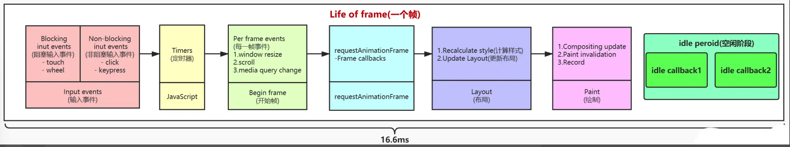
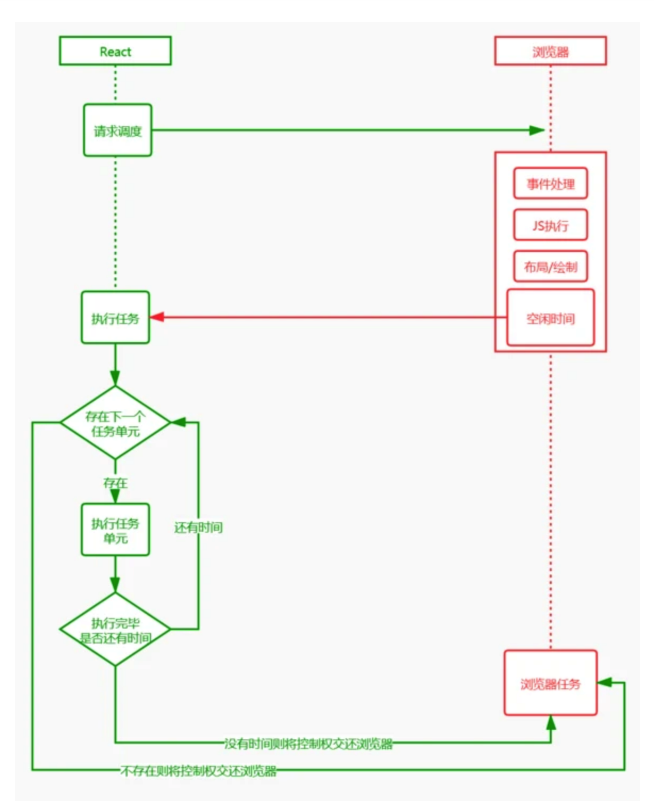

# fiber

react 的 jsx 语法会被编译成 react.createElement:

React 用$$typeof 标识了一个 React element, 而每个这样的 element 对应了一个 fiber。

## 什么是 fiber

Fiber 是 React 16 引入的一种新的协调算法（Reconciliation Algorithm）和架构。它的核心是一个虚拟栈帧，可以理解为一种轻量级的 JavaScript 对象，用于描述组件树的结构和状态。

- 一个 fiber 就是一个对象结构，包含了一系列要完成的任务。
- react 的每一个 element 都对应了一个 fiber（一棵 elements 树就对应了一棵 fiber 节点树）。
- 一个 fiber 不会在每次 render 中重新创建，相反，它是一个可以被操作改变的数据结构，保留了组件的状态和 dom。所以操作在每个 fiber 上任务（更新，删除等）都可以映射到对应的 element。

## 为什么要用 fiber

- 暂停任务，并且可以稍后继续
- 为不同的任务标记优先级
- 重用之前完成的任务
- 终止不再需要的任务

react 有了优先级调度(schedule)的能力, 也让 react 能把 reconciliation (计算哪一部分的 element 树需要被更新, 计算更新的这一步也被分为很多 unit, 防止阻塞主线程 ) 和 render( 使用那些计算好的更新信息, 把更新渲染到用户屏幕上) 分开, 使得 reconciliation 可以重用在不同平台上( react native,react dom)

几个重要的属性

```js
{
    type: React.createElement 对应的type，表明这个fiber 节点对应的element
    tag: 表明fiber 的类型
    pendingProps: 已经是被更新的props，需要被运用到子组件或者dom 元素上
    key: 对应prop 上的key
    stateNode:  dom节点(HostComponent) / 类组件的实例 (ClassComponent) / fn() (FunctionComponent)
    nextEffect:  指向下一个**effect list**中的节点 （effect list：一个workInProgress（finishedWork）的子树，是在render阶段 最终需要决定被执行更新 的产物，会在commit阶段被处理）
    effectTag:  当前fiber需要执行的副作用类型
    alternate:  用于构成**workInProgress**（从当前fiber树构建而来，反应了需要被更新渲染到用户屏幕的状态树）
    return: 指向父fiber节点
    sibling: 指向兄弟fiber节点
    child： 指向child fiber节点
  }
```

# fiber 与 fiber tree

react 运行时存在 3 中实例:

```js
DOM 真实DOM节点
-------
Instances React维护的vDOM tree node
-------
Elements 描述UI长什么样子（type, props）
```

Instances 是根据 Elements 创建的，对组件及 DOM 节点的抽象表示，vDOM tree 维护了组件状态以及组件与 DOM 树的关系

在首次渲染过程中构建出 vDOM tree，后续需要更新时（setState()），diff vDOM tree 得到 DOM change，并把 DOM change 应用（patch）到 DOM 树

fiber 之前的 reconciler（被称为 Stack reconciler）自顶向下的递归 mount/update，无法中断（持续占用主线程），这样主线程上的布局、动画等周期性任务以及交互响应就无法立即得到处理，影响体验

Fiber 解决这个问题的思路是把渲染/更新过程（递归 diff）拆分成一系列小任务，每次检查树上的一小部分，做完看是否还有时间继续下一个任务，有的话继续，没有的话把自己挂起，主线程不忙的时候再继续

增量更新需要更多的上下文信息，之前的 vDOM tree 显然难以满足，所以扩展出了 fiber tree（即 Fiber 上下文的 vDOM tree），更新过程就是根据输入数据以及现有的 fiber tree 构造出新的 fiber tree（workInProgress tree）。因此，Instance 层新增了这些实例：

## 关于 Fiber 需要知道的基础知识

1. 浏览器刷新率（帧）



1. 接受输入事件
2. 执行事件回调
3. 开始一帧
4. 执行 RAF（requestAnimationFrame）
5. 页面布局，样式计算
6. 渲染
7. 执行 RIC（requestIdleCallback）

第七步的 RIC 事件不是每一帧结束都会执行，只有在一帧的 16ms 中做完了前面 6 件事儿且还有剩余时间，才会执行。

### JS 原生执行栈

在 react fiber 出现之前，react 通过原生执行栈递归遍历 VDOM。当浏览器引擎第一次遇到 JS 代码时，会产生一个全局执行上下文并将其压入执行栈，如此往复。

浏览器引擎会从执行栈的顶端开始执行，执行完毕就弹出当前执行上下文，开始执行下一个函数，知道执行栈被清空才会停止。然后将执行权交还给浏览器。由于 React 将页面视图视作一个个函数执行的结果。每一个页面往往由多个视图组成，这就意味着多个函数的调用。

浏览器得不到控制权，就不能及时开始下一帧的绘制。如果这个时间超过 16ms，当页面有动画效果需求时，动画因为浏览器不能及时绘制下一帧，这时动画就会出现卡顿，不仅如此，因为事件响应代码是在每一帧开始的时候执行，如果不能及时绘制下一帧，事件响应也会延迟

### 时间分片

时间分片指的是一种将多个粒度小的任务放入一个时间切片（一帧）中执行的一种方案，在 React Fiber 中就是将多个任务放在了一个时间片中去执行

### 链表

在 React Fiber 用链表遍历的方式替代了 React 16 之前的栈递归方案

使用多向链表的形式替代了原来的树结构

- 副作用单链表
- 状态更新单链表

### React Fiber 是如何实现更新过程可控？

更新可控主要提现在这几方面 1.任务拆分 2.任务挂起、恢复、终止 3.任务具备优先级

1.任务拆分
React Fiber 之前是基于原生执行栈，每一次更新操作会一直占用主线程，直到更新完成。这可能会导致事件响应延迟，动画卡顿等现象。

在 React Fiber 机制中，它采用『化整为零』的战术，将调和阶段（Reconciler）递归遍历 VDOM 这个大任务拆分成若干小任务，每个任务只负责一个节点的处理

```javascript
import React from "react";
import ReactDom from "react-dom";
const jsx = (
  <div id="A1">
    A1
    <div id="B1">
      B1
      <div id="C1">C1</div>
      <div id="C2">C2</div>
    </div>
    <div id="B2">B2</div>
  </div>
);
ReactDom.render(jsx, document.getElementById("root"));
```

这个组件在渲染的时候会被分成八个小任务，每个任务用来分别处理 A1(div)、A1(text)、B1(div)、B1(text)、C1(div)、C1(text)、C2(div)、C2(text)、B2(div)、B2(text)。再通过时间分片，在一个时间片中执行一个或者多个任务。**_这里提一下，所有的小任务并不是一次性被切分完成，而是处理当前任务的时候生成下一个任务，如果没有下一个任务生成了，就代表本次渲染的 Diff 操作完成。_**

2.挂起、、恢复、终止
react 有两颗 Fiber 树，workInProgress tree 和 currentFiber tree。

workInProgress 代表当前正在执行更新的 Fiber 树。（在 render 或者 setState 后，会构建一颗 Fiber 树，也就是 workInProgress tree，这棵树在构建每一个节点的时候会收集当前节点的副作用，整棵树构建完成后，会形成一条完整的副作用链）

currentFiber 表示上次渲染构建的 Fiber 树。**在每一次更新完成后 workInProgress 会赋值给 currentFiber。**在新一轮更新时 workInProgress tree 再重新构建，新 workInProgress 的节点通过 alternate 属性和 currentFiber 的节点建立联系。



## Fiber 架构的核心特性

1. 增量渲染

   Fiber 将渲染任务拆分为多个小任务，可以分批次执行，避免一次性占用主线程。

2. 任务优先级：

   Fiber 支持为不同的更新任务分配优先级（如用户交互、动画、数据更新等），确保高优先级任务优先执行。

3. 并发模式（Concurrent Mode）：

   Fiber 是 React 并发模式的基础，支持并发渲染和异步更新。

4. 错误边界：

   Fiber 引入了错误边界（Error Boundaries），可以捕获组件树中的错误，避免整个应用崩溃。

## Fiber 渲染过程分为两个阶段

1. Reconciliation 阶段（协调阶段）：

   - 在这个阶段，React 会遍历 Fiber 树，找出需要更新的节点，并生成一个副作用列表（Effect List）。
   - 这个阶段是可中断的，React 可以根据优先级暂停或恢复任务。

2. Commit 阶段（提交阶段）：

   - 在这个阶段，React 会一次性将所有的更新应用到 DOM 上。
   - 这个阶段是不可中断的，确保 DOM 更新的原子性。

---

上图是一个简易的整个 react 初始化的流程，在开始实现 useRef​ 前，有必要先来梳理一下 react 整个执行流程。

​render​

由于使用 jsx 由 babel 处理后的数据结构并不是真正的 dom 节点，而是 element​ 结构，一种拥有标记及子节点列表的对象，所以在拿到 element​ 对象后，首先要转化为 fiber​ 节点。

在 fiber​ 架构中，更新操作发生时，react 会存在两棵 fiber​ 树（current​ 树和 workInProgress​ 树），current​ 树是上次更新生成的 fiber​ 树（初始化阶段为 null），workInProgress​ 树是本次更新需要生成的 fiber​ 树。双缓存树的机制是判断当前处于那个阶段（初始化/更新），复用节点属性的重要依据。在本次更新完成后两棵树会互相转换。
​render​ 阶段实际上是在内存中构建一棵新的 fiber​ 树（称为 workInProgress​ 树），构建过程是依照现有 fiber​ 树（current​ 树）从 root​ 开始深度优先遍历再回溯到 root​ 的过程，这个过程中每个 fiber​ 节点都会经历两个阶段：beginWork​ 和 completeWork​。
​beginWork​ 是向下调和的过程。就是由 fiberRoot​ 按照 child 指针逐层向下调和，而 completeWork​ 是向上归并的过程，如果有兄弟节点，会返回 sibling​(同级)兄弟，没有返回 return​ 父级，一直返回到 FiebrRoot​。
组件的状态计算、diff​ 的操作以及 render​ 函数的执行，发生在 beginWork​ 阶段，effect​ 链表的收集、被跳过的优先级的收集，发生在 completeWork​ 阶段。构建 workInProgress​ 树的过程中会有一个 workInProgress​ 的指针记录下当前构建到哪个 fiber​ 节点，这是 react 更新任务可恢复的重要原因之一。
‍

​commit​

在 render​ 阶段结束后，会进入 commi​t 阶段，该阶段不可中断，主要是去依据 workInProgress​ 树中有变化的那些节点（render​ 阶段的 completeWork​ 过程收集到的 effect​ 链表）,去完成 DOM 操作，将更新应用到页面上，除此之外，还会异步调度 useEffect​ 以及同步执行 useLayoutEffect​。
​commit​ 细分可以分为三个阶段：

​Before mutation​ 阶段：执行 DOM 操作前

没修改真实的 DOM ，是获取 DOM 快照的最佳时期，如果是类组件有 getSnapshotBeforeUpdate​，会在这里执行。

​mutation​ 阶段：执行 DOM 操作

对新增元素，更新元素，删除元素。进行真实的 DOM 操作。

​layout​ 阶段：执行 DOM 操作后

DOM 已经更新完毕。

著作权归作者所有。商业转载请联系作者获得授权，非商业转载请注明出处。
